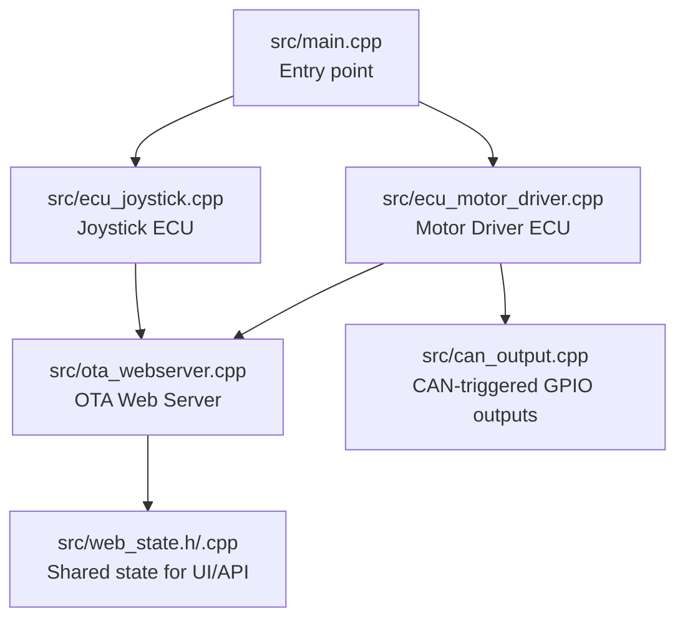
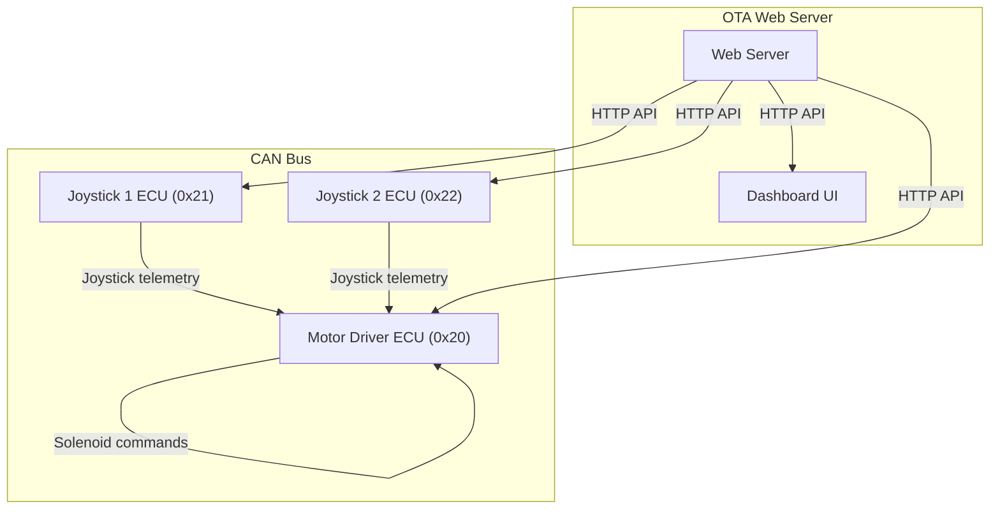
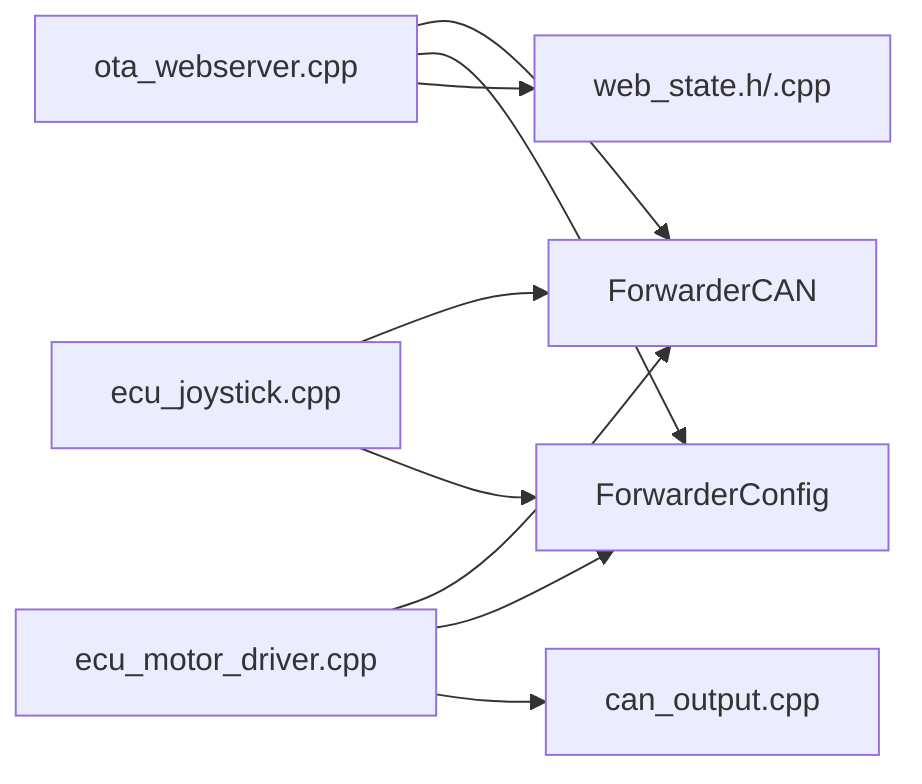

# API Reference

<cite>
**Referenced Files in This Document**
- [README.md](file://README.md)
- [platformio.ini](file://platformio.ini)
- [src/main.cpp](file://src/main.cpp)
- [src/web_state.h](file://src/web_state.h)
- [src/web_state.cpp](file://src/web_state.cpp)
- [src/ota_webserver.h](file://src/ota_webserver.h)
- [src/ota_webserver.cpp](file://src/ota_webserver.cpp)
- [src/ecu_motor_driver.cpp](file://src/ecu_motor_driver.cpp)
- [src/ecu_joystick.cpp](file://src/ecu_joystick.cpp)
- [src/can_output.h](file://src/can_output.h)
- [src/can_output.cpp](file://src/can_output.cpp)
</cite>

## Table of Contents
1. [Introduction](#introduction)
2. [Project Structure](#project-structure)
3. [Core Components](#core-components)
4. [Architecture Overview](#architecture-overview)
5. [Detailed Component Analysis](#detailed-component-analysis)
6. [Dependency Analysis](#dependency-analysis)
7. [Performance Considerations](#performance-considerations)
8. [Troubleshooting Guide](#troubleshooting-guide)
9. [Conclusion](#conclusion)
10. [Appendices](#appendices)

## Introduction
This document provides a comprehensive API reference for ForwarderKE, covering:
- HTTP REST API endpoints for device configuration, status queries, and control commands
- CAN message protocol specification with complete message format definitions, parameter ranges, and timing requirements
- Web interface API for dashboard integration, configuration management, and OTA update interfaces
- Practical usage examples with curl commands and JavaScript client patterns
- API versioning, backward compatibility, deprecation, rate limiting, security, and performance guidance

ForwarderKE is an ESP32-S3-based CAN bus control system implementing a J1939-like addressing scheme over 250 kbps CAN. It supports three ECU roles:
- Motor Driver (address 0x20): Controls 8 solenoids via PCA9685 PWM driver
- Joystick 1 (address 0x21): Reads 3 pots + 2 buttons, publishes on CAN
- Joystick 2 (address 0x22): Reads 3 pots + 2 buttons, publishes on CAN

OTA builds include a Wi-Fi access point and web upload interface for firmware updates.

**Section sources**
- [README.md:1-131](file://README.md#L1-L131)

## Project Structure
The project is organized around a small set of source files and build environments:
- Entry point selects ECU type via build flags
- Motor driver and joystick ECUs implement distinct behaviors
- OTA web server exposes HTTP endpoints and a dashboard UI
- CAN output module enables GPIO reactions to CAN frames

**Diagram sources**
- [src/main.cpp:11-17](file://src/main.cpp#L11-L17)
- [src/ecu_motor_driver.cpp:290-325](file://src/ecu_motor_driver.cpp#L290-L325)
- [src/ecu_joystick.cpp:159-192](file://src/ecu_joystick.cpp#L159-L192)
- [src/ota_webserver.cpp:766-791](file://src/ota_webserver.cpp#L766-L791)
- [src/can_output.cpp:7-19](file://src/can_output.cpp#L7-L19)
- [src/web_state.h:10-23](file://src/web_state.h#L10-L23)

**Section sources**
- [src/main.cpp:11-17](file://src/main.cpp#L11-L17)
- [platformio.ini:17-80](file://platformio.ini#L17-L80)

## Core Components
- HTTP REST API (OTA-enabled builds)
  - Endpoints: GET /api/state, GET/POST /api/config, POST /api/identify, POST /api/address, GET/POST /api/canoutput, POST /update
  - Dashboard UI served at /
- CAN Protocol (J1939-like, 29-bit extended IDs)
  - Priority(3) | DP(1) | PF(8) | PS/DA(8) | SA(8)
  - Message definitions include address claiming, joystick telemetry, LED control, solenoid commands, heartbeat/status
- CAN Output Rules
  - Match PF/SA and toggle or momentary-pulse a GPIO pin
- Web State
  - Exposes shared runtime state for the dashboard and API clients

**Section sources**
- [src/ota_webserver.cpp:780-789](file://src/ota_webserver.cpp#L780-L789)
- [README.md:22-46](file://README.md#L22-L46)
- [src/can_output.cpp:29-61](file://src/can_output.cpp#L29-L61)
- [src/web_state.h:10-23](file://src/web_state.h#L10-L23)

## Architecture Overview
The system comprises two primary ECUs plus optional OTA web server:
- Motor Driver ECU: Receives joystick inputs, maps axes to solenoid outputs, manages LEDs, and broadcasts heartbeat
- Joystick ECU: Reads analog pots/buttons, publishes telemetry, responds to LED/color and identify commands
- OTA Web Server: Provides HTTP endpoints and a dashboard UI for configuration and OTA updates

**Diagram sources**
- [README.md:10-14](file://README.md#L10-L14)
- [src/ota_webserver.cpp:766-791](file://src/ota_webserver.cpp#L766-L791)
- [src/ecu_motor_driver.cpp:184-275](file://src/ecu_motor_driver.cpp#L184-L275)
- [src/ecu_joystick.cpp:114-144](file://src/ecu_joystick.cpp#L114-L144)

## Detailed Component Analysis

### HTTP REST API
Available endpoints (OTA-enabled builds):
- GET /
  - Returns the dashboard HTML page
- GET /api/state
  - Returns system state: local address, online status, uptime, TX/RX/error counts, joystick data, solenoid values, discovered modules
- GET /api/config
  - Returns axis mapping configuration
- POST /api/config
  - Accepts axis mapping configuration payload; saves locally on motor driver and broadcasts to motor driver from joystick
- POST /api/identify
  - Triggers identify action for a target address
- POST /api/address
  - Requests a new address for a target module
- GET /api/canoutput
  - Returns CAN output rules
- POST /api/canoutput
  - Accepts CAN output rules payload; saves locally and reinitializes GPIO outputs
- POST /update
  - Performs firmware update via multipart upload

Request/Response Schemas
- /api/state
  - Fields: localAddr (number), online (boolean), uptime (number), txCount (number), rxCount (number), errCount (number), joy (object keyed by address), sol (array of numbers), modules (object keyed by address)
- /api/config
  - Fields: pcaCount (number), axes (array of objects with keys: sourceAddress, potIndex, outputChannel, deadbandMin, deadbandMax, pwmMin, pwmMax, flags)
- /api/canoutput
  - Fields: rules (array of objects with keys: enabled, matchPF, matchSA, gpioPin, mode, momentaryMs)
- /api/identify, /api/address
  - Request body: { target: number }, { target: number, address: number }
  - Response: { ok: true }

Authentication
- No authentication is implemented for HTTP endpoints.

Error Codes
- 200 OK for successful requests
- 500 Internal Server Error for OTA update failures

Rate Limiting
- Not implemented. Clients should throttle polling to avoid saturating the network stack.

Security Considerations
- OTA endpoint accepts uploads without authentication; deploy behind a trusted network or firewall
- No TLS termination in OTA builds; use wired or secure LAN connections

Practical Examples
- Get state: curl -s http://forwarder-motor.local/api/state
- Save axis mapping: curl -s -X POST -H "Content-Type: application/json" --data-binary '{"axes":[{"axisIdx":0,"sourceAddress":33,"potIndex":0,"outputChannel":0,"deadbandMin":492,"deadbandMax":532,"pwmMin":64,"pwmMax":128,"flags":1}]}' http://forwarder-motor.local/api/config
- Identify module: curl -s -X POST -H "Content-Type: application/json" --data-binary '{"target":33}' http://forwarder-motor.local/api/identify
- Upload firmware: curl -s -F "firmware=@firmware.bin" http://192.168.4.1/update

JavaScript Client Patterns
- Polling: setInterval(() => fetch('/api/state'), 200)
- Saving configuration: fetch('/api/config', { method: 'POST', headers: {'Content-Type':'application/json'}, body: JSON.stringify({axes}) })
- OTA upload: new XMLHttpRequest().upload.addEventListener('progress', e => console.log('Progress:', e.loaded/e.total))

**Section sources**
- [src/ota_webserver.cpp:506-737](file://src/ota_webserver.cpp#L506-L737)
- [src/ota_webserver.cpp:565-626](file://src/ota_webserver.cpp#L565-L626)
- [src/ota_webserver.cpp:659-703](file://src/ota_webserver.cpp#L659-L703)
- [src/ota_webserver.cpp:705-737](file://src/ota_webserver.cpp#L705-L737)
- [src/web_state.cpp:6-19](file://src/web_state.cpp#L6-L19)

### CAN Message Protocol
Protocol Layout
- ID: Priority(3) | DP(1) | PF(8) | PS/DA(8) | SA(8)
- Bitrate: 250 kbps
- Addressing: J1939-like with reserved address range 0x20–0xEF

Message Definitions
- Address Claimed (PF 0xEE, PS 0xFF): 8-byte NAME payload
- Request Address Claimed (PF 0xEA, PS 0xFF): No payload
- Joystick Pot 1..3 (PF 0x10..0x12, PS 0xFF): 2-byte value_lo,value_hi (10-bit ADC)
- Joystick Buttons (PF 0x13, PS 0xFF): 1 byte bitmask (bit 0=btn1, bit 1=btn2)
- Set LED Color (PF 0x20, DA=target or broadcast): 3 bytes RGB
- Solenoid Command (PF 0x21, DA=target): 8 bytes duty0..duty7 (scaled to 12-bit)
- Heartbeat/Status (PF 0x30, PS 0xFF): Uptime, counters, flags

Parameter Ranges and Notes
- Pot values: 0–1023 (10-bit)
- Duty values: 0–255 (scaled to 12-bit output)
- Address range: 0x20–0xEF
- Broadcast: PS=0xFF or DA=0xFF

Timing Requirements
- Heartbeat interval: 1 second
- Safety timeout: 500 ms; motor driver shuts off solenoids if no command received within this period

Safety and Bus Behavior
- Address claiming: J1939-style startup arbitration prevents collisions
- Bus-off recovery: Automatic TWAI recovery on CAN errors

**Section sources**
- [README.md:22-46](file://README.md#L22-L46)
- [README.md:105-111](file://README.md#L105-L111)
- [src/ecu_motor_driver.cpp:32-34](file://src/ecu_motor_driver.cpp#L32-L34)
- [src/ecu_motor_driver.cpp:184-275](file://src/ecu_motor_driver.cpp#L184-L275)
- [src/ecu_joystick.cpp:114-144](file://src/ecu_joystick.cpp#L114-L144)

### Web Interface API
The dashboard UI is embedded in the OTA web server and communicates with the HTTP API:
- Tabs: Dashboard, Modules, Motor Mapping, CAN Output, OTA Update
- Real-time updates: Polls /api/state every 200 ms
- Configuration management: Saves axis mapping and CAN output rules via POST endpoints
- OTA update: Uploads .bin firmware via /update

Integration Patterns
- Use /api/state for live telemetry and status
- Use /api/config and /api/canoutput to manage mappings and GPIO triggers
- Use /api/identify and /api/address to manage addresses

**Section sources**
- [src/ota_webserver.cpp:32-501](file://src/ota_webserver.cpp#L32-L501)
- [src/ota_webserver.cpp:360-497](file://src/ota_webserver.cpp#L360-L497)

### CAN Output Rules
Purpose
- React to incoming CAN messages by toggling or momentary-pulsing a GPIO pin (e.g., drive a relay)

Behavior
- Matching: PF and optional SA
- Modes: Toggle (mode=0) or Momentary (mode=1) with configurable pulse duration
- Initialization: Pins configured on boot according to loaded rules

Data Structures
- Rule fields: enabled (boolean), matchPF (number), matchSA (number), gpioPin (number), mode (number), momentaryMs (number)

**Section sources**
- [src/can_output.h:7-11](file://src/can_output.h#L7-L11)
- [src/can_output.cpp:7-61](file://src/can_output.cpp#L7-L61)
- [src/ecu_motor_driver.cpp:184-187](file://src/ecu_motor_driver.cpp#L184-L187)

## Dependency Analysis
High-level dependencies among components:
- OTA web server depends on ForwarderCAN, ForwarderConfig, and web_state for state exposure
- Motor driver and joystick ECUs depend on ForwarderCAN for message handling
- CAN output module depends on ForwarderCAN and ForwarderConfig for rule storage

**Diagram sources**
- [src/ota_webserver.cpp:1-11](file://src/ota_webserver.cpp#L1-L11)
- [src/ecu_motor_driver.cpp:1-12](file://src/ecu_motor_driver.cpp#L1-L12)
- [src/ecu_joystick.cpp:1-9](file://src/ecu_joystick.cpp#L1-L9)
- [src/can_output.cpp:1-1](file://src/can_output.cpp#L1-L1)

**Section sources**
- [src/ota_webserver.cpp:1-11](file://src/ota_webserver.cpp#L1-L11)
- [src/ecu_motor_driver.cpp:1-12](file://src/ecu_motor_driver.cpp#L1-L12)
- [src/ecu_joystick.cpp:1-9](file://src/ecu_joystick.cpp#L1-L9)

## Performance Considerations
- Polling frequency: The dashboard polls /api/state every 200 ms; adjust for client needs
- CAN throughput: Heartbeats every 1 second; joystick telemetry sent on change or at ~10 Hz
- OTA upload: Progress reported via XMLHttpRequest progress events
- Safety timeout: 500 ms to prevent stale actuator states

[No sources needed since this section provides general guidance]

## Troubleshooting Guide
Common issues and remedies:
- OTA update fails: Verify .bin file and network connectivity; check serial logs for error details
- No joystick data: Confirm address (0x21 or 0x22) and wiring; ensure heartbeat is observed
- Solenoid not responding: Check axis mapping and deadband configuration; verify safety timeout conditions
- Address conflicts: Use /api/address to assign a new address; confirm with /api/state

**Section sources**
- [src/ota_webserver.cpp:705-737](file://src/ota_webserver.cpp#L705-L737)
- [src/ecu_motor_driver.cpp:332-337](file://src/ecu_motor_driver.cpp#L332-L337)
- [src/ecu_joystick.cpp:218-225](file://src/ecu_joystick.cpp#L218-L225)

## Conclusion
ForwarderKE provides a compact, extensible CAN control system with a straightforward HTTP API and a J1939-like protocol. The OTA-enabled builds offer a practical dashboard and firmware update mechanism suitable for field deployment. Adhering to the documented endpoints, message formats, and configuration schemas enables reliable integration for logging machine applications.

[No sources needed since this section summarizes without analyzing specific files]

## Appendices

### API Versioning and Compatibility
- No explicit API versioning headers or routes are present
- Backward compatibility is not explicitly enforced; future changes should incrementally modify payloads and document deprecations
- Deprecation procedure: Announce in release notes and maintain dual support windows before removal

[No sources needed since this section provides general guidance]

### Security and Access Control
- HTTP endpoints are unauthenticated; restrict access to trusted networks
- OTA upload endpoint does not require credentials; avoid exposing to untrusted networks
- Consider deploying behind a firewall or VPN for production use

[No sources needed since this section provides general guidance]

### Build and Deployment Notes
- Build environments define ECU types, preferred addresses, and optional OTA support
- OTA builds enable Wi-Fi AP and web UI; non-OTA builds omit the web server

**Section sources**
- [platformio.ini:17-80](file://platformio.ini#L17-L80)