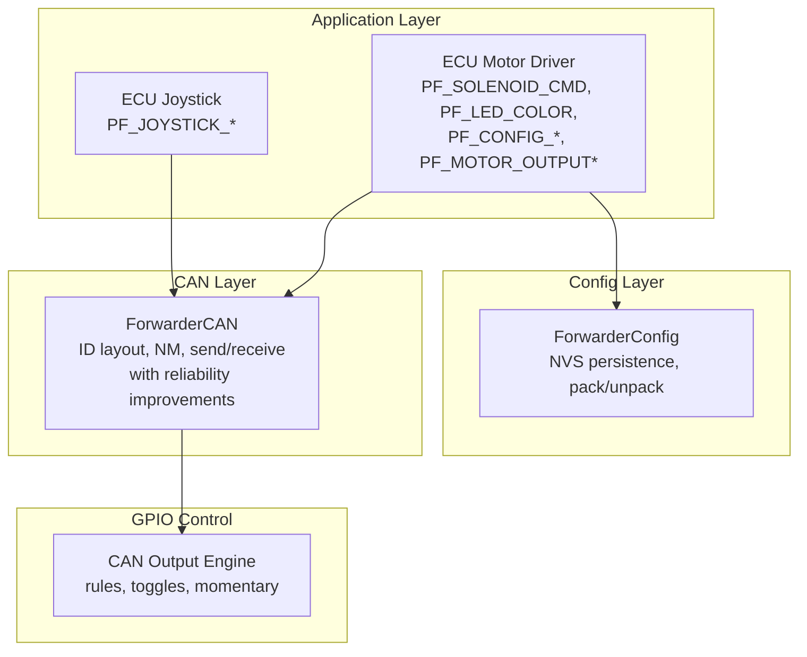
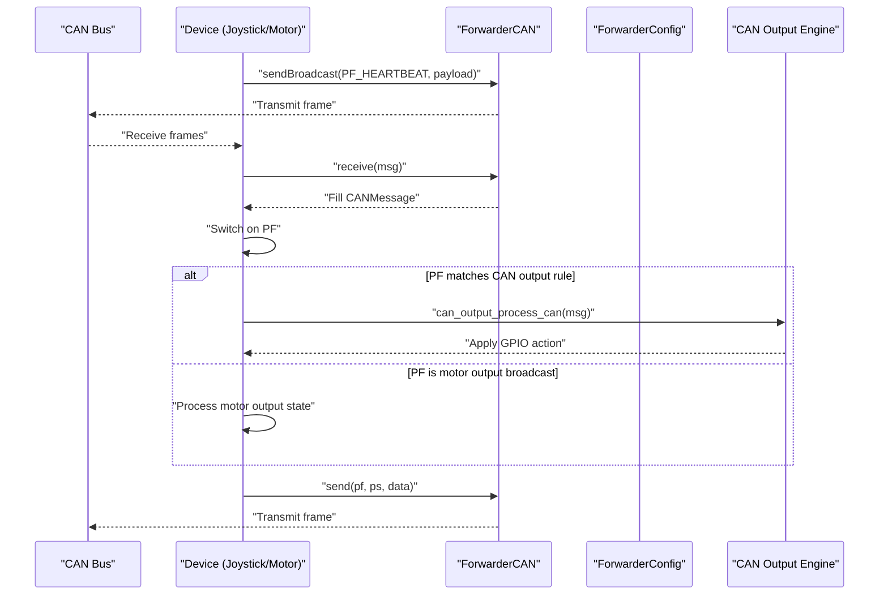
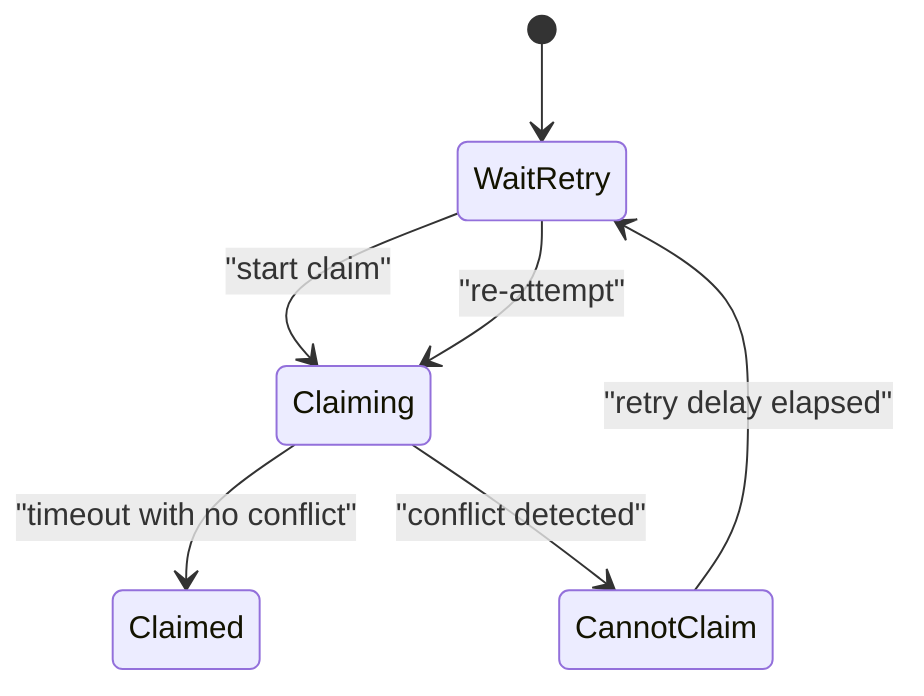
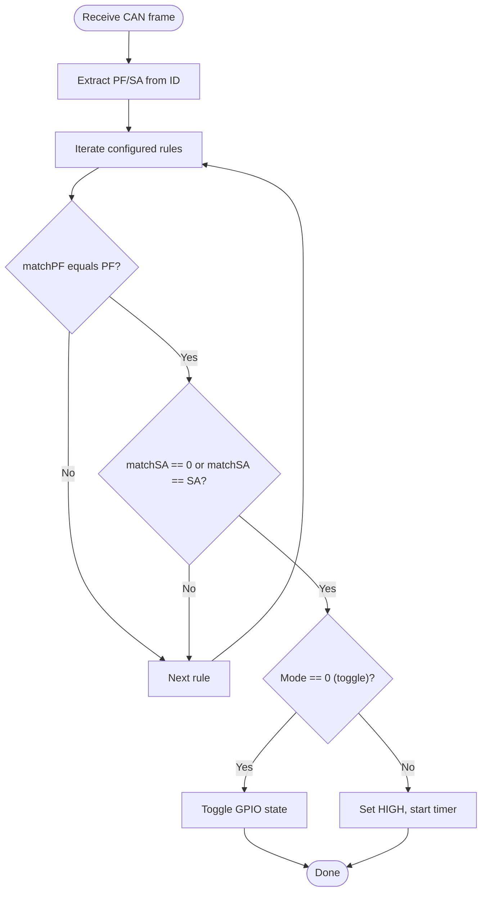
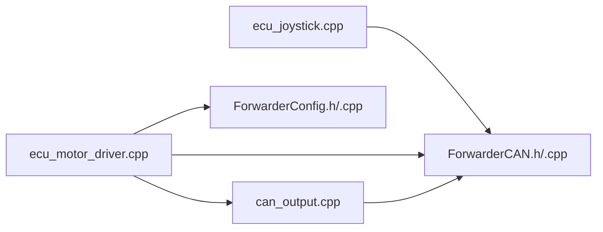

# CAN Message Protocol

<cite>
**Referenced Files in This Document**
- [ForwarderCAN.h](file://lib/ForwarderCAN/ForwarderCAN.h)
- [ForwarderCAN.cpp](file://lib/ForwarderCAN/ForwarderCAN.cpp)
- [ForwarderConfig.h](file://lib/ForwarderConfig/ForwarderConfig.h)
- [ForwarderConfig.cpp](file://lib/ForwarderConfig/ForwarderConfig.cpp)
- [can_output.h](file://src/can_output.h)
- [can_output.cpp](file://src/can_output.cpp)
- [ecu_motor_driver.cpp](file://src/ecu_motor_driver.cpp)
- [ecu_joystick.cpp](file://src/ecu_joystick.cpp)
- [main.cpp](file://src/main.cpp)
</cite>

## Update Summary
**Changes Made**
- Added comprehensive documentation for new PF_MOTOR_OUTPUT1 and PF_MOTOR_OUTPUT2 message types
- Updated custom message types section to include the new motor output broadcasting messages
- Enhanced motor output broadcasting explanation with real-time state communication details
- Updated architecture overview to reflect the addition of motor output state broadcasting
- Added detailed payload format and timing information for motor output messages

## Table of Contents
1. [Introduction](#introduction)
2. [Project Structure](#project-structure)
3. [Core Components](#core-components)
4. [Architecture Overview](#architecture-overview)
5. [Detailed Component Analysis](#detailed-component-analysis)
6. [Reliability Improvements](#reliability-improvements)
7. [Dependency Analysis](#dependency-analysis)
8. [Performance Considerations](#performance-considerations)
9. [Troubleshooting Guide](#troubleshooting-guide)
10. [Conclusion](#conclusion)

## Introduction
This document specifies the J1939-like CAN message protocol used by ForwarderKE devices. It defines custom message types, CAN ID layout, arbitration, address claiming, and operational semantics for heartbeat, axis configuration, device identification, address assignment, CAN-triggered GPIO control rules, and **real-time motor output state broadcasting**. It also documents parameter ranges, bit field layouts, and timing requirements for reliable operation under various network conditions.

## Project Structure
The protocol is implemented across several modules:
- ForwarderCAN: CAN driver, ID packing/unpacking, address claiming, and message send/receive with reliability improvements.
- ForwarderConfig: Persistent storage and serialization of axis and CAN output rules.
- ECU implementations: Joystick and motor driver ECUs that send and receive protocol messages.
- CAN output engine: Applies CAN-triggered GPIO actions based on configured rules.



**Diagram sources**
- [ForwarderCAN.h:66-120](file://lib/ForwarderCAN/ForwarderCAN.h#L66-L120)
- [ForwarderCAN.cpp:13-52](file://lib/ForwarderCAN/ForwarderCAN.cpp#L13-L52)
- [ForwarderConfig.h:64-92](file://lib/ForwarderConfig/ForwarderConfig.h#L64-L92)
- [ForwarderConfig.cpp:54-104](file://lib/ForwarderConfig/ForwarderConfig.cpp#L54-L104)
- [ecu_motor_driver.cpp:290-325](file://src/ecu_motor_driver.cpp#L290-L325)
- [ecu_joystick.cpp:159-192](file://src/ecu_joystick.cpp#L159-L192)
- [can_output.cpp:29-61](file://src/can_output.cpp#L29-L61)

**Section sources**
- [main.cpp:11-17](file://src/main.cpp#L11-L17)
- [ForwarderCAN.h:6-34](file://lib/ForwarderCAN/ForwarderCAN.h#L6-L34)
- [ForwarderCAN.cpp:13-52](file://lib/ForwarderCAN/ForwarderCAN.cpp#L13-L52)

## Core Components
- J1939-like 29-bit ID layout with Priority, Data Page, PDU Format (PF), PDU Specific (PS), and Source Address (SA).
- Custom PF values for ForwarderKE operations including new motor output broadcasting messages.
- Network management for address claiming and conflict resolution.
- Application messages for joysticks, solenoids, LEDs, identification, configuration, heartbeats, and **real-time motor output state broadcasting**.
- CAN-triggered GPIO control via configurable rules.
- **Enhanced reliability mechanisms** to prevent system lockups during heavy bus load conditions.

**Section sources**
- [ForwarderCAN.h:6-34](file://lib/ForwarderCAN/ForwarderCAN.h#L6-L34)
- [ForwarderCAN.h:38-51](file://lib/ForwarderCAN/ForwarderCAN.h#L38-L51)
- [ForwarderCAN.cpp:54-119](file://lib/ForwarderCAN/ForwarderCAN.cpp#L54-L119)

## Architecture Overview
The system uses a J1939-like ID scheme with custom PF values. Devices claim an address using a network management procedure and exchange application messages. The CAN output engine applies GPIO actions based on matched PF/SA rules. **The architecture now includes built-in safeguards against feedback loops and system lockups during heavy traffic conditions, plus real-time motor output state broadcasting for immediate feedback.**



**Diagram sources**
- [ecu_motor_driver.cpp:277-288](file://src/ecu_motor_driver.cpp#L277-L288)
- [ecu_joystick.cpp:146-157](file://src/ecu_joystick.cpp#L146-L157)
- [ForwarderCAN.cpp:144-171](file://lib/ForwarderCAN/ForwarderCAN.cpp#L144-L171)
- [can_output.cpp:29-49](file://src/can_output.cpp#L29-L49)

## Detailed Component Analysis

### CAN ID Layout and Bit Fields
- 29-bit ID fields:
  - Priority: bits 28-26
  - Extended Data Page: bit 25 (not used, fixed to 0)
  - Data Page: bit 24
  - PDU Format (PF): bits 23-16
  - PDU Specific (PS): bits 15-8 (destination address when PF < 240)
  - Source Address (SA): bits 7-0
- Macros support packing/unpacking and extracting fields.

**Section sources**
- [ForwarderCAN.h:6-34](file://lib/ForwarderCAN/ForwarderCAN.h#L6-L34)
- [ForwarderCAN.h:22-33](file://lib/ForwarderCAN/ForwarderCAN.h#L22-L33)

### Network Management and Address Claiming
- Address claiming uses PF 0xEE with broadcast destination and device NAME payload.
- Conflict resolution compares NAME bytes; lower NAME wins arbitration.
- Retry logic with timeout and maximum attempts; optional alternate address selection based on NAME hash.
- Device transitions through claiming, claimed, cannot-claim, and retry states.



**Diagram sources**
- [ForwarderCAN.cpp:54-109](file://lib/ForwarderCAN/ForwarderCAN.cpp#L54-L109)

**Section sources**
- [ForwarderCAN.cpp:54-119](file://lib/ForwarderCAN/ForwarderCAN.cpp#L54-L119)
- [ForwarderCAN.cpp:121-142](file://lib/ForwarderCAN/ForwarderCAN.cpp#L121-L142)

### Custom Message Types

#### PF_HEARTBEAT
- Purpose: Periodic status and statistics broadcast by devices.
- PF: 0x30
- PS: DA_BROADCAST (device broadcasts)
- SA: Device's current source address
- Payload (8 bytes):
  - Byte 0: Online flag (0x00 offline, 0x01 online)
  - Byte 1: Seconds (LSB)
  - Byte 2: Seconds (MSB)
  - Byte 3: RX count (LSB)
  - Byte 4: TX count (LSB)
  - Byte 5: Hardware capability (e.g., number of PCA channels)
  - Byte 6: Motor config PCA count
  - Byte 7: Reserved (0)
- Timing: Sent approximately every 1 second when online.
- Notes: PF_HEARTBEAT is accepted by all devices; no acknowledgment is required.

**Section sources**
- [ForwarderCAN.h:50-50](file://lib/ForwarderCAN/ForwarderCAN.h#L50-L50)
- [ecu_motor_driver.cpp:277-288](file://src/ecu_motor_driver.cpp#L277-L288)
- [ecu_joystick.cpp:146-157](file://src/ecu_joystick.cpp#L146-L157)

#### PF_MOTOR_OUTPUT1
- Purpose: Real-time motor output state broadcasting for axes 0-3.
- PF: 0x31
- PS: DA_BROADCAST (device broadcasts to all devices)
- SA: Device's current source address
- Payload (8 bytes): Two 16-bit signed integers representing the difference between forward and reverse channel values for each pair of channels:
  - Bytes 0-1: Channel 0 (forward) - Channel 1 (reverse) difference
  - Bytes 2-3: Channel 2 (forward) - Channel 3 (reverse) difference  
  - Bytes 4-5: Channel 4 (forward) - Channel 5 (reverse) difference
  - Bytes 6-7: Channel 6 (forward) - Channel 7 (reverse) difference
- Format: Each channel difference is stored as a 16-bit signed integer in little-endian format
- Range: -32768 to 32767 per channel difference
- Timing: Broadcast when PWM output changes or at 20Hz maximum rate (rate-limited)
- Notes: Provides real-time feedback of motor output states for monitoring and diagnostics

**Updated** Added comprehensive documentation for the new PF_MOTOR_OUTPUT1 message type.

**Section sources**
- [ForwarderCAN.h:51-51](file://lib/ForwarderCAN/ForwarderCAN.h#L51-L51)
- [ecu_motor_driver.cpp:556-564](file://src/ecu_motor_driver.cpp#L556-L564)

#### PF_MOTOR_OUTPUT2
- Purpose: Real-time motor output state broadcasting for axes 4-7.
- PF: 0x32
- PS: DA_BROADCAST (device broadcasts to all devices)
- SA: Device's current source address
- Payload (8 bytes): Two 16-bit signed integers representing the difference between forward and reverse channel values for each pair of channels:
  - Bytes 0-1: Channel 8 (forward) - Channel 9 (reverse) difference
  - Bytes 2-3: Channel 10 (forward) - Channel 11 (reverse) difference
  - Bytes 4-5: Channel 12 (forward) - Channel 13 (reverse) difference
  - Bytes 6-7: Channel 14 (forward) - Channel 15 (reverse) difference
- Format: Each channel difference is stored as a 16-bit signed integer in little-endian format
- Range: -32768 to 32767 per channel difference
- Timing: Broadcast when PWM output changes or at 20Hz maximum rate (rate-limited)
- Notes: Provides real-time feedback of motor output states for monitoring and diagnostics

**Updated** Added comprehensive documentation for the new PF_MOTOR_OUTPUT2 message type.

**Section sources**
- [ForwarderCAN.h:52-52](file://lib/ForwarderCAN/ForwarderCAN.h#L52-L52)
- [ecu_motor_driver.cpp:566-575](file://src/ecu_motor_driver.cpp#L566-L575)

#### PF_CONFIG_AXIS
- Purpose: Configure a single axis mapping (joystick to solenoid).
- PF: 0x24
- PS: DA_BROADCAST (broadcast to all devices)
- SA: Sender's source address
- Payload (8 bytes):
  - Byte 0: Axis index (0–15)
  - Byte 1: Source address (joystick SA, e.g., 0x21)
  - Byte 2: Bits 7–6: Pot index (0–3), Bits 5–2: Output channel (0–15), Bits 1–0: Flags (enable, bidirectional)
  - Byte 3: Deadband min / 4 (0–255 maps to 0–1020)
  - Byte 4: Deadband max / 4 (0–255 maps to 0–1020)
  - Byte 5: PWM min (0–255)
  - Byte 6: PWM max (0–255)
  - Byte 7: Reserved (0)
- Behavior: Device validates axis index and updates persistent configuration.

**Section sources**
- [ForwarderCAN.h:47-47](file://lib/ForwarderCAN/ForwarderCAN.h#L47-L47)
- [ForwarderConfig.h:9-18](file://lib/ForwarderConfig/ForwarderConfig.h#L9-L18)
- [ForwarderConfig.cpp:6-26](file://lib/ForwarderConfig/ForwarderConfig.cpp#L6-L26)
- [ecu_motor_driver.cpp:246-256](file://src/ecu_motor_driver.cpp#L246-L256)

#### PF_IDENTIFY
- Purpose: Blink LED or activate identification pattern.
- PF: 0x22
- PS: DA_BROADCAST or device SA
- SA: Sender's SA
- Payload: None (DLC 0)
- Behavior: Activates identification pattern for a fixed duration.

**Section sources**
- [ForwarderCAN.h:45-45](file://lib/ForwarderCAN/ForwarderCAN.h#L45-L45)
- [ecu_motor_driver.cpp:227-233](file://src/ecu_motor_driver.cpp#L227-L233)
- [ecu_joystick.cpp:127-131](file://src/ecu_joystick.cpp#L127-L131)

#### PF_SET_ADDRESS
- Purpose: Assign a new fixed source address to a device.
- PF: 0x23
- PS: Target device SA
- SA: Sender's SA
- Payload (1 byte):
  - Byte 0: New address (0x20–0xEF)
- Behavior: Device validates address range, stores in NVS, and reboots.

**Section sources**
- [ForwarderCAN.h:46-46](file://lib/ForwarderCAN/ForwarderCAN.h#L46-L46)
- [ecu_motor_driver.cpp:234-244](file://src/ecu_motor_driver.cpp#L234-L244)
- [ecu_joystick.cpp:132-141](file://src/ecu_joystick.cpp#L132-L141)
- [ForwarderConfig.cpp:61-74](file://lib/ForwarderConfig/ForwarderConfig.cpp#L61-L74)

#### PF_CAN_OUTPUT
- Purpose: Trigger GPIO actions based on CAN frames.
- PF: Configured per rule (matchPF)
- PS: Optional matchSA (0 means any SA)
- SA: Sender's SA
- Payload: Depends on rule; typically ignored for GPIO control.
- Behavior: Device applies GPIO action (toggle or momentary) when PF/SA match.



**Diagram sources**
- [can_output.cpp:29-61](file://src/can_output.cpp#L29-L61)
- [ForwarderCAN.h:31-32](file://lib/ForwarderCAN/ForwarderCAN.h#L31-L32)

**Section sources**
- [ForwarderCAN.h:31-32](file://lib/ForwarderCAN/ForwarderCAN.h#L31-L32)
- [can_output.cpp:29-61](file://src/can_output.cpp#L29-L61)
- [ForwarderConfig.h:28-39](file://lib/ForwarderConfig/ForwarderConfig.h#L28-L39)
- [ForwarderConfig.cpp:31-49](file://lib/ForwarderConfig/ForwarderConfig.cpp#L31-L49)

### Additional Application Messages

#### PF_JOYSTICK_POT1/2/3
- Purpose: Transmit joystick potentiometer readings.
- PF: 0x10, 0x11, 0x12
- PS: DA_BROADCAST
- SA: Joystick device SA
- Payload (2 bytes): LSB and MSB of 10-bit ADC value.

**Section sources**
- [ForwarderCAN.h:39-42](file://lib/ForwarderCAN/ForwarderCAN.h#L39-L42)
- [ecu_joystick.cpp:99-104](file://src/ecu_joystick.cpp#L99-L104)
- [ecu_motor_driver.cpp:192-205](file://src/ecu_motor_driver.cpp#L192-L205)

#### PF_JOYSTICK_BUTTONS
- Purpose: Transmit button states.
- PF: 0x13
- PS: DA_BROADCAST
- SA: Joystick device SA
- Payload (1 byte): Bitmask of buttons.

**Section sources**
- [ForwarderCAN.h:43-43](file://lib/ForwarderCAN/ForwarderCAN.h#L43-L43)
- [ecu_joystick.cpp:106-112](file://src/ecu_joystick.cpp#L106-L112)
- [ecu_motor_driver.cpp:192-205](file://src/ecu_motor_driver.cpp#L192-L205)

#### PF_SOLENOID_CMD
- Purpose: Directly set solenoid PWM values.
- PF: 0x21
- PS: DA_BROADCAST
- SA: Sender's SA
- Payload (8 bytes): One byte per channel (0–255), mapped to 12-bit output.

**Section sources**
- [ForwarderCAN.h:44-44](file://lib/ForwarderCAN/ForwarderCAN.h#L44-L44)
- [ecu_motor_driver.cpp:206-218](file://src/ecu_motor_driver.cpp#L206-L218)

#### PF_LED_COLOR
- Purpose: Set LED color.
- PF: 0x20
- PS: DA_BROADCAST or device SA
- SA: Sender's SA
- Payload (3 bytes): R, G, B (0–255).

**Section sources**
- [ForwarderCAN.h:44-44](file://lib/ForwarderCAN/ForwarderCAN.h#L44-L44)
- [ecu_motor_driver.cpp:219-226](file://src/ecu_motor_driver.cpp#L219-L226)
- [ecu_joystick.cpp:119-126](file://src/ecu_joystick.cpp#L119-L126)

#### PF_REQUEST_CONFIG / PF_CONFIG_RESPONSE
- Purpose: Retrieve axis configuration from a device.
- PF: 0x25 (request), 0x26 (response)
- PS: DA_BROADCAST (request) or device SA (response)
- SA: Sender's SA
- Behavior: Requester sends PF_REQUEST_CONFIG; responder replies with PF_CONFIG_RESPONSE for each axis.

**Section sources**
- [ForwarderCAN.h:48-49](file://lib/ForwarderCAN/ForwarderCAN.h#L48-L49)
- [ecu_motor_driver.cpp:257-267](file://src/ecu_motor_driver.cpp#L257-L267)

### Message Sequencing, Acknowledgment, and Error Handling
- Heartbeat: Unacknowledged broadcast; periodic every ~1 second when online.
- Address assignment: One-way command; device reboots after applying new address.
- Configuration: One-way commands; device persists and applies immediately.
- GPIO control: One-way triggers; no acknowledgment.
- **Motor output broadcasting**: Real-time state feedback; broadcast when PWM changes or at 20Hz maximum rate.
- Errors: ForwarderCAN tracks TX/RX/error counts; bus-off recovery is attempted automatically.

**Updated** Added motor output broadcasting to message sequencing documentation.

**Section sources**
- [ForwarderCAN.cpp:173-197](file://lib/ForwarderCAN/ForwarderCAN.cpp#L173-L197)
- [ecu_motor_driver.cpp:234-244](file://src/ecu_motor_driver.cpp#L234-L244)
- [ecu_joystick.cpp:132-141](file://src/ecu_joystick.cpp#L132-L141)

## Reliability Improvements

### Feedback Loop Prevention Mechanism
**Updated** The system now includes comprehensive safeguards against feedback loops and system lockups during heavy bus load conditions.

The reliability improvements center around a critical fix in the CAN message processing pipeline that prevents infinite loops when receiving large volumes of frames. The system implements a 30-frame processing limit mechanism to ensure stability under heavy traffic conditions.

#### Hardware-Level Processing Optimization
The ForwarderCAN class now uses direct TWAI hardware access in its loop() method to bypass the traditional receive() buffer mechanism that could cause feedback loops:

```cpp
// Drain TWAI hardware directly to avoid the push/pop feedback loop
// that would occur if we called receive() here (receive() reads _rxBuf
// first, and loop() pushes non-mgmt frames back into _rxBuf, causing
// the same frame to be re-processed up to the count>30 guard every tick).
twai_message_t rawMsg;
int rxCount = 0;
while (twai_receive(&rawMsg, 0) == ESP_OK) {
    rxCount++;
    if (rxCount > 30) break;  // prevent lockup under heavy bus load
    // ... process frame ...
}
```

#### Application-Level Processing Guards
Both ECU implementations include identical protection mechanisms in their processCAN() functions:

```cpp
static void processCAN() {
    CANMessage msg;
    int count = 0;
    while (g_can->receive(msg, 0)) {
        count++;
        if (count > 30) break;  // prevent lockup under heavy bus load
        // ... process individual message types ...
    }
}
```

#### CAN Output Processing Safety
The CAN output engine also implements the same safety mechanism to prevent system lockups when processing GPIO control rules triggered by CAN frames.

### Heavy Bus Load Handling
The system is designed to handle extreme traffic conditions gracefully:

- **Frame Processing Limit**: Maximum 30 frames processed per iteration to prevent system overload
- **Hardware Direct Access**: Bypasses buffer mechanisms for network management frames
- **Automatic Recovery**: System continues processing even when encountering high traffic loads
- **Timeout Protection**: All receive operations include appropriate timeouts to prevent blocking
- **Motor Output Rate Limiting**: Motor output broadcasts are limited to 20Hz maximum to prevent bus saturation

**Updated** Added motor output rate limiting to heavy bus load handling.

### System Stability Features
- **Bus State Monitoring**: Automatic detection and recovery from bus-off conditions
- **Error Count Tracking**: Comprehensive error monitoring for debugging and maintenance
- **Graceful Degradation**: System continues operating with reduced functionality during heavy loads
- **Memory Protection**: Ring buffer overflow protection prevents memory corruption

**Section sources**
- [ForwarderCAN.cpp:149-172](file://lib/ForwarderCAN/ForwarderCAN.cpp#L149-L172)
- [ecu_motor_driver.cpp:248-254](file://src/ecu_motor_driver.cpp#L248-L254)
- [ecu_joystick.cpp:133-138](file://src/ecu_joystick.cpp#L133-L138)
- [can_output.cpp:29-49](file://src/can_output.cpp#L29-L49)

## Dependency Analysis


**Diagram sources**
- [ecu_joystick.cpp:159-192](file://src/ecu_joystick.cpp#L159-L192)
- [ecu_motor_driver.cpp:290-325](file://src/ecu_motor_driver.cpp#L290-L325)
- [ForwarderCAN.h:6-34](file://lib/ForwarderCAN/ForwarderCAN.h#L6-L34)
- [ForwarderConfig.h:64-92](file://lib/ForwarderConfig/ForwarderConfig.h#L64-L92)
- [can_output.cpp:29-61](file://src/can_output.cpp#L29-L61)

**Section sources**
- [ecu_joystick.cpp:159-192](file://src/ecu_joystick.cpp#L159-L192)
- [ecu_motor_driver.cpp:290-325](file://src/ecu_motor_driver.cpp#L290-L325)
- [ForwarderCAN.h:6-34](file://lib/ForwarderCAN/ForwarderCAN.h#L6-L34)
- [ForwarderConfig.h:64-92](file://lib/ForwarderConfig/ForwarderConfig.h#L64-L92)
- [can_output.cpp:29-61](file://src/can_output.cpp#L29-L61)

## Performance Considerations
- Bitrate: Supported 125 kbit/s, 250 kbit/s, 500 kbit/s, 1 Mbit/s; choose appropriate speed for network topology.
- Heartbeat interval: ~1 second; adjust for latency tolerance.
- CAN output momentary mode: Configurable duration; keep short for responsive control.
- Address claiming: Timeout 250 ms; retries every 1000 ms up to 5 attempts; alternate address fallback uses NAME hash.
- **Motor output broadcasting**: Rate-limited to 20Hz maximum to prevent bus saturation; broadcasts only when PWM output changes.
- **Heavy bus load handling**: System automatically limits processing to 30 frames per iteration to prevent lockups.
- **Memory protection**: Ring buffer size of 32 messages prevents memory overflow during high traffic.
- **Hardware optimization**: Direct TWAI access bypasses buffer overhead for improved performance.

**Updated** Added motor output broadcasting performance considerations.

**Section sources**
- [ForwarderCAN.cpp:19-26](file://lib/ForwarderCAN/ForwarderCAN.cpp#L19-L26)
- [ForwarderCAN.cpp:109-112](file://lib/ForwarderCAN/ForwarderCAN.cpp#L109-L112)
- [ecu_motor_driver.cpp:330-346](file://src/ecu_motor_driver.cpp#L330-L346)
- [ecu_joystick.cpp:226-231](file://src/ecu_joystick.cpp#L226-L231)
- [ForwarderCAN.cpp:123-128](file://lib/ForwarderCAN/ForwarderCAN.cpp#L123-L128)

## Troubleshooting Guide
- Device not claiming address:
  - Verify NAME uniqueness; conflicts cause arbitration loss and retry.
  - Check bus state; automatic bus-off recovery occurs.
- No response to PF_SET_ADDRESS:
  - Confirm target SA matches device SA.
  - Ensure address is within 0x20–0xEF.
- PF_CONFIG_AXIS not applied:
  - Verify axis index within 0–15.
  - Check persistent storage availability.
- PF_CAN_OUTPUT not triggering:
  - Confirm matchPF and matchSA in rules.
  - Ensure gpioPin is configured and mode is set.
- **Missing PF_MOTOR_OUTPUT1/PF_MOTOR_OUTPUT2 messages**:
  - **Updated** Verify motor driver is properly initialized and has output changes to report.
  - Check that motor output broadcasting is enabled and device is online.
  - Monitor TX/RX counters to ensure messages are being transmitted.
  - Verify no filtering is preventing motor output messages from being received.
- **System lockup during heavy traffic**:
  - **Updated** The system includes built-in protection against lockups with automatic frame limiting.
  - Monitor TX/RX counters for unusual spikes in frame rates.
  - Check for excessive broadcast traffic on the network.
  - Verify that no device is flooding the bus with high-frequency messages.
  - **Updated** Monitor motor output broadcast rate to ensure it's not exceeding 20Hz.
- **CAN bus stability issues**:
  - **Updated** System now includes automatic bus state monitoring and recovery.
  - Monitor bus error counters for persistent issues.
  - Verify proper termination and wiring integrity.
  - Check for electromagnetic interference sources.

**Updated** Added troubleshooting guidance for new motor output messages.

**Section sources**
- [ForwarderCAN.cpp:92-119](file://lib/ForwarderCAN/ForwarderCAN.cpp#L92-L119)
- [ecu_motor_driver.cpp:234-244](file://src/ecu_motor_driver.cpp#L234-L244)
- [ForwarderConfig.cpp:119-127](file://lib/ForwarderConfig/ForwarderConfig.cpp#L119-L127)
- [can_output.cpp:29-49](file://src/can_output.cpp#L29-L49)
- [ForwarderCAN.cpp:110-124](file://lib/ForwarderCAN/ForwarderCAN.cpp#L110-L124)

## Conclusion
ForwarderKE implements a J1939-like CAN protocol with custom PF values for device control and configuration. The protocol supports address claiming, broadcasting of heartbeats, joystick telemetry, solenoid control, LED color setting, device identification, dynamic axis configuration, CAN-triggered GPIO actions, and **real-time motor output state broadcasting**. **The recent reliability improvements ensure robust operation under heavy traffic conditions with built-in safeguards against feedback loops and system lockups, while the new motor output broadcasting messages provide immediate feedback of motor states for monitoring and diagnostics.** Adhering to the defined ID layout, PF assignments, and timing ensures robust inter-device communication even in demanding network environments.