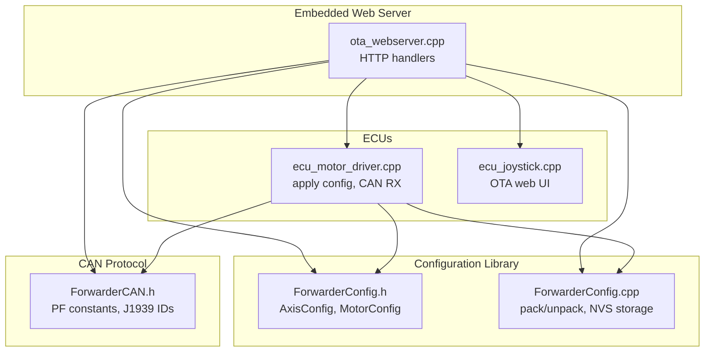
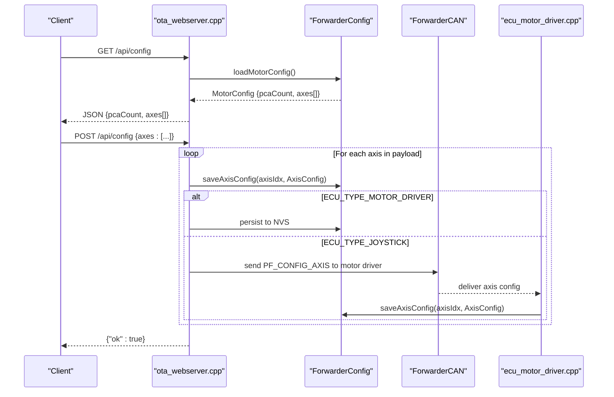
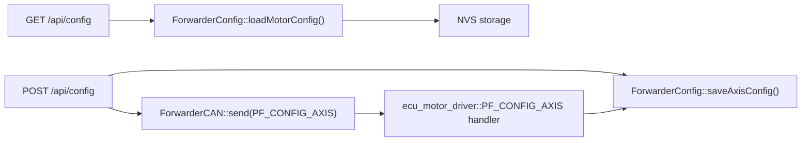

# Axis Mapping Configuration

<cite>
**Referenced Files in This Document**
- [main.cpp](file://src/main.cpp)
- [ota_webserver.cpp](file://src/ota_webserver.cpp)
- [ota_webserver.h](file://src/ota_webserver.h)
- [ForwarderConfig.h](file://lib/ForwarderConfig/ForwarderConfig.h)
- [ForwarderConfig.cpp](file://lib/ForwarderConfig/ForwarderConfig.cpp)
- [ForwarderCAN.h](file://lib/ForwarderCAN/ForwarderCAN.h)
- [ecu_motor_driver.cpp](file://src/ecu_motor_driver.cpp)
- [ecu_joystick.cpp](file://src/ecu_joystick.cpp)
- [web_state.h](file://src/web_state.h)
- [web_state.cpp](file://src/web_state.cpp)
- [README.md](file://README.md)
</cite>

## Table of Contents
1. [Introduction](#introduction)
2. [Project Structure](#project-structure)
3. [Core Components](#core-components)
4. [Architecture Overview](#architecture-overview)
5. [Detailed Component Analysis](#detailed-component-analysis)
6. [Dependency Analysis](#dependency-analysis)
7. [Performance Considerations](#performance-considerations)
8. [Troubleshooting Guide](#troubleshooting-guide)
9. [Conclusion](#conclusion)

## Introduction
This document describes the axis mapping configuration endpoints for the Forwarder CAN Controller system. It covers:
- GET /api/config: retrieves the current axis mapping configuration including pcaCount and the axes array
- POST /api/config: saves new axis mappings from a client-provided payload
It also documents the data model, validation rules, and error handling behavior for axis mapping configuration.

## Project Structure
The axis mapping configuration is implemented in the embedded web server and shared configuration library. The key files involved are:
- Web server handlers for API endpoints
- Configuration data structures and persistence
- CAN protocol definitions for axis configuration transport
- ECU-specific logic for applying configuration updates

**Diagram sources**
- [ota_webserver.cpp:506-796](file://src/ota_webserver.cpp#L506-L796)
- [ForwarderConfig.h:41-62](file://lib/ForwarderConfig/ForwarderConfig.h#L41-L62)
- [ForwarderConfig.cpp:6-26](file://lib/ForwarderConfig/ForwarderConfig.cpp#L6-L26)
- [ForwarderCAN.h:38-51](file://lib/ForwarderCAN/ForwarderCAN.h#L38-L51)
- [ecu_motor_driver.cpp:246-256](file://src/ecu_motor_driver.cpp#L246-L256)
- [ecu_joystick.cpp:177-182](file://src/ecu_joystick.cpp#L177-L182)

**Section sources**
- [README.md:112-126](file://README.md#L112-L126)
- [ota_webserver.cpp:766-796](file://src/ota_webserver.cpp#L766-L796)

## Core Components
- AxisConfig: defines per-axis mapping parameters and packing/unpacking for CAN transport
- MotorConfig: container for pcaCount and the axes array
- ForwarderConfig: loads/saves configuration to NVS and packs/unpacks AxisConfig entries
- Web API handlers: GET /api/config and POST /api/config
- CAN protocol: PF_CONFIG_AXIS and related PF constants

Key data model fields for each axis:
- sourceAddress: Joystick source address (e.g., 0x21, 0x22)
- potIndex: 0=Pot1, 1=Pot2, 2=Pot3
- outputChannel: 0–15 (channels across PCA9685 boards)
- deadbandMin: ADC raw 0–1023
- deadbandMax: ADC raw 0–1023
- pwmMin: 0–255 mapped to 0–4095 output scale
- pwmMax: 0–255 mapped to 0–4095 output scale
- flags: bitfield with ENABLED and BIDIRECTIONAL flags

**Section sources**
- [ForwarderConfig.h:41-57](file://lib/ForwarderConfig/ForwarderConfig.h#L41-L57)
- [ForwarderConfig.cpp:6-26](file://lib/ForwarderConfig/ForwarderConfig.cpp#L6-L26)
- [ForwarderCAN.h:38-51](file://lib/ForwarderCAN/ForwarderCAN.h#L38-L51)

## Architecture Overview
The axis mapping configuration flows through the web server to the configuration library and optionally across the CAN bus to the motor driver ECU.

**Diagram sources**
- [ota_webserver.cpp:565-626](file://src/ota_webserver.cpp#L565-L626)
- [ForwarderConfig.cpp:106-127](file://lib/ForwarderConfig/ForwarderConfig.cpp#L106-L127)
- [ForwarderCAN.h:47-51](file://lib/ForwarderCAN/ForwarderCAN.h#L47-L51)
- [ecu_motor_driver.cpp:246-256](file://src/ecu_motor_driver.cpp#L246-L256)

## Detailed Component Analysis

### GET /api/config
Purpose: Retrieve the current axis mapping configuration.

Response structure:
- pcaCount: number of PCA9685 boards (1 or 2)
- axes: array of 16 axis configurations with fields:
  - sourceAddress: joystick source address
  - potIndex: 0, 1, or 2
  - outputChannel: 0–15
  - deadbandMin: 0–1023
  - deadbandMax: 0–1023
  - pwmMin: 0–255
  - pwmMax: 0–255
  - flags: bitfield (bit 0: enabled, bit 1: bidirectional)

Implementation highlights:
- Builds JSON response by iterating MAX_AXIS_COUNT (16)
- Uses AxisConfig fields directly for each axis
- Returns pcaCount from MotorConfig

Validation and constraints:
- No explicit validation performed in handler; values reflect stored configuration

Example response payload:
{
  "pcaCount": 2,
  "axes": [
    {
      "sourceAddress": 33,
      "potIndex": 0,
      "outputChannel": 0,
      "deadbandMin": 492,
      "deadbandMax": 532,
      "pwmMin": 64,
      "pwmMax": 128,
      "flags": 1
    },
    ...
  ]
}

**Section sources**
- [ota_webserver.cpp:565-585](file://src/ota_webserver.cpp#L565-L585)
- [ForwarderConfig.h:59-62](file://lib/ForwarderConfig/ForwarderConfig.h#L59-L62)

### POST /api/config
Purpose: Save new axis mappings from the client.

Request payload structure:
- axes: array of up to 16 axis objects, each with:
  - axisIdx: zero-based index of the axis to update (0–15)
  - sourceAddress: joystick source address (e.g., 33 for 0x21)
  - potIndex: 0, 1, or 2
  - outputChannel: 0–15
  - deadbandMin: 0–1023
  - deadbandMax: 0–1023
  - pwmMin: 0–255
  - pwmMax: 0–255
  - flags: integer combining bit flags (bit 0: enabled, bit 1: bidirectional)

Processing logic:
- Handler iterates through the payload looking for each axisIdx entry
- Parses numeric fields from the request body
- Writes AxisConfig into MotorConfig.axes[axisIdx]
- Persists to NVS if running motor driver ECU
- Broadcasts PF_CONFIG_AXIS to the motor driver if running joystick ECU

Validation rules:
- axisIdx must be within 0–15
- Values are parsed from the request body; no strict validation performed in handler
- For CAN transport, AxisConfig.pack scales and packs values into 8 bytes

Error handling:
- The handler does not return error responses; it sends {"ok":true} on completion
- If a field is missing or invalid, the parser returns 0 for that field

Example request payload:
{
  "axes": [
    {
      "axisIdx": 0,
      "sourceAddress": 33,
      "potIndex": 0,
      "outputChannel": 0,
      "deadbandMin": 492,
      "deadbandMax": 532,
      "pwmMin": 64,
      "pwmMax": 128,
      "flags": 1
    },
    {
      "axisIdx": 1,
      "sourceAddress": 34,
      "potIndex": 1,
      "outputChannel": 1,
      "deadbandMin": 480,
      "deadbandMax": 540,
      "pwmMin": 70,
      "pwmMax": 130,
      "flags": 3
    }
  ]
}

Practical notes:
- The web UI constructs axes with default values and sends only the modified entries
- The handler expects axisIdx to be present in the payload to identify each axis entry

**Section sources**
- [ota_webserver.cpp:587-626](file://src/ota_webserver.cpp#L587-L626)
- [ForwarderConfig.cpp:119-127](file://lib/ForwarderConfig/ForwarderConfig.cpp#L119-L127)
- [ForwarderCAN.h:47-51](file://lib/ForwarderCAN/ForwarderCAN.h#L47-L51)

### Data Model and Packing
AxisConfig fields and packing details:
- sourceAddress: stored as-is
- potIndex: upper bits of byte 2
- outputChannel: upper bits of byte 2
- flags: upper bits of byte 2
- deadbandMin: scaled by 4 into byte 3
- deadbandMax: scaled by 4 into byte 4
- pwmMin: stored as-is into byte 5
- pwmMax: stored as-is into byte 6
- reserved: byte 7 unused

CAN transport:
- PF_CONFIG_AXIS carries 8-byte payload with packed axis data
- Motor driver receives and unpacks the payload into AxisConfig

**Section sources**
- [ForwarderConfig.h:9-18](file://lib/ForwarderConfig/ForwarderConfig.h#L9-L18)
- [ForwarderConfig.cpp:6-26](file://lib/ForwarderConfig/ForwarderConfig.cpp#L6-L26)
- [ForwarderCAN.h:47-51](file://lib/ForwarderCAN/ForwarderCAN.h#L47-L51)
- [ecu_motor_driver.cpp:246-256](file://src/ecu_motor_driver.cpp#L246-L256)

### Web UI Integration
The web UI fetches configuration on load and sends updates when the user clicks Save. It constructs the axes array with default values and only includes modified entries.

Behavior:
- Fetches configuration via GET /api/config
- Renders mapping controls and default values
- On Save, builds axes array with axisIdx and flags computed from UI state
- Posts to POST /api/config

**Section sources**
- [ota_webserver.cpp:376-421](file://src/ota_webserver.cpp#L376-L421)

## Dependency Analysis
The axis mapping configuration depends on:
- Web server handlers for HTTP endpoints
- Configuration library for persistence and packing
- CAN protocol for cross-ECU transport
- ECU-specific logic for applying updates

**Diagram sources**
- [ota_webserver.cpp:565-626](file://src/ota_webserver.cpp#L565-L626)
- [ForwarderConfig.cpp:106-127](file://lib/ForwarderConfig/ForwarderConfig.cpp#L106-L127)
- [ForwarderCAN.h:47-51](file://lib/ForwarderCAN/ForwarderCAN.h#L47-L51)
- [ecu_motor_driver.cpp:246-256](file://src/ecu_motor_driver.cpp#L246-L256)

**Section sources**
- [ota_webserver.cpp:766-796](file://src/ota_webserver.cpp#L766-L796)
- [ForwarderConfig.h:64-91](file://lib/ForwarderConfig/ForwarderConfig.h#L64-L91)

## Performance Considerations
- The web handler parses the request body manually; consider using a JSON library for production deployments
- Each axis update triggers NVS writes; batch updates when possible
- CAN broadcast of axis configuration occurs immediately after save; ensure appropriate rate limiting

## Troubleshooting Guide
Common issues and resolutions:
- Empty or partial response from GET /api/config
  - Verify MotorConfig is loaded from NVS and contains valid entries
  - Check NVS availability and keys for axis entries
- POST /api/config appears to succeed but changes are not applied
  - Confirm axisIdx values are present in the payload
  - Ensure ECU type matches expectations (motor driver persists to NVS; joystick broadcasts to motor driver)
- Unexpected values after save
  - deadbandMin/Max are scaled by 4 during packing; expect byte values multiplied by 4 when unpacked
  - pwmMin/pwmMax are stored as-is; output scaling maps 0–255 to 0–4095

**Section sources**
- [ForwarderConfig.cpp:76-104](file://lib/ForwarderConfig/ForwarderConfig.cpp#L76-L104)
- [ForwarderConfig.cpp:119-127](file://lib/ForwarderConfig/ForwarderConfig.cpp#L119-L127)
- [ForwarderConfig.cpp:17-26](file://lib/ForwarderConfig/ForwarderConfig.cpp#L17-L26)

## Conclusion
The axis mapping configuration endpoints provide a straightforward mechanism to retrieve and update joystick-to-solenoid mappings. The design leverages a compact data model with CAN transport for distributed control and NVS persistence for non-volatile storage. Following the validation rules and understanding the packing behavior ensures reliable operation across ECUs.