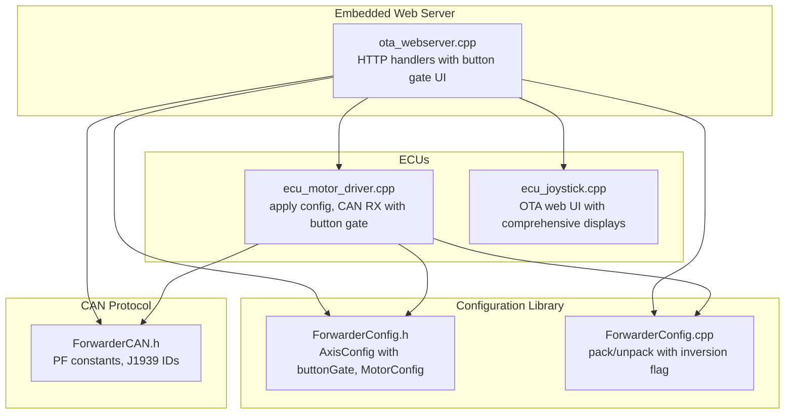
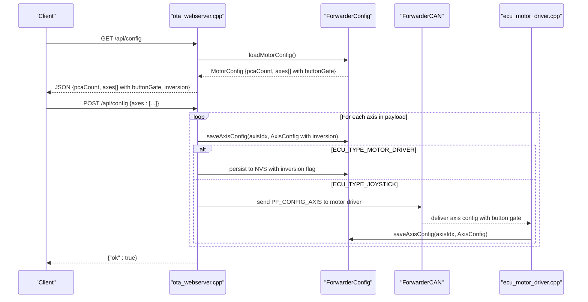
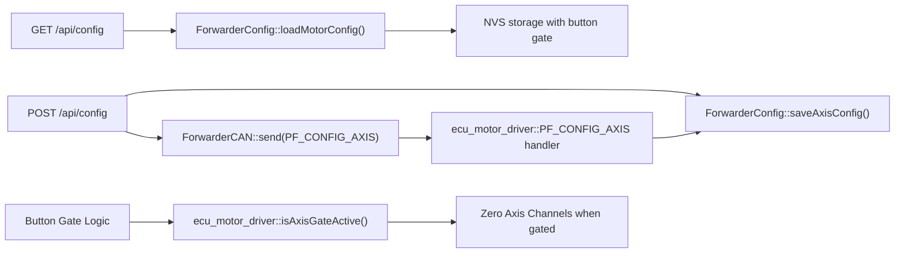

# Axis Mapping Configuration

<cite>
**Referenced Files in This Document**
- [main.cpp](file://src/main.cpp)
- [ota_webserver.cpp](file://src/ota_webserver.cpp)
- [ota_webserver.h](file://src/ota_webserver.h)
- [ForwarderConfig.h](file://lib/ForwarderConfig/ForwarderConfig.h)
- [ForwarderConfig.cpp](file://lib/ForwarderConfig/ForwarderConfig.cpp)
- [ForwarderCAN.h](file://lib/ForwarderCAN/ForwarderCAN.h)
- [ecu_motor_driver.cpp](file://src/ecu_motor_driver.cpp)
- [ecu_joystick.cpp](file://src/ecu_joystick.cpp)
- [web_state.h](file://src/web_state.h)
- [web_state.cpp](file://src/web_state.cpp)
- [README.md](file://README.md)
</cite>

## Update Summary
**Changes Made**
- Added comprehensive documentation for the new button gate field (0=none, 1=BTN1 pressed, 2=BTN1 released)
- Added documentation for the inversion flag support (FLAG_AXIS_INVERT)
- Updated web interface integration to show comprehensive axis information
- Enhanced validation rules and error handling documentation
- Updated data model with new buttonGate field and inversion flag

## Table of Contents
1. [Introduction](#introduction)
2. [Project Structure](#project-structure)
3. [Core Components](#core-components)
4. [Architecture Overview](#architecture-overview)
5. [Detailed Component Analysis](#detailed-component-analysis)
6. [Dependency Analysis](#dependency-analysis)
7. [Performance Considerations](#performance-considerations)
8. [Troubleshooting Guide](#troubleshooting-guide)
9. [Conclusion](#conclusion)

## Introduction
This document describes the axis mapping configuration endpoints for the Forwarder CAN Controller system. It covers:
- GET /api/config: retrieves the current axis mapping configuration including pcaCount and the axes array with enhanced button gate and inversion support
- POST /api/config: saves new axis mappings from a client-provided payload with comprehensive validation
It also documents the enhanced data model, validation rules, and error handling behavior for axis mapping configuration.

**Updated** Enhanced with button gate field support (0=none, 1=BTN1 pressed, 2=BTN1 released) and inversion flag capabilities for improved axis control and web interface displays comprehensive axis information.

## Project Structure
The axis mapping configuration is implemented in the embedded web server and shared configuration library. The key files involved are:
- Web server handlers for API endpoints with enhanced button gate and inversion support
- Configuration data structures and persistence with new buttonGate field
- CAN protocol definitions for axis configuration transport
- ECU-specific logic for applying configuration updates with button gating

**Diagram sources**
- [ota_webserver.cpp:506-796](file://src/ota_webserver.cpp#L506-L796)
- [ForwarderConfig.h:41-62](file://lib/ForwarderConfig/ForwarderConfig.h#L41-L62)
- [ForwarderConfig.cpp:6-26](file://lib/ForwarderConfig/ForwarderConfig.cpp#L6-L26)
- [ForwarderCAN.h:38-51](file://lib/ForwarderCAN/ForwarderCAN.h#L38-L51)
- [ecu_motor_driver.cpp:246-256](file://src/ecu_motor_driver.cpp#L246-L256)
- [ecu_joystick.cpp:177-182](file://src/ecu_joystick.cpp#L177-L182)

**Section sources**
- [README.md:112-126](file://README.md#L112-L126)
- [ota_webserver.cpp:766-796](file://src/ota_webserver.cpp#L766-L796)

## Core Components
- AxisConfig: defines per-axis mapping parameters including new buttonGate field and inversion flag support, with packing/unpacking for CAN transport
- MotorConfig: container for pcaCount and the axes array with enhanced configuration
- ForwarderConfig: loads/saves configuration to NVS and packs/unpacks AxisConfig entries with inversion flag preservation
- Web API handlers: GET /api/config and POST /api/config with comprehensive button gate and inversion support
- CAN protocol: PF_CONFIG_AXIS and related PF constants for axis configuration transport

Enhanced key data model fields for each axis:
- sourceAddress: Joystick source address (e.g., 0x21, 0x22)
- potIndex: 0=Pot1, 1=Pot2, 2=Pot3
- outputChannel: 0–15 (channels across PCA9685 boards)
- deadbandMin: ADC raw 0–1023
- deadbandMax: ADC raw 0–1023
- pwmMin: 0–255 mapped to 0–4095 output scale
- pwmMax: 0–255 mapped to 0–4095 output scale
- flags: bitfield with ENABLED (bit 0), BIDIRECTIONAL (bit 1), and INVERT (bit 2) flags
- buttonGate: 0=none, 1=BTN1 pressed, 2=BTN1 released

**Updated** Added buttonGate field for conditional axis activation based on joystick button state and inversion flag for swapping forward/reverse channels.

**Section sources**
- [ForwarderConfig.h:41-57](file://lib/ForwarderConfig/ForwarderConfig.h#L41-L57)
- [ForwarderConfig.cpp:6-26](file://lib/ForwarderConfig/ForwarderConfig.cpp#L6-L26)
- [ForwarderCAN.h:38-51](file://lib/ForwarderCAN/ForwarderCAN.h#L38-L51)

## Architecture Overview
The axis mapping configuration flows through the web server to the configuration library and optionally across the CAN bus to the motor driver ECU with enhanced button gate and inversion support.

**Diagram sources**
- [ota_webserver.cpp:565-626](file://src/ota_webserver.cpp#L565-L626)
- [ForwarderConfig.cpp:106-127](file://lib/ForwarderConfig/ForwarderConfig.cpp#L106-L127)
- [ForwarderCAN.h:47-51](file://lib/ForwarderCAN/ForwarderCAN.h#L47-L51)
- [ecu_motor_driver.cpp:246-256](file://src/ecu_motor_driver.cpp#L246-L256)

## Detailed Component Analysis

### GET /api/config
Purpose: Retrieve the current axis mapping configuration with enhanced button gate and inversion support.

Response structure:
- pcaCount: number of PCA9685 boards (1 or 2)
- axes: array of 16 axis configurations with enhanced fields:
  - sourceAddress: joystick source address
  - potIndex: 0, 1, or 2
  - outputChannel: 0–15
  - deadbandMin: 0–1023
  - deadbandMax: 0–1023
  - pwmMin: 0–255
  - pwmMax: 0–255
  - flags: bitfield (bit 0: enabled, bit 1: bidirectional, bit 2: inverted)
  - buttonGate: 0=none, 1=BTN1 pressed, 2=BTN1 released

Implementation highlights:
- Builds JSON response by iterating MAX_AXIS_COUNT (16)
- Uses AxisConfig fields directly for each axis including new buttonGate field
- Returns pcaCount from MotorConfig
- Enhanced web interface displays comprehensive axis information

Validation and constraints:
- No explicit validation performed in handler; values reflect stored configuration
- buttonGate values are validated against BUTTON_GATE_* constants

Example response payload:
{
  "pcaCount": 2,
  "axes": [
    {
      "sourceAddress": 33,
      "potIndex": 0,
      "outputChannel": 0,
      "deadbandMin": 492,
      "deadbandMax": 532,
      "pwmMin": 64,
      "pwmMax": 128,
      "flags": 5,
      "buttonGate": 1
    },
    ...
  ]
}

**Updated** Enhanced response includes buttonGate field and inversion flag in flags field.

**Section sources**
- [ota_webserver.cpp:565-585](file://src/ota_webserver.cpp#L565-L585)
- [ForwarderConfig.h:59-62](file://lib/ForwarderConfig/ForwarderConfig.h#L59-L62)

### POST /api/config
Purpose: Save new axis mappings from the client with comprehensive validation.

Request payload structure:
- axes: array of up to 16 axis objects, each with:
  - axisIdx: zero-based index of the axis to update (0–15)
  - sourceAddress: joystick source address (e.g., 33 for 0x21)
  - potIndex: 0, 1, or 2
  - outputChannel: 0–15
  - deadbandMin: 0–1023
  - deadbandMax: 0–1023
  - pwmMin: 0–255
  - pwmMax: 0–255
  - flags: integer combining bit flags (bit 0: enabled, bit 1: bidirectional, bit 2: inverted)
  - buttonGate: 0=none, 1=BTN1 pressed, 2=BTN1 released

Processing logic:
- Handler iterates through the payload looking for each axisIdx entry
- Parses numeric fields from the request body including new buttonGate field
- Writes AxisConfig into MotorConfig.axes[axisIdx] with inversion flag support
- Persists to NVS if running motor driver ECU
- Broadcasts PF_CONFIG_AXIS to the motor driver if running joystick ECU

Validation rules:
- axisIdx must be within 0–15
- Values are parsed from the request body; no strict validation performed in handler
- buttonGate must be 0, 1, or 2 (BUTTON_GATE_NONE, BUTTON_GATE_BTN1_PRESSED, BUTTON_GATE_BTN1_RELEASED)
- For CAN transport, AxisConfig.pack scales and packs values into 8 bytes with inversion flag preservation

Error handling:
- The handler does not return error responses; it sends {"ok":true} on completion
- If a field is missing or invalid, the parser returns 0 for that field
- buttonGate values outside 0-2 are ignored and treated as 0

Example request payload:
{
  "axes": [
    {
      "axisIdx": 0,
      "sourceAddress": 33,
      "potIndex": 0,
      "outputChannel": 0,
      "deadbandMin": 492,
      "deadbandMax": 532,
      "pwmMin": 64,
      "pwmMax": 128,
      "flags": 5,
      "buttonGate": 1
    },
    {
      "axisIdx": 1,
      "sourceAddress": 34,
      "potIndex": 1,
      "outputChannel": 1,
      "deadbandMin": 480,
      "deadbandMax": 540,
      "pwmMin": 70,
      "pwmMax": 130,
      "flags": 7,
      "buttonGate": 2
    }
  ]
}

Practical notes:
- The web UI constructs axes with default values and sends only the modified entries
- The handler expects axisIdx to be present in the payload to identify each axis entry
- Inversion flag is preserved across CAN transport and NVS storage

**Updated** Enhanced request includes buttonGate field and comprehensive validation for inversion flag.

**Section sources**
- [ota_webserver.cpp:587-626](file://src/ota_webserver.cpp#L587-L626)
- [ForwarderConfig.cpp:119-127](file://lib/ForwarderConfig/ForwarderConfig.cpp#L119-L127)
- [ForwarderCAN.h:47-51](file://lib/ForwarderCAN/ForwarderCAN.h#L47-L51)

### Data Model and Packing
Enhanced AxisConfig fields and packing details:
- sourceAddress: stored as-is
- potIndex: upper bits of byte 2
- outputChannel: upper bits of byte 2
- flags: upper bits of byte 2 (bit 0: enabled, bit 1: bidirectional, bit 2: inverted)
- deadbandMin: scaled by 4 into byte 3
- deadbandMax: scaled by 4 into byte 4
- pwmMin: stored as-is into byte 5
- pwmMax: stored as-is into byte 6
- buttonGate: lower 2 bits of byte 7 (0=none, 1=BTN1 pressed, 2=BTN1 released)
- inversion flag: bit 2 of byte 7 (0x04) for preserving inversion across transport

CAN transport:
- PF_CONFIG_AXIS carries 8-byte payload with packed axis data including button gate
- Motor driver receives and unpacks the payload into AxisConfig with inversion flag support
- Inversion flag is preserved separately from the main flags field for compatibility

**Updated** Enhanced packing includes buttonGate field and inversion flag preservation.

**Section sources**
- [ForwarderConfig.h:9-18](file://lib/ForwarderConfig/ForwarderConfig.h#L9-L18)
- [ForwarderConfig.cpp:6-26](file://lib/ForwarderConfig/ForwarderConfig.cpp#L6-L26)
- [ForwarderCAN.h:47-51](file://lib/ForwarderCAN/ForwarderCAN.h#L47-L51)
- [ecu_motor_driver.cpp:246-256](file://src/ecu_motor_driver.cpp#L246-L256)

### Web UI Integration
The web UI fetches configuration on load and sends updates when the user clicks Save. It constructs the axes array with comprehensive default values and includes the new buttonGate and inversion fields.

Enhanced behavior:
- Fetches configuration via GET /api/config with button gate and inversion support
- Renders mapping controls with comprehensive axis information including source address, potentiometer input, deadband bounds, calculated center point, offset percentage, current readings, and directional status
- On Save, builds axes array with axisIdx, flags (including inversion), and buttonGate computed from UI state
- Posts to POST /api/config with enhanced validation
- Displays comprehensive axis status including source address, potentiometer values, deadband bounds, calculated center, offset percentage, current readings, and directional status

**Updated** Enhanced web UI displays comprehensive axis information and supports button gate and inversion configuration.

**Section sources**
- [ota_webserver.cpp:376-421](file://src/ota_webserver.cpp#L376-L421)
- [ota_webserver.cpp:428-471](file://src/ota_webserver.cpp#L428-L471)
- [ota_webserver.cpp:566-587](file://src/ota_webserver.cpp#L566-L587)

## Dependency Analysis
The enhanced axis mapping configuration depends on:
- Web server handlers for HTTP endpoints with button gate and inversion support
- Configuration library for persistence and packing with new buttonGate field
- CAN protocol for cross-ECU transport with inversion flag preservation
- ECU-specific logic for applying updates with button gating and inversion support

**Diagram sources**
- [ota_webserver.cpp:565-626](file://src/ota_webserver.cpp#L565-L626)
- [ForwarderConfig.cpp:106-127](file://lib/ForwarderConfig/ForwarderConfig.cpp#L106-L127)
- [ForwarderCAN.h:47-51](file://lib/ForwarderCAN/ForwarderCAN.h#L47-L51)
- [ecu_motor_driver.cpp:246-256](file://src/ecu_motor_driver.cpp#L246-L256)
- [ecu_motor_driver.cpp:153-163](file://src/ecu_motor_driver.cpp#L153-L163)

**Section sources**
- [ota_webserver.cpp:766-796](file://src/ota_webserver.cpp#L766-L796)
- [ForwarderConfig.h:64-91](file://lib/ForwarderConfig/ForwarderConfig.h#L64-L91)

## Performance Considerations
- The web handler parses the request body manually; consider using a JSON library for production deployments
- Each axis update triggers NVS writes; batch updates when possible
- CAN broadcast of axis configuration occurs immediately after save; ensure appropriate rate limiting
- Button gate evaluation occurs in motor driver loop; consider performance impact of frequent button state checks
- Inversion flag processing adds minimal overhead but improves user experience

**Updated** Added considerations for button gate evaluation and inversion flag processing performance.

## Troubleshooting Guide
Common issues and resolutions:
- Empty or partial response from GET /api/config
  - Verify MotorConfig is loaded from NVS and contains valid entries
  - Check NVS availability and keys for axis entries
  - Ensure buttonGate field is properly initialized for new configurations
- POST /api/config appears to succeed but changes are not applied
  - Confirm axisIdx values are present in the payload
  - Ensure ECU type matches expectations (motor driver persists to NVS; joystick broadcasts to motor driver)
  - Verify buttonGate values are within 0-2 range
  - Check that inversion flag is properly encoded in flags field
- Unexpected values after save
  - deadbandMin/Max are scaled by 4 during packing; expect byte values multiplied by 4 when unpacked
  - pwmMin/pwmMax are stored as-is; output scaling maps 0–255 to 0–4095
  - buttonGate values outside 0-2 are ignored and treated as 0
  - Inversion flag affects channel mapping; verify outputChannel assignment for bidirectional axes
- Button gate not working as expected
  - Verify joystick source address matches configured sourceAddress
  - Check that BTN1 state is properly detected and debounced
  - Ensure buttonGate field is set correctly (0=none, 1=BTN1 pressed, 2=BTN1 released)
- Inversion not taking effect
  - Verify inversion flag bit (bit 2) is set in flags field
  - Check that bidirectional mode is enabled for channel swapping
  - Ensure outputChannel assignment accounts for inversion

**Updated** Added troubleshooting guidance for button gate and inversion flag issues.

**Section sources**
- [ForwarderConfig.cpp:76-104](file://lib/ForwarderConfig/ForwarderConfig.cpp#L76-L104)
- [ForwarderConfig.cpp:119-127](file://lib/ForwarderConfig/ForwarderConfig.cpp#L119-L127)
- [ForwarderConfig.cpp:17-26](file://lib/ForwarderConfig/ForwarderConfig.cpp#L17-L26)
- [ecu_motor_driver.cpp:153-163](file://src/ecu_motor_driver.cpp#L153-L163)

## Conclusion
The enhanced axis mapping configuration endpoints provide a comprehensive mechanism to retrieve and update joystick-to-solenoid mappings with advanced button gate and inversion support. The design leverages a compact data model with CAN transport for distributed control and NVS persistence for non-volatile storage. The new button gate field allows conditional axis activation based on joystick button state, while the inversion flag provides flexible channel mapping for improved user experience. Following the enhanced validation rules and understanding the packing behavior ensures reliable operation across ECUs with comprehensive web interface support.

**Updated** Enhanced conclusion reflects the new button gate and inversion flag capabilities, improved web interface, and comprehensive configuration support.