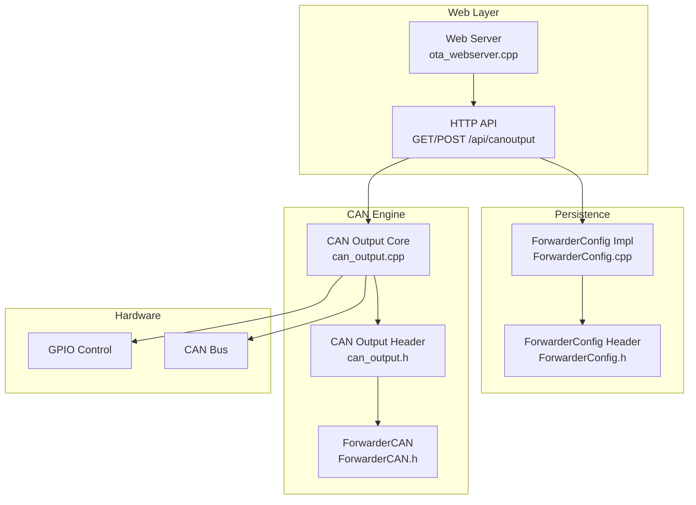
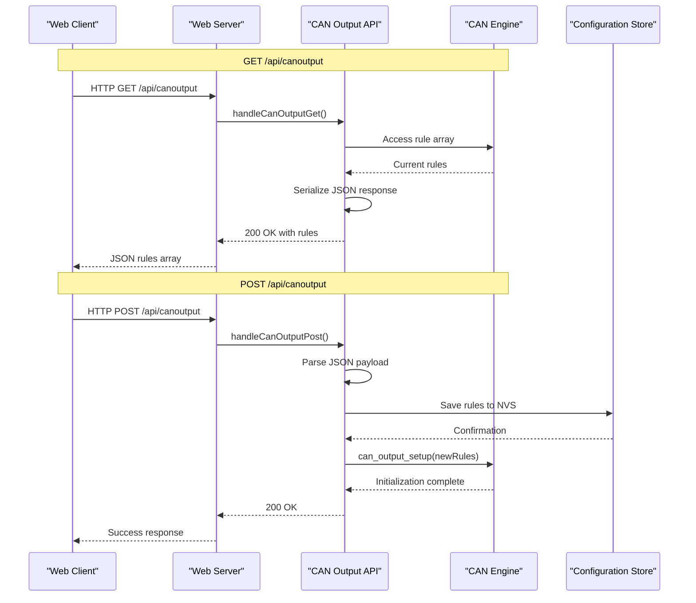
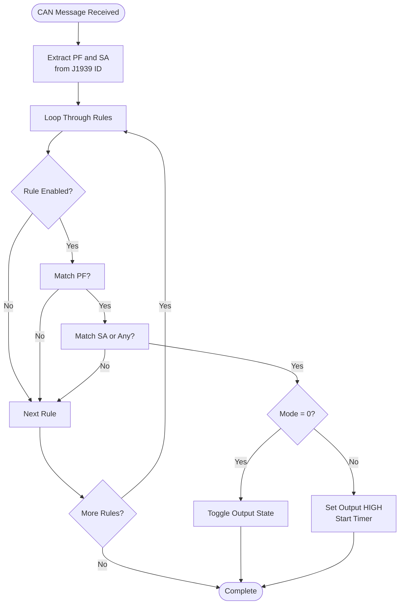
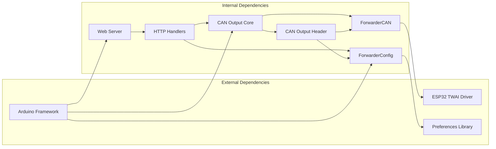

# CAN Output Rules Configuration

<cite>
**Referenced Files in This Document**
- [can_output.h](file://src/can_output.h)
- [can_output.cpp](file://src/can_output.cpp)
- [ForwarderConfig.h](file://lib/ForwarderConfig/ForwarderConfig.h)
- [ForwarderConfig.cpp](file://lib/ForwarderConfig/ForwarderConfig.cpp)
- [ForwarderCAN.h](file://lib/ForwarderCAN/ForwarderCAN.h)
- [ota_webserver.cpp](file://src/ota_webserver.cpp)
- [web_state.h](file://src/web_state.h)
- [ecu_motor_driver.cpp](file://src/ecu_motor_driver.cpp)
</cite>

## Table of Contents
1. [Introduction](#introduction)
2. [Project Structure](#project-structure)
3. [Core Components](#core-components)
4. [Architecture Overview](#architecture-overview)
5. [Detailed Component Analysis](#detailed-component-analysis)
6. [Dependency Analysis](#dependency-analysis)
7. [Performance Considerations](#performance-considerations)
8. [Troubleshooting Guide](#troubleshooting-guide)
9. [Conclusion](#conclusion)

## Introduction
This document provides comprehensive technical documentation for the CAN output rules configuration endpoints in the Forwarder CAN Controller firmware. It covers the GET /api/canoutput endpoint for retrieving current CAN-triggered GPIO output rules and the POST /api/canoutput endpoint for saving new CAN output rules. The documentation explains the rule structure, validation rules, operational modes, and integration patterns with external devices such as relays and indicators.

## Project Structure
The CAN output rules functionality spans several modules:
- Web API layer: HTTP endpoints for rule management
- CAN processing engine: rule evaluation and GPIO control
- Configuration persistence: non-volatile storage of rules
- Hardware abstraction: GPIO pin control and CAN message parsing

**Diagram sources**
- [ota_webserver.cpp:786-787](file://src/ota_webserver.cpp#L786-L787)
- [can_output.cpp:1-66](file://src/can_output.cpp#L1-L66)
- [ForwarderConfig.cpp:129-169](file://lib/ForwarderConfig/ForwarderConfig.cpp#L129-L169)

**Section sources**
- [ota_webserver.cpp:766-791](file://src/ota_webserver.cpp#L766-L791)
- [can_output.h:1-11](file://src/can_output.h#L1-L11)
- [ForwarderConfig.h:26-39](file://lib/ForwarderConfig/ForwarderConfig.h#L26-L39)

## Core Components
The CAN output rules system consists of four primary components:

### Rule Data Structure
Each CAN output rule is defined by the CanOutputRule struct with seven fields:
- enabled: Boolean flag controlling rule activation
- matchPF: Target PDU Format byte (0-255)
- matchSA: Target Source Address (0 = any, 0-255)
- gpioPin: Output GPIO pin number (0 = disabled)
- mode: Operation mode (0 = toggle, 1 = momentary)
- momentaryMs: Pulse duration for momentary mode (50-10000 ms)

### Rule Evaluation Engine
The can_output module processes incoming CAN messages and evaluates rules against J1939 message IDs. It supports two operation modes:
- Toggle mode: Inverts output state on each match
- Momentary mode: Pulses output HIGH for configured duration

### Configuration Persistence
Rules are stored in non-volatile storage using the ForwarderConfig class, which packs rule data into 8-byte blocks for efficient storage and retrieval.

### Web API Interface
The web server exposes REST endpoints for rule management with JSON payloads and maintains rule state in shared memory.

**Section sources**
- [ForwarderConfig.h:28-39](file://lib/ForwarderConfig/ForwarderConfig.h#L28-L39)
- [can_output.cpp:29-61](file://src/can_output.cpp#L29-L61)
- [ForwarderConfig.cpp:31-40](file://lib/ForwarderConfig/ForwarderConfig.cpp#L31-L40)

## Architecture Overview
The CAN output rules architecture follows a layered design with clear separation of concerns:

**Diagram sources**
- [ota_webserver.cpp:659-703](file://src/ota_webserver.cpp#L659-L703)
- [can_output.cpp:7-19](file://src/can_output.cpp#L7-L19)
- [ForwarderConfig.cpp:161-169](file://lib/ForwarderConfig/ForwarderConfig.cpp#L161-L169)

## Detailed Component Analysis

### GET /api/canoutput Endpoint
The GET endpoint retrieves the current CAN output rules configuration from persistent storage and returns them as a JSON array.

#### Request/Response Specification
- Method: GET
- Path: /api/canoutput
- Content-Type: application/json
- Response: JSON object containing "rules" array with up to four rule objects

#### Response Payload Structure
Each rule object contains:
- enabled: boolean (true/false)
- matchPF: integer (0-255)
- matchSA: integer (0-255, 0 means any)
- gpioPin: integer (0-4095, 0 means disabled)
- mode: integer (0 or 1)
- momentaryMs: integer (50-10000)

#### Implementation Details
The endpoint serializes the global rule array into JSON format, iterating through all configured rules and constructing individual JSON objects for each rule.

**Section sources**
- [ota_webserver.cpp:659-675](file://src/ota_webserver.cpp#L659-L675)
- [ForwarderConfig.cpp:129-159](file://lib/ForwarderConfig/ForwarderConfig.cpp#L129-L159)

### POST /api/canoutput Endpoint
The POST endpoint saves new CAN output rules to persistent storage and reinitializes the GPIO output system.

#### Request/Response Specification
- Method: POST
- Path: /api/canoutput
- Content-Type: application/json
- Request Body: JSON object containing "rules" array with up to four rule objects
- Response: JSON object with "ok": true on success

#### Request Payload Structure
The request payload mirrors the response structure with the addition of ruleIdx field:
- rules: array of up to four rule objects
- Each rule object includes: ruleIdx, enabled, matchPF, matchSA, gpioPin, mode, momentaryMs

#### Validation Rules
The system enforces the following validation constraints:
- ruleIdx: Must be 0-3 (four rules total)
- matchPF: Integer 0-255
- matchSA: Integer 0-255 (0 means match any source address)
- gpioPin: Integer 0-4095 (0 disables the rule)
- mode: Integer 0 or 1 (toggle or momentary)
- momentaryMs: Integer 50-10000 milliseconds

#### Processing Flow
1. Parse JSON payload and extract rules array
2. Validate each rule against constraints
3. Save rules to non-volatile storage using ForwarderConfig
4. Reinitialize GPIO outputs with new configuration
5. Return success response

**Section sources**
- [ota_webserver.cpp:677-703](file://src/ota_webserver.cpp#L677-L703)
- [ForwarderConfig.cpp:161-169](file://lib/ForwarderConfig/ForwarderConfig.cpp#L161-L169)

### CAN Message Processing Engine
The core engine evaluates incoming CAN messages against configured rules and controls GPIO outputs accordingly.

#### Rule Matching Algorithm

**Diagram sources**
- [can_output.cpp:29-49](file://src/can_output.cpp#L29-L49)

#### Operation Modes
- Toggle Mode (mode = 0): Inverts current output state on each message match
- Momentary Mode (mode = 1): Sets output HIGH immediately, then automatically resets after momentaryMs milliseconds

#### GPIO Management
The system initializes GPIO pins during setup and maintains output state for each rule. Pins are configured as outputs with initial LOW state.

**Section sources**
- [can_output.cpp:7-19](file://src/can_output.cpp#L7-L19)
- [can_output.cpp:21-27](file://src/can_output.cpp#L21-L27)
- [can_output.cpp:51-61](file://src/can_output.cpp#L51-L61)

### Configuration Persistence
Rules are stored using the ForwarderConfig class with 8-byte packing for efficient non-volatile storage.

#### Storage Format
Each rule is packed into 8 bytes:
- Byte 0: enabled flag (0 or 1)
- Bytes 1-2: matchPF and matchSA
- Byte 3: gpioPin
- Byte 4: mode
- Bytes 5-6: momentaryMs (little-endian)
- Byte 7: reserved

#### Load/Save Operations
- loadCanOutputRules: Reads all rules from NVS, providing defaults for missing entries
- saveCanOutputRule: Writes individual rule to NVS storage

**Section sources**
- [ForwarderConfig.cpp:31-40](file://lib/ForwarderConfig/ForwarderConfig.cpp#L31-L40)
- [ForwarderConfig.cpp:129-159](file://lib/ForwarderConfig/ForwarderConfig.cpp#L129-L159)
- [ForwarderConfig.cpp:161-169](file://lib/ForwarderConfig/ForwarderConfig.cpp#L161-L169)

## Dependency Analysis
The CAN output rules system has well-defined dependencies between components:

**Diagram sources**
- [ota_webserver.cpp:1-12](file://src/ota_webserver.cpp#L1-L12)
- [can_output.h:1-6](file://src/can_output.h#L1-L6)
- [ForwarderConfig.h:1-5](file://lib/ForwarderConfig/ForwarderConfig.h#L1-L5)

### Key Dependencies
- Arduino framework provides GPIO control and timing functions
- ESP32 TWAI driver handles CAN bus communication
- Preferences library manages non-volatile storage
- ForwarderCAN provides J1939 message parsing utilities
- ForwarderConfig encapsulates rule serialization and storage

**Section sources**
- [ForwarderCAN.h:1-123](file://lib/ForwarderCAN/ForwarderCAN.h#L1-L123)
- [ForwarderConfig.h:1-92](file://lib/ForwarderConfig/ForwarderConfig.h#L1-L92)

## Performance Considerations
The CAN output rules system is designed for real-time performance with minimal latency:

### Timing Constraints
- Rule evaluation occurs in interrupt context during CAN message processing
- Momentary mode uses millisecond-precision timing with millis() function
- GPIO operations complete within microsecond timeframe

### Memory Management
- Rules stored in static arrays to avoid dynamic allocation
- 8-byte packing minimizes storage overhead
- No heap allocation during runtime operation

### Scalability Limits
- Maximum 4 concurrent rules (MAX_CAN_OUTPUT_RULES = 4)
- Each rule requires 1 GPIO pin
- Momentary mode supports up to 10 seconds per rule

## Troubleshooting Guide

### Common Issues and Solutions

#### Rule Not Triggering
**Symptoms**: CAN messages sent but GPIO output does not change
**Causes**:
- Rule disabled (enabled = false)
- Incorrect matchPF or matchSA values
- gpioPin set to 0 (disabled)
- GPIO pin not configured as output

**Solutions**:
1. Verify rule is enabled in configuration
2. Check matchPF matches the CAN message PDU format
3. Confirm matchSA matches source address or set to 0 for any
4. Ensure gpioPin is set to a valid GPIO number

#### Toggle Mode Not Working
**Symptoms**: Output toggles erratically or not at all
**Causes**:
- Multiple rules matching the same message
- Rapid message flooding causing rapid toggling
- Hardware debounce issues

**Solutions**:
1. Review all active rules for conflicts
2. Consider using momentary mode for rapid sequences
3. Add hardware filtering if needed

#### Momentary Mode Problems
**Symptoms**: Output pulses but doesn't reset
**Causes**:
- momentaryMs timeout too short for device response
- GPIO pin not connected to load
- Power supply insufficient for load

**Solutions**:
1. Increase momentaryMs value appropriately
2. Verify physical connections to relay/indicator
3. Check power requirements of connected device

#### Configuration Persistence Issues
**Symptoms**: Rules reset after reboot
**Causes**:
- NVS storage corruption
- Insufficient storage space
- Write failures during save operation

**Solutions**:
1. Reset device configuration and reapply rules
2. Check for NVS errors in serial output
3. Verify sufficient free storage space

### Validation Error Messages
The system validates inputs and logs errors to serial output:
- Invalid rule indices (must be 0-3)
- Out-of-range numeric values
- GPIO pin conflicts between rules

**Section sources**
- [can_output.cpp:14-16](file://src/can_output.cpp#L14-L16)
- [ForwarderConfig.cpp:161-169](file://lib/ForwarderConfig/ForwarderConfig.cpp#L161-L169)

## Conclusion
The CAN output rules configuration system provides a robust, real-time mechanism for controlling GPIO outputs based on CAN bus messages. The REST API endpoints offer convenient web-based configuration management, while the underlying engine ensures reliable rule evaluation and GPIO control. The system's design balances simplicity with flexibility, supporting both basic toggle operations and sophisticated momentary timing for various external device applications.

The four-rule limit and 8-byte storage format provide efficient memory usage while maintaining adequate flexibility for typical agricultural vehicle applications. Proper configuration of matchPF, matchSA, and timing parameters enables precise control of relays, indicators, and other actuators through the CAN bus.