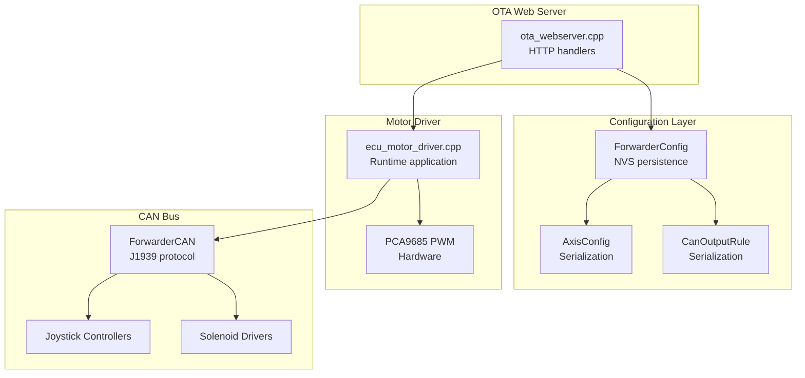
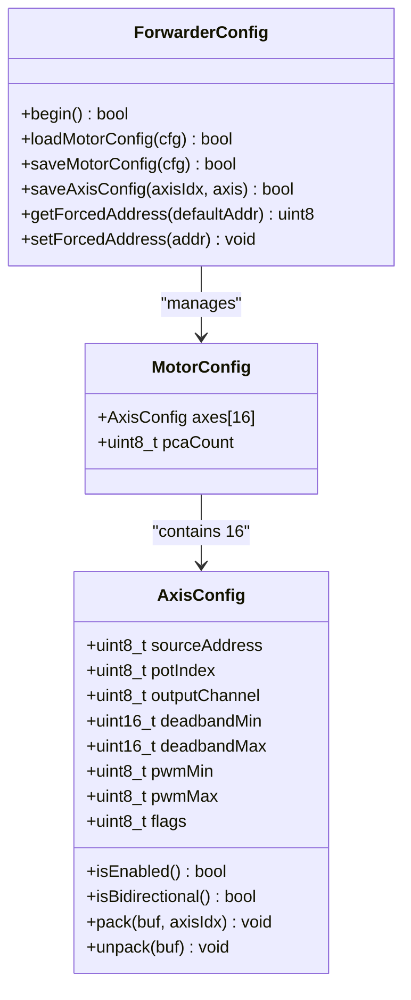
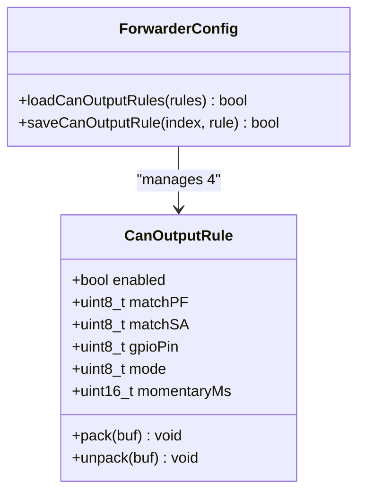
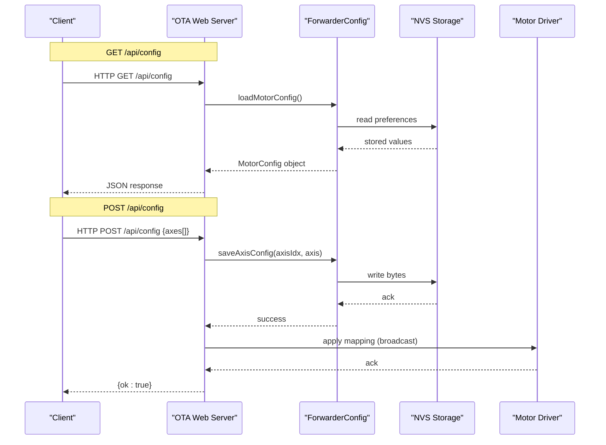
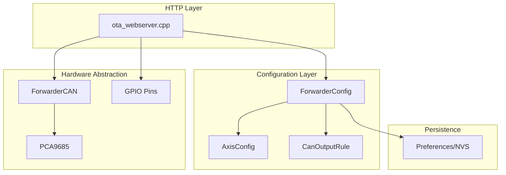

# Configuration Management Endpoints

<cite>
**Referenced Files in This Document**
- [main.cpp](file://src/main.cpp)
- [ecu_motor_driver.cpp](file://src/ecu_motor_driver.cpp)
- [ecu_motor_driver.h](file://src/ecu_motor_driver.h)
- [ota_webserver.cpp](file://src/ota_webserver.cpp)
- [ota_webserver.h](file://src/ota_webserver.h)
- [ForwarderConfig.h](file://lib/ForwarderConfig/ForwarderConfig.h)
- [ForwarderConfig.cpp](file://lib/ForwarderConfig/ForwarderConfig.cpp)
- [can_output.cpp](file://src/can_output.cpp)
- [can_output.h](file://src/can_output.h)
- [ForwarderCAN.h](file://lib/ForwarderCAN/ForwarderCAN.h)
</cite>

## Table of Contents
1. [Introduction](#introduction)
2. [Project Structure](#project-structure)
3. [Core Components](#core-components)
4. [Architecture Overview](#architecture-overview)
5. [Detailed Component Analysis](#detailed-component-analysis)
6. [Dependency Analysis](#dependency-analysis)
7. [Performance Considerations](#performance-considerations)
8. [Troubleshooting Guide](#troubleshooting-guide)
9. [Conclusion](#conclusion)

## Introduction
This document provides comprehensive documentation for the configuration management API endpoints used to configure motor driver axis mappings and CAN output rules. It covers:
- GET /api/config: Returns current motor driver configuration including pcaCount and axes array
- POST /api/config: Saves new axis mappings
- GET /api/canoutput: Returns current CAN output rules
- POST /api/canoutput: Saves new CAN output rules

The documentation includes JSON schemas, parameter validation rules, and practical examples of configuration operations.

## Project Structure
The configuration endpoints are implemented in the OTA web server module and backed by the ForwarderConfig library. The motor driver logic integrates with these APIs to apply configuration changes.



**Diagram sources**
- [ota_webserver.cpp:766-791](file://src/ota_webserver.cpp#L766-L791)
- [ForwarderConfig.cpp:54-91](file://lib/ForwarderConfig/ForwarderConfig.cpp#L54-L91)
- [ecu_motor_driver.cpp:290-325](file://src/ecu_motor_driver.cpp#L290-L325)

**Section sources**
- [main.cpp:1-32](file://src/main.cpp#L1-L32)
- [ota_webserver.cpp:766-791](file://src/ota_webserver.cpp#L766-L791)

## Core Components
This section documents the key data structures and their roles in configuration management.

### Axis Configuration Model
The axis configuration defines how joystick inputs are mapped to solenoid outputs.



**Diagram sources**
- [ForwarderConfig.h:41-62](file://lib/ForwarderConfig/ForwarderConfig.h#L41-L62)
- [ForwarderConfig.cpp:6-50](file://lib/ForwarderConfig/ForwarderConfig.cpp#L6-L50)

### CAN Output Rule Model
The CAN output rule defines how incoming CAN messages trigger GPIO outputs.



**Diagram sources**
- [ForwarderConfig.h:29-39](file://lib/ForwarderConfig/ForwarderConfig.h#L29-L39)
- [ForwarderConfig.cpp:129-169](file://lib/ForwarderConfig/ForwarderConfig.cpp#L129-L169)

**Section sources**
- [ForwarderConfig.h:41-62](file://lib/ForwarderConfig/ForwarderConfig.h#L41-L62)
- [ForwarderConfig.cpp:6-50](file://lib/ForwarderConfig/ForwarderConfig.cpp#L6-L50)

## Architecture Overview
The configuration management system follows a layered architecture with HTTP handlers delegating to configuration managers and persistence layers.



**Diagram sources**
- [ota_webserver.cpp:565-626](file://src/ota_webserver.cpp#L565-L626)
- [ForwarderConfig.cpp:76-127](file://lib/ForwarderConfig/ForwarderConfig.cpp#L76-L127)

**Section sources**
- [ota_webserver.cpp:565-626](file://src/ota_webserver.cpp#L565-L626)
- [ForwarderConfig.cpp:76-127](file://lib/ForwarderConfig/ForwarderConfig.cpp#L76-L127)

## Detailed Component Analysis

### GET /api/config Endpoint
Returns the current motor driver configuration including PCA count and axis mappings.

#### Response Schema
```json
{
  "pcaCount": 1,
  "axes": [
    {
      "sourceAddress": 33,
      "potIndex": 0,
      "outputChannel": 0,
      "deadbandMin": 492,
      "deadbandMax": 532,
      "pwmMin": 64,
      "pwmMax": 128,
      "flags": 1
    }
  ]
}
```

#### Parameter Validation Rules
- pcaCount: Integer (1 or 2)
- axes: Array of 16 elements
- Each axis element validates:
  - sourceAddress: 0-255 (0 disables axis)
  - potIndex: 0-2 (0=Pot1, 1=Pot2, 2=Pot3)
  - outputChannel: 0-15 (PCA9685 channels)
  - deadbandMin: 0-1023 (ADC raw)
  - deadbandMax: 0-1023 (ADC raw)
  - pwmMin: 0-255 (scaled to 12-bit)
  - pwmMax: 0-255 (scaled to 12-bit)
  - flags: Bitmask (0=disabled, 1=enabled, 2=bidirectional)

#### Practical Example
```bash
curl -s http://192.168.4.1/api/config
```

**Section sources**
- [ota_webserver.cpp:565-585](file://src/ota_webserver.cpp#L565-L585)
- [ForwarderConfig.cpp:76-104](file://lib/ForwarderConfig/ForwarderConfig.cpp#L76-L104)

### POST /api/config Endpoint
Saves new axis mappings to the motor driver configuration.

#### Request Payload Schema
```json
{
  "axes": [
    {
      "axisIdx": 0,
      "sourceAddress": 33,
      "potIndex": 0,
      "outputChannel": 0,
      "deadbandMin": 492,
      "deadbandMax": 532,
      "pwmMin": 64,
      "pwmMax": 128,
      "flags": 1
    }
  ]
}
```

#### Parameter Validation Rules
- axisIdx: 0-15 (array index)
- All axis fields validated according to GET endpoint rules
- At least one axis must be provided for successful save

#### Processing Logic
1. Parse JSON payload
2. Validate each axis configuration
3. Update in-memory MotorConfig
4. Persist to NVS storage
5. Broadcast configuration to motor driver via CAN
6. Return success response

#### Practical Example
```bash
curl -s -X POST http://192.168.4.1/api/config \
  -H "Content-Type: application/json" \
  -d '{"axes":[{"axisIdx":0,"sourceAddress":33,"potIndex":0,"outputChannel":0,"deadbandMin":492,"deadbandMax":532,"pwmMin":64,"pwmMax":128,"flags":1}]}'
```

**Section sources**
- [ota_webserver.cpp:587-626](file://src/ota_webserver.cpp#L587-L626)
- [ForwarderConfig.cpp:119-127](file://lib/ForwarderConfig/ForwarderConfig.cpp#L119-L127)

### GET /api/canoutput Endpoint
Returns current CAN output rules for GPIO control.

#### Response Schema
```json
{
  "rules": [
    {
      "enabled": true,
      "matchPF": 32,
      "matchSA": 0,
      "gpioPin": 2,
      "mode": 0,
      "momentaryMs": 500
    }
  ]
}
```

#### Parameter Validation Rules
- rules: Array of 4 elements
- Each rule validates:
  - enabled: Boolean
  - matchPF: 0-255 (J1939 PDU Format)
  - matchSA: 0-255 (0 means any source address)
  - gpioPin: 0-255 (0 disables rule)
  - mode: 0 (toggle) or 1 (momentary)
  - momentaryMs: 50-10000 (pulse duration in milliseconds)

#### Practical Example
```bash
curl -s http://192.168.4.1/api/canoutput
```

**Section sources**
- [ota_webserver.cpp:659-675](file://src/ota_webserver.cpp#L659-L675)
- [ForwarderConfig.cpp:129-159](file://lib/ForwarderConfig/ForwarderConfig.cpp#L129-L159)

### POST /api/canoutput Endpoint
Saves new CAN output rules to control GPIO pins based on CAN messages.

#### Request Payload Schema
```json
{
  "rules": [
    {
      "ruleIdx": 0,
      "enabled": true,
      "matchPF": 32,
      "matchSA": 0,
      "gpioPin": 2,
      "mode": 0,
      "momentaryMs": 500
    }
  ]
}
```

#### Parameter Validation Rules
- ruleIdx: 0-3 (array index)
- All rule fields validated according to GET endpoint rules
- gpioPin must be a valid GPIO pin for the hardware

#### Processing Logic
1. Parse JSON payload
2. Validate each rule configuration
3. Update in-memory CanOutputRule array
4. Persist to NVS storage
5. Reinitialize GPIO outputs with new configuration
6. Return success response

#### Practical Example
```bash
curl -s -X POST http://192.168.4.1/api/canoutput \
  -H "Content-Type: application/json" \
  -d '{"rules":[{"ruleIdx":0,"enabled":true,"matchPF":32,"matchSA":0,"gpioPin":2,"mode":0,"momentaryMs":500}]}'
```

**Section sources**
- [ota_webserver.cpp:677-703](file://src/ota_webserver.cpp#L677-L703)
- [ForwarderConfig.cpp:161-169](file://lib/ForwarderConfig/ForwarderConfig.cpp#L161-L169)

## Dependency Analysis
The configuration endpoints depend on several layers of abstraction and hardware interfaces.



**Diagram sources**
- [ota_webserver.cpp:13-12](file://src/ota_webserver.cpp#L13-L12)
- [ForwarderConfig.cpp:54-91](file://lib/ForwarderConfig/ForwarderConfig.cpp#L54-L91)

**Section sources**
- [ota_webserver.cpp:13-12](file://src/ota_webserver.cpp#L13-L12)
- [ForwarderConfig.cpp:54-91](file://lib/ForwarderConfig/ForwarderConfig.cpp#L54-L91)

## Performance Considerations
- Configuration updates are persisted to non-volatile storage, which may introduce latency
- CAN broadcasting during configuration updates occurs with 5ms delays between messages
- GPIO output rule changes require reinitialization of digital pins
- Memory usage for configuration arrays is constant (16 axes × 8 bytes + 4 rules × 8 bytes)

## Troubleshooting Guide
Common issues and solutions for configuration management:

### Configuration Not Persisting
- Verify NVS storage is initialized correctly
- Check for write failures in ForwarderConfig methods
- Ensure sufficient free NVS space

### CAN Configuration Not Applied
- Confirm motor driver is online and responding
- Verify CAN message transmission succeeds
- Check for address conflicts on the bus

### GPIO Output Rules Not Working
- Validate gpioPin is a valid output pin
- Confirm rule mode is supported by hardware
- Check for conflicting rule configurations

**Section sources**
- [ForwarderConfig.cpp:106-127](file://lib/ForwarderConfig/ForwarderConfig.cpp#L106-L127)
- [can_output.cpp:7-19](file://src/can_output.cpp#L7-L19)

## Conclusion
The configuration management API provides a robust interface for managing motor driver axis mappings and CAN output rules. The system combines HTTP-based configuration with persistent storage and real-time application to hardware interfaces. Proper validation and error handling ensure reliable operation in field conditions.