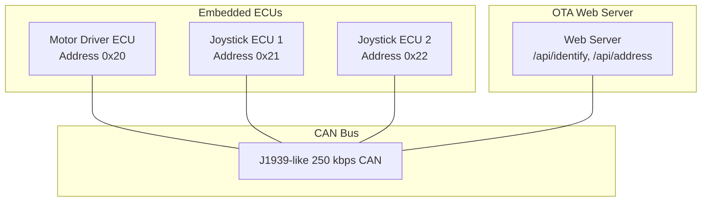
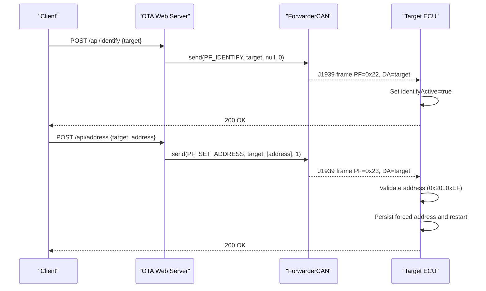
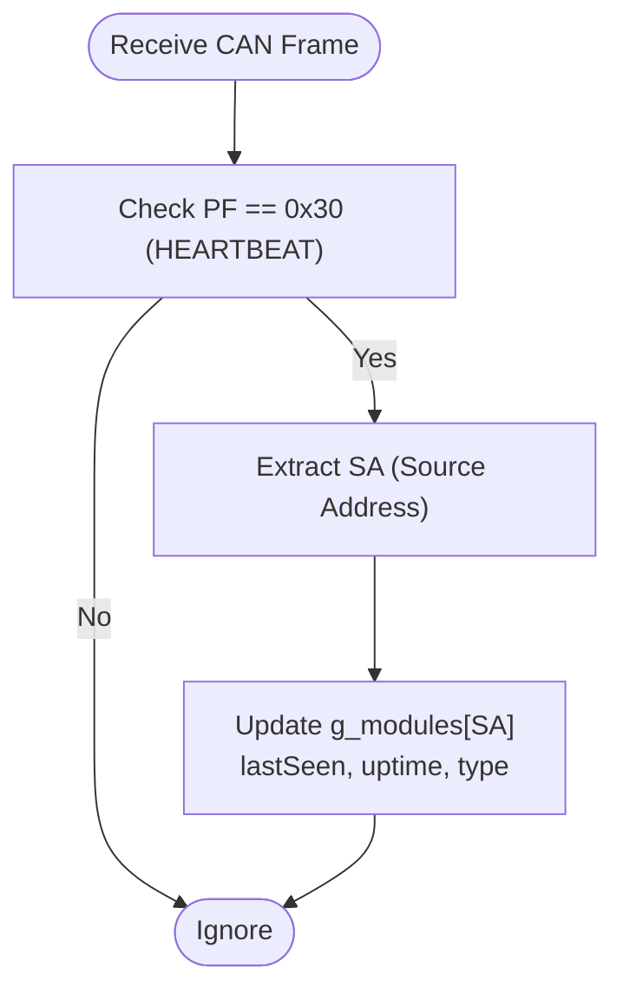
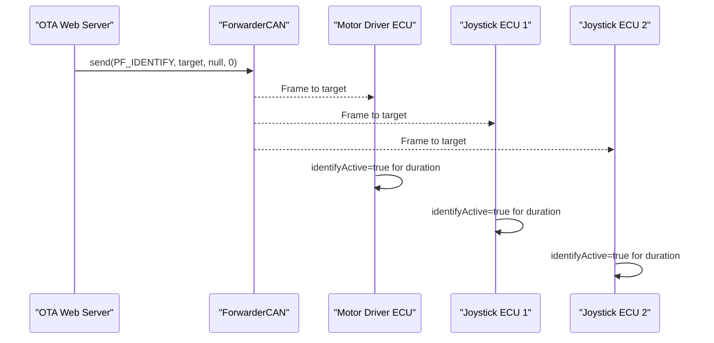
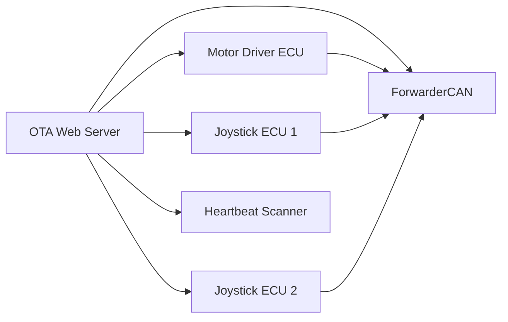

# Device Management Endpoints

<cite>
**Referenced Files in This Document**
- [README.md](file://README.md)
- [platformio.ini](file://platformio.ini)
- [src/main.cpp](file://src/main.cpp)
- [src/web_state.h](file://src/web_state.h)
- [src/web_state.cpp](file://src/web_state.cpp)
- [src/ecu_motor_driver.cpp](file://src/ecu_motor_driver.cpp)
- [src/ecu_motor_driver.h](file://src/ecu_motor_driver.h)
- [src/ecu_joystick.cpp](file://src/ecu_joystick.cpp)
- [src/ecu_joystick.h](file://src/ecu_joystick.h)
- [src/can_output.cpp](file://src/can_output.cpp)
- [src/can_output.h](file://src/can_output.h)
- [src/ota_webserver.cpp](file://src/ota_webserver.cpp)
- [src/ota_webserver.h](file://src/ota_webserver.h)
- [lib/ForwarderCAN/ForwarderCAN.h](file://lib/ForwarderCAN/ForwarderCAN.h)
</cite>

## Table of Contents
1. [Introduction](#introduction)
2. [Project Structure](#project-structure)
3. [Core Components](#core-components)
4. [Architecture Overview](#architecture-overview)
5. [Detailed Component Analysis](#detailed-component-analysis)
6. [Dependency Analysis](#dependency-analysis)
7. [Performance Considerations](#performance-considerations)
8. [Troubleshooting Guide](#troubleshooting-guide)
9. [Conclusion](#conclusion)
10. [Appendices](#appendices)

## Introduction
This document describes the device management API endpoints for identifying devices and dynamically assigning addresses on a J1939-like CAN bus. It focuses on:
- POST /api/identify: Sends an identify command to a target device
- POST /api/address: Requests a device to change its address

It also explains how these endpoints integrate with the CAN heartbeat scanning system that discovers and tracks devices on the bus, and provides practical workflows for device discovery, address claiming, and error handling.

## Project Structure
The system consists of:
- An ESP32-S3-based embedded application with two ECU roles:
  - Motor driver ECU (controls solenoids)
  - Joystick ECUs (publish joystick inputs)
- A shared CAN/J1939 library
- An optional OTA web server that exposes the device management endpoints

**Diagram sources**
- [platformio.ini:17-30](file://platformio.ini#L17-L30)
- [platformio.ini:31-47](file://platformio.ini#L31-L47)
- [platformio.ini:65-81](file://platformio.ini#L65-L81)
- [README.md:8-14](file://README.md#L8-L14)

**Section sources**
- [README.md:1-131](file://README.md#L1-L131)
- [platformio.ini:1-82](file://platformio.ini#L1-L82)

## Core Components
- ForwarderCAN library defines J1939-like addressing and PF constants used by all ECUs and the web server.
- OTA web server implements HTTP handlers for /api/identify and /api/address and runs a heartbeat scanner to discover devices.
- ECU implementations (motor driver and joysticks) react to identify and address-change commands and broadcast heartbeats.

Key capabilities:
- Identify command triggers a temporary LED blink pattern on the target device.
- Address change requests are validated and applied by the target device, which persists the new address and reboots.
- Heartbeat scanning detects devices and populates the module registry used by the UI.

**Section sources**
- [lib/ForwarderCAN/ForwarderCAN.h:38-51](file://lib/ForwarderCAN/ForwarderCAN.h#L38-L51)
- [src/ota_webserver.cpp:639-657](file://src/ota_webserver.cpp#L639-L657)
- [src/ecu_motor_driver.cpp:227-245](file://src/ecu_motor_driver.cpp#L227-L245)
- [src/ecu_joystick.cpp:131-146](file://src/ecu_joystick.cpp#L131-L146)
- [src/ota_webserver.cpp:742-761](file://src/ota_webserver.cpp#L742-L761)

## Architecture Overview
The device management endpoints are implemented in the OTA web server and communicate with ECUs over the CAN bus using J1939-like PF values.

**Diagram sources**
- [src/ota_webserver.cpp:639-657](file://src/ota_webserver.cpp#L639-L657)
- [lib/ForwarderCAN/ForwarderCAN.h:45-46](file://lib/ForwarderCAN/ForwarderCAN.h#L45-L46)
- [src/ecu_motor_driver.cpp:234-244](file://src/ecu_motor_driver.cpp#L234-L244)
- [src/ecu_joystick.cpp:136-145](file://src/ecu_joystick.cpp#L136-L145)

## Detailed Component Analysis

### POST /api/identify
Purpose:
- Triggers an identify action on a target device by sending a J1939 frame with PF_IDENTIFY (0x22) and the target address as the destination.

Behavior:
- The web server handler parses the JSON payload for the target device address and sends a broadcast identify command to that address.
- On receipt, the target device sets an internal flag to activate a blinking LED pattern for a short duration.

Payload format:
- Content-Type: application/json
- Body: { "target": number (device address) }

Response:
- 200 OK with a simple JSON response indicating success.

Practical example:
- From the UI, click the "Identify" button for a discovered module. The UI sends POST /api/identify with the module’s address.

Error handling:
- If the target address is not present in the heartbeat registry, the identify command still succeeds from the server perspective; however, the target device may ignore it if it is not currently online or does not match its own address.

Relationship to heartbeat scanning:
- The heartbeat scanner populates the module registry used by the UI. While the identify endpoint itself does not depend on the heartbeat registry, the UI uses it to present selectable targets.

**Section sources**
- [src/ota_webserver.cpp:384-389](file://src/ota_webserver.cpp#L384-L389)
- [src/ota_webserver.cpp:639-646](file://src/ota_webserver.cpp#L639-L646)
- [lib/ForwarderCAN/ForwarderCAN.h:45](file://lib/ForwarderCAN/ForwarderCAN.h#L45)
- [src/ecu_motor_driver.cpp:227-233](file://src/ecu_motor_driver.cpp#L227-L233)
- [src/ecu_joystick.cpp:131-135](file://src/ecu_joystick.cpp#L131-L135)
- [src/ota_webserver.cpp:742-761](file://src/ota_webserver.cpp#L742-L761)

### POST /api/address
Purpose:
- Requests a device to change its address to a new value. The request is sent as a J1939 frame with PF_SET_ADDRESS (0x23).

Behavior:
- The web server handler parses the JSON payload for target and address, validates the address range, and sends the command to the target device.
- On receipt, the target device validates the new address (must be within 0x20..0xEF), persists it as a forced address, and restarts to apply the new address.

Payload format:
- Content-Type: application/json
- Body: { "target": number, "address": number }

Validation rules:
- The new address must be within the valid range 0x20..0xEF. Addresses outside this range are ignored.

Response:
- 200 OK with a simple JSON response indicating success.

Practical example:
- From the UI, enter a new address in the input field for a module and click "Set". The UI sends POST /api/address with the current address as target and the new address as address.

Error handling:
- Invalid addresses (outside 0x20..0xEF) are ignored by the target device.
- If the target device is unreachable or not responding, the server still returns 200 OK after attempting to send; the client should monitor the heartbeat registry to confirm the change.

**Section sources**
- [src/ota_webserver.cpp:391-397](file://src/ota_webserver.cpp#L391-L397)
- [src/ota_webserver.cpp:648-657](file://src/ota_webserver.cpp#L648-L657)
- [lib/ForwarderCAN/ForwarderCAN.h:46](file://lib/ForwarderCAN/ForwarderCAN.h#L46)
- [src/ecu_motor_driver.cpp:234-244](file://src/ecu_motor_driver.cpp#L234-L244)
- [src/ecu_joystick.cpp:136-145](file://src/ecu_joystick.cpp#L136-L145)

### Relationship to CAN Heartbeat Scanning
The heartbeat scanner continuously receives J1939 frames with PF_HEARTBEAT (0x30) and updates the module registry with device presence, type, uptime, and last-seen timestamps. The UI uses this registry to populate the "Modules" table and to enable the identify and address actions.

**Diagram sources**
- [src/ota_webserver.cpp:742-761](file://src/ota_webserver.cpp#L742-L761)
- [lib/ForwarderCAN/ForwarderCAN.h:50](file://lib/ForwarderCAN/ForwarderCAN.h#L50)

**Section sources**
- [src/ota_webserver.cpp:742-761](file://src/ota_webserver.cpp#L742-L761)
- [lib/ForwarderCAN/ForwarderCAN.h:50](file://lib/ForwarderCAN/ForwarderCAN.h#L50)

### Endpoint Implementation Details
- The web server routes are registered during initialization and handle the identify and address endpoints.
- The handlers rely on the ForwarderCAN instance to send frames with the appropriate PF and destination address.
- ECU implementations listen for PF_IDENTIFY and PF_SET_ADDRESS and implement the corresponding behaviors.

**Diagram sources**
- [src/ota_webserver.cpp:784-785](file://src/ota_webserver.cpp#L784-L785)
- [lib/ForwarderCAN/ForwarderCAN.h:45](file://lib/ForwarderCAN/ForwarderCAN.h#L45)
- [src/ecu_motor_driver.cpp:227-233](file://src/ecu_motor_driver.cpp#L227-L233)
- [src/ecu_joystick.cpp:131-135](file://src/ecu_joystick.cpp#L131-L135)

**Section sources**
- [src/ota_webserver.cpp:639-657](file://src/ota_webserver.cpp#L639-L657)
- [src/ota_webserver.cpp:784-785](file://src/ota_webserver.cpp#L784-L785)
- [lib/ForwarderCAN/ForwarderCAN.h:45-46](file://lib/ForwarderCAN/ForwarderCAN.h#L45-L46)

## Dependency Analysis
The device management endpoints depend on:
- ForwarderCAN for constructing and sending J1939 frames
- ECU implementations to interpret identify and address-change commands
- Heartbeat scanning to maintain the module registry used by the UI

**Diagram sources**
- [src/ota_webserver.cpp:784-785](file://src/ota_webserver.cpp#L784-L785)
- [src/ecu_motor_driver.cpp:227-245](file://src/ecu_motor_driver.cpp#L227-L245)
- [src/ecu_joystick.cpp:131-146](file://src/ecu_joystick.cpp#L131-L146)
- [src/ota_webserver.cpp:742-761](file://src/ota_webserver.cpp#L742-L761)

**Section sources**
- [src/ota_webserver.cpp:784-785](file://src/ota_webserver.cpp#L784-L785)
- [src/ecu_motor_driver.cpp:227-245](file://src/ecu_motor_driver.cpp#L227-L245)
- [src/ecu_joystick.cpp:131-146](file://src/ecu_joystick.cpp#L131-L146)
- [src/ota_webserver.cpp:742-761](file://src/ota_webserver.cpp#L742-L761)

## Performance Considerations
- Heartbeat scanning runs continuously and should not block the main loop; it processes incoming frames and updates the module registry efficiently.
- Identify and address endpoints are lightweight; they send a single CAN frame and return immediately.
- Frequent address changes should be avoided to prevent repeated reboots and potential bus instability.

## Troubleshooting Guide
Common issues and resolutions:
- Invalid address range: Ensure the requested address is within 0x20..0xEF. Addresses outside this range are ignored by target devices.
- Target device offline: If the target device is not broadcasting heartbeats, the identify or address command may not be received. Verify bus connectivity and device power.
- Address conflict: If multiple devices claim the same address, address claiming and arbitration rules apply. Use the heartbeat registry to identify conflicts.
- Persistent address not taking effect: Confirm the device has restarted after applying the new address. The device persists the forced address and reboots automatically upon receiving a valid address-change request.

**Section sources**
- [src/ecu_motor_driver.cpp:234-244](file://src/ecu_motor_driver.cpp#L234-L244)
- [src/ecu_joystick.cpp:136-145](file://src/ecu_joystick.cpp#L136-L145)
- [src/ota_webserver.cpp:742-761](file://src/ota_webserver.cpp#L742-L761)

## Conclusion
The /api/identify and /api/address endpoints provide a simple and effective way to manage devices on the CAN bus. They integrate seamlessly with the heartbeat scanning system to discover and track devices, and with ECU implementations to trigger identify actions and apply address changes. Following the validation rules and operational guidelines ensures reliable device management.

## Appendices

### Practical Workflows

- Device discovery workflow:
  - Boot the system and connect to the OTA AP.
  - Open the web UI and wait for the "Modules" table to populate with heartbeats.
  - Use the "Identify" button next to a module to visually locate it.

- Address claiming procedure:
  - Select a target module and enter a new address in the range 0x20..0xEF.
  - Click "Set"; the device will persist the new address and restart.
  - Observe the heartbeat registry to confirm the device appears under the new address.

- Error handling:
  - If the address is invalid, the device ignores the request.
  - If the device does not respond, verify bus connectivity and retry after ensuring the device is powered and online.

**Section sources**
- [src/ota_webserver.cpp:384-397](file://src/ota_webserver.cpp#L384-L397)
- [src/ota_webserver.cpp:742-761](file://src/ota_webserver.cpp#L742-L761)
- [README.md:8-14](file://README.md#L8-L14)