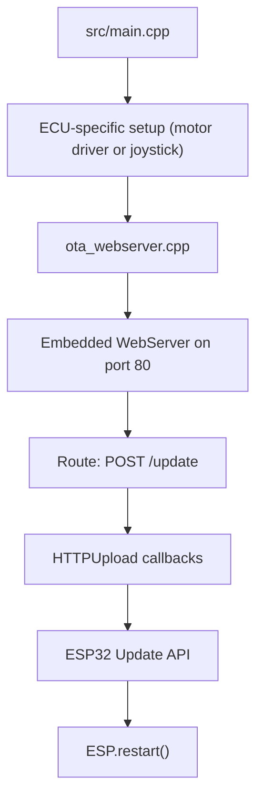
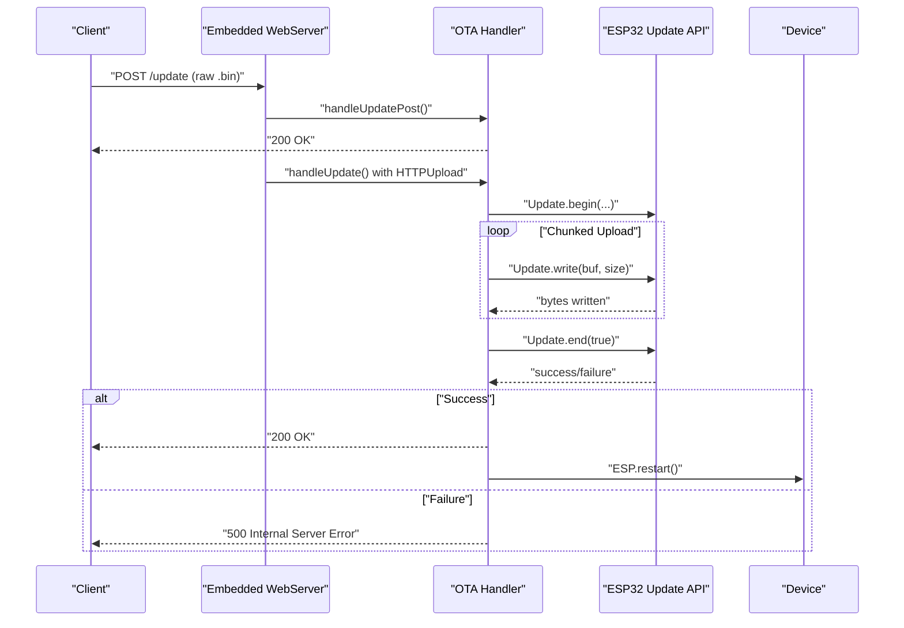
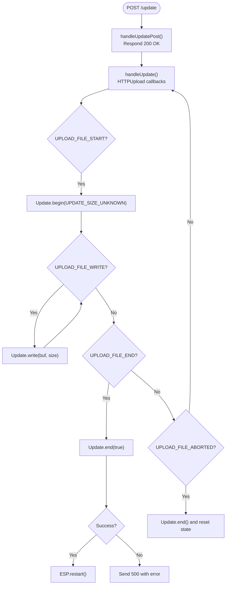
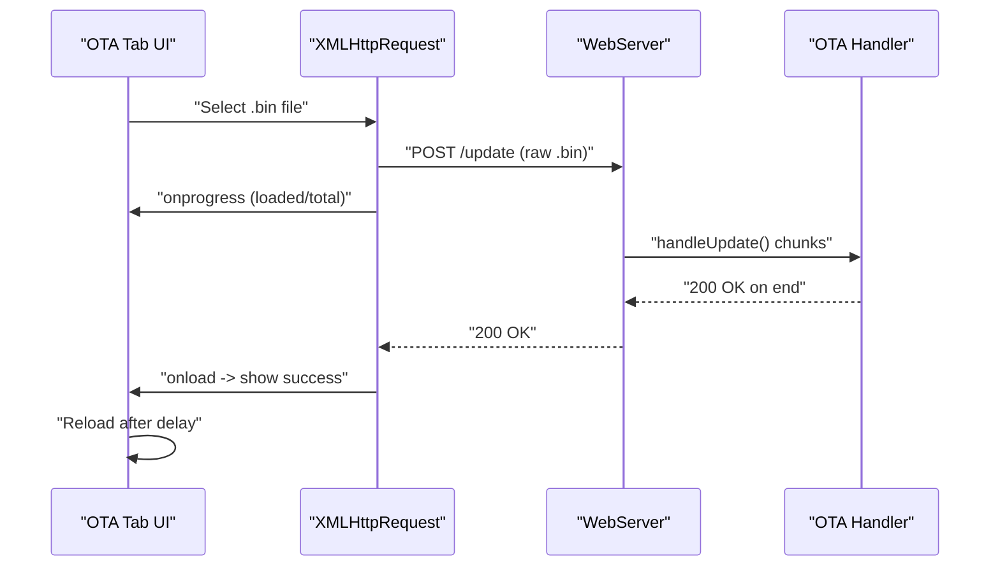
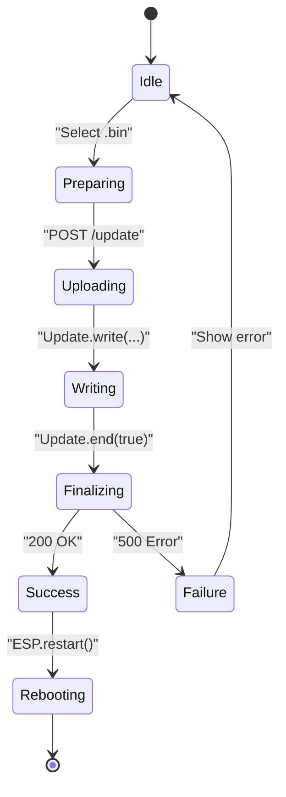
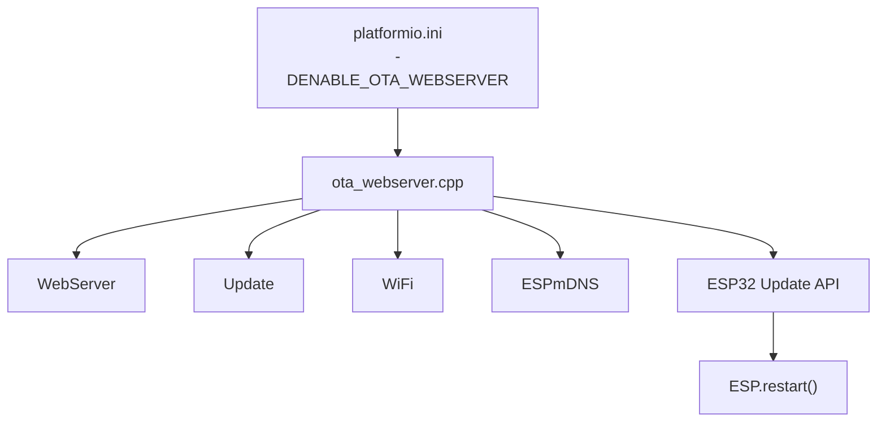

# Firmware Update Endpoint

<cite>
**Referenced Files in This Document**
- [ota_webserver.cpp](file://src/ota_webserver.cpp)
- [ota_webserver.h](file://src/ota_webserver.h)
- [platformio.ini](file://platformio.ini)
- [README.md](file://README.md)
- [main.cpp](file://src/main.cpp)
</cite>

## Table of Contents
1. [Introduction](#introduction)
2. [Project Structure](#project-structure)
3. [Core Components](#core-components)
4. [Architecture Overview](#architecture-overview)
5. [Detailed Component Analysis](#detailed-component-analysis)
6. [Dependency Analysis](#dependency-analysis)
7. [Performance Considerations](#performance-considerations)
8. [Troubleshooting Guide](#troubleshooting-guide)
9. [Conclusion](#conclusion)
10. [Appendices](#appendices)

## Introduction
This document explains the firmware update endpoint and workflow for the Forwarder CAN Controller. It covers:
- The POST /update endpoint for initiating Over-The-Air (OTA) firmware updates
- The multipart/form-data upload process and chunked reception handled by HTTPUpload callbacks
- Progress tracking and the complete update lifecycle from file selection to device reboot
- Practical examples for uploading firmware via curl and JavaScript fetch API
- Security considerations, verification, and rollback procedures

The implementation relies on an embedded web server with a Wi-Fi Access Point and a simple HTML UI that performs a raw binary upload to /update.

## Project Structure
The firmware update capability is part of the OTA-enabled builds. The relevant parts of the project structure are:
- src/ota_webserver.cpp/h: Implements the embedded web server, routes, and OTA handler
- platformio.ini: Defines build environments, including OTA-enabled ones
- README.md: Describes OTA usage and AP credentials
- src/main.cpp: Application entry point that delegates to ECU-specific logic

**Diagram sources**
- [ota_webserver.cpp:766-791](file://src/ota_webserver.cpp#L766-L791)
- [platformio.ini:65-81](file://platformio.ini#L65-L81)
- [README.md:84-103](file://README.md#L84-L103)

**Section sources**
- [ota_webserver.cpp:766-791](file://src/ota_webserver.cpp#L766-L791)
- [platformio.ini:65-81](file://platformio.ini#L65-L81)
- [README.md:84-103](file://README.md#L84-L103)

## Core Components
- Embedded Web Server: Provides HTTP endpoints including /update and serves the OTA page.
- OTA Handler: Processes multipart/form-data uploads and streams firmware to the ESP32 Update API.
- Update API: Receives firmware bytes, writes to flash, and triggers a reboot upon completion.
- HTML UI: Allows selecting a .bin file and initiates the upload via XMLHttpRequest.

Key behaviors:
- POST /update accepts a raw binary payload (not multipart/form-data) and streams it to Update.write.
- Progress is shown client-side during upload.
- On success, the device reboots automatically.

**Section sources**
- [ota_webserver.cpp:705-737](file://src/ota_webserver.cpp#L705-L737)
- [ota_webserver.cpp:473-492](file://src/ota_webserver.cpp#L473-L492)
- [ota_webserver.h:1-6](file://src/ota_webserver.h#L1-L6)

## Architecture Overview
The OTA update architecture consists of:
- Client browser or script sending a raw binary file to /update
- Web server receiving chunks via HTTPUpload callbacks
- Update API writing chunks to flash and verifying the final image
- Device reboot after successful write

**Diagram sources**
- [ota_webserver.cpp:705-737](file://src/ota_webserver.cpp#L705-L737)
- [ota_webserver.cpp:788-788](file://src/ota_webserver.cpp#L788-L788)

## Detailed Component Analysis

### POST /update Endpoint
- Route registration: The server registers POST /update with two handlers:
  - handleUpdatePost(): Responds immediately with 200 OK
  - handleUpdate(): Processes HTTPUpload callbacks for streaming firmware
- Behavior:
  - UPLOAD_FILE_START: Initializes Update.begin with unknown size
  - UPLOAD_FILE_WRITE: Writes the received buffer to flash
  - UPLOAD_FILE_END: Finalizes the update and reboots on success
  - UPLOAD_FILE_ABORTED: Cancels the update and resets state

**Diagram sources**
- [ota_webserver.cpp:705-737](file://src/ota_webserver.cpp#L705-L737)
- [ota_webserver.cpp:788-788](file://src/ota_webserver.cpp#L788-L788)

**Section sources**
- [ota_webserver.cpp:705-737](file://src/ota_webserver.cpp#L705-L737)
- [ota_webserver.cpp:788-788](file://src/ota_webserver.cpp#L788-L788)

### Multipart vs Raw Binary Upload
- The HTML UI selects a .bin file and sends it as a raw binary payload to /update.
- The server does not require multipart/form-data; it reads the raw body and streams it to Update.write.
- The client-side progress bar reflects the upload progress.

Practical implications:
- Use a raw binary upload (not multipart/form-data) for /update.
- The server does not validate file type or signature; ensure the uploaded file is a valid .bin for the target device.

**Section sources**
- [ota_webserver.cpp:473-492](file://src/ota_webserver.cpp#L473-L492)
- [ota_webserver.cpp:705-737](file://src/ota_webserver.cpp#L705-L737)

### Progress Tracking and UI
- The OTA tab includes a file input and a progress bar.
- The client tracks upload progress via XMLHttpRequest.upload.onprogress and updates the progress bar.
- On success, the UI displays a success message and reloads after a short delay.

**Diagram sources**
- [ota_webserver.cpp:473-492](file://src/ota_webserver.cpp#L473-L492)
- [ota_webserver.cpp:705-737](file://src/ota_webserver.cpp#L705-L737)

**Section sources**
- [ota_webserver.cpp:473-492](file://src/ota_webserver.cpp#L473-L492)

### Complete Firmware Update Workflow
- Build an OTA-enabled firmware using the OTA environments in platformio.ini.
- Flash the OTA firmware to the device.
- Connect to the AP advertised by the device and open the OTA page.
- Select a .bin file and click “Update Firmware”.
- Observe progress until completion, then wait for automatic reboot.

**Diagram sources**
- [ota_webserver.cpp:705-737](file://src/ota_webserver.cpp#L705-L737)
- [platformio.ini:65-81](file://platformio.ini#L65-L81)
- [README.md:84-103](file://README.md#L84-L103)

**Section sources**
- [platformio.ini:65-81](file://platformio.ini#L65-L81)
- [README.md:84-103](file://README.md#L84-L103)
- [ota_webserver.cpp:705-737](file://src/ota_webserver.cpp#L705-L737)

### Practical Upload Examples

#### curl
- Upload a .bin file to the device:
  - Replace <device-ip> with the device’s IP (typically 192.168.4.1) or hostname (e.g., forwarder-motor.local).
  - Ensure the file is a valid .bin for the target device.

Example command:
- curl -X POST -F "firmware=@path/to/firmware.bin" http://<device-ip>/update

Notes:
- The server expects a raw binary payload. If you must use multipart, ensure the field name and content-type align with the server’s expectations. However, the current implementation treats the body as raw binary and streams it to Update.write.

**Section sources**
- [ota_webserver.cpp:705-737](file://src/ota_webserver.cpp#L705-L737)
- [README.md:94-97](file://README.md#L94-L97)

#### JavaScript (fetch API)
- Example pattern for a web-based updater:
  - Create a FormData object and append the .bin file.
  - Send a POST request to /update with the FormData.
  - Monitor upload progress via the upload progress event.
  - Handle success and error responses.

Reference path:
- [ota_webserver.cpp:473-492](file://src/ota_webserver.cpp#L473-L492)

**Section sources**
- [ota_webserver.cpp:473-492](file://src/ota_webserver.cpp#L473-L492)

### Security Considerations
- No authentication or authorization is implemented for the OTA endpoint. Anyone who can connect to the device’s AP can upload firmware.
- The device does not verify the firmware image before flashing. There is no signature verification or checksum validation in the OTA handler.
- The AP password is included in the README for convenience but should be changed in production deployments.

Recommendations:
- Change the AP password in production.
- Restrict network access to trusted networks.
- Consider adding HTTPS/TLS and authentication if feasible.
- Validate firmware images externally (e.g., compute SHA-256 and compare against known good hashes) before flashing.

**Section sources**
- [README.md:94-97](file://README.md#L94-L97)
- [ota_webserver.cpp:705-737](file://src/ota_webserver.cpp#L705-L737)

### Update Verification and Rollback Procedures
- Verification:
  - The server does not perform signature verification or CRC checks before flashing.
  - After flashing, the device reboots automatically. If the device fails to boot, it will remain unreachable until corrected.
- Rollback:
  - The implementation does not include a dual-bank flash swap or rollback mechanism.
  - If a bad firmware is flashed, recovery typically requires reflashing a known-good image via the OTA process or using a serial bootloader if available.

**Section sources**
- [ota_webserver.cpp:718-722](file://src/ota_webserver.cpp#L718-L722)

## Dependency Analysis
- Build flags:
  - OTA builds are enabled via -DENABLE_OTA_WEBSERVER in platformio.ini environments.
- Libraries:
  - WebServer, Update, WiFi, ESPmDNS are used by the OTA module.
- Runtime dependencies:
  - The OTA handler depends on the ESP32 Update API for writing firmware to flash.
  - The device reboots after a successful update.

**Diagram sources**
- [platformio.ini:65-81](file://platformio.ini#L65-L81)
- [ota_webserver.cpp:5-11](file://src/ota_webserver.cpp#L5-L11)
- [ota_webserver.cpp:766-791](file://src/ota_webserver.cpp#L766-L791)

**Section sources**
- [platformio.ini:65-81](file://platformio.ini#L65-L81)
- [ota_webserver.cpp:5-11](file://src/ota_webserver.cpp#L5-L11)
- [ota_webserver.cpp:766-791](file://src/ota_webserver.cpp#L766-L791)

## Performance Considerations
- Chunk size: The server writes whatever buffer is provided by HTTPUpload. Larger buffers reduce overhead but increase memory usage.
- Network stability: Long uploads over unstable connections may fail. The implementation aborts on upload cancellation.
- Reboot timing: The device reboots shortly after a successful update. Ensure the client waits for the reboot before attempting to reconnect.

[No sources needed since this section provides general guidance]

## Troubleshooting Guide
Common issues and resolutions:
- Network errors:
  - Symptoms: XMLHttpRequest reports network error or server not reachable.
  - Causes: AP disconnected, wrong IP/hostname, firewall blocking.
  - Resolution: Verify AP connection, use correct IP/hostname, ensure local network access.
- Upload failures:
  - Symptoms: Server responds with 500 and an error message.
  - Causes: Invalid .bin, insufficient space, interrupted transfer.
  - Resolution: Confirm the .bin is built for the correct device type, retry with a stable connection.
- No progress:
  - Symptoms: Progress bar does not move.
  - Causes: Client-side issue or slow network.
  - Resolution: Refresh the page, retry upload, check browser console for errors.
- Device does not reboot:
  - Symptoms: Upload completes but device remains unchanged.
  - Causes: Update.end failed, device stuck in error state.
  - Resolution: Power cycle the device and re-upload a known-good firmware.

**Section sources**
- [ota_webserver.cpp:481-489](file://src/ota_webserver.cpp#L481-L489)
- [ota_webserver.cpp:718-726](file://src/ota_webserver.cpp#L718-L726)

## Conclusion
The OTA firmware update endpoint provides a straightforward mechanism to upload a .bin file to the device via POST /update. The implementation streams firmware data to the ESP32 Update API and reboots on success. While simple and effective, it lacks built-in authentication, verification, and rollback mechanisms. For production deployments, consider enhancing security and reliability with authentication, signature verification, and a dual-bank flash strategy.

[No sources needed since this section summarizes without analyzing specific files]

## Appendices

### Build and Flash OTA Firmware
- Build an OTA-enabled environment:
  - motor_driver_ota, joystick1_ota, joystick2_ota
- Flash the firmware to the device using PlatformIO.
- Connect to the AP advertised by the device and open the OTA page to upload a .bin file.

**Section sources**
- [platformio.ini:65-81](file://platformio.ini#L65-L81)
- [README.md:84-103](file://README.md#L84-L103)

### Example curl Commands
- Upload firmware to the device:
  - curl -X POST -F "firmware=@path/to/firmware.bin" http://<device-ip>/update

Notes:
- Ensure the .bin matches the device type and environment used for building.

**Section sources**
- [ota_webserver.cpp:705-737](file://src/ota_webserver.cpp#L705-L737)
- [README.md:94-97](file://README.md#L94-L97)