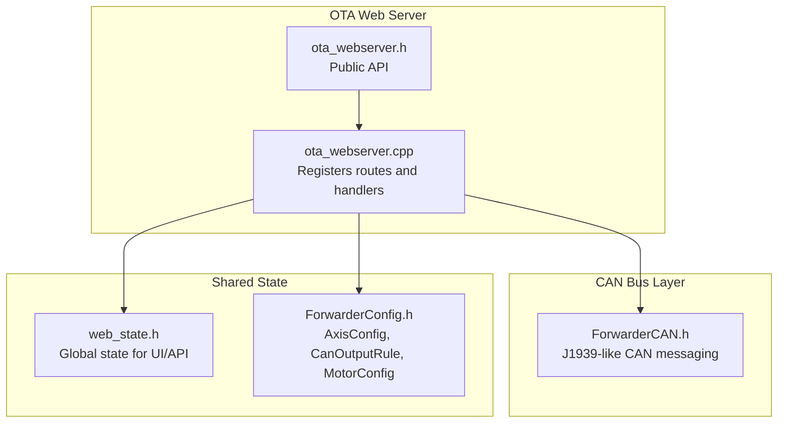
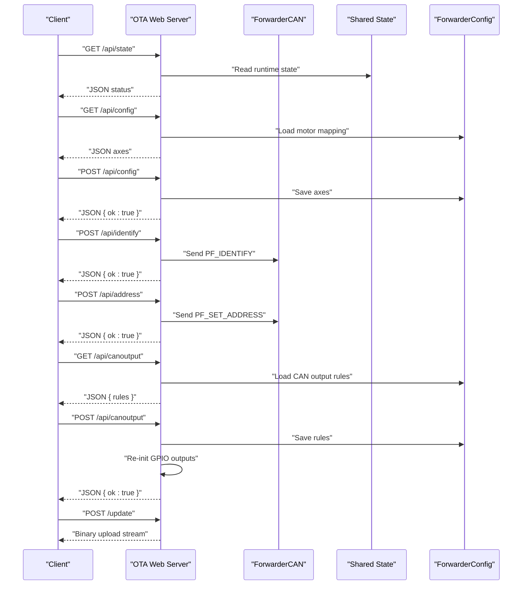
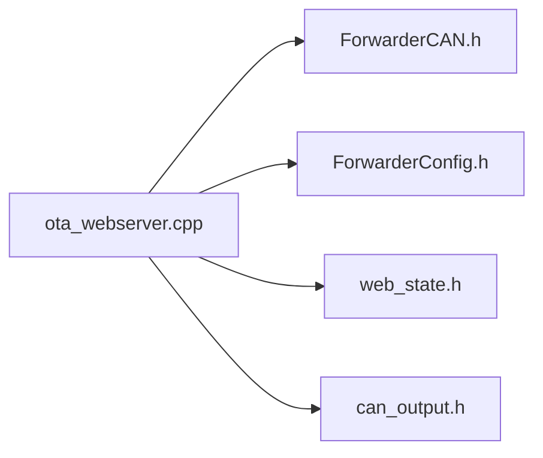

# HTTP REST API Endpoints

<cite>
**Referenced Files in This Document**
- [README.md](file://README.md)
- [platformio.ini](file://platformio.ini)
- [src/main.cpp](file://src/main.cpp)
- [src/ota_webserver.cpp](file://src/ota_webserver.cpp)
- [src/ota_webserver.h](file://src/ota_webserver.h)
- [src/web_state.h](file://src/web_state.h)
- [lib/ForwarderCAN/ForwarderCAN.h](file://lib/ForwarderCAN/ForwarderCAN.h)
- [lib/ForwarderConfig/ForwarderConfig.h](file://lib/ForwarderConfig/ForwarderConfig.h)
- [src/can_output.h](file://src/can_output.h)
</cite>

## Table of Contents
1. [Introduction](#introduction)
2. [Project Structure](#project-structure)
3. [Core Components](#core-components)
4. [Architecture Overview](#architecture-overview)
5. [Detailed Component Analysis](#detailed-component-analysis)
6. [Dependency Analysis](#dependency-analysis)
7. [Performance Considerations](#performance-considerations)
8. [Troubleshooting Guide](#troubleshooting-guide)
9. [Conclusion](#conclusion)

## Introduction
This document describes the HTTP REST API endpoints exposed by the ForwarderKE web interface. It covers:
- Real-time system status: GET /api/state
- Axis mapping configuration: GET/POST /api/config
- Device identification: POST /api/identify
- Address assignment: POST /api/address
- GPIO rule configuration: GET/POST /api/canoutput
- OTA firmware update: POST /update

It specifies HTTP methods, URL patterns, request/response schemas, parameter validation rules, expected status codes, and practical usage examples with curl and JavaScript fetch. It also documents authentication, rate limiting, CORS, and error handling behavior.

## Project Structure
The web server is implemented as part of the OTA-enabled builds. The server exposes endpoints under the root path and serves a static HTML UI. The endpoints are registered in the OTA web server module.

**Diagram sources**
- [src/ota_webserver.cpp:766-791](file://src/ota_webserver.cpp#L766-L791)
- [src/ota_webserver.h:1-6](file://src/ota_webserver.h#L1-L6)
- [lib/ForwarderCAN/ForwarderCAN.h:1-120](file://lib/ForwarderCAN/ForwarderCAN.h#L1-L120)
- [src/web_state.h:1-23](file://src/web_state.h#L1-L23)
- [lib/ForwarderConfig/ForwarderConfig.h:1-92](file://lib/ForwarderConfig/ForwarderConfig.h#L1-L92)

**Section sources**
- [README.md:1-131](file://README.md#L1-L131)
- [platformio.ini:1-80](file://platformio.ini#L1-L80)
- [src/main.cpp:1-32](file://src/main.cpp#L1-L32)
- [src/ota_webserver.cpp:766-791](file://src/ota_webserver.cpp#L766-L791)

## Core Components
- OTA Web Server: Provides the HTTP API and static UI. Routes are registered in the OTA setup routine.
- CAN Bus Interface: Used for broadcasting commands (identify, set address) and collecting heartbeat statistics.
- Shared State: Exposes runtime state (joystick data, solenoid outputs, module registry) and configuration structures.
- Configuration Storage: Persisted motor mapping and CAN output rules.

Key build flags enable OTA and select ECU type:
- ENABLE_OTA_WEBSERVER: Enables the web server and OTA upload handler.
- ECU_TYPE_MOTOR_DRIVER or ECU_TYPE_JOYSTICK: Selects ECU behavior and capabilities.

**Section sources**
- [platformio.ini:63-79](file://platformio.ini#L63-L79)
- [src/ota_webserver.cpp:766-791](file://src/ota_webserver.cpp#L766-L791)
- [src/web_state.h:1-23](file://src/web_state.h#L1-L23)
- [lib/ForwarderConfig/ForwarderConfig.h:1-92](file://lib/ForwarderConfig/ForwarderConfig.h#L1-L92)

## Architecture Overview
The web server runs on port 80 and serves:
- Static HTML UI at /
- API endpoints at /api/*
- OTA upload endpoint at /update

Endpoints are implemented as simple handlers that read shared state and configuration, and optionally send CAN commands.

**Diagram sources**
- [src/ota_webserver.cpp:510-703](file://src/ota_webserver.cpp#L510-L703)
- [lib/ForwarderCAN/ForwarderCAN.h:38-50](file://lib/ForwarderCAN/ForwarderCAN.h#L38-L50)
- [lib/ForwarderConfig/ForwarderConfig.h:75-82](file://lib/ForwarderConfig/ForwarderConfig.h#L75-L82)

## Detailed Component Analysis

### Endpoint: GET /api/state
- Purpose: Returns real-time system status, joystick telemetry, solenoid outputs, and detected modules.
- Method: GET
- URL: /api/state
- Authentication: None
- Rate limiting: Not enforced
- CORS: Not explicitly configured; served from same origin in embedded UI
- Expected status codes: 200 OK

Response schema (JSON):
- localAddr: integer (hex address)
- online: boolean (bus online)
- uptime: integer (seconds)
- txCount: integer (transmit count)
- rxCount: integer (receive count)
- errCount: integer (error count)
- joy: object keyed by source address (hex), each item has:
  - pots: array of 3 integers (ADC values)
  - age: integer (seconds since last update)
  - buttons: integer bitmask (bit 0=btn1, bit 1=btn2) when present
- sol: array of 16 integers (solenoid values)
- modules: object keyed by module address (hex), each item has:
  - addr: integer (address)
  - type: integer (1=motor, 2=joystick, 0/other=unknown)
  - uptime: integer (seconds)
  - age: integer (seconds since last seen)

Example curl:
- curl http://192.168.4.1/api/state

JavaScript fetch:
- fetch("/api/state").then(r => r.json()).then(data => console.log(data));

Notes:
- Joystick data is filtered to recent updates (within a window).
- Modules are detected via heartbeat scanning and expire after a grace period.

**Section sources**
- [src/ota_webserver.cpp:510-563](file://src/ota_webserver.cpp#L510-L563)
- [src/ota_webserver.cpp:742-761](file://src/ota_webserver.cpp#L742-L761)
- [src/web_state.h:10-22](file://src/web_state.h#L10-L22)

### Endpoint: GET /api/config
- Purpose: Retrieves current axis mapping configuration.
- Method: GET
- URL: /api/config
- Authentication: None
- Rate limiting: Not enforced
- CORS: Not explicitly configured; served from same origin in embedded UI
- Expected status codes: 200 OK

Response schema (JSON):
- pcaCount: integer (number of PCA9685 boards)
- axes: array of 16 items (one per axis), each item has:
  - sourceAddress: integer (joystick source address, e.g., 0x21, 0x22)
  - potIndex: integer (0=Pot1, 1=Pot2, 2=Pot3)
  - outputChannel: integer (0-15)
  - deadbandMin: integer (0-1023)
  - deadbandMax: integer (0-1023)
  - pwmMin: integer (0-255)
  - pwmMax: integer (0-255)
  - flags: integer (bitmask; bit 0=enabled, bit 1=bidirectional)

Example curl:
- curl http://192.168.4.1/api/config

JavaScript fetch:
- fetch("/api/config").then(r => r.json()).then(cfg => console.log(cfg));

Validation rules:
- sourceAddress must be a valid joystick address (e.g., 0x21, 0x22).
- outputChannel must be within 0-15.
- deadbandMin and deadbandMax must satisfy deadbandMin ≤ deadbandMax.
- pwmMin and pwmMax must be within 0-255.

**Section sources**
- [src/ota_webserver.cpp:565-585](file://src/ota_webserver.cpp#L565-L585)
- [lib/ForwarderConfig/ForwarderConfig.h:41-57](file://lib/ForwarderConfig/ForwarderConfig.h#L41-L57)

### Endpoint: POST /api/config
- Purpose: Saves axis mapping configuration.
- Method: POST
- URL: /api/config
- Content-Type: application/json
- Authentication: None
- Rate limiting: Not enforced
- CORS: Not explicitly configured; served from same origin in embedded UI
- Expected status codes: 200 OK

Request schema (JSON):
- axes: array of 16 items, each item must include:
  - axisIdx: integer (0-15)
  - sourceAddress: integer (joystick source address)
  - potIndex: integer (0-2)
  - outputChannel: integer (0-15)
  - deadbandMin: integer (0-1023)
  - deadbandMax: integer (0-1023)
  - pwmMin: integer (0-255)
  - pwmMax: integer (0-255)
  - flags: integer (bitmask; bit 0=enabled, bit 1=bidirectional)

Behavior:
- Updates in-memory configuration.
- On motor driver builds, persists to non-volatile storage.
- On joystick builds, broadcasts axis config to motor driver via CAN.

Example curl:
- curl -X POST http://192.168.4.1/api/config -H "Content-Type: application/json" -d '{"axes":[{"axisIdx":0,"sourceAddress":33,"potIndex":0,"outputChannel":0,"deadbandMin":492,"deadbandMax":532,"pwmMin":64,"pwmMax":128,"flags":1}]}'

JavaScript fetch:
- fetch("/api/config", { method: "POST", headers: {"Content-Type": "application/json"}, body: JSON.stringify({ axes }) }).then(r => r.json());

Validation rules:
- axisIdx must be unique and within 0-15.
- Values must satisfy the same constraints as GET response schema.

**Section sources**
- [src/ota_webserver.cpp:587-626](file://src/ota_webserver.cpp#L587-L626)
- [lib/ForwarderConfig/ForwarderConfig.h:75-78](file://lib/ForwarderConfig/ForwarderConfig.h#L75-L78)
- [lib/ForwarderCAN/ForwarderCAN.h:38-49](file://lib/ForwarderCAN/ForwarderCAN.h#L38-L49)

### Endpoint: POST /api/identify
- Purpose: Triggers a device identification sequence on a target module.
- Method: POST
- URL: /api/identify
- Content-Type: application/json
- Authentication: None
- Rate limiting: Not enforced
- CORS: Not explicitly configured; served from same origin in embedded UI
- Expected status codes: 200 OK

Request schema (JSON):
- target: integer (destination address)

Behavior:
- Sends a CAN message with a dedicated protocol frame to the target address.

Example curl:
- curl -X POST http://192.168.4.1/api/identify -H "Content-Type: application/json" -d '{"target":33}'

JavaScript fetch:
- fetch("/api/identify", { method: "POST", headers: {"Content-Type": "application/json"}, body: JSON.stringify({ target }) });

Validation rules:
- target must be a valid address.

**Section sources**
- [src/ota_webserver.cpp:639-646](file://src/ota_webserver.cpp#L639-L646)
- [lib/ForwarderCAN/ForwarderCAN.h:45-45](file://lib/ForwarderCAN/ForwarderCAN.h#L45-L45)

### Endpoint: POST /api/address
- Purpose: Requests a module to change its address.
- Method: POST
- URL: /api/address
- Content-Type: application/json
- Authentication: None
- Rate limiting: Not enforced
- CORS: Not explicitly configured; served from same origin in embedded UI
- Expected status codes: 200 OK

Request schema (JSON):
- target: integer (current address)
- address: integer (new address)

Behavior:
- Sends a CAN message requesting the target module to set a new address.
- The target module will reboot to apply the new address.

Example curl:
- curl -X POST http://192.168.4.1/api/address -H "Content-Type: application/json" -d '{"target":33,"address":34}'

JavaScript fetch:
- fetch("/api/address", { method: "POST", headers: {"Content-Type": "application/json"}, body: JSON.stringify({ target, address }) });

Validation rules:
- target must be a valid address.
- address must be within the allowed range.

**Section sources**
- [src/ota_webserver.cpp:648-657](file://src/ota_webserver.cpp#L648-L657)
- [lib/ForwarderCAN/ForwarderCAN.h:46-46](file://lib/ForwarderCAN/ForwarderCAN.h#L46-L46)

### Endpoint: GET /api/canoutput
- Purpose: Retrieves CAN-triggered GPIO output rules.
- Method: GET
- URL: /api/canoutput
- Authentication: None
- Rate limiting: Not enforced
- CORS: Not explicitly configured; served from same origin in embedded UI
- Expected status codes: 200 OK

Response schema (JSON):
- rules: array of 4 items (one per rule), each item has:
  - enabled: boolean
  - matchPF: integer (PDU Format to match)
  - matchSA: integer (Source Address to match; 0 means any)
  - gpioPin: integer (GPIO pin number)
  - mode: integer (0=toggle, 1=momentary)
  - momentaryMs: integer (momentary duration in milliseconds)

Example curl:
- curl http://192.168.4.1/api/canoutput

JavaScript fetch:
- fetch("/api/canoutput").then(r => r.json()).then(data => console.log(data));

Validation rules:
- matchPF and matchSA must be within 0-255.
- gpioPin must be a valid GPIO pin for the board.
- mode must be 0 or 1.
- momentaryMs must be within a reasonable range.

**Section sources**
- [src/ota_webserver.cpp:659-675](file://src/ota_webserver.cpp#L659-L675)
- [lib/ForwarderConfig/ForwarderConfig.h:29-39](file://lib/ForwarderConfig/ForwarderConfig.h#L29-L39)

### Endpoint: POST /api/canoutput
- Purpose: Saves CAN-triggered GPIO output rules.
- Method: POST
- URL: /api/canoutput
- Content-Type: application/json
- Authentication: None
- Rate limiting: Not enforced
- CORS: Not explicitly configured; served from same origin in embedded UI
- Expected status codes: 200 OK

Request schema (JSON):
- rules: array of 4 items, each item must include:
  - ruleIdx: integer (0-3)
  - enabled: boolean
  - matchPF: integer (0-255)
  - matchSA: integer (0-255)
  - gpioPin: integer (GPIO pin)
  - mode: integer (0 or 1)
  - momentaryMs: integer (milliseconds)

Behavior:
- Updates in-memory rules.
- On motor driver builds, persists to non-volatile storage.
- Re-initializes GPIO outputs with the new configuration.

Example curl:
- curl -X POST http://192.168.4.1/api/canoutput -H "Content-Type: application/json" -d '{"rules":[{"ruleIdx":0,"enabled":true,"matchPF":32,"matchSA":0,"gpioPin":2,"mode":0,"momentaryMs":500}]}'

JavaScript fetch:
- fetch("/api/canoutput", { method: "POST", headers: {"Content-Type": "application/json"}, body: JSON.stringify({ rules }) }).then(r => r.json());

Validation rules:
- ruleIdx must be unique and within 0-3.
- Values must satisfy the same constraints as GET response schema.

**Section sources**
- [src/ota_webserver.cpp:677-703](file://src/ota_webserver.cpp#L677-L703)
- [lib/ForwarderConfig/ForwarderConfig.h:80-82](file://lib/ForwarderConfig/ForwarderConfig.h#L80-L82)
- [src/can_output.h:1-11](file://src/can_output.h#L1-L11)

### Endpoint: POST /update
- Purpose: Performs Over-The-Air firmware update via binary upload.
- Method: POST
- URL: /update
- Content-Type: multipart/form-data (binary)
- Authentication: None
- Rate limiting: Not enforced
- CORS: Not explicitly configured; served from same origin in embedded UI
- Expected status codes: 200 OK on success, 500 Internal Server Error on failure

Behavior:
- Streams firmware binary to the device’s flash.
- On success, responds with a success message and triggers a restart.
- On failure, responds with an error message.

Example curl:
- curl -X POST http://192.168.4.1/update --data-binary @firmware.bin

JavaScript fetch:
- const formData = new FormData();
formData.append("firmware", fileInput.files[0]);
fetch("/update", { method: "POST", body: formData });

Notes:
- Requires an OTA-enabled build.
- The device reboots automatically after successful update.

**Section sources**
- [src/ota_webserver.cpp:705-737](file://src/ota_webserver.cpp#L705-L737)
- [platformio.ini:63-79](file://platformio.ini#L63-L79)

## Dependency Analysis
The web server depends on:
- ForwarderCAN for sending commands and collecting heartbeat statistics
- ForwarderConfig for loading/saving persistent configuration
- Shared state for runtime telemetry

**Diagram sources**
- [src/ota_webserver.cpp:1-13](file://src/ota_webserver.cpp#L1-L13)
- [lib/ForwarderCAN/ForwarderCAN.h:1-120](file://lib/ForwarderCAN/ForwarderCAN.h#L1-L120)
- [lib/ForwarderConfig/ForwarderConfig.h:1-92](file://lib/ForwarderConfig/ForwarderConfig.h#L1-L92)
- [src/web_state.h:1-23](file://src/web_state.h#L1-L23)
- [src/can_output.h:1-11](file://src/can_output.h#L1-L11)

**Section sources**
- [src/ota_webserver.cpp:1-13](file://src/ota_webserver.cpp#L1-L13)
- [lib/ForwarderCAN/ForwarderCAN.h:1-120](file://lib/ForwarderCAN/ForwarderCAN.h#L1-L120)
- [lib/ForwarderConfig/ForwarderConfig.h:1-92](file://lib/ForwarderConfig/ForwarderConfig.h#L1-L92)
- [src/web_state.h:1-23](file://src/web_state.h#L1-L23)
- [src/can_output.h:1-11](file://src/can_output.h#L1-L11)

## Performance Considerations
- The web server runs on an ESP32-S3 and handles client requests synchronously. Keep payloads small and avoid frequent polling.
- The UI polls /api/state every 200 ms; adjust polling intervals in production clients to reduce load.
- OTA updates occur over HTTP; ensure sufficient bandwidth and avoid concurrent heavy traffic.

[No sources needed since this section provides general guidance]

## Troubleshooting Guide
Common issues and resolutions:
- Endpoint returns 404: Verify the endpoint URL and that OTA is enabled in the build.
- OTA fails with 500: Check device logs for error messages and ensure the firmware file is valid.
- Address change does nothing: Confirm the target address is valid and the module supports address changes.
- CAN output rules not applied: Ensure gpioPin is a valid GPIO and mode is 0 or 1.

Error handling behavior:
- OTA upload handler returns 500 on update failure with an error message.
- Other endpoints return 200 with JSON responses; errors are not explicitly handled in handlers.

**Section sources**
- [src/ota_webserver.cpp:725-725](file://src/ota_webserver.cpp#L725-L725)
- [src/ota_webserver.cpp:724-724](file://src/ota_webserver.cpp#L724-L724)

## Conclusion
The ForwarderKE web interface provides a compact HTTP API for monitoring and configuring a J1939-like CAN bus system. The endpoints are straightforward, with clear request/response schemas and minimal validation. For production use, consider adding authentication, rate limiting, and explicit CORS configuration. The OTA endpoint enables easy firmware updates in field deployments.