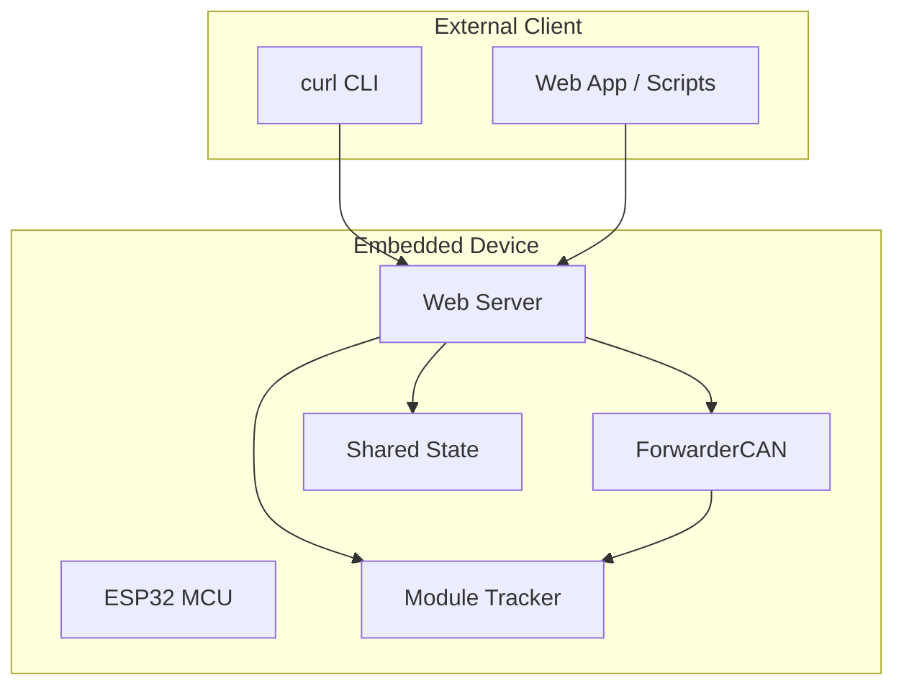
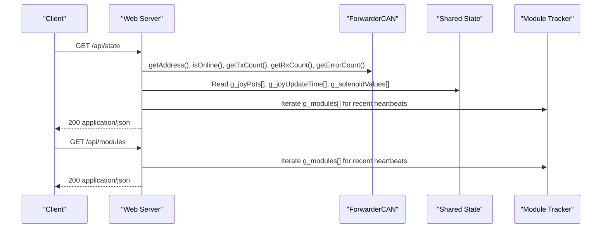
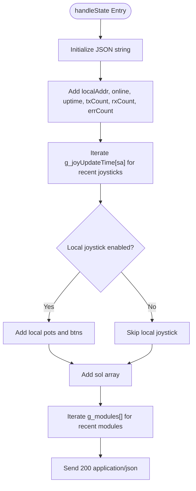
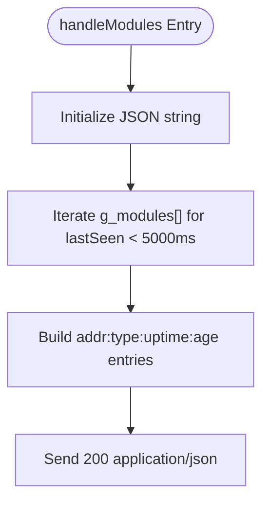
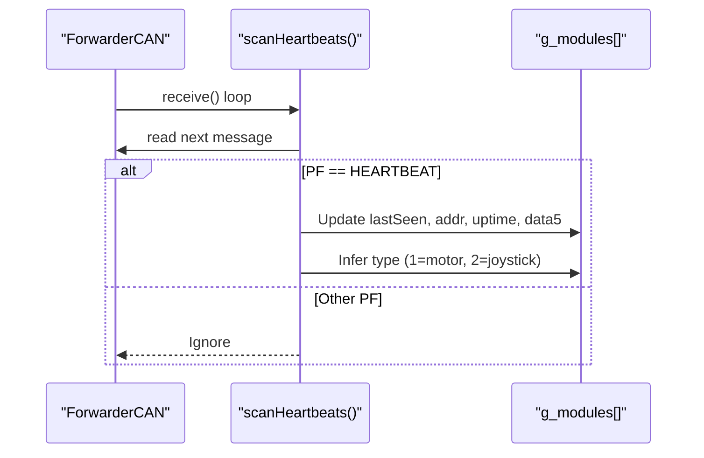
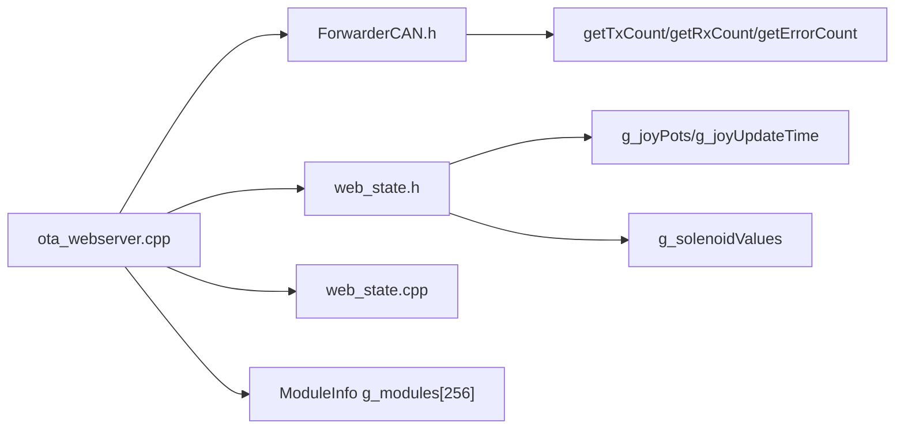

# System Status Endpoints

<cite>
**Referenced Files in This Document**
- [ota_webserver.cpp](file://src/ota_webserver.cpp)
- [web_state.h](file://src/web_state.h)
- [web_state.cpp](file://src/web_state.cpp)
- [ForwarderCAN.h](file://lib/ForwarderCAN/ForwarderCAN.h)
- [main.cpp](file://src/main.cpp)
</cite>

## Table of Contents
1. [Introduction](#introduction)
2. [Project Structure](#project-structure)
3. [Core Components](#core-components)
4. [Architecture Overview](#architecture-overview)
5. [Detailed Component Analysis](#detailed-component-analysis)
6. [Dependency Analysis](#dependency-analysis)
7. [Performance Considerations](#performance-considerations)
8. [Troubleshooting Guide](#troubleshooting-guide)
9. [Conclusion](#conclusion)

## Introduction
This document provides comprehensive documentation for the system status API endpoints used for real-time monitoring and device discovery on the Forwarder CAN Controller. It focuses on:
- GET /api/state: Returns comprehensive system health data including local address, CAN bus connectivity status, joystick input readings, solenoid output values, and detected modules.
- GET /api/modules: Provides device discovery and module property information.

The documentation includes the complete JSON response schema, practical curl examples, and architectural insights into how the endpoints are implemented.

## Project Structure
The system status endpoints are implemented within the OTA web server module. The key components involved are:
- HTTP server routing and handlers
- CAN bus interface for statistics and heartbeat scanning
- Shared state for joystick and solenoid data
- Module discovery via heartbeat messages

**Diagram sources**
- [ota_webserver.cpp:780-789](file://src/ota_webserver.cpp#L780-L789)
- [ForwarderCAN.h:66-120](file://lib/ForwarderCAN/ForwarderCAN.h#L66-L120)
- [web_state.h:10-23](file://src/web_state.h#L10-L23)

**Section sources**
- [main.cpp:19-31](file://src/main.cpp#L19-L31)
- [ota_webserver.cpp:780-789](file://src/ota_webserver.cpp#L780-L789)

## Core Components
This section documents the two primary API endpoints and their responsibilities.

- GET /api/state
  - Purpose: Real-time system monitoring and health status.
  - Returns: System-wide metrics and discovered modules.
  - Typical use: Dashboard monitoring, automation scripts, and debugging.

- GET /api/modules
  - Purpose: Device discovery and module property inspection.
  - Returns: Address, type, uptime, and age for each discovered module.
  - Typical use: Network topology verification, module identification, and configuration.

Response Schema for GET /api/state
- localAddr: integer (CAN address of the local controller)
- online: boolean (CAN bus connectivity status)
- uptime: integer (device uptime in seconds)
- txCount: integer (transmitted message count)
- rxCount: integer (received message count)
- errCount: integer (error count)
- joy: object
  - Keys: CAN source addresses (integers)
  - Values: object with:
    - pots: array of three integers representing potentiometer readings
    - age: integer (seconds since last update)
    - btns: integer (bitmask of button states, present only for local joystick)
- sol: array of integers (solenoid output values)
- modules: object
  - Keys: module addresses (integers)
  - Values: object with:
    - addr: integer (module address)
    - type: integer (0=unknown, 1=motor, 2=joystick)
    - uptime: integer (module uptime in seconds)
    - age: integer (seconds since last seen)

Practical curl Examples
- Retrieve system state:
  - curl -s http://forwarder.local/api/state
- Parse JSON response:
  - jq '.localAddr, .online, .uptime, .txCount, .rxCount, .errCount'
  - jq '.joy as $j | keys[] as $k | "\($k): \($j[$k].pots[]) (\($j[$k].age)s)"'
  - jq '.sol[] as $v | "Channel N: \($v)"'
  - jq '.modules as $m | keys[] as $k | "\($k): type=\($m[$k].type), uptime=\($m[$k].uptime)s, age=\($m[$k].age)s"'

**Section sources**
- [ota_webserver.cpp:510-563](file://src/ota_webserver.cpp#L510-L563)
- [ota_webserver.cpp:548-561](file://src/ota_webserver.cpp#L548-L561)
- [ota_webserver.cpp:519-538](file://src/ota_webserver.cpp#L519-L538)
- [ota_webserver.cpp:540-546](file://src/ota_webserver.cpp#L540-L546)

## Architecture Overview
The system status endpoints are served by an embedded HTTP server. The server aggregates data from:
- CAN bus statistics (via ForwarderCAN)
- Shared state arrays for joysticks and solenoids
- Module tracker populated by heartbeat scanning

**Diagram sources**
- [ota_webserver.cpp:510-563](file://src/ota_webserver.cpp#L510-L563)
- [ota_webserver.cpp:742-761](file://src/ota_webserver.cpp#L742-L761)
- [ForwarderCAN.h:93-96](file://lib/ForwarderCAN/ForwarderCAN.h#L93-L96)

## Detailed Component Analysis

### GET /api/state Implementation
The handler constructs a JSON payload containing:
- Local address, online status, uptime, and CAN statistics
- Joystick data per source address with pots and age
- Local joystick buttons (when applicable)
- Solenoid output values
- Discovered modules with addr, type, uptime, and age

**Diagram sources**
- [ota_webserver.cpp:510-563](file://src/ota_webserver.cpp#L510-L563)

**Section sources**
- [ota_webserver.cpp:510-563](file://src/ota_webserver.cpp#L510-L563)
- [web_state.h:10-23](file://src/web_state.h#L10-L23)
- [ForwarderCAN.h:93-96](file://lib/ForwarderCAN/ForwarderCAN.h#L93-L96)

### GET /api/modules Implementation
The handler returns only the modules object, filtered to modules recently seen within a short window. This endpoint is useful for quick discovery and verification of connected devices.

**Diagram sources**
- [ota_webserver.cpp:548-561](file://src/ota_webserver.cpp#L548-L561)

**Section sources**
- [ota_webserver.cpp:548-561](file://src/ota_webserver.cpp#L548-L561)

### Module Discovery and Heartbeat Scanning
The system tracks modules by scanning heartbeat messages on the CAN bus. The scanner updates module metadata and infers device types heuristically.

**Diagram sources**
- [ota_webserver.cpp:742-761](file://src/ota_webserver.cpp#L742-L761)
- [ForwarderCAN.h:50](file://lib/ForwarderCAN/ForwarderCAN.h#L50)

**Section sources**
- [ota_webserver.cpp:742-761](file://src/ota_webserver.cpp#L742-L761)
- [ForwarderCAN.h:38-51](file://lib/ForwarderCAN/ForwarderCAN.h#L38-L51)

## Dependency Analysis
The API endpoints depend on shared state and CAN bus statistics. The diagram below shows the relationships among the key components.

**Diagram sources**
- [ota_webserver.cpp:16-25](file://src/ota_webserver.cpp#L16-L25)
- [ota_webserver.cpp:510-563](file://src/ota_webserver.cpp#L510-L563)
- [web_state.h:10-23](file://src/web_state.h#L10-L23)
- [ForwarderCAN.h:93-96](file://lib/ForwarderCAN/ForwarderCAN.h#L93-L96)

**Section sources**
- [ota_webserver.cpp:16-25](file://src/ota_webserver.cpp#L16-L25)
- [web_state.h:10-23](file://src/web_state.h#L10-L23)
- [ForwarderCAN.h:93-96](file://lib/ForwarderCAN/ForwarderCAN.h#L93-L96)

## Performance Considerations
- Endpoint frequency: The web app polls /api/state every 200 ms. Adjust polling intervals in client applications to balance responsiveness and network load.
- Data volume: The response includes arrays for joystick pots and solenoid channels. For systems with many axes, consider client-side filtering or reduced polling.
- Module freshness: The module list excludes entries older than 5 seconds, preventing stale data accumulation.
- CAN statistics: The counters are read directly from the CAN driver; ensure the CAN bus is functioning to avoid misleading error counts.

[No sources needed since this section provides general guidance]

## Troubleshooting Guide
Common issues and resolutions:
- Empty modules list: Verify that modules are broadcasting heartbeats and that the CAN bus is healthy. Check the CAN bus stats returned by /api/state.
- Missing local joystick data: Ensure the device is built with ECU_TYPE_JOYSTICK and that the local joystick is enabled.
- Incorrect solenoid values: Confirm that the motor driver ECU is active and that the solenoid channels are mapped correctly.
- High error count: Inspect the CAN bus wiring, termination, and noise. Review the TX/RX counts for anomalies.

**Section sources**
- [ota_webserver.cpp:510-563](file://src/ota_webserver.cpp#L510-L563)
- [ota_webserver.cpp:742-761](file://src/ota_webserver.cpp#L742-L761)

## Conclusion
The system status endpoints provide a concise and reliable way to monitor the Forwarder CAN Controller and discover connected modules. By understanding the JSON schema and leveraging the provided curl examples, developers can integrate real-time monitoring into dashboards, scripts, and automated systems. For robust deployments, tune polling intervals, validate CAN connectivity, and use the module discovery endpoint to confirm device presence and types.