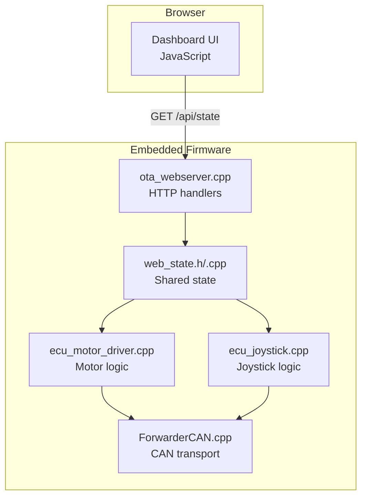
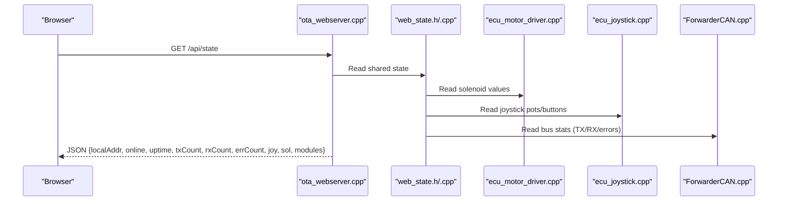
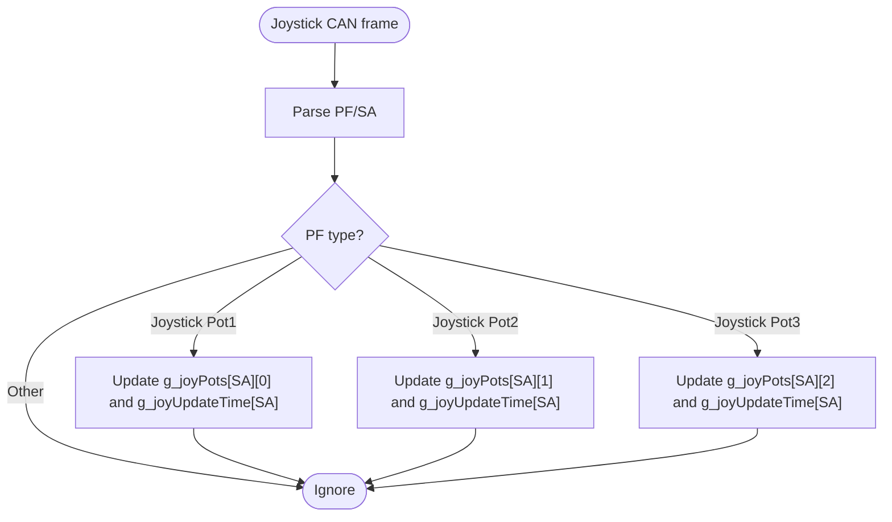
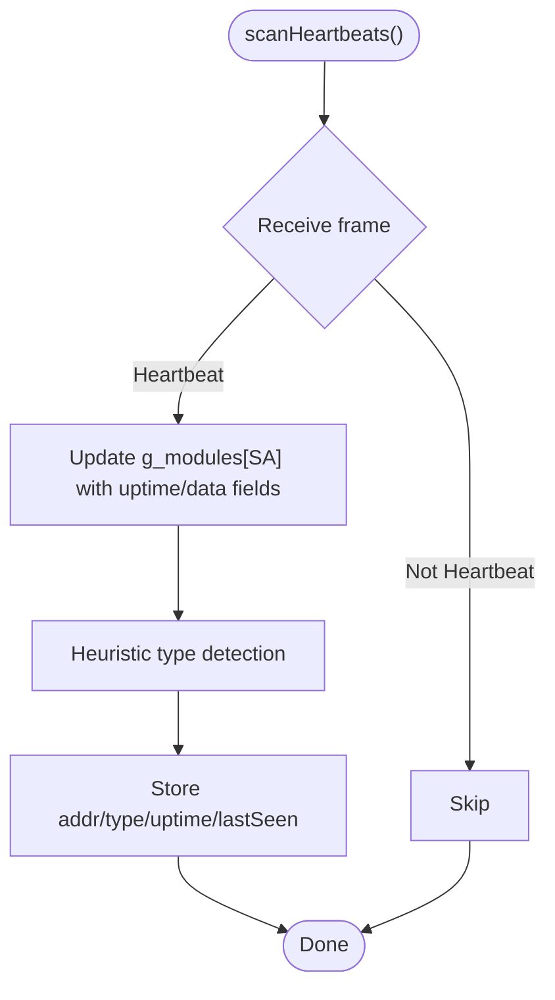
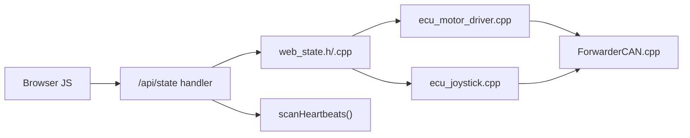

# Real-time State API

<cite>
**Referenced Files in This Document**
- [README.md](file://README.md)
- [platformio.ini](file://platformio.ini)
- [src/main.cpp](file://src/main.cpp)
- [src/web_state.h](file://src/web_state.h)
- [src/web_state.cpp](file://src/web_state.cpp)
- [src/ota_webserver.h](file://src/ota_webserver.h)
- [src/ota_webserver.cpp](file://src/ota_webserver.cpp)
- [src/ecu_motor_driver.cpp](file://src/ecu_motor_driver.cpp)
- [src/ecu_joystick.cpp](file://src/ecu_joystick.cpp)
- [lib/ForwarderCAN/ForwarderCAN.cpp](file://lib/ForwarderCAN/ForwarderCAN.cpp)
- [lib/ForwarderConfig/ForwarderConfig.cpp](file://lib/ForwarderConfig/ForwarderConfig.cpp)
</cite>

## Table of Contents
1. [Introduction](#introduction)
2. [Project Structure](#project-structure)
3. [Core Components](#core-components)
4. [Architecture Overview](#architecture-overview)
5. [Detailed Component Analysis](#detailed-component-analysis)
6. [Dependency Analysis](#dependency-analysis)
7. [Performance Considerations](#performance-considerations)
8. [Troubleshooting Guide](#troubleshooting-guide)
9. [Conclusion](#conclusion)
10. [Appendices](#appendices)

## Introduction
This document describes the real-time state API exposed by ForwarderKE’s embedded web server. The API endpoint /api/state streams continuous system monitoring data for a 3-EPU CAN bus: two joystick ECUs and one motor driver ECU. It exposes joystick inputs, solenoid outputs, CAN bus statistics, device modules, and operational status. The web UI polls this endpoint at a fixed interval to render live dashboards and controls.

The polling interval is 200 milliseconds. The API uses JSON responses with explicit freshness indicators (age fields) to help clients detect stale data. The system integrates with a J1939-like CAN protocol and maintains heartbeat-driven module discovery.

## Project Structure
The real-time state API lives in the OTA-enabled web server and is consumed by a browser-based dashboard. The build system selects the ECU type at compile time, enabling either the motor driver or joystick ECU logic.

**Diagram sources**
- [src/ota_webserver.cpp:506-563](file://src/ota_webserver.cpp#L506-L563)
- [src/ecu_motor_driver.cpp:184-275](file://src/ecu_motor_driver.cpp#L184-L275)
- [src/ecu_joystick.cpp:114-144](file://src/ecu_joystick.cpp#L114-L144)
- [lib/ForwarderCAN/ForwarderCAN.cpp:13-52](file://lib/ForwarderCAN/ForwarderCAN.cpp#L13-L52)
- [src/web_state.h:10-22](file://src/web_state.h#L10-L22)

**Section sources**
- [platformio.ini:17-30](file://platformio.ini#L17-L30)
- [platformio.ini:31-61](file://platformio.ini#L31-L61)
- [src/main.cpp:11-17](file://src/main.cpp#L11-L17)

## Core Components
- Real-time state endpoint: GET /api/state
- Shared state globals: joystick pots/buttons, solenoid values, module discovery, CAN stats
- Heartbeat scanning: module discovery and type inference
- Polling interval: 200 ms in the browser
- Freshness indicators: per-joystick age and per-module age
- Operational status: online/offline, uptime, TX/RX/error counts

**Section sources**
- [src/ota_webserver.cpp:510-563](file://src/ota_webserver.cpp#L510-L563)
- [src/web_state.h:10-22](file://src/web_state.h#L10-L22)
- [src/ota_webserver.cpp:742-761](file://src/ota_webserver.cpp#L742-L761)

## Architecture Overview
The real-time state API aggregates data from multiple sources and packages it into a single JSON response. The browser periodically requests this endpoint and updates the UI.

**Diagram sources**
- [src/ota_webserver.cpp:510-563](file://src/ota_webserver.cpp#L510-L563)
- [src/web_state.h:10-22](file://src/web_state.h#L10-L22)
- [src/ecu_motor_driver.cpp:47-49](file://src/ecu_motor_driver.cpp#L47-L49)
- [src/ecu_joystick.cpp:43-45](file://src/ecu_joystick.cpp#L43-L45)
- [lib/ForwarderCAN/ForwarderCAN.cpp:144-188](file://lib/ForwarderCAN/ForwarderCAN.cpp#L144-L188)

## Detailed Component Analysis

### Real-time State Endpoint (/api/state)
- Purpose: Serve a snapshot of the current system state for the dashboard.
- Method: GET
- Path: /api/state
- Response format: JSON object containing:
  - localAddr: Current ECU address (hex)
  - online: Boolean indicating CAN bus health
  - uptime: Device uptime in seconds
  - txCount: Total transmitted frames
  - rxCount: Total received frames
  - errCount: Error count
  - joy: Object keyed by joystick address (hex), each item includes:
    - pots: Array of 3 potentiometer values
    - age: Seconds since last update
    - btns: Bitmask of buttons (optional, present on motor driver when serving local joystick data)
  - sol: Array of solenoid output values
  - modules: Object keyed by discovered module addresses, each item includes:
    - addr: Actual address
    - type: 0=unknown, 1=motor, 2=joystick
    - uptime: Module uptime in seconds
    - age: Seconds since last heartbeat

Freshness indicators:
- Per-joystick age: indicates staleness of joystick data
- Per-module age: indicates staleness of module presence
- Global online flag: indicates CAN bus health

Polling interval:
- The browser polls at 200 ms to keep the UI responsive.

**Section sources**
- [src/ota_webserver.cpp:510-563](file://src/ota_webserver.cpp#L510-L563)
- [src/ota_webserver.cpp:360-374](file://src/ota_webserver.cpp#L360-L374)
- [src/ota_webserver.cpp:494-496](file://src/ota_webserver.cpp#L494-L496)

### Shared State Globals
The web server reads from global variables that are populated by the ECU logic and CAN stack. These include:
- g_joyPots[256][3]: 3-axis joystick values per source address
- g_joyUpdateTime[256]: Last update timestamp per joystick address
- g_solenoidValues[MAX_AXIS_COUNT]: Current solenoid PWM values
- g_motorCfg: Motor configuration (used for mapping)
- g_pca2Present: Presence of secondary PCA9685
- g_can: Pointer to CAN transport
- g_localPot1/g_localPot2/g_localBtn1/g_localBtn2/g_ecuJoystickId: Local joystick inputs (when running on joystick ECU)

These are declared in the shared header and initialized conditionally when building without the corresponding ECU.

**Section sources**
- [src/web_state.h:10-22](file://src/web_state.h#L10-L22)
- [src/web_state.cpp:6-19](file://src/web_state.cpp#L6-L19)

### Joystick Data Collection
- Motor driver ECU receives joystick CAN frames and updates g_joyPots and g_joyUpdateTime.
- The motor driver also tracks last-solenoid-update timestamps to enforce safety timeouts.
- The motor driver can publish local joystick inputs when running in joystick mode.

**Diagram sources**
- [src/ecu_motor_driver.cpp:184-204](file://src/ecu_motor_driver.cpp#L184-L204)

**Section sources**
- [src/ecu_motor_driver.cpp:184-204](file://src/ecu_motor_driver.cpp#L184-L204)
- [src/ecu_motor_driver.cpp:332-337](file://src/ecu_motor_driver.cpp#L332-L337)

### Solenoid Output Values
- The motor driver maintains g_solenoidValues reflecting current PWM outputs.
- These values are read by the web server to render the solenoid bars.

**Section sources**
- [src/ecu_motor_driver.cpp:47-49](file://src/ecu_motor_driver.cpp#L47-L49)
- [src/ota_webserver.cpp:540-547](file://src/ota_webserver.cpp#L540-L547)

### Module Discovery and Heartbeats
- The web server scans incoming CAN frames and detects heartbeats to populate the modules map.
- Types are inferred heuristically from heartbeat payload fields.
- Modules are considered present if seen within a recent window.

**Diagram sources**
- [src/ota_webserver.cpp:742-761](file://src/ota_webserver.cpp#L742-L761)

**Section sources**
- [src/ota_webserver.cpp:742-761](file://src/ota_webserver.cpp#L742-L761)

### Client-side JavaScript Implementation
- The browser initializes a state object and periodically fetches /api/state.
- It updates UI elements for joysticks, solenoids, CAN stats, and modules.
- The polling interval is 200 ms.

Key behaviors:
- Fetches /api/state every 200 ms
- Renders joystick pots and buttons
- Renders solenoid bars with values
- Displays module table with type, uptime, and last-seen age
- Shows CAN TX/RX/error counts and device uptime

**Section sources**
- [src/ota_webserver.cpp:360-374](file://src/ota_webserver.cpp#L360-L374)
- [src/ota_webserver.cpp:286-295](file://src/ota_webserver.cpp#L286-L295)
- [src/ota_webserver.cpp:297-313](file://src/ota_webserver.cpp#L297-L313)
- [src/ota_webserver.cpp:315-335](file://src/ota_webserver.cpp#L315-L335)
- [src/ota_webserver.cpp:494-496](file://src/ota_webserver.cpp#L494-L496)

### Example State Object Structures
Below are representative structures for the JSON response. These are conceptual and intended to guide client-side parsing.

- Top-level object:
  - localAddr: Number (hex address)
  - online: Boolean
  - uptime: Number (seconds)
  - txCount: Number
  - rxCount: Number
  - errCount: Number
  - joy: Object
    - Keys: String addresses (hex)
    - Values: Object with:
      - pots: Array[3] of Numbers
      - age: Number (seconds)
      - btns: Number (bitmask, optional)
  - sol: Array of Numbers
  - modules: Object
    - Keys: String addresses (hex)
    - Values: Object with:
      - addr: Number
      - type: Number (0/1/2)
      - uptime: Number (seconds)
      - age: Number (seconds)

Data freshness indicators:
- age fields indicate seconds since last update; clients can treat missing or high age as stale.

**Section sources**
- [src/ota_webserver.cpp:510-563](file://src/ota_webserver.cpp#L510-L563)

## Dependency Analysis
The real-time state API depends on:
- Shared state globals declared in web_state.h
- ECU logic populating those globals (joystick and motor driver)
- CAN transport providing bus statistics and address information
- Heartbeat scanning for module discovery

**Diagram sources**
- [src/ota_webserver.cpp:510-563](file://src/ota_webserver.cpp#L510-L563)
- [src/web_state.h:10-22](file://src/web_state.h#L10-L22)
- [src/ecu_motor_driver.cpp:184-275](file://src/ecu_motor_driver.cpp#L184-L275)
- [src/ecu_joystick.cpp:114-144](file://src/ecu_joystick.cpp#L114-L144)
- [lib/ForwarderCAN/ForwarderCAN.cpp:144-188](file://lib/ForwarderCAN/ForwarderCAN.cpp#L144-L188)

**Section sources**
- [src/ota_webserver.cpp:742-761](file://src/ota_webserver.cpp#L742-L761)
- [src/web_state.h:10-22](file://src/web_state.h#L10-L22)

## Performance Considerations
- Polling interval: 200 ms strikes a balance between responsiveness and CPU/network overhead.
- JSON construction: The handler builds a JSON string by concatenating fields; this avoids dynamic allocations and reduces memory pressure on the microcontroller.
- Freshness checks: The handler filters out stale joystick and module entries to reduce payload size.
- CAN bus stats: Reading TX/RX/error counts is lightweight and occurs during each request.
- Browser rendering: The UI updates DOM elements based on the polled state; keep DOM updates minimal to maintain smoothness.

[No sources needed since this section provides general guidance]

## Troubleshooting Guide
Common issues and remedies:
- Stale data:
  - Check joystick age and module age in the response; high values indicate missing heartbeats or lost CAN frames.
  - Verify CAN wiring and bus termination.
- Offline bus:
  - The online flag indicates CAN bus health; if false, inspect power and connections.
- Missing modules:
  - Ensure heartbeats are being transmitted by all ECUs and that the bus is healthy.
- Safety timeout:
  - If solenoids drop to zero unexpectedly, the motor driver enforces a safety timeout; confirm joystick frames are arriving and mapped correctly.

**Section sources**
- [src/ota_webserver.cpp:510-563](file://src/ota_webserver.cpp#L510-L563)
- [src/ecu_motor_driver.cpp:332-337](file://src/ecu_motor_driver.cpp#L332-L337)
- [README.md:105-111](file://README.md#L105-L111)

## Conclusion
The /api/state endpoint provides a compact, real-time snapshot of the ForwarderKE system. Its 200 ms polling interval, explicit freshness indicators, and structured JSON make it straightforward for the browser UI to render live dashboards. The endpoint aggregates joystick inputs, solenoid outputs, CAN statistics, and module discovery, enabling effective monitoring and diagnostics.

[No sources needed since this section summarizes without analyzing specific files]

## Appendices

### API Definition
- Endpoint: GET /api/state
- Response type: application/json
- Response fields:
  - localAddr: Number (hex)
  - online: Boolean
  - uptime: Number (seconds)
  - txCount: Number
  - rxCount: Number
  - errCount: Number
  - joy: Object
    - Keys: String addresses (hex)
    - Values: Object with:
      - pots: Array[3] of Numbers
      - age: Number (seconds)
      - btns: Number (bitmask, optional)
  - sol: Array of Numbers
  - modules: Object
    - Keys: String addresses (hex)
    - Values: Object with:
      - addr: Number
      - type: Number (0/1/2)
      - uptime: Number (seconds)
      - age: Number (seconds)

**Section sources**
- [src/ota_webserver.cpp:510-563](file://src/ota_webserver.cpp#L510-L563)

### Client-side Polling Pattern
- The browser fetches /api/state every 200 ms and updates the UI accordingly.

**Section sources**
- [src/ota_webserver.cpp:494-496](file://src/ota_webserver.cpp#L494-L496)

### Build and ECU Selection
- Build environments select ECU type via preprocessor flags:
  - motor_driver: ECU_TYPE_MOTOR_DRIVER
  - joystick1/joystick2: ECU_TYPE_JOYSTICK with ECU_JOYSTICK_ID

**Section sources**
- [platformio.ini:17-30](file://platformio.ini#L17-L30)
- [platformio.ini:31-61](file://platformio.ini#L31-L61)
- [src/main.cpp:11-17](file://src/main.cpp#L11-L17)