# Web Interface Integration

<cite>
**Referenced Files in This Document**
- [ota_webserver.cpp](file://src/ota_webserver.cpp)
- [ota_webserver.h](file://src/ota_webserver.h)
- [web_state.h](file://src/web_state.h)
- [web_state.cpp](file://src/web_state.cpp)
- [can_output.h](file://src/can_output.h)
- [main.cpp](file://src/main.cpp)
</cite>

## Table of Contents
1. [Introduction](#introduction)
2. [Project Structure](#project-structure)
3. [Core Components](#core-components)
4. [Architecture Overview](#architecture-overview)
5. [Detailed Component Analysis](#detailed-component-analysis)
6. [Dependency Analysis](#dependency-analysis)
7. [Performance Considerations](#performance-considerations)
8. [Troubleshooting Guide](#troubleshooting-guide)
9. [Conclusion](#conclusion)

## Introduction
This document describes the web interface integration for ForwarderKE’s embedded web server. It covers the complete HTML/CSS/JavaScript implementation, including the tabbed interface design, real-time dashboard rendering, form validation, and user interaction patterns. It also explains the client-side JavaScript architecture for state fetching, configuration management, and real-time updates, along with the grid-based layout system, slider controls, and progress indicators for OTA updates. Integration patterns between the frontend and backend APIs, error handling strategies, and user feedback mechanisms are documented. Browser compatibility, mobile responsiveness, and accessibility considerations are addressed for the configuration and monitoring interface.

## Project Structure
The web interface is embedded directly into the firmware as a self-contained HTML page with inline CSS and JavaScript. The server exposes REST-like endpoints for state, configuration, and device management, and handles OTA firmware updates via multipart upload.

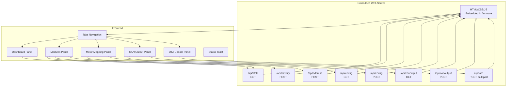

**Diagram sources**
- [ota_webserver.cpp:32-501](file://src/ota_webserver.cpp#L32-L501)
- [ota_webserver.cpp:506-789](file://src/ota_webserver.cpp#L506-L789)

**Section sources**
- [ota_webserver.cpp:32-501](file://src/ota_webserver.cpp#L32-L501)
- [ota_webserver.cpp:506-789](file://src/ota_webserver.cpp#L506-L789)

## Core Components
- Embedded HTML/CSS/JavaScript: The entire UI is embedded as a single HTML string with inline styles and scripts. It defines a tabbed interface, responsive grid layouts, progress bars, sliders, and interactive forms.
- REST API endpoints: The server exposes GET/POST endpoints for state, configuration, module identification/addressing, CAN output rules, and OTA update handling.
- Real-time updates: The frontend polls the state endpoint at a fixed interval and renders live dashboards for joysticks, solenoids, and bus statistics.
- Configuration management: The frontend fetches and posts axis mapping and CAN output rules, with immediate UI updates after save.
- OTA update: The frontend uploads a .bin file and displays progress until completion, then triggers a reload and device restart.

**Section sources**
- [ota_webserver.cpp:32-501](file://src/ota_webserver.cpp#L32-L501)
- [ota_webserver.cpp:506-789](file://src/ota_webserver.cpp#L506-L789)

## Architecture Overview
The embedded web server runs on an ESP32-based device, serving a static HTML page with inline CSS and JavaScript. The JavaScript code periodically requests JSON data from the backend and updates the DOM. The backend aggregates state from the CAN bus and device memory and exposes it via simple HTTP endpoints. OTA updates are handled via multipart upload.

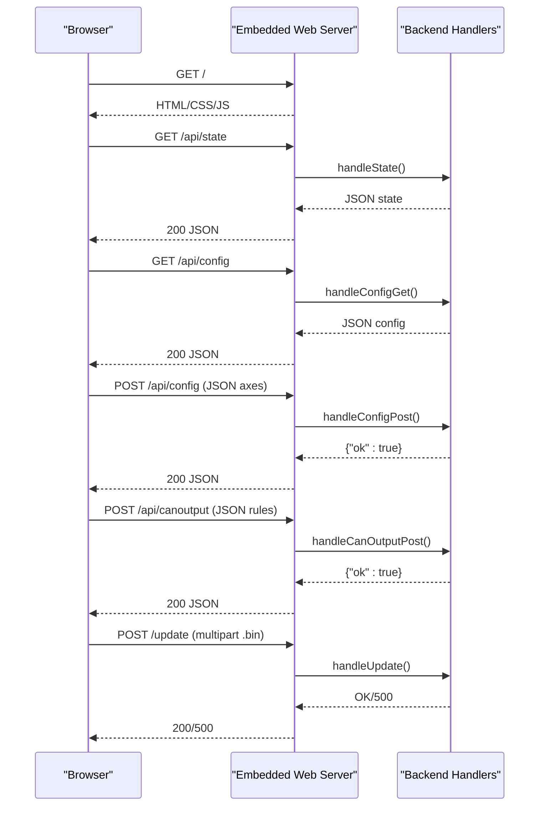

**Diagram sources**
- [ota_webserver.cpp:506-789](file://src/ota_webserver.cpp#L506-L789)

## Detailed Component Analysis

### Tabbed Interface Design
- Tabs: Five tabs are defined in the HTML: Dashboard, Modules, Motor Mapping, CAN Output, OTA Update. Switching is handled by a simple JavaScript function that toggles active classes on tabs and panels.
- Panels: Each panel is a container with a unique ID and an active class for visibility. Panels include cards, grids, tables, and forms tailored to their purpose.

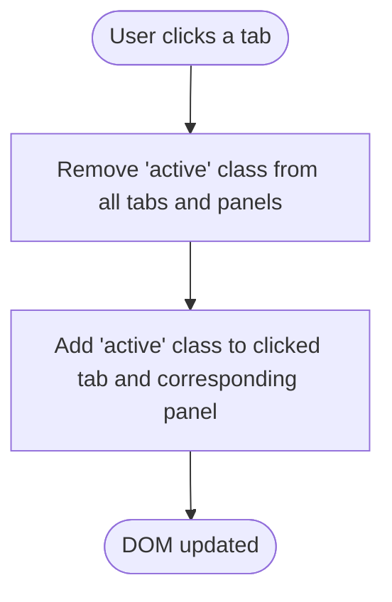

**Diagram sources**
- [ota_webserver.cpp:273-278](file://src/ota_webserver.cpp#L273-L278)

**Section sources**
- [ota_webserver.cpp:183-189](file://src/ota_webserver.cpp#L183-L189)
- [ota_webserver.cpp:273-278](file://src/ota_webserver.cpp#L273-L278)

### Real-Time Dashboard Rendering
- State polling: The frontend polls the state endpoint every 200 ms and updates local state, then renders joysticks, solenoid bars, and module table.
- Joystick rendering: For two joystick addresses, three potentiometer bars are rendered with gradient fills and labels. Button states are shown as concatenated labels.
- Solenoid rendering: Sixteen channels are rendered as vertical bars with channel labels and numeric values.
- Module rendering: Detected modules are listed in a table with type, uptime, last seen, and actions (identify and set address).

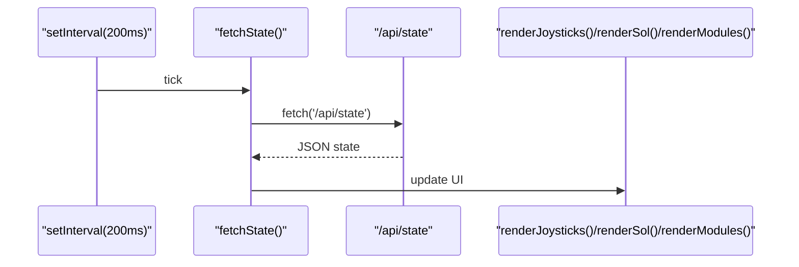

**Diagram sources**
- [ota_webserver.cpp:360-374](file://src/ota_webserver.cpp#L360-L374)
- [ota_webserver.cpp:286-295](file://src/ota_webserver.cpp#L286-L295)
- [ota_webserver.cpp:297-313](file://src/ota_webserver.cpp#L297-L313)
- [ota_webserver.cpp:315-335](file://src/ota_webserver.cpp#L315-L335)

**Section sources**
- [ota_webserver.cpp:360-374](file://src/ota_webserver.cpp#L360-L374)
- [ota_webserver.cpp:286-295](file://src/ota_webserver.cpp#L286-L295)
- [ota_webserver.cpp:297-313](file://src/ota_webserver.cpp#L297-L313)
- [ota_webserver.cpp:315-335](file://src/ota_webserver.cpp#L315-L335)

### Form Validation and Interaction Patterns
- Validation patterns:
  - Number inputs enforce min/max ranges (e.g., address, PWM values, momentary duration).
  - Range sliders update live labels via oninput handlers.
  - File selection validates presence before OTA upload.
- Interaction patterns:
  - Buttons trigger AJAX requests (identify, set address, save mapping, save CAN output, refresh).
  - Status toast provides user feedback for success/error conditions.

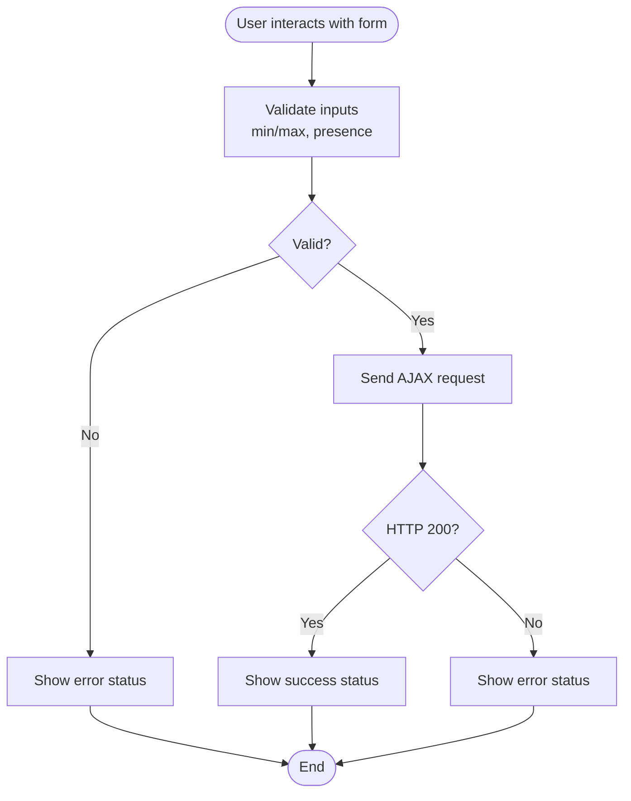

**Diagram sources**
- [ota_webserver.cpp:391-397](file://src/ota_webserver.cpp#L391-L397)
- [ota_webserver.cpp:400-419](file://src/ota_webserver.cpp#L400-L419)
- [ota_webserver.cpp:454-471](file://src/ota_webserver.cpp#L454-L471)
- [ota_webserver.cpp:473-492](file://src/ota_webserver.cpp#L473-L492)

**Section sources**
- [ota_webserver.cpp:337-358](file://src/ota_webserver.cpp#L337-L358)
- [ota_webserver.cpp:425-444](file://src/ota_webserver.cpp#L425-L444)
- [ota_webserver.cpp:473-492](file://src/ota_webserver.cpp#L473-L492)

### Grid-Based Layout System and Responsive Design
- Grid classes:
  - Cards and panels use a two-column grid on larger screens and stack on smaller screens.
  - Specialized grids for axis and CAN output rows define column widths and alignment.
- Responsive breakpoints:
  - Media queries adjust grid templates for narrower screens to maintain usability.

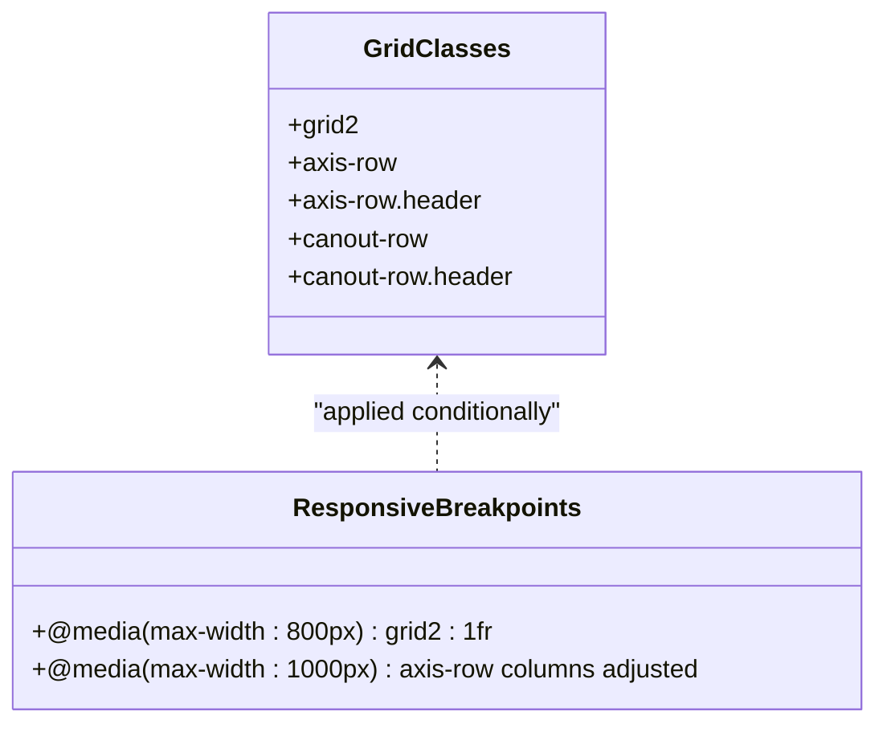

**Diagram sources**
- [ota_webserver.cpp:78-168](file://src/ota_webserver.cpp#L78-L168)

**Section sources**
- [ota_webserver.cpp:78-168](file://src/ota_webserver.cpp#L78-L168)

### Slider Controls and Live Labels
- Sliders:
  - Deadband min/max sliders update an adjacent span with the current value during input.
- Bar progress indicators:
  - Gradient-filled bars represent normalized values with percentage labels.

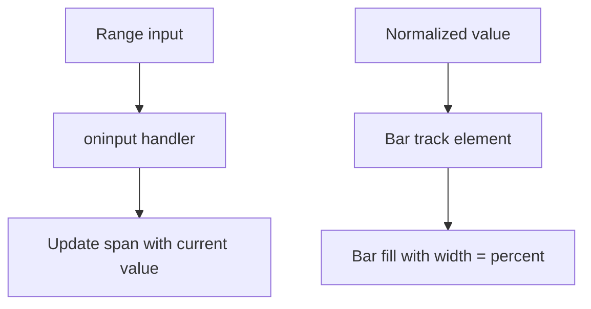

**Diagram sources**
- [ota_webserver.cpp:350-351](file://src/ota_webserver.cpp#L350-L351)
- [ota_webserver.cpp:280-284](file://src/ota_webserver.cpp#L280-L284)

**Section sources**
- [ota_webserver.cpp:350-351](file://src/ota_webserver.cpp#L350-L351)
- [ota_webserver.cpp:280-284](file://src/ota_webserver.cpp#L280-L284)

### Progress Indicators for OTA Updates
- Upload progress:
  - Uses XMLHttpRequest with onprogress to update a progress bar width.
- Completion handling:
  - On success, shows a success message and reloads the page after a delay.
  - On failure, shows an error message with response text.

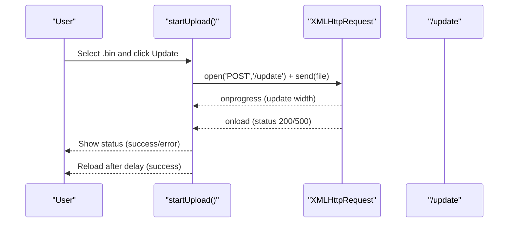

**Diagram sources**
- [ota_webserver.cpp:473-492](file://src/ota_webserver.cpp#L473-L492)
- [ota_webserver.cpp:705-733](file://src/ota_webserver.cpp#L705-L733)

**Section sources**
- [ota_webserver.cpp:473-492](file://src/ota_webserver.cpp#L473-L492)
- [ota_webserver.cpp:705-733](file://src/ota_webserver.cpp#L705-L733)

### Integration Patterns Between Frontend and Backend APIs
- State endpoint:
  - Returns local address, online status, uptime, TX/RX/error counts, joystick data, solenoid values, and module table.
- Configuration endpoints:
  - GET returns axis configuration; POST updates axes and broadcasts/persists changes.
- Module management:
  - POST identify sends a heartbeat identify command; POST address sets a new module address.
- CAN output rules:
  - GET returns configured rules; POST updates rules and reinitializes outputs.
- OTA:
  - POST multipart upload streams firmware; server responds with OK or error.

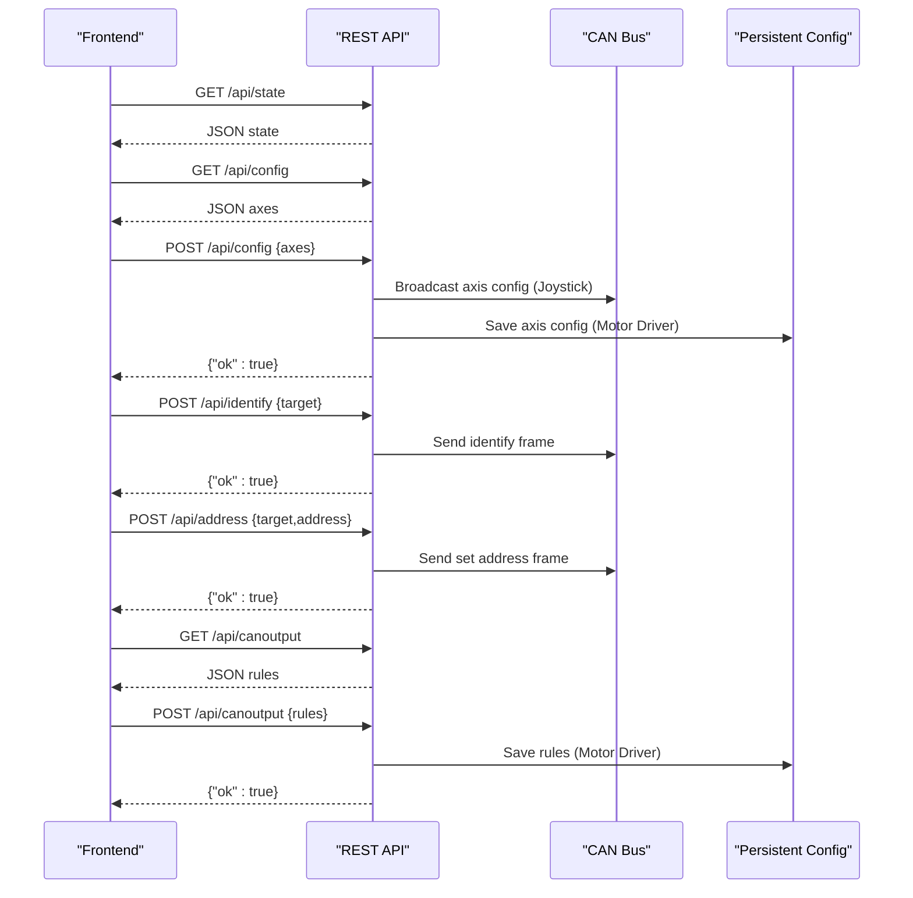

**Diagram sources**
- [ota_webserver.cpp:510-563](file://src/ota_webserver.cpp#L510-L563)
- [ota_webserver.cpp:565-585](file://src/ota_webserver.cpp#L565-L585)
- [ota_webserver.cpp:587-626](file://src/ota_webserver.cpp#L587-L626)
- [ota_webserver.cpp:639-657](file://src/ota_webserver.cpp#L639-L657)
- [ota_webserver.cpp:659-675](file://src/ota_webserver.cpp#L659-L675)
- [ota_webserver.cpp:677-703](file://src/ota_webserver.cpp#L677-L703)

**Section sources**
- [ota_webserver.cpp:510-563](file://src/ota_webserver.cpp#L510-L563)
- [ota_webserver.cpp:565-585](file://src/ota_webserver.cpp#L565-L585)
- [ota_webserver.cpp:587-626](file://src/ota_webserver.cpp#L587-L626)
- [ota_webserver.cpp:639-657](file://src/ota_webserver.cpp#L639-L657)
- [ota_webserver.cpp:659-675](file://src/ota_webserver.cpp#L659-L675)
- [ota_webserver.cpp:677-703](file://src/ota_webserver.cpp#L677-L703)

### Error Handling Strategies and User Feedback
- Status toast:
  - Centralized setStatus function updates a styled div with info/success/error classes and auto-hides after a timeout.
- Try/catch around fetch calls:
  - Prevents unhandled exceptions and allows silent failures for periodic state retrieval.
- Network errors:
  - XMLHttpRequest error handler reports network issues during OTA.

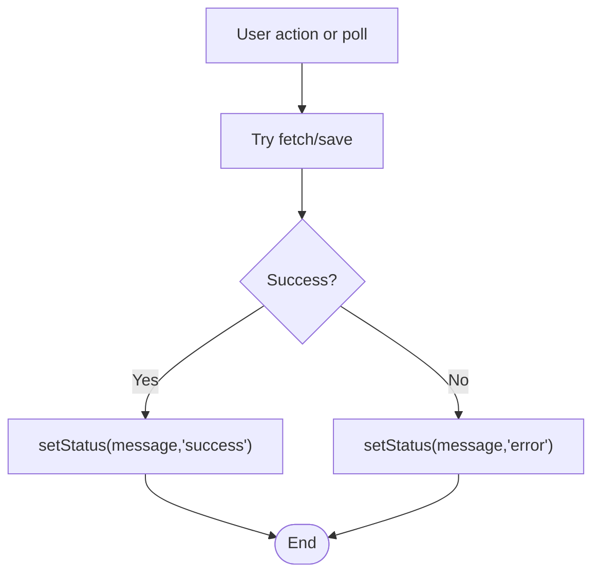

**Diagram sources**
- [ota_webserver.cpp:266-271](file://src/ota_webserver.cpp#L266-L271)
- [ota_webserver.cpp:360-374](file://src/ota_webserver.cpp#L360-L374)
- [ota_webserver.cpp:473-492](file://src/ota_webserver.cpp#L473-L492)

**Section sources**
- [ota_webserver.cpp:266-271](file://src/ota_webserver.cpp#L266-L271)
- [ota_webserver.cpp:360-374](file://src/ota_webserver.cpp#L360-L374)
- [ota_webserver.cpp:473-492](file://src/ota_webserver.cpp#L473-L492)

### Browser Compatibility, Mobile Responsiveness, and Accessibility
- Compatibility:
  - Uses modern fetch and XMLHttpRequest APIs; relies on ES5-compatible features and innerHTML for DOM updates.
- Mobile responsiveness:
  - CSS media queries adjust grid layouts for narrow screens; sliders and number inputs adapt to touch targets.
- Accessibility:
  - Semantic HTML structure with headings and tables; focusable elements include buttons and inputs.
  - Color contrast meets basic requirements for dark theme; consider adding ARIA roles and labels for improved accessibility.

[No sources needed since this section provides general guidance]

## Dependency Analysis
The embedded web server depends on shared state and configuration structures exported by the ECU-specific modules. The server initializes the access point, registers routes, and continuously serves requests while scanning for heartbeat messages to populate the module table.

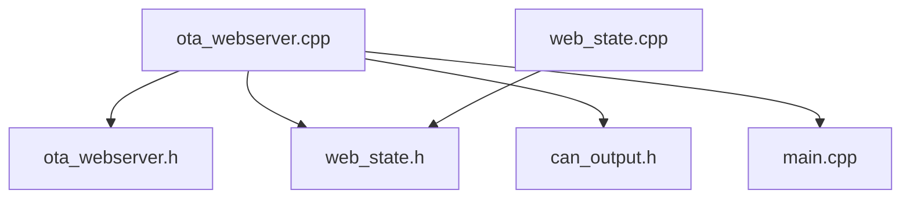

**Diagram sources**
- [ota_webserver.cpp:1-11](file://src/ota_webserver.cpp#L1-L11)
- [ota_webserver.h:1-6](file://src/ota_webserver.h#L1-L6)
- [web_state.h:1-23](file://src/web_state.h#L1-L23)
- [web_state.cpp:1-20](file://src/web_state.cpp#L1-L20)
- [can_output.h:1-11](file://src/can_output.h#L1-L11)
- [main.cpp:1-32](file://src/main.cpp#L1-L32)

**Section sources**
- [ota_webserver.cpp:1-11](file://src/ota_webserver.cpp#L1-L11)
- [web_state.h:1-23](file://src/web_state.h#L1-L23)
- [web_state.cpp:1-20](file://src/web_state.cpp#L1-L20)
- [can_output.h:1-11](file://src/can_output.h#L1-L11)
- [main.cpp:1-32](file://src/main.cpp#L1-L32)

## Performance Considerations
- Polling frequency: State is polled every 200 ms; consider throttling or server-sent events for lower overhead.
- DOM updates: Batch updates and avoid excessive reflows; ensure long lists are virtualized if extended.
- OTA throughput: Progress updates are handled efficiently via onprogress; ensure adequate buffer sizes on the device.

[No sources needed since this section provides general guidance]

## Troubleshooting Guide
- No data displayed:
  - Verify the device is connected to the CAN bus and online; check the bus status indicator.
  - Confirm the web server is running and reachable on the access point IP.
- OTA fails:
  - Ensure the selected file is a valid .bin; check network connectivity and server logs.
  - After success, allow time for device restart and reconnection.
- Configuration not saving:
  - Confirm the correct ECU type is flashed; motor driver saves to persistent storage, joystick broadcasts to others.

**Section sources**
- [ota_webserver.cpp:510-563](file://src/ota_webserver.cpp#L510-L563)
- [ota_webserver.cpp:705-733](file://src/ota_webserver.cpp#L705-L733)

## Conclusion
The embedded web interface for ForwarderKE provides a compact, real-time dashboard and configuration UI with a clean tabbed design, responsive layouts, and straightforward form interactions. Its integration with backend endpoints enables live monitoring and control of joystick inputs, solenoid outputs, module management, and OTA updates. With minor enhancements for accessibility and potential performance improvements, the interface offers a robust foundation for field configuration and diagnostics.