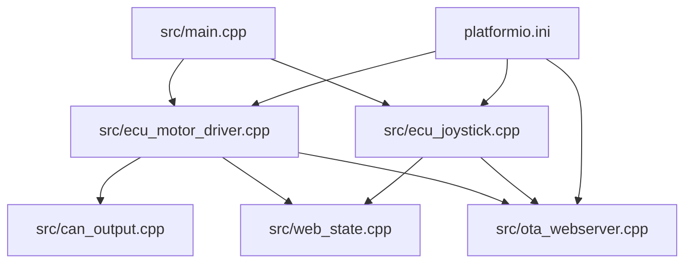
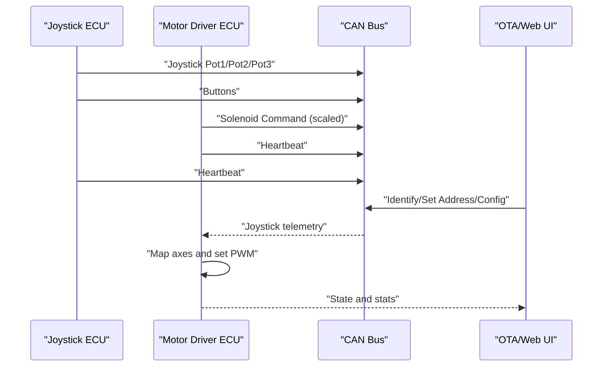
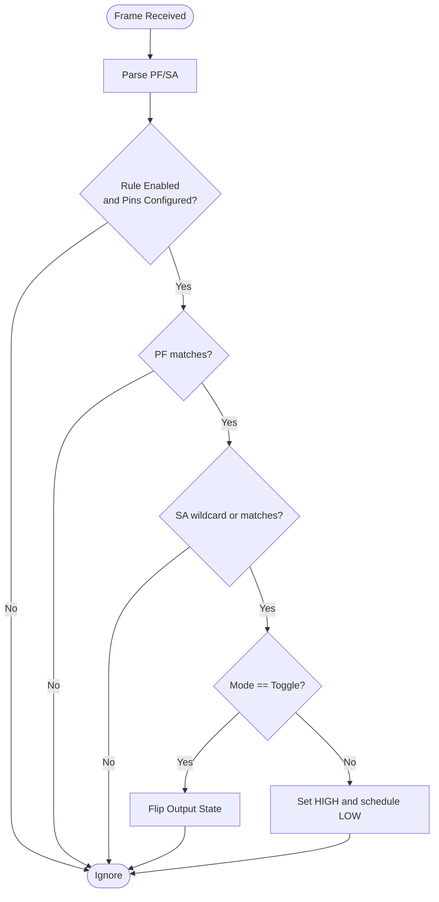
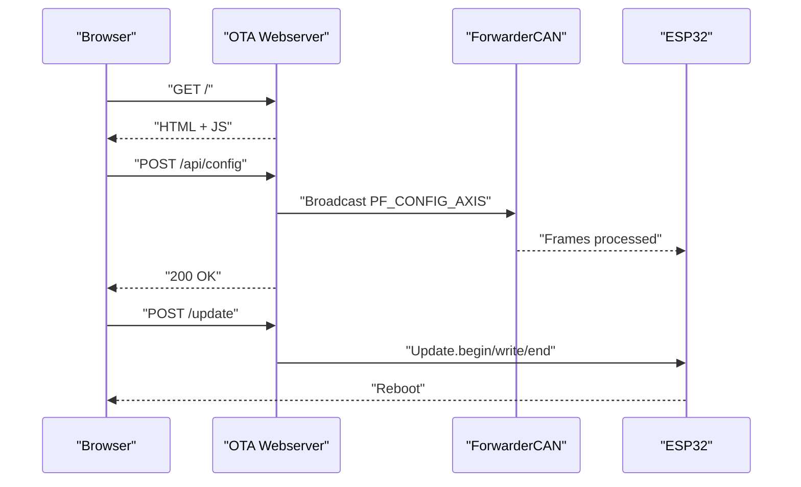
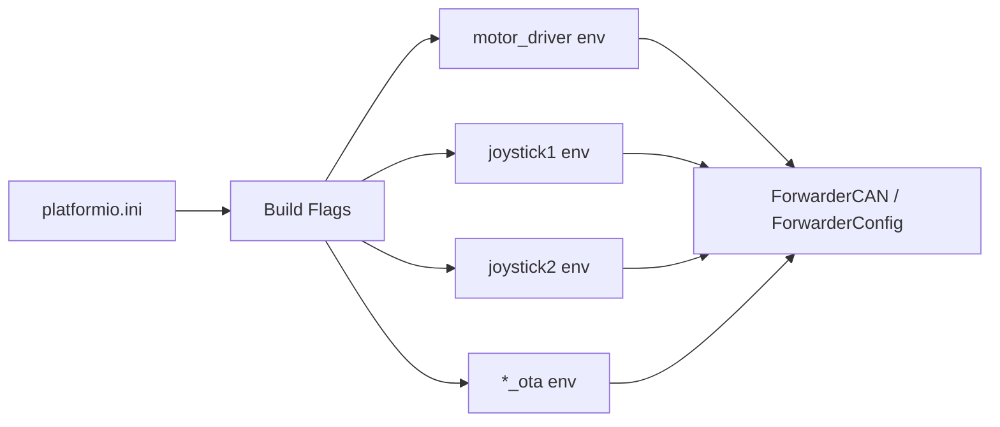

# Advanced Topics

<cite>
**Referenced Files in This Document**
- [README.md](file://README.md)
- [platformio.ini](file://platformio.ini)
- [src/main.cpp](file://src/main.cpp)
- [src/ecu_motor_driver.h](file://src/ecu_motor_driver.h)
- [src/ecu_motor_driver.cpp](file://src/ecu_motor_driver.cpp)
- [src/ecu_joystick.h](file://src/ecu_joystick.h)
- [src/ecu_joystick.cpp](file://src/ecu_joystick.cpp)
- [src/web_state.h](file://src/web_state.h)
- [src/web_state.cpp](file://src/web_state.cpp)
- [src/can_output.h](file://src/can_output.h)
- [src/can_output.cpp](file://src/can_output.cpp)
- [src/ota_webserver.h](file://src/ota_webserver.h)
- [src/ota_webserver.cpp](file://src/ota_webserver.cpp)
</cite>

## Table of Contents
1. [Introduction](#introduction)
2. [Project Structure](#project-structure)
3. [Core Components](#core-components)
4. [Architecture Overview](#architecture-overview)
5. [Detailed Component Analysis](#detailed-component-analysis)
6. [Dependency Analysis](#dependency-analysis)
7. [Performance Considerations](#performance-considerations)
8. [Security Considerations](#security-considerations)
9. [Advanced Configuration Scenarios](#advanced-configuration-scenarios)
10. [Reverse Engineering and Protocol Analysis](#reverse-engineering-and-protocol-analysis)
11. [Contributing and Development Best Practices](#contributing-and-development-best-practices)
12. [Conclusion](#conclusion)

## Introduction
This document provides advanced topics for ForwarderKE, focusing on protocol extensions, custom development, system optimization, security, and integration patterns. It explains how to extend the existing J1939-like CAN protocol, develop custom ECU types, integrate new hardware, optimize performance, secure deployments, coordinate multi-machine setups, and analyze CAN traffic for reverse engineering.

## Project Structure
ForwarderKE is organized around a small set of ECUs sharing a 250 kbps CAN bus with J1939-style extended IDs. The build system uses PlatformIO environments to compile distinct firmware variants per ECU type and optional OTA support.

**Diagram sources**
- [src/main.cpp:11-17](file://src/main.cpp#L11-L17)
- [src/ecu_motor_driver.cpp:290-325](file://src/ecu_motor_driver.cpp#L290-L325)
- [src/ecu_joystick.cpp:159-192](file://src/ecu_joystick.cpp#L159-L192)
- [src/can_output.cpp:7-19](file://src/can_output.cpp#L7-L19)
- [src/web_state.cpp:1-20](file://src/web_state.cpp#L1-L20)
- [src/ota_webserver.cpp:766-791](file://src/ota_webserver.cpp#L766-L791)
- [platformio.ini:17-61](file://platformio.ini#L17-L61)

**Section sources**
- [README.md:112-126](file://README.md#L112-L126)
- [platformio.ini:1-80](file://platformio.ini#L1-L80)

## Core Components
- ECU selection and entry point: The main application conditionally includes either the motor driver or joystick implementation based on build flags.
- Motor driver ECU: Controls up to 16 solenoids via PCA9685 PWM expansion, reads joystick inputs, applies axis mapping, and exposes CAN-triggered GPIO outputs.
- Joystick ECU: Reads analog pots/buttons and broadcasts joystick telemetry; supports LED control and address assignment.
- CAN output module: Matches incoming CAN frames and toggles or momentary-pulses GPIO pins according to configurable rules.
- Web UI and OTA: Provides a browser-based dashboard for diagnostics, configuration, and OTA updates.

**Section sources**
- [src/main.cpp:11-17](file://src/main.cpp#L11-L17)
- [src/ecu_motor_driver.cpp:390-355](file://src/ecu_motor_driver.cpp#L390-L355)
- [src/ecu_joystick.cpp:159-239](file://src/ecu_joystick.cpp#L159-L239)
- [src/can_output.cpp:7-66](file://src/can_output.cpp#L7-L66)
- [src/ota_webserver.cpp:766-791](file://src/ota_webserver.cpp#L766-L791)

## Architecture Overview
The system uses 29-bit extended CAN IDs with J1939 fields. ECUs broadcast periodic heartbeats and exchange messages for joystick telemetry, solenoid commands, LED control, and configuration.

**Diagram sources**
- [README.md:22-42](file://README.md#L22-L42)
- [src/ecu_motor_driver.cpp:184-275](file://src/ecu_motor_driver.cpp#L184-L275)
- [src/ecu_joystick.cpp:99-112](file://src/ecu_joystick.cpp#L99-L112)
- [src/ota_webserver.cpp:506-563](file://src/ota_webserver.cpp#L506-L563)

## Detailed Component Analysis

### Protocol Extensions and Message Types
- Current PF assignments include joystick telemetry, button events, LED control, solenoid commands, heartbeat, address claim/request, and identification.
- Extending the protocol involves selecting unused PF values and defining direction semantics (broadcast vs directed). The system supports:
  - Additional joystick PFs for auxiliary sensors or axes.
  - New device-specific PFs for future ECUs.
  - Parameter group numbers beyond the current set to carry extended configurations.

Implementation pointers:
- Message dispatch and ID parsing are centralized in each ECU’s CAN handler.
- Address claiming and heartbeat provide discovery and liveness guarantees.

**Section sources**
- [README.md:29-42](file://README.md#L29-L42)
- [src/ecu_motor_driver.cpp:184-275](file://src/ecu_motor_driver.cpp#L184-L275)
- [src/ecu_joystick.cpp:114-144](file://src/ecu_joystick.cpp#L114-L144)

### Extended Addressing Schemes
- Addresses are 8-bit J1939-style SAs in the range 0x20–0xEF.
- Address claiming and forced addresses are supported, enabling dynamic reassignment and persistent overrides.

Development guidance:
- Use the address claim mechanism during startup to avoid conflicts.
- Store forced addresses in non-volatile configuration to persist across reboots.

**Section sources**
- [README.md:105-111](file://README.md#L105-L111)
- [src/ecu_motor_driver.cpp:234-245](file://src/ecu_motor_driver.cpp#L234-L245)
- [src/ecu_joystick.cpp:132-142](file://src/ecu_joystick.cpp#L132-L142)

### Custom Parameter Group Numbers and Configuration
- Axis mapping and CAN output rules are stored in non-volatile configuration and applied at boot.
- The motor driver exposes a configuration API for remote axis tuning and persistence.

Implementation pointers:
- AxisConfig packing/unpacking and ForwarderConfig storage APIs.
- CAN-based configuration requests and responses.

**Section sources**
- [src/ecu_motor_driver.cpp:246-267](file://src/ecu_motor_driver.cpp#L246-L267)
- [src/web_state.h:10-17](file://src/web_state.h#L10-L17)
- [src/ota_webserver.cpp:565-626](file://src/ota_webserver.cpp#L565-L626)

### Developing Custom ECU Types
Steps to add a new ECU:
1. Define a new ECU type macro and preferred address in platformio.ini.
2. Implement ecu_setup() and ecu_loop() in a new source file.
3. Include ForwarderCAN and ForwarderConfig headers; initialize CAN with a unique ECU name array.
4. Add build flags for pins and peripherals.
5. Integrate with the shared web state and OTA if applicable.

Example references:
- ECU selection in main.cpp.
- Joystick and motor driver implementations as templates.

**Section sources**
- [platformio.ini:17-61](file://platformio.ini#L17-L61)
- [src/main.cpp:11-17](file://src/main.cpp#L11-L17)
- [src/ecu_joystick.cpp:159-192](file://src/ecu_joystick.cpp#L159-L192)
- [src/ecu_motor_driver.cpp:290-325](file://src/ecu_motor_driver.cpp#L290-L325)

### Extending the CAN Protocol
Recommended approach:
- Choose PF values outside the current set to avoid collisions.
- Define direction semantics (broadcast vs directed) and payload formats.
- Implement PF dispatch in the receiving ECU and broadcast handlers in transmitters.
- Add configuration messages for new PFs to enable remote tuning.

**Section sources**
- [README.md:29-42](file://README.md#L29-L42)
- [src/ecu_motor_driver.cpp:184-275](file://src/ecu_motor_driver.cpp#L184-L275)
- [src/ecu_joystick.cpp:114-144](file://src/ecu_joystick.cpp#L114-L144)

### Integrating New Hardware Components
- Motor driver supports dual PCA9685 units for up to 16 channels; initialization detects the second controller.
- GPIO outputs can be triggered by CAN frames using the CAN output module.
- LEDs and I2C devices are configured via build flags.

Guidance:
- Wire new I2C devices and expose their control via CAN messages or local GPIO outputs.
- Use the CAN output module to react to incoming CAN frames for relays or indicators.

**Section sources**
- [src/ecu_motor_driver.cpp:85-99](file://src/ecu_motor_driver.cpp#L85-L99)
- [src/can_output.cpp:29-61](file://src/can_output.cpp#L29-L61)
- [platformio.ini:17-30](file://platformio.ini#L17-L30)

### CAN Output Module
The CAN output module matches incoming frames by PF/SA and toggles or momentary-pulses GPIO pins. It persists rules in configuration and reinitializes outputs on changes.

**Diagram sources**
- [src/can_output.cpp:29-61](file://src/can_output.cpp#L29-L61)

**Section sources**
- [src/can_output.cpp:7-66](file://src/can_output.cpp#L7-L66)
- [src/web_state.h:17](file://src/web_state.h#L17)
- [src/ota_webserver.cpp:659-703](file://src/ota_webserver.cpp#L659-L703)

### OTA Webserver and Remote Management
The OTA webserver provides:
- Dashboard with joystick telemetry, solenoid bars, and bus statistics.
- Remote identify, address change, axis configuration, and CAN output rule management.
- Firmware update via HTTP POST with progress feedback.

**Diagram sources**
- [src/ota_webserver.cpp:506-563](file://src/ota_webserver.cpp#L506-L563)
- [src/ota_webserver.cpp:587-626](file://src/ota_webserver.cpp#L587-L626)
- [src/ota_webserver.cpp:705-737](file://src/ota_webserver.cpp#L705-L737)

**Section sources**
- [README.md:84-103](file://README.md#L84-L103)
- [src/ota_webserver.cpp:766-791](file://src/ota_webserver.cpp#L766-L791)

## Dependency Analysis
Build-time dependencies are managed via platformio.ini environments. Runtime dependencies include Arduino framework, Adafruit PWM Servo Driver, NeoPixelBus, and the ForwarderCAN/ForwarderConfig libraries.

**Diagram sources**
- [platformio.ini:17-80](file://platformio.ini#L17-L80)

**Section sources**
- [platformio.ini:9-15](file://platformio.ini#L9-L15)
- [platformio.ini:17-80](file://platformio.ini#L17-L80)

## Performance Considerations
- Memory usage reduction:
  - Use static arrays for joystick telemetry and solenoid values sized to maximum axes.
  - Limit JSON payload sizes in web handlers; keep only live data.
  - Disable unused features (e.g., disable OTA builds for constrained environments).
- Real-time performance:
  - Keep CAN receive loops minimal; process frames immediately upon receipt.
  - Use non-blocking timers for momentary GPIO outputs.
  - Avoid heavy blocking operations in loop().
- Power consumption optimization:
  - Put the MCU to sleep between polling cycles if feasible.
  - Reduce LED brightness and update frequency.
  - Disable unused peripherals (e.g., I2C devices) when not needed.

[No sources needed since this section provides general guidance]

## Security Considerations
- Production deployments:
  - Prefer wired Ethernet or secure Wi-Fi with strong credentials for OTA; avoid default passwords.
  - Restrict OTA endpoints to trusted networks; consider firewalling or VLAN segmentation.
- Access control:
  - Implement role-based actions (identify, set address, configure) only when necessary.
  - Validate and sanitize JSON payloads in handlers.
- Protection against malicious CAN traffic:
  - Enforce strict PF/SA matching and length checks.
  - Reject out-of-range addresses and malformed payloads.
  - Monitor bus errors and recover gracefully.

**Section sources**
- [README.md:105-111](file://README.md#L105-L111)
- [src/ecu_motor_driver.cpp:184-275](file://src/ecu_motor_driver.cpp#L184-L275)
- [src/ota_webserver.cpp:628-637](file://src/ota_webserver.cpp#L628-L637)

## Advanced Configuration Scenarios
- Multi-machine coordination:
  - Use heartbeats to discover and track modules; maintain a module registry keyed by SA.
  - Broadcast identify commands to visually locate units.
- Centralized control systems:
  - Aggregate telemetry from multiple joysticks and solenoids in a central dashboard.
  - Push axis and CAN output rules from a host to ECUs over CAN.
- Integration with external monitoring platforms:
  - Expose a lightweight HTTP endpoint or MQTT bridge to stream telemetry and health metrics.

**Section sources**
- [src/ota_webserver.cpp:16-25](file://src/ota_webserver.cpp#L16-L25)
- [src/ota_webserver.cpp:742-761](file://src/ota_webserver.cpp#L742-L761)

## Reverse Engineering and Protocol Analysis
- Understanding existing traffic:
  - Capture heartbeats to infer ECU types and addresses.
  - Parse PF/PS fields to distinguish joystick telemetry, solenoid commands, and configuration messages.
- Tools and techniques:
  - Use a USB-to-CAN adapter and tools like candump/cansend to observe frames.
  - Correlate frame timing with LED behavior and solenoid actuation.
- System integration patterns:
  - Treat PFs as functional domains (joystick, motor, config).
  - Use broadcast for global commands and directed messages for device-specific control.

**Section sources**
- [README.md:22-42](file://README.md#L22-L42)
- [src/ecu_motor_driver.cpp:184-275](file://src/ecu_motor_driver.cpp#L184-L275)

## Contributing and Development Best Practices
- Code organization:
  - Keep ECU logic modular with separate setup/loop functions.
  - Use shared headers (web_state.h) to expose runtime state to UI and OTA.
- Embedded CAN best practices:
  - Validate frame lengths and PF/SA ranges.
  - Implement watchdogs and safety timeouts (e.g., solenoid timeout).
  - Use non-volatile storage for persistent configuration.
- Build and testing:
  - Use PlatformIO environments to test distinct ECU variants.
  - Validate OTA flows and UI responsiveness.

**Section sources**
- [src/web_state.h:8-23](file://src/web_state.h#L8-L23)
- [src/ecu_motor_driver.cpp:332-337](file://src/ecu_motor_driver.cpp#L332-L337)
- [platformio.ini:17-80](file://platformio.ini#L17-L80)

## Conclusion
ForwarderKE offers a flexible foundation for embedded CAN control with clear extension points. By leveraging J1939-style addressing, modular ECUs, and a web-based configuration interface, teams can evolve protocols, integrate new hardware, optimize performance, and operate securely in production environments.