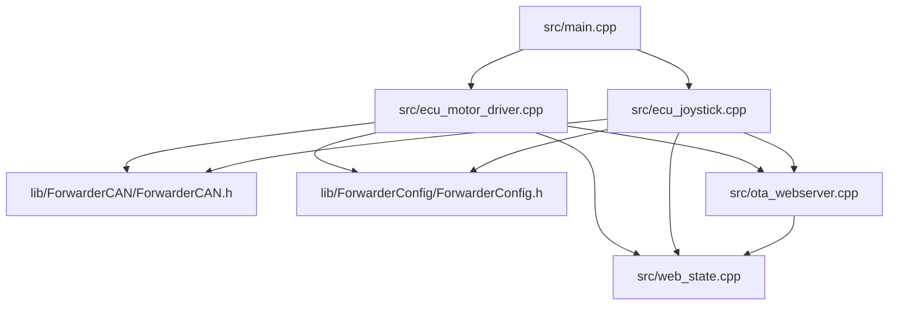
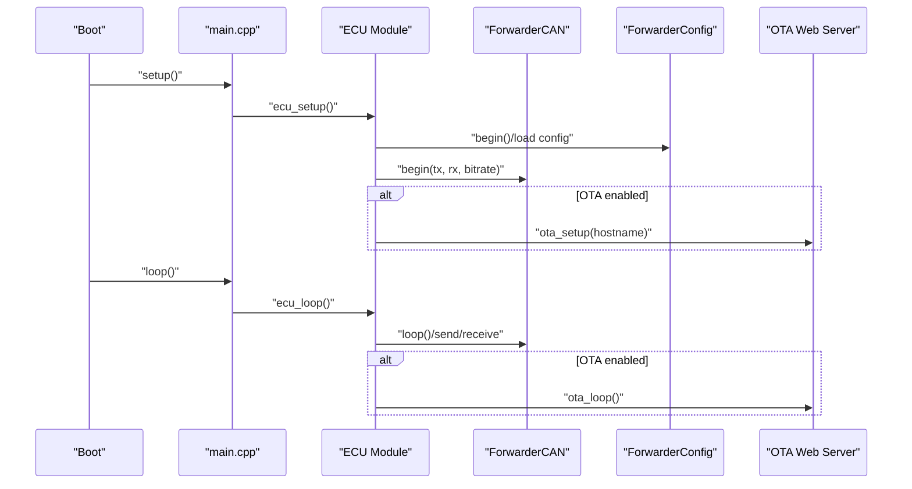
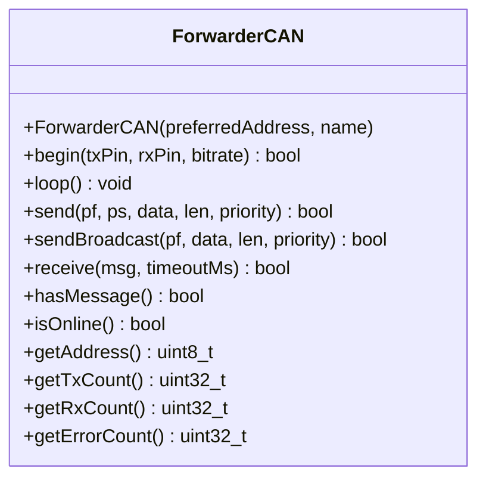
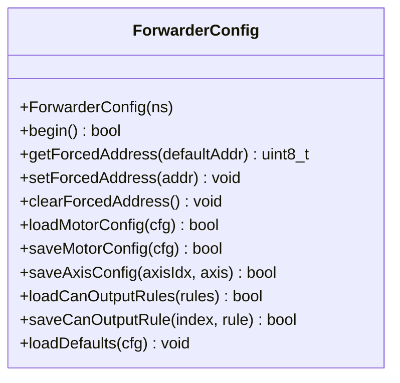
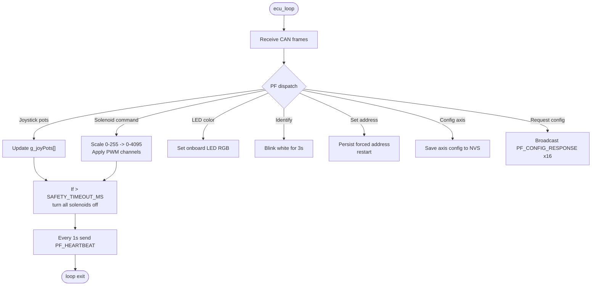
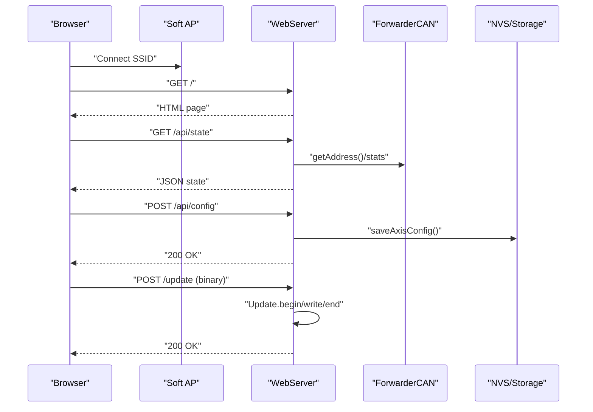
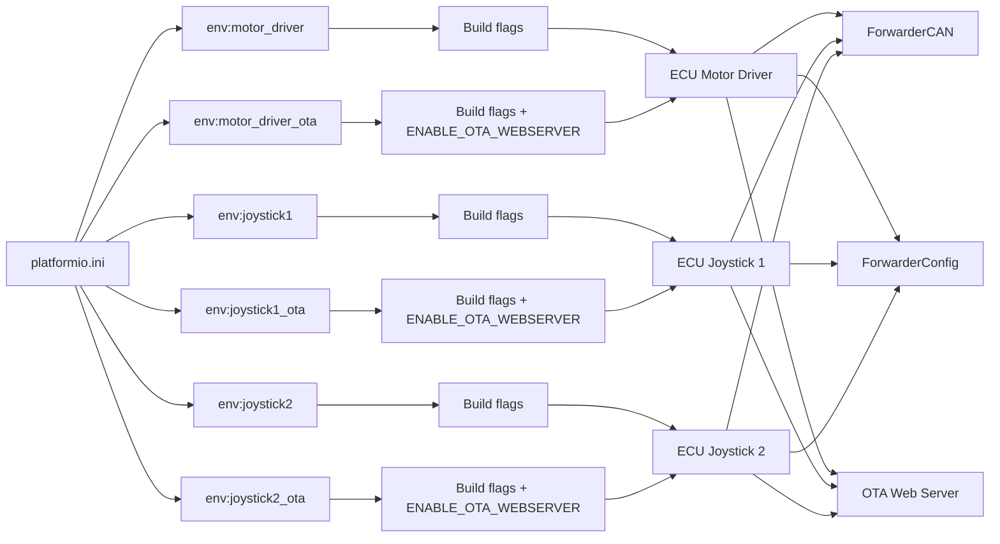
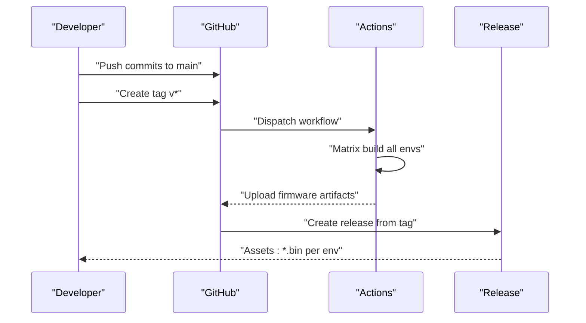

# Development Practices and Contributing

<cite>
**Referenced Files in This Document**
- [README.md](file://README.md)
- [platformio.ini](file://platformio.ini)
- [.github/workflows/build.yml](file://.github/workflows/build.yml)
- [src/main.cpp](file://src/main.cpp)
- [src/ecu_motor_driver.h](file://src/ecu_motor_driver.h)
- [src/ecu_motor_driver.cpp](file://src/ecu_motor_driver.cpp)
- [src/ecu_joystick.h](file://src/ecu_joystick.h)
- [src/ecu_joystick.cpp](file://src/ecu_joystick.cpp)
- [src/ota_webserver.h](file://src/ota_webserver.h)
- [src/ota_webserver.cpp](file://src/ota_webserver.cpp)
- [src/web_state.h](file://src/web_state.h)
- [src/web_state.cpp](file://src/web_state.cpp)
- [src/can_output.h](file://src/can_output.h)
- [lib/ForwarderCAN/ForwarderCAN.h](file://lib/ForwarderCAN/ForwarderCAN.h)
- [lib/ForwarderConfig/ForwarderConfig.h](file://lib/ForwarderConfig/ForwarderConfig.h)
- [.gitignore](file://.gitignore)
</cite>

## Table of Contents
1. [Introduction](#introduction)
2. [Project Structure](#project-structure)
3. [Core Components](#core-components)
4. [Architecture Overview](#architecture-overview)
5. [Detailed Component Analysis](#detailed-component-analysis)
6. [Dependency Analysis](#dependency-analysis)
7. [Performance Considerations](#performance-considerations)
8. [Testing Methodology](#testing-methodology)
9. [Version Control and Release Procedures](#version-control-and-release-procedures)
10. [Contributing Guidelines](#contributing-guidelines)
11. [Build System and Cross-Compilation](#build-system-and-cross-compilation)
12. [Templates and Examples](#templates-and-examples)
13. [Troubleshooting Guide](#troubleshooting-guide)
14. [Conclusion](#conclusion)

## Introduction
This document defines development practices, contribution guidelines, and operational procedures for ForwarderKE, an ESP32-based CAN controller for agricultural machinery. It covers modular design, header management, cross-platform considerations, PlatformIO workflows, coding standards, testing, CI/CD, version control, and practical guidance for extending functionality safely and efficiently.

## Project Structure
ForwarderKE follows a layered, modular structure:
- Application entry point selects the ECU type at compile-time.
- ECU-specific logic is isolated in dedicated modules.
- Shared libraries encapsulate protocol and configuration concerns.
- PlatformIO environments define hardware and feature sets per target.



**Diagram sources**
- [src/main.cpp:11-17](file://src/main.cpp#L11-L17)
- [src/ecu_motor_driver.cpp:1-355](file://src/ecu_motor_driver.cpp#L1-L355)
- [src/ecu_joystick.cpp:1-239](file://src/ecu_joystick.cpp#L1-L239)
- [lib/ForwarderCAN/ForwarderCAN.h:1-120](file://lib/ForwarderCAN/ForwarderCAN.h#L1-L120)
- [lib/ForwarderConfig/ForwarderConfig.h:1-92](file://lib/ForwarderConfig/ForwarderConfig.h#L1-L92)
- [src/ota_webserver.cpp:1-809](file://src/ota_webserver.cpp#L1-L809)
- [src/web_state.cpp:1-20](file://src/web_state.cpp#L1-L20)

**Section sources**
- [README.md:112-126](file://README.md#L112-L126)
- [platformio.ini:1-80](file://platformio.ini#L1-L80)

## Core Components
- ForwarderCAN: Implements J1939-like 29-bit ID layout, address claiming, and message framing.
- ForwarderConfig: Manages persistent configuration (NVS), axis mapping, and CAN output rules.
- ECU Modules: Motor driver and joystick controllers implement ECU-specific logic and CAN behavior.
- OTA Web Server: Provides Wi-Fi AP, mDNS, and a browser UI for diagnostics and OTA updates.
- Web State: Exposes shared runtime state to the web UI/API.

Key responsibilities and relationships:
- ECU selection via build flags routes to the appropriate module.
- Both ECUs rely on ForwarderCAN for transport and address arbitration.
- Motor driver consumes joystick inputs and controls solenoids via PCA9685.
- OTA web server augments builds with Wi-Fi and HTTP APIs.

**Section sources**
- [lib/ForwarderCAN/ForwarderCAN.h:1-120](file://lib/ForwarderCAN/ForwarderCAN.h#L1-L120)
- [lib/ForwarderConfig/ForwarderConfig.h:1-92](file://lib/ForwarderConfig/ForwarderConfig.h#L1-L92)
- [src/ecu_motor_driver.cpp:1-355](file://src/ecu_motor_driver.cpp#L1-L355)
- [src/ecu_joystick.cpp:1-239](file://src/ecu_joystick.cpp#L1-L239)
- [src/ota_webserver.cpp:1-809](file://src/ota_webserver.cpp#L1-L809)
- [src/web_state.cpp:1-20](file://src/web_state.cpp#L1-L20)

## Architecture Overview
The system uses a compile-time ECU selector and shared libraries for transport and persistence. The OTA-enabled builds add a soft AP and HTTP server for diagnostics and firmware updates.



**Diagram sources**
- [src/main.cpp:19-31](file://src/main.cpp#L19-L31)
- [src/ecu_motor_driver.cpp:290-352](file://src/ecu_motor_driver.cpp#L290-L352)
- [src/ecu_joystick.cpp:159-236](file://src/ecu_joystick.cpp#L159-L236)
- [lib/ForwarderCAN/ForwarderCAN.h:66-119](file://lib/ForwarderCAN/ForwarderCAN.h#L66-L119)
- [lib/ForwarderConfig/ForwarderConfig.h:64-91](file://lib/ForwarderConfig/ForwarderConfig.h#L64-L91)
- [src/ota_webserver.cpp:766-791](file://src/ota_webserver.cpp#L766-L791)

## Detailed Component Analysis

### ForwarderCAN
- Implements J1939-like 29-bit ID packing/unpacking and PF/PS/SA extraction.
- Manages address claiming with retries and timeouts.
- Provides send/receive APIs and statistics counters.



**Diagram sources**
- [lib/ForwarderCAN/ForwarderCAN.h:66-119](file://lib/ForwarderCAN/ForwarderCAN.h#L66-L119)

**Section sources**
- [lib/ForwarderCAN/ForwarderCAN.h:1-120](file://lib/ForwarderCAN/ForwarderCAN.h#L1-L120)

### ForwarderConfig
- Stores and retrieves persistent configuration in NVS.
- Defines axis mapping and CAN output rules.
- Supports factory defaults and per-ECU namespaces.



**Diagram sources**
- [lib/ForwarderConfig/ForwarderConfig.h:64-91](file://lib/ForwarderConfig/ForwarderConfig.h#L64-L91)

**Section sources**
- [lib/ForwarderConfig/ForwarderConfig.h:1-92](file://lib/ForwarderConfig/ForwarderConfig.h#L1-L92)

### ECU Motor Driver
- Initializes PCA9685, NeoPixel, and CAN.
- Receives joystick inputs and maps to solenoid outputs.
- Implements safety shutoff after inactivity and heartbeat broadcasting.



**Diagram sources**
- [src/ecu_motor_driver.cpp:184-275](file://src/ecu_motor_driver.cpp#L184-L275)
- [src/ecu_motor_driver.cpp:327-352](file://src/ecu_motor_driver.cpp#L327-L352)

**Section sources**
- [src/ecu_motor_driver.cpp:1-355](file://src/ecu_motor_driver.cpp#L1-L355)

### ECU Joystick
- Reads analog pots and buttons, sends periodic joystick frames.
- Responds to LED color, identify, and set-address commands.
- Broadcasts heartbeat with joystick identifier.

```mermaid
sequenceDiagram
participant Loop as "ecu_loop"
participant IO as "ADC/Pins"
participant CAN as "ForwarderCAN"
participant OTA as "OTA Web Server"
Loop->>IO : "readInputs()"
Loop->>CAN : "sendBroadcast(PF_JOYSTICK_POT1/2)"
Loop->>CAN : "sendBroadcast(PF_JOYSTICK_BUTTONS)"
Loop->>CAN : "sendBroadcast(PF_HEARTBEAT)"
Loop->>CAN : "receive()"
alt LED color / identify / set address
CAN-->>Loop : "processCAN()"
end
opt OTA enabled
Loop->>OTA : "ota_loop()"
end
```

**Diagram sources**
- [src/ecu_joystick.cpp:194-236](file://src/ecu_joystick.cpp#L194-L236)
- [src/ecu_joystick.cpp:114-144](file://src/ecu_joystick.cpp#L114-L144)

**Section sources**
- [src/ecu_joystick.cpp:1-239](file://src/ecu_joystick.cpp#L1-L239)

### OTA Web Server
- Starts soft AP and mDNS, serves HTML and JSON APIs.
- Exposes state, mapping, CAN output rules, and firmware update endpoint.
- Scans heartbeats to discover modules on the bus.



**Diagram sources**
- [src/ota_webserver.cpp:766-791](file://src/ota_webserver.cpp#L766-L791)
- [src/ota_webserver.cpp:506-563](file://src/ota_webserver.cpp#L506-L563)
- [src/ota_webserver.cpp:627-637](file://src/ota_webserver.cpp#L627-L637)
- [src/ota_webserver.cpp:705-733](file://src/ota_webserver.cpp#L705-L733)

**Section sources**
- [src/ota_webserver.cpp:1-809](file://src/ota_webserver.cpp#L1-L809)

## Dependency Analysis
- ECU modules depend on ForwarderCAN and ForwarderConfig.
- OTA web server depends on WiFi/WebServer/Update and integrates with CAN and configuration.
- PlatformIO manages platform, board, framework, and environment-specific build flags.



**Diagram sources**
- [platformio.ini:1-80](file://platformio.ini#L1-L80)

**Section sources**
- [platformio.ini:1-80](file://platformio.ini#L1-L80)

## Performance Considerations
- CAN bus rate and TWAI driver configuration are centralized in build flags.
- Motor driver maps 0–255 joystick values to 12-bit PWM (0–4095) with configurable deadbands and directionality.
- Safety shutoff prevents stale solenoid commands after inactivity.
- OTA update uses streaming with progress reporting; ensure sufficient heap and flash alignment.

[No sources needed since this section provides general guidance]

## Testing Methodology
- Unit testing: Validate mapping math and configuration packing/unpacking in isolation using mock CAN and NVS abstractions.
- Integration testing: Verify address claiming, heartbeat exchange, and joystick-to-solenoid mapping on a real CAN bus.
- Validation: Use the OTA web UI to inspect state, adjust mapping, and confirm solenoid response. Confirm bus-off recovery and watchdog behavior under fault conditions.

[No sources needed since this section provides general guidance]

## Version Control and Release Procedures
- Branches: Builds run on main and tags; releases are created from annotated tags.
- CI matrix: Builds all environments defined in PlatformIO.
- Artifacts: Firmware binaries are uploaded per environment and attached to releases.



**Diagram sources**
- [.github/workflows/build.yml:1-81](file://.github/workflows/build.yml#L1-L81)

**Section sources**
- [.github/workflows/build.yml:1-81](file://.github/workflows/build.yml#L1-L81)

## Contributing Guidelines
- Issue reporting: Provide device logs, environment details, and reproduction steps.
- Feature requests: Describe the use case, CAN message impact, and configuration options.
- Pull requests: Target main, include rationale, test coverage, and CI passing.
- Code review: Focus on correctness, safety, maintainability, and adherence to existing patterns.

[No sources needed since this section provides general guidance]

## Build System and Cross-Compilation
- PlatformIO configuration:
  - Platform: Espressif ESP32
  - Board: esp32-s3-devkitc-1 or esp32dev variants
  - Framework: Arduino
  - Monitor speed: 115200
- Environment-specific flags:
  - ECU selection via ECU_TYPE_* macros
  - Preferred address and ECU name constants
  - Pin assignments for CAN/I2C/LED/analog inputs
  - Safety and timing parameters
  - OTA enablement via ENABLE_OTA_WEBSERVER
- Multi-target builds: Use environment names to build and flash distinct firmware variants.

**Section sources**
- [platformio.ini:1-80](file://platformio.ini#L1-L80)
- [README.md:63-103](file://README.md#L63-L103)

## Templates and Examples
- Adding a new ECU type:
  - Create a new header/source pair mirroring the existing ECU pattern.
  - Add a new environment in platformio.ini with ECU_TYPE_* and pin/address flags.
  - Gate logic with preprocessor checks similar to existing ECUs.
  - Integrate with ForwarderCAN and ForwarderConfig as needed.
- Extending functionality:
  - Define new PF constants and handlers in ForwarderCAN and ECU modules.
  - Use ForwarderConfig to persist new parameters in NVS.
  - Add UI/API endpoints in the OTA web server if exposing configuration remotely.
- Backward compatibility:
  - Keep message payload sizes fixed and avoid changing PF/PS semantics.
  - Provide default values and safe fallbacks for new fields.

[No sources needed since this section provides general guidance]

## Troubleshooting Guide
- Address claiming failures: Verify unique preferred addresses and retry attempts.
- CAN bus errors: Watch for bus-off and automatic recovery; check wiring and termination.
- OTA update failures: Ensure correct binary selected and sufficient free flash; monitor serial logs during update.
- Stuck solenoids: Confirm joystick activity and SAFETY_TIMEOUT_MS; verify heartbeat presence.

**Section sources**
- [lib/ForwarderCAN/ForwarderCAN.h:74-119](file://lib/ForwarderCAN/ForwarderCAN.h#L74-L119)
- [src/ecu_motor_driver.cpp:332-337](file://src/ecu_motor_driver.cpp#L332-L337)
- [src/ota_webserver.cpp:705-733](file://src/ota_webserver.cpp#L705-L733)

## Coding Standards and Naming Conventions
- File naming: Lowercase with underscores; headers use .h suffix.
- Macros: UPPERCASE_WITH_UNDERSCORES for build flags and constants.
- Variables: camelCase for locals; kPrefix for constants; g_ for globals scoped to translation units.
- Functions: PascalCase for public APIs; snake_case for private helpers.
- Classes: PascalCase; methods inlined when trivial.
- Comments: Brief, clear, and focused on intent and behavior.

[No sources needed since this section provides general guidance]

## Documentation Requirements
- Inline comments: Explain non-obvious logic, timing, and safety constraints.
- API docs: Document public functions in headers with parameters and return values.
- README updates: Reflect changes to supported ECUs, build flags, and features.

[No sources needed since this section provides general guidance]

## Conclusion
ForwarderKE emphasizes modular design, compile-time ECU selection, and shared libraries for transport and configuration. PlatformIO streamlines multi-target builds, while GitHub Actions automate CI and releases. Contributors should adhere to established patterns, validate behavior on hardware, and maintain backward compatibility when extending functionality.