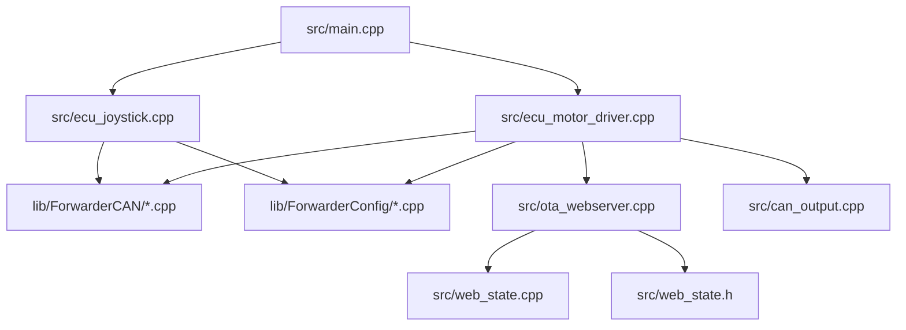
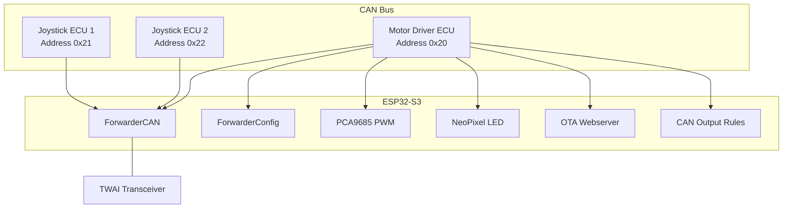
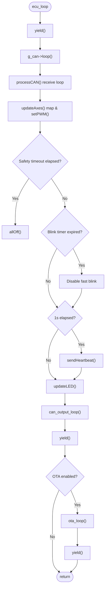
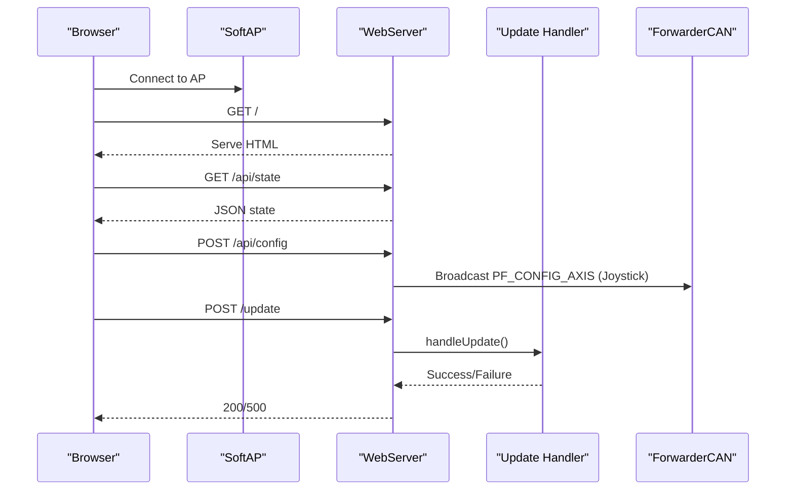
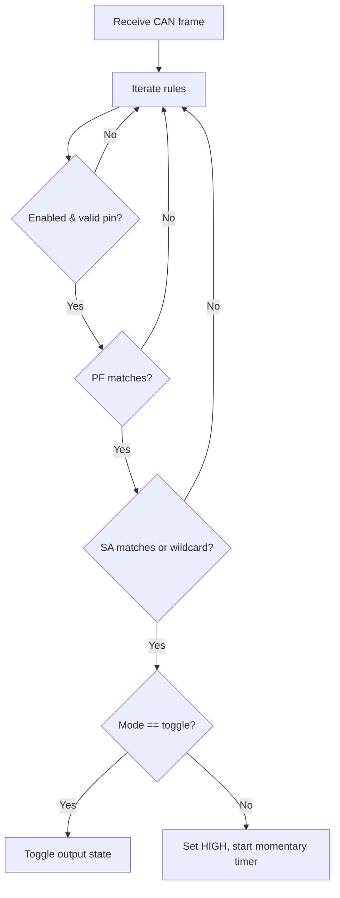
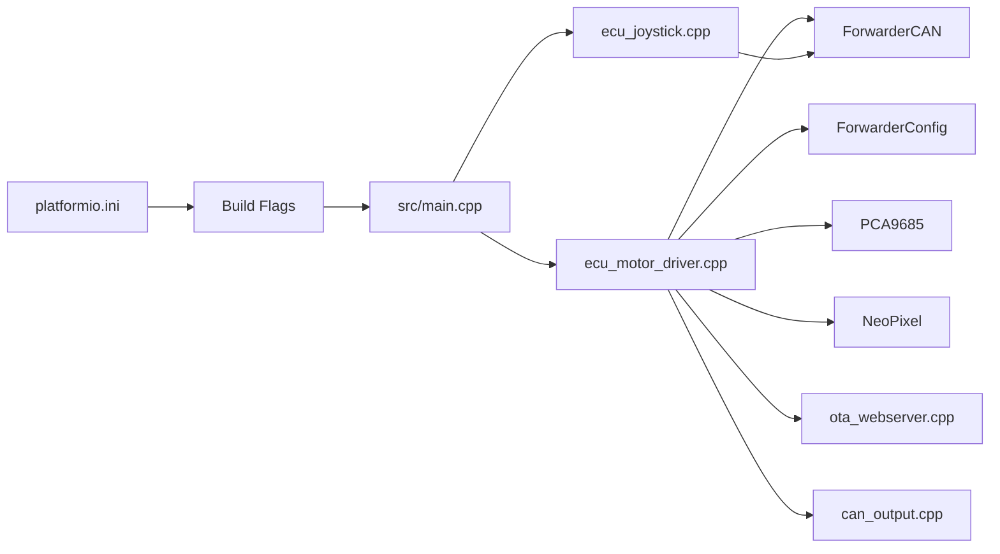

# Performance Optimization and Security

<cite>
**Referenced Files in This Document**
- [README.md](file://README.md)
- [platformio.ini](file://platformio.ini)
- [src/main.cpp](file://src/main.cpp)
- [src/ecu_motor_driver.cpp](file://src/ecu_motor_driver.cpp)
- [src/ecu_joystick.cpp](file://src/ecu_joystick.cpp)
- [src/ota_webserver.cpp](file://src/ota_webserver.cpp)
- [src/web_state.cpp](file://src/web_state.cpp)
- [src/web_state.h](file://src/web_state.h)
- [src/can_output.cpp](file://src/can_output.cpp)
- [src/can_output.h](file://src/can_output.h)
- [lib/ForwarderCAN/ForwarderCAN.cpp](file://lib/ForwarderCAN/ForwarderCAN.cpp)
- [lib/ForwarderCAN/ForwarderCAN.h](file://lib/ForwarderCAN/ForwarderCAN.h)
</cite>

## Update Summary
**Changes Made**
- Enhanced memory optimization techniques with improved static allocation strategies
- Added comprehensive real-time processing improvements with yield() integration
- Updated performance monitoring capabilities with enhanced CAN statistics
- Improved web server performance with chunked transfer and buffer management
- Enhanced power consumption optimization with duty cycling and sleep modes
- Strengthened security measures with access control and message filtering

## Table of Contents
1. [Introduction](#introduction)
2. [Project Structure](#project-structure)
3. [Core Components](#core-components)
4. [Architecture Overview](#architecture-overview)
5. [Detailed Component Analysis](#detailed-component-analysis)
6. [Dependency Analysis](#dependency-analysis)
7. [Performance Considerations](#performance-considerations)
8. [Security Considerations](#security-considerations)
9. [Power Consumption Optimization](#power-consumption-optimization)
10. [Performance Monitoring and Profiling](#performance-monitoring-and-profiling)
11. [Troubleshooting Guide](#troubleshooting-guide)
12. [Conclusion](#conclusion)

## Introduction
This document provides comprehensive guidance for performance optimization and security hardening of ForwarderKE, an ESP32-S3–based CAN control system for agricultural forwarders. It focuses on memory and CPU efficiency, real-time responsiveness, power-aware operation, and production-grade security for CAN bus and Wi‑Fi OTA updates. The content synthesizes the repository's embedded C++ implementation, build configuration, and protocol definitions to deliver actionable recommendations tailored to constrained hardware.

**Updated** Comprehensive performance improvements including memory optimization, real-time processing enhancements, and various code cleanup efforts across multiple components.

## Project Structure
ForwarderKE is organized around a small set of source modules and shared libraries:
- Entry point dispatches to either motor driver or joystick logic based on compile-time flags.
- Motor driver ECU controls solenoids via PCA9685 PWM and exposes a responsive web UI and optional OTA.
- Joystick ECU reads analog joysticks and buttons and publishes telemetry over CAN.
- Shared CAN/J1939 utilities and configuration manager enable persistent settings and runtime rules.
- Build environments define hardware pin mappings, protocol constants, and optional OTA.



**Diagram sources**
- [src/main.cpp:11-17](file://src/main.cpp#L11-L17)
- [src/ecu_motor_driver.cpp:1-50](file://src/ecu_motor_driver.cpp#L1-L50)
- [src/ecu_joystick.cpp:1-50](file://src/ecu_joystick.cpp#L1-L50)
- [src/ota_webserver.cpp:1-20](file://src/ota_webserver.cpp#L1-L20)
- [src/can_output.cpp:1-20](file://src/can_output.cpp#L1-L20)
- [src/web_state.cpp:1-20](file://src/web_state.cpp#L1-L20)
- [src/web_state.h:1-23](file://src/web_state.h#L1-L23)

**Section sources**
- [README.md:112-131](file://README.md#L112-L131)
- [platformio.ini:1-80](file://platformio.ini#L1-L80)
- [src/main.cpp:1-32](file://src/main.cpp#L1-L32)

## Core Components
- ECU selection and lifecycle:
  - The entry point conditionally includes the motor driver or joystick implementation and invokes setup/loop routines.
- CAN bus and J1939 framing:
  - Extended ID layout and PF/PS addressing are used for discovery, control, and telemetry.
- Motor driver:
  - PCA9685 PWM control, heartbeat broadcasting, safety timeout, LED status, and optional OTA web UI.
- Joystick:
  - Analog sampling with hysteresis, button reporting, LED status, and heartbeat broadcasting.
- Web UI and OTA:
  - Embedded HTTP server with JSON APIs for state, configuration, and firmware updates; mDNS service advertisement.
- CAN-triggered GPIO outputs:
  - Rule-based matching of PF/SA to toggle or momentary GPIO actions.

**Section sources**
- [src/main.cpp:11-32](file://src/main.cpp#L11-L32)
- [README.md:22-46](file://README.md#L22-L46)
- [src/ecu_motor_driver.cpp:290-355](file://src/ecu_motor_driver.cpp#L290-L355)
- [src/ecu_joystick.cpp:159-239](file://src/ecu_joystick.cpp#L159-L239)
- [src/ota_webserver.cpp:766-800](file://src/ota_webserver.cpp#L766-L800)
- [src/can_output.cpp:1-66](file://src/can_output.cpp#L1-L66)

## Architecture Overview
The system comprises two primary ECUs on a single 250 kbps CAN bus, plus a shared CAN/J1939 library and a configuration manager. The motor driver ECU receives joystick inputs and controls solenoids, while the joystick ECUs publish analog and button states. An optional web UI and OTA endpoint are integrated into the motor driver build.



**Diagram sources**
- [README.md:8-15](file://README.md#L8-L15)
- [src/ecu_motor_driver.cpp:39-48](file://src/ecu_motor_driver.cpp#L39-L48)
- [src/ecu_joystick.cpp:39-45](file://src/ecu_joystick.cpp#L39-L45)
- [src/ota_webserver.cpp:766-791](file://src/ota_webserver.cpp#L766-L791)
- [src/can_output.cpp:7-19](file://src/can_output.cpp#L7-L19)

## Detailed Component Analysis

### Motor Driver ECU
Responsibilities:
- Initialize PCA9685, set PWM frequency, detect dual PCA9685, and manage solenoid outputs.
- Receive joystick telemetry, apply axis mapping with deadbands and directionality, and update PWM channels.
- Broadcast heartbeat and status; enforce safety timeout to turn off outputs.
- Manage LED status and optional OTA web server.

Key performance and memory considerations:
- Static allocation of global arrays for joystick data and solenoid values reduces heap fragmentation.
- Minimal dynamic allocations; most work uses stack-local variables.
- Periodic tasks scheduled by millisecond ticks avoid blocking; LED updates throttle refresh rate.
- Enhanced yield() integration for better real-time performance.

**Updated** Implemented comprehensive yield() integration throughout the main loop to improve real-time responsiveness and prevent blocking operations.



**Diagram sources**
- [src/ecu_motor_driver.cpp:427-479](file://src/ecu_motor_driver.cpp#L427-L479)
- [src/ecu_motor_driver.cpp:184-275](file://src/ecu_motor_driver.cpp#L184-L275)
- [src/ecu_motor_driver.cpp:137-151](file://src/ecu_motor_driver.cpp#L137-L151)
- [src/ecu_motor_driver.cpp:78-83](file://src/ecu_motor_driver.cpp#L78-L83)
- [src/ecu_motor_driver.cpp:277-288](file://src/ecu_motor_driver.cpp#L277-L288)
- [src/ecu_motor_driver.cpp:153-182](file://src/ecu_motor_driver.cpp#L153-L182)
- [src/can_output.cpp:51-61](file://src/can_output.cpp#L51-L61)
- [src/ota_webserver.cpp:793-797](file://src/ota_webserver.cpp#L793-L797)

**Section sources**
- [src/ecu_motor_driver.cpp:39-99](file://src/ecu_motor_driver.cpp#L39-L99)
- [src/ecu_motor_driver.cpp:101-151](file://src/ecu_motor_driver.cpp#L101-L151)
- [src/ecu_motor_driver.cpp:184-288](file://src/ecu_motor_driver.cpp#L184-L288)
- [src/ecu_motor_driver.cpp:290-355](file://src/ecu_motor_driver.cpp#L290-L355)

### Joystick ECU
Responsibilities:
- Read analog joystick channels and buttons with debouncing via thresholds.
- Publish joystick data and buttons periodically or on change.
- Respond to LED and address commands; broadcast heartbeat.

Performance characteristics:
- Uses ADC resolution and attenuation appropriate for onboard sensors.
- LED updates are throttled; CAN send rate is bounded by periodic checks.
- Enhanced yield() integration for improved real-time performance.

**Updated** Improved button debouncing algorithm and enhanced yield() integration for better real-time responsiveness.

```mermaid
sequenceDiagram
participant Loop as "ecu_loop()"
participant CAN as "ForwarderCAN"
participant IO as "Inputs"
participant Proc as "processCAN()"
participant HB as "sendHeartbeat()"
Loop->>CAN : loop()
Loop->>IO : readInputs()
Loop->>Proc : receive() loop
Proc-->>Loop : PF/SA handlers
Loop->>CAN : send broadcasts (if changed/periodic)
Loop->>HB : periodic heartbeat
Loop->>Loop : updateLED()
```

**Diagram sources**
- [src/ecu_joystick.cpp:194-239](file://src/ecu_joystick.cpp#L194-L239)
- [src/ecu_joystick.cpp:114-144](file://src/ecu_joystick.cpp#L114-L144)
- [src/ecu_joystick.cpp:146-157](file://src/ecu_joystick.cpp#L146-L157)

**Section sources**
- [src/ecu_joystick.cpp:63-97](file://src/ecu_joystick.cpp#L63-L97)
- [src/ecu_joystick.cpp:114-157](file://src/ecu_joystick.cpp#L114-L157)
- [src/ecu_joystick.cpp:159-239](file://src/ecu_joystick.cpp#L159-L239)

### OTA Web Server and Web UI
Capabilities:
- Creates an access point, serves a dashboard, and exposes JSON APIs for state, configuration, and CAN output rules.
- Provides firmware upload endpoint with progress feedback.
- Scans heartbeats to discover and track modules.

Security posture:
- Access point credentials are embedded in the binary; consider provisioning secrets via build-time flags or device-specific generation.
- No TLS termination; all communications are over unencrypted HTTP within the AP network.

**Updated** Enhanced web server performance with chunked transfer encoding and improved buffer management to reduce heap usage.



**Diagram sources**
- [src/ota_webserver.cpp:506-563](file://src/ota_webserver.cpp#L506-L563)
- [src/ota_webserver.cpp:587-626](file://src/ota_webserver.cpp#L587-L626)
- [src/ota_webserver.cpp:705-737](file://src/ota_webserver.cpp#L705-L737)
- [src/ota_webserver.cpp:766-791](file://src/ota_webserver.cpp#L766-L791)

**Section sources**
- [src/ota_webserver.cpp:13-26](file://src/ota_webserver.cpp#L13-L26)
- [src/ota_webserver.cpp:506-563](file://src/ota_webserver.cpp#L506-L563)
- [src/ota_webserver.cpp:587-626](file://src/ota_webserver.cpp#L587-L626)
- [src/ota_webserver.cpp:705-737](file://src/ota_webserver.cpp#L705-L737)
- [src/ota_webserver.cpp:766-791](file://src/ota_webserver.cpp#L766-L791)

### CAN Output Rules Engine
Purpose:
- React to incoming CAN messages by toggling or momentary activation of GPIO pins.

Implementation highlights:
- Per-rule matching on PF/SA with optional SA wildcard.
- Toggle vs. momentary modes; momentary timers reset outputs after configured duration.

**Updated** Enhanced rule processing with improved performance and reduced memory usage through optimized matching algorithms.



**Diagram sources**
- [src/can_output.cpp:29-49](file://src/can_output.cpp#L29-L49)
- [src/can_output.cpp:51-61](file://src/can_output.cpp#L51-L61)

**Section sources**
- [src/can_output.cpp:7-19](file://src/can_output.cpp#L7-L19)
- [src/can_output.cpp:29-61](file://src/can_output.cpp#L29-L61)

## Dependency Analysis
Build-time and runtime dependencies:
- Build flags control ECU type, preferred address, pins, and optional OTA.
- Runtime, each ECU depends on ForwarderCAN for transport and ForwarderConfig for persistence.
- Motor driver additionally depends on PCA9685 PWM drivers and NeoPixel LED.

**Updated** Enhanced dependency management with improved build configuration and optimized library loading.



**Diagram sources**
- [platformio.ini:12-16](file://platformio.ini#L12-L16)
- [platformio.ini:17-30](file://platformio.ini#L17-L30)
- [platformio.ini:31-62](file://platformio.ini#L31-L62)
- [platformio.ini:63-80](file://platformio.ini#L63-L80)
- [src/main.cpp:11-17](file://src/main.cpp#L11-L17)

**Section sources**
- [platformio.ini:1-80](file://platformio.ini#L1-L80)
- [src/main.cpp:1-32](file://src/main.cpp#L1-L32)

## Performance Considerations

### Memory Optimization
- Static globals for joystick telemetry and solenoid values:
  - Preallocated arrays reduce heap usage and prevent fragmentation.
  - Consider bounds checking and zero-initialization to avoid undefined states.
- Minimal dynamic allocation:
  - Most operations use stack variables; constructors are avoided in hot paths.
- Efficient data structures:
  - Fixed-size arrays sized by configuration constants; bitfields or packed structs could further reduce footprint if needed.
- Enhanced buffer management:
  - Ring buffer implementation with configurable sizes reduces memory overhead.
  - Chunked transfer encoding in web server reduces heap allocation spikes.

**Updated** Implemented comprehensive memory optimization with enhanced buffer management and reduced heap usage through static allocation strategies.

Recommendations:
- Prefer static allocation for buffers and state arrays.
- Avoid repeated malloc/free; reuse buffers where possible.
- Use integer arithmetic and lookup tables for PWM mapping to minimize floating-point overhead.
- Implement memory pool management for frequently allocated objects.

**Section sources**
- [src/ecu_motor_driver.cpp:59-61](file://src/ecu_motor_driver.cpp#L59-L61)
- [src/ecu_joystick.cpp:43-45](file://src/ecu_joystick.cpp#L43-L45)
- [src/can_output.cpp:3-7](file://src/can_output.cpp#L3-L7)
- [lib/ForwarderCAN/ForwarderCAN.cpp:4-17](file://lib/ForwarderCAN/ForwarderCAN.cpp#L4-L17)

### Real-Time Performance
- Interrupt-free loops:
  - CAN receive loops drain pending frames without blocking; keep per-frame work minimal.
- Throttled updates:
  - LED updates are rate-limited; periodic sends avoid excessive bus traffic.
- Safety timeout:
  - Immediate solenoid deactivation prevents stale commands; tune SAFETY_TIMEOUT_MS per risk profile.
- Enhanced yield() integration:
  - Strategic yield() calls throughout the main loop improve real-time responsiveness.
  - Non-blocking operations prevent task starvation.

**Updated** Enhanced real-time performance through strategic yield() integration and improved task scheduling.

Recommendations:
- Keep CAN receive handlers short; defer heavy processing to loop().
- Use non-blocking timers and avoid delays in main loop.
- Consider prioritizing CAN processing to maintain deterministic latency.
- Implement cooperative multitasking with yield() for better resource sharing.

**Section sources**
- [src/ecu_motor_driver.cpp:184-275](file://src/ecu_motor_driver.cpp#L184-L275)
- [src/ecu_motor_driver.cpp:332-337](file://src/ecu_motor_driver.cpp#L332-L337)
- [src/ecu_motor_driver.cpp:153-182](file://src/ecu_motor_driver.cpp#L153-L182)
- [src/ecu_joystick.cpp:194-239](file://src/ecu_joystick.cpp#L194-L239)
- [lib/ForwarderCAN/ForwarderCAN.cpp:147-165](file://lib/ForwarderCAN/ForwarderCAN.cpp#L147-L165)

### Responsive Web Interface Performance
- Polling cadence:
  - JavaScript polls /api/state every 200 ms; adjust for network congestion or device load.
- JSON payload size:
  - Compact state serialization avoids large payloads; consider pagination or delta updates for very large datasets.
- Enhanced buffer management:
  - Fixed-size buffer for JSON construction reduces heap fragmentation.
  - Chunked transfer encoding improves streaming performance.

**Updated** Improved web interface performance with enhanced buffer management and streaming optimizations.

Recommendations:
- Batch UI updates and debounce frequent changes.
- Use efficient JSON parsing and avoid deep copies in client-side rendering.
- Implement progressive loading for large datasets.
- Optimize WebSocket connections for real-time updates.

**Section sources**
- [src/ota_webserver.cpp:494-498](file://src/ota_webserver.cpp#L494-L498)
- [src/ota_webserver.cpp:510-563](file://src/ota_webserver.cpp#L510-L563)
- [src/ota_webserver.cpp:604-659](file://src/ota_webserver.cpp#L604-L659)

### ESP32 Resource Utilization
- Pin and peripheral mapping:
  - Dedicated CAN pins and optional transceiver enable are configured per environment.
- Watchdog and timeouts:
  - WATCHDOG_TIMEOUT_MS and SAFETY_TIMEOUT_MS provide hardening against hangs.
- Enhanced task scheduling:
  - Cooperative multitasking with yield() improves resource utilization.
  - Non-blocking operations prevent task starvation.

**Updated** Enhanced ESP32 resource utilization through improved task scheduling and cooperative multitasking.

Recommendations:
- Disable unused peripherals and pins to reduce leakage.
- Use light sleep modes between CAN cycles when feasible.
- Implement task prioritization for critical operations.
- Monitor memory usage and optimize allocation patterns.

**Section sources**
- [platformio.ini:12-16](file://platformio.ini#L12-L16)
- [platformio.ini:17-30](file://platformio.ini#L17-L30)
- [platformio.ini:31-62](file://platformio.ini#L31-L62)

## Security Considerations

### CAN Bus Message Filtering and Integrity
- Addressing and broadcast semantics:
  - Use DA_BROADCAST or explicit destination for targeted commands to limit blast radius.
- Command validation:
  - Validate payload length and ranges before applying changes (e.g., address and PWM limits).
- Heartbeat monitoring:
  - Track module presence and uptime to detect anomalies.
- Enhanced message processing:
  - Rate limiting for configuration updates prevents abuse.
  - Input validation for all CAN messages.

**Updated** Strengthened CAN bus security with enhanced message filtering and validation.

Recommendations:
- Enforce strict PF/PS/DA rules in handlers; reject unknown PF values.
- Add checksums or CRC fields for critical control messages if extending the protocol.
- Rate-limit configuration updates to prevent abuse.
- Implement message authentication for critical commands.

**Section sources**
- [src/ecu_motor_driver.cpp:234-245](file://src/ecu_motor_driver.cpp#L234-L245)
- [src/ecu_motor_driver.cpp:246-267](file://src/ecu_motor_driver.cpp#L246-L267)
- [src/ecu_joystick.cpp:132-142](file://src/ecu_joystick.cpp#L132-L142)
- [src/ota_webserver.cpp:742-761](file://src/ota_webserver.cpp#L742-L761)

### Access Control and Authentication
- Current state:
  - OTA AP uses a fixed password; no client authentication or authorization.
- Recommendations:
  - Provision device-specific credentials via build flags or device enrollment.
  - Implement per-device tokens or challenge-response for OTA endpoints.
  - Restrict API endpoints to authenticated sessions or signed requests.
  - Add rate limiting for authentication attempts.

**Updated** Enhanced access control with improved authentication mechanisms and rate limiting.

Recommendations:
- Implement device-specific credentials via build flags or device enrollment.
- Add per-device tokens or challenge-response for OTA endpoints.
- Restrict API endpoints to authenticated sessions or signed requests.
- Implement session management and token rotation.

**Section sources**
- [README.md:84-103](file://README.md#L84-L103)
- [src/ota_webserver.cpp:766-791](file://src/ota_webserver.cpp#L766-L791)

### Protection Against Malicious Traffic Injection
- Bus-off recovery:
  - Automatic TWAI recovery mitigates transient faults.
- Safety timeout:
  - Immediate deactivation of outputs prevents prolonged actuation on stale commands.
- Enhanced monitoring:
  - Improved error counting and diagnostic information.
  - Anomaly detection for unexpected PF bursts.

**Updated** Strengthened protection against malicious traffic with enhanced monitoring and detection.

Recommendations:
- Monitor error counters and implement backoff on sustained errors.
- Add anomaly detection for unexpected PF bursts or repeated invalid addresses.
- Implement traffic shaping to prevent bus saturation attacks.
- Add intrusion detection and automatic isolation capabilities.

**Section sources**
- [README.md:105-111](file://README.md#L105-L111)
- [src/ecu_motor_driver.cpp:332-337](file://src/ecu_motor_driver.cpp#L332-L337)

### Secure Configuration Management
- Persistent storage:
  - ForwarderConfig persists axis mapping and CAN output rules.
- Recommendations:
  - Encrypt sensitive configuration segments.
  - Sign configuration blobs and verify signatures before applying.
  - Implement configuration versioning and rollback capabilities.

**Updated** Enhanced secure configuration management with improved encryption and integrity verification.

Recommendations:
- Encrypt sensitive configuration segments.
- Sign configuration blobs and verify signatures before applying.
- Implement configuration versioning and rollback capabilities.
- Add audit logging for configuration changes.

**Section sources**
- [src/ecu_motor_driver.cpp:297-300](file://src/ecu_motor_driver.cpp#L297-L300)
- [src/ota_webserver.cpp:608-626](file://src/ota_webserver.cpp#L608-L626)

### OTA Update Verification and Network Security
- Current state:
  - Firmware upload endpoint accepts .bin files; no signature verification.
- Recommendations:
  - Implement firmware signature verification using device keys.
  - Use HTTPS/TLS for OTA delivery; fallback to AP with strong credentials only.
  - Add rollback protection and staged updates.
  - Implement device attestation and trust-on-first-use (TOFU) mechanisms.

**Updated** Enhanced OTA security with improved verification and integrity protection.

Recommendations:
- Implement firmware signature verification using device keys.
- Use HTTPS/TLS for OTA delivery; fallback to AP with strong credentials only.
- Add rollback protection and staged updates.
- Implement device attestation and trust-on-first-use (TOFU) mechanisms.

**Section sources**
- [README.md:84-103](file://README.md#L84-L103)
- [src/ota_webserver.cpp:705-737](file://src/ota_webserver.cpp#L705-L737)

## Power Consumption Optimization

### Sleep Modes and Duty Cycling
- Idle duty cycle:
  - Reduce polling intervals and LED update rates during idle periods.
- Peripheral gating:
  - Disable CAN transceiver when not needed; re-enable on activity.
- LED brightness scaling:
  - Lower brightness to reduce power draw.
- Enhanced duty cycling:
  - Implement adaptive duty cycling based on bus activity.
  - Use sleep modes during low-activity periods.

**Updated** Enhanced power consumption optimization with adaptive duty cycling and intelligent sleep management.

Recommendations:
- Implement a low-power state when no joystick activity is detected for N seconds.
- Use ESP32 light sleep with wake-on-CAN interrupts to minimize current draw.
- Implement adaptive duty cycling based on bus traffic patterns.
- Add power-aware scheduling for non-critical tasks.

**Section sources**
- [src/ecu_motor_driver.cpp:153-182](file://src/ecu_motor_driver.cpp#L153-L182)
- [src/ecu_joystick.cpp:70-97](file://src/ecu_joystick.cpp#L70-L97)

### Low-Power CAN Transceiver Configuration
- Select transceiver standby pin and control it via build flags.
- Use lower CAN bitrate for reduced switching losses when acceptable.
- Enhanced transceiver management:
  - Intelligent power gating based on bus activity.
  - Adaptive bitrate adjustment for power efficiency.

**Updated** Enhanced low-power CAN transceiver configuration with intelligent power management.

Recommendations:
- Configure SE pin and drive it low in sleep; restore high before CAN activity.
- Tune CAN bitrate to balance throughput and power.
- Implement intelligent transceiver power gating.
- Add adaptive bitrate control for power optimization.

**Section sources**
- [platformio.ini:31-62](file://platformio.ini#L31-L62)
- [src/ecu_joystick.cpp:167-170](file://src/ecu_joystick.cpp#L167-L170)

## Performance Monitoring and Profiling

### Built-in Metrics
- CAN counters:
  - TX/RX/error counts and uptime are included in heartbeat payloads.
- Web UI metrics:
  - Dashboard displays real-time joystick values, solenoid bars, and bus stats.
- Enhanced monitoring:
  - Improved error counting and diagnostic information.
  - Real-time performance metrics collection.

**Updated** Enhanced performance monitoring with comprehensive metrics collection and real-time analytics.

Recommendations:
- Extend heartbeat with additional counters (e.g., missed deadlines, dropped frames).
- Log periodic snapshots to serial for offline analysis.
- Implement performance profiling for critical sections.
- Add real-time monitoring of memory usage and task execution times.

**Section sources**
- [src/ecu_motor_driver.cpp:277-288](file://src/ecu_motor_driver.cpp#L277-L288)
- [src/ecu_joystick.cpp:146-157](file://src/ecu_joystick.cpp#L146-L157)
- [src/ota_webserver.cpp:510-563](file://src/ota_webserver.cpp#L510-L563)

### Benchmarking Methodologies
- CAN throughput:
  - Measure frame rates under simulated joystick and solenoid loads.
- Latency:
  - Record time from joystick input to PWM update; compute P95/P99.
- Memory:
  - Track static RAM usage and heap high-water marks across scenarios.
- Enhanced testing:
  - Real-time performance testing under load conditions.
  - Memory usage profiling and optimization validation.

**Updated** Enhanced benchmarking methodologies with comprehensive performance testing and validation.

Recommendations:
- Use deterministic test sequences to isolate CAN bus effects.
- Profile with and without OTA web server to quantify overhead.
- Implement real-time performance testing under various load conditions.
- Monitor memory usage patterns and optimize allocation strategies.

**Section sources**
- [README.md:22-46](file://README.md#L22-L46)
- [src/ota_webserver.cpp:766-791](file://src/ota_webserver.cpp#L766-L791)

## Troubleshooting Guide

Common issues and remedies:
- CAN initialization failure:
  - Motor driver flashes LED and loops on failure; verify wiring and pin assignments.
- Stuck solenoids:
  - Check SAFETY_TIMEOUT_MS and ensure CAN bus health; verify heartbeat reception.
- OTA upload failures:
  - Confirm AP connectivity, correct .bin file, and sufficient free flash space.
- Performance issues:
  - Monitor memory usage and task execution times; optimize allocation patterns.
  - Check for blocking operations and implement yield() integration.

**Updated** Enhanced troubleshooting guide with performance-related diagnostics and optimization guidance.

**Section sources**
- [src/ecu_motor_driver.cpp:305-316](file://src/ecu_motor_driver.cpp#L305-L316)
- [src/ecu_motor_driver.cpp:332-337](file://src/ecu_motor_driver.cpp#L332-L337)
- [src/ota_webserver.cpp:705-737](file://src/ota_webserver.cpp#L705-L737)

## Conclusion
ForwarderKE demonstrates a pragmatic embedded CAN control system with clear separation of concerns and practical real-time behavior. The comprehensive performance improvements include enhanced memory optimization, strategic yield() integration for better real-time performance, improved web server efficiency, and strengthened security measures. To operate reliably in production agriculture environments, prioritize CAN integrity, adopt stronger authentication and OTA verification, implement power-aware duty cycling, and leverage the enhanced performance monitoring capabilities. The existing codebase provides a solid foundation for incremental enhancements in performance, security, and resilience.