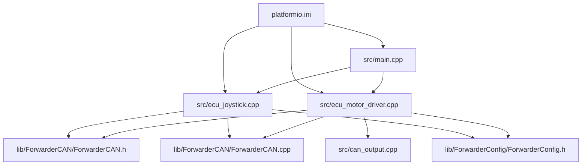
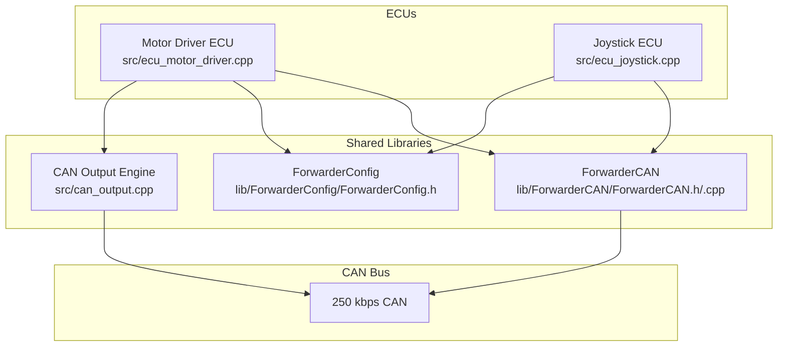
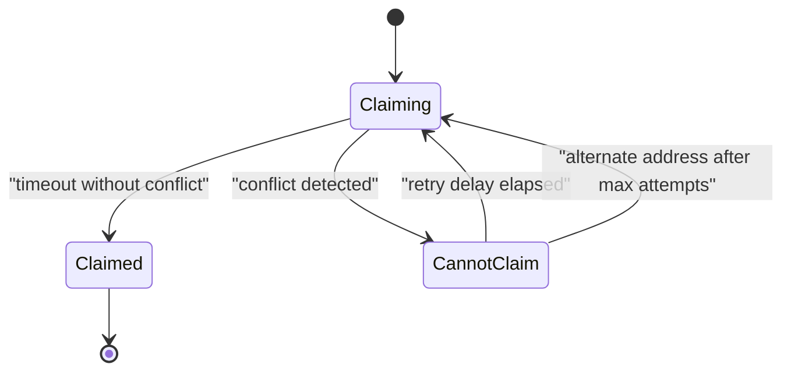
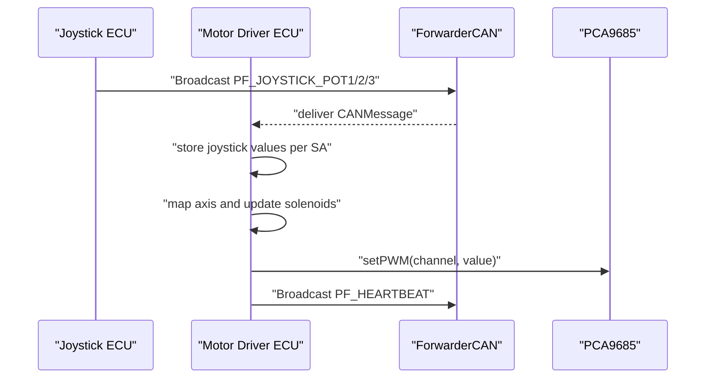
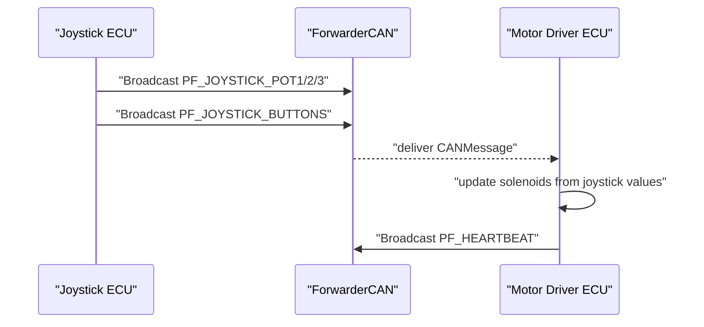
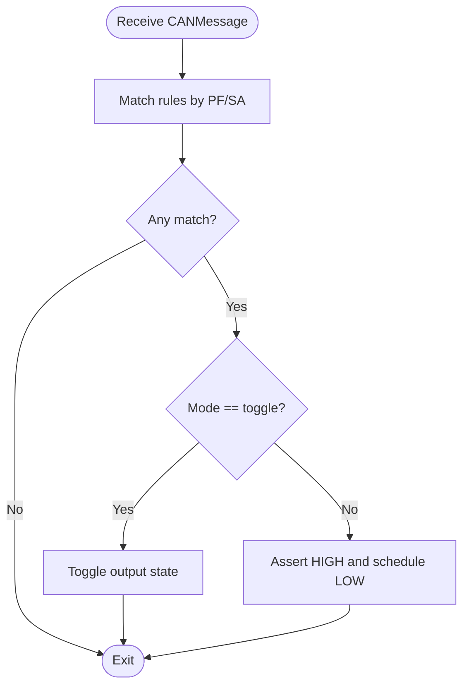
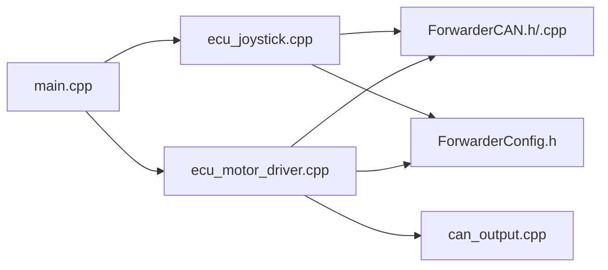

# Protocol Extensions and Customization

<cite>
**Referenced Files in This Document**
- [README.md](file://README.md)
- [platformio.ini](file://platformio.ini)
- [src/main.cpp](file://src/main.cpp)
- [src/ecu_motor_driver.cpp](file://src/ecu_motor_driver.cpp)
- [src/ecu_joystick.cpp](file://src/ecu_joystick.cpp)
- [src/can_output.cpp](file://src/can_output.cpp)
- [src/can_output.h](file://src/can_output.h)
- [lib/ForwarderCAN/ForwarderCAN.h](file://lib/ForwarderCAN/ForwarderCAN.h)
- [lib/ForwarderCAN/ForwarderCAN.cpp](file://lib/ForwarderCAN/ForwarderCAN.cpp)
- [lib/ForwarderConfig/ForwarderConfig.h](file://lib/ForwarderConfig/ForwarderConfig.h)
</cite>

## Table of Contents
1. [Introduction](#introduction)
2. [Project Structure](#project-structure)
3. [Core Components](#core-components)
4. [Architecture Overview](#architecture-overview)
5. [Detailed Component Analysis](#detailed-component-analysis)
6. [Dependency Analysis](#dependency-analysis)
7. [Performance Considerations](#performance-considerations)
8. [Troubleshooting Guide](#troubleshooting-guide)
9. [Conclusion](#conclusion)
10. [Appendices](#appendices)

## Introduction
This document explains how to extend and customize the J1939-like CAN protocol used by ForwarderKE. It covers defining new parameter group numbers (PGNs), message formats, addressing schemes, and destination addressing. It also provides step-by-step guidance for adding new CAN message handlers, implementing custom ECU types, and extending the address claiming mechanism. Examples illustrate enhancing the protocol to support additional sensors, actuators, or control signals. Backward compatibility and migration strategies for existing deployments are addressed.

## Project Structure
ForwarderKE organizes the protocol and ECU logic across shared libraries and per-ECU source files. The protocol is defined in a shared library, while ECU-specific logic resides in separate modules. Build environments define compile-time flags that select ECU type and address preferences.

**Diagram sources**
- [src/main.cpp:1-32](file://src/main.cpp#L1-L32)
- [src/ecu_motor_driver.cpp:1-355](file://src/ecu_motor_driver.cpp#L1-L355)
- [src/ecu_joystick.cpp:1-239](file://src/ecu_joystick.cpp#L1-L239)
- [lib/ForwarderCAN/ForwarderCAN.h:1-120](file://lib/ForwarderCAN/ForwarderCAN.h#L1-L120)
- [lib/ForwarderCAN/ForwarderCAN.cpp:1-198](file://lib/ForwarderCAN/ForwarderCAN.cpp#L1-L198)
- [lib/ForwarderConfig/ForwarderConfig.h:1-92](file://lib/ForwarderConfig/ForwarderConfig.h#L1-L92)
- [src/can_output.cpp:1-66](file://src/can_output.cpp#L1-L66)
- [platformio.ini:1-80](file://platformio.ini#L1-L80)

**Section sources**
- [README.md:112-126](file://README.md#L112-L126)
- [platformio.ini:1-80](file://platformio.ini#L1-L80)
- [src/main.cpp:1-32](file://src/main.cpp#L1-L32)

## Core Components
- Protocol definition and ID packing/unpacking are centralized in the ForwarderCAN library. It defines J1939-like bitfields, macros for building IDs, and constants for PF values used by the system.
- ECU implementations (motor driver and joystick) use ForwarderCAN to send/receive messages and implement their own handler logic.
- ForwarderConfig manages persistent configuration such as forced addresses, axis mappings, and CAN-triggered GPIO output rules.
- CAN output module provides a generic rule engine to trigger GPIO pins based on matching PF/SA criteria.

Key protocol elements:
- Priority bits: 3 bits (bits 28-26)
- Data Page (DP): 1 bit (bit 24)
- PDU Format (PF): 8 bits (bits 23-16)
- PDU Specific (PS): 8 bits (bits 15-8), equals Destination Address for PF < 240
- Source Address (SA): 8 bits (bits 7-0)
- Broadcast Destination Address: 0xFF

**Section sources**
- [lib/ForwarderCAN/ForwarderCAN.h:6-34](file://lib/ForwarderCAN/ForwarderCAN.h#L6-L34)
- [lib/ForwarderCAN/ForwarderCAN.h:35-51](file://lib/ForwarderCAN/ForwarderCAN.h#L35-L51)
- [lib/ForwarderCAN/ForwarderCAN.h:59-64](file://lib/ForwarderCAN/ForwarderCAN.h#L59-L64)
- [lib/ForwarderCAN/ForwarderCAN.h:17-33](file://lib/ForwarderCAN/ForwarderCAN.h#L17-L33)
- [lib/ForwarderCAN/ForwarderCAN.cpp:144-171](file://lib/ForwarderCAN/ForwarderCAN.cpp#L144-L171)
- [lib/ForwarderConfig/ForwarderConfig.h:28-39](file://lib/ForwarderConfig/ForwarderConfig.h#L28-L39)
- [lib/ForwarderConfig/ForwarderConfig.h:41-57](file://lib/ForwarderConfig/ForwarderConfig.h#L41-L57)

## Architecture Overview
The system uses a J1939-like 29-bit ID scheme with PF/PS addressing semantics. Address claiming enforces uniqueness and prevents conflicts. ECU modules implement PF-specific handlers and optional broadcast processing.

**Diagram sources**
- [src/ecu_motor_driver.cpp:1-355](file://src/ecu_motor_driver.cpp#L1-L355)
- [src/ecu_joystick.cpp:1-239](file://src/ecu_joystick.cpp#L1-L239)
- [lib/ForwarderCAN/ForwarderCAN.h:1-120](file://lib/ForwarderCAN/ForwarderCAN.h#L1-L120)
- [lib/ForwarderCAN/ForwarderCAN.cpp:1-198](file://lib/ForwarderCAN/ForwarderCAN.cpp#L1-L198)
- [lib/ForwarderConfig/ForwarderConfig.h:1-92](file://lib/ForwarderConfig/ForwarderConfig.h#L1-L92)
- [src/can_output.cpp:1-66](file://src/can_output.cpp#L1-L66)

## Detailed Component Analysis

### Protocol Definition and Addressing
- ID layout and bitfield extraction macros define Priority, DP, PF, PS, and SA.
- PF constants enumerate supported message families (joystick, LED, solenoid, heartbeat, etc.).
- Broadcast destination is 0xFF; special source addresses include 0xFE and 0xFF.
- Address claiming uses PF 0xEE for “Address Claimed” and PF 0xEA for “Request Address Claimed.”

Implementation highlights:
- ID construction macro and getters for PF/PS/SA.
- PF constants for custom families (e.g., PF_IDENTIFY, PF_SET_ADDRESS, PF_CONFIG_AXIS, PF_REQUEST_CONFIG, PF_CONFIG_RESPONSE).
- Broadcast helper for sending to DA 0xFF.

**Section sources**
- [lib/ForwarderCAN/ForwarderCAN.h:6-34](file://lib/ForwarderCAN/ForwarderCAN.h#L6-L34)
- [lib/ForwarderCAN/ForwarderCAN.h:35-51](file://lib/ForwarderCAN/ForwarderCAN.h#L35-L51)
- [lib/ForwarderCAN/ForwarderCAN.h:52-57](file://lib/ForwarderCAN/ForwarderCAN.h#L52-L57)
- [lib/ForwarderCAN/ForwarderCAN.cpp:63-77](file://lib/ForwarderCAN/ForwarderCAN.cpp#L63-L77)
- [lib/ForwarderCAN/ForwarderCAN.cpp:121-142](file://lib/ForwarderCAN/ForwarderCAN.cpp#L121-L142)

### Address Claiming Mechanism
The address claiming state machine:
- Claims preferred address and sends “Address Claimed.”
- Waits for timeout; if no conflicting claimant appears, the address is confirmed.
- If another device claims the same address, arbitration compares NAME arrays; lower NAME wins.
- On loss, retries up to a limit or switches to an alternate derived address.

**Diagram sources**
- [lib/ForwarderCAN/ForwarderCAN.cpp:54-61](file://lib/ForwarderCAN/ForwarderCAN.cpp#L54-L61)
- [lib/ForwarderCAN/ForwarderCAN.cpp:91-109](file://lib/ForwarderCAN/ForwarderCAN.cpp#L91-L109)
- [lib/ForwarderCAN/ForwarderCAN.cpp:121-142](file://lib/ForwarderCAN/ForwarderCAN.cpp#L121-L142)

**Section sources**
- [lib/ForwarderCAN/ForwarderCAN.cpp:54-119](file://lib/ForwarderCAN/ForwarderCAN.cpp#L54-L119)

### Motor Driver ECU: Handlers and Routing
The motor driver processes PF families and routes data:
- Joystick potentiometer updates stored per-SA for axis mapping.
- Solenoid commands apply scaled PWM values to PCA9685 channels.
- LED color and identify commands adjust onboard LED.
- Address change requests persist and reboot.
- Axis configuration can be updated via CAN and persisted.
- Heartbeat broadcasts operational status.
- CAN output rules can trigger GPIO pins based on matched PF/SA.

**Diagram sources**
- [src/ecu_motor_driver.cpp:184-275](file://src/ecu_motor_driver.cpp#L184-L275)
- [src/ecu_motor_driver.cpp:137-151](file://src/ecu_motor_driver.cpp#L137-L151)
- [src/ecu_motor_driver.cpp:277-288](file://src/ecu_motor_driver.cpp#L277-L288)

**Section sources**
- [src/ecu_motor_driver.cpp:184-275](file://src/ecu_motor_driver.cpp#L184-L275)
- [src/ecu_motor_driver.cpp:137-151](file://src/ecu_motor_driver.cpp#L137-L151)
- [src/ecu_motor_driver.cpp:277-288](file://src/ecu_motor_driver.cpp#L277-L288)

### Joystick ECU: Handlers and Routing
The joystick ECU:
- Reads analog pots and buttons, periodically broadcasting PF_JOYSTICK_POT1/2/3 and button state.
- Responds to LED color, identify, and address change commands.
- Sends heartbeat with online status and counters.

**Diagram sources**
- [src/ecu_joystick.cpp:99-112](file://src/ecu_joystick.cpp#L99-L112)
- [src/ecu_joystick.cpp:114-144](file://src/ecu_joystick.cpp#L114-L144)
- [src/ecu_joystick.cpp:146-157](file://src/ecu_joystick.cpp#L146-L157)

**Section sources**
- [src/ecu_joystick.cpp:99-112](file://src/ecu_joystick.cpp#L99-L112)
- [src/ecu_joystick.cpp:114-144](file://src/ecu_joystick.cpp#L114-L144)
- [src/ecu_joystick.cpp:146-157](file://src/ecu_joystick.cpp#L146-L157)

### CAN Output Engine: Rule-Based GPIO Control
The CAN output engine applies configurable rules to trigger GPIO pins:
- Rules specify PF match, optional SA match, target GPIO pin, mode (toggle or momentary), and momentary duration.
- Matching triggers either toggling current state or momentarily asserting HIGH.
- A periodic loop resets momentary outputs after their timeout.

**Diagram sources**
- [src/can_output.cpp:29-49](file://src/can_output.cpp#L29-L49)
- [src/can_output.cpp:51-61](file://src/can_output.cpp#L51-L61)

**Section sources**
- [src/can_output.cpp:1-66](file://src/can_output.cpp#L1-L66)
- [lib/ForwarderConfig/ForwarderConfig.h:28-39](file://lib/ForwarderConfig/ForwarderConfig.h#L28-L39)

### Adding New CAN Message Handlers
Steps to add a new PF family:
1. Choose a new PF value:
   - PF < 240: PS is Destination Address; suitable for directed messages.
   - PF >= 240: PS is Group Extension; typically used for global/group operations.
   Define the constant in the ForwarderCAN header.
2. Decide payload format and length (<= 8 bytes).
3. Add a case in the receiving ECU’s handler switch to process the PF.
4. If broadcast is intended, use the broadcast send helper; otherwise, construct with destination address.
5. Update any configuration flows (e.g., request/response pairs) if applicable.

Example scenarios:
- Additional sensors: Define PF_SENSOR_DATA with payload fields for sensor readings; broadcast from sensor ECU to controllers.
- Actuators: Define PF_ACTUATOR_CMD with actuator index and command; controller applies to hardware.
- Control signals: Define PF_CONTROL_SIGNAL with flags or thresholds; receivers interpret and act accordingly.

**Section sources**
- [lib/ForwarderCAN/ForwarderCAN.h:35-51](file://lib/ForwarderCAN/ForwarderCAN.h#L35-L51)
- [lib/ForwarderCAN/ForwarderCAN.cpp:169-171](file://lib/ForwarderCAN/ForwarderCAN.cpp#L169-L171)
- [src/ecu_motor_driver.cpp:184-275](file://src/ecu_motor_driver.cpp#L184-L275)
- [src/ecu_joystick.cpp:114-144](file://src/ecu_joystick.cpp#L114-L144)

### Implementing Custom ECU Types
To add a new ECU type:
1. Create a new ECU module (header and implementation) mirroring existing patterns.
2. Implement setup and loop functions to initialize peripherals, configure ForwarderCAN, and handle message processing.
3. Add a new PlatformIO environment with appropriate build flags:
   - Select ECU type.
   - Set preferred address and any device-specific flags.
   - Configure pins and hardware options.
4. Integrate with main entry point by defining the ECU type and including the module header.

Reference examples:
- Motor driver ECU: initializes PCA9685, reads joystick values, maps axes, controls solenoids, and handles configuration.
- Joystick ECU: reads analog inputs and buttons, broadcasts joystick data, responds to LED/color and identify commands.

**Section sources**
- [platformio.ini:17-30](file://platformio.ini#L17-L30)
- [platformio.ini:31-61](file://platformio.ini#L31-L61)
- [src/main.cpp:11-17](file://src/main.cpp#L11-L17)
- [src/ecu_motor_driver.cpp:290-325](file://src/ecu_motor_driver.cpp#L290-L325)
- [src/ecu_joystick.cpp:159-192](file://src/ecu_joystick.cpp#L159-L192)

### Extending the Address Claiming Mechanism
To extend addressing:
- Keep PF values below 240 to leverage Destination Address semantics for PS.
- Reserve a contiguous block of addresses for new ECU types (e.g., 0x30–0x3F).
- Ensure each ECU sets a unique preferred address in its build environment.
- If conflicts occur during claiming, the arbitration logic will resolve by NAME comparison; choose NAME bytes to minimize collisions.

**Section sources**
- [lib/ForwarderCAN/ForwarderCAN.cpp:121-142](file://lib/ForwarderCAN/ForwarderCAN.cpp#L121-L142)
- [platformio.ini:17-30](file://platformio.ini#L17-L30)
- [platformio.ini:31-61](file://platformio.ini#L31-L61)

### Protocol Enhancement Scenarios
Examples of enhancements:
- Sensor telemetry: Define PF_SENSOR_TEMP/HUMIDITY with 2-byte values; broadcast from sensor ECUs; controllers log/store or trigger alerts.
- Actuator control: Define PF_ACTUATOR_VALVE with index and position; controllers apply to PWM or solenoids.
- Diagnostic/status: Define PF_DIAG_STATUS with flags and counters; broadcast health metrics.

Routing and addressing:
- PF values map to functional domains; PS carries destination address for PF < 240.
- Broadcast messages use DA 0xFF; targeted messages use specific DA.
- PF 0xEE and 0xEA manage address claiming and discovery.

**Section sources**
- [lib/ForwarderCAN/ForwarderCAN.h:35-51](file://lib/ForwarderCAN/ForwarderCAN.h#L35-L51)
- [lib/ForwarderCAN/ForwarderCAN.h:52-57](file://lib/ForwarderCAN/ForwarderCAN.h#L52-L57)
- [src/ecu_motor_driver.cpp:184-275](file://src/ecu_motor_driver.cpp#L184-L275)

### Backward Compatibility and Migration Strategies
Guidance for extending the protocol without breaking existing deployments:
- Use PF values below 240 for directed messages to preserve PS-as-Destination semantics.
- Avoid reusing existing PF values for different semantics; introduce new PFs for new functions.
- Keep payloads ≤ 8 bytes; if larger data is needed, split across multiple frames or introduce a request/response pair (e.g., request/config/response).
- Maintain NAME-based address arbitration; ensure NAME bytes are set to reduce collision probability.
- Provide migration paths:
  - Add new PFs alongside existing ones.
  - Implement request/response pairs for configuration to avoid breaking older devices.
  - Use heartbeat messages to advertise supported PF families for discovery.

**Section sources**
- [lib/ForwarderCAN/ForwarderCAN.h:35-51](file://lib/ForwarderCAN/ForwarderCAN.h#L35-L51)
- [lib/ForwarderCAN/ForwarderCAN.cpp:121-142](file://lib/ForwarderCAN/ForwarderCAN.cpp#L121-L142)
- [src/ecu_motor_driver.cpp:257-267](file://src/ecu_motor_driver.cpp#L257-L267)

## Dependency Analysis
The ECU modules depend on ForwarderCAN for ID packing/unpacking and transport, and on ForwarderConfig for persistent storage. The motor driver also integrates the CAN output engine.

**Diagram sources**
- [src/ecu_joystick.cpp:1-239](file://src/ecu_joystick.cpp#L1-L239)
- [src/ecu_motor_driver.cpp:1-355](file://src/ecu_motor_driver.cpp#L1-L355)
- [lib/ForwarderCAN/ForwarderCAN.h:1-120](file://lib/ForwarderCAN/ForwarderCAN.h#L1-L120)
- [lib/ForwarderCAN/ForwarderCAN.cpp:1-198](file://lib/ForwarderCAN/ForwarderCAN.cpp#L1-L198)
- [lib/ForwarderConfig/ForwarderConfig.h:1-92](file://lib/ForwarderConfig/ForwarderConfig.h#L1-L92)
- [src/can_output.cpp:1-66](file://src/can_output.cpp#L1-L66)
- [src/main.cpp:1-32](file://src/main.cpp#L1-L32)

**Section sources**
- [src/ecu_joystick.cpp:1-239](file://src/ecu_joystick.cpp#L1-L239)
- [src/ecu_motor_driver.cpp:1-355](file://src/ecu_motor_driver.cpp#L1-L355)
- [lib/ForwarderCAN/ForwarderCAN.h:1-120](file://lib/ForwarderCAN/ForwarderCAN.h#L1-L120)
- [lib/ForwarderConfig/ForwarderConfig.h:1-92](file://lib/ForwarderConfig/ForwarderConfig.h#L1-L92)
- [src/can_output.cpp:1-66](file://src/can_output.cpp#L1-L66)
- [src/main.cpp:1-32](file://src/main.cpp#L1-L32)

## Performance Considerations
- Keep PF/PS handling lightweight; avoid heavy computations inside receive loops.
- Use broadcast sparingly; targeted messages reduce bus load.
- Batch updates where possible (e.g., joystick values) to minimize transmission frequency.
- Respect safety timeouts to prevent stale actuator states.

## Troubleshooting Guide
Common issues and remedies:
- Address conflicts during claiming:
  - Verify NAME uniqueness and preferred address selection.
  - Monitor serial logs for claim attempts and arbitration outcomes.
- Bus-off conditions:
  - The driver recovers automatically; monitor error counts and restart if necessary.
- Stuck solenoids:
  - Confirm heartbeat presence and safety timeout behavior; ensure joystick updates are recent.
- OTA updates:
  - Use the provided environments to enable the web server and upload binaries.

**Section sources**
- [lib/ForwarderCAN/ForwarderCAN.cpp:82-89](file://lib/ForwarderCAN/ForwarderCAN.cpp#L82-L89)
- [lib/ForwarderCAN/ForwarderCAN.cpp:91-109](file://lib/ForwarderCAN/ForwarderCAN.cpp#L91-L109)
- [src/ecu_motor_driver.cpp:332-337](file://src/ecu_motor_driver.cpp#L332-L337)
- [platformio.ini:63-80](file://platformio.ini#L63-L80)

## Conclusion
ForwarderKE’s J1939-like protocol provides a robust foundation for extending CAN-based control systems. By selecting appropriate PF values, preserving PS-as-Destination semantics for PF < 240, and leveraging the address claiming mechanism, developers can safely introduce new sensors, actuators, and control signals. The modular architecture and configuration persistence enable incremental enhancements with strong backward compatibility.

## Appendices

### Protocol Reference Summary
- Priority: 3 bits
- DP: 1 bit
- PF: 8 bits
- PS: 8 bits (Destination Address for PF < 240)
- SA: 8 bits
- Broadcast DA: 0xFF
- Address claiming PF: 0xEE (claimed), 0xEA (request)

**Section sources**
- [lib/ForwarderCAN/ForwarderCAN.h:6-34](file://lib/ForwarderCAN/ForwarderCAN.h#L6-L34)
- [lib/ForwarderCAN/ForwarderCAN.h:35-51](file://lib/ForwarderCAN/ForwarderCAN.h#L35-L51)
- [lib/ForwarderCAN/ForwarderCAN.h:52-57](file://lib/ForwarderCAN/ForwarderCAN.h#L52-L57)