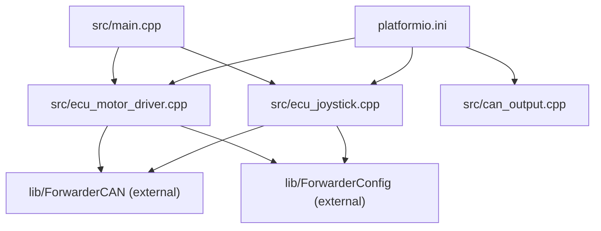
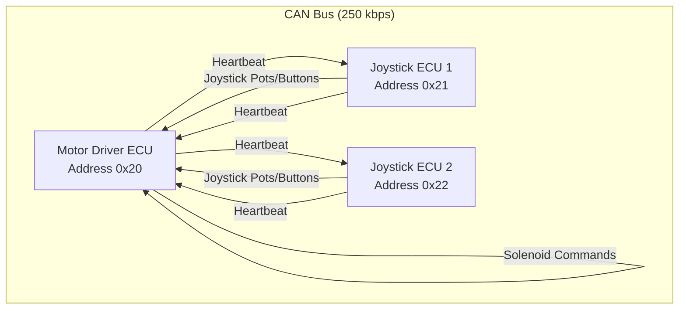
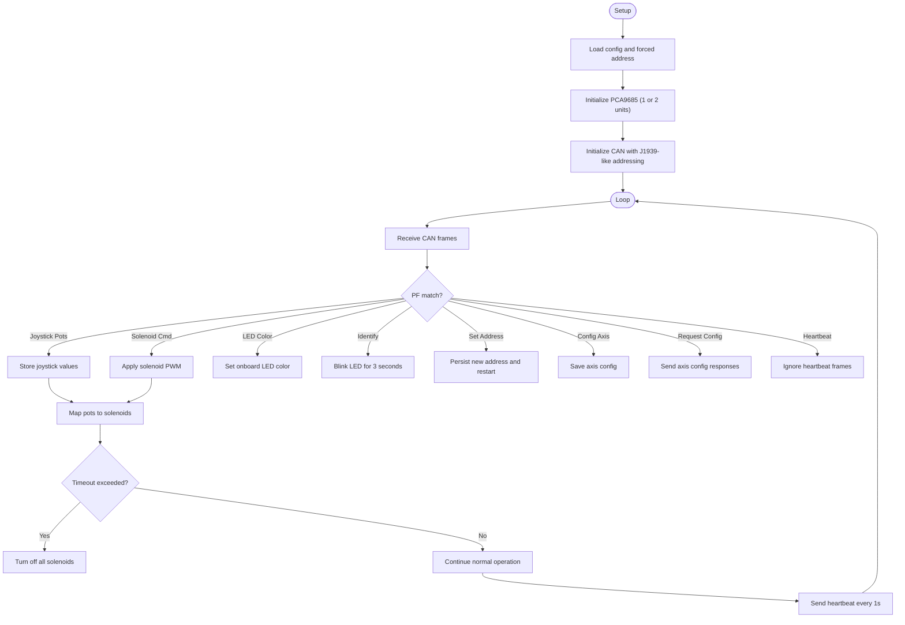
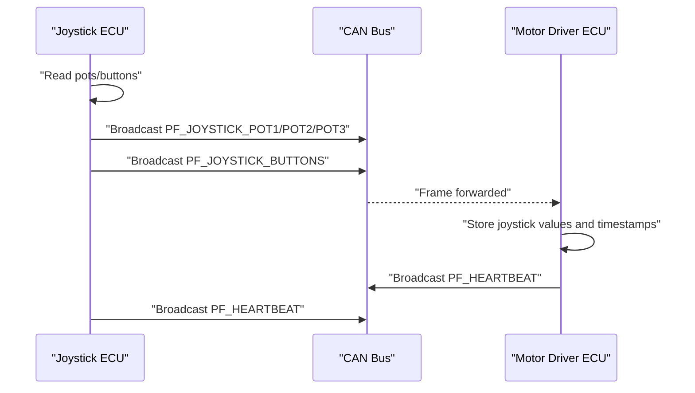
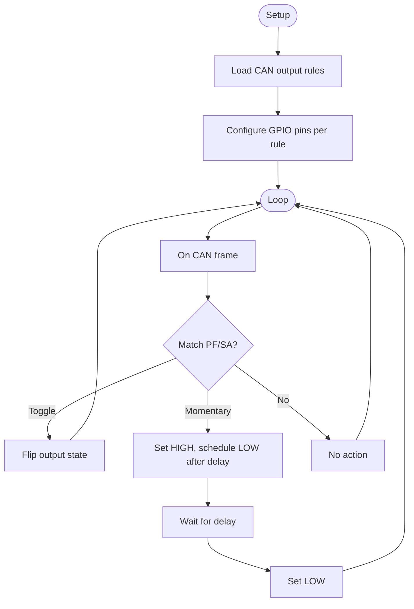
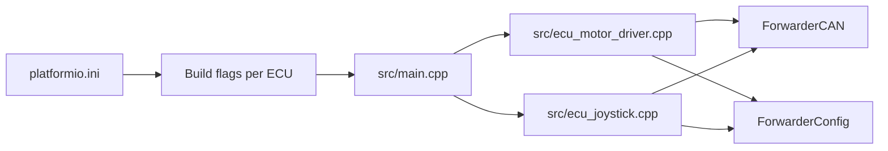

# System Integration and Deployment

<cite>
**Referenced Files in This Document**
- [README.md](file://README.md)
- [platformio.ini](file://platformio.ini)
- [src/main.cpp](file://src/main.cpp)
- [src/ecu_motor_driver.cpp](file://src/ecu_motor_driver.cpp)
- [src/ecu_motor_driver.h](file://src/ecu_motor_driver.h)
- [src/ecu_joystick.cpp](file://src/ecu_joystick.cpp)
- [src/ecu_joystick.h](file://src/ecu_joystick.h)
- [src/can_output.cpp](file://src/can_output.cpp)
- [src/can_output.h](file://src/can_output.h)
</cite>

## Table of Contents
1. [Introduction](#introduction)
2. [Project Structure](#project-structure)
3. [Core Components](#core-components)
4. [Architecture Overview](#architecture-overview)
5. [Detailed Component Analysis](#detailed-component-analysis)
6. [Dependency Analysis](#dependency-analysis)
7. [Performance Considerations](#performance-considerations)
8. [Troubleshooting Guide](#troubleshooting-guide)
9. [Conclusion](#conclusion)
10. [Appendices](#appendices)

## Introduction
This document provides system integration and deployment guidance for ForwarderKE, an ESP32-S3-based CAN bus control system designed to replace a factory controller in a forwarder (logging machine) hydraulic valve block. It covers multi-machine coordination, centralized control, and integration with external monitoring platforms. It also documents large-scale deployment strategies, CAN bus architecture planning, signal integrity requirements, OEM controller replacement and retrofit scenarios, hybrid operation, monitoring and diagnostics, remote access, logging, fault detection, scalability, and professional installation checklists and best practices.

## Project Structure
ForwarderKE is organized around a small set of source files and a shared library for CAN/J1939 messaging. The build system uses PlatformIO environments to compile distinct ECU roles (motor driver, joystick 1, joystick 2) and optional OTA-enabled variants.

**Diagram sources**
- [src/main.cpp:1-32](file://src/main.cpp#L1-L32)
- [src/ecu_motor_driver.cpp:1-355](file://src/ecu_motor_driver.cpp#L1-L355)
- [src/ecu_joystick.cpp:1-239](file://src/ecu_joystick.cpp#L1-L239)
- [platformio.ini:1-80](file://platformio.ini#L1-L80)

**Section sources**
- [README.md:112-126](file2.md#L112-L126)
- [platformio.ini:1-80](file://platformio.ini#L1-L80)

## Core Components
- ECU Types
  - Motor Driver ECU: Controls up to 16 solenoids via PCA9685 PWM expansion, onboard LED status, heartbeat broadcasting, and safety timeout.
  - Joystick ECUs: Read three pots plus two buttons, publish joystick data and button states to the CAN bus, and support LED color updates and identification.
- CAN Protocol
  - Uses 29-bit extended IDs with J1939-style layout and 250 kbps bitrate.
  - Defines PF/PS addressing for joystick data, solenoid commands, LED control, heartbeat/status, and address claim/request.
- Build and Flashing
  - PlatformIO environments per ECU type; OTA builds include a Wi-Fi AP and web upload interface.
- Safety and Diagnostics
  - Address claiming, bus-off recovery, heartbeat, solenoid timeout, and LED status indicators.

**Section sources**
- [README.md:8-46](file://README.md#L8-L46)
- [README.md:105-111](file://README.md#L105-L111)
- [platformio.ini:17-62](file://platformio.ini#L17-L62)
- [src/ecu_motor_driver.cpp:290-325](file://src/ecu_motor_driver.cpp#L290-L325)
- [src/ecu_joystick.cpp:159-192](file://src/ecu_joystick.cpp#L159-L192)

## Architecture Overview
The system comprises three ECUs on a single 250 kbps CAN bus:
- Motor Driver ECU (address 0x20): Receives joystick inputs and solenoid commands, controls PCA9685 channels, and broadcasts heartbeat.
- Joystick ECU 1 (address 0x21): Publishes joystick pot and button data; supports LED color and identification.
- Joystick ECU 2 (address 0x22): Mirrors joystick 1 behavior for dual operator stations.

**Diagram sources**
- [README.md:10-14](file://README.md#L10-L14)
- [src/ecu_motor_driver.cpp:184-275](file://src/ecu_motor_driver.cpp#L184-L275)
- [src/ecu_joystick.cpp:114-144](file://src/ecu_joystick.cpp#L114-L144)

## Detailed Component Analysis

### Motor Driver ECU
Responsibilities:
- Initialize PCA9685 (one or two units), manage solenoid outputs, and enforce safety timeout.
- Receive joystick data and map to solenoid duty cycles with deadband/bidirectional logic.
- Respond to LED color, identify, set address, configure axes, and request configuration messages.
- Broadcast heartbeat with online status, uptime, counters, and hardware info.

Key implementation patterns:
- PWM mapping and PCA9685 channel control.
- CAN receive loop with PF/PS dispatch and state updates.
- Heartbeat payload composition and periodic transmission.
- Optional OTA web server for firmware updates.

**Diagram sources**
- [src/ecu_motor_driver.cpp:290-352](file://src/ecu_motor_driver.cpp#L290-L352)
- [src/ecu_motor_driver.cpp:184-275](file://src/ecu_motor_driver.cpp#L184-L275)
- [src/ecu_motor_driver.cpp:101-151](file://src/ecu_motor_driver.cpp#L101-L151)

**Section sources**
- [src/ecu_motor_driver.cpp:1-355](file://src/ecu_motor_driver.cpp#L1-L355)

### Joystick ECU
Responsibilities:
- Read three pots and two buttons with hysteresis and periodic broadcast.
- Respond to LED color, identify, and set address requests.
- Broadcast heartbeat with joystick ID and counters.

**Diagram sources**
- [src/ecu_joystick.cpp:194-236](file://src/ecu_joystick.cpp#L194-L236)
- [src/ecu_motor_driver.cpp:184-204](file://src/ecu_motor_driver.cpp#L184-L204)

**Section sources**
- [src/ecu_joystick.cpp:1-239](file://src/ecu_joystick.cpp#L1-L239)

### CAN Output Expansion (GPIO Rules)
The CAN output module translates incoming CAN frames into GPIO outputs for external devices. It supports toggle and momentary modes with configurable timing.

**Diagram sources**
- [src/can_output.cpp:7-61](file://src/can_output.cpp#L7-L61)

**Section sources**
- [src/can_output.cpp:1-66](file://src/can_output.cpp#L1-L66)

## Dependency Analysis
- Build-time selection: The main entry chooses the ECU implementation via build flags.
- Runtime libraries: ForwarderCAN and ForwarderConfig are referenced but not included in this repository snapshot; they provide J1939-like addressing, message framing, and persistent configuration storage.
- Hardware pins: Each environment defines MCU pins for CAN TX/RX, optional SE, PCA9685 I2C, LEDs, and joystick inputs.

**Diagram sources**
- [platformio.ini:17-62](file://platformio.ini#L17-L62)
- [src/main.cpp:11-17](file://src/main.cpp#L11-L17)
- [src/ecu_motor_driver.cpp:5-12](file://src/ecu_motor_driver.cpp#L5-L12)
- [src/ecu_joystick.cpp:5-9](file://src/ecu_joystick.cpp#L5-L9)

**Section sources**
- [platformio.ini:1-80](file://platformio.ini#L1-L80)
- [src/main.cpp:1-32](file://src/main.cpp#L1-L32)

## Performance Considerations
- CAN Bitrate and Timing
  - 250 kbps bitrate is suitable for short-haul agricultural wiring; ensure bus length and termination meet J1939 guidelines to avoid reflections and noise.
  - Heartbeat interval is 1 second; keep message rates balanced to prevent bus saturation.
- PWM and PCA9685
  - PCA9685 frequency and oscillator tuning are configured during initialization; verify I2C wiring and pull-ups for reliable multi-device operation.
- Watchdog and Safety
  - A 500 ms solenoid timeout safely de-energizes valves if no command is received; tune this for your application’s expected control loops.
- OTA and Network
  - OTA builds enable wireless firmware updates; ensure secure deployment and controlled access in production environments.

[No sources needed since this section provides general guidance]

## Troubleshooting Guide
Common issues and resolutions:
- CAN Initialization Failure
  - Symptoms: Repeated red LED blink pattern on startup.
  - Actions: Verify CAN wiring, pins, and bus termination; confirm 250 kbps bitrate; check for bus-off recovery.
- No Joystick Response
  - Symptoms: Motor driver not actuating solenoids.
  - Actions: Confirm joystick addresses and PF/PS values; verify heartbeat reception; check solenoid mapping and deadband configuration.
- Solenoid Timeout Off
  - Symptoms: Sudden solenoid de-energization.
  - Actions: Reduce SAFETY_TIMEOUT_MS if legitimate long gaps occur; otherwise investigate communication gaps.
- LED Indicators
  - Blue glow: Normal operation; white blinking: Identification mode; red blinking: CAN offline; fast yellow blinking: recent joystick activity.
- OTA Firmware Upload
  - Steps: Connect to AP, open local web UI, upload firmware binary; verify device reboots with new address in hostname.

**Section sources**
- [src/ecu_motor_driver.cpp:306-316](file://src/ecu_motor_driver.cpp#L306-L316)
- [src/ecu_motor_driver.cpp:153-182](file://src/ecu_motor_driver.cpp#L153-L182)
- [src/ecu_joystick.cpp:175-185](file://src/ecu_joystick.cpp#L175-L185)
- [src/ecu_joystick.cpp:88-97](file://src/ecu_joystick.cpp#L88-L97)
- [README.md:84-103](file://README.md#L84-L103)

## Conclusion
ForwarderKE offers a modular, J1939-like CAN architecture for forwarder control with clear separation between joystick input and motor output ECUs. Its OTA capability, heartbeat diagnostics, and safety timeout make it suitable for professional deployments. The provided CAN output rules enable integration with external devices. For large-scale operations, plan CAN topology carefully, maintain signal integrity, and leverage OTA for maintenance.

[No sources needed since this section summarizes without analyzing specific files]

## Appendices

### A. Multi-Machine Coordination and Centralized Control
- Topology
  - Single 250 kbps CAN bus with three primary ECUs; additional ECUs can be introduced with unique addresses within the 0x20–0xEF range.
  - Use address claiming and request frames to prevent conflicts; ensure only one device claims an address at a time.
- Centralized Control
  - A central gateway can monitor heartbeats, collect status, and issue LED/color commands for identification.
  - Implement a CAN output rule to trigger external relays or indicators based on heartbeat presence or error flags.
- Scalability
  - Add new ECU types by defining PF/PS semantics and extending the dispatch logic similarly to existing PF handlers.

**Section sources**
- [README.md:22-46](file://README.md#L22-L46)
- [src/ecu_motor_driver.cpp:184-275](file://src/ecu_motor_driver.cpp#L184-L275)

### B. Integration with External Monitoring Platforms
- GPS Systems
  - Use CAN output rules to activate a GPS power pin or wake-up signal upon heartbeat presence; log GPS lock status via heartbeat flags.
- Telemetry Modules
  - ForwarderCAN provides counters and online status; extend heartbeat payload to include telemetry-specific fields.
- Farm Management Software
  - Implement a gateway that subscribes to heartbeats and joystick frames; translate PF/PS data into application-specific events and logs.

**Section sources**
- [src/ecu_motor_driver.cpp:277-288](file://src/ecu_motor_driver.cpp#L277-L288)
- [src/ecu_joystick.cpp:146-157](file://src/ecu_joystick.cpp#L146-L157)

### C. Large-Scale Deployment Strategies
- Multiple Tractors and Implements
  - Assign unique preferred addresses per vehicle; use OTA to deploy and update firmware centrally.
  - Maintain separate CAN segments or use a gateway to isolate buses and bridge to Ethernet/Wi-Fi for centralized monitoring.
- Control Stations
  - Deploy multiple joystick ECUs for tandem operation; ensure distinct joystick IDs and PF assignments.
- Reliability in Harsh Environments
  - Use shielded CAN wiring, proper grounding, and terminal resistors at bus ends.
  - Minimize cable lengths and avoid routing near high-frequency interference sources.

[No sources needed since this section provides general guidance]

### D. CAN Bus Architecture Planning and Signal Integrity
- Extended ID Layout
  - Priority(3) | DP(1) | PF(8) | PS/DA(8) | SA(8)
  - Broadcast frames use DA=0xFF; addressed frames target specific SA.
- Message Definitions
  - PF_JOYSTICK_* for potentiometer and button data.
  - PF_SOLENOID_CMD for direct solenoid control.
  - PF_LED_COLOR and PF_IDENTIFY for diagnostics and operator feedback.
  - PF_HEARTBEAT for health monitoring.
- Termination and Wiring
  - Install 120 Ω terminators at both ends of the bus segment.
  - Use twisted pair wiring; keep differential impedance matched.

**Section sources**
- [README.md:22-46](file://README.md#L22-L46)

### E. OEM Controller Replacement and Retrofit Installations
- Replacement
  - Remove OEM controller and connect ForwarderCAN bus to OEM harness; ensure pinouts match CAN TX/RX and ground.
  - Program motor driver with solenoid-to-pot mappings; verify valve response.
- Retrofit
  - Install joystick ECUs at operator stations; wire pots/buttons according to pin definitions.
  - Use address claiming to avoid conflicts with existing OEM ECUs.

**Section sources**
- [README.md:16-21](file://README.md#L16-L21)
- [platformio.ini:31-62](file://platformio.ini#L31-L62)

### F. Hybrid System Operation
- Operate OEM controllers alongside ForwarderKE ECUs by ensuring address uniqueness and avoiding conflicting PF/PS assignments.
- Route OEM-specific signals via CAN output rules to external devices when required.

**Section sources**
- [README.md:44-46](file://README.md#L44-L46)

### G. System Monitoring and Diagnostics
- Remote Access
  - OTA builds enable Wi-Fi AP and web upload; use hostnames derived from addresses for device identification.
- Logging Mechanisms
  - Heartbeat frames carry uptime and counters; extend payloads for custom metrics.
- Fault Detection
  - CAN offline state triggers LED indication; watchdog timeout disables solenoids.

**Section sources**
- [README.md:84-103](file://README.md#L84-L103)
- [src/ecu_motor_driver.cpp:153-182](file://src/ecu_motor_driver.cpp#L153-L182)
- [src/ecu_motor_driver.cpp:332-337](file://src/ecu_motor_driver.cpp#L332-L337)

### H. Scaling to Additional ECU Types and Functionality
- New ECU Types
  - Define a new build environment with a unique preferred address and ECU name; implement setup/loop similar to existing ECUs.
- Extending Functionality
  - Add new PF/PS pairs for specialized commands; implement dispatch handlers and persistence where needed.
- CAN Output Rules
  - Use rules to drive external relays, lights, or sensors based on CAN frames.

**Section sources**
- [platformio.ini:17-62](file://platformio.ini#L17-L62)
- [src/can_output.cpp:29-49](file://src/can_output.cpp#L29-L49)

### I. Deployment Checklists and Commissioning Procedures
- Pre-Installation
  - Verify hardware compatibility and pin definitions for each environment.
  - Plan CAN topology, termination, and grounding.
- Flashing and OTA
  - Build and flash motor driver and joystick ECUs; enable OTA for remote updates.
- Addressing and Configuration
  - Confirm address claiming; program solenoid mappings and deadbands; test LED and identify functions.
- Validation
  - Verify heartbeat presence across all ECUs; test joystick-to-solenoid response and safety timeout.
- Ongoing Operations
  - Monitor LED status; use OTA for firmware updates; log heartbeat metrics for diagnostics.

**Section sources**
- [README.md:63-103](file://README.md#L63-L103)
- [platformio.ini:17-62](file://platformio.ini#L17-L62)