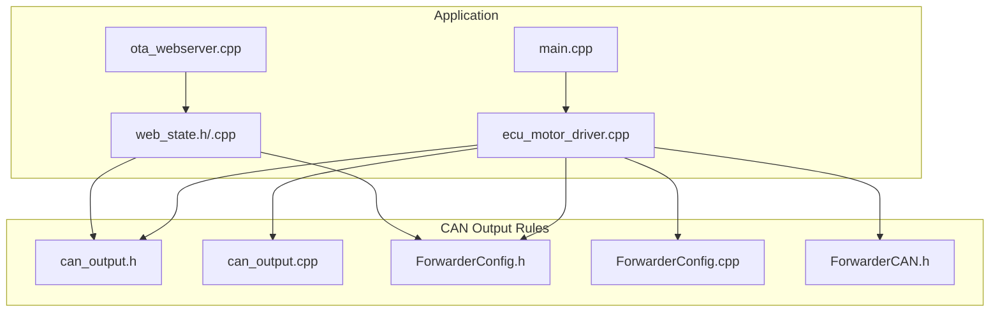
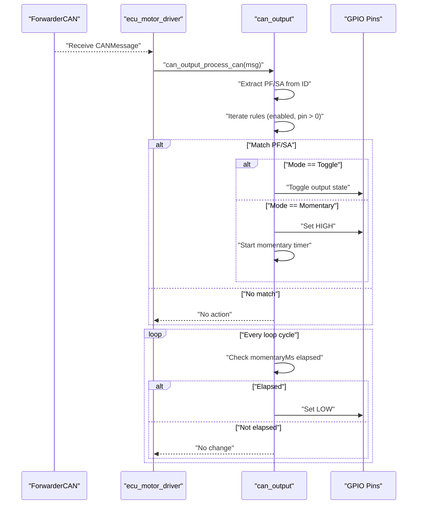
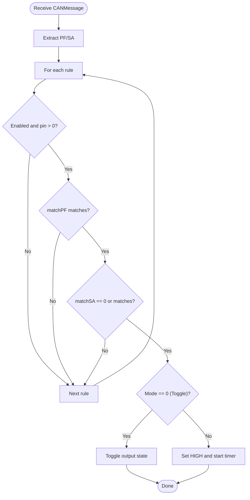
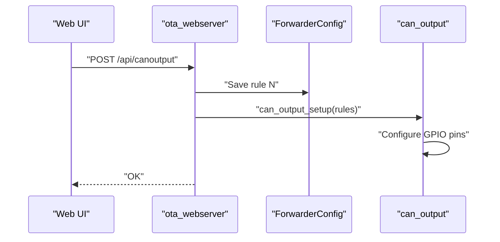
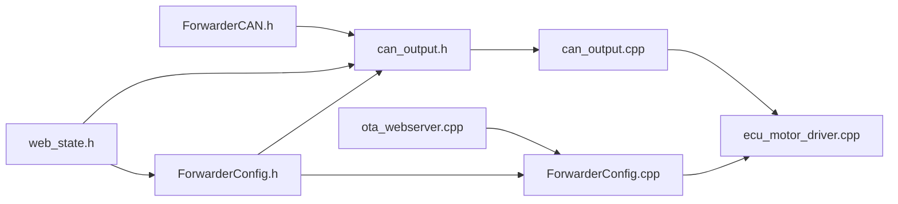

# CAN Output Rules

<cite>
**Referenced Files in This Document**
- [can_output.h](file://src/can_output.h)
- [can_output.cpp](file://src/can_output.cpp)
- [ForwarderConfig.h](file://lib/ForwarderConfig/ForwarderConfig.h)
- [ForwarderConfig.cpp](file://lib/ForwarderConfig/ForwarderConfig.cpp)
- [ForwarderCAN.h](file://lib/ForwarderCAN/ForwarderCAN.h)
- [ecu_motor_driver.cpp](file://src/ecu_motor_driver.cpp)
- [web_state.h](file://src/web_state.h)
- [web_state.cpp](file://src/web_state.cpp)
- [ota_webserver.cpp](file://src/ota_webserver.cpp)
- [main.cpp](file://src/main.cpp)
- [README.md](file://README.md)
</cite>

## Table of Contents
1. [Introduction](#introduction)
2. [Project Structure](#project-structure)
3. [Core Components](#core-components)
4. [Architecture Overview](#architecture-overview)
5. [Detailed Component Analysis](#detailed-component-analysis)
6. [Dependency Analysis](#dependency-analysis)
7. [Performance Considerations](#performance-considerations)
8. [Troubleshooting Guide](#troubleshooting-guide)
9. [Conclusion](#conclusion)
10. [Appendices](#appendices)

## Introduction
This document explains the CAN output rules system in ForwarderKE, focusing on how CAN messages trigger GPIO outputs and integrate with external devices such as indicator lights, alarms, or additional control systems. It covers the rule-based mechanism for toggling or momentary GPIO activation, the CanOutputRule data structure and configuration parameters, persistence to non-volatile storage, and the integration with the CAN bus and web-based configuration. Practical examples illustrate common scenarios, and guidance is provided for timing, safety, and troubleshooting.

## Project Structure
The CAN output rules feature spans several modules:
- Core rule engine: src/can_output.*
- Rule model and persistence: lib/ForwarderConfig/*
- CAN protocol helpers: lib/ForwarderCAN/*
- Motor driver integration: src/ecu_motor_driver.cpp
- Web UI and API: src/ota_webserver.cpp
- Global state exposure: src/web_state.*

**Diagram sources**
- [main.cpp:19-31](file://src/main.cpp#L19-L31)
- [ecu_motor_driver.cpp:290-352](file://src/ecu_motor_driver.cpp#L290-L352)
- [can_output.h:1-11](file://src/can_output.h#L1-L11)
- [can_output.cpp:1-66](file://src/can_output.cpp#L1-L66)
- [ForwarderConfig.h:26-39](file://lib/ForwarderConfig/ForwarderConfig.h#L26-L39)
- [ForwarderConfig.cpp:29-49](file://lib/ForwarderConfig/ForwarderConfig.cpp#L29-L49)
- [ForwarderCAN.h:29-33](file://lib/ForwarderCAN/ForwarderCAN.h#L29-L33)
- [ota_webserver.cpp:429-703](file://src/ota_webserver.cpp#L429-L703)
- [web_state.h:10-17](file://src/web_state.h#L10-L17)
- [web_state.cpp:12-13](file://src/web_state.cpp#L12-L13)

**Section sources**
- [README.md:112-126](file://README.md#L112-L126)
- [main.cpp:19-31](file://src/main.cpp#L19-L31)

## Core Components
- CanOutputRule: Defines a single rule with fields for enabling, matching criteria (PDU Format and Source Address), GPIO pin, operation mode, and momentary duration.
- Rule engine: Initializes GPIO pins, evaluates incoming CAN messages, toggles or pulses outputs, and manages momentary timers.
- Persistence: Stores and loads rules to/from non-volatile storage using a packed 8-byte format.
- Web API: Exposes endpoints to read/write rules and reinitialize outputs.

Key elements:
- Rule structure and constants: [ForwarderConfig.h:26-39](file://lib/ForwarderConfig/ForwarderConfig.h#L26-L39)
- Rule packing/unpacking: [ForwarderConfig.cpp:29-49](file://lib/ForwarderConfig/ForwarderConfig.cpp#L29-L49)
- Setup and initialization: [can_output.cpp:7-19](file://src/can_output.cpp#L7-L19)
- Evaluation and action: [can_output.cpp:29-49](file://src/can_output.cpp#L29-L49)
- Loop-driven momentary reset: [can_output.cpp:51-61](file://src/can_output.cpp#L51-L61)
- Web API handlers: [ota_webserver.cpp:659-703](file://src/ota_webserver.cpp#L659-L703)

**Section sources**
- [ForwarderConfig.h:26-39](file://lib/ForwarderConfig/ForwarderConfig.h#L26-L39)
- [ForwarderConfig.cpp:29-49](file://lib/ForwarderConfig/ForwarderConfig.cpp#L29-L49)
- [can_output.cpp:7-19](file://src/can_output.cpp#L7-L19)
- [can_output.cpp:29-49](file://src/can_output.cpp#L29-L49)
- [can_output.cpp:51-61](file://src/can_output.cpp#L51-L61)
- [ota_webserver.cpp:659-703](file://src/ota_webserver.cpp#L659-L703)

## Architecture Overview
The CAN output rules system integrates with the CAN bus and the motor driver ECU. Incoming CAN messages are decoded to extract PDU Format and Source Address. Matching rules trigger GPIO actions either immediately (toggle) or as a momentary pulse. A periodic loop resets momentary outputs after their configured duration.

**Diagram sources**
- [ForwarderCAN.h:29-33](file://lib/ForwarderCAN/ForwarderCAN.h#L29-L33)
- [ecu_motor_driver.cpp:184-190](file://src/ecu_motor_driver.cpp#L184-L190)
- [can_output.cpp:29-61](file://src/can_output.cpp#L29-L61)

## Detailed Component Analysis

### CanOutputRule Data Structure
The rule defines how a CAN message triggers a GPIO output. Fields include:
- enabled: Enable/disable the rule
- matchPF: PDU Format to match (required)
- matchSA: Source Address to match (0 means any)
- gpioPin: Target GPIO pin (0 disables)
- mode: 0 for toggle, 1 for momentary
- momentaryMs: Duration for momentary mode (milliseconds)

Persistence format:
- Pack/unpack stores 8 bytes: enabled, matchPF, matchSA, gpioPin, mode, momentaryMs LSB, momentaryMs MSB, reserved.

Integration points:
- Loaded during ECU setup: [ecu_motor_driver.cpp:300](file://src/ecu_motor_driver.cpp#L300)
- Saved via web API: [ForwarderConfig.cpp:161-169](file://lib/ForwarderConfig/ForwarderConfig.cpp#L161-L169)

**Section sources**
- [ForwarderConfig.h:26-39](file://lib/ForwarderConfig/ForwarderConfig.h#L26-L39)
- [ForwarderConfig.cpp:29-49](file://lib/ForwarderConfig/ForwarderConfig.cpp#L29-L49)
- [ForwarderConfig.cpp:129-169](file://lib/ForwarderConfig/ForwarderConfig.cpp#L129-L169)
- [ecu_motor_driver.cpp:300](file://src/ecu_motor_driver.cpp#L300)

### Rule Evaluation Logic
- Initialization: Configure GPIO pins for enabled rules and log configuration.
- Matching: Extract PF/SA from the incoming message ID and compare against each rule’s criteria.
- Action:
  - Toggle mode: flip current output state.
  - Momentary mode: set output HIGH and record start time.
- Momentary reset: On each loop, if mode is momentary and duration elapsed, set output LOW.

**Diagram sources**
- [ForwarderCAN.h:29-33](file://lib/ForwarderCAN/ForwarderCAN.h#L29-L33)
- [can_output.cpp:29-49](file://src/can_output.cpp#L29-L49)

**Section sources**
- [can_output.cpp:7-19](file://src/can_output.cpp#L7-L19)
- [can_output.cpp:29-49](file://src/can_output.cpp#L29-L49)
- [can_output.cpp:51-61](file://src/can_output.cpp#L51-L61)

### Timing and Safety Mechanisms
- Momentary timing: Uses millisecond-precision timers to reset outputs after the configured duration.
- Safety: The motor driver enforces a solenoid safety timeout; while not directly part of CAN output rules, it demonstrates the system’s emphasis on safe defaults and timeouts.
- Debouncing: There is no explicit debouncing for CAN-triggered events in the rule engine; repeated messages will trigger the rule according to its mode. If needed, implement application-level filters upstream of the rule engine.

**Section sources**
- [can_output.cpp:51-61](file://src/can_output.cpp#L51-L61)
- [README.md:105-111](file://README.md#L105-L111)

### External Device Integration
GPIO outputs can drive:
- Indicator lights (LEDs)
- Alarms (buzzer, relay)
- Additional control systems (relays, optoisolated drivers)

Integration steps:
- Assign a gpioPin to the rule.
- Choose mode:
  - Toggle for persistent state changes (e.g., “ON” light).
  - Momentary for short pulses (e.g., “flash” or “beep”).
- Optionally configure momentaryMs for pulse duration.

**Section sources**
- [ForwarderConfig.h:33-35](file://lib/ForwarderConfig/ForwarderConfig.h#L33-L35)
- [can_output.cpp:40-47](file://src/can_output.cpp#L40-L47)

### Persistence and Configuration
- Storage: Each rule is stored as an 8-byte packed value in non-volatile storage under keys like canout_0, canout_1, etc.
- Loading: During ECU setup, rules are loaded from NVS and applied to initialize GPIO outputs.
- Saving: Web API accepts rule updates and persists them to NVS, then reinitializes outputs.

**Diagram sources**
- [ota_webserver.cpp:677-703](file://src/ota_webserver.cpp#L677-L703)
- [ForwarderConfig.cpp:161-169](file://lib/ForwarderConfig/ForwarderConfig.cpp#L161-L169)
- [can_output.cpp:7-19](file://src/can_output.cpp#L7-L19)

**Section sources**
- [ForwarderConfig.cpp:129-169](file://lib/ForwarderConfig/ForwarderConfig.cpp#L129-L169)
- [ecu_motor_driver.cpp:300](file://src/ecu_motor_driver.cpp#L300)
- [ota_webserver.cpp:659-703](file://src/ota_webserver.cpp#L659-L703)

### Practical Examples
Below are common scenarios with recommended configurations. Replace placeholders with actual values for your deployment.

- Emergency stop indicator (momentary):
  - PF: PF from the emergency message (e.g., a dedicated PF)
  - SA: 0 (any) or a specific source address
  - gpioPin: GPIO connected to an LED or buzzer
  - mode: momentary
  - momentaryMs: 500–2000 ms depending on desired flash duration

- Operational status display (toggle):
  - PF: PF indicating operational state (e.g., heartbeat or status PF)
  - SA: 0 (any) or a specific ECU
  - gpioPin: GPIO driving an LED
  - mode: toggle
  - momentaryMs: ignored for toggle

- Diagnostic signaling (momentary):
  - PF: PF for diagnostics or fault indication
  - SA: 0 (any) or a specific source
  - gpioPin: GPIO to a buzzer or indicator
  - mode: momentary
  - momentaryMs: 250–1000 ms for short pulses

Notes:
- Ensure gpioPin is not shared with other functions.
- For toggle mode, repeated messages will alternate the output state.
- For momentary mode, each matched message starts a fresh pulse.

**Section sources**
- [ForwarderConfig.h:33-35](file://lib/ForwarderConfig/ForwarderConfig.h#L33-L35)
- [ForwarderCAN.h:38-50](file://lib/ForwarderCAN/ForwarderCAN.h#L38-L50)

## Dependency Analysis
The rule engine depends on:
- ForwarderCAN for ID parsing and message reception
- ForwarderConfig for rule persistence and loading
- Global state for sharing rules across modules

**Diagram sources**
- [ForwarderCAN.h:29-33](file://lib/ForwarderCAN/ForwarderCAN.h#L29-L33)
- [ForwarderConfig.h:26-39](file://lib/ForwarderConfig/ForwarderConfig.h#L26-L39)
- [can_output.h:1-11](file://src/can_output.h#L1-L11)
- [can_output.cpp:1-66](file://src/can_output.cpp#L1-L66)
- [ForwarderConfig.cpp:129-169](file://lib/ForwarderConfig/ForwarderConfig.cpp#L129-L169)
- [ecu_motor_driver.cpp:184-190](file://src/ecu_motor_driver.cpp#L184-L190)
- [ota_webserver.cpp:659-703](file://src/ota_webserver.cpp#L659-L703)
- [web_state.h:10-17](file://src/web_state.h#L10-L17)

**Section sources**
- [ForwarderCAN.h:29-33](file://lib/ForwarderCAN/ForwarderCAN.h#L29-L33)
- [ForwarderConfig.h:26-39](file://lib/ForwarderConfig/ForwarderConfig.h#L26-L39)
- [can_output.h:1-11](file://src/can_output.h#L1-L11)
- [can_output.cpp:1-66](file://src/can_output.cpp#L1-L66)
- [ForwarderConfig.cpp:129-169](file://lib/ForwarderConfig/ForwarderConfig.cpp#L129-L169)
- [ecu_motor_driver.cpp:184-190](file://src/ecu_motor_driver.cpp#L184-L190)
- [ota_webserver.cpp:659-703](file://src/ota_webserver.cpp#L659-L703)
- [web_state.h:10-17](file://src/web_state.h#L10-L17)

## Performance Considerations
- Rule evaluation cost: O(N) per CAN message, where N is the number of rules (bounded by a small constant).
- GPIO operations: Minimal overhead; ensure gpioPin is configured once during setup.
- Momentary loop: O(N) per loop iteration; keep N small and momentaryMs reasonable.
- CAN throughput: The rule engine runs alongside CAN receive loops; ensure CAN receive is efficient to avoid backlog.

[No sources needed since this section provides general guidance]

## Troubleshooting Guide
Common issues and resolutions:
- Rule not triggering:
  - Verify enabled is true and gpioPin > 0.
  - Confirm matchPF and matchSA align with the incoming message.
  - Check that the rule is loaded from NVS and applied during setup.
- Toggle not switching:
  - Ensure the rule is in toggle mode.
  - Confirm the GPIO pin is configured as OUTPUT and not conflicting with other functions.
- Momentary not resetting:
  - Ensure can_output_loop() is called regularly (it is invoked from the ECU loop).
  - Verify momentaryMs is set appropriately.
- Web UI not saving:
  - Confirm the endpoint is reachable and the request payload includes all rule fields.
  - After saving, verify the rule was persisted and can_output_setup() was called.

Integration testing procedure:
- Load a rule via the web UI with a known PF/SA pair.
- Send a matching CAN message and observe the GPIO output.
- For momentary mode, confirm the output returns to LOW after the configured duration.
- For toggle mode, send multiple messages and verify alternating states.
- Reset or clear rules via the web UI to restore defaults.

**Section sources**
- [can_output.cpp:7-19](file://src/can_output.cpp#L7-L19)
- [can_output.cpp:51-61](file://src/can_output.cpp#L51-L61)
- [ota_webserver.cpp:659-703](file://src/ota_webserver.cpp#L659-L703)
- [ecu_motor_driver.cpp:319](file://src/ecu_motor_driver.cpp#L319)

## Conclusion
The CAN output rules system provides a flexible, persistent mechanism to control GPIO outputs based on CAN message conditions. With toggle and momentary modes, it supports both continuous and pulsed external device control. The design emphasizes simplicity, clear configuration, and safe defaults, integrating seamlessly with the motor driver ECU and web-based configuration.

[No sources needed since this section summarizes without analyzing specific files]

## Appendices

### API Endpoints for CAN Output Rules
- GET /api/canoutput: Returns the current rules as JSON.
- POST /api/canoutput: Accepts an array of rule updates and saves them to NVS, then reinitializes outputs.

Fields per rule:
- enabled: boolean
- matchPF: number (0–255)
- matchSA: number (0–255; 0 means any)
- gpioPin: number (GPIO pin; 0 disables)
- mode: number (0=toggle, 1=momentary)
- momentaryMs: number (milliseconds; ignored for toggle)

**Section sources**
- [ota_webserver.cpp:659-703](file://src/ota_webserver.cpp#L659-L703)