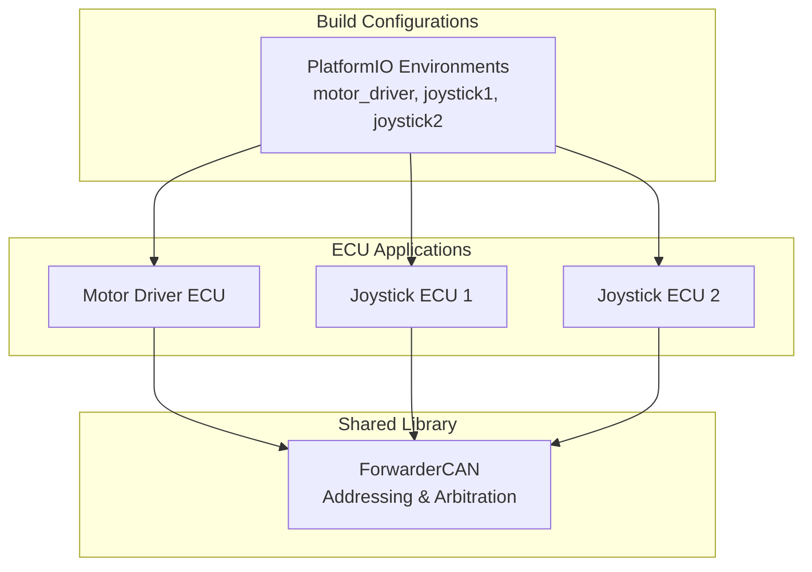
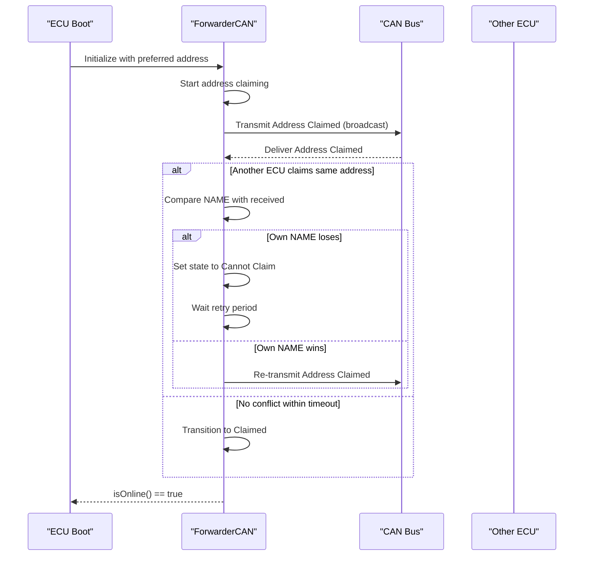
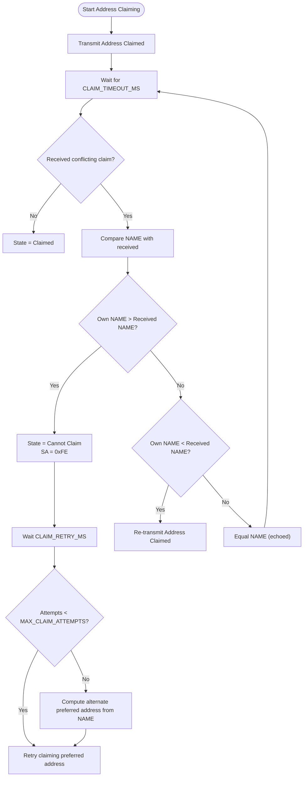
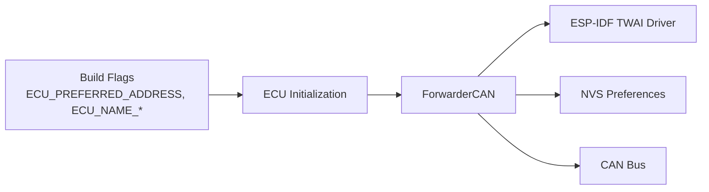

# Addressing and Arbitration

<cite>
**Referenced Files in This Document**
- [README.md](file://README.md)
- [platformio.ini](file://platformio.ini)
- [ForwarderCAN.h](file://lib/ForwarderCAN/ForwarderCAN.h)
- [ForwarderCAN.cpp](file://lib/ForwarderCAN/ForwarderCAN.cpp)
- [ecu_motor_driver.cpp](file://src/ecu_motor_driver.cpp)
- [ecu_joystick.cpp](file://src/ecu_joystick.cpp)
</cite>

## Table of Contents
1. [Introduction](#introduction)
2. [Project Structure](#project-structure)
3. [Core Components](#core-components)
4. [Architecture Overview](#architecture-overview)
5. [Detailed Component Analysis](#detailed-component-analysis)
6. [Dependency Analysis](#dependency-analysis)
7. [Performance Considerations](#performance-considerations)
8. [Troubleshooting Guide](#troubleshooting-guide)
9. [Conclusion](#conclusion)

## Introduction
This document explains the CAN addressing and arbitration system used by ForwarderKE. It focuses on the J1939-like 29-bit extended ID format, the address claiming mechanism, and the state machine that resolves conflicts during startup. It also documents timing parameters, special addresses, and provides sequence diagrams for claiming, conflict resolution, and retries.

## Project Structure
ForwarderKE organizes the addressing and arbitration logic in a shared library and integrates it into the ECU applications.

- Addressing and arbitration logic lives in a shared library: lib/ForwarderCAN
- The motor driver and joystick ECUs initialize and use ForwarderCAN
- Build-time flags define preferred addresses and distinguish units

**Diagram sources**
- [platformio.ini:17-62](file://platformio.ini#L17-L62)
- [ecu_motor_driver.cpp:290-325](file://src/ecu_motor_driver.cpp#L290-L325)
- [ecu_joystick.cpp:159-192](file://src/ecu_joystick.cpp#L159-L192)

**Section sources**
- [platformio.ini:17-62](file://platformio.ini#L17-L62)
- [README.md:112-126](file://README.md#L112-L126)

## Core Components
- J1939-like 29-bit ID layout and helpers
- Address claiming state machine
- Timing parameters for claiming and retries
- Special addresses for arbitration and broadcasting
- ECU integration points for initialization and runtime behavior

Key implementation references:
- ID layout and macros: [ForwarderCAN.h:6-34](file://lib/ForwarderCAN/ForwarderCAN.h#L6-L34)
- Address claiming state machine: [ForwarderCAN.h:74-79](file://lib/ForwarderCAN/ForwarderCAN.h#L74-L79)
- Timing constants: [ForwarderCAN.h:109-112](file://lib/ForwarderCAN/ForwarderCAN.h#L109-L112)
- Special addresses: [ForwarderCAN.h:55-57](file://lib/ForwarderCAN/ForwarderCAN.h#L55-L57)
- Address claiming loop and arbitration: [ForwarderCAN.cpp:79-142](file://lib/ForwarderCAN/ForwarderCAN.cpp#L79-L142)

**Section sources**
- [ForwarderCAN.h:6-34](file://lib/ForwarderCAN/ForwarderCAN.h#L6-L34)
- [ForwarderCAN.h:74-79](file://lib/ForwarderCAN/ForwarderCAN.h#L74-L79)
- [ForwarderCAN.h:109-112](file://lib/ForwarderCAN/ForwarderCAN.h#L109-L112)
- [ForwarderCAN.h:55-57](file://lib/ForwarderCAN/ForwarderCAN.h#L55-L57)
- [ForwarderCAN.cpp:79-142](file://lib/ForwarderCAN/ForwarderCAN.cpp#L79-L142)

## Architecture Overview
The system uses a J1939-like 29-bit extended ID format. During startup, each ECU attempts to claim its preferred address. If another ECU claims the same address, arbitration resolves the conflict deterministically using the NAME field. After successful claiming, the ECU can transmit and receive messages using its assigned source address.

**Diagram sources**
- [ForwarderCAN.cpp:54-61](file://lib/ForwarderCAN/ForwarderCAN.cpp#L54-L61)
- [ForwarderCAN.cpp:63-77](file://lib/ForwarderCAN/ForwarderCAN.cpp#L63-L77)
- [ForwarderCAN.cpp:92-97](file://lib/ForwarderCAN/ForwarderCAN.cpp#L92-L97)
- [ForwarderCAN.cpp:121-142](file://lib/ForwarderCAN/ForwarderCAN.cpp#L121-L142)

## Detailed Component Analysis

### J1939-like 29-bit Extended ID Format
The ID layout follows a J1939-style scheme with 29 bits:
- Bits 28-26: Priority (3 bits)
- Bit 25: Extended Data Page (not used, fixed to 0)
- Bit 24: Data Page (DP)
- Bits 23-16: Parameter Group Number (PF)
- Bits 15-8: PDU Specific (PS) or Destination Address (DA)
- Bits 7-0: Source Address (SA)

Helpers compute and extract fields:
- ID construction macro: [ForwarderCAN.h:22-27](file://lib/ForwarderCAN/ForwarderCAN.h#L22-L27)
- Field extraction macros: [ForwarderCAN.h:29-33](file://lib/ForwarderCAN/ForwarderCAN.h#L29-L33)

Practical implications:
- Priority controls precedence for arbitration and message scheduling
- PF encodes the service family and payload semantics
- PS/DA carries either a destination address (when PF < 240) or group extensions (when PF >= 240)
- SA uniquely identifies each ECU on the bus

**Section sources**
- [ForwarderCAN.h:6-34](file://lib/ForwarderCAN/ForwarderCAN.h#L6-L34)
- [ForwarderCAN.h:22-27](file://lib/ForwarderCAN/ForwarderCAN.h#L22-L27)
- [ForwarderCAN.h:29-33](file://lib/ForwarderCAN/ForwarderCAN.h#L29-L33)

### Address Claiming Mechanism
Each ECU starts by attempting to claim its preferred address. It broadcasts an Address Claimed message containing its NAME and waits for a timeout. If no conflicting claim arrives, the address is considered claimed. If a conflict occurs, arbitration proceeds based on NAME comparison.

Key behaviors:
- Initial state and timer setup: [ForwarderCAN.cpp:54-61](file://lib/ForwarderCAN/ForwarderCAN.cpp#L54-L61)
- Broadcast Address Claimed: [ForwarderCAN.cpp:63-77](file://lib/ForwarderCAN/ForwarderCAN.cpp#L63-L77)
- Timeout detection and state transition: [ForwarderCAN.cpp:92-97](file://lib/ForwarderCAN/ForwarderCAN.cpp#L92-L97)
- Conflict handling and arbitration: [ForwarderCAN.cpp:121-142](file://lib/ForwarderCAN/ForwarderCAN.cpp#L121-L142)

**Diagram sources**
- [ForwarderCAN.cpp:54-61](file://lib/ForwarderCAN/ForwarderCAN.cpp#L54-L61)
- [ForwarderCAN.cpp:63-77](file://lib/ForwarderCAN/ForwarderCAN.cpp#L63-L77)
- [ForwarderCAN.cpp:92-97](file://lib/ForwarderCAN/ForwarderCAN.cpp#L92-L97)
- [ForwarderCAN.cpp:121-142](file://lib/ForwarderCAN/ForwarderCAN.cpp#L121-L142)

**Section sources**
- [ForwarderCAN.cpp:54-61](file://lib/ForwarderCAN/ForwarderCAN.cpp#L54-L61)
- [ForwarderCAN.cpp:63-77](file://lib/ForwarderCAN/ForwarderCAN.cpp#L63-L77)
- [ForwarderCAN.cpp:92-97](file://lib/ForwarderCAN/ForwarderCAN.cpp#L92-L97)
- [ForwarderCAN.cpp:121-142](file://lib/ForwarderCAN/ForwarderCAN.cpp#L121-L142)

### Arbitration States
The state machine defines four states:
- ACS_CLAIMING: Broadcasting Address Claimed and waiting for conflicts
- ACS_CLAIMED: Address successfully claimed and ready to transmit/receive
- ACS_CANNOT_CLAIM: Conflicting address; temporarily uses SA 0xFE
- ACS_WAIT_RETRY: Waiting before retrying

State transitions are driven by timeouts and conflict detection.

**Section sources**
- [ForwarderCAN.h:74-79](file://lib/ForwarderCAN/ForwarderCAN.h#L74-L79)
- [ForwarderCAN.cpp:92-109](file://lib/ForwarderCAN/ForwarderCAN.cpp#L92-L109)

### Timing Parameters
- CLAIM_TIMEOUT_MS: 250 ms — time to wait for conflicts before considering the address claimed
- CLAIM_RETRY_MS: 1000 ms — delay before retrying after a conflict
- MAX_CLAIM_ATTEMPTS: 5 — maximum attempts on the preferred address before switching to an alternate

These parameters balance responsiveness and collision avoidance.

**Section sources**
- [ForwarderCAN.h:109-112](file://lib/ForwarderCAN/ForwarderCAN.h#L109-L112)
- [ForwarderCAN.cpp:98-109](file://lib/ForwarderCAN/ForwarderCAN.cpp#L98-L109)

### Special Addresses
- SA_CANNOT_CLAIM (0xFE): Used when an ECU loses arbitration; prevents accidental transmission under its own SA
- SA_BROADCAST (0xFF): Used as a source address in special cases; DA_BROADCAST (0xFF) is used for destination addressing

**Section sources**
- [ForwarderCAN.h:55-57](file://lib/ForwarderCAN/ForwarderCAN.h#L55-L57)
- [ForwarderCAN.cpp:131-133](file://lib/ForwarderCAN/ForwarderCAN.cpp#L131-L133)

### ECU Integration and Preferred Address Resolution
ECUs are built with compile-time flags that set their preferred address and identity. At runtime, the ECU may override the preferred address using stored preferences.

- Build-time preferred addresses:
  - Motor driver: 0x20
  - Joystick 1: 0x21
  - Joystick 2: 0x22

- Runtime override: ECUs consult NVS preferences to possibly force a different address.

References:
- Build flags and addresses: [platformio.ini:17-62](file://platformio.ini#L17-L62)
- Runtime override and initialization: [ecu_motor_driver.cpp:298-306](file://src/ecu_motor_driver.cpp#L298-L306), [ecu_joystick.cpp:172-174](file://src/ecu_joystick.cpp#L172-L174)

**Section sources**
- [platformio.ini:17-62](file://platformio.ini#L17-L62)
- [ecu_motor_driver.cpp:298-306](file://src/ecu_motor_driver.cpp#L298-L306)
- [ecu_joystick.cpp:172-174](file://src/ecu_joystick.cpp#L172-L174)

### Practical Examples of Address Assignment Scenarios
- Scenario A: Single ECU on the bus
  - Behavior: Claims preferred address immediately; state transitions to ACS_CLAIMED after timeout
  - Outcome: Address retained; normal operation begins

- Scenario B: Two ECUs with identical preferred addresses
  - Behavior: Both broadcast Address Claimed; arbitration compares NAME fields
  - Outcome: Lower NAME wins; higher NAME sets state to ACS_CANNOT_CLAIM and retries

- Scenario C: Excessive conflicts on preferred address
  - Behavior: After MAX_CLAIM_ATTEMPTS, ECU computes an alternate preferred address based on NAME and retries

- Scenario D: Address override via CAN command
  - Behavior: ECU accepts a Set Address command and stores it in NVS; reboots to apply

References:
- Arbitration and retries: [ForwarderCAN.cpp:121-142](file://lib/ForwarderCAN/ForwarderCAN.cpp#L121-L142), [ForwarderCAN.cpp:98-109](file://lib/ForwarderCAN/ForwarderCAN.cpp#L98-L109)
- Alternate preferred address computation: [ForwarderCAN.cpp:103-106](file://lib/ForwarderCAN/ForwarderCAN.cpp#L103-L106)
- Address override handling: [ecu_motor_driver.cpp:234-244](file://src/ecu_motor_driver.cpp#L234-L244), [ecu_joystick.cpp:132-142](file://src/ecu_joystick.cpp#L132-L142)

**Section sources**
- [ForwarderCAN.cpp:121-142](file://lib/ForwarderCAN/ForwarderCAN.cpp#L121-L142)
- [ForwarderCAN.cpp:98-109](file://lib/ForwarderCAN/ForwarderCAN.cpp#L98-L109)
- [ForwarderCAN.cpp:103-106](file://lib/ForwarderCAN/ForwarderCAN.cpp#L103-L106)
- [ecu_motor_driver.cpp:234-244](file://src/ecu_motor_driver.cpp#L234-L244)
- [ecu_joystick.cpp:132-142](file://src/ecu_joystick.cpp#L132-L142)

## Dependency Analysis
The address claiming logic depends on:
- ESP-IDF TWAI driver for CAN operations
- Build-time flags for preferred addresses
- NVS preferences for runtime overrides

**Diagram sources**
- [platformio.ini:17-62](file://platformio.ini#L17-L62)
- [ecu_motor_driver.cpp:298-306](file://src/ecu_motor_driver.cpp#L298-L306)
- [ecu_joystick.cpp:172-174](file://src/ecu_joystick.cpp#L172-L174)
- [ForwarderCAN.cpp:13-52](file://lib/ForwarderCAN/ForwarderCAN.cpp#L13-L52)

**Section sources**
- [platformio.ini:17-62](file://platformio.ini#L17-L62)
- [ecu_motor_driver.cpp:298-306](file://src/ecu_motor_driver.cpp#L298-L306)
- [ecu_joystick.cpp:172-174](file://src/ecu_joystick.cpp#L172-L174)
- [ForwarderCAN.cpp:13-52](file://lib/ForwarderCAN/ForwarderCAN.cpp#L13-L52)

## Performance Considerations
- The 250 ms timeout balances quick startup with reliable conflict detection.
- The 1000 ms retry interval reduces bus contention during repeated claiming attempts.
- The maximum 5 attempts prevent indefinite retries and allow fallback to an alternate address derived from the NAME field.

[No sources needed since this section provides general guidance]

## Troubleshooting Guide
Common issues and resolutions:
- Address claiming never completes
  - Verify bus connectivity and power; ensure no bus-off state persists
  - Confirm preferred address is not already claimed by another ECU
  - Check that the ECU is not stuck in ACS_CANNOT_CLAIM due to NAME arbitration

- Frequent retries or oscillating addresses
  - Inspect for multiple ECUs with identical NAME fields or overlapping preferred addresses
  - Consider changing the NAME or using NVS overrides to resolve conflicts

- Address override not taking effect
  - Ensure the Set Address command is sent to the correct destination address
  - Confirm NVS storage succeeds and the device reboots after applying the change

References:
- Address claiming loop and state transitions: [ForwarderCAN.cpp:79-119](file://lib/ForwarderCAN/ForwarderCAN.cpp#L79-L119)
- Conflict handling and arbitration: [ForwarderCAN.cpp:121-142](file://lib/ForwarderCAN/ForwarderCAN.cpp#L121-L142)
- Address override handling: [ecu_motor_driver.cpp:234-244](file://src/ecu_motor_driver.cpp#L234-L244), [ecu_joystick.cpp:132-142](file://src/ecu_joystick.cpp#L132-L142)

**Section sources**
- [ForwarderCAN.cpp:79-119](file://lib/ForwarderCAN/ForwarderCAN.cpp#L79-L119)
- [ForwarderCAN.cpp:121-142](file://lib/ForwarderCAN/ForwarderCAN.cpp#L121-L142)
- [ecu_motor_driver.cpp:234-244](file://src/ecu_motor_driver.cpp#L234-L244)
- [ecu_joystick.cpp:132-142](file://src/ecu_joystick.cpp#L132-L142)

## Conclusion
ForwarderKE’s addressing and arbitration system implements a robust, J1939-inspired approach to prevent address conflicts on the CAN bus. The state machine, timing parameters, and deterministic NAME-based arbitration ensure predictable operation across multiple ECUs. Proper configuration of preferred addresses and NAME fields, combined with NVS overrides, enables reliable deployment in real-world scenarios.