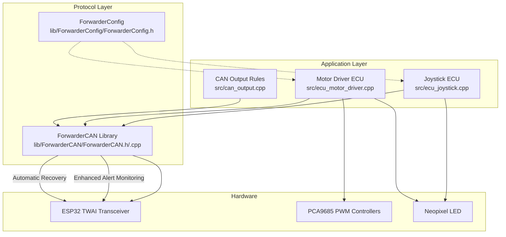
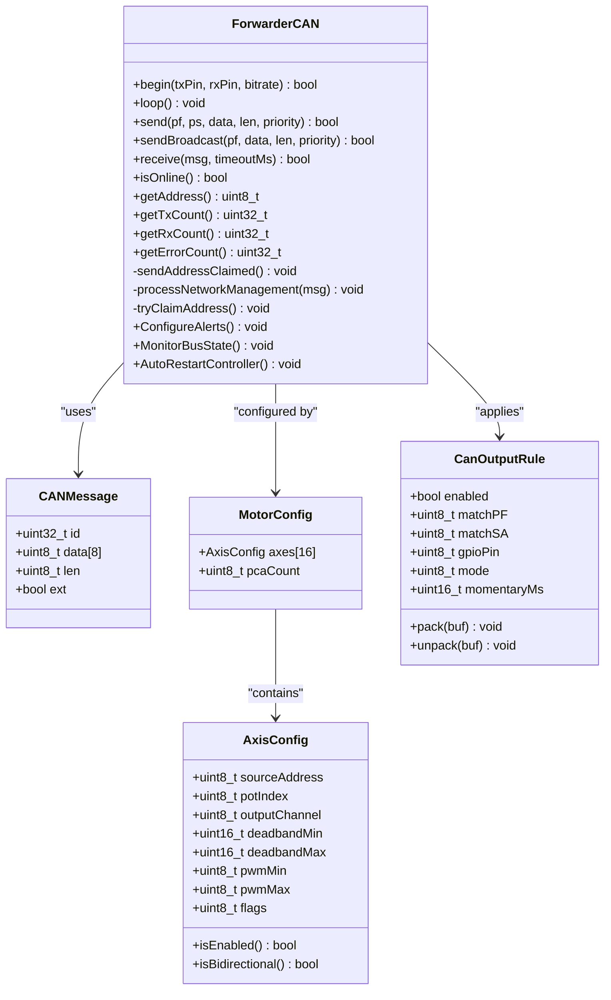
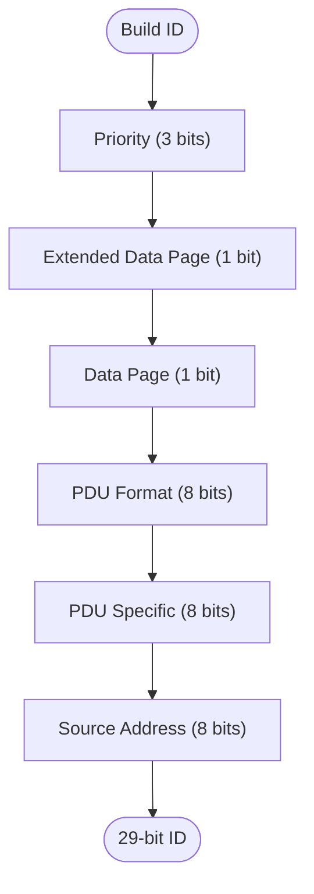
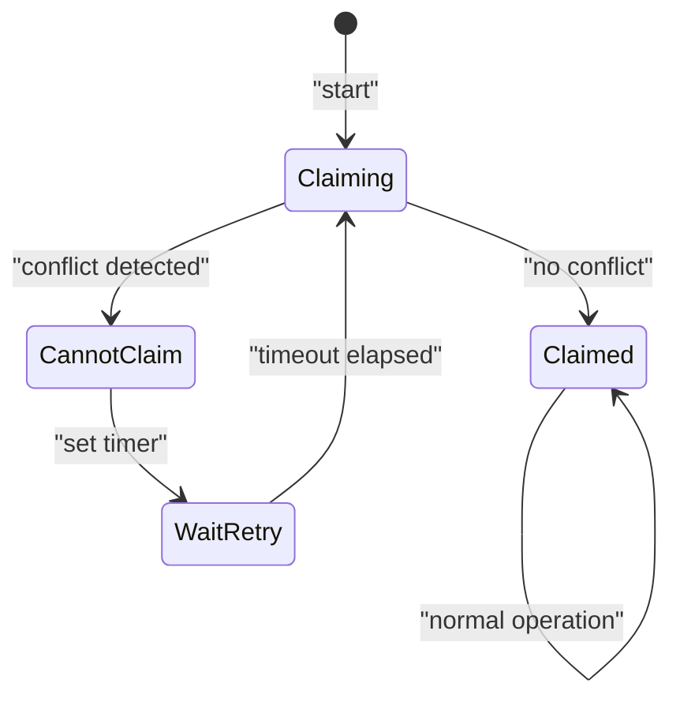
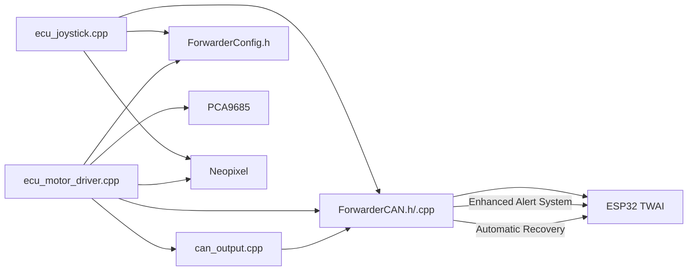
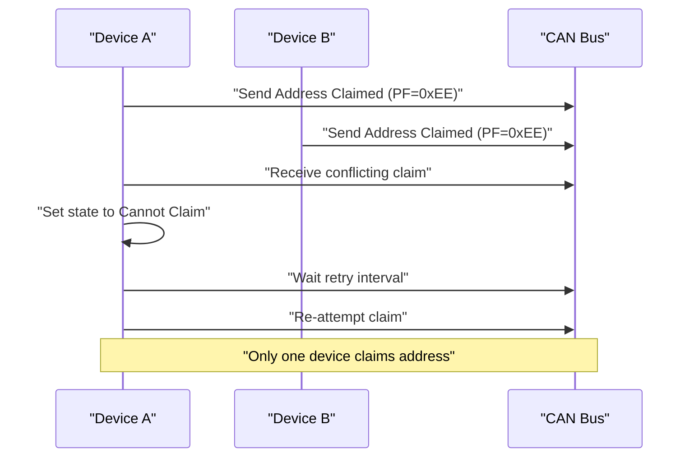
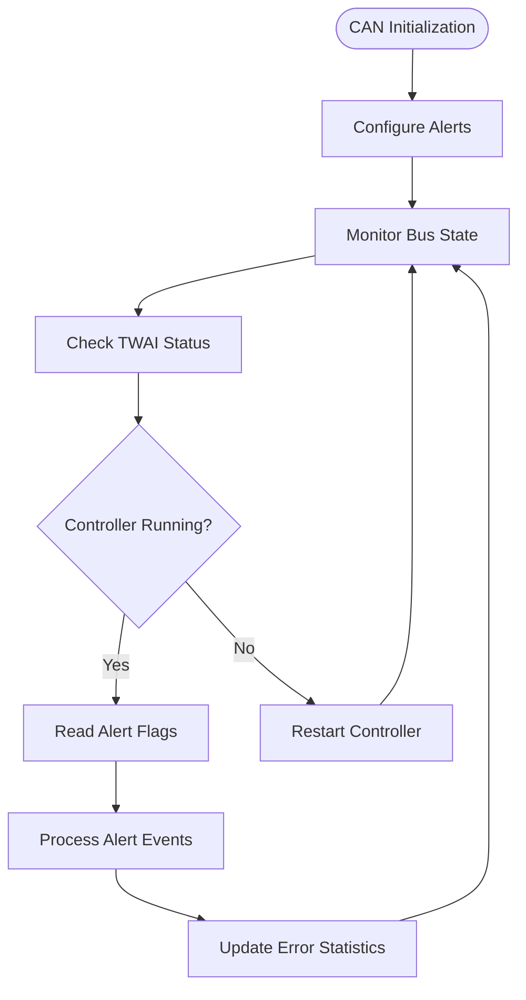
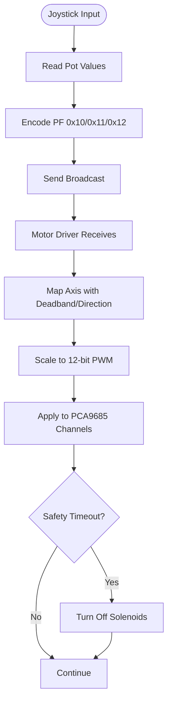

# CAN Protocol Implementation

<cite>
**Referenced Files in This Document**
- [main.cpp](file://src/main.cpp)
- [ForwarderCAN.h](file://lib/ForwarderCAN/ForwarderCAN.h)
- [ForwarderCAN.cpp](file://lib/ForwarderCAN/ForwarderCAN.cpp)
- [ForwarderConfig.h](file://lib/ForwarderConfig/ForwarderConfig.h)
- [ecu_joystick.cpp](file://src/ecu_joystick.cpp)
- [ecu_motor_driver.cpp](file://src/ecu_motor_driver.cpp)
- [can_output.cpp](file://src/can_output.cpp)
- [can_output.h](file://src/can_output.h)
- [platformio.ini](file://platformio.ini)
</cite>

## Update Summary
**Changes Made**
- Enhanced CAN communication with comprehensive alert configuration
- Added automatic controller restart capabilities
- Improved diagnostic output and monitoring
- Updated error handling procedures with comprehensive alert flags

## Table of Contents
1. [Introduction](#introduction)
2. [Project Structure](#project-structure)
3. [Core Components](#core-components)
4. [Architecture Overview](#architecture-overview)
5. [Detailed Component Analysis](#detailed-component-analysis)
6. [Enhanced CAN Communication](#enhanced-can-communication)
7. [Dependency Analysis](#dependency-analysis)
8. [Performance Considerations](#performance-considerations)
9. [Troubleshooting Guide](#troubleshooting-guide)
10. [Conclusion](#conclusion)
11. [Appendices](#appendices)

## Introduction
This document describes the CAN protocol implementation used by ForwarderKE, focusing on the J1939-like addressing scheme and custom message types. It explains the 29-bit extended identifier format, address claiming and arbitration during startup, and the complete set of custom CAN messages used for joystick telemetry, button reporting, LED control, solenoid commands, configuration, and heartbeats. The implementation now includes comprehensive alert configuration for enhanced CAN communication monitoring, automatic controller restart capabilities, and improved diagnostic output for robust operation in agricultural automation environments.

## Project Structure
The system consists of:
- A central CAN abstraction layer implementing J1939-like addressing and address claiming with comprehensive alert monitoring
- Two ECU implementations:
  - Joystick ECU: reads analog inputs and buttons, reports telemetry, controls LEDs, and responds to configuration requests
  - Motor Driver ECU: receives joystick inputs, maps to solenoids via PWM, handles LED control, and supports configuration and diagnostics
- Optional CAN-triggered GPIO output rules for external devices
- Enhanced diagnostic monitoring with automatic recovery mechanisms

**Diagram sources**
- [main.cpp:11-17](file://src/main.cpp#L11-L17)
- [ForwarderCAN.h:66-120](file://lib/ForwarderCAN/ForwarderCAN.h#L66-L120)
- [ecu_joystick.cpp:159-192](file://src/ecu_joystick.cpp#L159-L192)
- [ecu_motor_driver.cpp:290-323](file://src/ecu_motor_driver.cpp#L290-L323)
- [can_output.cpp:7-19](file://src/can_output.cpp#L7-L19)
- [ForwarderConfig.h:64-92](file://lib/ForwarderConfig/ForwarderConfig.h#L64-L92)

**Section sources**
- [main.cpp:11-17](file://src/main.cpp#L11-L17)
- [ForwarderCAN.h:66-120](file://lib/ForwarderCAN/ForwarderCAN.h#L66-L120)
- [ecu_joystick.cpp:159-192](file://src/ecu_joystick.cpp#L159-L192)
- [ecu_motor_driver.cpp:290-323](file://src/ecu_motor_driver.cpp#L290-L323)
- [can_output.cpp:7-19](file://src/can_output.cpp#L7-L19)
- [ForwarderConfig.h:64-92](file://lib/ForwarderConfig/ForwarderConfig.h#L64-L92)

## Core Components
- ForwarderCAN: Implements J1939-like 29-bit ID layout, address claiming, arbitration, and message send/receive APIs with comprehensive alert monitoring
- ECU implementations:
  - Joystick ECU: sends joystick position, button states, and periodic heartbeat; controls LED color and identification
  - Motor Driver ECU: receives joystick data, maps to solenoids, applies deadbands and directionality, and responds to configuration requests
- CAN Output Rules: optional GPIO actions triggered by incoming CAN frames
- Persistent configuration: stores forced addresses, axis mapping, and CAN output rules
- Enhanced Diagnostics: comprehensive monitoring of CAN bus health and automatic recovery mechanisms

**Section sources**
- [ForwarderCAN.h:66-120](file://lib/ForwarderCAN/ForwarderCAN.h#L66-L120)
- [ecu_joystick.cpp:99-157](file://src/ecu_joystick.cpp#L99-L157)
- [ecu_motor_driver.cpp:184-288](file://src/ecu_motor_driver.cpp#L184-L288)
- [can_output.cpp:29-61](file://src/can_output.cpp#L29-L61)
- [ForwarderConfig.h:64-92](file://lib/ForwarderConfig/ForwarderConfig.h#L64-L92)

## Architecture Overview
The system uses a J1939-like 29-bit identifier with:
- Priority: bits 28-26
- Extended Data Page: bit 25 (not used, fixed to 0)
- Data Page: bit 24
- PDU Format (PF): bits 23-16
- PDU Specific (PS): bits 15-8 (destination address when PF < 240)
- Source Address (SA): bits 7-0

Custom PF values define message types. Address claiming uses PF 0xEE for "address claimed" and PF 0xEA for "request for address claimed". Broadcast destinations use PS 0xFF.

**Diagram sources**
- [ForwarderCAN.h:66-120](file://lib/ForwarderCAN/ForwarderCAN.h#L66-L120)
- [ForwarderConfig.h:59-57](file://lib/ForwarderConfig/ForwarderConfig.h#L59-L57)
- [ForwarderConfig.h:29-39](file://lib/ForwarderConfig/ForwarderConfig.h#L29-L39)

## Detailed Component Analysis

### J1939-like Identifier Layout and Macros
- Priority: bits 28-26
- Extended Data Page: bit 25 (fixed to 0)
- Data Page: bit 24
- PF: bits 23-16
- PS: bits 15-8 (destination address for PF < 240)
- SA: bits 7-0

**Diagram sources**
- [ForwarderCAN.h:22-33](file://lib/ForwarderCAN/ForwarderCAN.h#L22-L33)

**Section sources**
- [ForwarderCAN.h:9-34](file://lib/ForwarderCAN/ForwarderCAN.h#L9-L34)

### Address Claiming and Arbitration
- Uses PF 0xEE for "address claimed" and PF 0xEA for "request for address claimed"
- States: claiming, claimed, cannot claim, wait retry
- Retry and timeout constants govern behavior
- Preferred address can be overridden via persistent storage

**Diagram sources**
- [ForwarderCAN.h:74-79](file://lib/ForwarderCAN/ForwarderCAN.h#L74-L79)
- [ForwarderCAN.h:110-112](file://lib/ForwarderCAN/ForwarderCAN.h#L110-L112)

**Section sources**
- [ForwarderCAN.h:35-36](file://lib/ForwarderCAN/ForwarderCAN.h#L35-L36)
- [ForwarderCAN.h:74-79](file://lib/ForwarderCAN/ForwarderCAN.h#L74-L79)
- [ForwarderCAN.h:109-112](file://lib/ForwarderCAN/ForwarderCAN.h#L109-L112)
- [ecu_motor_driver.cpp:329-335](file://src/ecu_motor_driver.cpp#L329-L335)

### Message Types and Payload Formats
All custom PF values below 240 use PS as destination address. Broadcast uses PS 0xFF.

- Joystick Potentiometer Messages
  - PF 0x10: Joystick Pot1 (2 bytes ADC)
  - PF 0x11: Joystick Pot2 (2 bytes ADC)
  - PF 0x12: Joystick Pot3 (2 bytes ADC)
  - PF 0x13: Buttons (1 byte bitmask)
  - Timing: sent when changed or periodically every 100 ms

- LED Control
  - PF 0x20: LED Color (RGB 0-255 each)
  - Broadcast or directed to specific address

- Solenoid Command
  - PF 0x21: 8-channel solenoid values (0-255 per channel)
  - Converted to 12-bit PWM (0-4095) internally

- Identification
  - PF 0x22: Identify device (flashes LED for 3 seconds)

- Set Address
  - PF 0x23: Directed to target address with new address byte (0x20-0xEF)
  - Stored in NVS and triggers restart

- Axis Configuration
  - PF 0x24: Configure axis mapping (packed 8-byte payload)
  - PF 0x25: Request configuration (directed)
  - PF 0x26: Configuration response (broadcast)

- Heartbeat
  - PF 0x30: Status and counters (8 bytes)

**Section sources**
- [ForwarderCAN.h:38-51](file://lib/ForwarderCAN/ForwarderCAN.h#L38-L51)
- [ecu_joystick.cpp:99-157](file://src/ecu_joystick.cpp#L99-L157)
- [ecu_motor_driver.cpp:184-288](file://src/ecu_motor_driver.cpp#L184-L288)

### Broadcast vs Directed Messaging
- Broadcast: PS = 0xFF; all ECUs receive
- Directed: PS = specific source address; only addressed ECU processes
- Examples:
  - Telemetry and heartbeats are broadcast
  - LED color, identify, set address, and configuration requests are directed

**Section sources**
- [ForwarderCAN.h:52-57](file://lib/ForwarderCAN/ForwarderCAN.h#L52-L57)
- [ecu_joystick.cpp:119-142](file://src/ecu_joystick.cpp#L119-L142)
- [ecu_motor_driver.cpp:227-245](file://src/ecu_motor_driver.cpp#L227-L245)

### Data Encoding and Payload Packing
- Joystick pots: 2-byte little-endian integers
- Buttons: 1-byte bitmask (bit 0 = Btn1, bit 1 = Btn2)
- LED color: 3 bytes RGB
- Solenoid command: 8 bytes (0-255 per channel)
- Axis configuration: 8-byte packed structure with flags and scaling parameters

**Section sources**
- [ecu_joystick.cpp:100-112](file://src/ecu_joystick.cpp#L100-L112)
- [ecu_motor_driver.cpp:206-218](file://src/ecu_motor_driver.cpp#L206-L218)
- [ForwarderConfig.h:9-18](file://lib/ForwarderConfig/ForwarderConfig.h#L9-L18)

### Timing Requirements
- Joystick telemetry: change-detection plus periodic 100 ms
- Heartbeat: 1000 ms when online
- LED blink fast: short duration after receiving joystick data
- Safety timeout: solenoids disabled after 500 ms without updates

**Section sources**
- [ecu_joystick.cpp:194-236](file://src/ecu_joystick.cpp#L194-L236)
- [ecu_motor_driver.cpp:325-350](file://src/ecu_motor_driver.cpp#L325-L350)
- [ecu_motor_driver.cpp:330-335](file://src/ecu_motor_driver.cpp#L330-L335)

### CAN Output Rules
Optional GPIO actions triggered by incoming CAN frames:
- Toggle or momentary modes
- Configurable matching by PF and SA
- Momentary timeout configurable

**Section sources**
- [can_output.cpp:29-61](file://src/can_output.cpp#L29-L61)
- [ForwarderConfig.h:29-39](file://lib/ForwarderConfig/ForwarderConfig.h#L29-L39)

### Practical Examples: Message Construction and Interpretation
- Constructing a joystick pot message:
  - Use PF 0x10/0x11/0x12 with 2-byte payload
  - Broadcast destination (PS 0xFF) or directed to joystick SA
- Interpreting solenoid command:
  - Read PF 0x21, extract 8 values, scale to 12-bit PWM
- Setting address:
  - Send PF 0x23 directed to target SA with new address byte
- Requesting configuration:
  - Send PF 0x25 directed to target SA; expect PF 0x26 responses

**Section sources**
- [ecu_joystick.cpp:99-112](file://src/ecu_joystick.cpp#L99-L112)
- [ecu_motor_driver.cpp:206-218](file://src/ecu_motor_driver.cpp#L206-L218)
- [ecu_motor_driver.cpp:257-267](file://src/ecu_motor_driver.cpp#L257-L267)

## Enhanced CAN Communication

### Comprehensive Alert Configuration
The ForwarderCAN library now implements comprehensive alert monitoring for enhanced CAN bus reliability and diagnostics. The system configures the following alert flags:

- **TWAI_ALERT_TX_IDLE**: Monitors when the transmitter becomes idle
- **TWAI_ALERT_TX_SUCCESS**: Tracks successful message transmissions
- **TWAI_ALERT_TX_FAILED**: Monitors transmission failures
- **TWAI_ALERT_ERR_PASS**: Detects passive error conditions
- **TWAI_ALERT_BUS_ERROR**: Monitors bus error conditions
- **TWAI_ALERT_RX_DATA**: Tracks incoming message reception
- **TWAI_ALERT_RX_QUEUE_FULL**: Monitors receive queue overflow conditions

These alerts are configured during the CAN initialization process and continuously monitored during operation to provide comprehensive bus health monitoring.

**Section sources**
- [ForwarderCAN.cpp:46-51](file://lib/ForwarderCAN/ForwarderCAN.cpp#L46-L51)

### Automatic Controller Restart Mechanism
The system implements automatic recovery mechanisms to handle CAN bus errors and controller failures:

- **Bus State Monitoring**: Continuously checks TWAI controller state
- **Automatic Restart**: Restarts stopped controllers automatically
- **Bus Off Recovery**: Initiates recovery procedures for bus-off conditions
- **Error Count Tracking**: Maintains statistics on bus errors and recovery attempts

The automatic restart mechanism ensures continuous operation even when temporary bus issues occur, improving system reliability in agricultural environments.

**Section sources**
- [ForwarderCAN.cpp:87-99](file://lib/ForwarderCAN/ForwarderCAN.cpp#L87-L99)

### Enhanced Diagnostic Output
The implementation provides comprehensive diagnostic information through enhanced serial output:

- **TWAI Status Information**: Hardware state, message queues, and error counters
- **Bus Health Metrics**: Transmission success/failure rates, error counts
- **Operational Statistics**: TX/RX counts, error statistics, address claiming status
- **Real-time Monitoring**: Continuous bus state monitoring and alert reporting

This enhanced diagnostic output enables detailed troubleshooting and performance monitoring of the CAN bus system.

**Section sources**
- [ecu_joystick.cpp:247-260](file://src/ecu_joystick.cpp#L247-L260)
- [ecu_motor_driver.cpp:341-347](file://src/ecu_motor_driver.cpp#L341-L347)

### Practical Examples: Enhanced Alert Handling
- **Configuring Alerts**: The system automatically configures all seven alert types during initialization
- **Monitoring Bus State**: Continuous monitoring of TWAI controller state with automatic recovery
- **Diagnostic Reporting**: Comprehensive serial output showing bus health and operational metrics
- **Error Recovery**: Automatic restart of stopped controllers and bus-off recovery procedures

**Section sources**
- [ForwarderCAN.cpp:101-103](file://lib/ForwarderCAN/ForwarderCAN.cpp#L101-L103)
- [ForwarderCAN.cpp:87-99](file://lib/ForwarderCAN/ForwarderCAN.cpp#L87-L99)

## Dependency Analysis

**Diagram sources**
- [ecu_joystick.cpp:159-192](file://src/ecu_joystick.cpp#L159-L192)
- [ecu_motor_driver.cpp:290-323](file://src/ecu_motor_driver.cpp#L290-L323)
- [can_output.cpp:7-19](file://src/can_output.cpp#L7-L19)
- [ForwarderCAN.h:66-120](file://lib/ForwarderCAN/ForwarderCAN.h#L66-L120)
- [ForwarderConfig.h:64-92](file://lib/ForwarderConfig/ForwarderConfig.h#L64-L92)

**Section sources**
- [ecu_joystick.cpp:159-192](file://src/ecu_joystick.cpp#L159-L192)
- [ecu_motor_driver.cpp:290-323](file://src/ecu_motor_driver.cpp#L290-L323)
- [can_output.cpp:7-19](file://src/can_output.cpp#L7-L19)
- [ForwarderCAN.h:66-120](file://lib/ForwarderCAN/ForwarderCAN.h#L66-L120)
- [ForwarderConfig.h:64-92](file://lib/ForwarderConfig/ForwarderConfig.h#L64-L92)

## Performance Considerations
- Message rates:
  - Joystick telemetry: change-detected plus 10 Hz cap
  - Heartbeat: 1 Hz when online
- Safety:
  - Automatic solenoid deactivation after 500 ms absence of updates
  - Enhanced bus error detection and automatic recovery
- Bus utilization:
  - Minimal overhead with small payloads and targeted broadcasts
  - Comprehensive alert monitoring with minimal performance impact

## Troubleshooting Guide
- CAN initialization failure:
  - Joystick and motor driver ECUs flash LED and loop on failure
  - Enhanced diagnostic output provides detailed error information
- Address conflict:
  - If claiming fails, device falls back to special source address and retries
- Enhanced Error Recovery:
  - Automatic controller restart for stopped TWAI controllers
  - Bus-off recovery procedures initiated automatically
- LED indicators:
  - Joystick: amber when offline; white flash for identify
  - Motor driver: red when offline; yellow flash for fast blink after activity
- Persistent configuration:
  - Forced address stored in NVS; clearing removes override
- Comprehensive Diagnostics:
  - Serial output provides detailed bus health and error information
  - Alert monitoring helps identify specific failure points

**Section sources**
- [ecu_joystick.cpp:175-185](file://src/ecu_joystick.cpp#L175-L185)
- [ecu_motor_driver.cpp:306-316](file://src/ecu_motor_driver.cpp#L306-L316)
- [ecu_joystick.cpp:88-96](file://src/ecu_joystick.cpp#L88-L96)
- [ecu_motor_driver.cpp:167-182](file://src/ecu_motor_driver.cpp#L167-L182)
- [ecu_motor_driver.cpp:329-335](file://src/ecu_motor_driver.cpp#L329-L335)
- [ForwarderCAN.cpp:87-99](file://lib/ForwarderCAN/ForwarderCAN.cpp#L87-L99)

## Conclusion
ForwarderKE implements a robust J1939-like CAN protocol tailored for agricultural automation with enhanced reliability through comprehensive alert monitoring, automatic recovery mechanisms, and detailed diagnostic capabilities. The design leverages a simple address claiming mechanism, clear PF-based message semantics, and practical timing to ensure reliable operation. The protocol supports telemetry, actuation, diagnostics, and remote configuration, with built-in safety and comprehensive monitoring systems that automatically detect and recover from bus errors.

## Appendices

### Address Claiming Sequence

**Diagram sources**
- [ForwarderCAN.h:35-36](file://lib/ForwarderCAN/ForwarderCAN.h#L35-L36)
- [ForwarderCAN.h:74-79](file://lib/ForwarderCAN/ForwarderCAN.h#L74-L79)
- [ForwarderCAN.h:110-112](file://lib/ForwarderCAN/ForwarderCAN.h#L110-L112)

### Enhanced Alert Monitoring Flow

**Diagram sources**
- [ForwarderCAN.cpp:46-51](file://lib/ForwarderCAN/ForwarderCAN.cpp#L46-L51)
- [ForwarderCAN.cpp:87-99](file://lib/ForwarderCAN/ForwarderCAN.cpp#L87-L99)
- [ForwarderCAN.cpp:101-103](file://lib/ForwarderCAN/ForwarderCAN.cpp#L101-L103)

### Joystick to Solenoid Mapping Flow

**Diagram sources**
- [ecu_joystick.cpp:194-236](file://src/ecu_joystick.cpp#L194-L236)
- [ecu_motor_driver.cpp:137-151](file://src/ecu_motor_driver.cpp#L137-L151)
- [ecu_motor_driver.cpp:329-335](file://src/ecu_motor_driver.cpp#L329-L335)