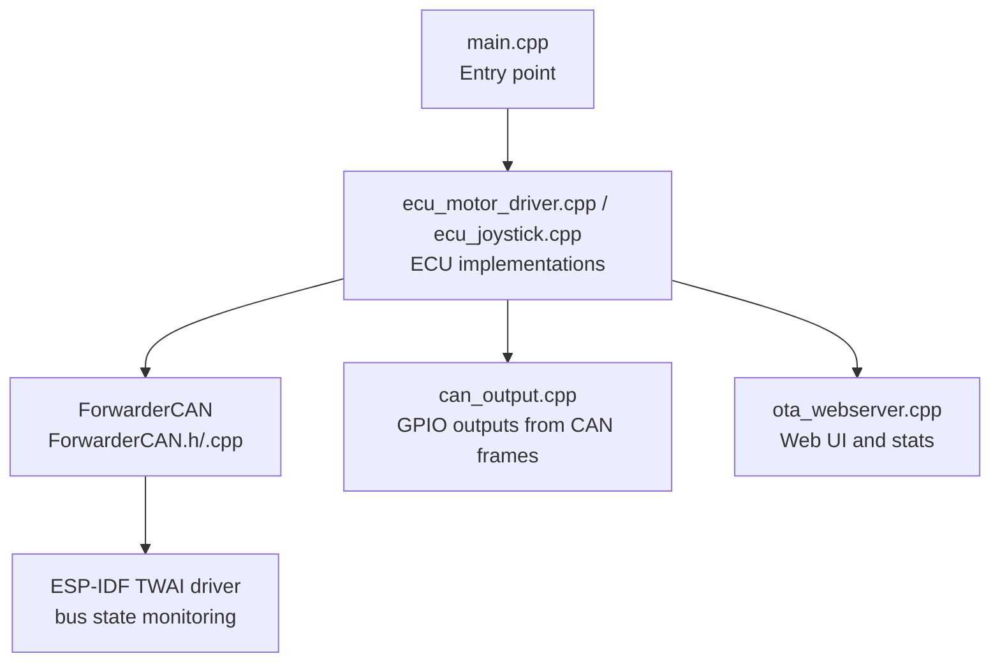
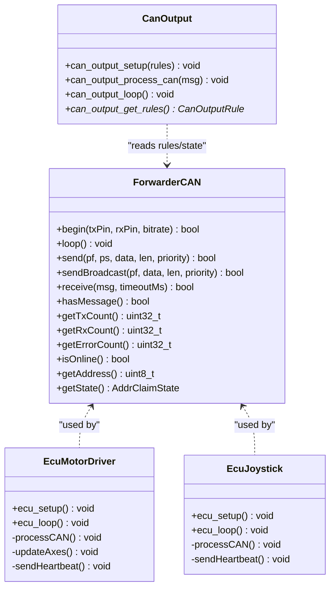
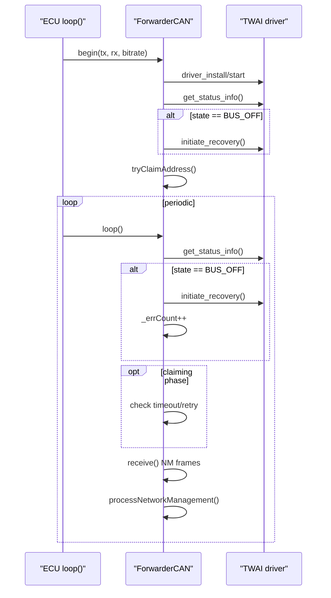
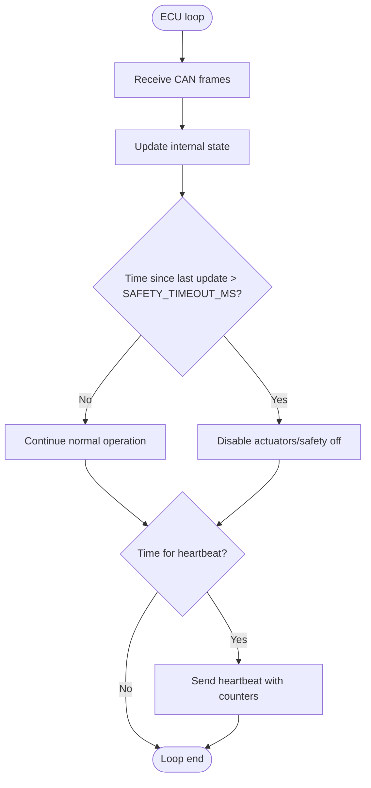
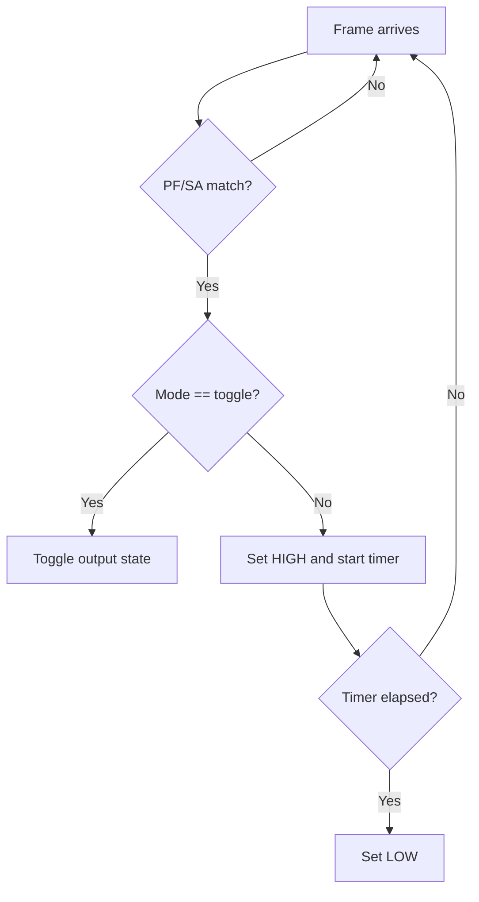
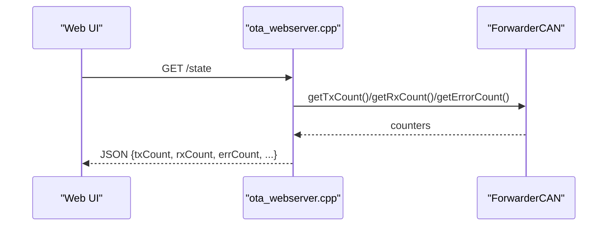

# Error Handling and Fault Tolerance

<cite>
**Referenced Files in This Document**
- [main.cpp](file://src/main.cpp)
- [ForwarderCAN.h](file://lib/ForwarderCAN/ForwarderCAN.h)
- [ForwarderCAN.cpp](file://lib/ForwarderCAN/ForwarderCAN.cpp)
- [ecu_motor_driver.cpp](file://src/ecu_motor_driver.cpp)
- [ecu_joystick.cpp](file://src/ecu_joystick.cpp)
- [can_output.cpp](file://src/can_output.cpp)
- [can_output.h](file://src/can_output.h)
- [ForwarderConfig.h](file://lib/ForwarderConfig/ForwarderConfig.h)
- [ota_webserver.cpp](file://src/ota_webserver.cpp)
- [platformio.ini](file://platformio.ini)
</cite>

## Table of Contents
1. [Introduction](#introduction)
2. [Project Structure](#project-structure)
3. [Core Components](#core-components)
4. [Architecture Overview](#architecture-overview)
5. [Detailed Component Analysis](#detailed-component-analysis)
6. [Dependency Analysis](#dependency-analysis)
7. [Performance Considerations](#performance-considerations)
8. [Troubleshooting Guide](#troubleshooting-guide)
9. [Conclusion](#conclusion)

## Introduction
This document explains the CAN error handling and fault tolerance mechanisms in ForwarderKE. It focuses on the built-in error counting system, automatic recovery from bus-off and error passive states, watchdog-style safety behavior during missing commands, detection and reporting of transmission/reception anomalies, and practical guidance for diagnosing and resolving common CAN issues. It also covers statistics collection (TX/RX/error counts) and safe degradation strategies when communication fails.

## Project Structure
ForwarderKE consists of:
- A CAN abstraction layer (ForwarderCAN) that encapsulates the ESP-IDF TWAI driver and implements address claiming, message send/receive, and statistics.
- Two ECU implementations (joystick and motor driver) that use ForwarderCAN for all CAN operations.
- Optional CAN-triggered GPIO outputs (can_output) for external control.
- An OTA web server that surfaces runtime statistics and allows remote configuration.



**Diagram sources**
- [main.cpp:19-31](file://src/main.cpp#L19-L31)
- [ecu_motor_driver.cpp:290-325](file://src/ecu_motor_driver.cpp#L290-L325)
- [ecu_joystick.cpp:159-192](file://src/ecu_joystick.cpp#L159-L192)
- [ForwarderCAN.h:66-119](file://lib/ForwarderCAN/ForwarderCAN.h#L66-L119)
- [ForwarderCAN.cpp:13-52](file://lib/ForwarderCAN/ForwarderCAN.cpp#L13-L52)
- [can_output.cpp:7-19](file://src/can_output.cpp#L7-L19)
- [ota_webserver.cpp:510-563](file://src/ota_webserver.cpp#L510-L563)

**Section sources**
- [main.cpp:19-31](file://src/main.cpp#L19-L31)
- [ForwarderCAN.h:66-119](file://lib/ForwarderCAN/ForwarderCAN.h#L66-L119)
- [ForwarderCAN.cpp:13-52](file://lib/ForwarderCAN/ForwarderCAN.cpp#L13-L52)
- [ecu_motor_driver.cpp:290-325](file://src/ecu_motor_driver.cpp#L290-L325)
- [ecu_joystick.cpp:159-192](file://src/ecu_joystick.cpp#L159-L192)
- [can_output.cpp:7-19](file://src/can_output.cpp#L7-L19)
- [ota_webserver.cpp:510-563](file://src/ota_webserver.cpp#L510-L563)

## Core Components
- ForwarderCAN: Provides CAN initialization, address claiming, send/receive, and statistics. Implements automatic bus-off recovery and error counting.
- ECU implementations: Use ForwarderCAN to send/receive messages, enforce safety timeouts, and report health via heartbeat frames.
- CAN output rules: Allow GPIO toggling or momentary pulses in response to matching CAN frames.
- Web server: Exposes TX/RX/error counts and device state for diagnostics.

Key statistics and methods:
- TX count: Number of successful transmissions.
- RX count: Number of received frames.
- Error count: Incremented on send failures and bus-off events.
- getErrorCount(): Public accessor for error statistics.

**Section sources**
- [ForwarderCAN.h:93-96](file://lib/ForwarderCAN/ForwarderCAN.h#L93-L96)
- [ForwarderCAN.h:114-116](file://lib/ForwarderCAN/ForwarderCAN.h#L114-L116)
- [ForwarderCAN.cpp:144-167](file://lib/ForwarderCAN/ForwarderCAN.cpp#L144-L167)
- [ForwarderCAN.cpp:173-188](file://lib/ForwarderCAN/ForwarderCAN.cpp#L173-L188)
- [ForwarderCAN.cpp:82-89](file://lib/ForwarderCAN/ForwarderCAN.cpp#L82-L89)
- [ota_webserver.cpp:515-517](file://src/ota_webserver.cpp#L515-L517)

## Architecture Overview
The system separates concerns:
- Transport: ForwarderCAN handles TWAI driver lifecycle, address claiming, and statistics.
- Application: ECUs send/receive protocol frames and react to control commands.
- Outputs: Optional CAN-triggered GPIO actions.
- Diagnostics: Web server reads counters and exposes device state.



**Diagram sources**
- [ForwarderCAN.h:66-119](file://lib/ForwarderCAN/ForwarderCAN.h#L66-L119)
- [ecu_motor_driver.cpp:290-325](file://src/ecu_motor_driver.cpp#L290-L325)
- [ecu_joystick.cpp:159-192](file://src/ecu_joystick.cpp#L159-L192)
- [can_output.cpp:7-19](file://src/can_output.cpp#L7-L19)

## Detailed Component Analysis

### ForwarderCAN: Error Counting, Bus-Off Recovery, and Address Claiming
- Error counting:
  - TX increments on successful transmit.
  - ERR increments on transmit failure or bus-off detection.
  - RX increments on successful receive.
- Bus-off recovery:
  - On startup, if the driver reports bus-off, recovery is initiated automatically.
  - During loop(), periodic status polling detects bus-off and triggers recovery, incrementing error count.
- Address claiming:
  - Sends Address Claimed frames and waits for conflict resolution.
  - Implements timeouts and retries, with fallback to alternate address selection after max attempts.



**Diagram sources**
- [ForwarderCAN.cpp:13-52](file://lib/ForwarderCAN/ForwarderCAN.cpp#L13-L52)
- [ForwarderCAN.cpp:79-119](file://lib/ForwarderCAN/ForwarderCAN.cpp#L79-L119)
- [ForwarderCAN.cpp:121-142](file://lib/ForwarderCAN/ForwarderCAN.cpp#L121-L142)

**Section sources**
- [ForwarderCAN.cpp:13-52](file://lib/ForwarderCAN/ForwarderCAN.cpp#L13-L52)
- [ForwarderCAN.cpp:79-119](file://lib/ForwarderCAN/ForwarderCAN.cpp#L79-L119)
- [ForwarderCAN.cpp:121-142](file://lib/ForwarderCAN/ForwarderCAN.cpp#L121-L142)
- [ForwarderCAN.h:93-96](file://lib/ForwarderCAN/ForwarderCAN.h#L93-L96)
- [ForwarderCAN.h:114-116](file://lib/ForwarderCAN/ForwarderCAN.h#L114-L116)

### ECU Implementations: Safety Timeout and Heartbeat
- Safety timeout:
  - Motor driver disables outputs if joystick updates stop exceeding a configured threshold.
  - This prevents stale actuator states in case of communication loss.
- Heartbeat:
  - Both ECUs periodically broadcast heartbeat frames containing online status, uptime, and counters.
  - Receivers can track liveness and detect silent links.



**Diagram sources**
- [ecu_motor_driver.cpp:332-337](file://src/ecu_motor_driver.cpp#L332-L337)
- [ecu_motor_driver.cpp:341-346](file://src/ecu_motor_driver.cpp#L341-L346)
- [ecu_joystick.cpp:226-231](file://src/ecu_joystick.cpp#L226-L231)

**Section sources**
- [ecu_motor_driver.cpp:332-337](file://src/ecu_motor_driver.cpp#L332-L337)
- [ecu_motor_driver.cpp:341-346](file://src/ecu_motor_driver.cpp#L341-L346)
- [ecu_joystick.cpp:226-231](file://src/ecu_joystick.cpp#L226-L231)
- [platformio.ini:29](file://platformio.ini#L29)

### CAN Output Rules: Watchdog-Style GPIO Behavior
- CAN-triggered GPIO outputs can be configured to toggle or momentarily activate upon receiving matching frames.
- Momentary mode uses a timer to automatically revert the output after a configurable interval, acting as a watchdog for short-lived commands.



**Diagram sources**
- [can_output.cpp:29-49](file://src/can_output.cpp#L29-L49)
- [can_output.cpp:51-61](file://src/can_output.cpp#L51-L61)
- [ForwarderConfig.h:29-39](file://lib/ForwarderConfig/ForwarderConfig.h#L29-L39)

**Section sources**
- [can_output.cpp:29-61](file://src/can_output.cpp#L29-L61)
- [ForwarderConfig.h:29-39](file://lib/ForwarderConfig/ForwarderConfig.h#L29-L39)

### Statistics Collection and Reporting
- TX/RX/Error counts are maintained by ForwarderCAN and exposed via getters.
- The web server publishes these counters along with device state for diagnostics.



**Diagram sources**
- [ota_webserver.cpp:510-563](file://src/ota_webserver.cpp#L510-L563)
- [ForwarderCAN.h:93-96](file://lib/ForwarderCAN/ForwarderCAN.h#L93-L96)

**Section sources**
- [ota_webserver.cpp:510-563](file://src/ota_webserver.cpp#L510-L563)
- [ForwarderCAN.h:93-96](file://lib/ForwarderCAN/ForwarderCAN.h#L93-L96)

## Dependency Analysis
- ForwarderCAN depends on the ESP-IDF TWAI driver for hardware access and status queries.
- ECU implementations depend on ForwarderCAN for all CAN operations.
- CAN output rules depend on ForwarderCAN’s public API to interpret frame metadata.
- Web server depends on ForwarderCAN counters and ECU state for diagnostics.

```mermaid
graph LR
TWAI["ESP-IDF TWAI"] <- --> CAN["ForwarderCAN"]
CAN <- --> ECU1["EcuMotorDriver"]
CAN <- --> ECU2["EcuJoystick"]
CAN <- --> OUT["CanOutput"]
CAN <- --> WEB["OTA Webserver"]
```

**Diagram sources**
- [ForwarderCAN.cpp:13-52](file://lib/ForwarderCAN/ForwarderCAN.cpp#L13-L52)
- [ecu_motor_driver.cpp:290-325](file://src/ecu_motor_driver.cpp#L290-L325)
- [ecu_joystick.cpp:159-192](file://src/ecu_joystick.cpp#L159-L192)
- [can_output.cpp:7-19](file://src/can_output.cpp#L7-L19)
- [ota_webserver.cpp:510-563](file://src/ota_webserver.cpp#L510-L563)

**Section sources**
- [ForwarderCAN.cpp:13-52](file://lib/ForwarderCAN/ForwarderCAN.cpp#L13-L52)
- [ecu_motor_driver.cpp:290-325](file://src/ecu_motor_driver.cpp#L290-L325)
- [ecu_joystick.cpp:159-192](file://src/ecu_joystick.cpp#L159-L192)
- [can_output.cpp:7-19](file://src/can_output.cpp#L7-L19)
- [ota_webserver.cpp:510-563](file://src/ota_webserver.cpp#L510-L563)

## Performance Considerations
- TX/RX queues are sized to handle bursts typical of joystick and motor driver traffic.
- Address claiming uses short timeouts and controlled retries to minimize network contention.
- Heartbeat intervals balance visibility with bus load.
- Momentary GPIO outputs avoid long-lived state changes, reducing risk of stuck outputs.

[No sources needed since this section provides general guidance]

## Troubleshooting Guide

### Detecting and Interpreting Errors
- Use the web UI counters:
  - TX: Successful sends.
  - RX: Frames received.
  - ERR: Transmissions failing or bus-off occurrences.
- Online status indicates whether address claiming succeeded and the device is ready to exchange data.

**Section sources**
- [ota_webserver.cpp:515-517](file://src/ota_webserver.cpp#L515-L517)
- [ForwarderCAN.h:81-83](file://lib/ForwarderCAN/ForwarderCAN.h#L81-L83)

### Common Issues and Remedies
- Arbitration conflicts during address claiming:
  - Symptoms: Repeated retries and eventual fallback to alternate address.
  - Action: Verify address uniqueness; reduce contention by powering down duplicates.
- Bus-off condition:
  - Symptoms: Persistent ERR growth and inability to transmit.
  - Action: System recovers automatically; inspect wiring and termination if recurring.
- Message corruption or timeouts:
  - Symptoms: Low RX or high ERR with intermittent connectivity.
  - Action: Check cable quality, termination, and noise; verify bitrate settings.
- Stuck outputs or lack of response:
  - Symptoms: Actuators remain on despite no commands.
  - Action: Confirm joystick updates are arriving; safety timeout will disable outputs if absent.

**Section sources**
- [ForwarderCAN.cpp:82-89](file://lib/ForwarderCAN/ForwarderCAN.cpp#L82-L89)
- [ForwarderCAN.cpp:98-109](file://lib/ForwarderCAN/ForwarderCAN.cpp#L98-L109)
- [ecu_motor_driver.cpp:332-337](file://src/ecu_motor_driver.cpp#L332-L337)

### Implementing Custom Error Handling
- Hook into ForwarderCAN’s public API to monitor counters and state.
- React to low RX or rising ERR by logging, alerting, or switching to degraded mode.
- Use heartbeat reception to detect peer liveness and adjust retry/backoff strategies.

**Section sources**
- [ForwarderCAN.h:93-96](file://lib/ForwarderCAN/ForwarderCAN.h#L93-L96)
- [ForwarderCAN.h:81-83](file://lib/ForwarderCAN/ForwarderCAN.h#L81-L83)
- [ecu_motor_driver.cpp:277-288](file://src/ecu_motor_driver.cpp#L277-L288)
- [ecu_joystick.cpp:146-157](file://src/ecu_joystick.cpp#L146-L157)

### Safety and Graceful Degradation
- Safety timeout disables outputs when control signals stop, preventing unintended actuation.
- Online state and heartbeat enable peers to detect silent links and take corrective action.
- CAN output rules support momentary activation to avoid persistent outputs.

**Section sources**
- [ecu_motor_driver.cpp:332-337](file://src/ecu_motor_driver.cpp#L332-L337)
- [can_output.cpp:51-61](file://src/can_output.cpp#L51-L61)

## Conclusion
ForwarderKE implements robust CAN error handling centered on ForwarderCAN: automatic bus-off recovery, address claiming with timeouts and retries, and a simple yet effective error counter. ECU implementations add safety timeouts and heartbeat-based health reporting. Together, these mechanisms provide reliable operation, clear diagnostics, and graceful degradation when communication fails.