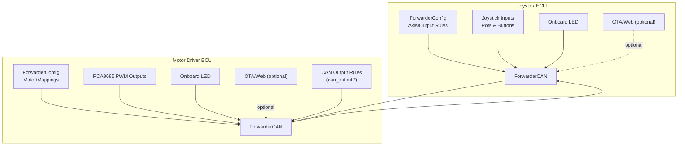
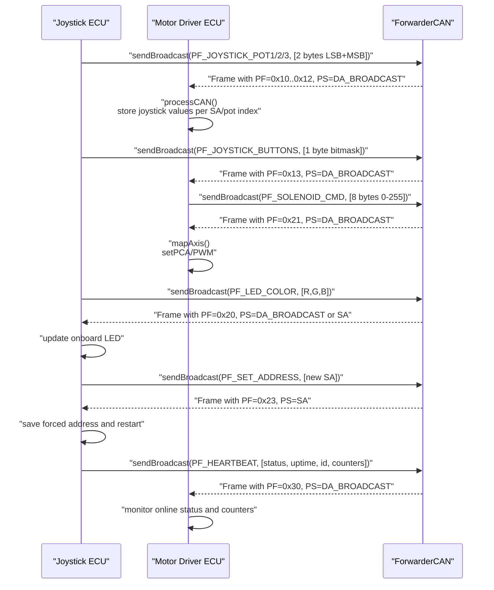
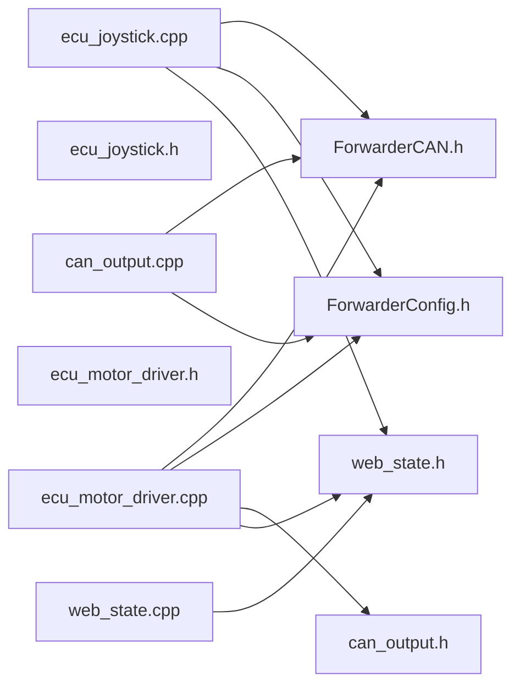

# Message Formats and Types

<cite>
**Referenced Files in This Document**
- [ForwarderCAN.h](file://lib/ForwarderCAN/ForwarderCAN.h)
- [ForwarderConfig.h](file://lib/ForwarderConfig/ForwarderConfig.h)
- [can_output.h](file://src/can_output.h)
- [can_output.cpp](file://src/can_output.cpp)
- [ecu_joystick.h](file://src/ecu_joystick.h)
- [ecu_joystick.cpp](file://src/ecu_joystick.cpp)
- [ecu_motor_driver.h](file://src/ecu_motor_driver.h)
- [ecu_motor_driver.cpp](file://src/ecu_motor_driver.cpp)
- [main.cpp](file://src/main.cpp)
- [web_state.h](file://src/web_state.h)
- [web_state.cpp](file://src/web_state.cpp)
</cite>

## Table of Contents
1. [Introduction](#introduction)
2. [Project Structure](#project-structure)
3. [Core Components](#core-components)
4. [Architecture Overview](#architecture-overview)
5. [Detailed Component Analysis](#detailed-component-analysis)
6. [Dependency Analysis](#dependency-analysis)
7. [Performance Considerations](#performance-considerations)
8. [Troubleshooting Guide](#troubleshooting-guide)
9. [Conclusion](#conclusion)

## Introduction
This document describes the CAN message formats and types used by ForwarderKE. It focuses on the custom Parameter Group Numbers (PF) defined for the system, including PF_JOYSTICK_POT1, PF_JOYSTICK_POT2, PF_JOYSTICK_POT3, PF_JOYSTICK_BUTTONS, PF_LED_COLOR, PF_SOLENOID_CMD, PF_IDENTIFY, PF_SET_ADDRESS, PF_CONFIG_AXIS, PF_REQUEST_CONFIG, PF_CONFIG_RESPONSE, and PF_HEARTBEAT. It explains the payload structure, data encoding schemes, length specifications, and the difference between broadcast and directed messages. Practical examples of message construction and interpretation are included, along with the relationship between PF values and system functionality.

## Project Structure
ForwarderKE implements two ECU roles:
- Joystick ECU: reads analog pots and buttons, emits joystick telemetry and heartbeat, responds to LED color, identify, and set-address commands.
- Motor Driver ECU: receives joystick telemetry, maps axes to solenoids via PCA9685 PWM channels, handles LED control, identify, configuration requests, and CAN-triggered GPIO outputs.

**Diagram sources**
- [ecu_joystick.cpp:159-192](file://src/ecu_joystick.cpp#L159-L192)
- [ecu_motor_driver.cpp:290-325](file://src/ecu_motor_driver.cpp#L290-L325)
- [ForwarderCAN.h:66-119](file://lib/ForwarderCAN/ForwarderCAN.h#L66-L119)
- [ForwarderConfig.h:64-91](file://lib/ForwarderConfig/ForwarderConfig.h#L64-L91)
- [can_output.cpp:29-49](file://src/can_output.cpp#L29-L49)

**Section sources**
- [main.cpp:11-17](file://src/main.cpp#L11-L17)
- [ecu_joystick.cpp:159-192](file://src/ecu_joystick.cpp#L159-L192)
- [ecu_motor_driver.cpp:290-325](file://src/ecu_motor_driver.cpp#L290-L325)

## Core Components
- ForwarderCAN: Provides J1939-like 29-bit CAN ID packing/unpacking macros, custom PF constants, broadcast and directed send/receive helpers, and address claiming state machine.
- ForwarderConfig: Stores persistent configuration including motor mapping, axis configuration, and CAN output rules. AxisConfig and CanOutputRule define payload layouts for transport.
- CAN Output Rules: A subsystem that triggers GPIO outputs in response to matched PF/SA pairs.
- ECU Implementations: Joystick ECU emits joystick telemetry and heartbeats; Motor Driver ECU consumes telemetry, controls actuators, and manages configuration.

Key structures and constants:
- CANMessage: id, data[8], len, ext
- J1939 bitfields and macros for priority, DP, PF, PS, SA
- Custom PF values for joystick, LEDs, solenoids, identification, addressing, configuration, and heartbeat
- Broadcast destination address (DA_BROADCAST)

**Section sources**
- [ForwarderCAN.h:9-34](file://lib/ForwarderCAN/ForwarderCAN.h#L9-L34)
- [ForwarderCAN.h:38-57](file://lib/ForwarderCAN/ForwarderCAN.h#L38-L57)
- [ForwarderCAN.h:59-64](file://lib/ForwarderCAN/ForwarderCAN.h#L59-L64)
- [ForwarderConfig.h:28-57](file://lib/ForwarderConfig/ForwarderConfig.h#L28-L57)
- [can_output.h:7-11](file://src/can_output.h#L7-L11)

## Architecture Overview
The system uses a J1939-like ID layout where PF determines the message family and PS acts as Destination Address for PF < 240. Custom PFs are defined for telemetry, control, and configuration. Broadcast messages use DA_BROADCAST (0xFF), while directed messages specify a destination address in PS.

**Diagram sources**
- [ForwarderCAN.h:22-33](file://lib/ForwarderCAN/ForwarderCAN.h#L22-L33)
- [ForwarderCAN.h:38-50](file://lib/ForwarderCAN/ForwarderCAN.h#L38-L50)
- [ecu_joystick.cpp:99-112](file://src/ecu_joystick.cpp#L99-L112)
- [ecu_joystick.cpp:146-157](file://src/ecu_joystick.cpp#L146-L157)
- [ecu_motor_driver.cpp:184-275](file://src/ecu_motor_driver.cpp#L184-L275)
- [ecu_motor_driver.cpp:206-218](file://src/ecu_motor_driver.cpp#L206-L218)

## Detailed Component Analysis

### CANMessage and ID Layout
- CANMessage fields: id (29-bit J1939-like), data[8], len, ext.
- ID layout:
  - Priority: bits 28-26
  - Extended Data Page: bit 25 (0)
  - Data Page: bit 24
  - PF: bits 23-16
  - PS: bits 15-8 (Destination Address for PF < 240)
  - SA: bits 7-0
- Macros:
  - J1939_MAKE_ID(...) constructs the 29-bit ID from components.
  - J1939_GET_* extract priority, DP, PF, PS, SA.
- Custom PF constants:
  - PF_JOYSTICK_POT1..PF_JOYSTICK_POT3, PF_JOYSTICK_BUTTONS, PF_LED_COLOR, PF_SOLENOID_CMD, PF_IDENTIFY, PF_SET_ADDRESS, PF_CONFIG_AXIS, PF_REQUEST_CONFIG, PF_CONFIG_RESPONSE, PF_HEARTBEAT.
- Broadcast and special addresses:
  - DA_BROADCAST = 0xFF
  - SA_CANNOT_CLAIM = 0xFE, SA_BROADCAST = 0xFF

Practical implications:
- For PF < 240, PS is DA; for PF >= 240, PS is Group Extension.
- Broadcast frames use PS = DA_BROADCAST; directed frames use PS = destination SA.

**Section sources**
- [ForwarderCAN.h:9-34](file://lib/ForwarderCAN/ForwarderCAN.h#L9-L34)
- [ForwarderCAN.h:22-33](file://lib/ForwarderCAN/ForwarderCAN.h#L22-L33)
- [ForwarderCAN.h:38-57](file://lib/ForwarderCAN/ForwarderCAN.h#L38-L57)
- [ForwarderCAN.h:59-64](file://lib/ForwarderCAN/ForwarderCAN.h#L59-L64)

### PF_JOYSTICK_POT1 (0x10), PF_JOYSTICK_POT2 (0x11), PF_JOYSTICK_POT3 (0x12)
- Purpose: Transmit analog potentiometer readings from the joystick ECU.
- Payload: 2 bytes (LSB then MSB) representing 10-bit ADC value.
- Length: 2 bytes.
- Encoding: Little-endian 10-bit value packed as [value LSB, value MSB].
- Direction: Broadcast (PS = DA_BROADCAST) by sender; Motor Driver stores per-SA per-pot value.

Usage examples:
- Construction: Pack 10-bit value as two bytes, send with PF_JOYSTICK_POT1/2/3.
- Interpretation: Extract 16-bit value from received bytes; store in g_joyPots[SA][index].

**Section sources**
- [ForwarderCAN.h:39-42](file://lib/ForwarderCAN/ForwarderCAN.h#L39-L42)
- [ecu_joystick.cpp:99-104](file://src/ecu_joystick.cpp#L99-L104)
- [ecu_motor_driver.cpp:192-204](file://src/ecu_motor_driver.cpp#L192-L204)

### PF_JOYSTICK_BUTTONS (0x13)
- Purpose: Transmit button press state from the joystick ECU.
- Payload: 1 byte bitmask (bit 0 = Button1, bit 1 = Button2, etc.).
- Length: 1 byte.
- Encoding: Bitmask with pull-up inputs inverted to active-low logic.
- Direction: Broadcast; Motor Driver updates button state per SA.

**Section sources**
- [ForwarderCAN.h:42-42](file://lib/ForwarderCAN/ForwarderCAN.h#L42-L42)
- [ecu_joystick.cpp:106-112](file://src/ecu_joystick.cpp#L106-L112)
- [ecu_motor_driver.cpp:192-204](file://src/ecu_motor_driver.cpp#L192-L204)

### PF_LED_COLOR (0x20)
- Purpose: Set onboard LED color on target device.
- Payload: 3 bytes [R, G, B] (0-255 each).
- Length: 3 bytes minimum; excess ignored.
- Encoding: Linear intensity scale.
- Direction: Broadcast or directed to specific SA; devices update LED accordingly.

**Section sources**
- [ForwarderCAN.h:43-43](file://lib/ForwarderCAN/ForwarderCAN.h#L43-L43)
- [ecu_joystick.cpp:114-144](file://src/ecu_joystick.cpp#L114-L144)
- [ecu_motor_driver.cpp:184-275](file://src/ecu_motor_driver.cpp#L184-L275)

### PF_SOLENOID_CMD (0x21)
- Purpose: Directly command solenoid outputs on the motor driver.
- Payload: 8 bytes, each mapping to a channel (0-255 scale), converted to 12-bit PWM (0-4095).
- Length: 8 bytes.
- Encoding: Each byte scaled to PWM value; applied to up to 8 channels.
- Direction: Broadcast; Motor Driver applies immediately to PCA channels.

**Section sources**
- [ForwarderCAN.h:44-44](file://lib/ForwarderCAN/ForwarderCAN.h#L44-L44)
- [ecu_motor_driver.cpp:206-218](file://src/ecu_motor_driver.cpp#L206-L218)

### PF_IDENTIFY (0x22)
- Purpose: Blink or flash LED on target device for 3 seconds to visually identify it.
- Payload: Not required; any length acceptable.
- Length: 0 bytes recommended.
- Direction: Broadcast or directed; device toggles identifyActive timer.

**Section sources**
- [ForwarderCAN.h:45-45](file://lib/ForwarderCAN/ForwarderCAN.h#L45-L45)
- [ecu_joystick.cpp:114-144](file://src/ecu_joystick.cpp#L114-L144)
- [ecu_motor_driver.cpp:184-275](file://src/ecu_motor_driver.cpp#L184-L275)

### PF_SET_ADDRESS (0x23)
- Purpose: Change the device’s forced address; device persists and reboots.
- Payload: 1 byte new SA in range 0x20..0xEF.
- Length: 1 byte.
- Direction: Directed to target SA; device validates and saves.

**Section sources**
- [ForwarderCAN.h:46-46](file://lib/ForwarderCAN/ForwarderCAN.h#L46-L46)
- [ecu_joystick.cpp:132-142](file://src/ecu_joystick.cpp#L132-L142)
- [ecu_motor_driver.cpp:234-244](file://src/ecu_motor_driver.cpp#L234-L244)

### PF_CONFIG_AXIS (0x24)
- Purpose: Update a single axis configuration on the motor driver.
- Payload: 8 bytes packed as per AxisConfig::pack; includes axis index, source address, flags, deadbands, and PWM limits.
- Length: 8 bytes.
- Direction: Directed to target SA; device unpacks and saves to NVS.

**Section sources**
- [ForwarderCAN.h:47-47](file://lib/ForwarderCAN/ForwarderCAN.h#L47-L47)
- [ForwarderConfig.h:9-18](file://lib/ForwarderConfig/ForwarderConfig.h#L9-L18)
- [ForwarderConfig.h:54-56](file://lib/ForwarderConfig/ForwarderConfig.h#L54-L56)
- [ecu_motor_driver.cpp:246-256](file://src/ecu_motor_driver.cpp#L246-L256)

### PF_REQUEST_CONFIG (0x25)
- Purpose: Request the motor driver to transmit all axis configurations.
- Payload: None required.
- Length: 0 bytes.
- Direction: Directed to target SA; device replies with PF_CONFIG_RESPONSE for each axis.

**Section sources**
- [ForwarderCAN.h:48-48](file://lib/ForwarderCAN/ForwarderCAN.h#L48-L48)
- [ecu_motor_driver.cpp:257-267](file://src/ecu_motor_driver.cpp#L257-L267)

### PF_CONFIG_RESPONSE (0x26)
- Purpose: Response carrying packed axis configuration from motor driver.
- Payload: 8 bytes per axis (same as PF_CONFIG_AXIS).
- Length: 8 bytes.
- Direction: Broadcast from motor driver after receiving PF_REQUEST_CONFIG.

**Section sources**
- [ForwarderCAN.h:49-49](file://lib/ForwarderCAN/ForwarderCAN.h#L49-L49)
- [ForwarderConfig.h:9-18](file://lib/ForwarderConfig/ForwarderConfig.h#L9-L18)
- [ecu_motor_driver.cpp:257-267](file://src/ecu_motor_driver.cpp#L257-L267)

### PF_HEARTBEAT (0x30)
- Purpose: Periodic health/status message for monitoring.
- Payload: Up to 8 bytes:
  - Byte 0: Online flag (0/1)
  - Bytes 1-2: Uptime seconds (little-endian)
  - Byte 3: ECU-specific ID (joystick)
  - Bytes 4-5: RX/TX counts (low bytes)
  - Bytes 6-7: Reserved/zero
- Length: 8 bytes.
- Direction: Broadcast; Motor Driver may log and monitor.

**Section sources**
- [ForwarderCAN.h:50-50](file://lib/ForwarderCAN/ForwarderCAN.h#L50-L50)
- [ecu_joystick.cpp:146-157](file://src/ecu_joystick.cpp#L146-L157)
- [ecu_motor_driver.cpp:277-288](file://src/ecu_motor_driver.cpp#L277-L288)

### Broadcast vs Directed Messages
- Broadcast:
  - PS = DA_BROADCAST (0xFF)
  - All devices listen; useful for telemetry and global commands (e.g., LED color, identify, heartbeat).
- Directed:
  - PS = specific SA
  - Targeted commands (e.g., SET_ADDRESS, CONFIG_AXIS)
  - Devices check DA/SA and apply if applicable.

Implementation references:
- Broadcast send helpers and getters in ForwarderCAN.
- Broadcast/directed checks in both ECUs.

**Section sources**
- [ForwarderCAN.h:85-91](file://lib/ForwarderCAN/ForwarderCAN.h#L85-L91)
- [ForwarderCAN.h:52-53](file://lib/ForwarderCAN/ForwarderCAN.h#L52-L53)
- [ecu_joystick.cpp:114-144](file://src/ecu_joystick.cpp#L114-L144)
- [ecu_motor_driver.cpp:184-275](file://src/ecu_motor_driver.cpp#L184-L275)

### Practical Examples

#### Constructing a Joystick Potentiometer Message
- Choose PF_JOYSTICK_POT1/2/3 based on the pot index.
- Pack 10-bit ADC value as two bytes (LSB then MSB).
- Send as broadcast.

References:
- [ecu_joystick.cpp:99-104](file://src/ecu_joystick.cpp#L99-L104)

#### Interpreting Joystick Potentiometer Messages
- Extract PF and SA from the ID.
- Reconstruct 16-bit value from two data bytes.
- Store in g_joyPots[SA][index] and update solenoids.

References:
- [ecu_motor_driver.cpp:192-204](file://src/ecu_motor_driver.cpp#L192-L204)

#### Setting LED Color on a Device
- Send PF_LED_COLOR with 3-byte payload [R, G, B].
- Use broadcast for global control or directed for a specific SA.

References:
- [ecu_joystick.cpp:114-144](file://src/ecu_joystick.cpp#L114-L144)
- [ecu_motor_driver.cpp:219-225](file://src/ecu_motor_driver.cpp#L219-L225)

#### Direct Solenoid Control
- Send PF_SOLENOID_CMD with 8 bytes (0-255 per channel).
- Motor driver scales to PWM and applies.

References:
- [ecu_motor_driver.cpp:206-218](file://src/ecu_motor_driver.cpp#L206-L218)

#### Requesting Axis Configurations
- Send PF_REQUEST_CONFIG directed to target SA.
- Expect PF_CONFIG_RESPONSE for each axis.

References:
- [ecu_motor_driver.cpp:257-267](file://src/ecu_motor_driver.cpp#L257-L267)

#### Updating Axis Configuration
- Send PF_CONFIG_AXIS directed to target SA with 8-byte packed payload.
- Motor driver saves to NVS.

References:
- [ForwarderConfig.h:54-56](file://lib/ForwarderConfig/ForwarderConfig.h#L54-L56)
- [ecu_motor_driver.cpp:246-256](file://src/ecu_motor_driver.cpp#L246-L256)

#### Changing Device Address
- Send PF_SET_ADDRESS directed to target SA with new address in 0x20..0xEF.
- Device saves and reboots.

References:
- [ecu_joystick.cpp:132-142](file://src/ecu_joystick.cpp#L132-L142)
- [ecu_motor_driver.cpp:234-244](file://src/ecu_motor_driver.cpp#L234-L244)

### Relationship Between PF Values and Functionality
- Telemetry: PF_JOYSTICK_POT1/2/3, PF_JOYSTICK_BUTTONS, PF_HEARTBEAT
- Actuation: PF_SOLENOID_CMD
- Status/Control: PF_LED_COLOR, PF_IDENTIFY
- Addressing: PF_SET_ADDRESS
- Configuration: PF_CONFIG_AXIS, PF_REQUEST_CONFIG, PF_CONFIG_RESPONSE

**Section sources**
- [ForwarderCAN.h:38-50](file://lib/ForwarderCAN/ForwarderCAN.h#L38-L50)
- [ecu_joystick.cpp:99-157](file://src/ecu_joystick.cpp#L99-L157)
- [ecu_motor_driver.cpp:184-288](file://src/ecu_motor_driver.cpp#L184-L288)

## Dependency Analysis

**Diagram sources**
- [ecu_joystick.cpp:1-10](file://src/ecu_joystick.cpp#L1-L10)
- [ecu_motor_driver.cpp:1-12](file://src/ecu_motor_driver.cpp#L1-L12)
- [can_output.cpp:1-6](file://src/can_output.cpp#L1-L6)
- [web_state.cpp:1-19](file://src/web_state.cpp#L1-L19)

**Section sources**
- [ecu_joystick.cpp:1-10](file://src/ecu_joystick.cpp#L1-L10)
- [ecu_motor_driver.cpp:1-12](file://src/ecu_motor_driver.cpp#L1-L12)
- [can_output.cpp:1-6](file://src/can_output.cpp#L1-L6)
- [web_state.cpp:1-19](file://src/web_state.cpp#L1-L19)

## Performance Considerations
- Joystick telemetry throttling: Potentiometer and button messages are sent only when values change beyond thresholds or at periodic intervals, reducing bus load.
- Heartbeat cadence: Sent approximately every second when online.
- Safety timeout: Motor driver disables solenoids if joystick telemetry stops exceeding a safety threshold.
- Payload sizes: Most control messages are small (1–3 bytes), minimizing bandwidth usage.

**Section sources**
- [ecu_joystick.cpp:194-236](file://src/ecu_joystick.cpp#L194-L236)
- [ecu_motor_driver.cpp:327-352](file://src/ecu_motor_driver.cpp#L327-L352)

## Troubleshooting Guide
- Device not responding to PF_SET_ADDRESS:
  - Verify PS matches the device SA and new address is within 0x20..0xEF.
  - Confirm device saves and reboots after applying the new address.
- PF_LED_COLOR not changing:
  - Ensure broadcast or directed to correct DA/SA.
  - Confirm payload has at least 3 bytes [R, G, B].
- PF_SOLENOID_CMD not actinguate:
  - Confirm payload length and values; each byte maps to channel 0–7.
  - Check PCA present and initialized.
- PF_CONFIG_AXIS not saving:
  - Ensure directed to correct SA and payload is 8 bytes packed per AxisConfig.
  - Use PF_REQUEST_CONFIG to verify stored values.
- PF_HEARTBEAT missing:
  - Confirm device is online and sending; verify broadcast reception.

**Section sources**
- [ecu_joystick.cpp:132-142](file://src/ecu_joystick.cpp#L132-L142)
- [ecu_joystick.cpp:114-144](file://src/ecu_joystick.cpp#L114-L144)
- [ecu_motor_driver.cpp:206-218](file://src/ecu_motor_driver.cpp#L206-L218)
- [ecu_motor_driver.cpp:234-244](file://src/ecu_motor_driver.cpp#L234-L244)
- [ecu_motor_driver.cpp:246-267](file://src/ecu_motor_driver.cpp#L246-L267)
- [ecu_motor_driver.cpp:277-288](file://src/ecu_motor_driver.cpp#L277-L288)

## Conclusion
ForwarderKE defines a compact set of custom PF values for joystick telemetry, actuator control, LED/color management, identification, addressing, configuration, and heartbeat. The J1939-like ID layout enables clear separation between broadcast and directed communication. The Motor Driver ECU consumes joystick telemetry to drive solenoids via PCA9685, while the Joystick ECU emits telemetry and responds to LED/color and address commands. Configuration is persisted and can be requested and updated over CAN. These message formats provide a robust, low-bandwidth protocol suitable for embedded control applications.