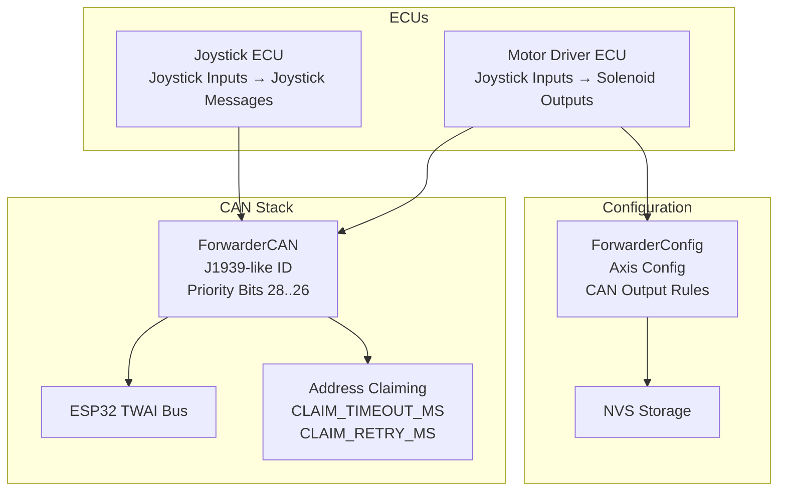
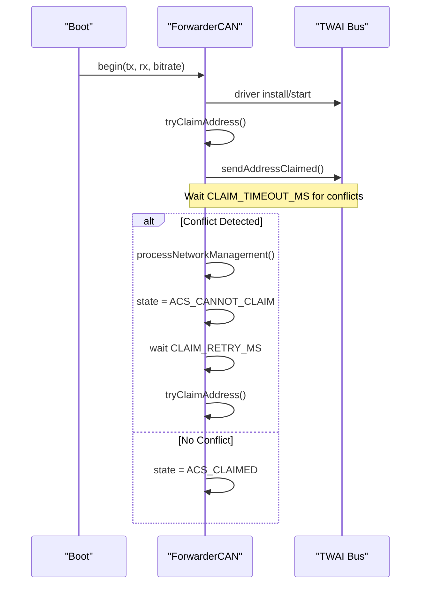
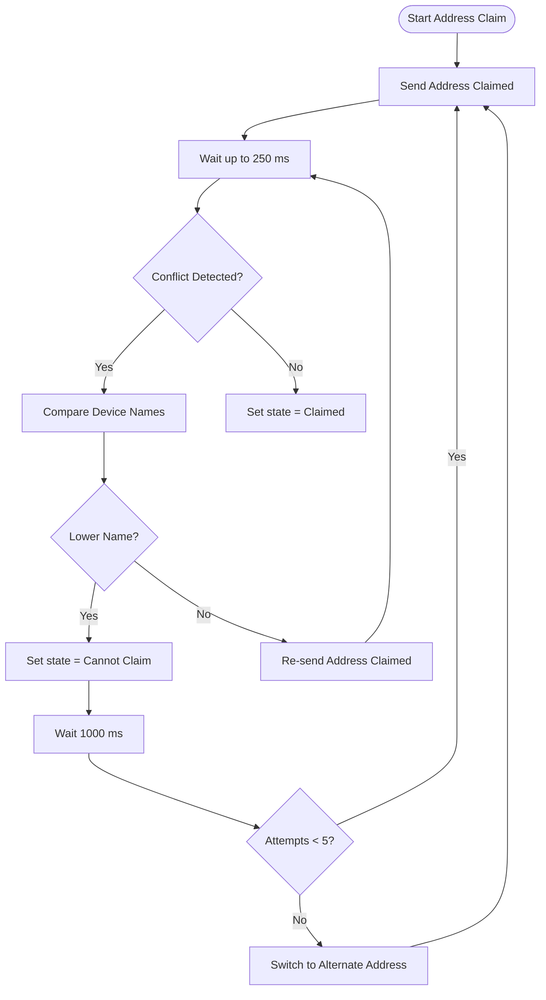
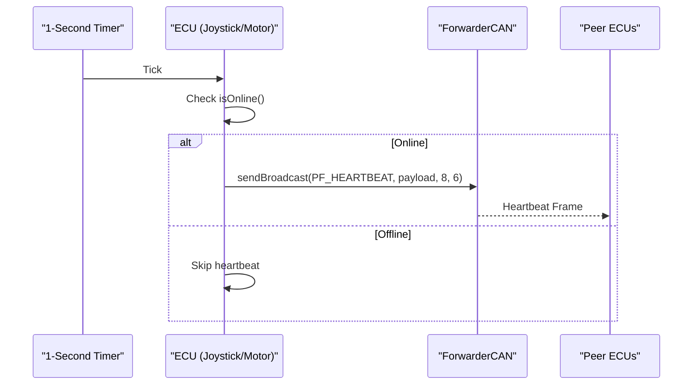
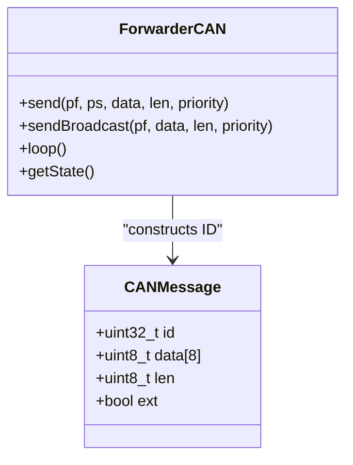
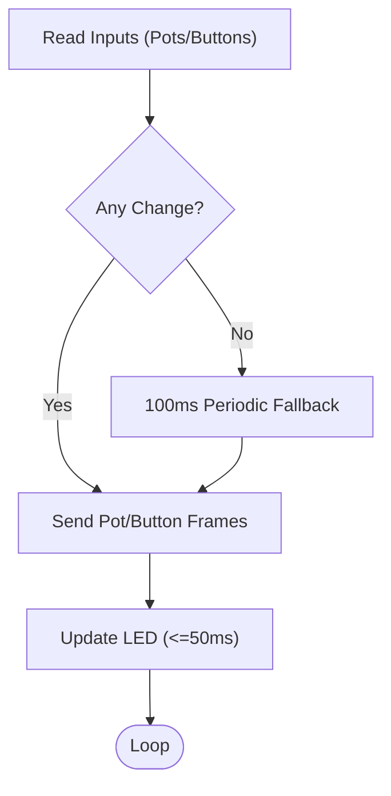
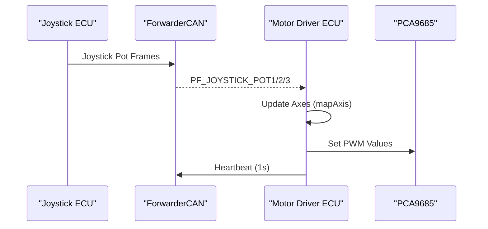
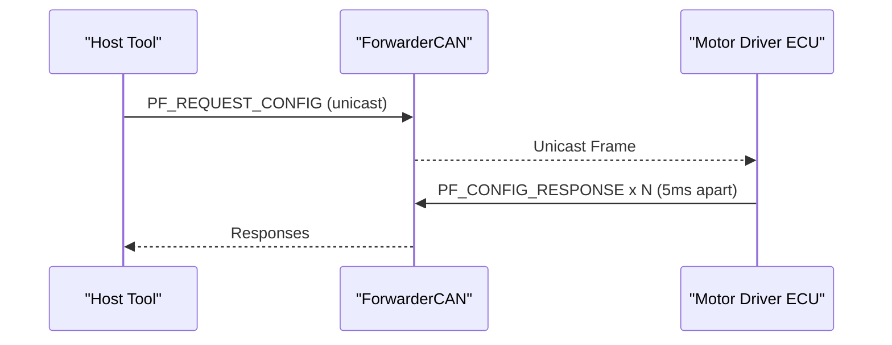
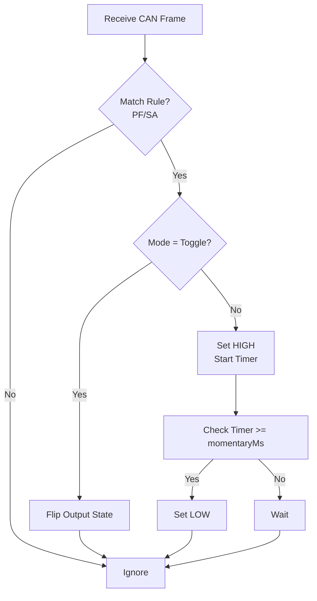
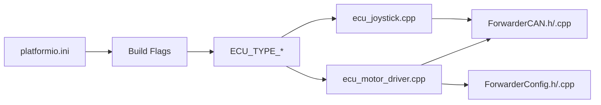

# Protocol Timing and Sequencing

<cite>
**Referenced Files in This Document**
- [main.cpp](file://src/main.cpp)
- [ForwarderCAN.h](file://lib/ForwarderCAN/ForwarderCAN.h)
- [ForwarderCAN.cpp](file://lib/ForwarderCAN/ForwarderCAN.cpp)
- [ecu_joystick.cpp](file://src/ecu_joystick.cpp)
- [ecu_motor_driver.cpp](file://src/ecu_motor_driver.cpp)
- [can_output.cpp](file://src/can_output.cpp)
- [ForwarderConfig.h](file://lib/ForwarderConfig/ForwarderConfig.h)
- [platformio.ini](file://platformio.ini)
</cite>

## Table of Contents
1. [Introduction](#introduction)
2. [Project Structure](#project-structure)
3. [Core Components](#core-components)
4. [Architecture Overview](#architecture-overview)
5. [Detailed Component Analysis](#detailed-component-analysis)
6. [Dependency Analysis](#dependency-analysis)
7. [Performance Considerations](#performance-considerations)
8. [Troubleshooting Guide](#troubleshooting-guide)
9. [Conclusion](#conclusion)

## Introduction
This document explains the CAN protocol timing and message sequencing used by ForwarderKE. It focuses on:
- Address claiming operations and their timing constraints
- Heartbeat message transmission patterns
- Message queuing and transmission priorities based on J1939 priority bits
- Timing considerations for joystick input reporting, solenoid command execution, and configuration handling
- Real-time operation constraints and potential conflicts between ECU types
- Guidance for optimizing timing parameters across operational scenarios

## Project Structure
ForwarderKE consists of two ECU types (selected at build time) and a shared CAN stack:
- ECU types:
  - Joystick controller: reads analog inputs and buttons, reports joystick data, supports LED control and identification
  - Motor driver: controls solenoids via PCA9685 PWM channels, receives joystick data, handles solenoid commands, and manages configuration
- Shared CAN stack:
  - Implements J1939-like 29-bit ID layout with priority bits (28-26)
  - Handles address claiming, arbitration, and bus-off recovery
  - Provides broadcast and unicast messaging with configurable priority

**Diagram sources**
- [main.cpp:11-17](file://src/main.cpp#L11-L17)
- [ForwarderCAN.h:66-119](file://lib/ForwarderCAN/ForwarderCAN.h#L66-L119)
- [ForwarderCAN.cpp:13-51](file://lib/ForwarderCAN/ForwarderCAN.cpp#L13-L51)
- [ecu_joystick.cpp:159-192](file://src/ecu_joystick.cpp#L159-L192)
- [ecu_motor_driver.cpp:290-325](file://src/ecu_motor_driver.cpp#L290-L325)
- [ForwarderConfig.h:64-91](file://lib/ForwarderConfig/ForwarderConfig.h#L64-L91)

**Section sources**
- [main.cpp:11-17](file://src/main.cpp#L11-L17)
- [platformio.ini:17-30](file://platformio.ini#L17-L30)
- [platformio.ini:31-62](file://platformio.ini#L31-L62)

## Core Components
- ForwarderCAN: Implements J1939-like ID layout, address claiming, arbitration, and bus state monitoring. Defines timing constants for address claiming and provides send/receive primitives.
- ECU Joystick: Reads analog inputs and buttons, sends joystick data periodically, and emits heartbeats. Uses a fixed periodicity for input reporting and heartbeat transmission.
- ECU Motor Driver: Receives joystick data, maps to solenoid outputs, applies safety timeouts, and emits heartbeats. Processes solenoid commands and configuration requests.
- CAN Output Rules: Allows GPIO pins to be triggered by incoming CAN messages according to PF/SA filters and modes (toggle/momentary).
- ForwarderConfig: Stores and retrieves axis mapping, CAN output rules, and forced addresses.

**Section sources**
- [ForwarderCAN.h:66-119](file://lib/ForwarderCAN/ForwarderCAN.h#L66-L119)
- [ForwarderCAN.cpp:79-119](file://lib/ForwarderCAN/ForwarderCAN.cpp#L79-L119)
- [ecu_joystick.cpp:194-236](file://src/ecu_joystick.cpp#L194-L236)
- [ecu_motor_driver.cpp:327-352](file://src/ecu_motor_driver.cpp#L327-L352)
- [can_output.cpp:7-65](file://src/can_output.cpp#L7-L65)
- [ForwarderConfig.h:64-91](file://lib/ForwarderConfig/ForwarderConfig.h#L64-L91)

## Architecture Overview
The system uses a J1939-like 29-bit identifier with priority bits in positions 28..26. Address claiming is performed before normal operation, with strict timing windows. Heartbeats are transmitted at regular intervals to signal liveness and health metrics. ECU-specific message types carry joystick inputs, solenoid commands, LED control, identification, and configuration data.

**Diagram sources**
- [ForwarderCAN.cpp:13-51](file://lib/ForwarderCAN/ForwarderCAN.cpp#L13-L51)
- [ForwarderCAN.cpp:54-61](file://lib/ForwarderCAN/ForwarderCAN.cpp#L54-L61)
- [ForwarderCAN.cpp:63-77](file://lib/ForwarderCAN/ForwarderCAN.cpp#L63-L77)
- [ForwarderCAN.cpp:92-109](file://lib/ForwarderCAN/ForwarderCAN.cpp#L92-L109)
- [ForwarderCAN.cpp:121-142](file://lib/ForwarderCAN/ForwarderCAN.cpp#L121-L142)

## Detailed Component Analysis

### Address Claiming and Timing
- Timing constants:
  - CLAIM_TIMEOUT_MS: 250 ms window after sending Address Claimed to detect conflicts
  - CLAIM_RETRY_MS: 1000 ms backoff before retrying address claim
  - MAX_CLAIM_ATTEMPTS: 5 attempts before switching to an alternate address derived from device name
- Behavior:
  - On startup, the module begins address claiming with a 250 ms timeout
  - If another device claims the same address, arbitration occurs by comparing device names; the lower name wins
  - If arbitration fails, the module waits 1000 ms and retries up to 5 times, then switches to an alternate address
- Priority during claiming:
  - Address Claimed messages are sent with priority 6 (highest)

**Diagram sources**
- [ForwarderCAN.h:110-112](file://lib/ForwarderCAN/ForwarderCAN.h#L110-L112)
- [ForwarderCAN.cpp:54-61](file://lib/ForwarderCAN/ForwarderCAN.cpp#L54-L61)
- [ForwarderCAN.cpp:92-109](file://lib/ForwarderCAN/ForwarderCAN.cpp#L92-L109)
- [ForwarderCAN.cpp:121-142](file://lib/ForwarderCAN/ForwarderCAN.cpp#L121-L142)

**Section sources**
- [ForwarderCAN.h:110-112](file://lib/ForwarderCAN/ForwarderCAN.h#L110-L112)
- [ForwarderCAN.cpp:92-109](file://lib/ForwarderCAN/ForwarderCAN.cpp#L92-L109)
- [ForwarderCAN.cpp:121-142](file://lib/ForwarderCAN/ForwarderCAN.cpp#L121-L142)

### Heartbeat Transmission Patterns
- Both ECUs transmit heartbeats at 1-second intervals when the CAN bus is online.
- Heartbeat payload includes:
  - Online status flag
  - Uptime seconds
  - RX/TX counters
  - ECU-specific fields (e.g., number of PCA channels)
- Purpose:
  - System health monitoring
  - Module discovery and type detection by external tools

**Diagram sources**
- [ecu_joystick.cpp:226-231](file://src/ecu_joystick.cpp#L226-L231)
- [ecu_motor_driver.cpp:341-346](file://src/ecu_motor_driver.cpp#L341-L346)
- [ForwarderCAN.cpp:169-171](file://lib/ForwarderCAN/ForwarderCAN.cpp#L169-L171)

**Section sources**
- [ecu_joystick.cpp:146-157](file://src/ecu_joystick.cpp#L146-L157)
- [ecu_motor_driver.cpp:277-288](file://src/ecu_motor_driver.cpp#L277-L288)
- [ForwarderCAN.cpp:169-171](file://lib/ForwarderCAN/ForwarderCAN.cpp#L169-L171)

### Message Queuing and Transmission Priorities
- J1939 priority bits (28-26):
  - Priority 6 is used for Address Claimed and heartbeats
  - Default priority is configurable via build flag PROTOCOL_PRIORITY_DEFAULT
- ForwarderCAN.send() constructs the 29-bit ID using priority, PF, PS, and SA
- During address claiming, only Address Claimed frames are permitted until the module transitions to ACS_CLAIMED

**Diagram sources**
- [ForwarderCAN.h:22-27](file://lib/ForwarderCAN/ForwarderCAN.h#L22-L27)
- [ForwarderCAN.h:144-171](file://lib/ForwarderCAN/ForwarderCAN.h#L144-L171)
- [ForwarderCAN.cpp:144-171](file://lib/ForwarderCAN/ForwarderCAN.cpp#L144-L171)

**Section sources**
- [ForwarderCAN.h:9-15](file://lib/ForwarderCAN/ForwarderCAN.h#L9-L15)
- [ForwarderCAN.h:144-171](file://lib/ForwarderCAN/ForwarderCAN.h#L144-L171)
- [ForwarderCAN.cpp:144-171](file://lib/ForwarderCAN/ForwarderCAN.cpp#L144-L171)
- [platformio.ini:12-15](file://platformio.ini#L12-L15)

### Joystick Input Reporting Timing
- Input sampling and reporting:
  - Potentiometer values are sent when change exceeds a small threshold (hysteresis)
  - Buttons are sent when state changes
  - A periodic fallback ensures periodic updates every 100 ms when no change is detected
- LED updates are throttled to ~50 ms intervals
- Identification mode blinks LEDs for 3 seconds upon receiving an identification frame

**Diagram sources**
- [ecu_joystick.cpp:194-236](file://src/ecu_joystick.cpp#L194-L236)
- [ecu_joystick.cpp:63-68](file://src/ecu_joystick.cpp#L63-L68)
- [ecu_joystick.cpp:99-112](file://src/ecu_joystick.cpp#L99-L112)
- [ecu_joystick.cpp:70-97](file://src/ecu_joystick.cpp#L70-L97)

**Section sources**
- [ecu_joystick.cpp:194-236](file://src/ecu_joystick.cpp#L194-L236)
- [ecu_joystick.cpp:63-68](file://src/ecu_joystick.cpp#L63-L68)
- [ecu_joystick.cpp:99-112](file://src/ecu_joystick.cpp#L99-L112)

### Solenoid Command Execution Timing
- Solenoid commands:
  - Received via PF_SOLENOID_CMD with 8-byte payload; each byte maps to a 12-bit PWM value
  - Applied immediately to PCA9685 channels; blink indicators activated for feedback
- Joystick-to-solenoid mapping:
  - Motor driver tracks joystick pot values per source address and updates solenoids when inputs change
  - Deadband and directionality are applied before mapping to PWM
- Safety timeout:
  - If joystick updates stop for SAFETY_TIMEOUT_MS (default 500 ms), solenoids are turned off

**Diagram sources**
- [ecu_motor_driver.cpp:184-275](file://src/ecu_motor_driver.cpp#L184-L275)
- [ecu_motor_driver.cpp:137-151](file://src/ecu_motor_driver.cpp#L137-L151)
- [ecu_motor_driver.cpp:101-135](file://src/ecu_motor_driver.cpp#L101-L135)
- [ecu_motor_driver.cpp:332-337](file://src/ecu_motor_driver.cpp#L332-L337)

**Section sources**
- [ecu_motor_driver.cpp:184-275](file://src/ecu_motor_driver.cpp#L184-L275)
- [ecu_motor_driver.cpp:137-151](file://src/ecu_motor_driver.cpp#L137-L151)
- [ecu_motor_driver.cpp:101-135](file://src/ecu_motor_driver.cpp#L101-L135)
- [ecu_motor_driver.cpp:332-337](file://src/ecu_motor_driver.cpp#L332-L337)

### Configuration Message Handling
- Configuration axis updates:
  - PF_CONFIG_AXIS carries packed axis configuration; stored and persisted via ForwarderConfig
- Request configuration:
  - PF_REQUEST_CONFIG triggers the motor driver to respond with PF_CONFIG_RESPONSE for each axis with 5 ms inter-frame spacing
- CAN output rules:
  - PF_CONFIG_AXIS can also configure CAN-triggered GPIO outputs (toggle/momentary) with a momentary duration

**Diagram sources**
- [ecu_motor_driver.cpp:257-267](file://src/ecu_motor_driver.cpp#L257-L267)
- [ecu_motor_driver.cpp:246-256](file://src/ecu_motor_driver.cpp#L246-L256)
- [ForwarderConfig.h:28-39](file://lib/ForwarderConfig/ForwarderConfig.h#L28-L39)

**Section sources**
- [ecu_motor_driver.cpp:257-267](file://src/ecu_motor_driver.cpp#L257-L267)
- [ecu_motor_driver.cpp:246-256](file://src/ecu_motor_driver.cpp#L246-L256)
- [ForwarderConfig.h:28-39](file://lib/ForwarderConfig/ForwarderConfig.h#L28-L39)

### CAN Output Rules and Momentary Mode
- Rules are matched by PF/SA and can trigger GPIO pins in two modes:
  - Toggle: flip output state on each match
  - Momentary: set pin HIGH for a configured duration, then LOW
- Momentary timers are checked in the loop to revert the output

**Diagram sources**
- [can_output.cpp:29-61](file://src/can_output.cpp#L29-L61)
- [ForwarderConfig.h:28-39](file://lib/ForwarderConfig/ForwarderConfig.h#L28-L39)

**Section sources**
- [can_output.cpp:29-61](file://src/can_output.cpp#L29-L61)
- [ForwarderConfig.h:28-39](file://lib/ForwarderConfig/ForwarderConfig.h#L28-L39)

## Dependency Analysis
- Build-time selection:
  - ECU_TYPE_MOTOR_DRIVER or ECU_TYPE_JOYSTICK determines which ECU code is compiled
  - Preferred addresses and ECU names are defined per environment
- Runtime dependencies:
  - ECU code depends on ForwarderCAN for transport and address management
  - Motor driver depends on ForwarderConfig for persistent settings and CAN output rules
  - Both ECUs rely on the ESP32 TWAI driver for physical bus access

**Diagram sources**
- [platformio.ini:12-15](file://platformio.ini#L12-L15)
- [platformio.ini:17-30](file://platformio.ini#L17-L30)
- [platformio.ini:31-62](file://platformio.ini#L31-L62)
- [ecu_joystick.cpp:159-192](file://src/ecu_joystick.cpp#L159-L192)
- [ecu_motor_driver.cpp:290-325](file://src/ecu_motor_driver.cpp#L290-L325)
- [ForwarderCAN.h:66-119](file://lib/ForwarderCAN/ForwarderCAN.h#L66-L119)
- [ForwarderConfig.h:64-91](file://lib/ForwarderConfig/ForwarderConfig.h#L64-L91)

**Section sources**
- [platformio.ini:12-15](file://platformio.ini#L12-L15)
- [platformio.ini:17-30](file://platformio.ini#L17-L30)
- [platformio.ini:31-62](file://platformio.ini#L31-L62)

## Performance Considerations
- Real-time constraints:
  - Address claiming must complete within 250 ms to avoid conflicts; retries occur every 1000 ms
  - Heartbeats are transmitted at 1-second intervals to balance visibility and bandwidth
  - Joystick reporting uses a 100 ms fallback to maintain responsiveness without flooding the bus
- Bandwidth and priority:
  - Higher priority (6) is used for critical frames (address claim, heartbeat)
  - Default priority can be adjusted via build flags to accommodate different bus profiles
- Safety:
  - Motor driver applies a 500 ms safety timeout to turn off solenoids if joystick updates cease
- Potential conflicts:
  - Different ECU types (joystick vs motor driver) operate on the same bus; conflicts are resolved by arbitration during address claiming
  - Properly configured preferred addresses reduce contention

[No sources needed since this section provides general guidance]

## Troubleshooting Guide
- Address claiming fails repeatedly:
  - Verify CLAIM_TIMEOUT_MS and CLAIM_RETRY_MS timing align with network conditions
  - Confirm MAX_CLAIM_ATTEMPTS and alternate address derivation logic
- Bus-off state:
  - The CAN stack automatically initiates recovery; monitor error counts and TX/RX statistics
- Heartbeat missing:
  - Ensure the ECU is online (ACS_CLAIMED) and the 1-second timer is active
  - Check that send operations are permitted only when the module is claimed
- Solenoid not responding:
  - Confirm joystick inputs are being received and within the deadband thresholds
  - Verify SAFETY_TIMEOUT_MS has not tripped due to lack of updates
- CAN output rules not triggering:
  - Validate PF/SA filters and GPIO pin assignments
  - For momentary mode, confirm the momentaryMs duration and loop timer checks

**Section sources**
- [ForwarderCAN.cpp:82-89](file://lib/ForwarderCAN/ForwarderCAN.cpp#L82-L89)
- [ForwarderCAN.cpp:92-109](file://lib/ForwarderCAN/ForwarderCAN.cpp#L92-L109)
- [ecu_motor_driver.cpp:332-337](file://src/ecu_motor_driver.cpp#L332-L337)
- [can_output.cpp:51-61](file://src/can_output.cpp#L51-L61)

## Conclusion
ForwarderKE implements deterministic CAN timing around address claiming, heartbeat transmission, and ECU-specific message handling. The J1939 priority field enables predictable scheduling, while explicit timing constants govern arbitration and retries. By tuning build-time priorities and runtime intervals, operators can optimize responsiveness and reliability across diverse operational scenarios.