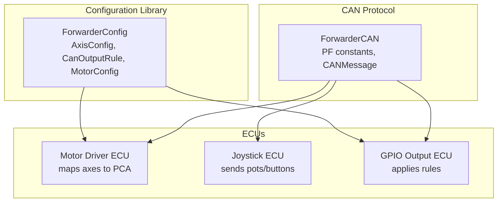
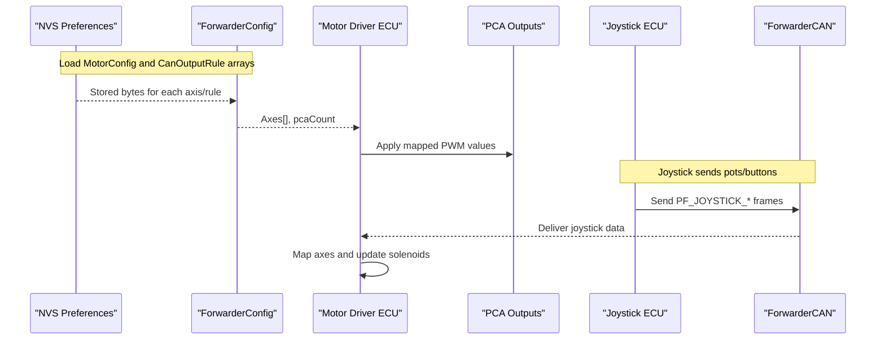
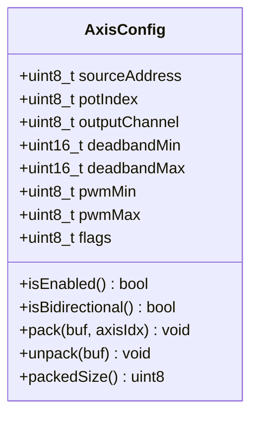
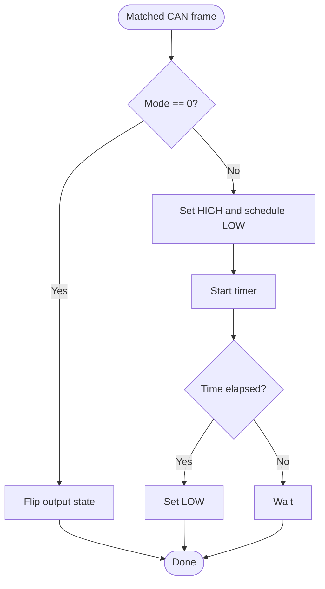
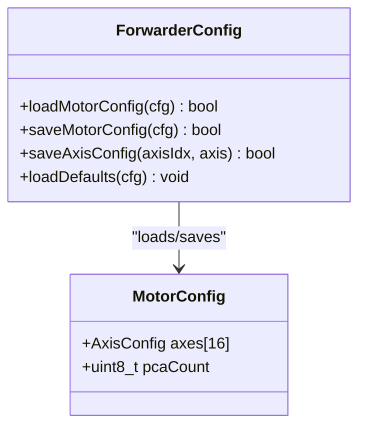
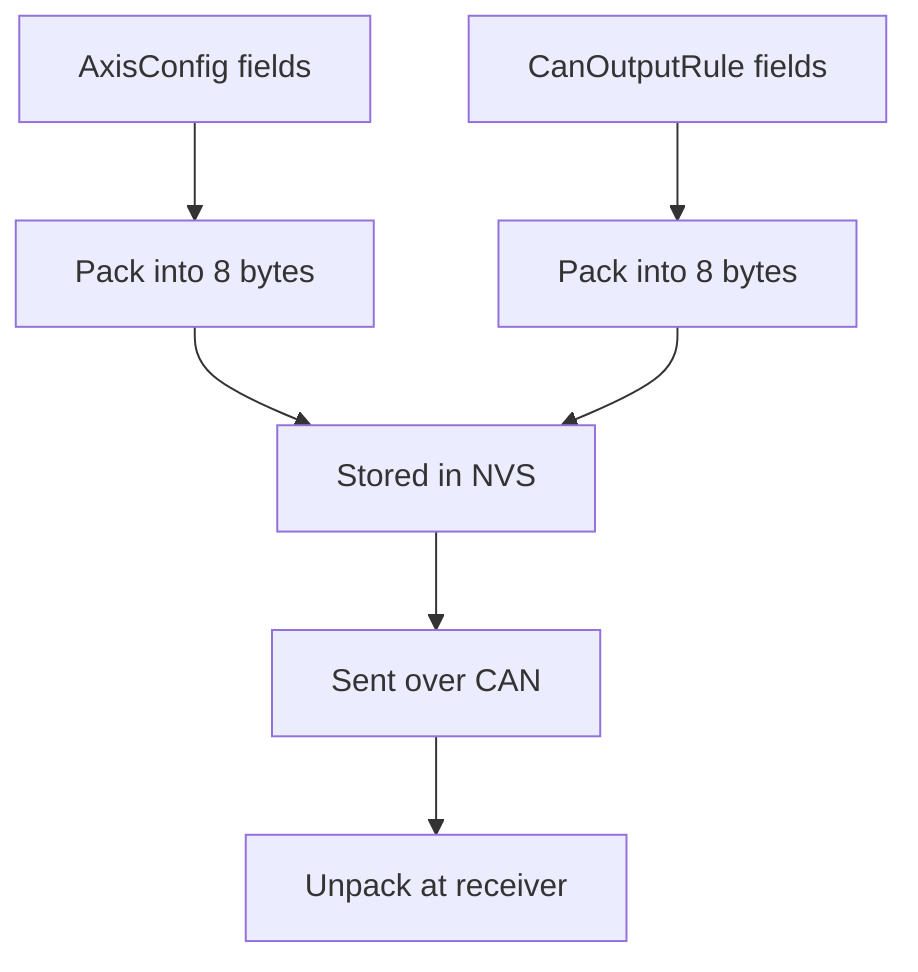
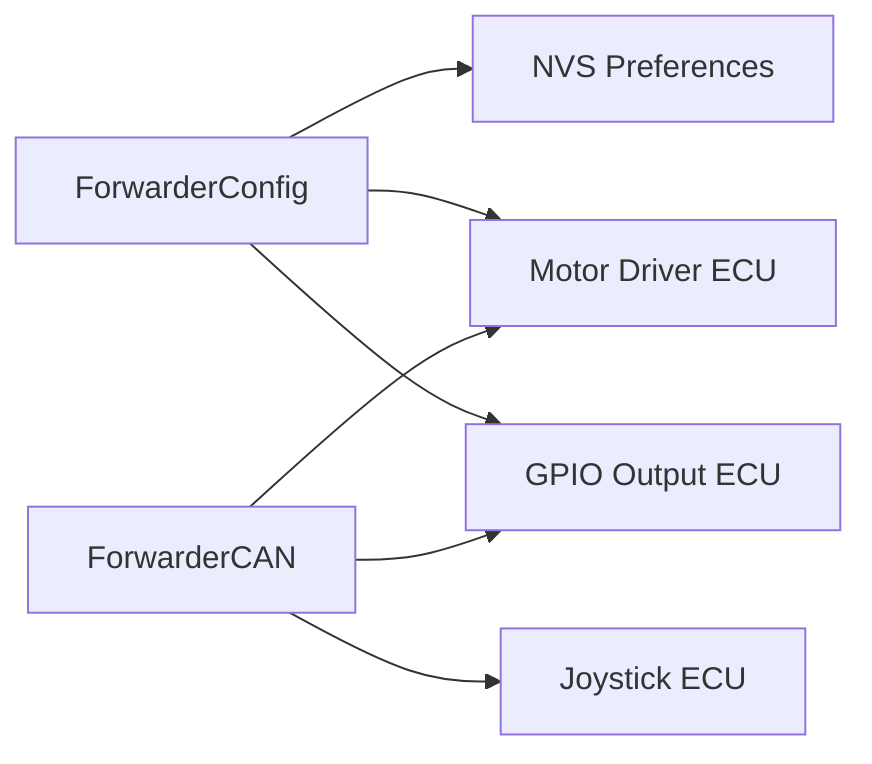

# Configuration Data Models

<cite>
**Referenced Files in This Document**
- [ForwarderConfig.h](file://lib/ForwarderConfig/ForwarderConfig.h)
- [ForwarderConfig.cpp](file://lib/ForwarderConfig/ForwarderConfig.cpp)
- [ForwarderCAN.h](file://lib/ForwarderCAN/ForwarderCAN.h)
- [ecu_motor_driver.cpp](file://src/ecu_motor_driver.cpp)
- [ecu_joystick.cpp](file://src/ecu_joystick.cpp)
- [can_output.cpp](file://src/can_output.cpp)
- [main.cpp](file://src/main.cpp)
</cite>

## Table of Contents
1. [Introduction](#introduction)
2. [Project Structure](#project-structure)
3. [Core Components](#core-components)
4. [Architecture Overview](#architecture-overview)
5. [Detailed Component Analysis](#detailed-component-analysis)
6. [Dependency Analysis](#dependency-analysis)
7. [Performance Considerations](#performance-considerations)
8. [Troubleshooting Guide](#troubleshooting-guide)
9. [Conclusion](#conclusion)
10. [Appendices](#appendices)

## Introduction
This document describes the configuration data models used by ForwarderKE’s persistent storage system. It focuses on:
- AxisConfig: joystick-to-solenoid mapping with sourceAddress, potIndex, outputChannel, deadband settings, PWM ranges, and flags
- CanOutputRule: GPIO control rules matched by CAN frame fields
- MotorConfig: aggregation of multiple AxisConfig entries and PCA controller management
- Packed data format for CAN transport efficiency and bit field packing
- Serialization/deserialization methods and field definitions
- Field ranges, defaults, and relationships between structures
- Practical examples of initialization, modification, and validation

## Project Structure
The configuration models live in a dedicated library and are consumed by ECU applications:
- lib/ForwarderConfig: defines AxisConfig, CanOutputRule, MotorConfig, and persistence helpers
- lib/ForwarderCAN: defines CAN protocol constants and message structures
- src/ecu_motor_driver: reads persisted configuration, maps joystick inputs to solenoids, and updates PCA outputs
- src/ecu_joystick: sends joystick inputs and receives remote commands
- src/can_output: applies GPIO rules based on incoming CAN frames

**Diagram sources**
- [ForwarderConfig.h:1-92](file://lib/ForwarderConfig/ForwarderConfig.h#L1-L92)
- [ForwarderCAN.h:32-72](file://lib/ForwarderCAN/ForwarderCAN.h#L32-L72)
- [ecu_motor_driver.cpp:290-325](file://src/ecu_motor_driver.cpp#L290-L325)
- [ecu_joystick.cpp:159-192](file://src/ecu_joystick.cpp#L159-L192)
- [can_output.cpp:7-19](file://src/can_output.cpp#L7-L19)

**Section sources**
- [main.cpp:11-17](file://src/main.cpp#L11-L17)
- [ForwarderConfig.h:1-92](file://lib/ForwarderConfig/ForwarderConfig.h#L1-L92)
- [ForwarderCAN.h:32-72](file://lib/ForwarderCAN/ForwarderCAN.h#L32-L72)

## Core Components
This section documents the three primary configuration structures and their roles.

- AxisConfig
  - Purpose: Defines how a joystick input maps to a PCA output channel
  - Fields: sourceAddress, potIndex, outputChannel, deadbandMin, deadbandMax, pwmMin, pwmMax, flags
  - Flags: ENABLED, BIDIRECTIONAL
  - Serialization: pack/unpack into 8-byte CAN payload
- CanOutputRule
  - Purpose: Controls a GPIO pin based on matching CAN frame fields
  - Fields: enabled, matchPF, matchSA, gpioPin, mode, momentaryMs
  - Modes: toggle (0), momentary (1)
  - Serialization: pack/unpack into 8-byte CAN payload
- MotorConfig
  - Purpose: Aggregates AxisConfig entries and PCA controller count
  - Fields: axes[16], pcaCount
  - Defaults: pcaCount = 2, per-axis defaults loaded from NVS or factory defaults

**Section sources**
- [ForwarderConfig.h:29-62](file://lib/ForwarderConfig/ForwarderConfig.h#L29-L62)
- [ForwarderConfig.cpp:6-49](file://lib/ForwarderConfig/ForwarderConfig.cpp#L6-L49)
- [ForwarderConfig.cpp:76-127](file://lib/ForwarderConfig/ForwarderConfig.cpp#L76-L127)
- [ForwarderConfig.cpp:129-169](file://lib/ForwarderConfig/ForwarderConfig.cpp#L129-L169)
- [ForwarderConfig.cpp:171-183](file://lib/ForwarderConfig/ForwarderConfig.cpp#L171-L183)

## Architecture Overview
The configuration system integrates persistent storage with runtime mapping and CAN transport.

**Diagram sources**
- [ForwarderConfig.cpp:76-127](file://lib/ForwarderConfig/ForwarderConfig.cpp#L76-L127)
- [ecu_motor_driver.cpp:137-151](file://src/ecu_motor_driver.cpp#L137-L151)
- [ecu_motor_driver.cpp:192-218](file://src/ecu_motor_driver.cpp#L192-L218)
- [ForwarderCAN.h:39-50](file://lib/ForwarderCAN/ForwarderCAN.h#L39-L50)

## Detailed Component Analysis

### AxisConfig
AxisConfig maps a joystick input to a PCA output channel with configurable deadbands and PWM limits.

- Field definitions and ranges
  - sourceAddress: 0–255 (Joystick source address)
  - potIndex: 0–3 (0=Pot1, 1=Pot2, 2=Pot3)
  - outputChannel: 0–15 (2x PCA9685 channels)
  - deadbandMin: 0–1023 (ADC raw)
  - deadbandMax: 0–1023 (ADC raw)
  - pwmMin: 0–255 (scaled to 12-bit output)
  - pwmMax: 0–255 (scaled to 12-bit output)
  - flags: bitfield composed of ENABLED and BIDIRECTIONAL
- Bit field packing in CAN payload
  - Byte 2 encodes: (potIndex << 6) | (outputChannel << 2) | flags
  - Bytes 3–4: deadbandMin/4, deadbandMax/4
  - Bytes 5–6: pwmMin, pwmMax
- Runtime mapping
  - Bidirectional mode: negative/positive regions mapped to reverse/fwd PWM
  - Unidirectional mode: forward-only mapping above deadbandMax
- Defaults
  - Factory defaults initialize deadband and PWM ranges for safe operation

**Diagram sources**
- [ForwarderConfig.h:41-57](file://lib/ForwarderConfig/ForwarderConfig.h#L41-L57)

**Section sources**
- [ForwarderConfig.h:41-57](file://lib/ForwarderConfig/ForwarderConfig.h#L41-L57)
- [ForwarderConfig.cpp:6-26](file://lib/ForwarderConfig/ForwarderConfig.cpp#L6-L26)
- [ecu_motor_driver.cpp:101-135](file://src/ecu_motor_driver.cpp#L101-L135)
- [ForwarderConfig.cpp:171-183](file://lib/ForwarderConfig/ForwarderConfig.cpp#L171-L183)

### CanOutputRule
CanOutputRule controls a GPIO pin based on matching CAN frame fields.

- Field definitions and ranges
  - enabled: boolean
  - matchPF: 0–255 (PDU Format)
  - matchSA: 0–255 (Source Address; 0 means any)
  - gpioPin: 0–255 (GPIO pin; 0 disables)
  - mode: 0 (toggle), 1 (momentary)
  - momentaryMs: 0–65535 ms (momentary duration)
- Bit field packing in CAN payload
  - Byte 0: enabled flag
  - Bytes 1–2: matchPF, matchSA
  - Byte 3: gpioPin
  - Byte 4: mode
  - Bytes 5–6: momentaryMs (little-endian)
- Behavior
  - Toggle mode flips output state on match
  - Momentary mode sets output HIGH then returns LOW after timeout

**Diagram sources**
- [can_output.cpp:29-61](file://src/can_output.cpp#L29-L61)
- [ForwarderConfig.h:29-39](file://lib/ForwarderConfig/ForwarderConfig.h#L29-L39)

**Section sources**
- [ForwarderConfig.h:29-39](file://lib/ForwarderConfig/ForwarderConfig.h#L29-L39)
- [ForwarderConfig.cpp:31-49](file://lib/ForwarderConfig/ForwarderConfig.cpp#L31-L49)
- [can_output.cpp:7-61](file://src/can_output.cpp#L7-L61)

### MotorConfig
MotorConfig aggregates AxisConfig entries and manages PCA controller count.

- Fields
  - axes[16]: Array of AxisConfig entries
  - pcaCount: 1 or 2 (controls total channels: 8 or 16)
- Persistence
  - Stored per-axis bytes and pcaCount in NVS
  - Factory defaults populate missing keys
- Runtime usage
  - Motor driver loads MotorConfig at startup
  - Updates solenoid PWM based on mapped axes

**Diagram sources**
- [ForwarderConfig.h:59-62](file://lib/ForwarderConfig/ForwarderConfig.h#L59-L62)
- [ForwarderConfig.cpp:76-127](file://lib/ForwarderConfig/ForwarderConfig.cpp#L76-L127)

**Section sources**
- [ForwarderConfig.h:59-62](file://lib/ForwarderConfig/ForwarderConfig.h#L59-L62)
- [ForwarderConfig.cpp:76-127](file://lib/ForwarderConfig/ForwarderConfig.cpp#L76-L127)

### Packed Data Format and Transport Efficiency
- 8-byte CAN payload layout for AxisConfig
  - Byte 0: axis index
  - Byte 1: sourceAddress
  - Byte 2: (potIndex << 6) | (outputChannel << 2) | flags
  - Byte 3: deadbandMin / 4
  - Byte 4: deadbandMax / 4
  - Byte 5: pwmMin
  - Byte 6: pwmMax
  - Byte 7: reserved
- 8-byte CAN payload layout for CanOutputRule
  - Byte 0: enabled
  - Byte 1: matchPF
  - Byte 2: matchSA
  - Byte 3: gpioPin
  - Byte 4: mode
  - Bytes 5–6: momentaryMs (LE)
  - Byte 7: reserved
- Rationale
  - Compact representation reduces bandwidth and simplifies NVS storage
  - Bit field packing minimizes wasted bits
  - Scaling factors (e.g., deadbandMin/4) compress ranges into 8-bit storage

**Diagram sources**
- [ForwarderConfig.h:9-18](file://lib/ForwarderConfig/ForwarderConfig.h#L9-L18)
- [ForwarderConfig.cpp:6-26](file://lib/ForwarderConfig/ForwarderConfig.cpp#L6-L26)
- [ForwarderConfig.cpp:31-49](file://lib/ForwarderConfig/ForwarderConfig.cpp#L31-L49)

**Section sources**
- [ForwarderConfig.h:9-18](file://lib/ForwarderConfig/ForwarderConfig.h#L9-L18)
- [ForwarderConfig.cpp:6-26](file://lib/ForwarderConfig/ForwarderConfig.cpp#L6-L26)
- [ForwarderConfig.cpp:31-49](file://lib/ForwarderConfig/ForwarderConfig.cpp#L31-L49)

## Dependency Analysis
- ForwarderConfig depends on NVS Preferences for persistence
- Motor driver depends on ForwarderConfig for loading MotorConfig and applying PCA outputs
- CAN protocol constants define PF values used by both motor driver and joystick ECUs
- GPIO output module depends on ForwarderConfig for CanOutputRule arrays

**Diagram sources**
- [ForwarderConfig.cpp:56-74](file://lib/ForwarderConfig/ForwarderConfig.cpp#L56-L74)
- [ecu_motor_driver.cpp:290-325](file://src/ecu_motor_driver.cpp#L290-L325)
- [can_output.cpp:7-19](file://src/can_output.cpp#L7-L19)
- [ForwarderCAN.h:39-50](file://lib/ForwarderCAN/ForwarderCAN.h#L39-L50)

**Section sources**
- [ForwarderConfig.cpp:56-74](file://lib/ForwarderConfig/ForwarderConfig.cpp#L56-L74)
- [ecu_motor_driver.cpp:290-325](file://src/ecu_motor_driver.cpp#L290-L325)
- [can_output.cpp:7-19](file://src/can_output.cpp#L7-L19)
- [ForwarderCAN.h:39-50](file://lib/ForwarderCAN/ForwarderCAN.h#L39-L50)

## Performance Considerations
- Bit field packing reduces payload size and NVS footprint
- Scaling factors (e.g., deadbandMin/4) trade precision for compactness; adjust only if needed
- PCA refresh rate and safety timeouts prevent stuck outputs
- CAN broadcast messages should be rate-limited to reduce bus load

## Troubleshooting Guide
- Address conflicts
  - Use PF_SET_ADDRESS to change device address; persisted forced address is stored in NVS
- Configuration not applied
  - Verify NVS keys exist; missing keys are populated with factory defaults
- GPIO rule not triggering
  - Confirm matchPF and matchSA align with incoming frames; gpioPin must be set and mode valid
- Solenoid not responding
  - Ensure axis is enabled and sourceAddress/potIndex point to a live joystick; check deadband thresholds

**Section sources**
- [ecu_motor_driver.cpp:234-244](file://src/ecu_motor_driver.cpp#L234-L244)
- [ecu_joystick.cpp:132-142](file://src/ecu_joystick.cpp#L132-L142)
- [ForwarderConfig.cpp:76-127](file://lib/ForwarderConfig/ForwarderConfig.cpp#L76-L127)
- [ForwarderConfig.cpp:129-169](file://lib/ForwarderConfig/ForwarderConfig.cpp#L129-L169)

## Conclusion
The configuration model provides a compact, efficient way to persist and distribute control settings across ForwarderKE ECUs. AxisConfig enables precise joystick-to-solenoid mapping with bidirectional support, CanOutputRule offers flexible GPIO control via CAN, and MotorConfig centralizes PCA management. The 8-byte packed format ensures transport efficiency while preserving essential tuning parameters.

## Appendices

### Field Definitions and Value Ranges
- AxisConfig
  - sourceAddress: 0–255
  - potIndex: 0–3
  - outputChannel: 0–15
  - deadbandMin: 0–1023
  - deadbandMax: 0–1023
  - pwmMin: 0–255
  - pwmMax: 0–255
  - flags: ENABLED, BIDIRECTIONAL
- CanOutputRule
  - enabled: true/false
  - matchPF: 0–255
  - matchSA: 0–255
  - gpioPin: 0–255 (0 disables)
  - mode: 0 (toggle), 1 (momentary)
  - momentaryMs: 0–65535
- MotorConfig
  - axes[16]: per-axis configuration
  - pcaCount: 1 or 2

**Section sources**
- [ForwarderConfig.h:41-62](file://lib/ForwarderConfig/ForwarderConfig.h#L41-L62)
- [ForwarderConfig.cpp:171-183](file://lib/ForwarderConfig/ForwarderConfig.cpp#L171-L183)

### Example Workflows

- Initialize and save MotorConfig
  - Load defaults if NVS is unavailable
  - Modify axes and pcaCount
  - Persist via ForwarderConfig

- Modify a single axis
  - Update fields in MotorConfig.axes[index]
  - Save via ForwarderConfig.saveAxisConfig(index, axis)

- Apply GPIO rules
  - Configure CanOutputRule array
  - Call ForwarderConfig.saveCanOutputRule(index, rule)
  - At runtime, can_output_process_can matches frames and toggles pins

- Validate configuration
  - Ensure sourceAddress/potIndex/outputChannel are within bounds
  - Verify deadbandMin < deadbandMax
  - Confirm pwmMin < pwmMax
  - For GPIO rules, ensure gpioPin > 0 when enabled

**Section sources**
- [ForwarderConfig.cpp:76-127](file://lib/ForwarderConfig/ForwarderConfig.cpp#L76-L127)
- [ForwarderConfig.cpp:129-169](file://lib/ForwarderConfig/ForwarderConfig.cpp#L129-L169)
- [can_output.cpp:29-61](file://src/can_output.cpp#L29-L61)