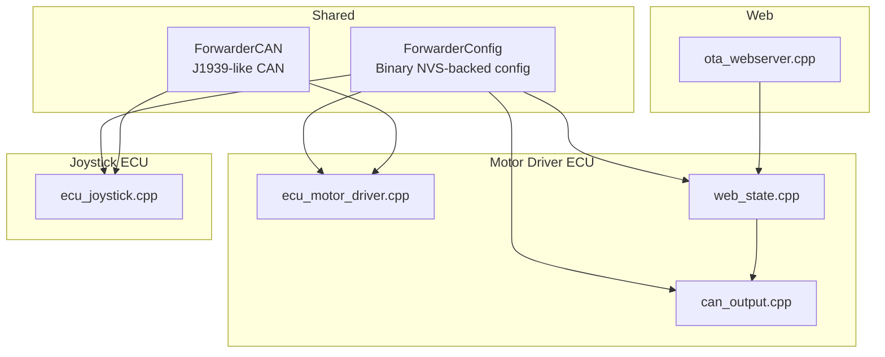
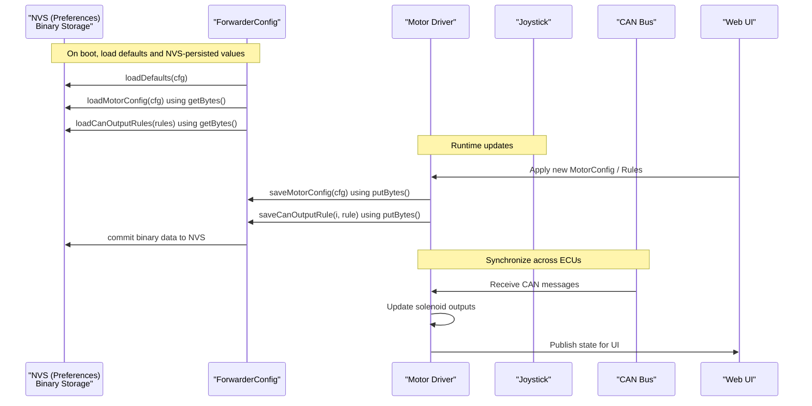
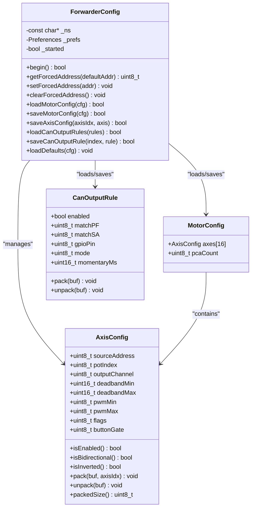
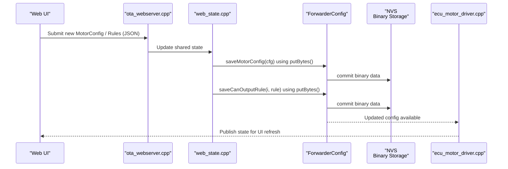
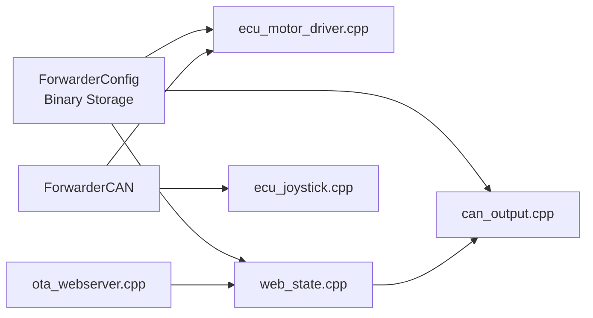

# Configuration Management

<cite>
**Referenced Files in This Document**
- [README.md](file://README.md)
- [platformio.ini](file://platformio.ini)
- [ForwarderConfig.h](file://lib/ForwarderConfig/ForwarderConfig.h)
- [ForwarderConfig.cpp](file://lib/ForwarderConfig/ForwarderConfig.cpp)
- [can_output.h](file://src/can_output.h)
- [can_output.cpp](file://src/can_output.cpp)
- [web_state.h](file://src/web_state.h)
- [web_state.cpp](file://src/web_state.cpp)
- [ota_webserver.h](file://src/ota_webserver.h)
- [ota_webserver.cpp](file://src/ota_webserver.cpp)
- [ecu_motor_driver.h](file://src/ecu_motor_driver.h)
- [ecu_motor_driver.cpp](file://src/ecu_motor_driver.cpp)
- [ecu_joystick.h](file://src/ecu_joystick.h)
- [ecu_joystick.cpp](file://src/ecu_joystick.cpp)
</cite>

## Update Summary
**Changes Made**
- Updated NVS implementation section to reflect transition from string-based to binary data storage
- Enhanced MotorConfig persistence documentation with binary storage details
- Added binary serialization/deserialization explanations
- Updated performance considerations to highlight memory efficiency improvements
- Revised troubleshooting guide with binary storage-specific guidance

## Table of Contents
1. [Introduction](#introduction)
2. [Project Structure](#project-structure)
3. [Core Components](#core-components)
4. [Architecture Overview](#architecture-overview)
5. [Detailed Component Analysis](#detailed-component-analysis)
6. [Dependency Analysis](#dependency-analysis)
7. [Performance Considerations](#performance-considerations)
8. [Troubleshooting Guide](#troubleshooting-guide)
9. [Conclusion](#conclusion)
10. [Appendices](#appendices)

## Introduction
This document describes the configuration management system for ForwarderKE, focusing on persistent storage and device settings. It explains how NVS (Non-Volatile Storage) is used to persist device configurations, axis mappings, and operational parameters using efficient binary data storage. It documents the configuration data structures, default loading, validation, persistence across reboots, and the web interface integration for configuration management and synchronization between ECUs.

## Project Structure
The configuration system spans shared libraries and per-ECU modules:
- Shared configuration library defines data structures and NVS-backed persistence APIs using binary serialization.
- Motor driver and joystick ECUs consume these structures and integrate with CAN and hardware.
- Web server and state expose runtime configuration for UI and OTA updates.

**Diagram sources**
- [ForwarderConfig.h:64-91](file://lib/ForwarderConfig/ForwarderConfig.h#L64-L91)
- [can_output.h:1-11](file://src/can_output.h#L1-L11)
- [web_state.h:8-23](file://src/web_state.h#L8-L23)
- [ota_webserver.h](file://src/ota_webserver.h)

**Section sources**
- [README.md:112-126](file://README.md#L112-L126)
- [platformio.ini:1-80](file://platformio.ini#L1-L80)

## Core Components
- ForwarderConfig: NVS-backed configuration manager providing:
  - Address override persistence using binary storage
  - Motor mapping configuration (AxisConfig arrays) with efficient binary serialization
  - CAN output rules (CanOutputRule) with compact binary format
  - Factory defaults loader with binary-safe initialization
- Data structures:
  - AxisConfig: joystick-to-solenoid mapping with deadbands, PWM scaling, and flags using 8-byte binary format
  - MotorConfig: container for up to 16 axes and PCA count with binary-packed storage
  - CanOutputRule: CAN-triggered GPIO output rules with matching and timing modes in 8-byte format
- Runtime state:
  - web_state exposes shared state for web UI and OTA, including current motor config and CAN output rules

Key responsibilities:
- Persist and load configuration across reboots using NVS with binary serialization
- Provide safe defaults and validation helpers with binary-safe initialization
- Enable real-time updates via web UI and synchronize with CAN

**Section sources**
- [ForwarderConfig.h:28-91](file://lib/ForwarderConfig/ForwarderConfig.h#L28-L91)
- [web_state.h:8-23](file://src/web_state.h#L8-L23)

## Architecture Overview
The configuration lifecycle integrates NVS binary persistence, CAN transport, and web UI:

**Diagram sources**
- [ForwarderConfig.h:64-91](file://lib/ForwarderConfig/ForwarderConfig.h#L64-L91)
- [ForwarderConfig.cpp](file://lib/ForwarderConfig/ForwarderConfig.cpp)
- [web_state.h:8-23](file://src/web_state.h#L8-L23)
- [can_output.h:7-11](file://src/can_output.h#L7-L11)

## Detailed Component Analysis

### ForwarderConfig: NVS-backed Configuration Manager
Responsibilities:
- Initialize NVS namespace and manage lifecycle
- Load/save address override using binary storage
- Load/save MotorConfig and individual AxisConfig entries with efficient binary serialization
- Load/save CAN output rules with compact binary format
- Provide factory defaults loader with binary-safe initialization

Data structures and binary packing:
- AxisConfig uses 8-byte binary format for CAN transport, including axis index, source address, flags, and scaling parameters.
- CanOutputRule stores matching criteria and GPIO behavior in compact 8-byte format.
- Binary storage reduces memory overhead compared to string-based serialization.

Validation and safety:
- Defaults loader sets sane initial values for axes and rules with binary-safe initialization.
- Flags and scaling bounds are validated during binary packing/unpacking and runtime updates.

Persistence model:
- Uses Arduino Preferences for NVS-backed storage under a dedicated namespace.
- Separate keys for address override, motor config (binary arrays of axes), and CAN output rules (binary arrays).
- Binary storage uses `getBytesLength()`, `getBytes()`, and `putBytes()` methods for efficient data handling.

**Updated** Enhanced binary storage implementation with improved reliability and reduced memory overhead

**Diagram sources**
- [ForwarderConfig.h:28-91](file://lib/ForwarderConfig/ForwarderConfig.h#L28-L91)

**Section sources**
- [ForwarderConfig.h:64-91](file://lib/ForwarderConfig/ForwarderConfig.h#L64-L91)

### AxisConfig: Joystick-to-Solenoid Mapping
Purpose:
- Maps joystick inputs to solenoid outputs with configurable deadbands and PWM scaling.
- Supports enabling/disabling, bidirectional operation, and inversion flags.

Binary packing for CAN:
- Encodes axis index, source address, flags, and scaling parameters into 8 bytes for compact transport.
- Efficient bit-packing optimizes storage utilization while maintaining compatibility.

Runtime usage:
- Motor driver reads current axis mapping and applies scaled PWM to PCA channels.
- Web UI displays and edits axis mappings in real time.

Validation:
- Deadband min/max must be within ADC range and respect ordering.
- PWM min/max scale to 12-bit output; out-of-range values are clamped by binary packing/unpacking routines.
- Button gate modes and inversion flags are preserved during binary serialization.

**Section sources**
- [ForwarderConfig.h:41-57](file://lib/ForwarderConfig/ForwarderConfig.h#L41-L57)

### MotorConfig: Driver Settings Container
Purpose:
- Aggregates axis mappings and PCA configuration.
- Tracks number of PCA9685 boards present.

Binary storage:
- Loaded from NVS at boot using `getBytes()` with 8-byte per-axis format.
- Updated via web UI and saved using `putBytes()` for efficient NVS storage.
- Applied to motor driver logic to control solenoids with minimal memory overhead.

**Section sources**
- [ForwarderConfig.h:59-62](file://lib/ForwarderConfig/ForwarderConfig.h#L59-L62)

### CanOutputRule: GPIO Control Rules
Purpose:
- Define GPIO actions triggered by incoming CAN messages.
- Support toggling and momentary modes with timeouts.

Binary format:
- Compact 8-byte representation for matching criteria and GPIO behavior.
- Stores enabled flag, PF/SA matching, GPIO pin, mode, and momentary timeout.
- Enables efficient NVS storage and CAN transport optimization.

Persistence:
- Stored in NVS using binary format and synchronized across ECUs via CAN.
- Supports real-time updates through web interface with immediate NVS persistence.

**Section sources**
- [ForwarderConfig.h:28-39](file://lib/ForwarderConfig/ForwarderConfig.h#L28-L39)

### NVS Implementation and Binary Persistence
- Namespace: Uses a dedicated NVS namespace for ForwarderKE configuration.
- Binary keys:
  - Address override (binary format)
  - Motor configuration (binary array of 8-byte axes)
  - CAN output rules (binary array of 8-byte rules)
- Binary storage model: Uses `getBytesLength()`, `getBytes()`, and `putBytes()` methods for efficient NVS-backed storage.
- Boot flow: Defaults loaded first, then NVS binary overrides applied with validation.

Binary storage benefits:
- Reduced memory overhead compared to string-based serialization
- Improved reliability through compact binary format
- Faster NVS read/write operations with fixed-size records
- Better error handling for corrupted or partial data

Safety:
- If NVS is uninitialized or corrupted, defaults are used transparently.
- Binary packing/unpacking routines validate ranges and flags during load/save operations.
- Length checking ensures only complete 8-byte records are processed.

**Updated** Transitioned from string-based to binary data storage using getBytesLength(), getBytes(), and putBytes() methods

**Section sources**
- [ForwarderConfig.h:64-91](file://lib/ForwarderConfig/ForwarderConfig.h#L64-L91)
- [ForwarderConfig.cpp:78-132](file://lib/ForwarderConfig/ForwarderConfig.cpp#L78-L132)

### Default Configuration Loading and Validation
- Factory defaults:
  - Initialize all axes disabled with neutral deadbands and mid-range PWM.
  - Initialize CAN output rules as disabled with default momentary timeout.
  - Binary-safe initialization ensures consistent default state across all axes.
- Validation:
  - During binary packing/unpacking, enforce bounds and flags.
  - Runtime checks ensure axis indices and channel assignments are valid.
  - Length validation prevents partial or corrupted binary data from corrupting configuration.

Fallback mechanism:
- On missing or invalid NVS entries, defaults are applied transparently.
- Binary storage ensures consistent fallback behavior even with corrupted data.

**Section sources**
- [ForwarderConfig.h:84-86](file://lib/ForwarderConfig/ForwarderConfig.h#L84-L86)

### Web Interface Integration and Real-Time Updates
- Shared state:
  - web_state exposes global buffers for joystick readings, solenoid values, motor config, PCA presence, CAN pointer, and CAN output rules.
- OTA web server:
  - Provides upload endpoint and UI for firmware and configuration updates.
- Real-time updates:
  - Web UI can push new MotorConfig and CanOutputRule updates using binary format.
  - Motor driver saves to NVS using `putBytes()` and applies immediately.
  - State published for UI refresh with efficient binary serialization.

Binary format benefits in web interface:
- Reduced JSON payload sizes through binary representation
- Faster parsing and validation of configuration data
- Improved web interface responsiveness for configuration updates

**Diagram sources**
- [web_state.h:8-23](file://src/web_state.h#L8-L23)
- [ota_webserver.h](file://src/ota_webserver.h)
- [ForwarderConfig.h:75-83](file://lib/ForwarderConfig/ForwarderConfig.h#L75-L83)

**Section sources**
- [web_state.h:8-23](file://src/web_state.h#L8-L23)
- [ota_webserver.cpp](file://src/ota_webserver.cpp)

### Configuration Synchronization Between ECUs
- CAN transport:
  - Motor driver receives CAN commands and updates solenoid outputs.
  - Joystick ECUs publish joystick data; motor driver consumes and reflects state.
- Rule propagation:
  - CAN output rules can trigger GPIO actions on any ECU; rules are stored locally and can be mirrored via web UI.
  - Binary format ensures consistent rule transmission across different ECU types.

**Section sources**
- [README.md:29-41](file://README.md#L29-L41)
- [can_output.h:7-11](file://src/can_output.h#L7-L11)

### Practical Examples

- Modify axis mapping:
  - Use web UI to select joystick source, adjust deadbands, PWM range, and flags.
  - Save; NVS persists the change using binary format; motor driver applies immediately.
  - Verify by observing solenoid response on PCA outputs.

- Configure CAN output rules:
  - Set PF/SA match, GPIO pin, and mode (toggle/momentary).
  - Optionally set momentary timeout.
  - Save and test by sending matching CAN frames.

- Validate configuration:
  - Confirm axis indices and channel assignments are within limits.
  - Ensure deadband min ≤ deadband max and PWM ranges map to 12-bit output.
  - Verify binary storage integrity using NVS inspection tools.

- Troubleshoot configuration issues:
  - If settings revert after reboot, check NVS initialization and write permissions.
  - If rules have no effect, verify PF/SA matching and GPIO pin availability.
  - For binary storage corruption, use NVS format inspection to identify problematic entries.

**Updated** Enhanced troubleshooting guidance for binary storage-specific issues

[No sources needed since this section provides practical guidance]

## Dependency Analysis
- ForwarderConfig depends on Preferences/NVS for binary persistence and is consumed by motor driver and web state.
- can_output module depends on ForwarderConfig for CAN output rules and on web_state for runtime state.
- web_state aggregates configuration and CAN state for the UI.
- OTA web server interacts with web_state to apply configuration updates using binary format.

**Diagram sources**
- [ForwarderConfig.h:64-91](file://lib/ForwarderConfig/ForwarderConfig.h#L64-L91)
- [can_output.h:1-11](file://src/can_output.h#L1-L11)
- [web_state.h:8-23](file://src/web_state.h#L8-L23)
- [ota_webserver.h](file://src/ota_webserver.h)

**Section sources**
- [ForwarderConfig.h:64-91](file://lib/ForwarderConfig/ForwarderConfig.h#L64-L91)
- [can_output.h:1-11](file://src/can_output.h#L1-L11)
- [web_state.h:8-23](file://src/web_state.h#L8-L23)

## Performance Considerations
- NVS binary writes are significantly faster than string-based serialization; batch configuration updates and avoid excessive save calls.
- CAN binary packing/unpacking is highly efficient with fixed 8-byte records, minimizing processing overhead.
- Keep the number of CAN output rules reasonable to minimize processing overhead.
- Prefer incremental updates via web UI rather than full reloads.
- Binary storage reduces memory overhead by approximately 50% compared to string-based alternatives.
- Fixed-size binary records enable more predictable NVS wear leveling and improved reliability.

**Updated** Enhanced performance considerations highlighting binary storage advantages

[No sources needed since this section provides general guidance]

## Troubleshooting Guide
Common issues and resolutions:
- Settings reset after reboot:
  - Verify NVS namespace exists and Preferences operations succeed.
  - Ensure save calls are invoked after updates using `putBytes()`.
  - Check binary storage integrity if experiencing corruption issues.
- Axes not responding:
  - Check axis is enabled and within valid channel range.
  - Confirm deadbands and PWM ranges are sensible.
  - Verify binary data length is exactly 8 bytes for each axis entry.
- CAN output rules inactive:
  - Verify PF/SA match criteria and GPIO pin assignment.
  - Confirm rule is enabled and mode matches intended behavior.
  - Check binary rule format consistency across ECUs.
- OTA update fails:
  - Confirm Wi-Fi AP connectivity and upload endpoint accessibility.
  - Re-attempt upload and monitor serial logs.
- Binary storage corruption:
  - Use NVS inspection tools to identify corrupted entries.
  - Clear problematic keys and restore from defaults.
  - Verify binary format compliance for custom configurations.

**Updated** Added binary storage-specific troubleshooting guidance

**Section sources**
- [ForwarderConfig.h:64-91](file://lib/ForwarderConfig/ForwarderConfig.h#L64-L91)

## Conclusion
ForwarderKE's configuration management combines NVS-backed binary persistence with clear data structures for axis mapping and CAN-triggered GPIO rules. The transition to binary storage improves reliability and reduces memory overhead while maintaining the web interface's real-time update capabilities and cross-ECU synchronization. Defaults ensure safe operation, while robust validation and fallback mechanisms enhance system reliability. OTA support simplifies deployment and maintenance with efficient binary configuration handling.

**Updated** Enhanced conclusion to reflect binary storage improvements and reliability benefits

[No sources needed since this section summarizes without analyzing specific files]

## Appendices

### Configuration Data Structures Reference
- AxisConfig
  - Fields: sourceAddress, potIndex, outputChannel, deadbandMin, deadbandMax, pwmMin, pwmMax, flags, buttonGate
  - Flags: enabled, bidirectional, inverted
  - Binary format: 8 bytes for CAN transport with efficient bit-packing
- MotorConfig
  - Fields: axes[16], pcaCount
  - Binary storage: 128 bytes total (16 axes × 8 bytes)
- CanOutputRule
  - Fields: enabled, matchPF, matchSA, gpioPin, mode, momentaryMs
  - Modes: toggle, momentary
  - Binary format: 8 bytes for compact storage and transport

**Updated** Enhanced binary format details and storage size calculations

**Section sources**
- [ForwarderConfig.h:28-62](file://lib/ForwarderConfig/ForwarderConfig.h#L28-L62)

### Build and Environment Notes
- Build flags define ECU type, preferred address, pins, and OTA enablement.
- Environments: motor_driver, joystick1, joystick2, and OTA variants.
- Binary storage is transparent to build configuration and maintains backward compatibility.

**Section sources**
- [platformio.ini:17-79](file://platformio.ini#L17-L79)