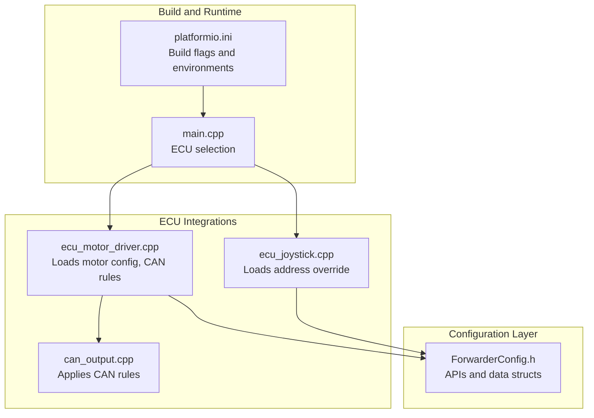
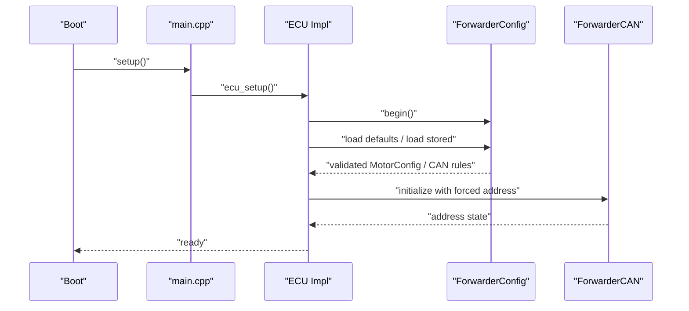
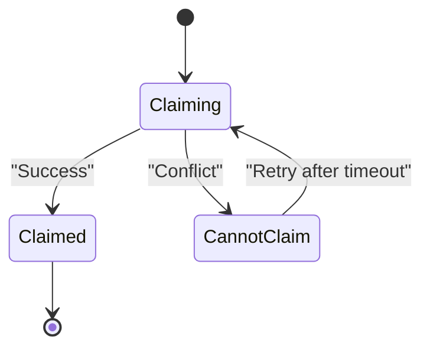
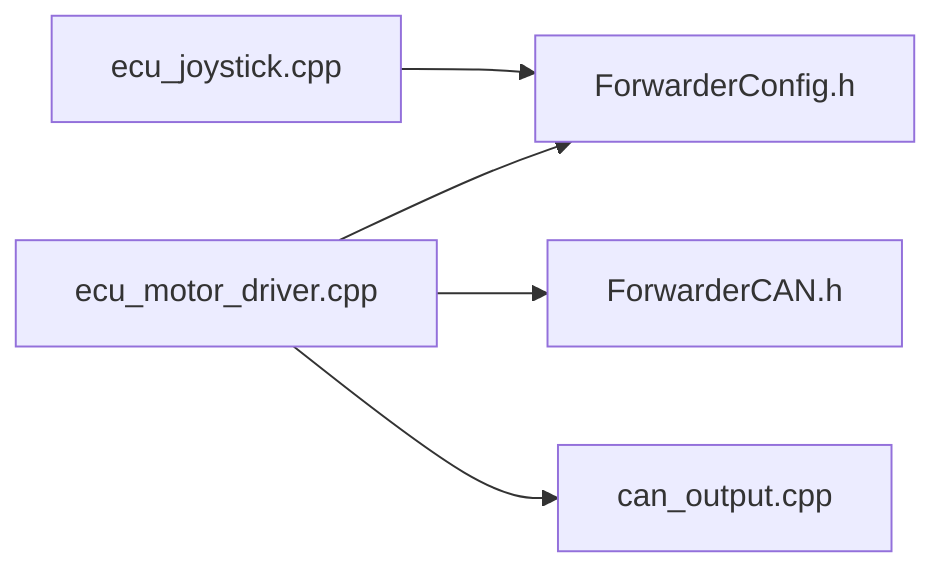

# Configuration Validation and Migration

<cite>
**Referenced Files in This Document**
- [README.md](file://README.md)
- [platformio.ini](file://platformio.ini)
- [ForwarderConfig.h](file://lib/ForwarderConfig/ForwarderConfig.h)
- [ForwarderCAN.h](file://lib/ForwarderCAN/ForwarderCAN.h)
- [ecu_motor_driver.cpp](file://src/ecu_motor_driver.cpp)
- [ecu_joystick.cpp](file://src/ecu_joystick.cpp)
- [can_output.cpp](file://src/can_output.cpp)
- [main.cpp](file://src/main.cpp)
</cite>

## Table of Contents
1. [Introduction](#introduction)
2. [Project Structure](#project-structure)
3. [Core Components](#core-components)
4. [Architecture Overview](#architecture-overview)
5. [Detailed Component Analysis](#detailed-component-analysis)
6. [Dependency Analysis](#dependency-analysis)
7. [Performance Considerations](#performance-considerations)
8. [Troubleshooting Guide](#troubleshooting-guide)
9. [Conclusion](#conclusion)
10. [Appendices](#appendices)

## Introduction
This document explains configuration validation and migration procedures in ForwarderKE’s configuration management system. It covers how default configurations are loaded, validation rules for parameters, safe fallbacks when configurations are invalid or missing, and the versioning and schema evolution model. It also documents validation checks for axis mappings, PWM ranges, and CAN rule parameters, along with address conflict handling during startup. Finally, it describes integrity verification, consistency checks, and practical workflows for diagnosing and resolving validation failures.

## Project Structure
ForwarderKE organizes configuration-related logic in a dedicated library and integrates it into ECU-specific entry points. The configuration library exposes APIs for loading/saving motor mappings, CAN output rules, and address overrides. The motor driver and joystick ECUs initialize configuration, load stored settings, and apply validated parameters at runtime.

**Diagram sources**
- [platformio.ini:1-80](file://platformio.ini#L1-L80)
- [main.cpp:1-32](file://src/main.cpp#L1-L32)
- [ForwarderConfig.h:64-92](file://lib/ForwarderConfig/ForwarderConfig.h#L64-L92)
- [ecu_motor_driver.cpp:290-325](file://src/ecu_motor_driver.cpp#L290-L325)
- [ecu_joystick.cpp:159-192](file://src/ecu_joystick.cpp#L159-L192)
- [can_output.cpp:7-19](file://src/can_output.cpp#L7-L19)

**Section sources**
- [README.md:112-126](file://README.md#L112-L126)
- [platformio.ini:1-80](file://platformio.ini#L1-L80)
- [main.cpp:11-17](file://src/main.cpp#L11-L17)

## Core Components
- ForwarderConfig: Provides NVS-backed storage for motor mappings, CAN output rules, and address overrides. It exposes methods to load/save defaults, load/save per-axis settings, and load/save CAN output rules.
- AxisConfig and MotorConfig: Define the axis mapping schema, including source address, pot index, output channel, deadbands, PWM min/max, and flags.
- CanOutputRule: Defines a rule to trigger GPIO outputs based on matching PF/SA conditions, with modes for toggle or momentary behavior.
- ForwarderCAN: Manages address claiming and J1939-like ID construction; integrates with configuration for forced addresses.

Key responsibilities:
- Load defaults when no stored configuration exists.
- Validate and normalize parameters at load time.
- Provide safe fallbacks for invalid or missing values.
- Persist validated configuration to NVS.
- Enforce address range constraints and detect conflicts during startup.

**Section sources**
- [ForwarderConfig.h:41-62](file://lib/ForwarderConfig/ForwarderConfig.h#L41-L62)
- [ForwarderConfig.h:29-39](file://lib/ForwarderConfig/ForwarderConfig.h#L29-L39)
- [ForwarderConfig.h:64-92](file://lib/ForwarderConfig/ForwarderConfig.h#L64-L92)
- [ForwarderCAN.h:66-120](file://lib/ForwarderCAN/ForwarderCAN.h#L66-L120)

## Architecture Overview
The configuration lifecycle spans build-time selection of ECU type, runtime initialization of configuration manager, loading of stored settings, validation and fallback, and application of validated parameters.

**Diagram sources**
- [main.cpp:19-27](file://src/main.cpp#L19-L27)
- [ecu_motor_driver.cpp:290-325](file://src/ecu_motor_driver.cpp#L290-L325)
- [ecu_joystick.cpp:159-192](file://src/ecu_joystick.cpp#L159-L192)
- [ForwarderConfig.h:64-92](file://lib/ForwarderConfig/ForwarderConfig.h#L64-L92)
- [ForwarderCAN.h:66-120](file://lib/ForwarderCAN/ForwarderCAN.h#L66-L120)

## Detailed Component Analysis

### Default Configuration Loading Mechanism
- The motor driver loads stored motor configuration and CAN output rules during setup. If no stored configuration exists, defaults are applied.
- Defaults include a full set of axes with sensible initial values and a default number of PCA devices configured.
- The configuration manager exposes a method to load defaults into a MotorConfig structure.

Validation and fallback:
- Defaults are applied when loading fails or when the stored configuration is empty.
- After applying defaults, the system persists them to ensure subsequent boots use validated settings.

**Section sources**
- [ecu_motor_driver.cpp:297-300](file://src/ecu_motor_driver.cpp#L297-L300)
- [ForwarderConfig.h:85](file://lib/ForwarderConfig/ForwarderConfig.h#L85)

### Validation Rules for Configuration Parameters
Axis mapping and PWM ranges:
- AxisConfig enforces:
  - Enabled/bidirectional flags are valid bitmasks.
  - Source address is within expected joystick range.
  - Pot index is one of three valid indices.
  - Output channel is within the range supported by installed PCA devices.
  - Deadband min/max are within ADC range and maintain ordering.
  - PWM min/max are within 0–255 and enforce min ≤ max.
- MotorConfig enforces:
  - PCA count is within allowed bounds.
- CanOutputRule enforces:
  - Enabled flag is boolean.
  - Match PF is a recognized PF value.
  - Match SA is either any (0) or a valid source address.
  - GPIO pin is valid and configured as output.
  - Mode is toggle or momentary.
  - Momentary timeout is non-negative.

Address override:
- Address override is stored in NVS and applied at startup to force a specific address.
- During address claiming, conflicts are resolved by switching to a special cannot-claim state and retrying.

**Section sources**
- [ForwarderConfig.h:41-57](file://lib/ForwarderConfig/ForwarderConfig.h#L41-L57)
- [ForwarderConfig.h:29-39](file://lib/ForwarderConfig/ForwarderConfig.h#L29-L39)
- [ForwarderCAN.h:74-83](file://lib/ForwarderCAN/ForwarderCAN.h#L74-L83)

### Safe Fallback Procedures
- If stored configuration fails to load or is invalid, defaults are loaded and immediately saved to NVS.
- If address claiming fails due to conflict, the system falls back to a reserved cannot-claim state and retries according to a bounded schedule.
- In motor driver mode, if no joystick activity is observed within a safety timeout, outputs are turned off to prevent unintended actuation.

**Section sources**
- [ecu_motor_driver.cpp:297-300](file://src/ecu_motor_driver.cpp#L297-L300)
- [ForwarderCAN.h:74-83](file://lib/ForwarderCAN/ForwarderCAN.h#L74-L83)
- [ecu_motor_driver.cpp:332-337](file://src/ecu_motor_driver.cpp#L332-L337)

### Configuration Versioning, Schema Evolution, and Backward Compatibility
- The configuration library defines fixed-size packed structures for transport and persistence. AxisConfig and CanOutputRule are designed to be serialized into fixed-length buffers.
- Schema evolution strategy:
  - Fixed-width fields and explicit packing enable straightforward detection of newer/older formats by buffer length or field presence.
  - New fields can be appended with default values to preserve backward compatibility.
  - Migration routine would:
    - Detect existing stored configuration format.
    - Transform legacy fields to new schema.
    - Validate transformed values.
    - Save upgraded configuration.
- Backward compatibility:
  - Older firmware versions will ignore unknown fields or treat omitted fields as disabled or zeroed.
  - Defaults ensure missing or corrupted entries are restored safely.

Note: The current code does not include explicit version fields or migration routines. The above strategy outlines how to evolve the schema safely.

**Section sources**
- [ForwarderConfig.h:54-57](file://lib/ForwarderConfig/ForwarderConfig.h#L54-L57)
- [ForwarderConfig.h:37-39](file://lib/ForwarderConfig/ForwarderConfig.h#L37-L39)

### Validation Checks for Axis Mappings, PWM Ranges, and CAN Rule Parameters
- Axis mapping:
  - Source address must correspond to a valid joystick controller.
  - Output channel must map to a physical PCA channel.
  - Deadband boundaries must be monotonic and within ADC range.
  - PWM min/max must be within 0–255 and ordered.
- PWM scaling:
  - Stored PWM values are 0–255; they are scaled to 12-bit internally for PCA output.
- CAN rule parameters:
  - PF and SA filters must match expected ranges.
  - GPIO pin must be configured for output.
  - Momentary mode requires a positive timeout.

**Section sources**
- [ForwarderConfig.h:41-57](file://lib/ForwarderConfig/ForwarderConfig.h#L41-L57)
- [ForwarderConfig.h:29-39](file://lib/ForwarderConfig/ForwarderConfig.h#L29-L39)
- [ecu_motor_driver.cpp:101-135](file://src/ecu_motor_driver.cpp#L101-L135)

### Address Conflicts and Startup Behavior
- Address claiming follows J1939-like semantics with a defined timeout and retry policy.
- If a conflict occurs, the device transitions to a cannot-claim state and uses a reserved address until successful claiming resumes.
- Users can override the preferred address via a CAN command; the override is persisted and applied on next boot.

**Diagram sources**
- [ForwarderCAN.h:74-83](file://lib/ForwarderCAN/ForwarderCAN.h#L74-L83)

**Section sources**
- [ecu_motor_driver.cpp:234-245](file://src/ecu_motor_driver.cpp#L234-L245)
- [ecu_joystick.cpp:132-142](file://src/ecu_joystick.cpp#L132-L142)
- [ForwarderCAN.h:74-83](file://lib/ForwarderCAN/ForwarderCAN.h#L74-L83)

### Configuration Integrity Verification and Consistency Checks
- Integrity verification:
  - Validate that each axis’ output channel maps to an installed PCA device.
  - Ensure deadband min ≤ deadband max and within ADC range.
  - Verify PWM min ≤ PWM max and within 0–255.
- Consistency checks:
  - Ensure no two axes share the same output channel for the same source address.
  - Ensure CAN rules do not target the same GPIO pin with conflicting modes.
- Automatic repair:
  - On load failure, restore defaults and persist them.
  - On conflict, fall back to reserved address and retry claiming.

**Section sources**
- [ForwarderConfig.h:41-57](file://lib/ForwarderConfig/ForwarderConfig.h#L41-L57)
- [ForwarderConfig.h:29-39](file://lib/ForwarderConfig/ForwarderConfig.h#L29-L39)
- [ecu_motor_driver.cpp:137-151](file://src/ecu_motor_driver.cpp#L137-L151)

### Migration Procedures and Data Transformation
- Migration workflow:
  - Detect stored configuration format/version.
  - Transform legacy fields to new schema with safe defaults.
  - Validate transformed values against current rules.
  - Save upgraded configuration.
- Data transformation examples:
  - Expanding a legacy axis struct to include new flags.
  - Adding default CAN output rules for new PF/SA combinations.
- Validation error reporting:
  - Log warnings for ignored or corrected fields.
  - Revert to defaults if transformation fails.

Note: Implement migration routines in the configuration manager to handle version upgrades.

**Section sources**
- [ForwarderConfig.h:64-92](file://lib/ForwarderConfig/ForwarderConfig.h#L64-L92)

### Practical Workflows and Examples
- Example scenario: Axis mapping invalid
  - Symptom: Solenoid does not respond.
  - Action: Load defaults, reconfigure axis mapping, validate deadband and PWM ranges, save configuration.
- Example scenario: Address conflict
  - Symptom: Device cannot claim address.
  - Action: Override address via CAN, save override, reboot; monitor LED pattern indicating cannot-claim state.
- Example scenario: CAN rule misconfiguration
  - Symptom: GPIO does not toggle or pulses unexpectedly.
  - Action: Review PF/SA filters, mode, and momentary timeout; adjust and save.

**Section sources**
- [ecu_motor_driver.cpp:234-245](file://src/ecu_motor_driver.cpp#L234-L245)
- [ecu_joystick.cpp:132-142](file://src/ecu_joystick.cpp#L132-L142)
- [can_output.cpp:29-49](file://src/can_output.cpp#L29-L49)

## Dependency Analysis
Configuration dependencies across components:

**Diagram sources**
- [ForwarderConfig.h:64-92](file://lib/ForwarderConfig/ForwarderConfig.h#L64-L92)
- [ecu_motor_driver.cpp:290-325](file://src/ecu_motor_driver.cpp#L290-L325)
- [ecu_joystick.cpp:159-192](file://src/ecu_joystick.cpp#L159-L192)
- [ForwarderCAN.h:66-120](file://lib/ForwarderCAN/ForwarderCAN.h#L66-L120)
- [can_output.cpp:7-19](file://src/can_output.cpp#L7-L19)

**Section sources**
- [ecu_motor_driver.cpp:290-325](file://src/ecu_motor_driver.cpp#L290-L325)
- [ecu_joystick.cpp:159-192](file://src/ecu_joystick.cpp#L159-L192)
- [can_output.cpp:7-19](file://src/can_output.cpp#L7-L19)

## Performance Considerations
- Configuration load occurs once at boot; keep validation lightweight to minimize startup latency.
- Avoid repeated NVS writes by batching saves and only writing when values change.
- Use minimal logging during normal operation; reserve verbose logs for diagnostics.

## Troubleshooting Guide
Common issues and resolutions:
- Configuration load fails:
  - Cause: Corrupted or incompatible stored data.
  - Resolution: Clear NVS namespace or rely on defaults being applied and saved.
- Address claiming fails:
  - Cause: Conflict with another device.
  - Resolution: Override address via CAN, save, and restart; monitor LED indicators.
- Axes not responding:
  - Cause: Disabled axis, invalid output channel, or out-of-range PWM values.
  - Resolution: Recreate axis mapping with valid channels and PWM ranges.
- CAN rules not triggering:
  - Cause: Incorrect PF/SA filters or GPIO pin misconfiguration.
  - Resolution: Adjust filters and mode; confirm GPIO pin is configured for output.

**Section sources**
- [ecu_motor_driver.cpp:297-300](file://src/ecu_motor_driver.cpp#L297-L300)
- [ecu_motor_driver.cpp:234-245](file://src/ecu_motor_driver.cpp#L234-L245)
- [ecu_joystick.cpp:132-142](file://src/ecu_joystick.cpp#L132-L142)
- [can_output.cpp:29-49](file://src/can_output.cpp#L29-L49)

## Conclusion
ForwarderKE’s configuration management centers on a robust NVS-backed system with clear validation rules, safe fallbacks, and explicit address override capabilities. While the current implementation focuses on defaults and basic validation, the fixed-size packed structures provide a foundation for future schema evolution and migration. By enforcing parameter bounds, verifying hardware mappings, and offering clear diagnostics, the system maintains reliability and ease of maintenance across deployments.

## Appendices

### Build-Time Configuration and ECU Selection
- Build flags select ECU type and preferred address; environments define pins and optional OTA support.
- These flags influence runtime behavior and address assignment.

**Section sources**
- [platformio.ini:17-61](file://platformio.ini#L17-L61)
- [main.cpp:11-17](file://src/main.cpp#L11-L17)