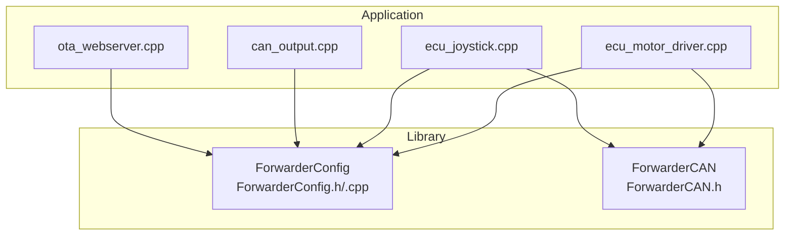
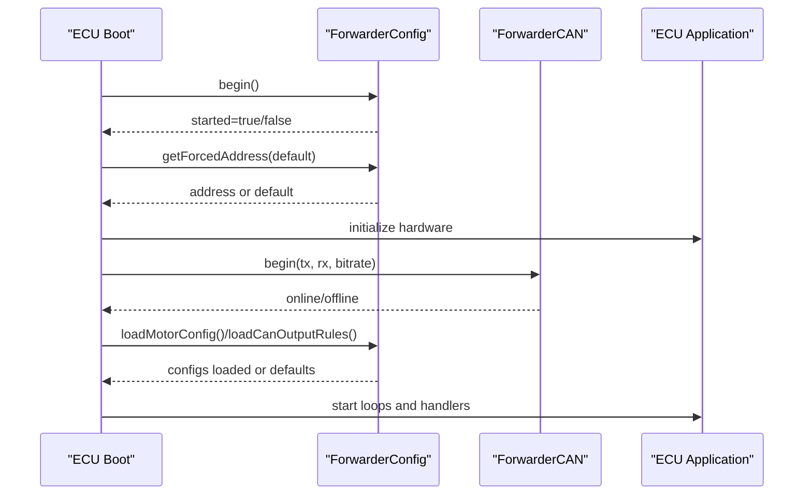
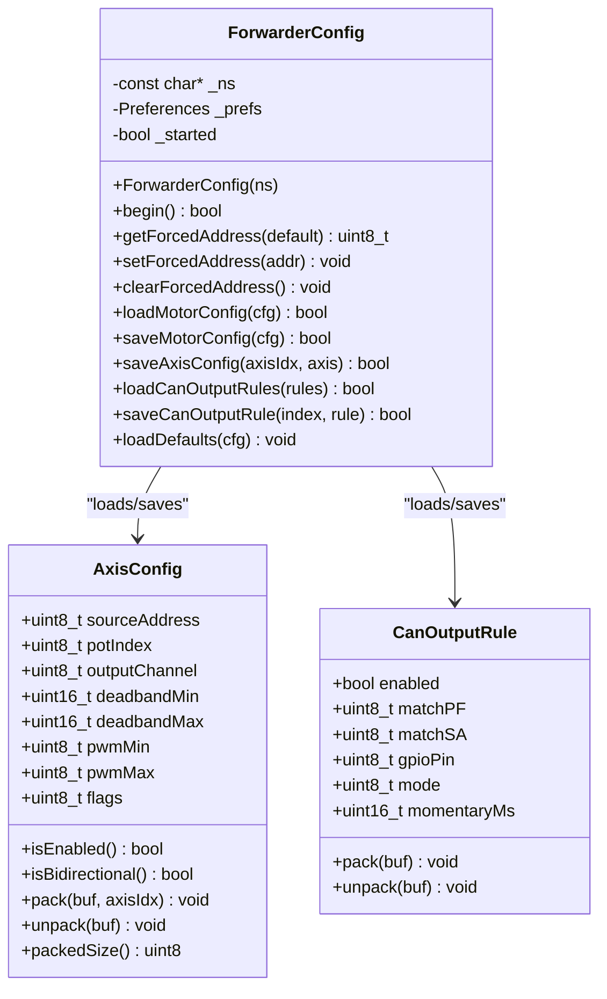
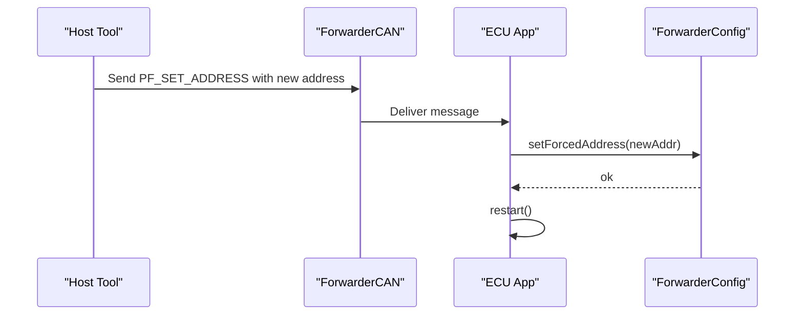
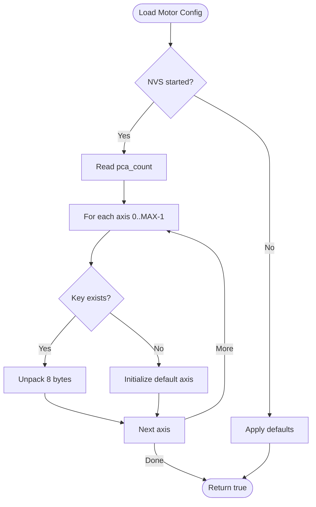
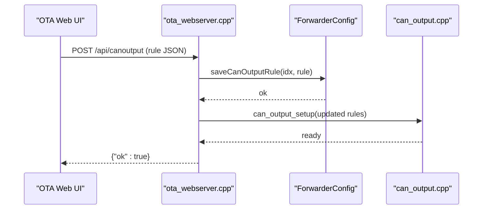
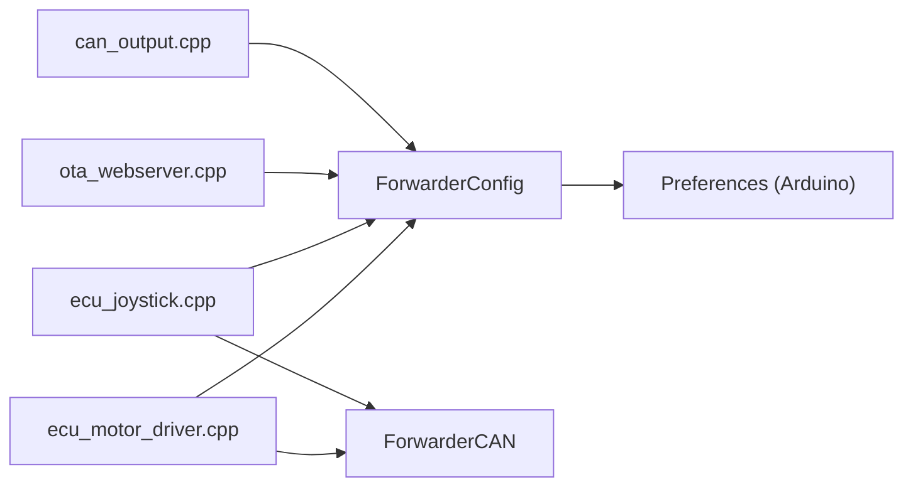

# NVS Storage System

<cite>
**Referenced Files in This Document**
- [README.md](file://README.md)
- [platformio.ini](file://platformio.ini)
- [ForwarderConfig.h](file://lib/ForwarderConfig/ForwarderConfig.h)
- [ForwarderConfig.cpp](file://lib/ForwarderConfig/ForwarderConfig.cpp)
- [ecu_motor_driver.cpp](file://src/ecu_motor_driver.cpp)
- [ecu_joystick.cpp](file://src/ecu_joystick.cpp)
- [can_output.cpp](file://src/can_output.cpp)
- [ForwarderCAN.h](file://lib/ForwarderCAN/ForwarderCAN.h)
- [ota_webserver.cpp](file://src/ota_webserver.cpp)
</cite>

## Table of Contents
1. [Introduction](#introduction)
2. [Project Structure](#project-structure)
3. [Core Components](#core-components)
4. [Architecture Overview](#architecture-overview)
5. [Detailed Component Analysis](#detailed-component-analysis)
6. [Dependency Analysis](#dependency-analysis)
7. [Performance Considerations](#performance-considerations)
8. [Troubleshooting Guide](#troubleshooting-guide)
9. [Conclusion](#conclusion)

## Introduction
This document explains the Non-Volatile Storage (NVS) implementation used by ForwarderKE’s configuration management. It focuses on how preferences are organized under the "fwdrcfg" namespace, how key-value pairs are stored and retrieved, and how configuration persistence integrates with runtime operation. It also covers address override functionality, motor configuration storage, and CAN output rule persistence, along with storage capacity, write endurance, and error handling considerations.

## Project Structure
ForwarderKE organizes configuration logic in a dedicated library and consumes it from the ECU entry points. The NVS layer is encapsulated in a small C++ class that uses the Arduino Preferences API to persist data to flash.

**Diagram sources**
- [ecu_motor_driver.cpp](file://src/ecu_motor_driver.cpp#L45)
- [ecu_joystick.cpp](file://src/ecu_joystick.cpp#L41)
- [can_output.cpp:1-66](file://src/can_output.cpp#L1-L66)
- [ForwarderConfig.h:64-91](file://lib/ForwarderConfig/ForwarderConfig.h#L64-L91)
- [ForwarderConfig.cpp:54-74](file://lib/ForwarderConfig/ForwarderConfig.cpp#L54-L74)
- [ForwarderCAN.h:66-120](file://lib/ForwarderCAN/ForwarderCAN.h#L66-L120)

**Section sources**
- [README.md:112-126](file://README.md#L112-L126)
- [platformio.ini:1-80](file://platformio.ini#L1-L80)

## Core Components
- ForwarderConfig: Provides NVS-backed configuration APIs for:
  - Address override persistence
  - Motor mapping configuration (axes, PCA count)
  - CAN output rules
- ForwarderCAN: Provides CAN bus communication and address claiming; integrates with NVS for address override.
- ECU entry points: Motor driver and joystick controllers initialize NVS, load configuration, and apply settings.

Key responsibilities:
- Namespace: "fwdrcfg" for shared configs, "motorcfg" for motor driver, "joycfg" for joystick.
- Data serialization: Fixed-size packed buffers for axes and CAN output rules.
- Load/save operations: One-shot loads per boot; targeted saves for incremental updates.

**Section sources**
- [ForwarderConfig.h:64-91](file://lib/ForwarderConfig/ForwarderConfig.h#L64-L91)
- [ForwarderConfig.cpp:56-74](file://lib/ForwarderConfig/ForwarderConfig.cpp#L56-L74)
- [ecu_motor_driver.cpp:290-325](file://src/ecu_motor_driver.cpp#L290-L325)
- [ecu_joystick.cpp:159-192](file://src/ecu_joystick.cpp#L159-L192)

## Architecture Overview
The NVS subsystem is layered beneath application logic. At boot, each ECU initializes NVS, applies an optional forced address, loads persisted configurations, and starts normal operation. OTA web server can update CAN output rules and persists them immediately.

**Diagram sources**
- [ForwarderConfig.cpp:56-74](file://lib/ForwarderConfig/ForwarderConfig.cpp#L56-L74)
- [ecu_motor_driver.cpp:290-325](file://src/ecu_motor_driver.cpp#L290-L325)
- [ecu_joystick.cpp:159-192](file://src/ecu_joystick.cpp#L159-L192)
- [ForwarderCAN.h:66-120](file://lib/ForwarderCAN/ForwarderCAN.h#L66-L120)

## Detailed Component Analysis

### ForwarderConfig: NVS Manager
Responsibilities:
- Namespace management: Accepts a namespace string; uses Preferences internally.
- Address override: Stores a single byte under a specific key.
- Motor mapping: Persists PCA count and up to a fixed number of axis configurations.
- CAN output rules: Persists up to a fixed number of rules.
- Defaults: Supplies sane defaults when NVS is unavailable or keys are missing.

Data structures and serialization:
- AxisConfig: Packs 8 bytes for transport and storage, including flags, indices, and scaling parameters.
- CanOutputRule: Packs 8 bytes for rule definition including match criteria, GPIO pin, mode, and timing.

Load/save behavior:
- begin(): Opens the Preferences namespace.
- getForcedAddress/setForcedAddress/clearForcedAddress(): Single-key operations.
- loadMotorConfig/saveMotorConfig/saveAxisConfig(): Iterates over keys for axes and writes packed data.
- loadCanOutputRules/saveCanOutputRule(): Iterates over rule indices and writes packed data.

**Diagram sources**
- [ForwarderConfig.h:64-91](file://lib/ForwarderConfig/ForwarderConfig.h#L64-L91)
- [ForwarderConfig.cpp:54-184](file://lib/ForwarderConfig/ForwarderConfig.cpp#L54-L184)

**Section sources**
- [ForwarderConfig.h:64-91](file://lib/ForwarderConfig/ForwarderConfig.h#L64-L91)
- [ForwarderConfig.cpp:56-184](file://lib/ForwarderConfig/ForwarderConfig.cpp#L56-L184)

### Address Override Functionality
- Purpose: Allow forcing a device address via NVS, overriding compile-time preferences.
- Storage: Single unsigned char under a specific key.
- Retrieval: On boot, the ECU reads the forced address and passes it to the CAN stack.
- Update: Sent via a CAN message; on receipt, the ECU writes the new address to NVS and restarts.

**Diagram sources**
- [ForwarderCAN.h:46-50](file://lib/ForwarderCAN/ForwarderCAN.h#L46-L50)
- [ecu_motor_driver.cpp:234-245](file://src/ecu_motor_driver.cpp#L234-L245)
- [ecu_joystick.cpp:132-142](file://src/ecu_joystick.cpp#L132-L142)
- [ForwarderConfig.cpp:66-74](file://lib/ForwarderConfig/ForwarderConfig.cpp#L66-L74)

**Section sources**
- [ecu_motor_driver.cpp:296-300](file://src/ecu_motor_driver.cpp#L296-L300)
- [ecu_joystick.cpp:171-173](file://src/ecu_joystick.cpp#L171-L173)
- [ForwarderConfig.cpp:61-74](file://lib/ForwarderConfig/ForwarderConfig.cpp#L61-L74)

### Motor Configuration Storage
- Keys: "pca_count" and "axis_X" for each axis index.
- Serialization: Each axis packed into 8 bytes; PCA count stored as a single byte.
- Loading: If NVS is unavailable, defaults are applied. Missing keys populate sensible defaults per-axis.
- Saving: Full motor config written on demand (e.g., after batch updates) or individual axis updates.

**Diagram sources**
- [ForwarderConfig.cpp:76-104](file://lib/ForwarderConfig/ForwarderConfig.cpp#L76-L104)

**Section sources**
- [ForwarderConfig.cpp:76-127](file://lib/ForwarderConfig/ForwarderConfig.cpp#L76-L127)

### CAN Output Rule Persistence
- Keys: "canout_X" for each rule index.
- Serialization: Each rule packed into 8 bytes.
- Loading: Missing keys initialize default rule values.
- Saving: Individual rule updates are persisted immediately upon change.

**Diagram sources**
- [ota_webserver.cpp:677-703](file://src/ota_webserver.cpp#L677-L703)
- [ForwarderConfig.cpp:161-169](file://lib/ForwarderConfig/ForwarderConfig.cpp#L161-L169)
- [can_output.cpp:7-19](file://src/can_output.cpp#L7-L19)

**Section sources**
- [ForwarderConfig.cpp:129-169](file://lib/ForwarderConfig/ForwarderConfig.cpp#L129-L169)
- [can_output.cpp:29-61](file://src/can_output.cpp#L29-L61)
- [ota_webserver.cpp:677-703](file://src/ota_webserver.cpp#L677-L703)

## Dependency Analysis
- ForwarderConfig depends on Arduino Preferences for NVS abstraction.
- ECU applications depend on ForwarderConfig for persistence and on ForwarderCAN for address claiming and messaging.
- OTA web server depends on ForwarderConfig to persist CAN output rule changes.

**Diagram sources**
- [ForwarderConfig.cpp:56-74](file://lib/ForwarderConfig/ForwarderConfig.cpp#L56-L74)
- [ecu_motor_driver.cpp](file://src/ecu_motor_driver.cpp#L45)
- [ecu_joystick.cpp](file://src/ecu_joystick.cpp#L41)
- [ForwarderCAN.h:66-120](file://lib/ForwarderCAN/ForwarderCAN.h#L66-L120)
- [can_output.cpp:1-66](file://src/can_output.cpp#L1-L66)
- [ota_webserver.cpp:677-703](file://src/ota_webserver.cpp#L677-L703)

**Section sources**
- [ForwarderConfig.cpp:56-74](file://lib/ForwarderConfig/ForwarderConfig.cpp#L56-L74)
- [ecu_motor_driver.cpp:290-325](file://src/ecu_motor_driver.cpp#L290-L325)
- [ecu_joystick.cpp:159-192](file://src/ecu_joystick.cpp#L159-L192)
- [ForwarderCAN.h:66-120](file://lib/ForwarderCAN/ForwarderCAN.h#L66-L120)
- [can_output.cpp:1-66](file://src/can_output.cpp#L1-L66)
- [ota_webserver.cpp:677-703](file://src/ota_webserver.cpp#L677-L703)

## Performance Considerations
- Write amplification: Each save writes a fixed-size buffer per key. Frequent axis or rule updates increase flash wear.
- Flash endurance: ESP32 flash cells have limited erase/write cycles. Minimize writes by batching updates and avoiding continuous polling writes.
- NVS overhead: Preferences operations are synchronous; avoid excessive NVS calls in tight loops.
- Memory footprint: Each persisted axis and rule occupies a fixed 8-byte slot plus key metadata.

[No sources needed since this section provides general guidance]

## Troubleshooting Guide
Common issues and resolutions:
- NVS not started: If NVS fails to start, configuration loads return defaults. Verify namespace initialization and power stability during boot.
- Corrupted or partial data: During load, if a stored string is shorter than expected, defaults are applied for that item. Recreate configuration via UI or CAN commands.
- Address override not taking effect: Ensure the forced address is written to NVS and the device is restarted after receiving the address-setting message.
- CAN output rule not applied: Confirm the rule was saved and the output module re-initialized with the updated rules.

Validation and recovery steps:
- After writing a rule via OTA, re-initialize outputs to apply changes.
- On startup, check logs for successful NVS initialization and configuration load.
- If address claiming fails, the CAN stack handles retries; verify wiring and bus conditions.

**Section sources**
- [ForwarderConfig.cpp:76-104](file://lib/ForwarderConfig/ForwarderConfig.cpp#L76-L104)
- [ForwarderConfig.cpp:129-169](file://lib/ForwarderConfig/ForwarderConfig.cpp#L129-L169)
- [ecu_motor_driver.cpp:296-325](file://src/ecu_motor_driver.cpp#L296-L325)
- [ecu_joystick.cpp:171-192](file://src/ecu_joystick.cpp#L171-L192)
- [ota_webserver.cpp:699-703](file://src/ota_webserver.cpp#L699-L703)

## Conclusion
ForwarderKE’s NVS layer provides a compact, reliable mechanism for storing device address overrides, motor mapping configurations, and CAN output rules. By using fixed-size packed buffers and targeted key-value operations, it balances simplicity with performance. Proper initialization, cautious write frequency, and clear validation paths ensure robust operation across deployments.