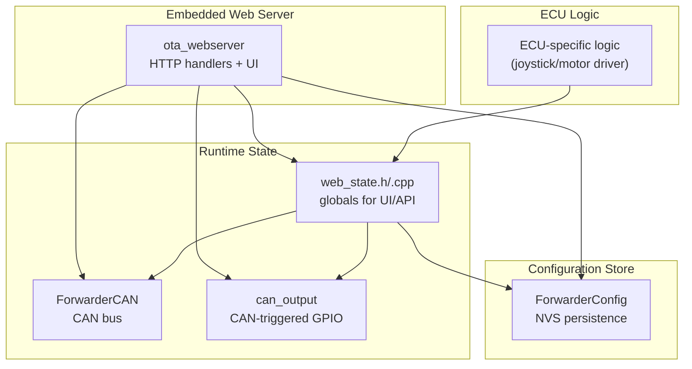
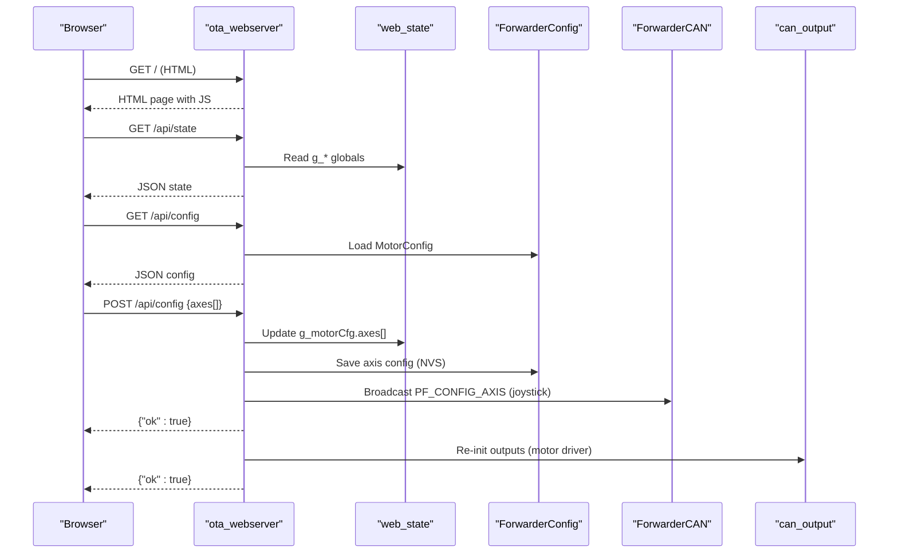
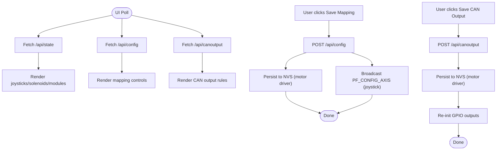
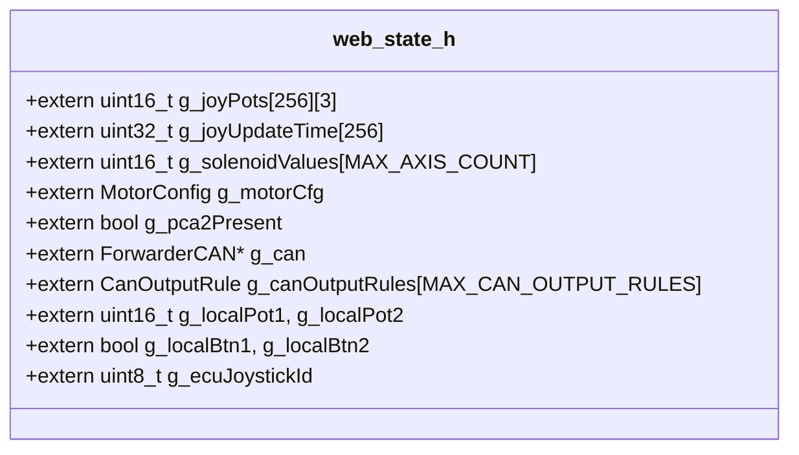
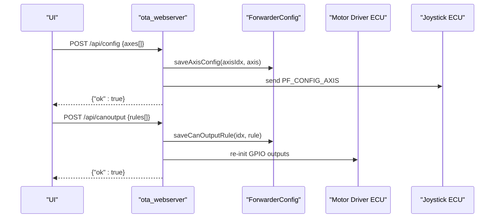
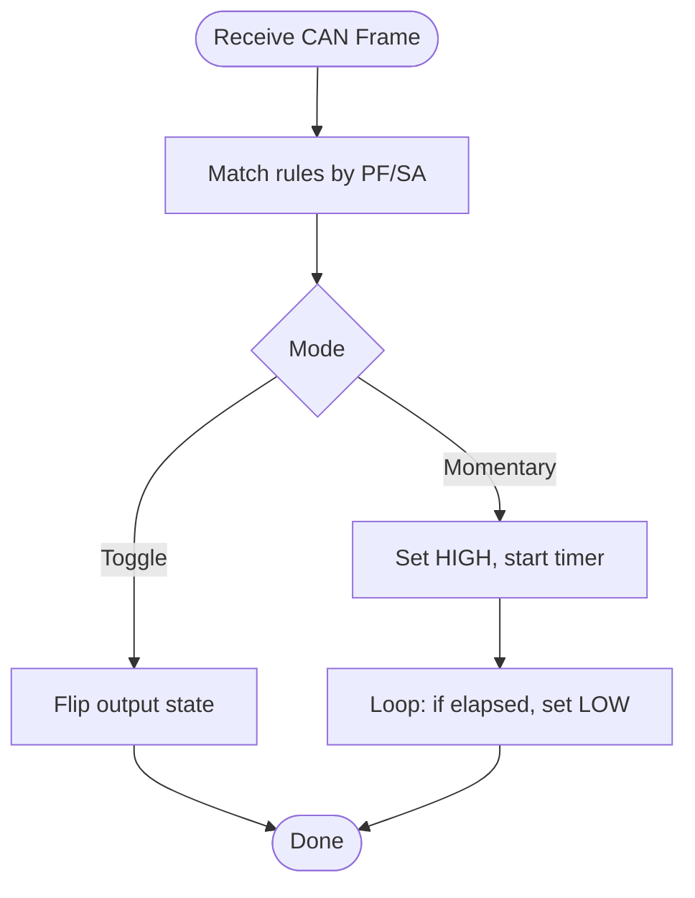
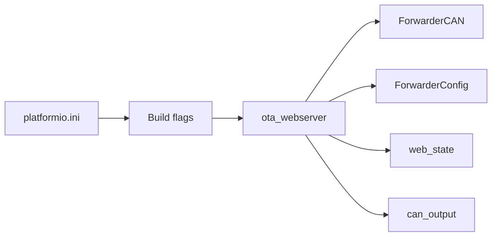

# Web Interface Integration

<cite>
**Referenced Files in This Document**
- [ota_webserver.cpp](file://src/ota_webserver.cpp)
- [ota_webserver.h](file://src/ota_webserver.h)
- [web_state.h](file://src/web_state.h)
- [web_state.cpp](file://src/web_state.cpp)
- [ForwarderConfig.h](file://lib/ForwarderConfig/ForwarderConfig.h)
- [ForwarderConfig.cpp](file://lib/ForwarderConfig/ForwarderConfig.cpp)
- [can_output.cpp](file://src/can_output.cpp)
- [can_output.h](file://src/can_output.h)
- [ForwarderCAN.h](file://lib/ForwarderCAN/ForwarderCAN.h)
- [main.cpp](file://src/main.cpp)
- [platformio.ini](file://platformio.ini)
</cite>

## Table of Contents
1. [Introduction](#introduction)
2. [Project Structure](#project-structure)
3. [Core Components](#core-components)
4. [Architecture Overview](#architecture-overview)
5. [Detailed Component Analysis](#detailed-component-analysis)
6. [Dependency Analysis](#dependency-analysis)
7. [Performance Considerations](#performance-considerations)
8. [Troubleshooting Guide](#troubleshooting-guide)
9. [Security Considerations](#security-considerations)
10. [Conclusion](#conclusion)

## Introduction
This document explains how the web interface integrates with ForwarderKE’s configuration management system. It covers the data flow between Non-Volatile Storage (NVS), the embedded web server, and real-time state exposure. It documents the HTTP API endpoints for retrieving and modifying configuration, the JSON structures used for transfers, and the real-time synchronization mechanisms. It also describes the shared state integration via web_state, the propagation of configuration changes across components, and the user interface behavior for configuration management. Finally, it includes practical examples, troubleshooting guidance, and security considerations.

## Project Structure
The web interface is implemented as an embedded HTTP server that serves both a dashboard UI and a set of REST-like endpoints. Configuration data is persisted in NVS via the ForwarderConfig library and synchronized with runtime state exposed through web_state. The CAN bus is managed by ForwarderCAN, and CAN-triggered GPIO outputs are configured via can_output.

**Diagram sources**
- [ota_webserver.cpp:766-796](file://src/ota_webserver.cpp#L766-L796)
- [web_state.h:8-23](file://src/web_state.h#L8-L23)
- [ForwarderConfig.h:64-91](file://lib/ForwarderConfig/ForwarderConfig.h#L64-L91)
- [ForwarderCAN.h:66-119](file://lib/ForwarderCAN/ForwarderCAN.h#L66-L119)
- [can_output.h:7-11](file://src/can_output.h#L7-L11)

**Section sources**
- [platformio.ini:17-80](file://platformio.ini#L17-L80)
- [main.cpp:11-17](file://src/main.cpp#L11-L17)

## Core Components
- Embedded web server and UI: Serves HTML and JSON endpoints for configuration and telemetry.
- Runtime state exposure: Exposes joystick, solenoid, module, and CAN statistics to the UI.
- Configuration persistence: NVS-backed storage for axis mapping and CAN output rules.
- CAN integration: Real-time CAN message processing and broadcasting of configuration updates.
- CAN-triggered GPIO outputs: Rules that react to incoming CAN frames to control relays or LEDs.

**Section sources**
- [ota_webserver.cpp:506-796](file://src/ota_webserver.cpp#L506-L796)
- [web_state.h:8-23](file://src/web_state.h#L8-L23)
- [ForwarderConfig.h:64-91](file://lib/ForwarderConfig/ForwarderConfig.h#L64-L91)
- [ForwarderCAN.h:66-119](file://lib/ForwarderCAN/ForwarderCAN.h#L66-L119)
- [can_output.h:7-11](file://src/can_output.h#L7-L11)

## Architecture Overview
The web interface architecture centers on a single-file embedded HTTP server that:
- Serves a responsive dashboard with tabs for Dashboard, Modules, Motor Mapping, CAN Output, and OTA Update.
- Provides JSON APIs for state (/api/state), configuration (/api/config), CAN output rules (/api/canoutput), and administrative actions (/api/identify, /api/address).
- Reads and writes configuration to NVS via ForwarderConfig.
- Publishes real-time telemetry and state to the UI using periodic polling.

**Diagram sources**
- [ota_webserver.cpp:506-626](file://src/ota_webserver.cpp#L506-L626)
- [web_state.h:8-23](file://src/web_state.h#L8-L23)
- [ForwarderConfig.cpp:76-127](file://lib/ForwarderConfig/ForwarderConfig.cpp#L76-L127)
- [ForwarderCAN.h:38-51](file://lib/ForwarderCAN/ForwarderCAN.h#L38-L51)
- [can_output.cpp:7-61](file://src/can_output.cpp#L7-L61)

## Detailed Component Analysis

### HTTP API Endpoints
- GET /api/state
  - Returns local address, online status, uptime, TX/RX/error counts, joystick telemetry, solenoid values, and discovered modules.
  - Example response keys: localAddr, online, uptime, txCount, rxCount, errCount, joy, sol, modules.
- GET /api/config
  - Returns pcaCount and axes array with per-axis fields: sourceAddress, potIndex, outputChannel, deadbandMin, deadbandMax, pwmMin, pwmMax, flags.
- POST /api/config
  - Accepts axes array payload; updates runtime MotorConfig and persists to NVS on motor driver; broadcasts PF_CONFIG_AXIS to joystick on joystick ECU.
- POST /api/identify
  - Sends PF_IDENTIFY to target module address.
- POST /api/address
  - Sends PF_SET_ADDRESS to target module address to re-address it.
- GET /api/canoutput
  - Returns rules array with fields: enabled, matchPF, matchSA, gpioPin, mode, momentaryMs.
- POST /api/canoutput
  - Accepts rules array payload; updates runtime rules, persists to NVS on motor driver, and re-initializes GPIO outputs.
- POST /update
  - Handles OTA firmware update via multipart upload.

**Section sources**
- [ota_webserver.cpp:506-703](file://src/ota_webserver.cpp#L506-L703)

### JSON Data Structures
- State object (GET /api/state):
  - localAddr: number
  - online: boolean
  - uptime: number
  - txCount: number
  - rxCount: number
  - errCount: number
  - joy: object keyed by source address; each entry has pots[], age (seconds), and optionally btns on joystick ECU.
  - sol: array of solenoid values
  - modules: object keyed by module address; each entry has addr, type, uptime, age
- Config object (GET /api/config):
  - pcaCount: number
  - axes: array of 16 entries; each entry has sourceAddress, potIndex, outputChannel, deadbandMin, deadbandMax, pwmMin, pwmMax, flags
- Axes payload (POST /api/config):
  - axes: array of 16 entries; each entry includes axisIdx and all axis fields
- CAN output rules object (GET /api/canoutput):
  - rules: array of 4 entries; each entry has enabled, matchPF, matchSA, gpioPin, mode, momentaryMs
- CAN output rules payload (POST /api/canoutput):
  - rules: array of 4 entries; each entry includes ruleIdx and all rule fields

**Section sources**
- [ota_webserver.cpp:510-584](file://src/ota_webserver.cpp#L510-L584)
- [ForwarderConfig.h:41-57](file://lib/ForwarderConfig/ForwarderConfig.h#L41-L57)
- [ForwarderConfig.h:29-39](file://lib/ForwarderConfig/ForwarderConfig.h#L29-L39)

### Real-Time State Management and Synchronization
- Periodic polling: The UI polls /api/state every 200 ms, and also fetches /api/config and /api/canoutput on tab load.
- State exposure: The web server reads from global arrays and structs exported by web_state (joystick pots/buttons, solenoid values, motor config, CAN stats, module registry).
- CAN-driven updates: The server scans heartbeat frames to populate the modules list and to detect module types heuristically.
- Propagation:
  - On joystick ECU, saving axis mapping triggers broadcast of PF_CONFIG_AXIS to the motor driver.
  - On motor driver ECU, saving CAN output rules triggers re-initialization of GPIO outputs and persistence to NVS.

**Diagram sources**
- [ota_webserver.cpp:360-497](file://src/ota_webserver.cpp#L360-L497)
- [ota_webserver.cpp:587-703](file://src/ota_webserver.cpp#L587-L703)
- [web_state.h:8-23](file://src/web_state.h#L8-L23)

**Section sources**
- [ota_webserver.cpp:494-497](file://src/ota_webserver.cpp#L494-L497)
- [ota_webserver.cpp:742-761](file://src/ota_webserver.cpp#L742-L761)

### Web State Integration
- Global exports: The web server reads from global arrays and structs declared in web_state.h, including joystick pots/buttons, solenoid values, motor configuration, PCA presence, and CAN output rules.
- Conditional definitions: Some globals are conditionally defined depending on whether the build targets motor driver or joystick ECU.
- UI rendering: JavaScript constructs the UI from the returned JSON state and configuration objects.

**Diagram sources**
- [web_state.h:8-23](file://src/web_state.h#L8-L23)

**Section sources**
- [web_state.cpp:6-20](file://src/web_state.cpp#L6-L20)
- [web_state.h:8-23](file://src/web_state.h#L8-L23)

### Configuration Persistence and Change Propagation
- NVS storage: ForwarderConfig loads and saves MotorConfig and CAN output rules to NVS, packing/unpacking structures into byte buffers.
- Axis mapping: Saved per-axis to NVS keys; defaults loaded when missing.
- CAN output rules: Saved per-rule to NVS keys; defaults loaded when missing.
- Propagation:
  - Motor driver: Saving axis mapping or CAN output rules persists to NVS and reinitializes outputs.
  - Joystick ECU: Saving axis mapping broadcasts PF_CONFIG_AXIS to the motor driver.

**Diagram sources**
- [ForwarderConfig.cpp:119-127](file://lib/ForwarderConfig/ForwarderConfig.cpp#L119-L127)
- [ForwarderConfig.cpp:161-169](file://lib/ForwarderConfig/ForwarderConfig.cpp#L161-L169)
- [ota_webserver.cpp:609-621](file://src/ota_webserver.cpp#L609-L621)
- [ota_webserver.cpp:692-701](file://src/ota_webserver.cpp#L692-L701)

**Section sources**
- [ForwarderConfig.cpp:76-127](file://lib/ForwarderConfig/ForwarderConfig.cpp#L76-L127)
- [ForwarderConfig.cpp:129-169](file://lib/ForwarderConfig/ForwarderConfig.cpp#L129-L169)
- [ota_webserver.cpp:609-621](file://src/ota_webserver.cpp#L609-L621)
- [ota_webserver.cpp:692-701](file://src/ota_webserver.cpp#L692-L701)

### CAN Output Rules Engine
- Initialization: Sets up GPIO pins according to rules and logs configuration.
- Matching: On receiving a CAN frame, checks PF/SA match against rules.
- Modes:
  - Toggle: flips output state on match.
  - Momentary: sets output HIGH and schedules LOW after momentaryMs.
- Loop: Drives momentary timers and toggles outputs accordingly.

**Diagram sources**
- [can_output.cpp:29-61](file://src/can_output.cpp#L29-L61)

**Section sources**
- [can_output.cpp:7-66](file://src/can_output.cpp#L7-L66)
- [ForwarderCAN.h:38-51](file://lib/ForwarderCAN/ForwarderCAN.h#L38-L51)

### User Interface for Configuration Management
- Tabs: Dashboard, Modules, Motor Mapping, CAN Output, OTA Update.
- Real-time feedback: Status toast notifications for success/failure of operations.
- Form controls:
  - Motor Mapping: Enable checkbox, source address dropdown (0x21/0x22), pot selection, output channel, deadband sliders, PWM range inputs, bidirectional flag.
  - CAN Output: Enable checkbox, PF/SA match fields, GPIO pin selector, mode selector (toggle/momentary), momentary duration.
- Validation and UX:
  - Range constraints on inputs (e.g., 0–1023 for deadband, 0–255 for PWM).
  - Immediate visual feedback via sliders and bars.
  - Refresh and Save actions per section.

**Section sources**
- [ota_webserver.cpp:32-501](file://src/ota_webserver.cpp#L32-L501)
- [ota_webserver.cpp:337-471](file://src/ota_webserver.cpp#L337-L471)

## Dependency Analysis
- Build flags control ECU type and enable the embedded web server:
  - ECU_TYPE_MOTOR_DRIVER or ECU_TYPE_JOYSTICK selects ECU implementation.
  - ENABLE_OTA_WEBSERVER enables the HTTP server and UI.
- The web server depends on:
  - ForwarderCAN for CAN messaging and statistics.
  - ForwarderConfig for NVS-backed configuration.
  - web_state for shared runtime state.
  - can_output for CAN-triggered GPIO outputs.

**Diagram sources**
- [platformio.ini:17-80](file://platformio.ini#L17-L80)
- [ota_webserver.cpp:1-13](file://src/ota_webserver.cpp#L1-L13)

**Section sources**
- [platformio.ini:17-80](file://platformio.ini#L17-L80)
- [ota_webserver.cpp:1-13](file://src/ota_webserver.cpp#L1-L13)

## Performance Considerations
- Polling interval: The UI polls /api/state every 200 ms; adjust for network load and responsiveness needs.
- JSON construction: The server builds JSON strings manually; keep payloads concise and avoid unnecessary fields.
- NVS writes: Persisting configuration occurs on each change; consider batching or debouncing in future enhancements.
- CAN processing: Matching and GPIO toggling are O(RULES) per frame; ensure rule count remains small.

## Troubleshooting Guide
- UI shows “No modules detected”
  - Ensure CAN bus is connected and modules are powered; verify heartbeats are received and processed.
  - Check that the server is scanning heartbeats and updating the module registry.
- Changes to Motor Mapping do not take effect
  - Confirm the device is a joystick ECU; saving mapping on joystick triggers broadcast to motor driver.
  - Verify NVS persistence succeeded and that motor driver reloaded configuration.
- CAN Output rules not triggering GPIO
  - Confirm PF/SA match values and GPIO pin assignment.
  - Check rule mode and momentaryMs; ensure GPIO pin is configured and not conflicting.
- OTA update fails
  - Verify file selection and network connectivity; check server logs for errors during upload.

**Section sources**
- [ota_webserver.cpp:742-761](file://src/ota_webserver.cpp#L742-L761)
- [ForwarderConfig.cpp:106-127](file://lib/ForwarderConfig/ForwarderConfig.cpp#L106-L127)
- [can_output.cpp:29-61](file://src/can_output.cpp#L29-L61)

## Security Considerations
- Access control: The embedded web server runs an access point without built-in authentication. Treat deployments as untrusted networks.
- Network isolation: Prefer wired or trusted Wi-Fi environments; disable OTA builds in production devices.
- Transport security: No TLS termination is present; sensitive operations should be performed behind firewalls or VPNs.
- Input sanitization: The server performs minimal JSON parsing; ensure client-side validation and server-side bounds checking remain robust.
- Operational hygiene: Rotate credentials for any external integrations and limit exposure of administrative endpoints.

## Conclusion
The web interface provides a cohesive bridge between NVS configuration, real-time CAN telemetry, and user-driven modifications. It exposes a clean set of JSON endpoints for state and configuration, with straightforward workflows for saving mapping and CAN output rules. The system propagates changes across components using CAN broadcasts and NVS persistence, while the UI offers immediate feedback and responsive controls. For production deployments, prioritize network isolation and operational security to mitigate risks associated with the unauthenticated embedded HTTP server.