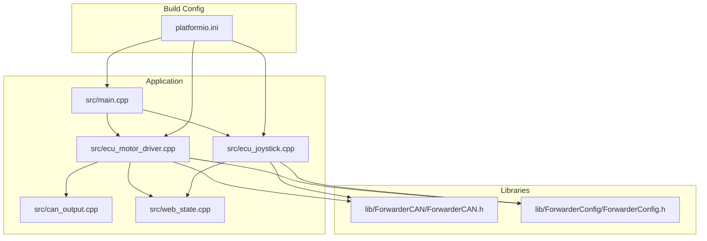
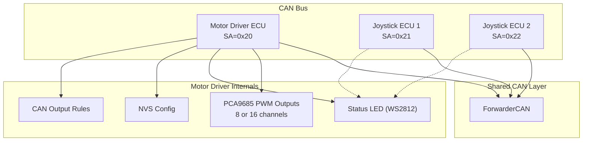
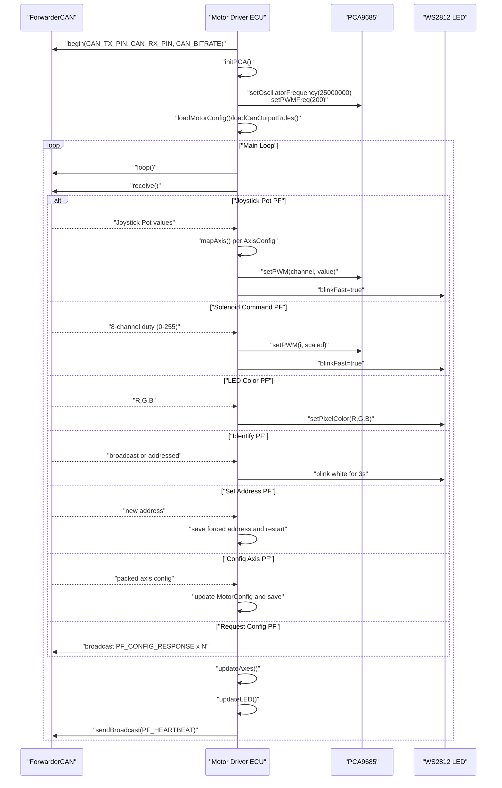
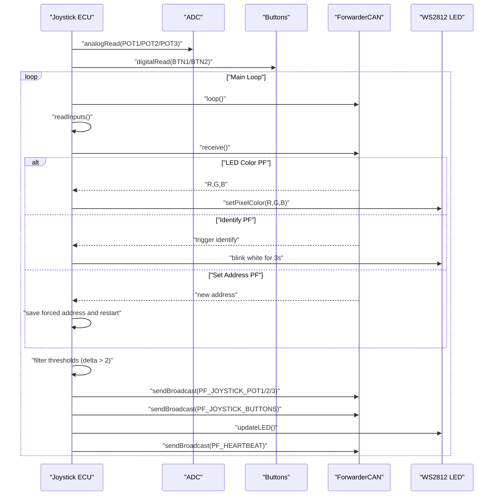
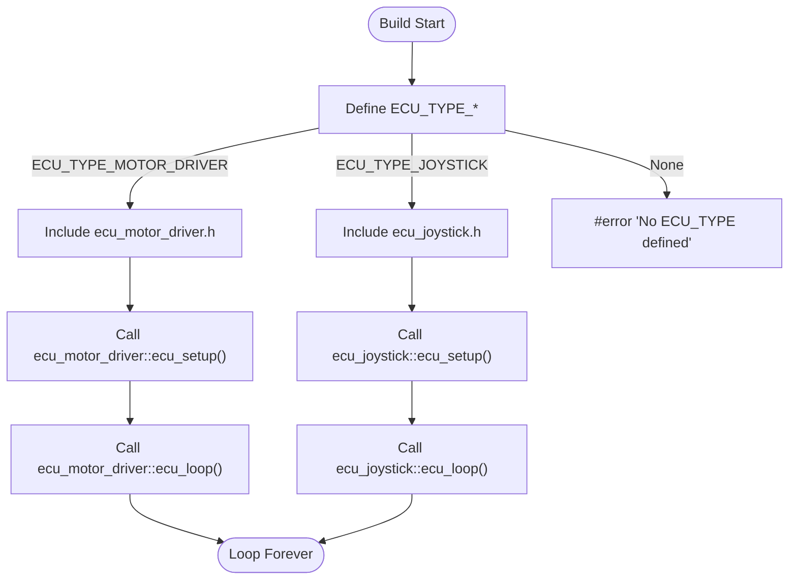
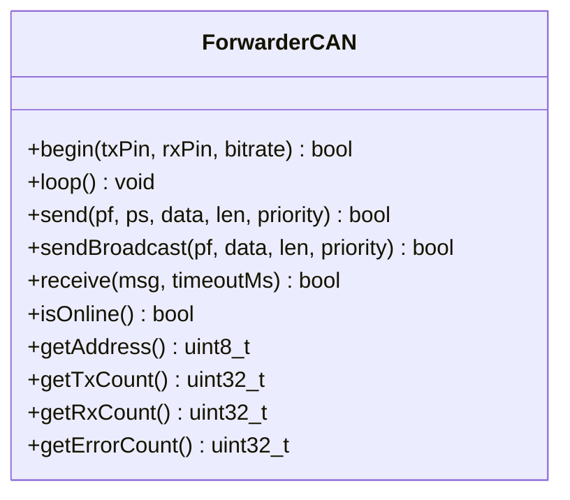
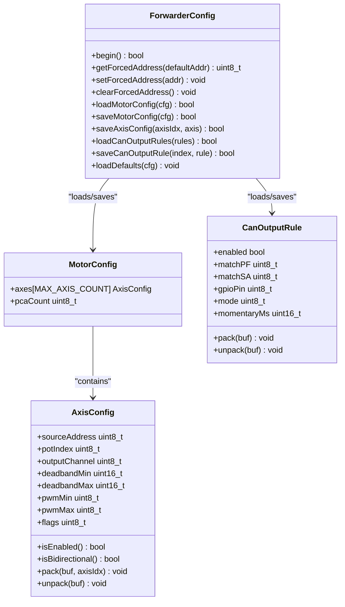
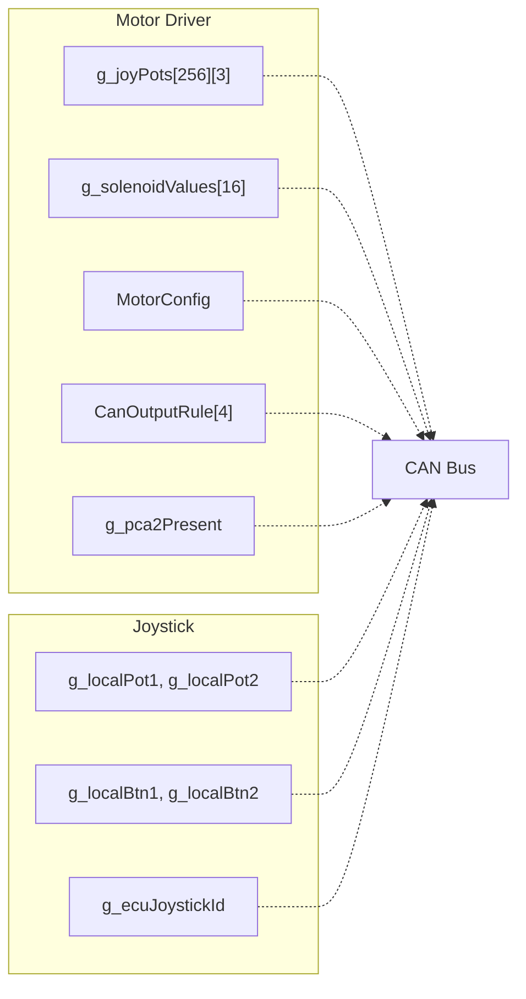
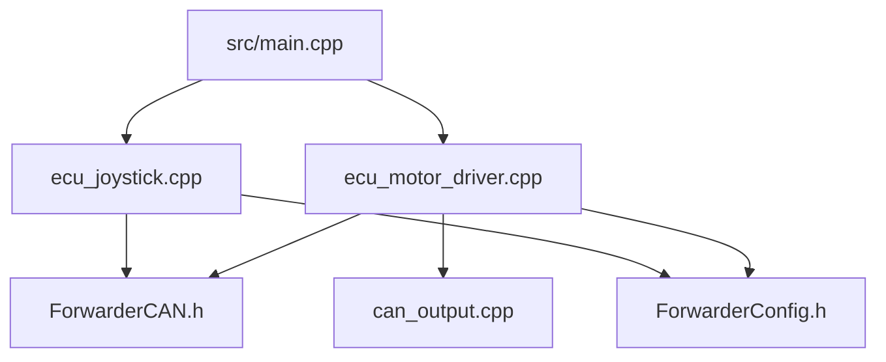

# ECU Implementations

<cite>
**Referenced Files in This Document**
- [main.cpp](file://src/main.cpp)
- [ecu_motor_driver.cpp](file://src/ecu_motor_driver.cpp)
- [ecu_motor_driver.h](file://src/ecu_motor_driver.h)
- [ecu_joystick.cpp](file://src/ecu_joystick.cpp)
- [ecu_joystick.h](file://src/ecu_joystick.h)
- [ForwarderCAN.h](file://lib/ForwarderCAN/ForwarderCAN.h)
- [ForwarderConfig.h](file://lib/ForwarderConfig/ForwarderConfig.h)
- [can_output.cpp](file://src/can_output.cpp)
- [can_output.h](file://src/can_output.h)
- [web_state.h](file://src/web_state.h)
- [web_state.cpp](file://src/web_state.cpp)
- [platformio.ini](file://platformio.ini)
- [README.md](file://README.md)
</cite>

## Table of Contents
1. [Introduction](#introduction)
2. [Project Structure](#project-structure)
3. [Core Components](#core-components)
4. [Architecture Overview](#architecture-overview)
5. [Detailed Component Analysis](#detailed-component-analysis)
6. [Dependency Analysis](#dependency-analysis)
7. [Performance Considerations](#performance-considerations)
8. [Troubleshooting Guide](#troubleshooting-guide)
9. [Conclusion](#conclusion)
10. [Appendices](#appendices)

## Introduction
This document provides comprehensive ECU implementation documentation for ForwarderKE, focusing on two specialized ECU types: the Motor Driver ECU and the Joystick ECU. It explains the hardware interfaces, control logic, CAN protocol usage, configuration management, and real-time constraints for each role. It also covers the compile-time ECU type selection mechanism, shared CAN communication layer usage, state synchronization, and practical configuration and troubleshooting procedures.

## Project Structure
The project is organized around a shared CAN/J1939-like protocol library and two ECU implementations that are selected at compile time. The Motor Driver ECU controls solenoids via PCA9685 PWM outputs, while the Joystick ECUs acquire analog inputs and buttons and publish them to the CAN bus. Both ECUs share the ForwarderCAN and ForwarderConfig libraries and expose runtime state for optional OTA web UI.

**Diagram sources**
- [main.cpp:1-32](file://src/main.cpp#L1-L32)
- [ecu_motor_driver.cpp:1-353](file://src/ecu_motor_driver.cpp#L1-L353)
- [ecu_joystick.cpp:1-239](file://src/ecu_joystick.cpp#L1-L239)
- [can_output.cpp:1-66](file://src/can_output.cpp#L1-L66)
- [ForwarderCAN.h:1-120](file://lib/ForwarderCAN/ForwarderCAN.h#L1-L120)
- [ForwarderConfig.h:1-92](file://lib/ForwarderConfig/ForwarderConfig.h#L1-L92)
- [platformio.ini:1-80](file://platformio.ini#L1-L80)

**Section sources**
- [README.md:112-126](file://README.md#L112-L126)
- [platformio.ini:1-80](file://platformio.ini#L1-L80)

## Core Components
- ECU Type Selection: Compile-time selection via build flags determines which ECU implementation is linked and executed.
- Motor Driver ECU: Controls up to 16 solenoids via PCA9685 PWM channels, manages LED status, handles safety timeouts, and supports CAN-configurable GPIO outputs.
- Joystick ECU: Reads 2–3 analog pots and 2 buttons, filters and broadcasts inputs, and exposes LED control and identification features.
- Shared CAN Layer: Provides J1939-like ID layout, address claiming, message framing, and statistics.
- Configuration Management: Stores forced addresses, axis mappings, and CAN output rules in NVS.
- CAN Output Rules: Translates incoming CAN messages into GPIO toggles or momentary pulses.

**Section sources**
- [main.cpp:6-17](file://src/main.cpp#L6-L17)
- [ecu_motor_driver.cpp:3-353](file://src/ecu_motor_driver.cpp#L3-L353)
- [ecu_joystick.cpp:3-239](file://src/ecu_joystick.cpp#L3-L239)
- [ForwarderCAN.h:38-119](file://lib/ForwarderCAN/ForwarderCAN.h#L38-L119)
- [ForwarderConfig.h:28-91](file://lib/ForwarderConfig/ForwarderConfig.h#L28-L91)
- [can_output.cpp:1-66](file://src/can_output.cpp#L1-L66)

## Architecture Overview
The system operates on a 250 kbps CAN bus with J1939-like 29-bit IDs. Two ECUs are present: Motor Driver (address 0x20) and two Joystick ECUs (addresses 0x21 and 0x22). The Motor Driver receives joystick inputs and solenoid commands, while the Joysticks publish analog and button states. Both ECUs broadcast heartbeats and support LED identification and address setting.

**Diagram sources**
- [README.md:8-14](file://README.md#L8-L14)
- [ForwarderCAN.h:22-34](file://lib/ForwarderCAN/ForwarderCAN.h#L22-L34)
- [ecu_motor_driver.cpp:39-48](file://src/ecu_motor_driver.cpp#L39-L48)
- [ecu_joystick.cpp:39-45](file://src/ecu_joystick.cpp#L39-L45)

## Detailed Component Analysis

### Motor Driver ECU Implementation
The Motor Driver ECU controls solenoids via PCA9685 PWM outputs, processes joystick CAN messages to derive axis outputs, and enforces a safety timeout to turn off outputs if no updates are received.

Key responsibilities:
- PCA9685 initialization and frequency configuration.
- Axis mapping with deadbands and directionality, converting 10-bit ADC values to 12-bit PWM duty cycles.
- Solenoid output control and “all-off” safety behavior on timeout.
- LED status indication (heartbeat, offline, fast blink, identify).
- CAN processing for joystick pots, solenoid commands, LED color, identify, address change, and axis configuration requests.
- Heartbeat broadcasting with operational metrics.
- Optional OTA web server for firmware updates.

**Diagram sources**
- [ecu_motor_driver.cpp:184-275](file://src/ecu_motor_driver.cpp#L184-L275)
- [ecu_motor_driver.cpp:101-151](file://src/ecu_motor_driver.cpp#L101-L151)
- [ecu_motor_driver.cpp:277-288](file://src/ecu_motor_driver.cpp#L277-L288)
- [ForwarderCAN.h:38-50](file://lib/ForwarderCAN/ForwarderCAN.h#L38-L50)

Implementation highlights:
- PCA9685 PWM control logic:
  - Channel routing between PCA9685 units and safe clamping to 12-bit scale.
  - Initialization sequence sets oscillator frequency and PWM rate.
- Solenoid actuation sequences:
  - Deadband-aware mapping for unidirectional and bidirectional axes.
  - Periodic update of solenoid values and immediate PWM writes when changed.
- Safety timeout mechanisms:
  - If no joystick update within SAFETY_TIMEOUT_MS, all solenoids are turned off.
- CAN message handling:
  - Dedicated handlers for joystick pots, solenoid commands, LED color, identify, address change, and configuration requests.
- Heartbeat and LED:
  - Heartbeat includes online status, uptime, and counts; LED reflects offline, fast blink, identify, and steady color modes.

**Section sources**
- [ecu_motor_driver.cpp:69-83](file://src/ecu_motor_driver.cpp#L69-L83)
- [ecu_motor_driver.cpp:85-99](file://src/ecu_motor_driver.cpp#L85-L99)
- [ecu_motor_driver.cpp:101-135](file://src/ecu_motor_driver.cpp#L101-L135)
- [ecu_motor_driver.cpp:137-151](file://src/ecu_motor_driver.cpp#L137-L151)
- [ecu_motor_driver.cpp:153-182](file://src/ecu_motor_driver.cpp#L153-L182)
- [ecu_motor_driver.cpp:184-275](file://src/ecu_motor_driver.cpp#L184-L275)
- [ecu_motor_driver.cpp:277-288](file://src/ecu_motor_driver.cpp#L277-L288)
- [ecu_motor_driver.cpp:325-350](file://src/ecu_motor_driver.cpp#L325-L350)

### Joystick ECU Implementation
The Joystick ECUs read analog pots and buttons, apply input filtering, and broadcast CAN messages. They support LED control and identification, and can change their address via CAN.

Key responsibilities:
- Analog input acquisition with ADC resolution and attenuation settings.
- Button debouncing via threshold comparisons and periodic retransmit.
- CAN message broadcasting for pots and buttons with minimal bandwidth.
- LED status indication and identification pattern.
- Address setting via CAN and persistent storage.
- Heartbeat broadcasting with operational metrics.

**Diagram sources**
- [ecu_joystick.cpp:63-68](file://src/ecu_joystick.cpp#L63-L68)
- [ecu_joystick.cpp:99-112](file://src/ecu_joystick.cpp#L99-L112)
- [ecu_joystick.cpp:114-144](file://src/ecu_joystick.cpp#L114-L144)
- [ecu_joystick.cpp:159-192](file://src/ecu_joystick.cpp#L159-L192)
- [ecu_joystick.cpp:194-236](file://src/ecu_joystick.cpp#L194-L236)
- [ForwarderCAN.h:39-42](file://lib/ForwarderCAN/ForwarderCAN.h#L39-L42)

Implementation highlights:
- Analog input processing:
  - ADC resolution and attenuation configured for consistent readings.
  - Filtering compares previous values against a small delta threshold before sending.
- Button state management:
  - Internal pullup resistors with active-low logic; buttons packed into a single byte.
- CAN broadcasting:
  - Potentiometer values sent as 2-byte little-endian payloads.
  - Buttons sent as a single-byte bitmask.
- LED and identification:
  - LED brightness controlled by a global color buffer; identification toggles white periodically.
- Heartbeat and address management:
  - Heartbeat includes online status, uptime, and joystick identity; address changes stored persistently.

**Section sources**
- [ecu_joystick.cpp:159-192](file://src/ecu_joystick.cpp#L159-L192)
- [ecu_joystick.cpp:194-236](file://src/ecu_joystick.cpp#L194-L236)

### Compile-Time ECU Type Selection
The ECU type is selected at compile time via build flags. The main entry point conditionally includes the appropriate ECU header and invokes its setup and loop functions.

**Diagram sources**
- [main.cpp:6-17](file://src/main.cpp#L6-L17)
- [ecu_motor_driver.h:1-5](file://src/ecu_motor_driver.h#L1-L5)
- [ecu_joystick.h:1-5](file://src/ecu_joystick.h#L1-L5)

Build configuration specifics:
- Motor Driver environment defines preferred address, PCA9685 pins, and safety timeout.
- Joystick environments define preferred address, joystick ID, ADC pins, button pins, and optional CAN enable pin.
- OTA-enabled environments add a web server for firmware uploads.

**Section sources**
- [platformio.ini:17-30](file://platformio.ini#L17-L30)
- [platformio.ini:31-62](file://platformio.ini#L31-L62)
- [platformio.ini:63-80](file://platformio.ini#L63-L80)
- [README.md:43-46](file://README.md#L43-L46)

### Shared CAN Communication Layer Usage
Both ECUs rely on the ForwarderCAN library for:
- J1939-like ID packing/unpacking helpers.
- Address claiming and arbitration with configurable retries and timeouts.
- Send/receive APIs for broadcast and addressed messages.
- Statistics for TX/RX/error counts.

**Diagram sources**
- [ForwarderCAN.h:66-119](file://lib/ForwarderCAN/ForwarderCAN.h#L66-L119)

**Section sources**
- [ForwarderCAN.h:22-34](file://lib/ForwarderCAN/ForwarderCAN.h#L22-L34)
- [ForwarderCAN.h:85-91](file://lib/ForwarderCAN/ForwarderCAN.h#L85-L91)

### Configuration Dependency Management
Configuration is managed via ForwarderConfig, which stores:
- Forced address overrides in NVS.
- Motor mapping configurations (axes, deadbands, PWM ranges).
- CAN output rules for GPIO toggling or momentary activation.

**Diagram sources**
- [ForwarderConfig.h:64-91](file://lib/ForwarderConfig/ForwarderConfig.h#L64-L91)
- [ForwarderConfig.h:59-62](file://lib/ForwarderConfig/ForwarderConfig.h#L59-L62)
- [ForwarderConfig.h:41-57](file://lib/ForwarderConfig/ForwarderConfig.h#L41-L57)
- [ForwarderConfig.h:29-39](file://lib/ForwarderConfig/ForwarderConfig.h#L29-L39)

**Section sources**
- [ecu_motor_driver.cpp:45-47](file://src/ecu_motor_driver.cpp#L45-L47)
- [ecu_motor_driver.cpp:296-300](file://src/ecu_motor_driver.cpp#L296-L300)
- [ecu_joystick.cpp:41-41](file://src/ecu_joystick.cpp#L41-L41)
- [ecu_joystick.cpp:171-172](file://src/ecu_joystick.cpp#L171-L172)

### State Synchronization Between ECUs
Runtime state is exposed for the web UI and synchronized across ECUs via CAN:
- Motor Driver exposes joystick inputs, solenoid values, PCA presence, configuration, and CAN output rules.
- Joystick ECU exposes local pot and button states and its joystick identity.
- CAN messages carry the state updates, enabling centralized monitoring and configuration.

**Diagram sources**
- [web_state.h:10-23](file://src/web_state.h#L10-L23)
- [web_state.cpp:6-19](file://src/web_state.cpp#L6-L19)
- [ecu_motor_driver.cpp:59-61](file://src/ecu_motor_driver.cpp#L59-L61)
- [ecu_motor_driver.cpp:47-48](file://src/ecu_motor_driver.cpp#L47-L48)
- [ecu_joystick.cpp:43-45](file://src/ecu_joystick.cpp#L43-L45)

**Section sources**
- [web_state.h:10-23](file://src/web_state.h#L10-L23)
- [web_state.cpp:6-19](file://src/web_state.cpp#L6-L19)

## Dependency Analysis
The Motor Driver and Joystick ECUs share the same CAN library and configuration manager, while each maintains its own ECU-specific logic and hardware interfaces. The Motor Driver additionally integrates PCA9685 PWM drivers and optional CAN output rules.

**Diagram sources**
- [main.cpp:11-14](file://src/main.cpp#L11-L14)
- [ecu_motor_driver.cpp:1-12](file://src/ecu_motor_driver.cpp#L1-L12)
- [ecu_joystick.cpp:1-9](file://src/ecu_joystick.cpp#L1-L9)
- [ForwarderCAN.h:1-6](file://lib/ForwarderCAN/ForwarderCAN.h#L1-L6)
- [ForwarderConfig.h:1-6](file://lib/ForwarderConfig/ForwarderConfig.h#L1-L6)
- [can_output.cpp:1-1](file://src/can_output.cpp#L1-L1)

**Section sources**
- [ecu_motor_driver.cpp:1-12](file://src/ecu_motor_driver.cpp#L1-L12)
- [ecu_joystick.cpp:1-9](file://src/ecu_joystick.cpp#L1-L9)

## Performance Considerations
- Real-time constraints:
  - CAN bus bitrate is fixed at 250 kbps; message rates are bounded by heartbeat intervals and input filtering thresholds.
  - Motor Driver updates PWM channels only when values change and applies a safety timeout to prevent stale outputs.
  - Joystick ECU sends pots/buttons at least once per 100 ms and applies delta thresholds to reduce traffic.
- Interrupt handling and timing:
  - ForwarderCAN uses the ESP32 TWAI driver; address claiming and message reception are handled asynchronously.
  - PWM generation occurs in dedicated hardware on PCA9685; updates are immediate upon setPWM calls.
- Timing requirements:
  - Heartbeat broadcast occurs every 1000 ms.
  - Safety timeout for solenoids is configurable and defaults to 500 ms.
  - LED update throttled to ~50 ms intervals.

[No sources needed since this section provides general guidance]

## Troubleshooting Guide
Common issues and resolutions:
- CAN initialization failure:
  - Symptoms: Repeated LED blinks indicating CAN init failure.
  - Actions: Verify wiring, pin assignments, and transceiver enable pin if used.
- Address conflicts:
  - Symptoms: Address claiming fails or device remains offline.
  - Actions: Use PF_SET_ADDRESS to force a new address; confirm NVS storage and restart.
- No joystick inputs reaching motor driver:
  - Symptoms: Motor driver LED does not blink; solenoids remain off.
  - Actions: Confirm joystick address and PF_JOYSTICK_POTx messages; check axis mapping and deadband settings.
- PCA9685 not detected:
  - Symptoms: Only 8 channels active; console log indicates single PCA9685.
  - Actions: Verify I2C wiring and addresses; ensure PCA9685_SDA/SCL pins are correct.
- Excessive CAN traffic:
  - Symptoms: Frequent retransmissions or dropped frames.
  - Actions: Increase send intervals or adjust delta thresholds; verify filtering logic.
- OTA upload failures:
  - Symptoms: Web UI unreachable after flashing.
  - Actions: Ensure OTA environment is selected; connect to AP and upload firmware binary.

**Section sources**
- [ecu_motor_driver.cpp:305-316](file://src/ecu_motor_driver.cpp#L305-L316)
- [ecu_joystick.cpp:174-185](file://src/ecu_joystick.cpp#L174-L185)
- [ecu_motor_driver.cpp:91-98](file://src/ecu_motor_driver.cpp#L91-L98)
- [ecu_motor_driver.cpp:234-244](file://src/ecu_motor_driver.cpp#L234-L244)
- [ecu_joystick.cpp:132-142](file://src/ecu_joystick.cpp#L132-L142)
- [README.md:105-111](file://README.md#L105-L111)

## Conclusion
ForwarderKE’s dual ECU architecture cleanly separates motor control and input acquisition responsibilities while sharing a robust CAN/J1939-like protocol and configuration management layer. The Motor Driver ECU emphasizes deterministic PWM control and safety timeouts, whereas the Joystick ECUs focus on responsive analog and button acquisition with minimal bandwidth. Compile-time selection and environment-specific configurations ensure correct hardware mapping and behavior for each role.

[No sources needed since this section summarizes without analyzing specific files]

## Appendices

### Practical Configuration Examples
- Motor Driver:
  - Preferred address: 0x20; PCA9685 I2C pins: SDA 21, SCL 22; WS2812 LED pin: 48; Safety timeout: 500 ms.
  - Configure axis mapping via PF_CONFIG_AXIS; request current config via PF_REQUEST_CONFIG.
- Joystick:
  - Preferred address: 0x21 or 0x22; ADC pins: POT1 32, POT2 33; Buttons: BTN1 12, BTN2 18; Optional CAN SE pin: 23.
  - Change address via PF_SET_ADDRESS; trigger identification via PF_IDENTIFY.

**Section sources**
- [platformio.ini:17-30](file://platformio.ini#L17-L30)
- [platformio.ini:31-62](file://platformio.ini#L31-L62)
- [ecu_motor_driver.cpp:246-267](file://src/ecu_motor_driver.cpp#L246-L267)
- [ecu_motor_driver.cpp:257-267](file://src/ecu_motor_driver.cpp#L257-L267)
- [ecu_joystick.cpp:132-142](file://src/ecu_joystick.cpp#L132-L142)
- [ecu_joystick.cpp:127-132](file://src/ecu_joystick.cpp#L127-L132)

### CAN Protocol Reference
- Joystick to Motor:
  - PF_JOYSTICK_POT1/2/3: 2-byte values (10-bit).
  - PF_JOYSTICK_BUTTONS: 1-byte bitmask.
- Motor to Motor:
  - PF_SOLENOID_CMD: 8-byte array of 0–255 mapped to 12-bit PWM.
- Control:
  - PF_LED_COLOR: 3-byte RGB.
  - PF_IDENTIFY: Trigger identification pattern.
  - PF_SET_ADDRESS: Set forced address and restart.
  - PF_CONFIG_AXIS: Packaged axis configuration.
  - PF_REQUEST_CONFIG: Request axis config responses.
  - PF_HEARTBEAT: Status and counters.

**Section sources**
- [ForwarderCAN.h:39-50](file://lib/ForwarderCAN/ForwarderCAN.h#L39-L50)
- [README.md:29-42](file://README.md#L29-L42)