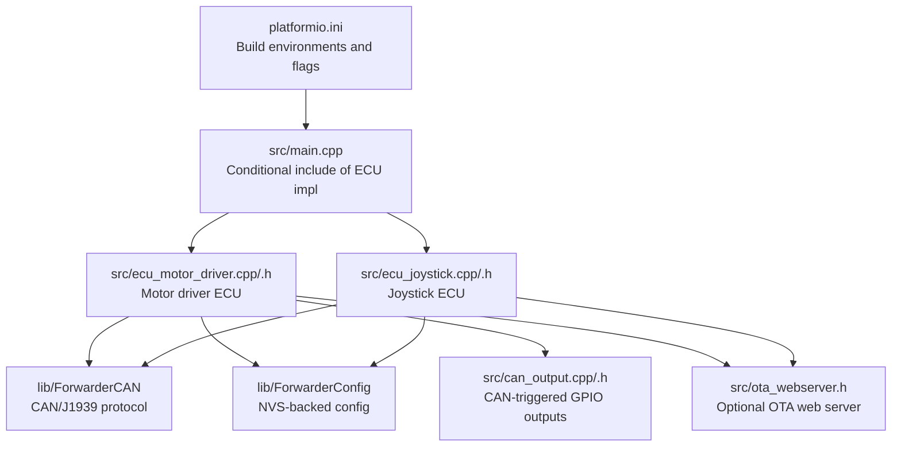
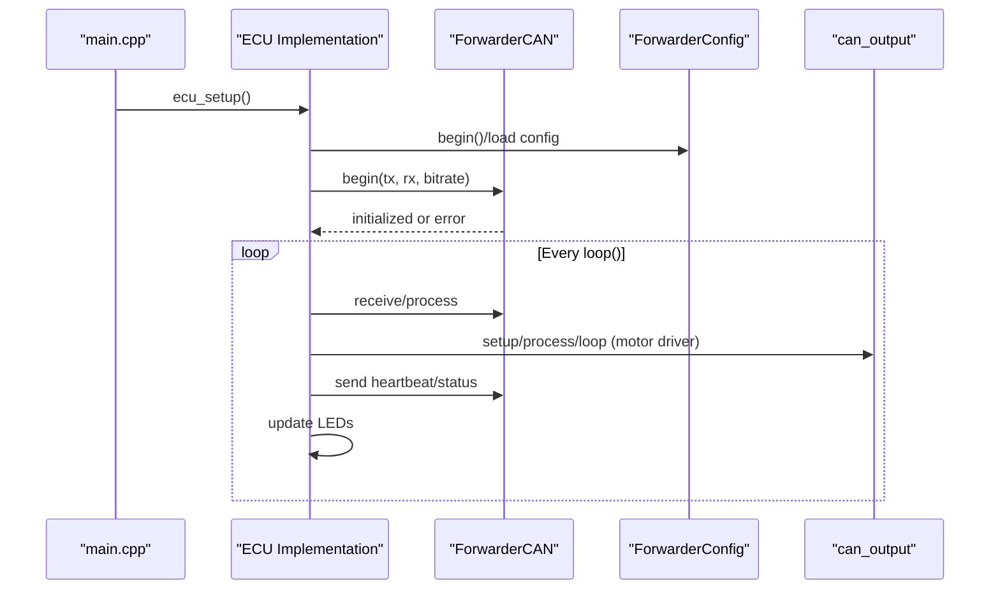
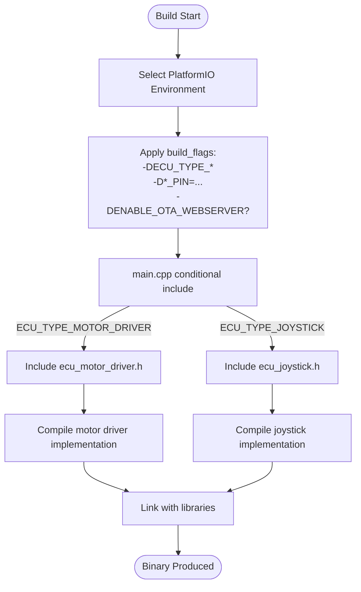
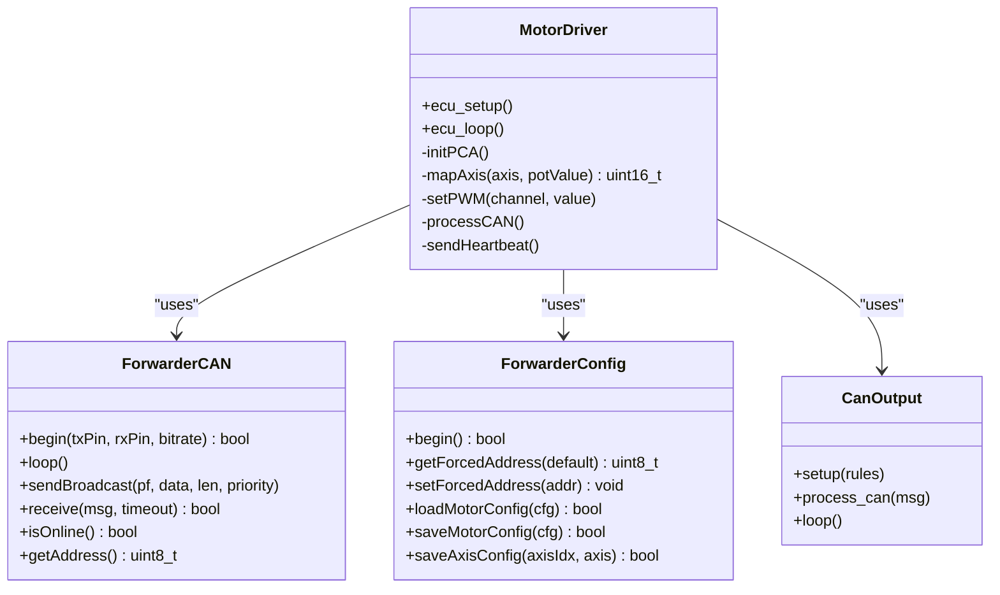
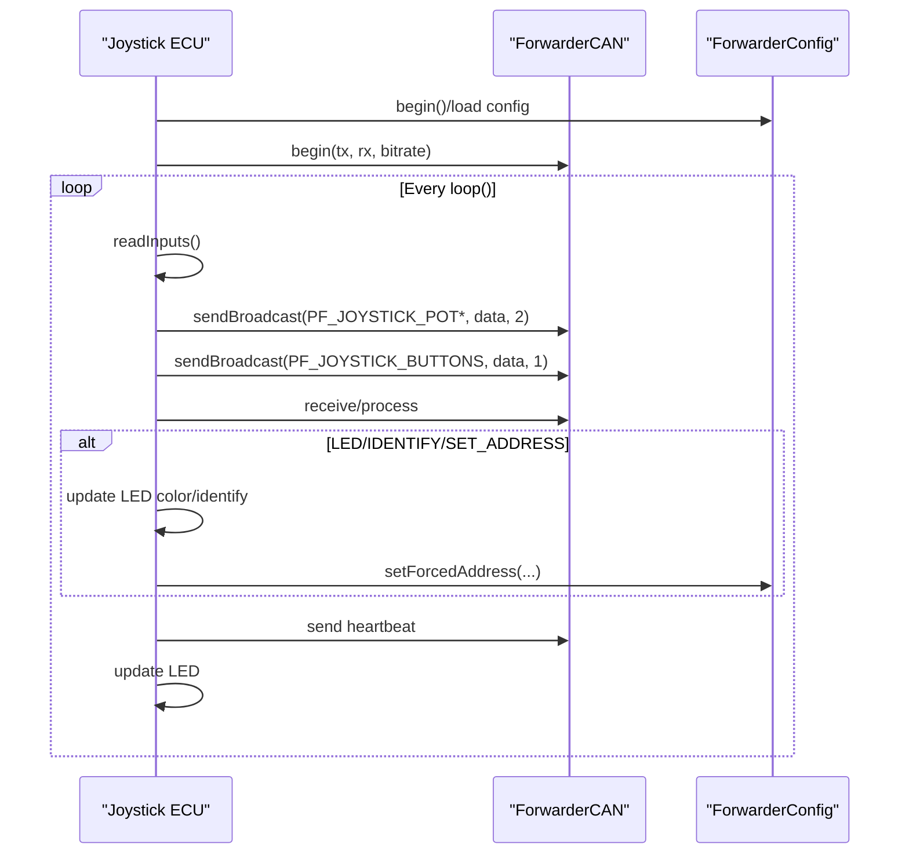
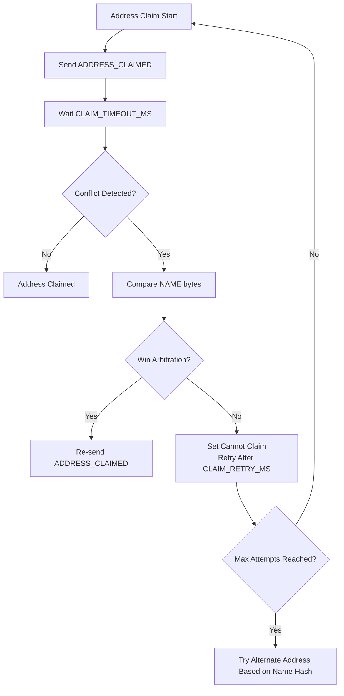
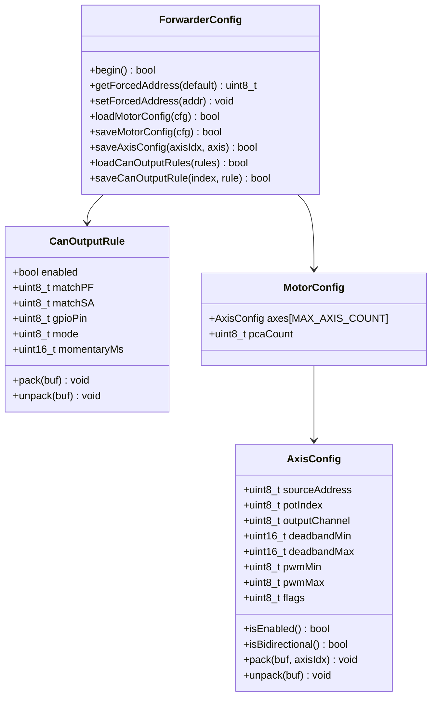
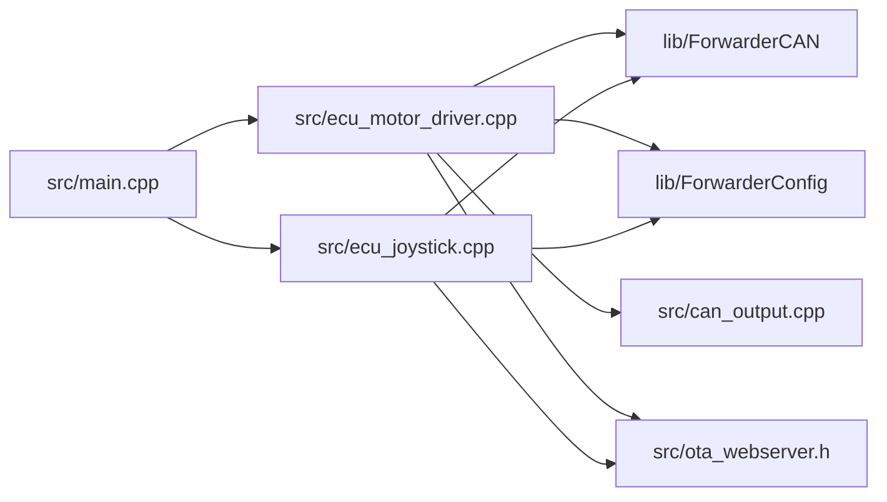

# ECU Type Selection

<cite>
**Referenced Files in This Document**
- [platformio.ini](file://platformio.ini)
- [main.cpp](file://src/main.cpp)
- [ecu_motor_driver.h](file://src/ecu_motor_driver.h)
- [ecu_motor_driver.cpp](file://src/ecu_motor_driver.cpp)
- [ecu_joystick.h](file://src/ecu_joystick.h)
- [ecu_joystick.cpp](file://src/ecu_joystick.cpp)
- [ForwarderCAN.h](file://lib/ForwarderCAN/ForwarderCAN.h)
- [ForwarderCAN.cpp](file://lib/ForwarderCAN/ForwarderCAN.cpp)
- [ForwarderConfig.h](file://lib/ForwarderConfig/ForwarderConfig.h)
- [ForwarderConfig.cpp](file://lib/ForwarderConfig/ForwarderConfig.cpp)
- [can_output.h](file://src/can_output.h)
- [can_output.cpp](file://src/can_output.cpp)
- [ota_webserver.h](file://src/ota_webserver.h)
- [web_state.h](file://src/web_state.h)
- [README.md](file://README.md)
</cite>

## Table of Contents
1. [Introduction](#introduction)
2. [Project Structure](#project-structure)
3. [Core Components](#core-components)
4. [Architecture Overview](#architecture-overview)
5. [Detailed Component Analysis](#detailed-component-analysis)
6. [Dependency Analysis](#dependency-analysis)
7. [Performance Considerations](#performance-considerations)
8. [Troubleshooting Guide](#troubleshooting-guide)
9. [Conclusion](#conclusion)
10. [Appendices](#appendices)

## Introduction
This document explains the ECU type selection mechanism that determines which ECU implementation is compiled into the firmware. It covers compile-time configuration using ECU_TYPE_MOTOR_DRIVER and ECU_TYPE_JOYSTICK preprocessor directives, PlatformIO environment configuration enabling different ECU types through build targets, and how the selection affects code inclusion, hardware pin assignments, and feature availability. It also describes the conditional compilation approach allowing a single codebase to support multiple ECU variants, and discusses hardware requirements, memory usage, and functional differences between the motor driver and joystick implementations.

## Project Structure
The project uses a shared codebase with ECU-specific logic selected at compile time. PlatformIO environments define build flags that enable either the motor driver or joystick ECU, along with hardware pin and feature flags. The entry point conditionally includes the appropriate ECU implementation header based on the selected build target.

**Diagram sources**
- [platformio.ini](file://platformio.ini)
- [main.cpp](file://src/main.cpp)
- [ecu_motor_driver.cpp](file://src/ecu_motor_driver.cpp)
- [ecu_joystick.cpp](file://src/ecu_joystick.cpp)
- [ForwarderCAN.h](file://lib/ForwarderCAN/ForwarderCAN.h)
- [ForwarderConfig.h](file://lib/ForwarderConfig/ForwarderConfig.h)
- [can_output.cpp](file://src/can_output.cpp)
- [ota_webserver.h](file://src/ota_webserver.h)

**Section sources**
- [platformio.ini](file://platformio.ini)
- [main.cpp](file://src/main.cpp)

## Core Components
- ECU type selection directive:
  - ECU_TYPE_MOTOR_DRIVER: Compiles the motor driver ECU implementation.
  - ECU_TYPE_JOYSTICK: Compiles the joystick ECU implementation.
- PlatformIO environments:
  - motor_driver, joystick1, joystick2: Select the ECU type and set hardware pin and device-specific flags.
  - *_ota variants: Extend base environments to enable OTA web server support.
- Conditional inclusion in main.cpp:
  - The entry point includes the appropriate ECU header based on the selected directive.
- ECU implementations:
  - ecu_motor_driver.cpp: Controls solenoids via PCA9685 PWM channels, reads joystick CAN data, manages LEDs, and supports CAN output rules.
  - ecu_joystick.cpp: Reads analog pots/buttons, publishes joystick data on CAN, manages LEDs, and supports address assignment.

**Section sources**
- [main.cpp](file://src/main.cpp)
- [ecu_motor_driver.h](file://src/ecu_motor_driver.h)
- [ecu_motor_driver.cpp](file://src/ecu_motor_driver.cpp)
- [ecu_joystick.h](file://src/ecu_joystick.h)
- [ecu_joystick.cpp](file://src/ecu_joystick.cpp)
- [platformio.ini](file://platformio.ini)

## Architecture Overview
The system uses a shared CAN/J1939-like protocol with J1939-style 29-bit IDs. Each ECU type implements a common interface (ecu_setup, ecu_loop) and leverages shared libraries for CAN messaging and persistent configuration. The motor driver consumes joystick CAN messages to drive solenoids, while joysticks publish joystick data and respond to LED/color commands.

**Diagram sources**
- [main.cpp](file://src/main.cpp)
- [ecu_motor_driver.cpp](file://src/ecu_motor_driver.cpp)
- [ecu_joystick.cpp](file://src/ecu_joystick.cpp)
- [ForwarderCAN.h](file://lib/ForwarderCAN/ForwarderCAN.h)
- [ForwarderCAN.cpp](file://lib/ForwarderCAN/ForwarderCAN.cpp)
- [ForwarderConfig.h](file://lib/ForwarderConfig/ForwarderConfig.h)
- [ForwarderConfig.cpp](file://lib/ForwarderConfig/ForwarderConfig.cpp)
- [can_output.cpp](file://src/can_output.cpp)

## Detailed Component Analysis

### ECU Type Selection and Conditional Compilation
- Preprocessor directives:
  - ECU_TYPE_MOTOR_DRIVER and ECU_TYPE_JOYSTICK control which ECU implementation is compiled.
  - If neither is defined, compilation fails with an explicit error.
- Entry point behavior:
  - main.cpp conditionally includes the motor driver or joystick header based on the selected directive.
- PlatformIO environment flags:
  - motor_driver sets ECU_TYPE_MOTOR_DRIVER and related hardware flags (e.g., PCA9685 pins, LED pin).
  - joystick1/joystick2 set ECU_TYPE_JOYSTICK and related hardware flags (e.g., pot pins, button pins, CAN SE pin).
  - *_ota environments add ENABLE_OTA_WEBSERVER to enable the OTA web server.

**Diagram sources**
- [platformio.ini](file://platformio.ini)
- [main.cpp](file://src/main.cpp)
- [ecu_motor_driver.h](file://src/ecu_motor_driver.h)
- [ecu_joystick.h](file://src/ecu_joystick.h)

**Section sources**
- [main.cpp](file://src/main.cpp)
- [platformio.ini](file://platformio.ini)

### Motor Driver ECU
- Purpose:
  - Receives joystick CAN messages and controls solenoids via PCA9685 PWM channels.
  - Manages onboard LED status, heartbeat, and optional OTA web server.
- Key features:
  - Reads joystick pots from CAN buffer and maps to solenoid PWM values per axis configuration.
  - Supports dual PCA9685 detection and up to 16 channels.
  - Processes CAN commands: LED color, identify, set address, configure axes, solenoid command, heartbeat.
  - Safety timeout to turn off solenoids after inactivity.
- Hardware pins and flags:
  - CAN TX/RX pins configurable via build flags.
  - PCA9685 I2C SDA/SCL pins and address constants.
  - WS2812 LED pin configurable via build flags.
  - Safety timeout configurable via build flags.
- Persistent configuration:
  - Stores forced address and motor/axis configuration in NVS.
  - Supports saving/loading axis mapping and CAN output rules.

**Diagram sources**
- [ecu_motor_driver.cpp](file://src/ecu_motor_driver.cpp)
- [ForwarderCAN.h](file://lib/ForwarderCAN/ForwarderCAN.h)
- [ForwarderCAN.cpp](file://lib/ForwarderCAN/ForwarderCAN.cpp)
- [ForwarderConfig.h](file://lib/ForwarderConfig/ForwarderConfig.h)
- [ForwarderConfig.cpp](file://lib/ForwarderConfig/ForwarderConfig.cpp)
- [can_output.cpp](file://src/can_output.cpp)

**Section sources**
- [ecu_motor_driver.cpp](file://src/ecu_motor_driver.cpp)
- [ForwarderCAN.h](file://lib/ForwarderCAN/ForwarderCAN.h)
- [ForwarderCAN.cpp](file://lib/ForwarderCAN/ForwarderCAN.cpp)
- [ForwarderConfig.h](file://lib/ForwarderConfig/ForwarderConfig.h)
- [ForwarderConfig.cpp](file://lib/ForwarderConfig/ForwarderConfig.cpp)
- [can_output.cpp](file://src/can_output.cpp)

### Joystick ECU
- Purpose:
  - Reads analog pots/buttons and publishes joystick data on CAN.
  - Manages onboard LED status, heartbeat, and optional OTA web server.
- Key features:
  - Reads analog inputs with configured resolution/attenuation and debounced buttons.
  - Sends joystick potentiometer and button messages periodically or on change.
  - Responds to LED color, identify, and set address commands.
- Hardware pins and flags:
  - CAN TX/RX pins configurable via build flags.
  - Optional CAN SE pin for transceiver enable.
  - Potentiometer pins and button pins configurable via build flags.
  - WS2812 LED pin configurable via build flags.
  - Joystick ID configurable via build flags (distinguishes joystick1 vs joystick2).
- Persistent configuration:
  - Stores forced address in NVS.
  - Uses a separate configuration namespace from motor driver.

**Diagram sources**
- [ecu_joystick.cpp](file://src/ecu_joystick.cpp)
- [ForwarderCAN.h](file://lib/ForwarderCAN/ForwarderCAN.h)
- [ForwarderCAN.cpp](file://lib/ForwarderCAN/ForwarderCAN.cpp)
- [ForwarderConfig.h](file://lib/ForwarderConfig/ForwarderConfig.h)
- [ForwarderConfig.cpp](file://lib/ForwarderConfig/ForwarderConfig.cpp)

**Section sources**
- [ecu_joystick.cpp](file://src/ecu_joystick.cpp)
- [ForwarderCAN.h](file://lib/ForwarderCAN/ForwarderCAN.h)
- [ForwarderCAN.cpp](file://lib/ForwarderCAN/ForwarderCAN.cpp)
- [ForwarderConfig.h](file://lib/ForwarderConfig/ForwarderConfig.h)
- [ForwarderConfig.cpp](file://lib/ForwarderConfig/ForwarderConfig.cpp)

### CAN Protocol and Addressing
- J1939-like 29-bit ID layout with Priority, DP, PF, PS/DA, SA.
- Custom PF values for joystick and motor driver functions.
- Address claiming and arbitration ensure unique addresses on the bus.
- Broadcast and directed addressing supported.

**Diagram sources**
- [ForwarderCAN.h](file://lib/ForwarderCAN/ForwarderCAN.h)
- [ForwarderCAN.cpp](file://lib/ForwarderCAN/ForwarderCAN.cpp)

**Section sources**
- [ForwarderCAN.h](file://lib/ForwarderCAN/ForwarderCAN.h)
- [ForwarderCAN.cpp](file://lib/ForwarderCAN/ForwarderCAN.cpp)

### Configuration and CAN Output Rules
- ForwarderConfig stores:
  - Forced address in NVS.
  - Motor mapping configuration (axes, PCA count).
  - CAN output rules for GPIO toggling or momentary pulses.
- CAN output module:
  - Matches incoming CAN messages against configured rules.
  - Toggles or momentarily activates GPIO outputs based on rule mode.

**Diagram sources**
- [ForwarderConfig.h](file://lib/ForwarderConfig/ForwarderConfig.h)
- [ForwarderConfig.cpp](file://lib/ForwarderConfig/ForwarderConfig.cpp)
- [can_output.cpp](file://src/can_output.cpp)

**Section sources**
- [ForwarderConfig.h](file://lib/ForwarderConfig/ForwarderConfig.h)
- [ForwarderConfig.cpp](file://lib/ForwarderConfig/ForwarderConfig.cpp)
- [can_output.cpp](file://src/can_output.cpp)

## Dependency Analysis
- Conditional inclusion:
  - main.cpp depends on the selected ECU type via preprocessor directives.
- ECU implementations:
  - Both ecu_motor_driver.cpp and ecu_joystick.cpp depend on ForwarderCAN and ForwarderConfig.
  - Motor driver additionally depends on can_output for GPIO control and optionally on OTA web server.
- PlatformIO environment inheritance:
  - *_ota environments extend base environments and add OTA flags.

**Diagram sources**
- [main.cpp](file://src/main.cpp)
- [ecu_motor_driver.cpp](file://src/ecu_motor_driver.cpp)
- [ecu_joystick.cpp](file://src/ecu_joystick.cpp)
- [ForwarderCAN.h](file://lib/ForwarderCAN/ForwarderCAN.h)
- [ForwarderConfig.h](file://lib/ForwarderConfig/ForwarderConfig.h)
- [can_output.cpp](file://src/can_output.cpp)
- [ota_webserver.h](file://src/ota_webserver.h)

**Section sources**
- [main.cpp](file://src/main.cpp)
- [platformio.ini](file://platformio.ini)

## Performance Considerations
- Memory usage:
  - Motor driver maintains larger buffers for joystick pots and solenoid values, plus CAN output rules, increasing RAM footprint compared to joystick.
- Processing overhead:
  - Motor driver performs axis mapping and PWM updates, plus CAN output rule evaluation.
  - Joystick driver performs analog reads and periodic/burst sends.
- CAN bus utilization:
  - Both ECUs broadcast heartbeats; joystick sends joystick data periodically or on change.
- Safety and reliability:
  - Motor driver includes a safety timeout to disable outputs after inactivity.
  - CAN driver handles bus-off recovery automatically.

[No sources needed since this section provides general guidance]

## Troubleshooting Guide
- Build fails with “No ECU_TYPE defined”:
  - Ensure a valid environment is selected (motor_driver, joystick1, joystick2).
- CAN initialization failure:
  - Verify CAN TX/RX pin configuration matches hardware.
  - Confirm external transceiver wiring and power.
- Address conflicts:
  - Observe address claiming logs; arbitration resolves conflicts automatically.
- OTA upload issues:
  - Confirm *_ota environment is used and Wi-Fi credentials are applied.
- Unexpected LED behavior:
  - Check LED color commands and identify requests; verify WS2812 pin configuration.

**Section sources**
- [main.cpp](file://src/main.cpp)
- [ecu_motor_driver.cpp](file://src/ecu_motor_driver.cpp)
- [ecu_joystick.cpp](file://src/ecu_joystick.cpp)
- [ForwarderCAN.cpp](file://lib/ForwarderCAN/ForwarderCAN.cpp)
- [README.md](file://README.md)

## Conclusion
The ECU type selection mechanism uses compile-time preprocessor directives and PlatformIO environments to tailor a single codebase for distinct hardware roles. The motor driver ECU focuses on solenoid control and configuration persistence, while the joystick ECU focuses on input acquisition and CAN publishing. The shared CAN/J1939-like protocol and libraries enable consistent behavior across variants, with environment-specific flags controlling hardware pin assignments, feature availability, and OTA support.

[No sources needed since this section summarizes without analyzing specific files]

## Appendices

### Practical Guidance: Choosing the Right Build Environment
- Use motor_driver for the valve block controller with PCA9685:
  - Includes PCA9685 I2C pins, LED pin, and safety timeout.
- Use joystick1 or joystick2 for joystick units:
  - Distinguish via ECU_JOYSTICK_ID and preferred address.
  - Configure pot/button pins and optional CAN SE pin.
- Enable OTA uploads:
  - Use *_ota environments to include the web server and upload interface.

**Section sources**
- [platformio.ini](file://platformio.ini)
- [README.md](file://README.md)