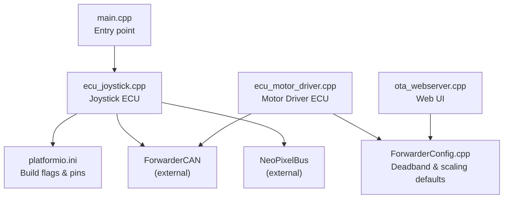
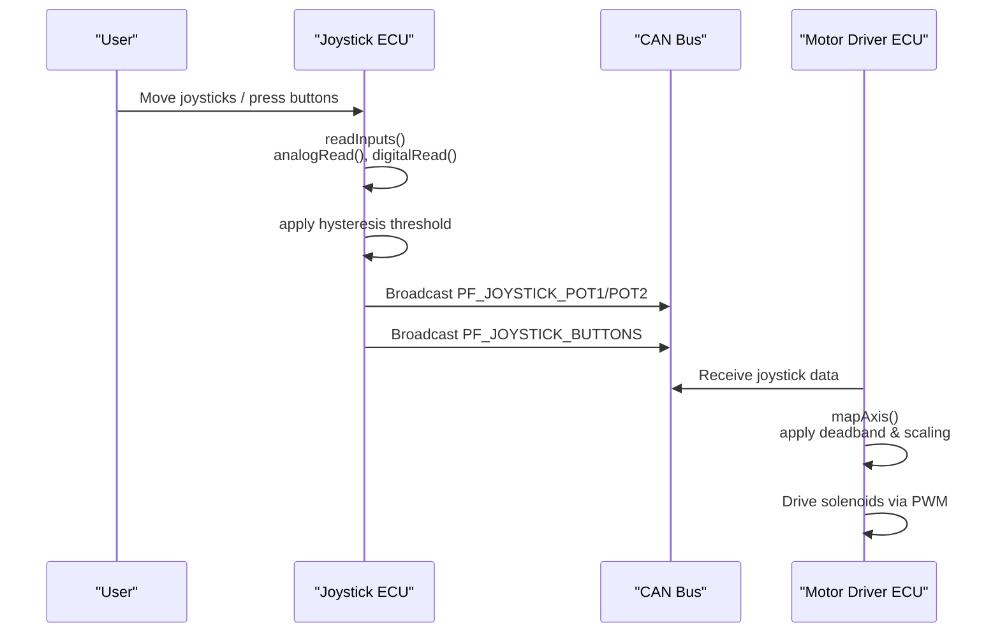
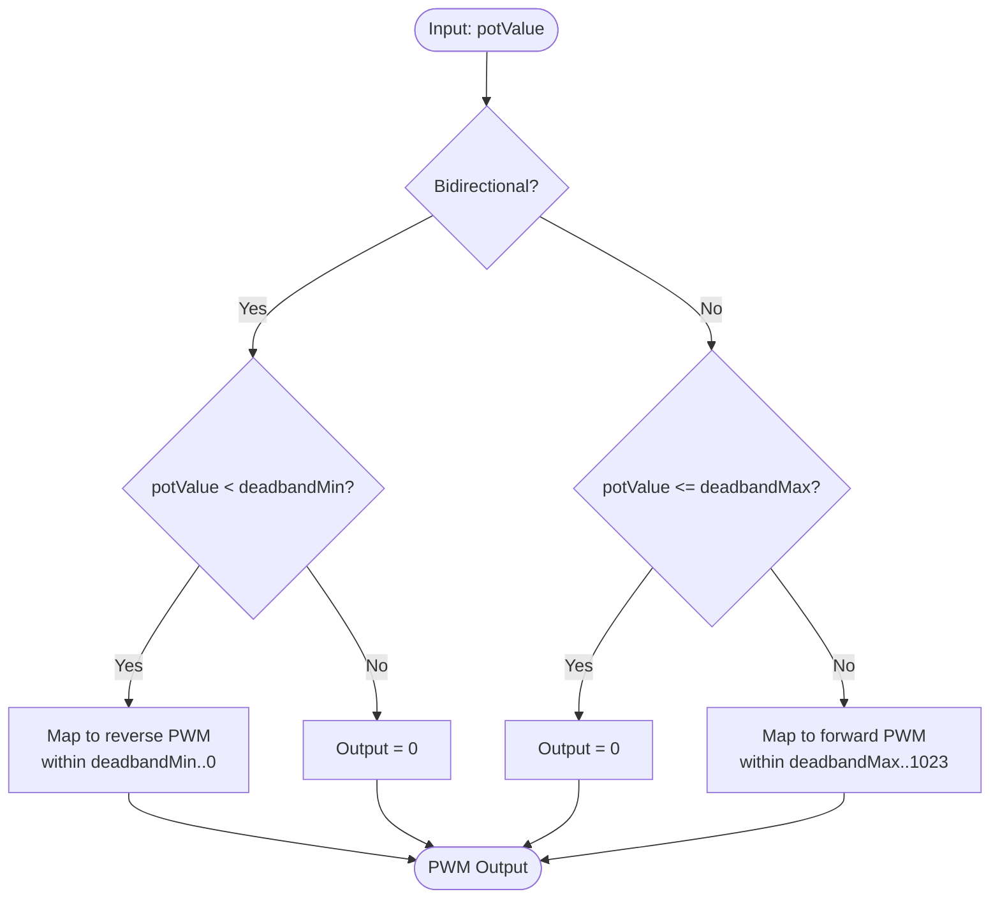
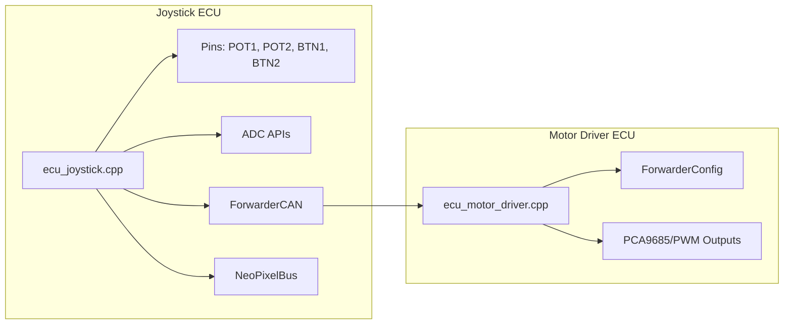

# Analog Input Processing

<cite>
**Referenced Files in This Document**
- [ecu_joystick.cpp](file://src/ecu_joystick.cpp)
- [ecu_joystick.h](file://src/ecu_joystick.h)
- [platformio.ini](file://platformio.ini)
- [ForwarderConfig.cpp](file://lib/ForwarderConfig/ForwarderConfig.cpp)
- [ecu_motor_driver.cpp](file://src/ecu_motor_driver.cpp)
- [ota_webserver.cpp](file://src/ota_webserver.cpp)
- [main.cpp](file://src/main.cpp)
</cite>

## Table of Contents
1. [Introduction](#introduction)
2. [Project Structure](#project-structure)
3. [Core Components](#core-components)
4. [Architecture Overview](#architecture-overview)
5. [Detailed Component Analysis](#detailed-component-analysis)
6. [Dependency Analysis](#dependency-analysis)
7. [Performance Considerations](#performance-considerations)
8. [Troubleshooting Guide](#troubleshooting-guide)
9. [Conclusion](#conclusion)

## Introduction
This document describes the analog input processing subsystem for the Joystick Electronic Control Unit (ECU). It focuses on ADC configuration, sampling behavior, resolution and attenuation settings, and how joystick potentiometer signals are acquired, filtered, and transmitted via CAN. It also documents the deadband configuration and scaling parameters used downstream by the motor driver ECU to convert analog inputs into PWM outputs. Practical guidance is included for calibration, noise reduction, and troubleshooting unstable readings.

## Project Structure
The joystick ECU is implemented as a PlatformIO project with environment-specific pin and address assignments. The analog input logic resides in the joystick ECU module, while the motor driver ECU consumes joystick CAN messages and applies deadband and scaling to produce solenoid drive signals.

**Diagram sources**
- [main.cpp:19-31](file://src/main.cpp#L19-L31)
- [ecu_joystick.cpp:159-192](file://src/ecu_joystick.cpp#L159-L192)
- [platformio.ini:31-61](file://platformio.ini#L31-L61)
- [ecu_motor_driver.cpp:101-135](file://src/ecu_motor_driver.cpp#L101-L135)
- [ForwarderConfig.cpp:84-102](file://lib/ForwarderConfig/ForwarderConfig.cpp#L84-L102)
- [ota_webserver.cpp:340-350](file://src/ota_webserver.cpp#L340-L350)

**Section sources**
- [main.cpp:19-31](file://src/main.cpp#L19-L31)
- [platformio.ini:31-61](file://platformio.ini#L31-L61)

## Core Components
- ADC acquisition and configuration:
  - Resolution and attenuation are set during initialization.
  - Potentiometer pins are sampled using the board’s ADC.
- Input filtering and transmission:
  - Hysteresis threshold is applied to ADC values before sending.
  - Buttons are debounced via pull-up resistors and logical inversion.
  - CAN broadcast messages carry raw 10-bit ADC values and button states.
- Deadband and scaling:
  - Deadband and scaling parameters are stored per-axis and used by the motor driver ECU to map analog inputs to PWM outputs.
- Web-based configuration:
  - Deadband and scaling parameters can be adjusted via a web interface and persisted to non-volatile storage.

**Section sources**
- [ecu_joystick.cpp:63-68](file://src/ecu_joystick.cpp#L63-L68)
- [ecu_joystick.cpp:163-164](file://src/ecu_joystick.cpp#L163-L164)
- [ecu_joystick.cpp:200-209](file://src/ecu_joystick.cpp#L200-L209)
- [ecu_joystick.cpp:210-217](file://src/ecu_joystick.cpp#L210-L217)
- [ecu_motor_driver.cpp:101-135](file://src/ecu_motor_driver.cpp#L101-L135)
- [ForwarderConfig.cpp:84-102](file://lib/ForwarderConfig/ForwarderConfig.cpp#L84-L102)
- [ota_webserver.cpp:340-350](file://src/ota_webserver.cpp#L340-L350)

## Architecture Overview
The joystick ECU reads two potentiometer channels and button states, applies local hysteresis to avoid CAN bus noise, and broadcasts the values. The motor driver ECU receives these values, applies deadband and scaling, and produces PWM outputs for solenoids.

**Diagram sources**
- [ecu_joystick.cpp:63-68](file://src/ecu_joystick.cpp#L63-L68)
- [ecu_joystick.cpp:200-217](file://src/ecu_joystick.cpp#L200-L217)
- [ecu_motor_driver.cpp:101-135](file://src/ecu_motor_driver.cpp#L101-L135)

## Detailed Component Analysis

### ADC Configuration and Sampling
- Resolution and Attenuation:
  - The joystick ECU sets the ADC resolution and input attenuation during initialization. These settings define the effective input voltage range and digitization precision.
- Pin Assignments:
  - Potentiometer pins are defined per environment and read in the input routine.
- Sampling Rate:
  - Sampling occurs inside the main loop cadence. No explicit oversampling or averaging is implemented in the joystick ECU; filtering relies on hysteresis thresholds and CAN-level debouncing.

Practical implications:
- With 10-bit resolution, raw ADC values are in the range 0–1023.
- Attenuation affects the measurable input voltage range; ensure supply voltage and pot divider do not exceed the ADC input limits.

**Section sources**
- [ecu_joystick.cpp:163-164](file://src/ecu_joystick.cpp#L163-L164)
- [platformio.ini:42-45](file://platformio.ini#L42-L45)
- [ecu_joystick.cpp:63-68](file://src/ecu_joystick.cpp#L63-L68)

### Analog-to-Digital Conversion and Reference Voltage
- Conversion characteristics:
  - The ADC converts the analog voltage at the pin to a 10-bit digital value.
  - The reference voltage and input attenuation determine the full-scale input voltage range.
- Calibration procedure:
  - Measure the actual voltage at the ADC pin for known mechanical positions (e.g., center and stops).
  - Record the corresponding raw ADC samples to compute offsets and verify linearity.
  - Adjust deadband and scaling in the motor driver ECU to match desired behavior.

Note: The joystick ECU transmits raw 10-bit values without applying offset or gain correction.

**Section sources**
- [ecu_joystick.cpp:163-164](file://src/ecu_joystick.cpp#L163-L164)
- [ecu_joystick.cpp:63-68](file://src/ecu_joystick.cpp#L63-L68)

### Input Filtering and Noise Reduction
- Local hysteresis:
  - Values are sent only when the absolute difference from the previous sample exceeds a small threshold. This reduces CAN traffic and mitigates short-term noise.
- Button debouncing:
  - Buttons use internal pull-up resistors and are considered active when the pin reads LOW.
- CAN-level filtering:
  - The receiving ECU validates message length and source address before accepting joystick data.

Recommended practices:
- Keep wiring short and away from high-current traces.
- Use shielded cables if necessary.
- Ensure stable power supply to minimize ADC noise.

**Section sources**
- [ecu_joystick.cpp:200-209](file://src/ecu_joystick.cpp#L200-L209)
- [ecu_joystick.cpp:210-217](file://src/ecu_joystick.cpp#L210-L217)
- [ecu_motor_driver.cpp:194-202](file://src/ecu_motor_driver.cpp#L194-L202)

### Deadband Configuration and Sensitivity Adjustment
- Deadband definition:
  - Deadband is defined by minimum and maximum thresholds around the center position. Inputs outside this band contribute to output.
- Scaling parameters:
  - Minimum and maximum PWM thresholds define the output range when the stick moves outside the deadband.
- Defaults and persistence:
  - Default deadband and scaling values are loaded from persistent storage if not configured.
  - Web UI allows adjusting these parameters and saving them.

Coordinate transformation (motor driver):
- Bidirectional mapping:
  - Negative range (left/up): maps below deadband minimum to reverse PWM.
  - Positive range (right/down): maps above deadband maximum to forward PWM.
  - Inside deadband: output is zero.
- Unidirectional mapping:
  - Output remains zero until the stick exceeds the upper deadband threshold, then scales linearly to maximum PWM.

**Diagram sources**
- [ecu_motor_driver.cpp:101-135](file://src/ecu_motor_driver.cpp#L101-L135)

**Section sources**
- [ForwarderConfig.cpp:97-101](file://lib/ForwarderConfig/ForwarderConfig.cpp#L97-L101)
- [ecu_motor_driver.cpp:101-135](file://src/ecu_motor_driver.cpp#L101-L135)
- [ota_webserver.cpp:340-350](file://src/ota_webserver.cpp#L340-L350)

### Raw ADC Value Ranges, Scaling Factors, and Coordinate Transformation
- Raw ADC range:
  - 10-bit ADC yields integer values from 0 to 1023.
- Scaling to PWM:
  - The motor driver maps the processed analog value to a PWM range suitable for the valve actuator drivers.
  - The mapping uses configurable deadband and PWM thresholds per axis.

Note: The joystick ECU does not apply scaling; it forwards raw ADC values.

**Section sources**
- [ecu_joystick.cpp:63-68](file://src/ecu_joystick.cpp#L63-L68)
- [ecu_motor_driver.cpp:101-135](file://src/ecu_motor_driver.cpp#L101-L135)

### Practical Examples

- ADC calibration:
  - Measure ADC pin voltage at center and stop positions.
  - Record raw ADC samples and compare to expected percentages.
  - Adjust deadband thresholds so the center feels truly neutral under typical load.

- Noise reduction filtering:
  - Increase the hysteresis threshold slightly if jitter persists.
  - Verify wiring and power integrity; replace noisy components or shorten leads.

- Input validation:
  - Confirm that button presses register reliably and that CAN messages are received by the motor driver ECU.
  - Use the heartbeat and LED indicators to confirm bus connectivity.

**Section sources**
- [ecu_joystick.cpp:200-209](file://src/ecu_joystick.cpp#L200-L209)
- [ecu_motor_driver.cpp:194-202](file://src/ecu_motor_driver.cpp#L194-L202)

## Dependency Analysis
The joystick ECU depends on:
- Board ADC APIs for sampling.
- CAN library for message transmission.
- LED library for status indication.
- Persistent configuration for deadband and scaling defaults.

The motor driver ECU depends on:
- Received joystick CAN messages.
- Axis configuration for deadband and scaling.
- PWM output drivers for solenoids.

**Diagram sources**
- [ecu_joystick.cpp:159-192](file://src/ecu_joystick.cpp#L159-L192)
- [ecu_motor_driver.cpp:101-135](file://src/ecu_motor_driver.cpp#L101-L135)
- [ForwarderConfig.cpp:84-102](file://lib/ForwarderConfig/ForwarderConfig.cpp#L84-L102)

**Section sources**
- [ecu_joystick.cpp:159-192](file://src/ecu_joystick.cpp#L159-L192)
- [ecu_motor_driver.cpp:101-135](file://src/ecu_motor_driver.cpp#L101-L135)
- [ForwarderConfig.cpp:84-102](file://lib/ForwarderConfig/ForwarderConfig.cpp#L84-L102)

## Performance Considerations
- Sampling cadence:
  - The joystick ECU runs a tight loop; ensure CAN and LED updates do not starve the main loop.
- CAN bandwidth:
  - Hysteresis reduces payload frequency; keep thresholds balanced to avoid missing small movements.
- Power and noise:
  - Stable power minimizes ADC jitter; consider ferrite beads near the ADC pin if noise is suspected.

[No sources needed since this section provides general guidance]

## Troubleshooting Guide
Common issues and resolutions:
- Unstable readings:
  - Check wiring integrity and power stability.
  - Increase hysteresis threshold slightly if needed.
- Buttons not responding:
  - Verify pull-up configuration and that pins read LOW when pressed.
- No CAN reception:
  - Confirm address assignment and bus connectivity; check heartbeat messages.
- Deadband feels too sensitive or unresponsive:
  - Adjust deadbandMin/deadbandMax and PWM thresholds via the web UI; save and restart if necessary.

**Section sources**
- [ecu_joystick.cpp:200-209](file://src/ecu_joystick.cpp#L200-L209)
- [ecu_joystick.cpp:210-217](file://src/ecu_joystick.cpp#L210-L217)
- [ecu_motor_driver.cpp:194-202](file://src/ecu_motor_driver.cpp#L194-L202)
- [ota_webserver.cpp:565-584](file://src/ota_webserver.cpp#L565-L584)

## Conclusion
The joystick ECU performs straightforward ADC sampling with 10-bit resolution and input attenuation, applies local hysteresis to reduce noise, and broadcasts raw values over CAN. The motor driver ECU consumes these values and applies deadband and scaling to drive actuators. Proper calibration, wiring hygiene, and configuration tuning yield reliable joystick operation.