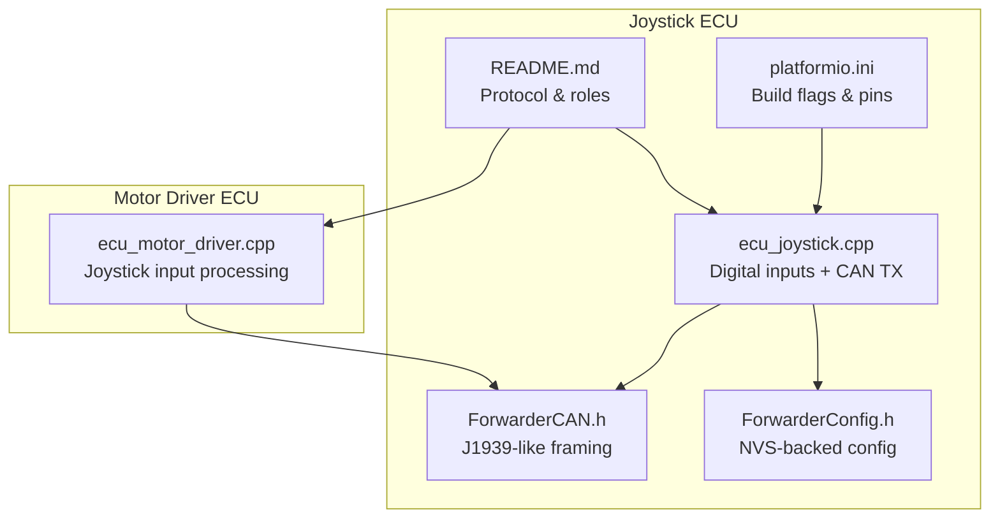
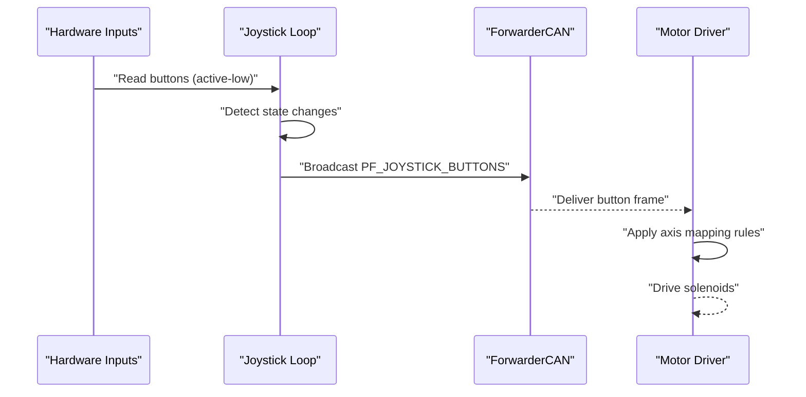
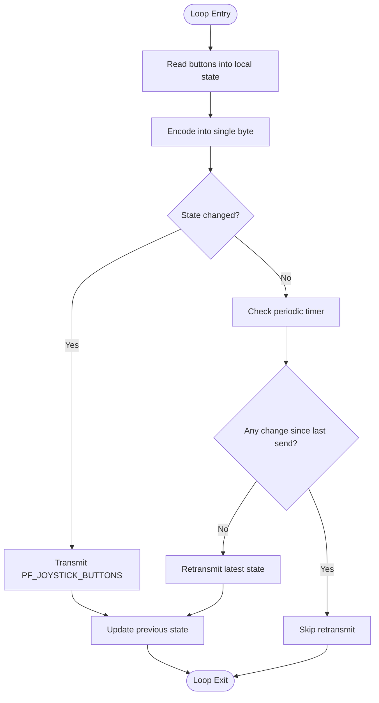
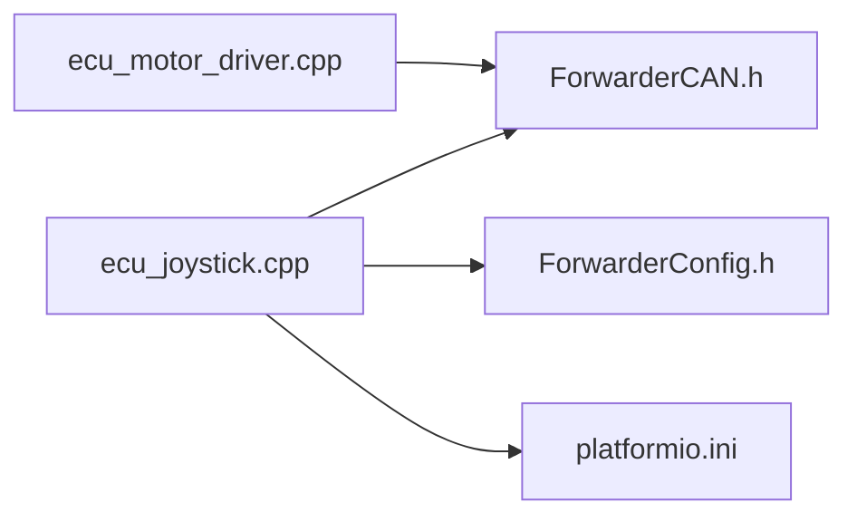

# Button State Management

<cite>
**Referenced Files in This Document**
- [README.md](file://README.md)
- [platformio.ini](file://platformio.ini)
- [ecu_joystick.cpp](file://src/ecu_joystick.cpp)
- [ecu_joystick.h](file://src/ecu_joystick.h)
- [ForwarderCAN.h](file://lib/ForwarderCAN/ForwarderCAN.h)
- [ForwarderConfig.h](file://lib/ForwarderConfig/ForwarderConfig.h)
- [ecu_motor_driver.cpp](file://src/ecu_motor_driver.cpp)
- [web_state.cpp](file://src/web_state.cpp)
- [ota_webserver.cpp](file://src/ota_webserver.cpp)
</cite>

## Table of Contents
1. [Introduction](#introduction)
2. [Project Structure](#project-structure)
3. [Core Components](#core-components)
4. [Architecture Overview](#architecture-overview)
5. [Detailed Component Analysis](#detailed-component-analysis)
6. [Dependency Analysis](#dependency-analysis)
7. [Performance Considerations](#performance-considerations)
8. [Troubleshooting Guide](#troubleshooting-guide)
9. [Conclusion](#conclusion)

## Introduction
This document explains the button state management system for the Joystick ECU within the Forwarder CAN project. It covers digital input handling, pull-up/pull-down configurations, interrupt-free polling for button detection, debouncing strategies, state change detection (rising/falling edges), and how button events propagate over the CAN bus. It also documents button mapping configuration, multi-button coordination, timing characteristics, and practical guidance for tuning and troubleshooting.

## Project Structure
The Joystick ECU is implemented as a standalone module that reads three potentiometer channels and two buttons, then broadcasts their state over a J1939-like CAN bus. The system is designed around a simple, deterministic loop with minimal external dependencies.

**Diagram sources**
- [ecu_joystick.cpp:159-192](file://src/ecu_joystick.cpp#L159-L192)
- [ForwarderCAN.h:38-51](file://lib/ForwarderCAN/ForwarderCAN.h#L38-L51)
- [ForwarderConfig.h:64-91](file://lib/ForwarderConfig/ForwarderConfig.h#L64-L91)
- [platformio.ini:31-61](file://platformio.ini#L31-L61)
- [README.md:10-14](file://README.md#L10-L14)

**Section sources**
- [README.md:10-14](file://README.md#L10-L14)
- [platformio.ini:31-61](file://platformio.ini#L31-L61)

## Core Components
- Digital input pins for buttons configured with internal pull-ups and read as active-low.
- Polling-based input sampling in the main loop with delta-change detection for buttons.
- CAN broadcasting of button states using a dedicated PF (PDU Format) value.
- Persistent configuration storage for address overrides and other settings.
- LED status indication synchronized with bus activity and identify requests.

Key implementation references:
- Button pin configuration and polling: [ecu_joystick.cpp:165-166](file://src/ecu_joystick.cpp#L165-L166), [ecu_joystick.cpp:63-68](file://src/ecu_joystick.cpp#L63-L68)
- Button state encoding and transmission: [ecu_joystick.cpp:106-112](file://src/ecu_joystick.cpp#L106-L112)
- CAN frame definitions: [ForwarderCAN.h:38-51](file://lib/ForwarderCAN/ForwarderCAN.h#L38-L51)
- Configuration manager: [ForwarderConfig.h:64-91](file://lib/ForwarderConfig/ForwarderConfig.h#L64-L91)

**Section sources**
- [ecu_joystick.cpp:63-68](file://src/ecu_joystick.cpp#L63-L68)
- [ecu_joystick.cpp:106-112](file://src/ecu_joystick.cpp#L106-L112)
- [ForwarderCAN.h:38-51](file://lib/ForwarderCAN/ForwarderCAN.h#L38-L51)
- [ForwarderConfig.h:64-91](file://lib/ForwarderConfig/ForwarderConfig.h#L64-L91)

## Architecture Overview
The Joystick ECU reads analog and digital inputs, detects state changes, and broadcasts them over CAN. On the receiving side, the Motor Driver ECU consumes joystick data to drive solenoids according to configured mappings.

**Diagram sources**
- [ecu_joystick.cpp:194-236](file://src/ecu_joystick.cpp#L194-L236)
- [ForwarderCAN.h:38-51](file://lib/ForwarderCAN/ForwarderCAN.h#L38-L51)
- [ecu_motor_driver.cpp:184-202](file://src/ecu_motor_driver.cpp#L184-L202)

**Section sources**
- [ecu_joystick.cpp:194-236](file://src/ecu_joystick.cpp#L194-L236)
- [ecu_motor_driver.cpp:184-202](file://src/ecu_motor_driver.cpp#L184-L202)

## Detailed Component Analysis

### Digital Input Handling and Pull-up Configuration
- Button pins are configured with internal pull-ups and read as active-low. This means pressing a button pulls the pin to ground, resulting in a LOW reading.
- Pin assignments are defined via build flags and can be customized per environment.

Implementation highlights:
- Pin mode setup: [ecu_joystick.cpp:165-166](file://src/ecu_joystick.cpp#L165-L166)
- Pin definitions and defaults: [platformio.ini:43-45](file://platformio.ini#L43-L45), [platformio.ini:60-61](file://platformio.ini#L60-L61)
- Hardware pinout reference: [README.md:57-61](file://README.md#L57-L61)

Debouncing strategy:
- No external hardware debouncing capacitors are used. Debouncing relies on software filtering through delta thresholds and periodic retransmission.
- Button state is encoded into a single byte and transmitted only on change, reducing noise sensitivity on the bus.

**Section sources**
- [ecu_joystick.cpp:165-166](file://src/ecu_joystick.cpp#L165-L166)
- [platformio.ini:43-45](file://platformio.ini#L43-L45)
- [platformio.ini:60-61](file://platformio.ini#L60-L61)
- [README.md:57-61](file://README.md#L57-L61)

### Debouncing Algorithm
The system employs a simple but effective debouncing approach:
- State comparison against previous values: buttons are combined into a single byte and compared to the prior state.
- Transmission occurs only when the state differs, minimizing spurious updates.
- A periodic fallback transmission ensures liveness even when no change is detected.

**Diagram sources**
- [ecu_joystick.cpp:194-236](file://src/ecu_joystick.cpp#L194-L236)

**Section sources**
- [ecu_joystick.cpp:194-236](file://src/ecu_joystick.cpp#L194-L236)

### State Change Detection and Edge Handling
- Rising/falling edge detection is implicit through state comparison: a transition from previous to current state triggers a send.
- Long press detection is not implemented in the Joystick ECU; any sustained press is represented as repeated transmissions of the same pressed state until released.

Behavior references:
- State comparison and send: [ecu_joystick.cpp:213-217](file://src/ecu_joystick.cpp#L213-L217)
- Periodic fallback send: [ecu_joystick.cpp:218-225](file://src/ecu_joystick.cpp#L218-L225)

**Section sources**
- [ecu_joystick.cpp:213-217](file://src/ecu_joystick.cpp#L213-L217)
- [ecu_joystick.cpp:218-225](file://src/ecu_joystick.cpp#L218-L225)

### Button Mapping Configuration and Multi-button Coordination
- The Joystick ECU does not implement per-button mapping or custom assignments internally. Instead, button presses are broadcast as a bitmask on PF_JOYSTICK_BUTTONS.
- Mapping of joystick inputs to solenoids is performed by the Motor Driver ECU using its own configuration model.

References:
- Button broadcast payload: [ecu_joystick.cpp:106-112](file://src/ecu_joystick.cpp#L106-L112)
- Motor driver consuming joystick data: [ecu_motor_driver.cpp:191-202](file://src/ecu_motor_driver.cpp#L191-L202)
- Configuration model for axis mapping: [ForwarderConfig.h:41-57](file://lib/ForwarderConfig/ForwarderConfig.h#L41-L57)

**Section sources**
- [ecu_joystick.cpp:106-112](file://src/ecu_joystick.cpp#L106-L112)
- [ecu_motor_driver.cpp:191-202](file://src/ecu_motor_driver.cpp#L191-L202)
- [ForwarderConfig.h:41-57](file://lib/ForwarderConfig/ForwarderConfig.h#L41-L57)

### Button Press Timing Characteristics and Repeat Functionality
- The Joystick ECU sends button state immediately upon detection of a change.
- A periodic fallback transmission occurs every 100 ms if no change was observed during that interval, ensuring downstream systems remain synchronized.
- There is no software-level repeat timer for sustained button presses; repeated presses are reflected by repeated frames.

Timing references:
- Change-triggered send: [ecu_joystick.cpp:213-217](file://src/ecu_joystick.cpp#L213-L217)
- Periodic fallback: [ecu_joystick.cpp:218-225](file://src/ecu_joystick.cpp#L218-L225)

**Section sources**
- [ecu_joystick.cpp:213-217](file://src/ecu_joystick.cpp#L213-L217)
- [ecu_joystick.cpp:218-225](file://src/ecu_joystick.cpp#L218-L225)

### Button Combination Detection
- The Joystick ECU encodes up to two buttons into a single byte, enabling detection of combinations (e.g., Btn1 + Btn2) by checking bits 0 and 1 respectively.
- Downstream consumers interpret the bitmask to recognize combinations.

Bitmask references:
- Encoding: [ecu_joystick.cpp:210-212](file://src/ecu_joystick.cpp#L210-L212)
- Decoding example in Motor Driver: [ecu_motor_driver.cpp:191-202](file://src/ecu_motor_driver.cpp#L191-L202)

**Section sources**
- [ecu_joystick.cpp:210-212](file://src/ecu_joystick.cpp#L210-L212)
- [ecu_motor_driver.cpp:191-202](file://src/ecu_motor_driver.cpp#L191-L202)

### Practical Examples

- Example: Configure button pins for a custom joystick board
  - Modify build flags for BTN1_PIN and BTN2_PIN in the appropriate environment: [platformio.ini:43-45](file://platformio.ini#L43-L45), [platformio.ini:60-61](file://platformio.ini#L60-L61)
  - Ensure the hardware uses a pull-up configuration and connects buttons between the pin and ground.

- Example: Tune debouncing sensitivity
  - Adjust the threshold delta used to detect meaningful button changes. Since the current implementation compares the current state byte to the previous state byte, focus on ensuring clean wiring and stable power to minimize false positives.

- Example: Verify button behavior via web UI
  - Use the web dashboard to observe button states reported by the Joystick ECU: [ota_webserver.cpp:286-295](file://src/ota_webserver.cpp#L286-L295)

- Example: Map joystick inputs to solenoids (Motor Driver)
  - Configure axis mapping to route joystick inputs to specific solenoid channels: [ForwarderConfig.h:41-57](file://lib/ForwarderConfig/ForwarderConfig.h#L41-L57)

**Section sources**
- [platformio.ini:43-45](file://platformio.ini#L43-L45)
- [platformio.ini:60-61](file://platformio.ini#L60-L61)
- [ota_webserver.cpp:286-295](file://src/ota_webserver.cpp#L286-L295)
- [ForwarderConfig.h:41-57](file://lib/ForwarderConfig/ForwarderConfig.h#L41-L57)

## Dependency Analysis
The Joystick ECU depends on:
- ForwarderCAN for J1939-like framing and transport.
- ForwarderConfig for persistent settings (address overrides).
- PlatformIO build flags for pin assignments and compile-time selection of ECU type.

**Diagram sources**
- [ecu_joystick.cpp:159-192](file://src/ecu_joystick.cpp#L159-L192)
- [ForwarderCAN.h:38-51](file://lib/ForwarderCAN/ForwarderCAN.h#L38-L51)
- [ForwarderConfig.h:64-91](file://lib/ForwarderConfig/ForwarderConfig.h#L64-L91)
- [platformio.ini:31-61](file://platformio.ini#L31-L61)

**Section sources**
- [ecu_joystick.cpp:159-192](file://src/ecu_joystick.cpp#L159-L192)
- [ForwarderCAN.h:38-51](file://lib/ForwarderCAN/ForwarderCAN.h#L38-L51)
- [ForwarderConfig.h:64-91](file://lib/ForwarderConfig/ForwarderConfig.h#L64-L91)
- [platformio.ini:31-61](file://platformio.ini#L31-L61)

## Performance Considerations
- Polling frequency: The loop runs continuously, reading inputs and sending updates at ~10 Hz intervals when idle, and immediately on state changes.
- CAN bandwidth: Button frames are small (1 byte payload), minimizing bus overhead.
- Memory footprint: Minimal static memory usage for state buffers and counters.
- Power and noise: Internal pull-ups reduce external component count; ensure stable power and short wiring runs to minimize noise.

[No sources needed since this section provides general guidance]

## Troubleshooting Guide
Common issues and resolutions:
- Buttons appear stuck or noisy
  - Verify hardware pull-up configuration and wiring integrity.
  - Confirm button pins are defined correctly in the build environment: [platformio.ini:43-45](file://platformio.ini#L43-L45), [platformio.ini:60-61](file://platformio.ini#L60-L61)
  - Observe button states via the web UI to confirm upstream behavior: [ota_webserver.cpp:286-295](file://src/ota_webserver.cpp#L286-L295)

- No button events received downstream
  - Check CAN connectivity and address claiming: [ecu_joystick.cpp:174-186](file://src/ecu_joystick.cpp#L174-L186)
  - Ensure the Motor Driver ECU is interpreting the PF_JOYSTICK_BUTTONS frame: [ecu_motor_driver.cpp:191-202](file://src/ecu_motor_driver.cpp#L191-L202)

- LED status anomalies
  - Identify mode toggles LED pattern; verify bus online/offline state affects LED behavior: [ecu_joystick.cpp:88-94](file://src/ecu_joystick.cpp#L88-L94)

**Section sources**
- [platformio.ini:43-45](file://platformio.ini#L43-L45)
- [platformio.ini:60-61](file://platformio.ini#L60-L61)
- [ota_webserver.cpp:286-295](file://src/ota_webserver.cpp#L286-L295)
- [ecu_joystick.cpp:174-186](file://src/ecu_joystick.cpp#L174-L186)
- [ecu_motor_driver.cpp:191-202](file://src/ecu_motor_driver.cpp#L191-L202)
- [ecu_joystick.cpp:88-94](file://src/ecu_joystick.cpp#L88-L94)

## Conclusion
The Joystick ECU implements a straightforward, reliable button state management system using internal pull-ups, immediate state change detection, and periodic fallback transmissions. Debouncing is handled through state comparison and minimal thresholds, avoiding the need for external components. Button combinations are supported via a simple bitmask, and downstream mapping is delegated to the Motor Driver ECU. With proper pin configuration, wiring, and CAN connectivity, the system delivers responsive and predictable button behavior suitable for hydraulic control applications.