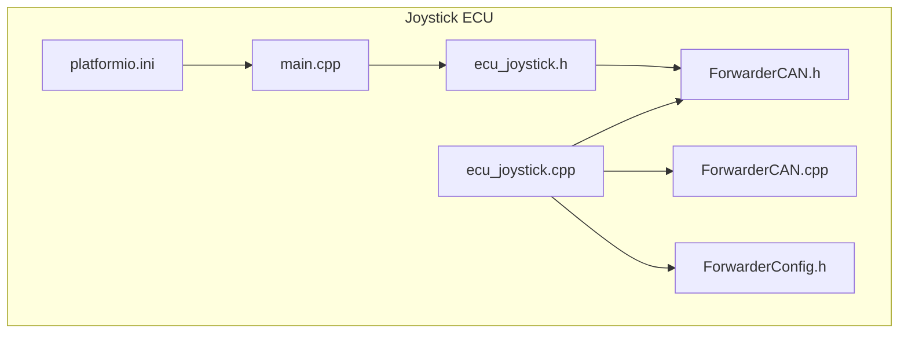
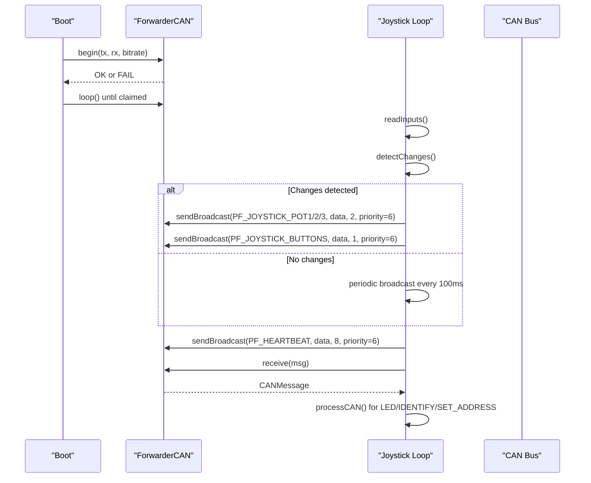
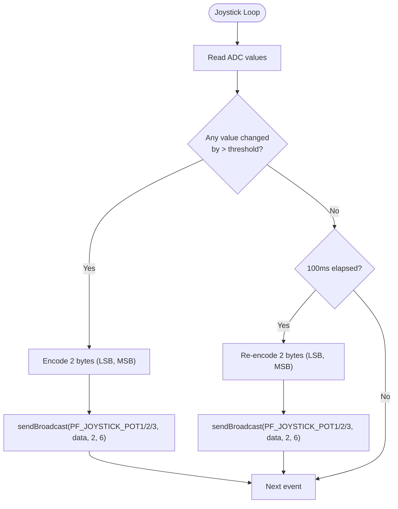
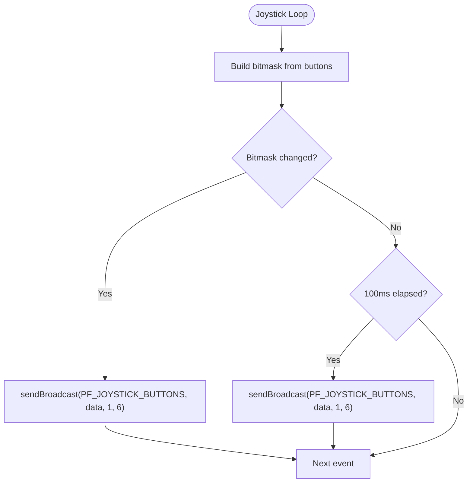
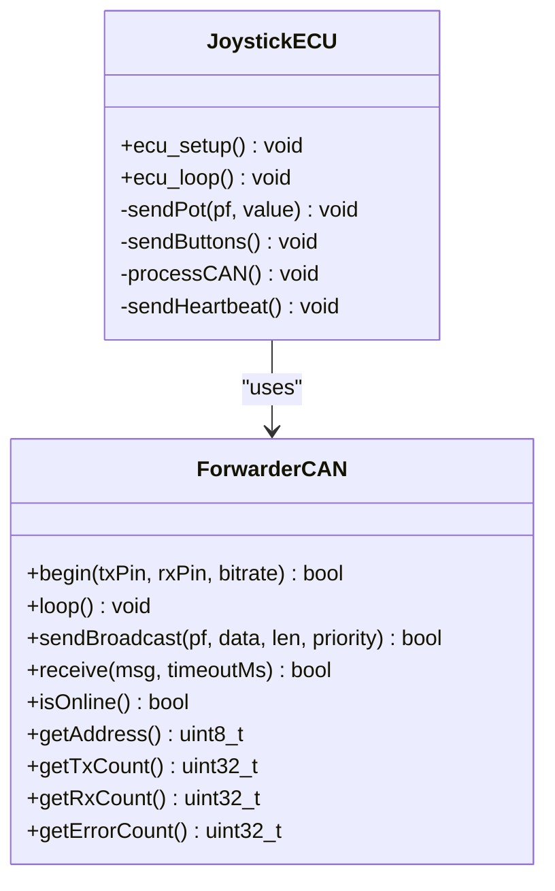
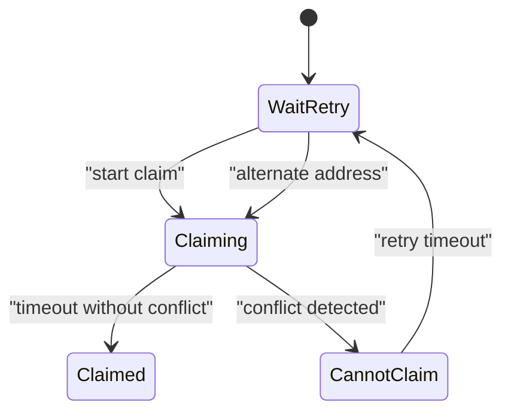
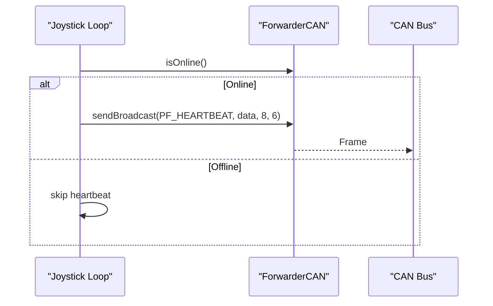
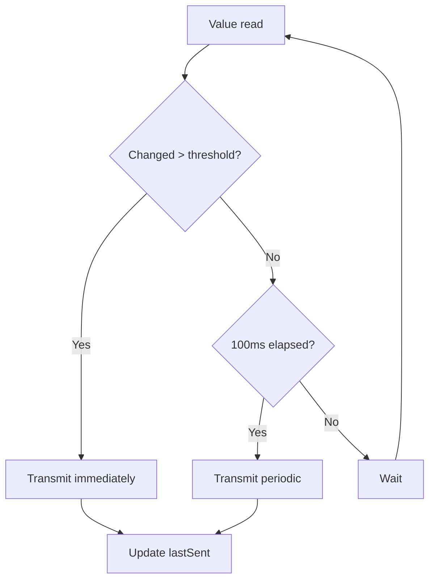
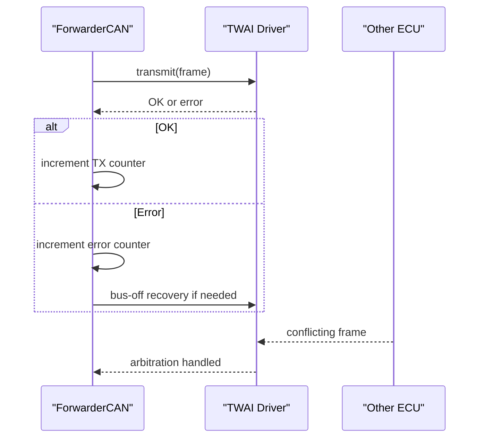
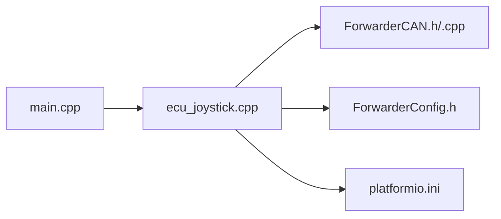

# CAN Message Broadcasting

<cite>
**Referenced Files in This Document**
- [ecu_joystick.cpp](file://src/ecu_joystick.cpp)
- [ecu_joystick.h](file://src/ecu_joystick.h)
- [ForwarderCAN.h](file://lib/ForwarderCAN/ForwarderCAN.h)
- [ForwarderCAN.cpp](file://lib/ForwarderCAN/ForwarderCAN.cpp)
- [ForwarderConfig.h](file://lib/ForwarderConfig/ForwarderConfig.h)
- [can_output.cpp](file://src/can_output.cpp)
- [can_output.h](file://src/can_output.h)
- [main.cpp](file://src/main.cpp)
- [platformio.ini](file://platformio.ini)
- [README.md](file://README.md)
</cite>

## Table of Contents
1. [Introduction](#introduction)
2. [Project Structure](#project-structure)
3. [Core Components](#core-components)
4. [Architecture Overview](#architecture-overview)
5. [Detailed Component Analysis](#detailed-component-analysis)
6. [Dependency Analysis](#dependency-analysis)
7. [Performance Considerations](#performance-considerations)
8. [Troubleshooting Guide](#troubleshooting-guide)
9. [Conclusion](#conclusion)
10. [Appendices](#appendices)

## Introduction
This document explains the CAN message broadcasting functionality of the Joystick ECU. It covers the PF_JOYSTICK_POT1/2/3 and PF_JOYSTICK_BUTTONS message types, payload structure, data encoding, and transmission intervals. It also documents the CAN message formatting process, priority scheduling, arbitration avoidance, heartbeat mechanism, timeout handling, message rate configuration, burst prevention, bandwidth optimization, and the CAN bus arbitration and collision handling. Practical examples for monitoring, debugging, and optimizing network performance are included.

## Project Structure
The Joystick ECU is implemented as part of a multi-ECU CAN network. The joystick controller reads three potentiometer inputs and two buttons, encodes them into J1939-like frames, and broadcasts them to the bus. The system uses a shared CAN library for ID layout, address claiming, and frame transmission/reception.

**Diagram sources**
- [ecu_joystick.cpp:1-258](file://src/ecu_joystick.cpp#L1-L258)
- [ecu_joystick.h:1-5](file://src/ecu_joystick.h#L1-L5)
- [ForwarderCAN.h:1-120](file://lib/ForwarderCAN/ForwarderCAN.h#L1-L120)
- [ForwarderCAN.cpp:1-198](file://lib/ForwarderCAN/ForwarderCAN.cpp#L1-L198)
- [ForwarderConfig.h:1-92](file://lib/ForwarderConfig/ForwarderConfig.h#L1-L92)
- [main.cpp:1-32](file://src/main.cpp#L1-L32)
- [platformio.ini:1-82](file://platformio.ini#L1-L82)

**Section sources**
- [main.cpp:1-32](file://src/main.cpp#L1-L32)
- [platformio.ini:1-82](file://platformio.ini#L1-L82)
- [README.md:1-131](file://README.md#L1-L131)

## Core Components
- Joystick ECU: Reads analog inputs and buttons, encodes and broadcasts PF_JOYSTICK_POT1/2/3 and PF_JOYSTICK_BUTTONS messages.
- ForwarderCAN: Provides J1939-like ID layout, address claiming, and send/receive APIs.
- ForwarderConfig: Manages persistent configuration including forced address and CAN output rules.
- CAN Output Module: Optional module that drives GPIO pins based on matched CAN frames.

Key responsibilities:
- PF_JOYSTICK_POT1/2/3: 10-bit ADC values encoded as two bytes (LSB then MSB).
- PF_JOYSTICK_BUTTONS: One byte bitmask for up to eight buttons.
- Broadcast destination: DA_BROADCAST (0xFF) for all recipients.
- Priority: Default priority 6 for joystick messages.
- Heartbeat: PF_HEARTBEAT broadcast every ~1 second when online.

**Section sources**
- [ecu_joystick.cpp:103-116](file://src/ecu_joystick.cpp#L103-L116)
- [ecu_joystick.cpp:150-161](file://src/ecu_joystick.cpp#L150-L161)
- [ForwarderCAN.h:38-57](file://lib/ForwarderCAN/ForwarderCAN.h#L38-L57)
- [ForwarderCAN.h:86-87](file://lib/ForwarderCAN/ForwarderCAN.h#L86-L87)
- [ForwarderCAN.cpp:169-171](file://lib/ForwarderCAN/ForwarderCAN.cpp#L169-L171)
- [platformio.ini:12-15](file://platformio.ini#L12-L15)

## Architecture Overview
The Joystick ECU initializes CAN, claims an address, and enters a loop that:
- Reads inputs and detects changes.
- Sends PF_JOYSTICK_POT1/2/3 and PF_JOYSTICK_BUTTONS only when values change or at a periodic interval.
- Periodically sends PF_HEARTBEAT.
- Processes inbound frames for LED control, identification, and address setting.

**Diagram sources**
- [ecu_joystick.cpp:163-201](file://src/ecu_joystick.cpp#L163-L201)
- [ecu_joystick.cpp:203-255](file://src/ecu_joystick.cpp#L203-L255)
- [ForwarderCAN.cpp:79-119](file://lib/ForwarderCAN/ForwarderCAN.cpp#L79-L119)
- [ForwarderCAN.cpp:173-188](file://lib/ForwarderCAN/ForwarderCAN.cpp#L173-L188)

## Detailed Component Analysis

### PF_JOYSTICK_POT1/2/3 Message Types
- Purpose: Publish 10-bit potentiometer readings to the bus.
- PF values: 0x10 (Pot1), 0x11 (Pot2), 0x12 (Pot3).
- Destination: DA_BROADCAST (0xFF).
- Priority: 6.
- Payload: Two bytes, LSB then MSB of the 10-bit ADC value.
- Encoding: Little-endian byte order.
- Transmission conditions:
  - On change: when the absolute difference from previous value exceeds a threshold (hysteresis).
  - Periodic: at least every 100 ms if no change occurred.

**Diagram sources**
- [ecu_joystick.cpp:209-240](file://src/ecu_joystick.cpp#L209-L240)
- [ecu_joystick.cpp:103-108](file://src/ecu_joystick.cpp#L103-L108)

**Section sources**
- [ecu_joystick.cpp:103-108](file://src/ecu_joystick.cpp#L103-L108)
- [ecu_joystick.cpp:209-240](file://src/ecu_joystick.cpp#L209-L240)
- [ForwarderCAN.h:38-42](file://lib/ForwarderCAN/ForwarderCAN.h#L38-L42)
- [ForwarderCAN.h:52-53](file://lib/ForwarderCAN/ForwarderCAN.h#L52-L53)
- [ForwarderCAN.h:86-87](file://lib/ForwarderCAN/ForwarderCAN.h#L86-L87)
- [ForwarderCAN.cpp:169-171](file://lib/ForwarderCAN/ForwarderCAN.cpp#L169-L171)

### PF_JOYSTICK_BUTTONS Message Type
- Purpose: Publish button states.
- PF value: 0x13.
- Destination: DA_BROADCAST (0xFF).
- Priority: 6.
- Payload: One byte bitmask (e.g., bit 0 for Button1, bit 1 for Button2).
- Transmission conditions:
  - On change: when the bitmask differs from the previous value.
  - Periodic: at least every 100 ms if no change occurred.

**Diagram sources**
- [ecu_joystick.cpp:224-231](file://src/ecu_joystick.cpp#L224-L231)
- [ecu_joystick.cpp:227-239](file://src/ecu_joystick.cpp#L227-L239)
- [ecu_joystick.cpp:110-116](file://src/ecu_joystick.cpp#L110-L116)

**Section sources**
- [ecu_joystick.cpp:110-116](file://src/ecu_joystick.cpp#L110-L116)
- [ecu_joystick.cpp:224-239](file://src/ecu_joystick.cpp#L224-L239)

### CAN Message Formatting and Priority Scheduling
- ID layout: Priority(3) | DP(1) | PF(8) | PS/DA(8) | SA(8).
- PF values for joystick messages are less than 240, so PS equals DA.
- Broadcast frames use DA_BROADCAST (0xFF).
- Priority: Default priority 6 is used for joystick messages.
- Address claiming: The library performs J1939-style address claiming and arbitration at startup.

**Diagram sources**
- [ForwarderCAN.h:66-120](file://lib/ForwarderCAN/ForwarderCAN.h#L66-L120)
- [ecu_joystick.cpp:163-201](file://src/ecu_joystick.cpp#L163-L201)
- [ecu_joystick.cpp:203-255](file://src/ecu_joystick.cpp#L203-L255)

**Section sources**
- [ForwarderCAN.h:9-34](file://lib/ForwarderCAN/ForwarderCAN.h#L9-L34)
- [ForwarderCAN.h:38-57](file://lib/ForwarderCAN/ForwarderCAN.h#L38-L57)
- [ForwarderCAN.cpp:144-171](file://lib/ForwarderCAN/ForwarderCAN.cpp#L144-L171)
- [platformio.ini:12-15](file://platformio.ini#L12-L15)

### Arbitration Avoidance and Address Claiming
- Address claiming uses J1939-style arbitration: a broadcast “Address Claimed” frame carries a NAME field.
- If a conflict occurs, the lower NAME wins; otherwise, the claimant re-confirms dominance.
- The state machine transitions through claiming, claimed, cannot-claim, and retry states with timeouts.

**Diagram sources**
- [ForwarderCAN.cpp:54-109](file://lib/ForwarderCAN/ForwarderCAN.cpp#L54-L109)
- [ForwarderCAN.cpp:121-142](file://lib/ForwarderCAN/ForwarderCAN.cpp#L121-L142)

**Section sources**
- [ForwarderCAN.cpp:54-109](file://lib/ForwarderCAN/ForwarderCAN.cpp#L54-L109)
- [ForwarderCAN.cpp:121-142](file://lib/ForwarderCAN/ForwarderCAN.cpp#L121-L142)

### Heartbeat Mechanism and Connection Loss Detection
- PF_HEARTBEAT broadcast every ~1 second when the ECU is online.
- Payload includes online flag, uptime seconds, joystick ID, and RX/TX counters.
- Connection status is determined by the address claiming state; heartbeat is sent only when claimed.

**Diagram sources**
- [ecu_joystick.cpp:241-246](file://src/ecu_joystick.cpp#L241-L246)
- [ecu_joystick.cpp:150-161](file://src/ecu_joystick.cpp#L150-L161)
- [ForwarderCAN.h:81-83](file://lib/ForwarderCAN/ForwarderCAN.h#L81-L83)

**Section sources**
- [ecu_joystick.cpp:150-161](file://src/ecu_joystick.cpp#L150-L161)
- [ecu_joystick.cpp:241-246](file://src/ecu_joystick.cpp#L241-L246)
- [ForwarderCAN.h:81-83](file://lib/ForwarderCAN/ForwarderCAN.h#L81-L83)

### Message Rate Configuration, Burst Prevention, and Bandwidth Optimization
- Change-detection hysteresis: values are transmitted only when the absolute difference from the last sent value exceeds a small threshold.
- Periodic fallback: at least every 100 ms, ensuring eventual delivery even if unchanged.
- Burst prevention: by combining periodic and change-triggered transmissions, bursts are avoided.
- Priority 6: ensures reasonable coexistence with higher-priority network management frames.
- CAN bitrate: configured via build flags (default 250 kbps).

**Diagram sources**
- [ecu_joystick.cpp:209-240](file://src/ecu_joystick.cpp#L209-L240)

**Section sources**
- [ecu_joystick.cpp:209-240](file://src/ecu_joystick.cpp#L209-L240)
- [platformio.ini:12-15](file://platformio.ini#L12-L15)

### CAN Bus Arbitration, Collision Detection, and Retransmission
- Arbitration: 29-bit extended IDs provide deterministic arbitration; lower numeric NAME loses in conflicts.
- Collision detection: The TWAI driver handles physical collisions; the library retries and recovers from bus-off.
- Retransmission: The library does not implement explicit application-level retransmit; it relies on the driver’s behavior and periodic broadcasts.

**Diagram sources**
- [ForwarderCAN.cpp:144-167](file://lib/ForwarderCAN/ForwarderCAN.cpp#L144-L167)
- [ForwarderCAN.cpp:173-188](file://lib/ForwarderCAN/ForwarderCAN.cpp#L173-L188)
- [ForwarderCAN.cpp:82-89](file://lib/ForwarderCAN/ForwarderCAN.cpp#L82-L89)

**Section sources**
- [ForwarderCAN.cpp:144-167](file://lib/ForwarderCAN/ForwarderCAN.cpp#L144-L167)
- [ForwarderCAN.cpp:173-188](file://lib/ForwarderCAN/ForwarderCAN.cpp#L173-L188)
- [ForwarderCAN.cpp:82-89](file://lib/ForwarderCAN/ForwarderCAN.cpp#L82-L89)

### Practical Examples: Monitoring, Debugging, and Optimization
- Monitoring:
  - Observe periodic telemetry logs that include TX/RX/ERR counts and current pot/button values.
  - Watch PF_HEARTBEAT frames to confirm connectivity.
- Debugging:
  - Use PF_LED_COLOR to visually confirm LED updates.
  - Use PF_IDENTIFY to trigger blinking for device identification.
  - Use PF_SET_ADDRESS to force a new address and verify restart behavior.
- Network performance optimization:
  - Adjust hysteresis thresholds to reduce unnecessary transmissions.
  - Tune the 100 ms periodic interval to balance responsiveness and bandwidth.
  - Ensure only one ECU attempts address claiming at a time during resets.

**Section sources**
- [ecu_joystick.cpp:246-250](file://src/ecu_joystick.cpp#L246-L250)
- [ecu_joystick.cpp:118-148](file://src/ecu_joystick.cpp#L118-L148)
- [ecu_joystick.cpp:136-145](file://src/ecu_joystick.cpp#L136-L145)
- [README.md:22-46](file://README.md#L22-L46)

## Dependency Analysis
The Joystick ECU depends on the ForwarderCAN library for ID layout, address claiming, and frame transmission. It also integrates with ForwarderConfig for persistent settings and optionally with the OTA web server.

**Diagram sources**
- [ecu_joystick.cpp:1-10](file://src/ecu_joystick.cpp#L1-L10)
- [ForwarderCAN.h:1-120](file://lib/ForwarderCAN/ForwarderCAN.h#L1-L120)
- [ForwarderCAN.cpp:1-198](file://lib/ForwarderCAN/ForwarderCAN.cpp#L1-L198)
- [ForwarderConfig.h:1-92](file://lib/ForwarderConfig/ForwarderConfig.h#L1-L92)
- [main.cpp:1-32](file://src/main.cpp#L1-L32)
- [platformio.ini:1-82](file://platformio.ini#L1-L82)

**Section sources**
- [ecu_joystick.cpp:1-10](file://src/ecu_joystick.cpp#L1-L10)
- [ForwarderCAN.h:1-120](file://lib/ForwarderCAN/ForwarderCAN.h#L1-L120)
- [ForwarderConfig.h:1-92](file://lib/ForwarderConfig/ForwarderConfig.h#L1-L92)
- [main.cpp:1-32](file://src/main.cpp#L1-L32)
- [platformio.ini:1-82](file://platformio.ini#L1-L82)

## Performance Considerations
- Bandwidth: Each joystick message is small (1–2 bytes payload), minimizing bus load.
- Hysteresis: Prevents noisy or oscillating signals from causing frequent transmissions.
- Periodic fallback: Ensures stale values are refreshed even under minimal activity.
- Priority: Default priority 6 balances responsiveness with network management traffic.
- Bus-off recovery: Automatic recovery reduces downtime after transient faults.

[No sources needed since this section provides general guidance]

## Troubleshooting Guide
- No CAN frames observed:
  - Verify CAN wiring and transceiver enable pin.
  - Confirm address claiming succeeded and the ECU is online.
- Frequent retransmissions or errors:
  - Check for bus-off state and ensure recovery is occurring.
  - Reduce noise or improve shielding.
- Incorrect button/pot values:
  - Verify analog resolution and attenuation settings.
  - Check hysteresis thresholds and periodic intervals.
- Heartbeat missing:
  - Confirm the ECU is online (address claimed).
  - Review logging output for TX/RX/ERR counters.

**Section sources**
- [ecu_joystick.cpp:178-190](file://src/ecu_joystick.cpp#L178-L190)
- [ecu_joystick.cpp:246-250](file://src/ecu_joystick.cpp#L246-L250)
- [ForwarderCAN.cpp:82-89](file://lib/ForwarderCAN/ForwarderCAN.cpp#L82-L89)
- [ForwarderCAN.cpp:144-167](file://lib/ForwarderCAN/ForwarderCAN.cpp#L144-L167)

## Conclusion
The Joystick ECU implements efficient, robust CAN broadcasting using J1939-like addressing. PF_JOYSTICK_POT1/2/3 and PF_JOYSTICK_BUTTONS messages are transmitted with change-detection hysteresis and periodic fallback, preventing bursts and optimizing bandwidth. The system employs address claiming and arbitration to avoid collisions, and broadcasts heartbeats to signal health and status. These design choices deliver reliable operation on a shared 250 kbps CAN bus.

[No sources needed since this section summarizes without analyzing specific files]

## Appendices

### Message Reference Summary
- PF_JOYSTICK_POT1: 2 bytes, LSB then MSB of 10-bit ADC value, DA_BROADCAST, priority 6.
- PF_JOYSTICK_POT2: Same as Pot1.
- PF_JOYSTICK_POT3: Same as Pot1.
- PF_JOYSTICK_BUTTONS: 1 byte bitmask, DA_BROADCAST, priority 6.
- PF_HEARTBEAT: 8 bytes including online flag, uptime, joystick ID, RX/TX counters, DA_BROADCAST, priority 6.

**Section sources**
- [README.md:29-41](file://README.md#L29-L41)
- [ecu_joystick.cpp:103-116](file://src/ecu_joystick.cpp#L103-L116)
- [ecu_joystick.cpp:150-161](file://src/ecu_joystick.cpp#L150-L161)
- [ForwarderCAN.h:38-57](file://lib/ForwarderCAN/ForwarderCAN.h#L38-L57)