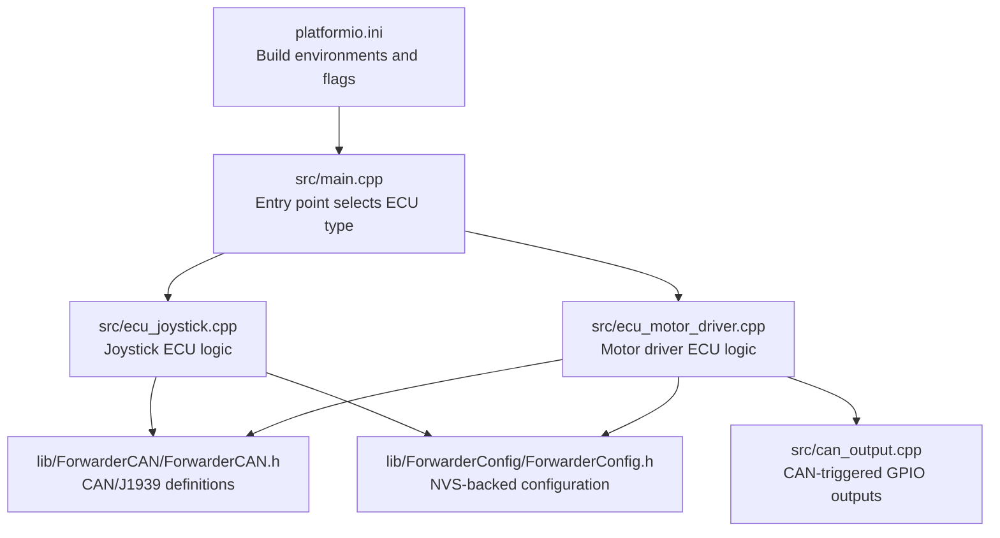
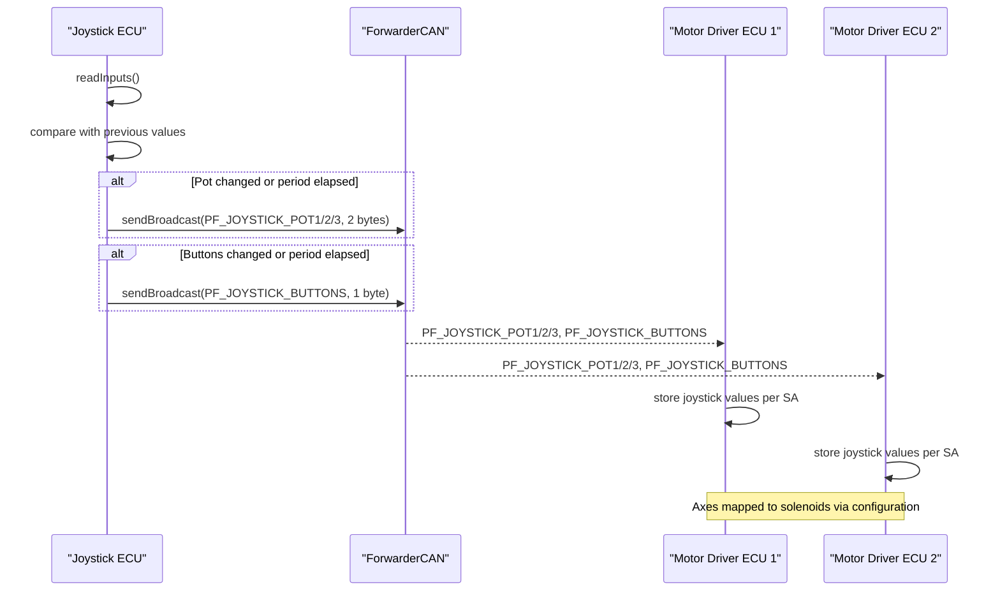
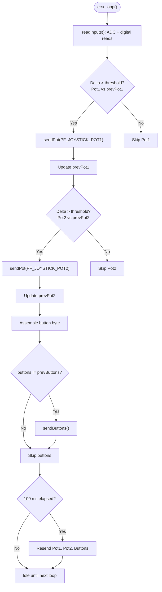
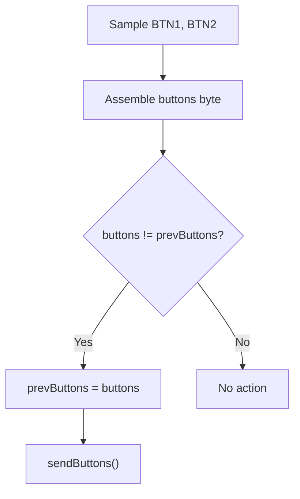
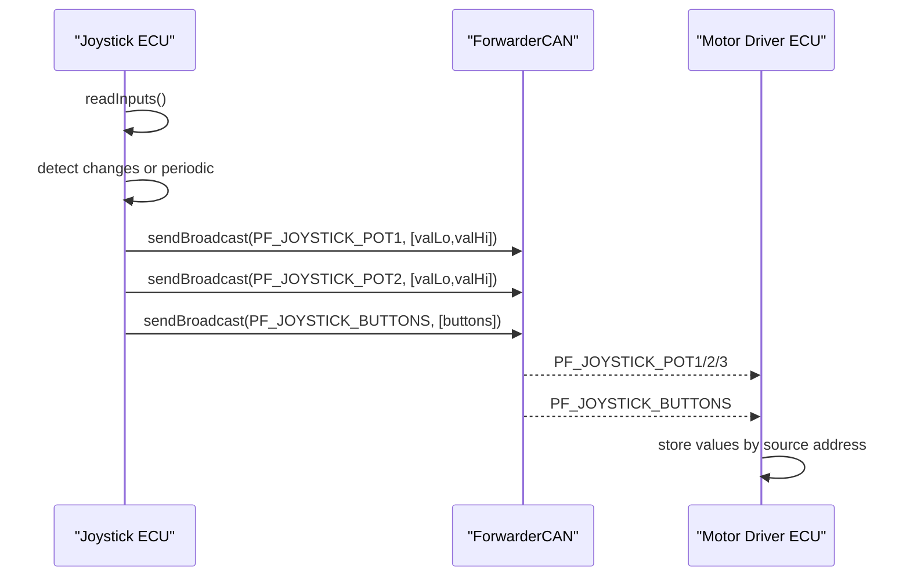
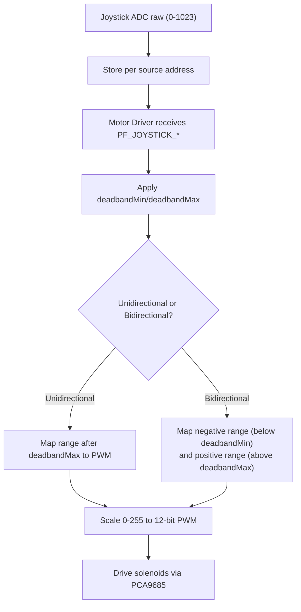
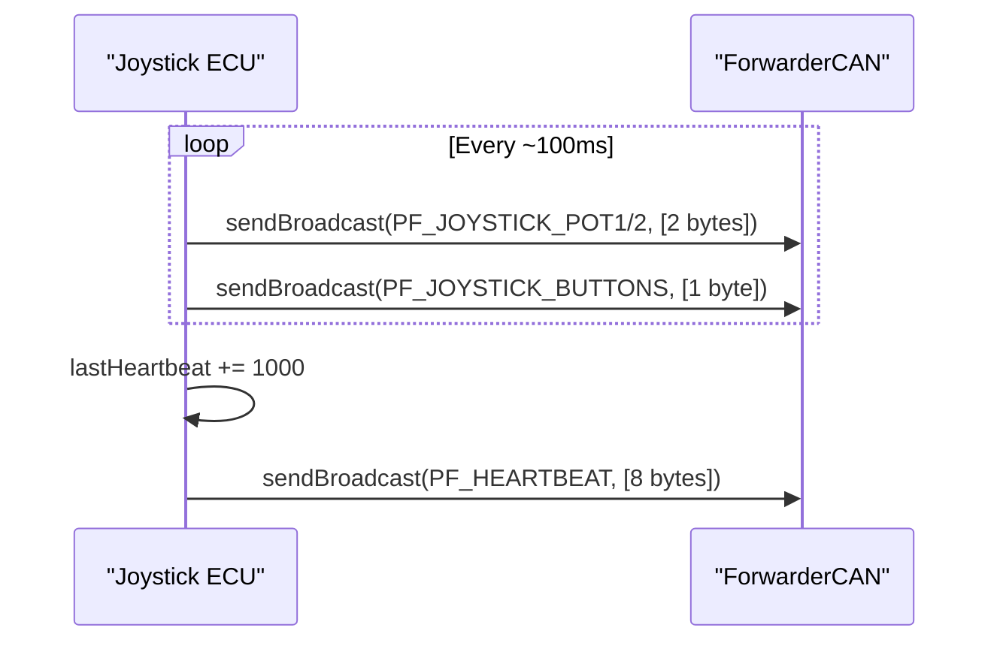
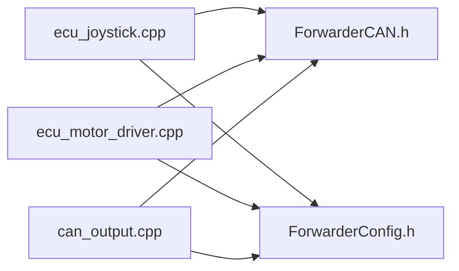

# Joystick ECU

<cite>
**Referenced Files in This Document**
- [README.md](file://README.md)
- [platformio.ini](file://platformio.ini)
- [src/main.cpp](file://src/main.cpp)
- [src/ecu_joystick.cpp](file://src/ecu_joystick.cpp)
- [src/ecu_joystick.h](file://src/ecu_joystick.h)
- [src/ecu_motor_driver.cpp](file://src/ecu_motor_driver.cpp)
- [src/can_output.cpp](file://src/can_output.cpp)
- [src/can_output.h](file://src/can_output.h)
- [lib/ForwarderCAN/ForwarderCAN.h](file://lib/ForwarderCAN/ForwarderCAN.h)
- [lib/ForwarderConfig/ForwarderConfig.h](file://lib/ForwarderConfig/ForwarderConfig.h)
</cite>

## Table of Contents
1. [Introduction](#introduction)
2. [Project Structure](#project-structure)
3. [Core Components](#core-components)
4. [Architecture Overview](#architecture-overview)
5. [Detailed Component Analysis](#detailed-component-analysis)
6. [Dependency Analysis](#dependency-analysis)
7. [Performance Considerations](#performance-considerations)
8. [Troubleshooting Guide](#troubleshooting-guide)
9. [Conclusion](#conclusion)
10. [Appendices](#appendices)

## Introduction
This document describes the Joystick ECU implementation responsible for reading analog joystick inputs, detecting button presses, and broadcasting normalized data over the CAN bus. It explains the analog-to-digital conversion configuration, sampling behavior, filtering thresholds, button debouncing strategy, CAN message formats for joystick potentiometer and button data, and the heartbeat mechanism used to maintain connection status. Practical guidance is included for calibration, monitoring CAN messages, and diagnosing input responsiveness issues.

## Project Structure
The Joystick ECU is implemented as a PlatformIO project with a shared CAN library and configuration manager. The build system supports multiple environments for dual joysticks and optional OTA updates.

**Diagram sources**
- [platformio.ini:1-80](file://platformio.ini#L1-L80)
- [src/main.cpp:1-32](file://src/main.cpp#L1-L32)
- [src/ecu_joystick.cpp:1-239](file://src/ecu_joystick.cpp#L1-L239)
- [src/ecu_motor_driver.cpp:1-355](file://src/ecu_motor_driver.cpp#L1-L355)
- [lib/ForwarderCAN/ForwarderCAN.h:1-120](file://lib/ForwarderCAN/ForwarderCAN.h#L1-L120)
- [lib/ForwarderConfig/ForwarderConfig.h:1-92](file://lib/ForwarderConfig/ForwarderConfig.h#L1-L92)
- [src/can_output.cpp:1-66](file://src/can_output.cpp#L1-L66)

**Section sources**
- [README.md:1-131](file://README.md#L1-L131)
- [platformio.ini:1-80](file://platformio.ini#L1-L80)
- [src/main.cpp:1-32](file://src/main.cpp#L1-L32)

## Core Components
- Analog input acquisition: Two 10-bit ADC channels read from joystick pots, configured with 10-bit resolution and 11 dB attenuation.
- Digital input acquisition: Two buttons sampled as active-low signals with internal pull-up resistors.
- Filtering and throttling: Delta threshold comparisons and periodic retransmission to reduce CAN traffic and stabilize readings.
- CAN messaging: PF_JOYSTICK_POT1/POT2/POT3 and PF_JOYSTICK_BUTTONS broadcasts; heartbeat broadcast for status.
- LED status: Single WS2812 LED indicates connection state and identification mode.
- Configuration: NVS-stored address override and runtime settings.

**Section sources**
- [src/ecu_joystick.cpp:63-97](file://src/ecu_joystick.cpp#L63-L97)
- [src/ecu_joystick.cpp:99-112](file://src/ecu_joystick.cpp#L99-L112)
- [src/ecu_joystick.cpp:146-157](file://src/ecu_joystick.cpp#L146-L157)
- [lib/ForwarderCAN/ForwarderCAN.h:38-50](file://lib/ForwarderCAN/ForwarderCAN.h#L38-L50)

## Architecture Overview
The Joystick ECU reads analog and digital inputs, applies minimal filtering, and broadcasts standardized CAN frames. Motor driver ECUs subscribe to joystick data and map it to solenoid outputs using configurable axis mappings.

**Diagram sources**
- [src/ecu_joystick.cpp:194-236](file://src/ecu_joystick.cpp#L194-L236)
- [src/ecu_motor_driver.cpp:184-275](file://src/ecu_motor_driver.cpp#L184-L275)
- [lib/ForwarderCAN/ForwarderCAN.h:38-50](file://lib/ForwarderCAN/ForwarderCAN.h#L38-L50)

## Detailed Component Analysis

### Analog Input Processing
- Resolution and attenuation: 10-bit ADC with 11 dB attenuation enables reliable measurement up to the analog supply voltage.
- Sampling: Inputs are read once per loop cycle using standard ADC functions.
- Filtering: Delta threshold comparison against previous values prevents noisy transmissions. A secondary periodic retransmit ensures subscribers remain current even if no change occurs.
- Deadband concept: While the Joystick ECU itself does not apply deadband, the receiving Motor Driver ECU implements deadband and sensitivity scaling during axis mapping.

**Diagram sources**
- [src/ecu_joystick.cpp:194-236](file://src/ecu_joystick.cpp#L194-L236)

**Section sources**
- [src/ecu_joystick.cpp:63-68](file://src/ecu_joystick.cpp#L63-L68)
- [src/ecu_joystick.cpp:194-236](file://src/ecu_joystick.cpp#L194-L236)
- [lib/ForwarderCAN/ForwarderCAN.h:38-50](file://lib/ForwarderCAN/ForwarderCAN.h#L38-L50)

### Button State Management and Debouncing
- Hardware: Buttons are connected as active-low with internal pull-ups.
- Software: Buttons are sampled each loop and packed into a single byte for broadcasting. Change detection is performed by comparing the assembled byte to the previous state.
- Debounce: No explicit debouncing algorithm is implemented in code; stability relies on the delta-threshold pattern and periodic retransmit. For mechanical switches, this approach provides adequate noise immunity under normal conditions.

**Diagram sources**
- [src/ecu_joystick.cpp:209-217](file://src/ecu_joystick.cpp#L209-L217)
- [src/ecu_joystick.cpp:106-112](file://src/ecu_joystick.cpp#L106-L112)

**Section sources**
- [src/ecu_joystick.cpp:165-166](file://src/ecu_joystick.cpp#L165-L166)
- [src/ecu_joystick.cpp:209-217](file://src/ecu_joystick.cpp#L209-L217)

### CAN Message Formatting for Joystick Data
- Potentiometer messages:
  - PF_JOYSTICK_POT1, PF_JOYSTICK_POT2, PF_JOYSTICK_POT3: 2-byte payload containing the 10-bit ADC value split into low and high bytes.
  - Destination: Broadcast (PS = 0xFF).
- Button message:
  - PF_JOYSTICK_BUTTONS: 1-byte payload with bit 0 for BTN1 and bit 1 for BTN2.
- The receiving Motor Driver ECU stores these values per source address and maps them to solenoids according to axis configuration.

**Diagram sources**
- [lib/ForwarderCAN/ForwarderCAN.h:38-50](file://lib/ForwarderCAN/ForwarderCAN.h#L38-L50)
- [src/ecu_joystick.cpp:99-112](file://src/ecu_joystick.cpp#L99-L112)
- [src/ecu_motor_driver.cpp:192-205](file://src/ecu_motor_driver.cpp#L192-L205)

**Section sources**
- [lib/ForwarderCAN/ForwarderCAN.h:38-50](file://lib/ForwarderCAN/ForwarderCAN.h#L38-L50)
- [src/ecu_joystick.cpp:99-112](file://src/ecu_joystick.cpp#L99-L112)
- [src/ecu_motor_driver.cpp:192-205](file://src/ecu_motor_driver.cpp#L192-L205)

### Input Calibration, Deadband, and Sensitivity
- Joystick ECU:
  - Performs no local calibration or deadband processing; it forwards raw 10-bit ADC values.
- Motor Driver ECU:
  - Implements deadband and sensitivity mapping per axis. Deadband is defined in raw ADC units and applied differently for unidirectional and bidirectional axes. PWM output is scaled to 12-bit internally.
- Configuration storage:
  - Axis configurations are stored in NVS and can be updated via CAN commands. Defaults are available for factory reset scenarios.

**Diagram sources**
- [src/ecu_motor_driver.cpp:101-135](file://src/ecu_motor_driver.cpp#L101-L135)
- [lib/ForwarderConfig/ForwarderConfig.h:41-57](file://lib/ForwarderConfig/ForwarderConfig.h#L41-L57)

**Section sources**
- [src/ecu_motor_driver.cpp:101-135](file://src/ecu_motor_driver.cpp#L101-L135)
- [lib/ForwarderConfig/ForwarderConfig.h:41-57](file://lib/ForwarderConfig/ForwarderConfig.h#L41-L57)

### Real-Time Data Transmission and Heartbeat
- Transmission cadence:
  - Potentiometer and button data are sent upon change or at approximately 10 Hz (100 ms interval) to ensure timely updates without excessive bus load.
- Heartbeat:
  - Every 1 second, a heartbeat frame is broadcast containing online status, uptime, and counters. This maintains liveness and aids diagnostics.

**Diagram sources**
- [src/ecu_joystick.cpp:218-231](file://src/ecu_joystick.cpp#L218-L231)
- [src/ecu_joystick.cpp:146-157](file://src/ecu_joystick.cpp#L146-L157)
- [lib/ForwarderCAN/ForwarderCAN.h:49](file://lib/ForwarderCAN/ForwarderCAN.h#L49)

**Section sources**
- [src/ecu_joystick.cpp:218-231](file://src/ecu_joystick.cpp#L218-L231)
- [src/ecu_joystick.cpp:146-157](file://src/ecu_joystick.cpp#L146-L157)

### Interrupt-Driven Input Handling, Timing Constraints, and Memory
- Interrupt model: The Joystick ECU does not use interrupts for input sampling; polling is used with a tight loop and short delays. This simplifies determinism and avoids ISR overhead.
- Timing constraints:
  - ADC sampling occurs once per loop.
  - CAN send/receive operations are handled cooperatively within the loop.
  - LED updates are rate-limited to ~20 Hz to conserve CPU.
- Memory management:
  - Static buffers for previous values and timestamps minimize dynamic allocation.
  - NVS-backed configuration persists settings across resets.

**Section sources**
- [src/ecu_joystick.cpp:194-236](file://src/ecu_joystick.cpp#L194-L236)
- [src/ecu_joystick.cpp:70-97](file://src/ecu_joystick.cpp#L70-L97)
- [lib/ForwarderConfig/ForwarderConfig.h:64-92](file://lib/ForwarderConfig/ForwarderConfig.h#L64-L92)

## Dependency Analysis
The Joystick ECU depends on the shared CAN library and configuration manager. It interacts with Motor Driver ECUs that consume joystick data and drive actuators.

**Diagram sources**
- [src/ecu_joystick.cpp:1-10](file://src/ecu_joystick.cpp#L1-L10)
- [src/ecu_motor_driver.cpp:1-12](file://src/ecu_motor_driver.cpp#L1-L12)
- [src/can_output.cpp:1-6](file://src/can_output.cpp#L1-L6)
- [lib/ForwarderCAN/ForwarderCAN.h:1-120](file://lib/ForwarderCAN/ForwarderCAN.h#L1-L120)
- [lib/ForwarderConfig/ForwarderConfig.h:1-92](file://lib/ForwarderConfig/ForwarderConfig.h#L1-L92)

**Section sources**
- [src/ecu_joystick.cpp:1-10](file://src/ecu_joystick.cpp#L1-L10)
- [src/ecu_motor_driver.cpp:1-12](file://src/ecu_motor_driver.cpp#L1-L12)
- [src/can_output.cpp:1-6](file://src/can_output.cpp#L1-L6)

## Performance Considerations
- ADC sampling: 10-bit resolution with 11 dB attenuation provides good dynamic range for typical joystick circuits.
- Bus bandwidth: Change-detection plus periodic retransmit (~10 Hz) keeps CAN load reasonable while ensuring timely updates.
- CPU utilization: Polling model with minimal work per loop keeps latency predictable.
- LED updates: Rate limiting prevents unnecessary CPU cycles.

[No sources needed since this section provides general guidance]

## Troubleshooting Guide
- No CAN messages observed:
  - Verify address claiming succeeded and the ECU is online before sending data.
  - Confirm CAN wiring and termination are correct.
- Stuck or jittery joystick position:
  - Check physical pot connections and ensure power/ground are clean.
  - Increase the delta threshold slightly if noise is present; note that the Joystick ECU uses a fixed small threshold.
- Buttons not responding:
  - Ensure buttons are wired to ground with internal pull-ups enabled.
  - Verify the button byte assembly logic and that the change detection path executes.
- Diagnosing responsiveness:
  - Monitor PF_JOYSTICK_POT1/2/3 and PF_JOYSTICK_BUTTONS frames on a CAN analyzer.
  - Confirm heartbeat frames appear every second to validate connectivity.

**Section sources**
- [src/ecu_joystick.cpp:194-236](file://src/ecu_joystick.cpp#L194-L236)
- [src/ecu_joystick.cpp:114-144](file://src/ecu_joystick.cpp#L114-L144)
- [src/ecu_joystick.cpp:146-157](file://src/ecu_joystick.cpp#L146-L157)

## Conclusion
The Joystick ECU provides a lightweight, deterministic pipeline for acquiring analog and digital inputs, applying minimal filtering, and broadcasting standardized CAN frames. Its design emphasizes simplicity, reliability, and low bus utilization. Calibrated behavior and deadband/sensitivity adjustments are implemented on the receiving Motor Driver ECUs, enabling precise actuator control.

[No sources needed since this section summarizes without analyzing specific files]

## Appendices

### Practical Examples

- Joystick calibration workflow (Motor Driver side):
  - Determine minimum and maximum ADC values for each joystick axis while moving the stick through full travel.
  - Set deadbandMin near the lower end of idle drift and deadbandMax near the upper end.
  - Adjust pwmMin/pwmMax to achieve desired actuator response range.
  - Save configuration via CAN commands and verify mapping by observing solenoid behavior.

- Monitoring CAN messages:
  - Use a CAN analyzer to observe PF_JOYSTICK_POT1/2/3 and PF_JOYSTICK_BUTTONS frames.
  - Confirm periodic retransmissions occur approximately every 100 ms when values change.

- Troubleshooting input responsiveness:
  - If readings appear noisy, inspect wiring and power quality.
  - If buttons fail to register, verify pull-up configuration and wiring to ground.

**Section sources**
- [src/ecu_motor_driver.cpp:101-135](file://src/ecu_motor_driver.cpp#L101-L135)
- [src/ecu_joystick.cpp:194-236](file://src/ecu_joystick.cpp#L194-L236)
- [README.md:22-46](file://README.md#L22-L46)