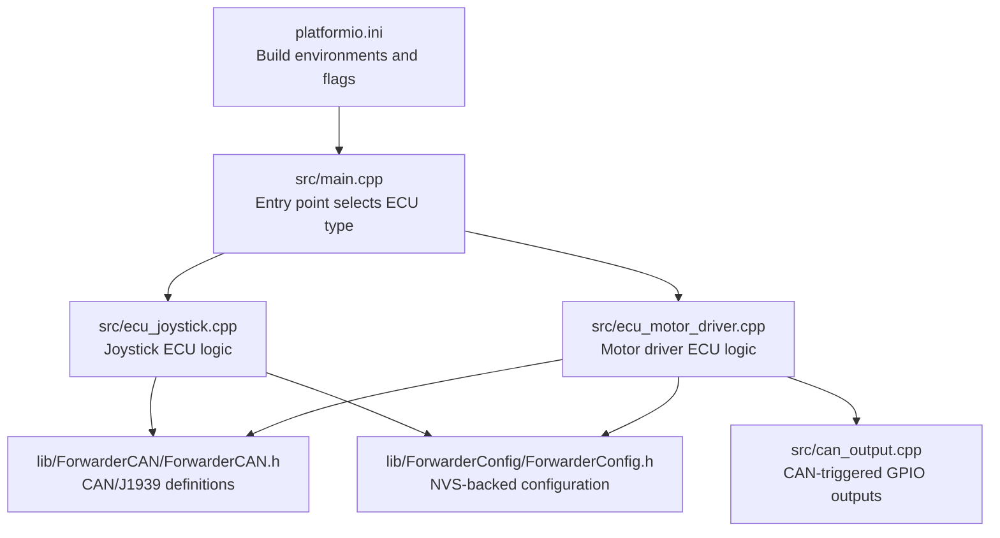
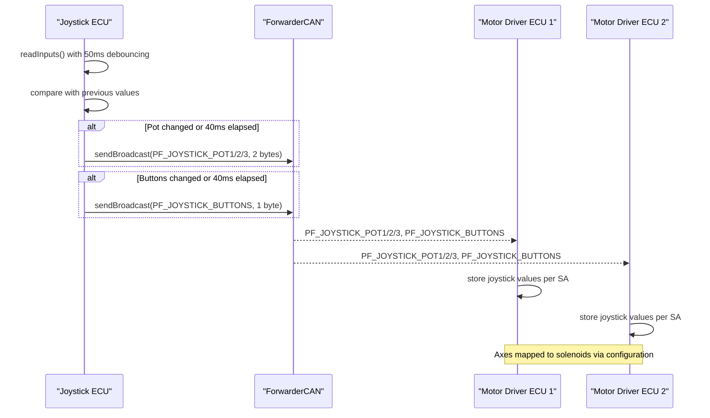
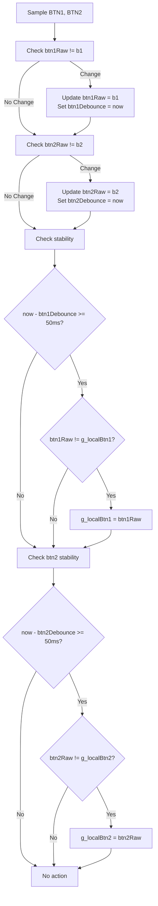
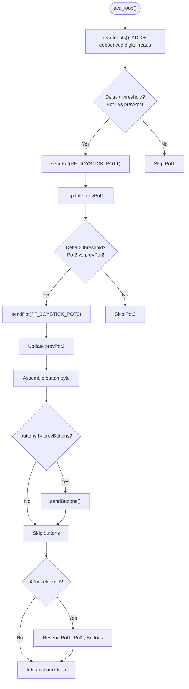
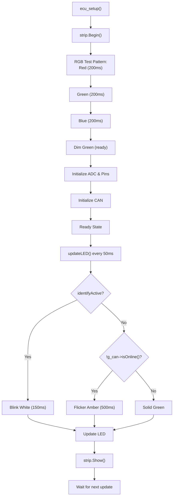
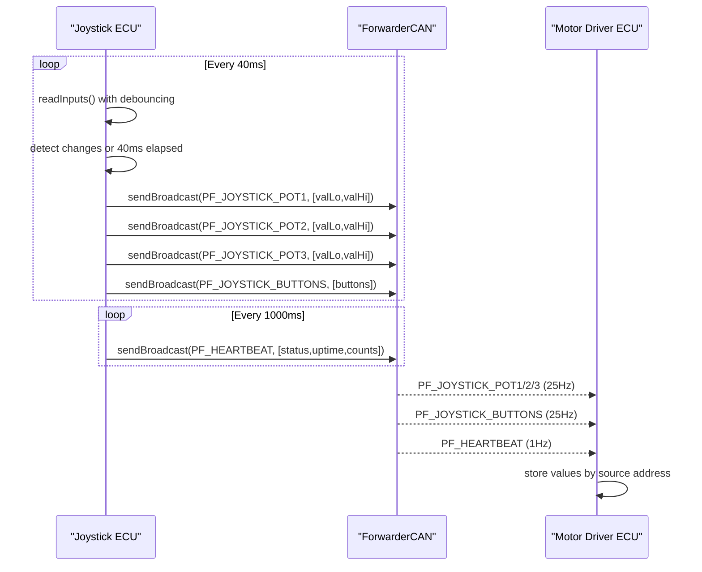
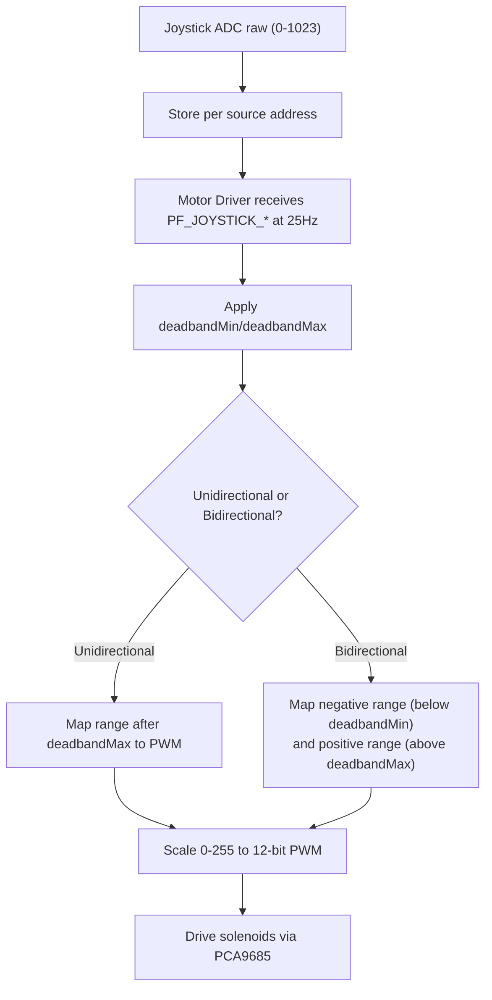
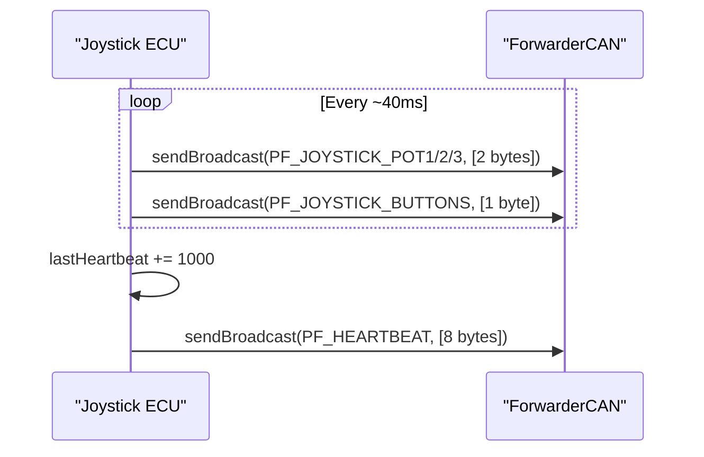
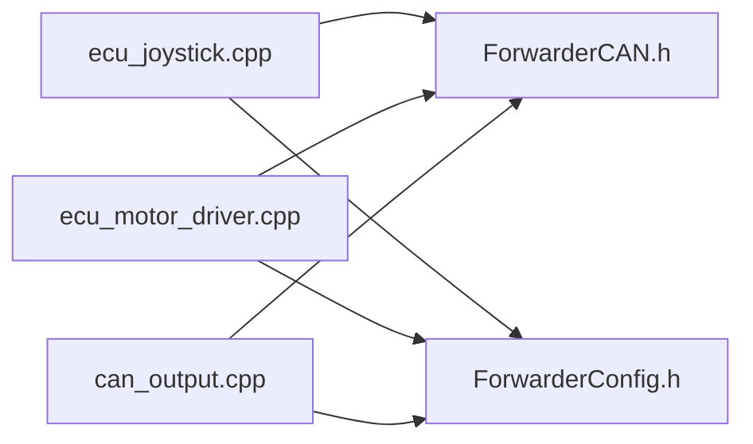

# Joystick ECU

<cite>
**Referenced Files in This Document**
- [README.md](file://README.md)
- [platformio.ini](file://platformio.ini)
- [src/main.cpp](file://src/main.cpp)
- [src/ecu_joystick.cpp](file://src/ecu_joystick.cpp)
- [src/ecu_joystick.h](file://src/ecu_joystick.h)
- [src/ecu_motor_driver.cpp](file://src/ecu_motor_driver.cpp)
- [src/can_output.cpp](file://src/can_output.cpp)
- [src/can_output.h](file://src/can_output.h)
- [lib/ForwarderCAN/ForwarderCAN.h](file://lib/ForwarderCAN/ForwarderCAN.h)
- [lib/ForwarderConfig/ForwarderConfig.h](file://lib/ForwarderConfig/ForwarderConfig.h)
</cite>

## Update Summary
**Changes Made**
- Updated button debouncing section to reflect 50ms debouncing mechanism
- Revised sampling rate documentation to show 25Hz (40ms interval) instead of ~10Hz
- Updated LED brightness section to reflect maximum brightness of 255
- Added documentation for improved RGB startup test pattern
- Updated timing constraints and performance considerations

## Table of Contents
1. [Introduction](#introduction)
2. [Project Structure](#project-structure)
3. [Core Components](#core-components)
4. [Architecture Overview](#architecture-overview)
5. [Detailed Component Analysis](#detailed-component-analysis)
6. [Dependency Analysis](#dependency-analysis)
7. [Performance Considerations](#performance-considerations)
8. [Troubleshooting Guide](#troubleshooting-guide)
9. [Conclusion](#conclusion)
10. [Appendices](#appendices)

## Introduction
This document describes the Joystick ECU implementation responsible for reading analog joystick inputs, detecting button presses with debouncing, and broadcasting normalized data over the CAN bus at 25Hz. It explains the analog-to-digital conversion configuration, enhanced button debouncing with 50ms stability requirement, filtering thresholds, CAN message formats for joystick potentiometer and button data, and the heartbeat mechanism used to maintain connection status. Practical guidance is included for calibration, monitoring CAN messages, and diagnosing input responsiveness issues.

## Project Structure
The Joystick ECU is implemented as a PlatformIO project with a shared CAN library and configuration manager. The build system supports multiple environments for dual joysticks and optional OTA updates.

**Diagram sources**
- [platformio.ini:1-114](file://platformio.ini#L1-L114)
- [src/main.cpp:1-38](file://src/main.cpp#L1-L38)
- [src/ecu_joystick.cpp:1-269](file://src/ecu_joystick.cpp#L1-L269)
- [src/ecu_motor_driver.cpp:1-355](file://src/ecu_motor_driver.cpp#L1-L355)
- [lib/ForwarderCAN/ForwarderCAN.h:1-123](file://lib/ForwarderCAN/ForwarderCAN.h#L1-L123)
- [lib/ForwarderConfig/ForwarderConfig.h:1-92](file://lib/ForwarderConfig/ForwarderConfig.h#L1-L92)
- [src/can_output.cpp:1-66](file://src/can_output.cpp#L1-L66)

**Section sources**
- [README.md:1-194](file://README.md#L1-L194)
- [platformio.ini:1-114](file://platformio.ini#L1-L114)
- [src/main.cpp:1-38](file://src/main.cpp#L1-L38)

## Core Components
- Analog input acquisition: Three 10-bit ADC channels read from joystick pots, configured with 10-bit resolution and 11 dB attenuation.
- Digital input acquisition: Two buttons sampled as active-low signals with internal pull-up resistors and 50ms debouncing stability requirement.
- Filtering and throttling: Delta threshold comparisons and standardized 25Hz sampling rate to reduce CAN traffic and stabilize readings.
- CAN messaging: PF_JOYSTICK_POT1/POT2/POT3 and PF_JOYSTICK_BUTTONS broadcasts at 25Hz; heartbeat broadcast for status.
- LED status: Single WS2812 LED with maximum brightness (255) indicating connection state and identification mode.
- Configuration: NVS-stored address override and runtime settings.

**Section sources**
- [src/ecu_joystick.cpp:63-97](file://src/ecu_joystick.cpp#L63-L97)
- [src/ecu_joystick.cpp:99-112](file://src/ecu_joystick.cpp#L99-L112)
- [src/ecu_joystick.cpp:146-157](file://src/ecu_joystick.cpp#L146-L157)
- [lib/ForwarderCAN/ForwarderCAN.h:38-50](file://lib/ForwarderCAN/ForwarderCAN.h#L38-L50)

## Architecture Overview
The Joystick ECU reads analog and digital inputs with debouncing, applies minimal filtering, and broadcasts standardized CAN frames at 25Hz. Motor driver ECUs subscribe to joystick data and map it to solenoid outputs using configurable axis mappings.

**Diagram sources**
- [src/ecu_joystick.cpp:224-266](file://src/ecu_joystick.cpp#L224-L266)
- [src/ecu_motor_driver.cpp:184-275](file://src/ecu_motor_driver.cpp#L184-L275)
- [lib/ForwarderCAN/ForwarderCAN.h:38-50](file://lib/ForwarderCAN/ForwarderCAN.h#L38-L50)

## Detailed Component Analysis

### Enhanced Button Debouncing System
- **Hardware**: Buttons are connected as active-low with internal pull-ups.
- **Software**: Buttons are sampled each loop and debounced using a 50ms stability requirement. The debouncing algorithm requires the button state to remain stable for 50ms before accepting the change.
- **Algorithm**: Each button maintains a raw state and a debounced state. When a state change is detected, a timestamp is recorded. Only when 50ms has elapsed since the last state change is the button state updated.
- **Stability**: This 50ms debouncing provides excellent noise immunity for mechanical switches while maintaining responsive button detection.

**Diagram sources**
- [src/ecu_joystick.cpp:74-87](file://src/ecu_joystick.cpp#L74-L87)

**Section sources**
- [src/ecu_joystick.cpp:63-66](file://src/ecu_joystick.cpp#L63-L66)
- [src/ecu_joystick.cpp:74-87](file://src/ecu_joystick.cpp#L74-L87)

### Analog Input Processing with 25Hz Sampling
- **Resolution and attenuation**: 10-bit ADC with 11 dB attenuation enables reliable measurement up to the analog supply voltage.
- **Sampling**: Inputs are read once per loop cycle using standard ADC functions.
- **Filtering**: Delta threshold comparison against previous values prevents noisy transmissions. A standardized 25Hz sampling rate (40ms interval) ensures consistent data transmission.
- **Deadband concept**: While the Joystick ECU itself does not apply deadband, the receiving Motor Driver ECU implements deadband and sensitivity scaling during axis mapping.

**Diagram sources**
- [src/ecu_joystick.cpp:224-266](file://src/ecu_joystick.cpp#L224-L266)

**Section sources**
- [src/ecu_joystick.cpp:63-68](file://src/ecu_joystick.cpp#L63-L68)
- [src/ecu_joystick.cpp:224-266](file://src/ecu_joystick.cpp#L224-L266)
- [lib/ForwarderCAN/ForwarderCAN.h:38-50](file://lib/ForwarderCAN/ForwarderCAN.h#L38-L50)

### LED Status System with Enhanced Brightness
- **Startup sequence**: The ECU performs an RGB test pattern during initialization, flashing red, green, and blue LEDs in sequence.
- **Operating brightness**: LED brightness is set to maximum (255) for optimal visibility.
- **Status indication**: 
  - Solid green: Ready and operational
  - Blinking red: CAN initialization failed
  - Dim green: Ready state after successful initialization
  - White blinking: Identification mode activated
  - Flickering amber: Not connected to CAN bus
- **Update rate**: LED updates are rate-limited to ~20 Hz to conserve CPU resources.

**Diagram sources**
- [src/ecu_joystick.cpp:178-222](file://src/ecu_joystick.cpp#L178-L222)
- [src/ecu_joystick.cpp:89-116](file://src/ecu_joystick.cpp#L89-L116)

**Section sources**
- [src/ecu_joystick.cpp:58-59](file://src/ecu_joystick.cpp#L58-L59)
- [src/ecu_joystick.cpp:178-185](file://src/ecu_joystick.cpp#L178-L185)
- [src/ecu_joystick.cpp:89-116](file://src/ecu_joystick.cpp#L89-L116)

### CAN Message Formatting for Joystick Data
- **Potentiometer messages**:
  - PF_JOYSTICK_POT1, PF_JOYSTICK_POT2, PF_JOYSTICK_POT3: 2-byte payload containing the 10-bit ADC value split into low and high bytes.
  - Destination: Broadcast (PS = 0xFF).
  - Rate: 25Hz (40ms interval) for consistent data flow.
- **Button message**:
  - PF_JOYSTICK_BUTTONS: 1-byte payload with bit 0 for BTN1 and bit 1 for BTN2.
  - Rate: 25Hz (40ms interval) for synchronized button state updates.
- **Heartbeat message**:
  - PF_HEARTBEAT: 8-byte payload with online status, uptime, and counters.
  - Rate: 1Hz for system health monitoring.
- The receiving Motor Driver ECU stores these values per source address and maps them to solenoids according to axis configuration.

**Diagram sources**
- [lib/ForwarderCAN/ForwarderCAN.h:38-50](file://lib/ForwarderCAN/ForwarderCAN.h#L38-L50)
- [src/ecu_joystick.cpp:99-112](file://src/ecu_joystick.cpp#L99-L112)
- [src/ecu_motor_driver.cpp:192-205](file://src/ecu_motor_driver.cpp#L192-L205)

**Section sources**
- [lib/ForwarderCAN/ForwarderCAN.h:38-50](file://lib/ForwarderCAN/ForwarderCAN.h#L38-L50)
- [src/ecu_joystick.cpp:99-112](file://src/ecu_joystick.cpp#L99-L112)
- [src/ecu_motor_driver.cpp:192-205](file://src/ecu_motor_driver.cpp#L192-L205)

### Input Calibration, Deadband, and Sensitivity
- **Joystick ECU**:
  - Performs no local calibration or deadband processing; it forwards raw 10-bit ADC values at 25Hz.
- **Motor Driver ECU**:
  - Implements deadband and sensitivity mapping per axis. Deadband is defined in raw ADC units and applied differently for unidirectional and bidirectional axes. PWM output is scaled to 12-bit internally.
- **Configuration storage**:
  - Axis configurations are stored in NVS and can be updated via CAN commands. Defaults are available for factory reset scenarios.

**Diagram sources**
- [src/ecu_motor_driver.cpp:101-135](file://src/ecu_motor_driver.cpp#L101-L135)
- [lib/ForwarderConfig/ForwarderConfig.h:41-57](file://lib/ForwarderConfig/ForwarderConfig.h#L41-L57)

**Section sources**
- [src/ecu_motor_driver.cpp:101-135](file://src/ecu_motor_driver.cpp#L101-L135)
- [lib/ForwarderConfig/ForwarderConfig.h:41-57](file://lib/ForwarderConfig/ForwarderConfig.h#L41-L57)

### Real-Time Data Transmission and Heartbeat
- **Transmission cadence**:
  - Potentiometer and button data are sent at exactly 25Hz (40ms interval) to ensure consistent updates without excessive bus load.
  - Heartbeat frames are broadcast every 1 second to maintain liveness and aid diagnostics.
- **Timing precision**: The 40ms interval provides precise timing control for real-time applications.
- **Bus efficiency**: 25Hz sampling rate strikes a balance between responsiveness and CAN bus utilization.

**Diagram sources**
- [src/ecu_joystick.cpp:224-266](file://src/ecu_joystick.cpp#L224-L266)
- [src/ecu_joystick.cpp:165-176](file://src/ecu_joystick.cpp#L165-L176)
- [lib/ForwarderCAN/ForwarderCAN.h:49](file://lib/ForwarderCAN/ForwarderCAN.h#L49)

**Section sources**
- [src/ecu_joystick.cpp:224-266](file://src/ecu_joystick.cpp#L224-L266)
- [src/ecu_joystick.cpp:165-176](file://src/ecu_joystick.cpp#L165-L176)

### Interrupt-Driven Input Handling, Timing Constraints, and Memory
- **Interrupt model**: The Joystick ECU does not use interrupts for input sampling; polling is used with a tight loop and short delays. This simplifies determinism and avoids ISR overhead.
- **Timing constraints**:
  - ADC sampling occurs once per loop with 50ms button debouncing.
  - CAN send/receive operations are handled cooperatively within the loop.
  - LED updates are rate-limited to ~20 Hz to conserve CPU.
  - 25Hz sampling rate provides consistent timing for real-time applications.
- **Memory management**:
  - Static buffers for previous values and timestamps minimize dynamic allocation.
  - NVS-backed configuration persists settings across resets.
  - Maximum LED brightness (255) provides optimal visibility without additional computational overhead.

**Section sources**
- [src/ecu_joystick.cpp:224-266](file://src/ecu_joystick.cpp#L224-L266)
- [src/ecu_joystick.cpp:70-97](file://src/ecu_joystick.cpp#L70-L97)
- [lib/ForwarderConfig/ForwarderConfig.h:64-92](file://lib/ForwarderConfig/ForwarderConfig.h#L64-L92)

## Dependency Analysis
The Joystick ECU depends on the shared CAN library and configuration manager. It interacts with Motor Driver ECUs that consume joystick data and drive actuators.

**Diagram sources**
- [src/ecu_joystick.cpp:1-10](file://src/ecu_joystick.cpp#L1-L10)
- [src/ecu_motor_driver.cpp:1-12](file://src/ecu_motor_driver.cpp#L1-L12)
- [src/can_output.cpp:1-6](file://src/can_output.cpp#L1-L6)
- [lib/ForwarderCAN/ForwarderCAN.h:1-123](file://lib/ForwarderCAN/ForwarderCAN.h#L1-L123)
- [lib/ForwarderConfig/ForwarderConfig.h:1-92](file://lib/ForwarderConfig/ForwarderConfig.h#L1-L92)

**Section sources**
- [src/ecu_joystick.cpp:1-10](file://src/ecu_joystick.cpp#L1-L10)
- [src/ecu_motor_driver.cpp:1-12](file://src/ecu_motor_driver.cpp#L1-L12)
- [src/can_output.cpp:1-6](file://src/can_output.cpp#L1-L6)

## Performance Considerations
- **ADC sampling**: 10-bit resolution with 11 dB attenuation provides good dynamic range for typical joystick circuits.
- **Bus bandwidth**: Standardized 25Hz sampling rate keeps CAN load reasonable while ensuring timely updates without excessive bus utilization.
- **CPU utilization**: Polling model with minimal work per loop keeps latency predictable. 50ms button debouncing adds minimal computational overhead.
- **LED updates**: Rate limiting prevents unnecessary CPU cycles while maximum brightness (255) ensures optimal visibility.
- **Real-time performance**: 25Hz sampling rate provides consistent timing for real-time applications while maintaining system responsiveness.

## Troubleshooting Guide
- **No CAN messages observed**:
  - Verify address claiming succeeded and the ECU is online before sending data.
  - Confirm CAN wiring and termination are correct.
- **Stuck or jittery joystick position**:
  - Check physical pot connections and ensure power/ground are clean.
  - Increase the delta threshold slightly if noise is present; note that the Joystick ECU uses a fixed small threshold.
- **Buttons not responding**:
  - Ensure buttons are wired to ground with internal pull-ups enabled.
  - Verify the 50ms debouncing algorithm is functioning correctly.
  - Check that button press duration meets the 50ms stability requirement.
- **Diagnosing responsiveness**:
  - Monitor PF_JOYSTICK_POT1/2/3 and PF_JOYSTICK_BUTTONS frames on a CAN analyzer.
  - Confirm heartbeat frames appear every second to validate connectivity.
- **LED issues**:
  - During startup, verify the RGB test pattern completes successfully.
  - Check that LED brightness is at maximum (255) for optimal visibility.
  - Verify LED color updates are occurring at the expected rate.

**Section sources**
- [src/ecu_joystick.cpp:224-266](file://src/ecu_joystick.cpp#L224-L266)
- [src/ecu_joystick.cpp:114-144](file://src/ecu_joystick.cpp#L114-L144)
- [src/ecu_joystick.cpp:165-176](file://src/ecu_joystick.cpp#L165-L176)

## Conclusion
The Joystick ECU provides a lightweight, deterministic pipeline for acquiring analog and digital inputs with enhanced 50ms button debouncing, applying minimal filtering, and broadcasting standardized CAN frames at 25Hz. Its design emphasizes simplicity, reliability, low bus utilization, and optimal LED visibility. The enhanced debouncing system provides excellent noise immunity while maintaining responsive button detection. Calibrated behavior and deadband/sensitivity adjustments are implemented on the receiving Motor Driver ECUs, enabling precise actuator control.

## Appendices

### Practical Examples

- **Joystick calibration workflow (Motor Driver side)**:
  - Determine minimum and maximum ADC values for each joystick axis while moving the stick through full travel.
  - Set deadbandMin near the lower end of idle drift and deadbandMax near the upper end.
  - Adjust pwmMin/pwmMax to achieve desired actuator response range.
  - Save configuration via CAN commands and verify mapping by observing solenoid behavior.

- **Monitoring CAN messages**:
  - Use a CAN analyzer to observe PF_JOYSTICK_POT1/2/3 and PF_JOYSTICK_BUTTONS frames.
  - Confirm periodic retransmissions occur exactly every 40ms when values change.

- **Troubleshooting input responsiveness**:
  - If readings appear noisy, inspect wiring and power quality.
  - If buttons fail to register, verify pull-up configuration and wiring to ground.
  - Check that button presses meet the 50ms stability requirement for debouncing.

- **LED configuration and testing**:
  - Use the web interface to set LED colors with maximum brightness (255).
  - Verify the RGB startup test pattern during initialization.
  - Monitor LED status indicators for system health and connection status.

**Section sources**
- [src/ecu_motor_driver.cpp:101-135](file://src/ecu_motor_driver.cpp#L101-L135)
- [src/ecu_joystick.cpp:224-266](file://src/ecu_joystick.cpp#L224-L266)
- [README.md:47-90](file://README.md#L47-L90)