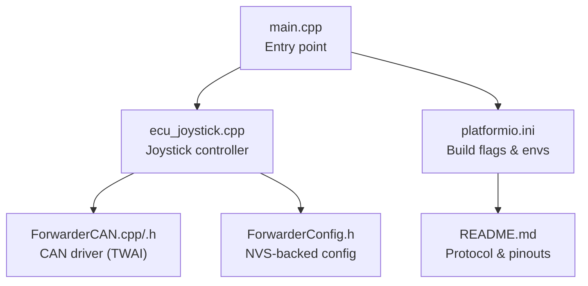
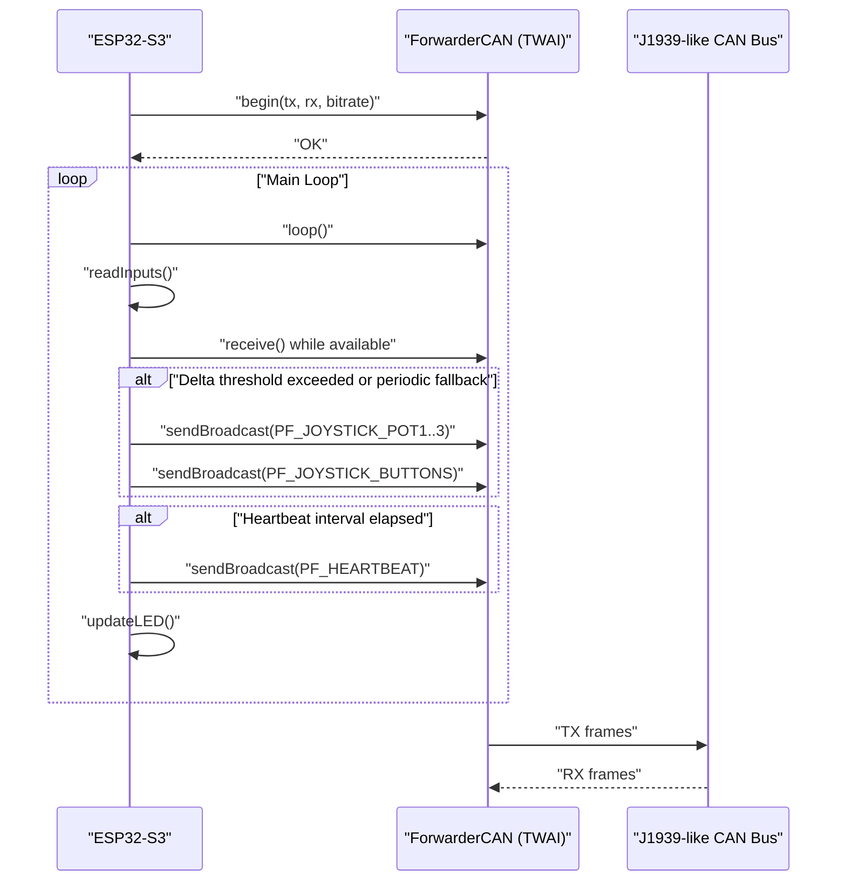
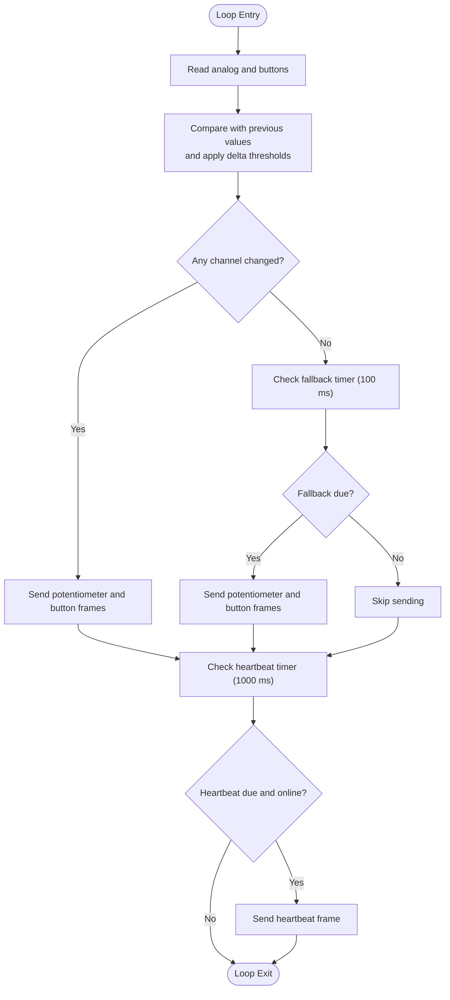
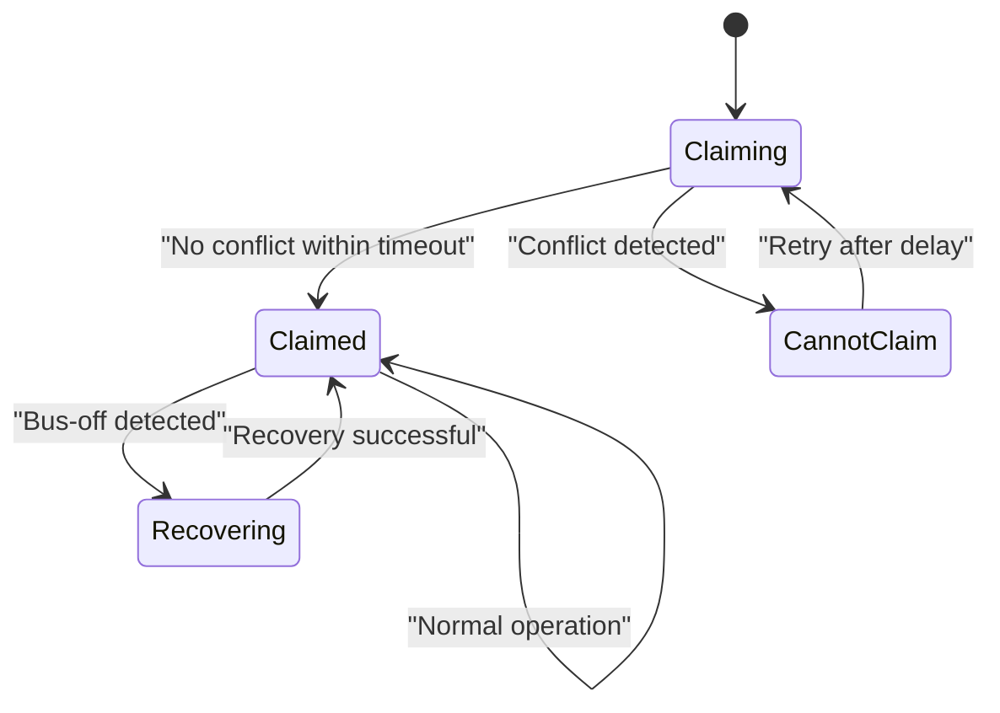
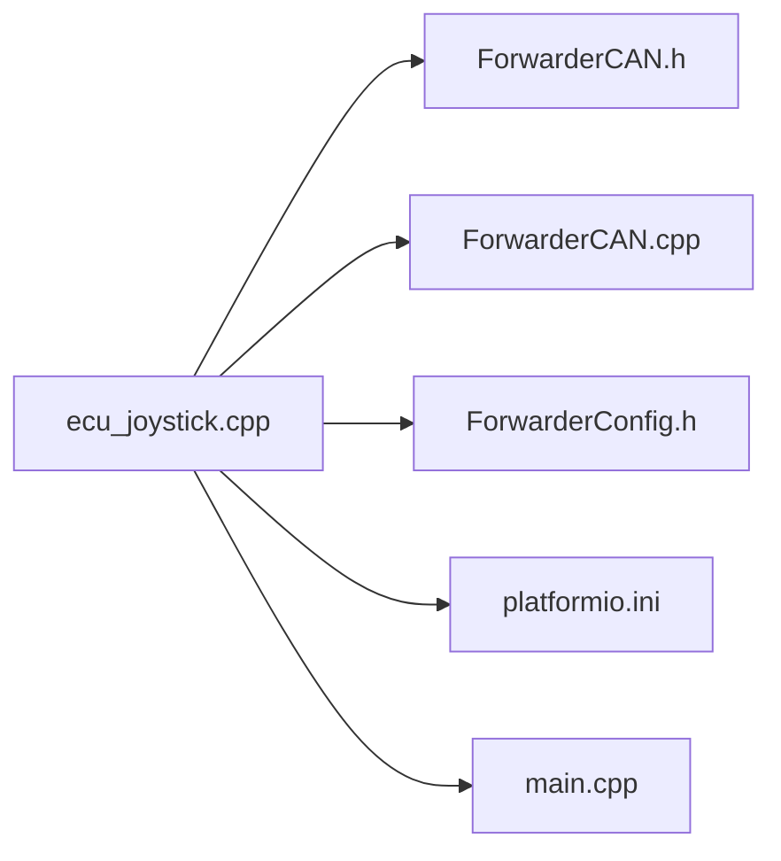

# Real-time Data Transmission

<cite>
**Referenced Files in This Document**
- [main.cpp](file://src/main.cpp)
- [ecu_joystick.cpp](file://src/ecu_joystick.cpp)
- [ecu_joystick.h](file://src/ecu_joystick.h)
- [ForwarderCAN.h](file://lib/ForwarderCAN/ForwarderCAN.h)
- [ForwarderCAN.cpp](file://lib/ForwarderCAN/ForwarderCAN.cpp)
- [ForwarderConfig.h](file://lib/ForwarderConfig/ForwarderConfig.h)
- [platformio.ini](file://platformio.ini)
- [README.md](file://README.md)
</cite>

## Table of Contents
1. [Introduction](#introduction)
2. [Project Structure](#project-structure)
3. [Core Components](#core-components)
4. [Architecture Overview](#architecture-overview)
5. [Detailed Component Analysis](#detailed-component-analysis)
6. [Dependency Analysis](#dependency-analysis)
7. [Performance Considerations](#performance-considerations)
8. [Troubleshooting Guide](#troubleshooting-guide)
9. [Conclusion](#conclusion)
10. [Appendices](#appendices)

## Introduction
This document describes the real-time data transmission system for the Joystick ECU within the Forwarder CAN Controller project. It focuses on timing constraints for joystick data sampling, interrupt-free polling loops, priority scheduling, and context switching considerations. It also documents the buffering mechanisms, memory management for continuous streaming, transmission rate optimization, and fault tolerance mechanisms such as address claiming, heartbeat broadcasting, and bus-off recovery. Practical examples of timing analysis, buffer management, and performance monitoring are included to guide real-time operation.

## Project Structure
The Joystick ECU is implemented as a small embedded application built with PlatformIO for an ESP32-S3. The system comprises:
- An entry point that selects the joystick ECU implementation
- A joystick controller module that reads analog inputs, buttons, and periodically broadcasts joystick data
- A CAN driver that encapsulates TWAI hardware and J1939-like framing
- A configuration manager for persistent settings and optional forced addresses
- Build environments that define pins, addresses, and protocol priorities

**Diagram sources**
- [main.cpp:1-32](file://src/main.cpp#L1-L32)
- [ecu_joystick.cpp:1-268](file://src/ecu_joystick.cpp#L1-L268)
- [ForwarderCAN.h:1-120](file://lib/ForwarderCAN/ForwarderCAN.h#L1-L120)
- [ForwarderCAN.cpp:1-198](file://lib/ForwarderCAN/ForwarderCAN.cpp#L1-L198)
- [ForwarderConfig.h:1-92](file://lib/ForwarderConfig/ForwarderConfig.h#L1-L92)
- [platformio.ini:1-82](file://platformio.ini#L1-L82)
- [README.md:1-131](file://README.md#L1-L131)

**Section sources**
- [main.cpp:1-32](file://src/main.cpp#L1-L32)
- [platformio.ini:1-82](file://platformio.ini#L1-L82)
- [README.md:1-131](file://README.md#L1-L131)

## Core Components
- Joystick controller loop: reads analog inputs, debounces via delta thresholds, and sends periodic broadcasts. It also handles LED updates and periodic heartbeats.
- CAN driver: TWAI-based driver with configurable bitrate, TX/RX queue sizes, and J1939-like ID layout. Implements address claiming and bus-off recovery.
- Configuration manager: stores and retrieves a forced address and other runtime settings in NVS.
- Build-time selection: PlatformIO environments select ECU type and pin mappings.

Key timing and constraints:
- Sampling and transmission cadence are driven by millisecond-precision polling in the main loop.
- Minimum change thresholds prevent redundant transmissions for analog channels.
- Periodic fallback transmissions ensure timely updates even when deltas are small.
- Heartbeat broadcasts occur at a fixed interval to maintain network liveness.

**Section sources**
- [ecu_joystick.cpp:66-265](file://src/ecu_joystick.cpp#L66-L265)
- [ForwarderCAN.cpp:13-52](file://lib/ForwarderCAN/ForwarderCAN.cpp#L13-L52)
- [ForwarderCAN.h:38-51](file://lib/ForwarderCAN/ForwarderCAN.h#L38-L51)
- [ForwarderConfig.h:70-78](file://lib/ForwarderConfig/ForwarderConfig.h#L70-L78)
- [platformio.ini:12-16](file://platformio.ini#L12-L16)

## Architecture Overview
The Joystick ECU architecture centers on a tight loop that performs:
- CAN maintenance (address claiming, bus state checks)
- Input acquisition (analog and digital)
- CAN message processing (LED color, identify, address setting)
- Joystick data transmission (potentiometer values and button states)
- Periodic heartbeat and diagnostics
- LED status updates

**Diagram sources**
- [ecu_joystick.cpp:203-265](file://src/ecu_joystick.cpp#L203-L265)
- [ForwarderCAN.cpp:79-119](file://lib/ForwarderCAN/ForwarderCAN.cpp#L79-L119)
- [ForwarderCAN.h:38-51](file://lib/ForwarderCAN/ForwarderCAN.h#L38-L51)

## Detailed Component Analysis

### Joystick Data Sampling and Transmission
The joystick controller implements a deterministic, interrupt-free loop:
- Inputs are sampled using analogRead and digitalRead.
- Delta thresholds compare current samples against previous values to reduce unnecessary transmissions.
- A periodic fallback timer ensures periodic updates even when changes are below threshold.
- Buttons are packed into a single byte and transmitted as a dedicated frame.
- Heartbeat frames carry online status, uptime, and counters.

Timing characteristics:
- Input sampling and processing occur within each loop iteration.
- Minimum change thresholds for pots: approximately 2 counts out of 10-bit range.
- Transmission intervals:
  - Event-driven: when delta exceeds threshold
  - Fallback: every 100 ms if no event occurred
  - Heartbeat: every 1000 ms

**Diagram sources**
- [ecu_joystick.cpp:203-265](file://src/ecu_joystick.cpp#L203-L265)

**Section sources**
- [ecu_joystick.cpp:66-265](file://src/ecu_joystick.cpp#L66-L265)

### Interrupt-Driven Data Collection, Priority Scheduling, and Context Switching
- The joystick loop is a polling-based design without external interrupts for input capture. This simplifies determinism and avoids ISR overhead.
- Priority scheduling is implicit: the loop prioritizes CAN maintenance, input processing, and message dispatch in sequence.
- Context switching considerations:
  - The loop runs in the Arduino framework’s main thread.
  - Minimal blocking occurs; most operations are non-blocking or short-duration.
  - TWAI operations use timeouts compatible with the loop cadence.

Practical implications:
- Avoid long-running operations inside the loop.
- Keep CAN receive processing tight to prevent backlog.
- Use minimal delays and rely on timers for periodic tasks.

**Section sources**
- [ecu_joystick.cpp:203-265](file://src/ecu_joystick.cpp#L203-L265)
- [ForwarderCAN.cpp:173-188](file://lib/ForwarderCAN/ForwarderCAN.cpp#L173-L188)

### Data Buffering Mechanisms and Memory Management
- TWAI queues:
  - TX queue length: 16 messages
  - RX queue length: 32 messages
- ForwarderCAN enforces payload length ≤ 8 bytes per frame.
- The joystick controller constructs small payloads (1–2 bytes for joystick data, 8 bytes for heartbeat) and relies on the driver’s queueing.

Memory management:
- Static globals for input state and timing.
- Stack usage is modest; no dynamic allocation is used in the joystick loop.
- LED updates use a small pixel buffer.

Operational notes:
- Exceeding TX queue capacity can cause transmit failures; the driver increments error counters.
- RX backlog is handled by draining the receive queue in each loop iteration.

**Section sources**
- [ForwarderCAN.cpp:13-52](file://lib/ForwarderCAN/ForwarderCAN.cpp#L13-L52)
- [ForwarderCAN.h:59-64](file://lib/ForwarderCAN/ForwarderCAN.h#L59-L64)
- [ecu_joystick.cpp:103-116](file://src/ecu_joystick.cpp#L103-L116)

### Transmission Rate Optimization and Bandwidth Utilization
- Event-driven transmission reduces bandwidth usage when inputs are stable.
- Fallback transmission ensures responsiveness during slow motion.
- Heartbeat frames provide status without heavy payloads.
- CAN bitrate is configured at build time; default is 250 kbps.

Bandwidth considerations:
- Each joystick frame carries 1–2 bytes payload.
- Heartbeat frame carries 8 bytes.
- Typical traffic pattern: sporadic joystick frames plus periodic heartbeat.

**Section sources**
- [ecu_joystick.cpp:203-265](file://src/ecu_joystick.cpp#L203-L265)
- [ForwarderCAN.h:38-51](file://lib/ForwarderCAN/ForwarderCAN.h#L38-L51)
- [platformio.ini:12-16](file://platformio.ini#L12-L16)

### Fault Tolerance, Data Integrity, and Error Recovery
- Address claiming: J1939-style arbitration prevents address conflicts; the driver retries or selects an alternate address based on device name.
- Bus-off recovery: automatic recovery when the TWAI state indicates bus-off.
- Online status: heartbeat frames and counters help detect connectivity issues.
- Error counters: TX and RX counters and error counts are exposed for diagnostics.

**Diagram sources**
- [ForwarderCAN.cpp:54-119](file://lib/ForwarderCAN/ForwarderCAN.cpp#L54-L119)
- [ForwarderCAN.h:74-83](file://lib/ForwarderCAN/ForwarderCAN.h#L74-L83)

**Section sources**
- [ForwarderCAN.cpp:54-119](file://lib/ForwarderCAN/ForwarderCAN.cpp#L54-L119)
- [ecu_joystick.cpp:241-260](file://src/ecu_joystick.cpp#L241-L260)

### Practical Examples

#### Timing Analysis Example
- Sample and send cycle:
  - Read inputs: minimal duration
  - Compare with thresholds: O(1)
  - Conditional send: O(1)
  - Fallback send: O(1)
  - Heartbeat send: O(1)
- Worst-case loop time dominated by:
  - TWAI receive loop draining RX queue
  - LED update and optional OTA loop (when enabled)

Validation steps:
- Measure loop execution time using the heartbeat diagnostics and TWAI status prints.
- Adjust fallback interval or thresholds to meet latency targets.

**Section sources**
- [ecu_joystick.cpp:203-265](file://src/ecu_joystick.cpp#L203-L265)
- [README.md:105-111](file://README.md#L105-L111)

#### Buffer Management Example
- TX queue size: 16
- RX queue size: 32
- If TX fails, error counters increment; investigate TX queue saturation or bus-off conditions.
- Drain RX queue promptly to avoid overflow.

**Section sources**
- [ForwarderCAN.cpp:13-52](file://lib/ForwarderCAN/ForwarderCAN.cpp#L13-L52)
- [ForwarderCAN.cpp:173-188](file://lib/ForwarderCAN/ForwarderCAN.cpp#L173-L188)

#### Performance Monitoring Example
- Use heartbeat and TWAI status prints to monitor:
  - TX/RX counters
  - Error counters
  - Bus state and messages pending TX/RX
- Adjust CAN bitrate and fallback intervals to balance responsiveness and bandwidth.

**Section sources**
- [ecu_joystick.cpp:241-260](file://src/ecu_joystick.cpp#L241-L260)
- [README.md:105-111](file://README.md#L105-L111)

## Dependency Analysis
The joystick controller depends on:
- ForwarderCAN for TWAI initialization, address claiming, and frame transmission/reception
- ForwarderConfig for persistent settings (e.g., forced address)
- PlatformIO build flags for pin assignments, addresses, and protocol priorities

**Diagram sources**
- [ecu_joystick.cpp:1-10](file://src/ecu_joystick.cpp#L1-L10)
- [ForwarderCAN.h:1-120](file://lib/ForwarderCAN/ForwarderCAN.h#L1-L120)
- [ForwarderCAN.cpp:1-198](file://lib/ForwarderCAN/ForwarderCAN.cpp#L1-L198)
- [ForwarderConfig.h:1-92](file://lib/ForwarderConfig/ForwarderConfig.h#L1-L92)
- [platformio.ini:1-82](file://platformio.ini#L1-L82)
- [main.cpp:1-32](file://src/main.cpp#L1-L32)

**Section sources**
- [ecu_joystick.cpp:1-10](file://src/ecu_joystick.cpp#L1-L10)
- [ForwarderCAN.h:1-120](file://lib/ForwarderCAN/ForwarderCAN.h#L1-L120)
- [ForwarderConfig.h:1-92](file://lib/ForwarderConfig/ForwarderConfig.h#L1-L92)
- [platformio.ini:1-82](file://platformio.ini#L1-L82)
- [main.cpp:1-32](file://src/main.cpp#L1-L32)

## Performance Considerations
- Sampling and transmission cadence:
  - Use delta thresholds to minimize CAN traffic.
  - Tune fallback interval (currently 100 ms) to balance latency and bandwidth.
- CAN bitrate:
  - Default 250 kbps; adjust via build flags if higher throughput is required.
- Queue sizing:
  - TX/RX queue lengths are fixed; ensure loop cadence keeps queues drained.
- Determinism:
  - Avoid blocking operations; keep processing within each loop iteration.
- Diagnostics:
  - Monitor TX/RX counters and error counters to detect congestion or bus issues.

[No sources needed since this section provides general guidance]

## Troubleshooting Guide
Common issues and remedies:
- CAN initialization failure:
  - Symptoms: blinking red LED and loop until reset.
  - Actions: verify wiring, pin assignments, and power supply.
- Address conflict:
  - Symptoms: repeated retries and alternate address selection.
  - Actions: ensure unique preferred addresses per ECU; check device name.
- Bus-off condition:
  - Symptoms: TX failures and increased error counters.
  - Actions: driver automatically recovers; inspect bus wiring and termination.
- Stalled RX queue:
  - Symptoms: missed commands (LED color, identify, set address).
  - Actions: ensure receive loop drains the queue; reduce message rate.
- Heartbeat not observed:
  - Symptoms: offline status in monitoring.
  - Actions: verify address claiming succeeded and heartbeat interval elapsed.

**Section sources**
- [ecu_joystick.cpp:179-190](file://src/ecu_joystick.cpp#L179-L190)
- [ForwarderCAN.cpp:54-119](file://lib/ForwarderCAN/ForwarderCAN.cpp#L54-L119)
- [ecu_joystick.cpp:241-260](file://src/ecu_joystick.cpp#L241-L260)

## Conclusion
The Joystick ECU implements a deterministic, interrupt-free loop that samples joystick inputs, applies delta thresholds, and transmits data at controlled intervals. The CAN driver provides robust address claiming, bus-off recovery, and diagnostic visibility. By tuning fallback intervals, leveraging delta thresholds, and monitoring TX/RX counters, the system achieves predictable real-time behavior with efficient bandwidth utilization.

[No sources needed since this section summarizes without analyzing specific files]

## Appendices

### Protocol and Pinout Reference
- J1939-like ID layout and PF definitions for joystick frames
- Default CAN bitrate and priority
- Pin assignments for joystick units

**Section sources**
- [README.md:22-62](file://README.md#L22-L62)
- [platformio.ini:12-16](file://platformio.ini#L12-L16)
- [ForwarderCAN.h:38-51](file://lib/ForwarderCAN/ForwarderCAN.h#L38-L51)