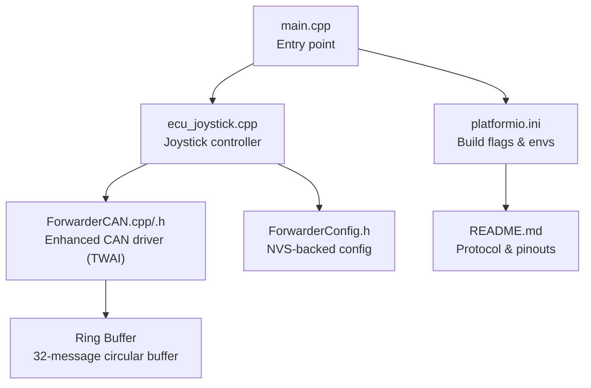
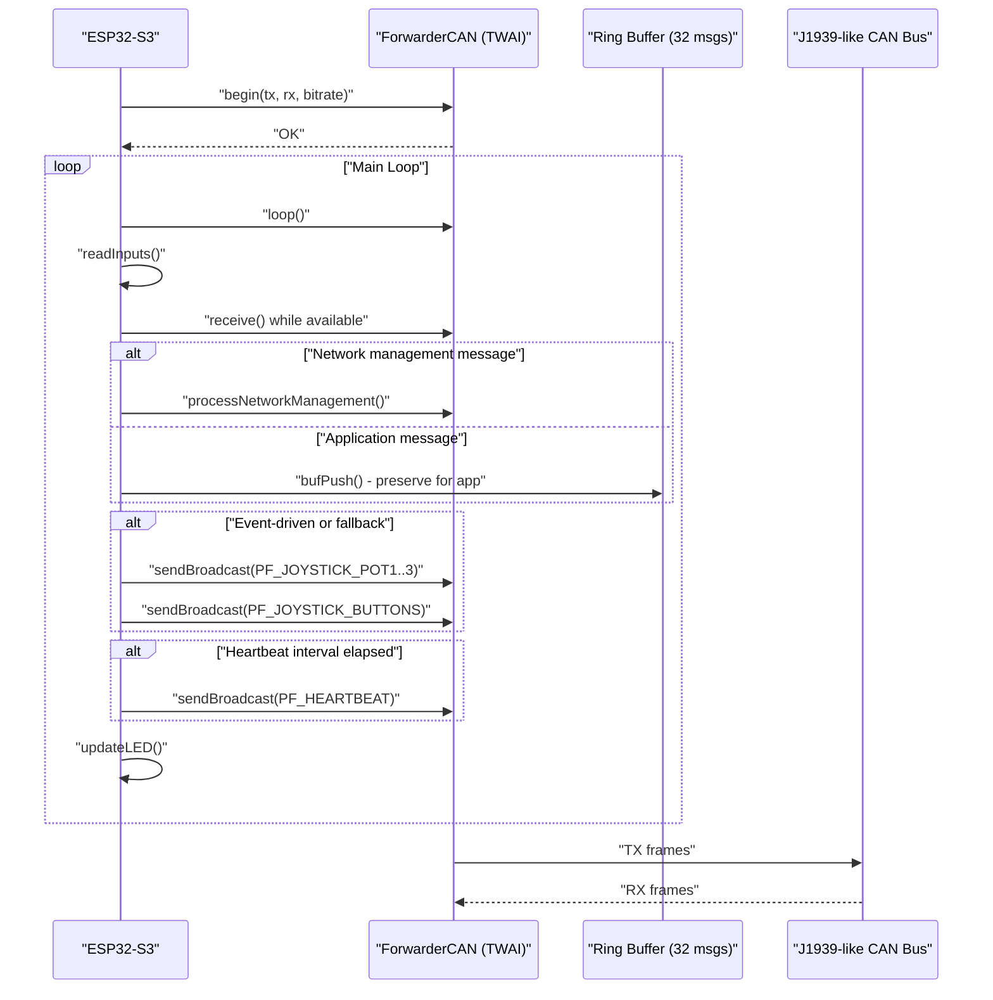
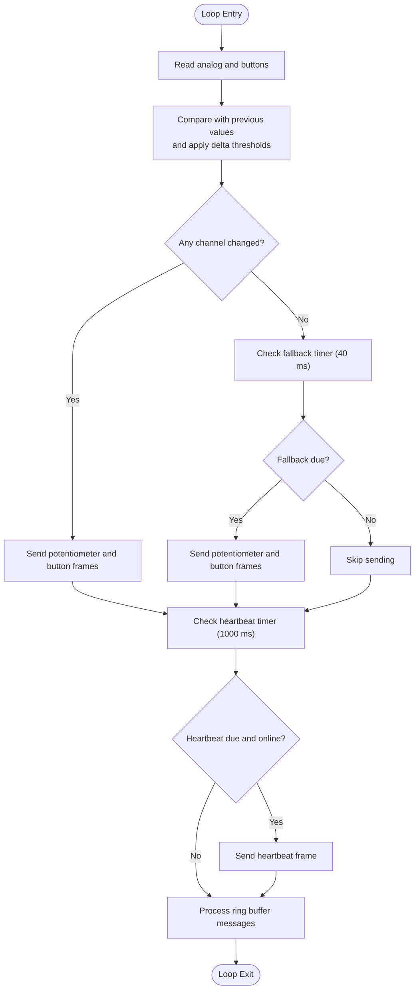
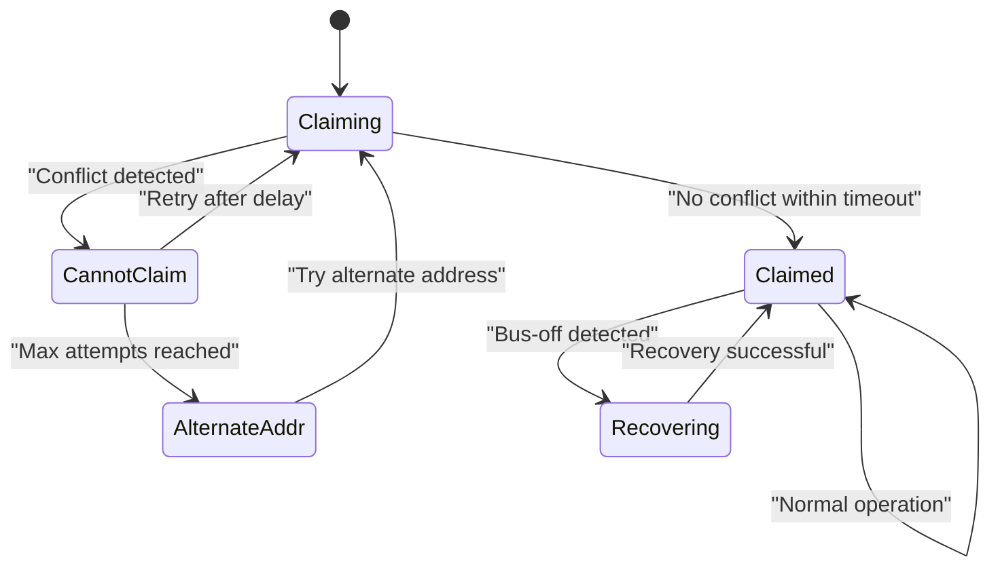
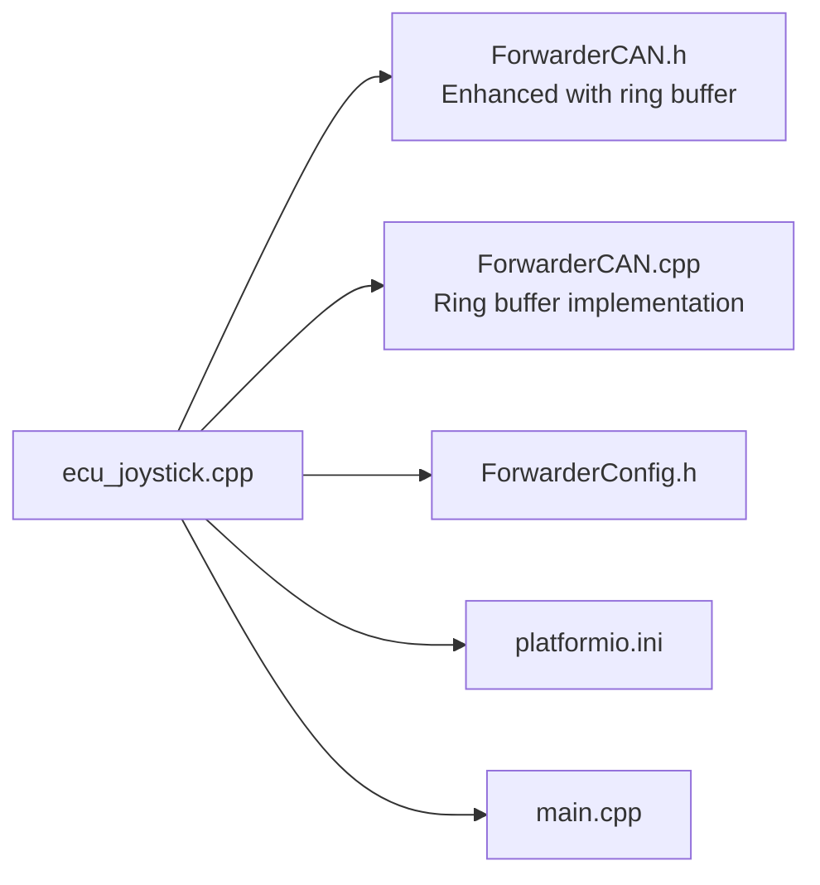

# Real-time Data Transmission

<cite>
**Referenced Files in This Document**
- [main.cpp](file://src/main.cpp)
- [ecu_joystick.cpp](file://src/ecu_joystick.cpp)
- [ecu_joystick.h](file://src/ecu_joystick.h)
- [ForwarderCAN.h](file://lib/ForwarderCAN/ForwarderCAN.h)
- [ForwarderCAN.cpp](file://lib/ForwarderCAN/ForwarderCAN.cpp)
- [ForwarderConfig.h](file://lib/ForwarderConfig/ForwarderConfig.h)
- [platformio.ini](file://platformio.ini)
- [README.md](file://README.md)
</cite>

## Update Summary
**Changes Made**
- Enhanced CAN communication system documentation to reflect comprehensive ring buffer implementation
- Updated data buffering mechanisms section to detail the 32-message circular buffer
- Revised fault tolerance mechanisms to include ring buffer overflow handling
- Added new section on ring buffer management and application-level consumption
- Updated timing analysis to account for ring buffer processing overhead

## Table of Contents
1. [Introduction](#introduction)
2. [Project Structure](#project-structure)
3. [Core Components](#core-components)
4. [Architecture Overview](#architecture-overview)
5. [Detailed Component Analysis](#detailed-component-analysis)
6. [Dependency Analysis](#dependency-analysis)
7. [Performance Considerations](#performance-considerations)
8. [Troubleshooting Guide](#troubleshooting-guide)
9. [Conclusion](#conclusion)
10. [Appendices](#appendices)

## Introduction
This document describes the real-time data transmission system for the Joystick ECU within the Forwarder CAN Controller project. It focuses on timing constraints for joystick data sampling, interrupt-free polling loops, priority scheduling, and context switching considerations. It also documents the enhanced buffering mechanisms with comprehensive ring buffer implementation, memory management for continuous streaming, transmission rate optimization, and fault tolerance mechanisms such as address claiming, heartbeat broadcasting, and bus-off recovery. Practical examples of timing analysis, buffer management, and performance monitoring are included to guide real-time operation.

## Project Structure
The Joystick ECU is implemented as a small embedded application built with PlatformIO for an ESP32-S3. The system comprises:
- An entry point that selects the joystick ECU implementation
- A joystick controller module that reads analog inputs, buttons, and periodically broadcasts joystick data
- A CAN driver that encapsulates TWAI hardware and J1939-like framing with comprehensive ring buffer management
- A configuration manager for persistent settings and optional forced addresses
- Build environments that define pins, addresses, and protocol priorities

**Diagram sources**
- [main.cpp:1-39](file://src/main.cpp#L1-L39)
- [ecu_joystick.cpp:1-281](file://src/ecu_joystick.cpp#L1-L281)
- [ForwarderCAN.h:123-134](file://lib/ForwarderCAN/ForwarderCAN.h#L123-L134)
- [ForwarderCAN.cpp:107-179](file://lib/ForwarderCAN/ForwarderCAN.cpp#L107-L179)
- [ForwarderConfig.h:1-92](file://lib/ForwarderConfig/ForwarderConfig.h#L1-L92)
- [platformio.ini:1-142](file://platformio.ini#L1-L142)
- [README.md:1-131](file://README.md#L1-L131)

**Section sources**
- [main.cpp:1-39](file://src/main.cpp#L1-L39)
- [platformio.ini:1-142](file://platformio.ini#L1-L142)
- [README.md:1-131](file://README.md#L1-L131)

## Core Components
- Joystick controller loop: reads analog inputs, debounces via delta thresholds, and sends periodic broadcasts. It also handles LED updates and periodic heartbeats.
- Enhanced CAN driver: TWAI-based driver with configurable bitrate, TX/RX queue sizes, comprehensive ring buffer management, and J1939-like ID layout. Implements address claiming, bus-off recovery, and application-level message consumption.
- Configuration manager: stores and retrieves a forced address and other runtime settings in NVS.
- Build-time selection: PlatformIO environments select ECU type and pin mappings.

Key timing and constraints:
- Sampling and transmission cadence are driven by millisecond-precision polling in the main loop.
- Minimum change thresholds prevent redundant transmissions for analog channels.
- Periodic fallback transmissions ensure timely updates even when deltas are small.
- Heartbeat broadcasts occur at a fixed interval to maintain network liveness.
- Ring buffer provides 32-message capacity for non-network-management messages.

**Section sources**
- [ecu_joystick.cpp:227-278](file://src/ecu_joystick.cpp#L227-L278)
- [ForwarderCAN.cpp:29-80](file://lib/ForwarderCAN/ForwarderCAN.cpp#L29-L80)
- [ForwarderCAN.h:123-134](file://lib/ForwarderCAN/ForwarderCAN.h#L123-L134)
- [ForwarderConfig.h:70-78](file://lib/ForwarderConfig/ForwarderConfig.h#L70-L78)
- [platformio.ini:89-124](file://platformio.ini#L89-L124)

## Architecture Overview
The Joystick ECU architecture centers on a tight loop that performs:
- CAN maintenance (address claiming, bus state checks, ring buffer management)
- Input acquisition (analog and digital)
- CAN message processing (LED color, identify, address setting, ring buffer population)
- Joystick data transmission (potentiometer values and button states)
- Periodic heartbeat and diagnostics
- LED status updates

**Diagram sources**
- [ecu_joystick.cpp:227-278](file://src/ecu_joystick.cpp#L227-L278)
- [ForwarderCAN.cpp:107-179](file://lib/ForwarderCAN/ForwarderCAN.cpp#L107-L179)
- [ForwarderCAN.h:123-134](file://lib/ForwarderCAN/ForwarderCAN.h#L123-L134)

## Detailed Component Analysis

### Enhanced Joystick Data Sampling and Transmission
The joystick controller implements a deterministic, interrupt-free loop with enhanced CAN integration:
- Inputs are sampled using analogRead and digitalRead.
- Delta thresholds compare current samples against previous values to reduce unnecessary transmissions.
- A periodic fallback timer ensures periodic updates even when changes are below threshold.
- Buttons are packed into a single byte and transmitted as a dedicated frame.
- Heartbeat frames carry online status, uptime, and counters.
- Enhanced ring buffer management allows application-level consumption of non-network-management messages.

Timing characteristics:
- Input sampling and processing occur within each loop iteration.
- Minimum change thresholds for pots: approximately 2 counts out of 10-bit range.
- Transmission intervals:
  - Event-driven: when delta exceeds threshold
  - Fallback: every 40 ms if no event occurred (updated from 100 ms)
  - Heartbeat: every 1000 ms
- Ring buffer processing adds minimal overhead to the main loop.

**Diagram sources**
- [ecu_joystick.cpp:227-278](file://src/ecu_joystick.cpp#L227-L278)

**Section sources**
- [ecu_joystick.cpp:74-87](file://src/ecu_joystick.cpp#L74-L87)
- [ecu_joystick.cpp:238-252](file://src/ecu_joystick.cpp#L238-L252)
- [ecu_joystick.cpp:254-278](file://src/ecu_joystick.cpp#L254-L278)

### Interrupt-Driven Data Collection, Priority Scheduling, and Context Switching
- The joystick loop is a polling-based design without external interrupts for input capture. This simplifies determinism and avoids ISR overhead.
- Priority scheduling is implicit: the loop prioritizes CAN maintenance, input processing, and message dispatch in sequence.
- Context switching considerations:
  - The loop runs in the Arduino framework's main thread.
  - Minimal blocking occurs; most operations are non-blocking or short-duration.
  - TWAI operations use timeouts compatible with the loop cadence.
  - Ring buffer operations are atomic and non-blocking.

Practical implications:
- Avoid long-running operations inside the loop.
- Keep CAN receive processing tight to prevent backlog.
- Use minimal delays and rely on timers for periodic tasks.
- Ring buffer provides bounded memory usage with overflow protection.

**Section sources**
- [ecu_joystick.cpp:227-278](file://src/ecu_joystick.cpp#L227-L278)
- [ForwarderCAN.cpp:107-179](file://lib/ForwarderCAN/ForwarderCAN.cpp#L107-L179)
- [ForwarderCAN.cpp:4-17](file://lib/ForwarderCAN/ForwarderCAN.cpp#L4-L17)

### Enhanced Data Buffering Mechanisms and Memory Management
**Updated** Enhanced with comprehensive ring buffer implementation

The CAN driver now features a sophisticated buffering system:
- TWAI queues:
  - TX queue length: 16 messages
  - RX queue length: 32 messages
- Comprehensive ring buffer:
  - 32-message circular buffer for non-network-management messages
  - Atomic push/pop operations with overflow protection
  - Preserves application-level messages for consumption
- ForwarderCAN enforces payload length ≤ 8 bytes per frame.
- The joystick controller constructs small payloads (1–2 bytes for joystick data, 8 bytes for heartbeat) and relies on the driver's enhanced queueing.

Memory management:
- Static globals for input state and timing.
- Stack usage is modest; no dynamic allocation is used in the joystick loop.
- LED updates use a small pixel buffer.
- Ring buffer uses fixed-size array with head/tail pointers.

Operational notes:
- Exceeding TX queue capacity can cause transmit failures; the driver increments error counters.
- RX backlog is handled by draining the receive queue and ring buffer in each loop iteration.
- Ring buffer overflow drops oldest messages to maintain system stability.

**Section sources**
- [ForwarderCAN.cpp:29-80](file://lib/ForwarderCAN/ForwarderCAN.cpp#L29-L80)
- [ForwarderCAN.h:123-134](file://lib/ForwarderCAN/ForwarderCAN.h#L123-L134)
- [ForwarderCAN.cpp:4-17](file://lib/ForwarderCAN/ForwarderCAN.cpp#L4-L17)
- [ecu_joystick.cpp:133-166](file://src/ecu_joystick.cpp#L133-L166)

### Transmission Rate Optimization and Bandwidth Utilization
- Event-driven transmission reduces bandwidth usage when inputs are stable.
- Fallback transmission ensures responsiveness during slow motion (updated to 40 ms interval).
- Heartbeat frames provide status without heavy payloads.
- CAN bitrate is configured at build time; default is 250 kbps.
- Ring buffer enables efficient message queuing for application-level consumption.

Bandwidth considerations:
- Each joystick frame carries 1–2 bytes payload.
- Heartbeat frame carries 8 bytes.
- Ring buffer can store up to 32 non-network-management messages.
- Typical traffic pattern: sporadic joystick frames plus periodic heartbeat plus queued application messages.

**Section sources**
- [ecu_joystick.cpp:238-252](file://src/ecu_joystick.cpp#L238-L252)
- [ForwarderCAN.h:38-51](file://lib/ForwarderCAN/ForwarderCAN.h#L38-L51)
- [platformio.ini:13](file://platformio.ini#L13)
- [ForwarderCAN.h:123-134](file://lib/ForwarderCAN/ForwarderCAN.h#L123-L134)

### Enhanced Fault Tolerance, Data Integrity, and Error Recovery
**Updated** Enhanced with ring buffer overflow handling

- Address claiming: J1939-style arbitration prevents address conflicts; the driver retries or selects an alternate address based on device name.
- Bus-off recovery: automatic recovery when the TWAI state indicates bus-off.
- Online status: heartbeat frames and counters help detect connectivity issues.
- Error counters: TX and RX counters and error counts are exposed for diagnostics.
- Ring buffer overflow protection: oldest messages are dropped when buffer is full.
- Message processing limits: prevents lockup under heavy bus load.

**Diagram sources**
- [ForwarderCAN.cpp:181-202](file://lib/ForwarderCAN/ForwarderCAN.cpp#L181-L202)
- [ForwarderCAN.h:74-79](file://lib/ForwarderCAN/ForwarderCAN.h#L74-L79)

**Section sources**
- [ForwarderCAN.cpp:181-202](file://lib/ForwarderCAN/ForwarderCAN.cpp#L181-L202)
- [ecu_joystick.cpp:254-278](file://src/ecu_joystick.cpp#L254-L278)
- [ForwarderCAN.cpp:161-179](file://lib/ForwarderCAN/ForwarderCAN.cpp#L161-L179)

### Ring Buffer Management and Application-Level Consumption
**New Section** Comprehensive ring buffer implementation details

The enhanced CAN driver includes a 32-message circular buffer that preserves non-network-management messages for application-level consumption:

**Ring Buffer Architecture:**
- Fixed-size array: 32 CANMessage entries
- Head/tail pointer management with modulo arithmetic
- Atomic push/pop operations for thread safety
- Overflow protection: oldest messages are dropped when buffer is full
- Count tracking to prevent buffer overruns

**Application-Level Processing:**
- Network management messages (address claiming, requests) are processed immediately
- Non-network-management messages are stored in ring buffer for application consumption
- Application can drain messages at its own pace without blocking CAN receive
- Prevents message loss during heavy bus load conditions

**Buffer Operations:**
- Push operation: atomic addition with overflow detection
- Pop operation: atomic removal with empty buffer checking
- Full/empty state management with bounds checking
- Thread-safe operations suitable for real-time processing

**Section sources**
- [ForwarderCAN.h:123-134](file://lib/ForwarderCAN/ForwarderCAN.h#L123-L134)
- [ForwarderCAN.cpp:4-17](file://lib/ForwarderCAN/ForwarderCAN.cpp#L4-L17)
- [ForwarderCAN.cpp:161-179](file://lib/ForwarderCAN/ForwarderCAN.cpp#L161-L179)
- [ecu_joystick.cpp:133-166](file://src/ecu_joystick.cpp#L133-L166)

### Practical Examples

#### Enhanced Timing Analysis Example
**Updated** Incorporating ring buffer overhead

- Sample and send cycle:
  - Read inputs: minimal duration
  - Compare with thresholds: O(1)
  - Conditional send: O(1)
  - Fallback send: O(1)
  - Heartbeat send: O(1)
  - Ring buffer processing: O(n) where n = messages processed
  - LED update and optional OTA loop: minimal overhead
- Worst-case loop time dominated by:
  - TWAI receive loop draining RX queue and ring buffer
  - Message processing with ring buffer operations
  - LED update and optional OTA loop (when enabled)

Validation steps:
- Measure loop execution time using the heartbeat diagnostics and TWAI status prints.
- Monitor ring buffer occupancy to ensure it stays within safe limits.
- Adjust fallback interval or thresholds to meet latency targets.
- Track ring buffer overflow events to prevent message loss.

**Section sources**
- [ecu_joystick.cpp:227-278](file://src/ecu_joystick.cpp#L227-L278)
- [ForwarderCAN.cpp:161-179](file://lib/ForwarderCAN/ForwarderCAN.cpp#L161-L179)
- [README.md:105-111](file://README.md#L105-L111)

#### Enhanced Buffer Management Example
**Updated** Including ring buffer considerations

- TX queue size: 16
- RX queue size: 32
- Ring buffer capacity: 32 messages
- If TX fails, error counters increment; investigate TX queue saturation or bus-off conditions.
- Drain RX queue and ring buffer promptly to avoid overflow.
- Monitor ring buffer occupancy to prevent overflow during heavy message loads.

**Section sources**
- [ForwarderCAN.cpp:29-80](file://lib/ForwarderCAN/ForwarderCAN.cpp#L29-L80)
- [ForwarderCAN.cpp:161-179](file://lib/ForwarderCAN/ForwarderCAN.cpp#L161-L179)
- [ForwarderCAN.h:123-134](file://lib/ForwarderCAN/ForwarderCAN.h#L123-L134)

#### Enhanced Performance Monitoring Example
**Updated** Adding ring buffer metrics

- Use heartbeat and TWAI status prints to monitor:
  - TX/RX counters
  - Error counters
  - Bus state and messages pending TX/RX
  - Ring buffer occupancy and overflow events
- Adjust CAN bitrate and fallback intervals to balance responsiveness and bandwidth.
- Monitor ring buffer statistics to optimize message processing rates.

**Section sources**
- [ecu_joystick.cpp:254-278](file://src/ecu_joystick.cpp#L254-L278)
- [README.md:105-111](file://README.md#L105-L111)

## Dependency Analysis
The joystick controller depends on:
- Enhanced ForwarderCAN for TWAI initialization, address claiming, ring buffer management, and frame transmission/reception
- ForwarderConfig for persistent settings (e.g., forced address)
- PlatformIO build flags for pin assignments, addresses, and protocol priorities

**Diagram sources**
- [ecu_joystick.cpp:1-9](file://src/ecu_joystick.cpp#L1-L9)
- [ForwarderCAN.h:123-134](file://lib/ForwarderCAN/ForwarderCAN.h#L123-L134)
- [ForwarderCAN.cpp:4-17](file://lib/ForwarderCAN/ForwarderCAN.cpp#L4-L17)
- [ForwarderConfig.h:1-92](file://lib/ForwarderConfig/ForwarderConfig.h#L1-L92)
- [platformio.ini:1-142](file://platformio.ini#L1-L142)
- [main.cpp:1-39](file://src/main.cpp#L1-L39)

**Section sources**
- [ecu_joystick.cpp:1-9](file://src/ecu_joystick.cpp#L1-L9)
- [ForwarderCAN.h:123-134](file://lib/ForwarderCAN/ForwarderCAN.h#L123-L134)
- [ForwarderConfig.h:1-92](file://lib/ForwarderConfig/ForwarderConfig.h#L1-L92)
- [platformio.ini:1-142](file://platformio.ini#L1-L142)
- [main.cpp:1-39](file://src/main.cpp#L1-L39)

## Performance Considerations
- Sampling and transmission cadence:
  - Use delta thresholds to minimize CAN traffic.
  - Tune fallback interval (updated to 40 ms) to balance latency and bandwidth.
- CAN bitrate:
  - Default 250 kbps; adjust via build flags if higher throughput is required.
- Queue sizing:
  - TX/RX queue lengths are fixed; ensure loop cadence keeps queues drained.
  - Ring buffer capacity is 32 messages for application-level consumption.
- Determinism:
  - Avoid blocking operations; keep processing within each loop iteration.
  - Ring buffer operations are atomic and non-blocking.
- Diagnostics:
  - Monitor TX/RX counters and error counters to detect congestion or bus issues.
  - Track ring buffer occupancy to prevent overflow during heavy loads.
- Ring buffer optimization:
  - Monitor ring buffer overflow events and adjust processing rates.
  - Use ring buffer for bursty message handling without blocking CAN receive.

## Troubleshooting Guide
Common issues and remedies:
- CAN initialization failure:
  - Symptoms: blinking red LED and loop until reset.
  - Actions: verify wiring, pin assignments, and power supply.
- Address conflict:
  - Symptoms: repeated retries and alternate address selection.
  - Actions: ensure unique preferred addresses per ECU; check device name.
- Bus-off condition:
  - Symptoms: TX failures and increased error counters.
  - Actions: driver automatically recovers; inspect bus wiring and termination.
- Stalled RX queue:
  - Symptoms: missed commands (LED color, identify, set address).
  - Actions: ensure receive loop drains the queue; reduce message rate.
- Ring buffer overflow:
  - Symptoms: message loss during heavy bus load.
  - Actions: monitor ring buffer occupancy; reduce message rate or increase processing speed.
- Heartbeat not observed:
  - Symptoms: offline status in monitoring.
  - Actions: verify address claiming succeeded and heartbeat interval elapsed.

**Section sources**
- [ecu_joystick.cpp:205-215](file://src/ecu_joystick.cpp#L205-L215)
- [ForwarderCAN.cpp:181-202](file://lib/ForwarderCAN/ForwarderCAN.cpp#L181-L202)
- [ecu_joystick.cpp:254-278](file://src/ecu_joystick.cpp#L254-L278)
- [ForwarderCAN.cpp:161-179](file://lib/ForwarderCAN/ForwarderCAN.cpp#L161-L179)

## Conclusion
The Joystick ECU implements a deterministic, interrupt-free loop that samples joystick inputs, applies delta thresholds, and transmits data at controlled intervals. The enhanced CAN driver provides robust address claiming, bus-off recovery, comprehensive ring buffer management, and diagnostic visibility. The 32-message circular buffer preserves non-network-management messages for application-level consumption, preventing message loss during heavy bus loads. By tuning fallback intervals, leveraging delta thresholds, monitoring ring buffer occupancy, and optimizing message processing rates, the system achieves predictable real-time behavior with efficient bandwidth utilization and improved reliability.

## Appendices

### Protocol and Pinout Reference
- J1939-like ID layout and PF definitions for joystick frames
- Default CAN bitrate and priority
- Pin assignments for joystick units
- Ring buffer configuration and capacity

**Section sources**
- [README.md:22-62](file://README.md#L22-L62)
- [platformio.ini:13](file://platformio.ini#L13)
- [ForwarderCAN.h:38-51](file://lib/ForwarderCAN/ForwarderCAN.h#L38-L51)
- [ForwarderCAN.h:123-134](file://lib/ForwarderCAN/ForwarderCAN.h#L123-L134)