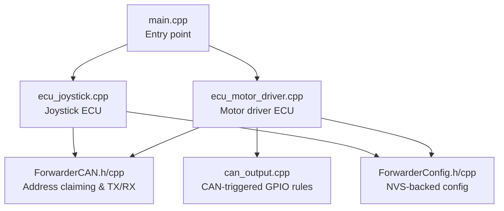
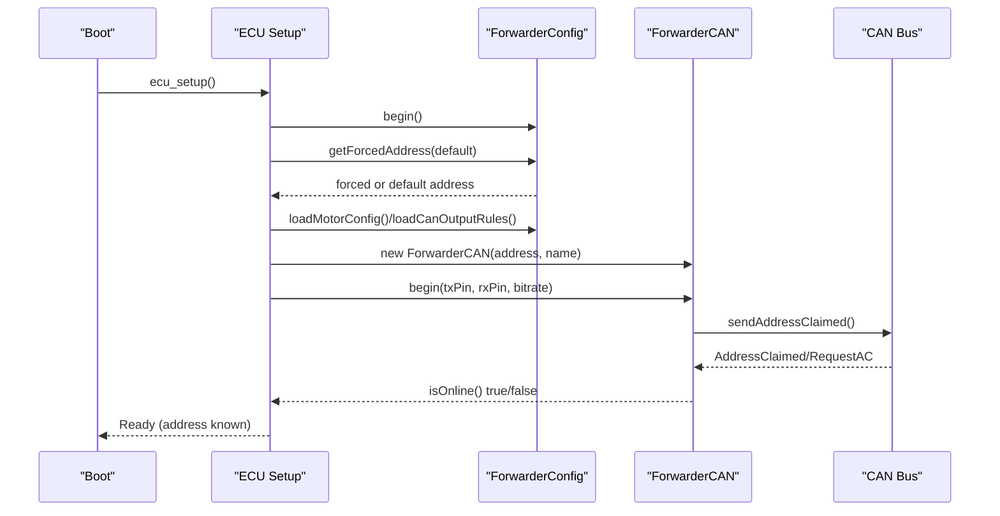
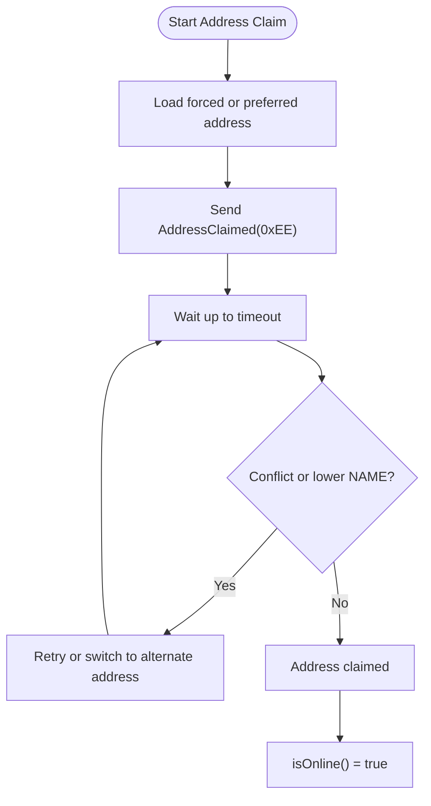
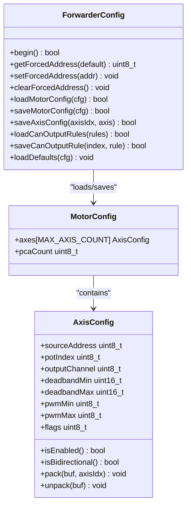
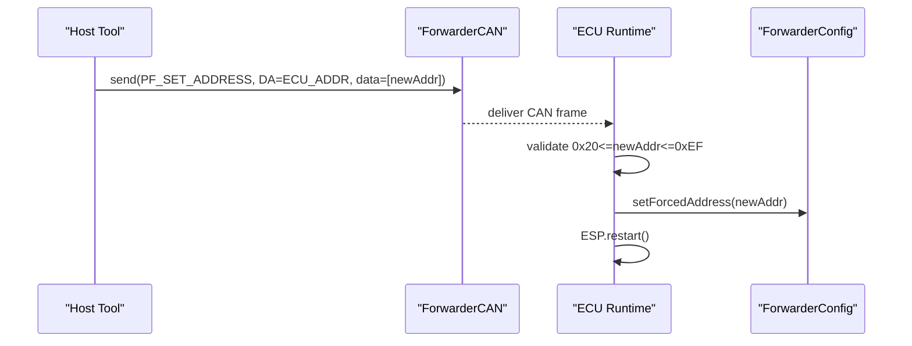
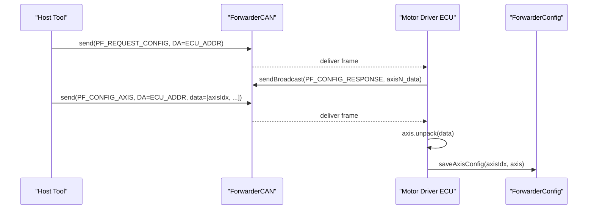
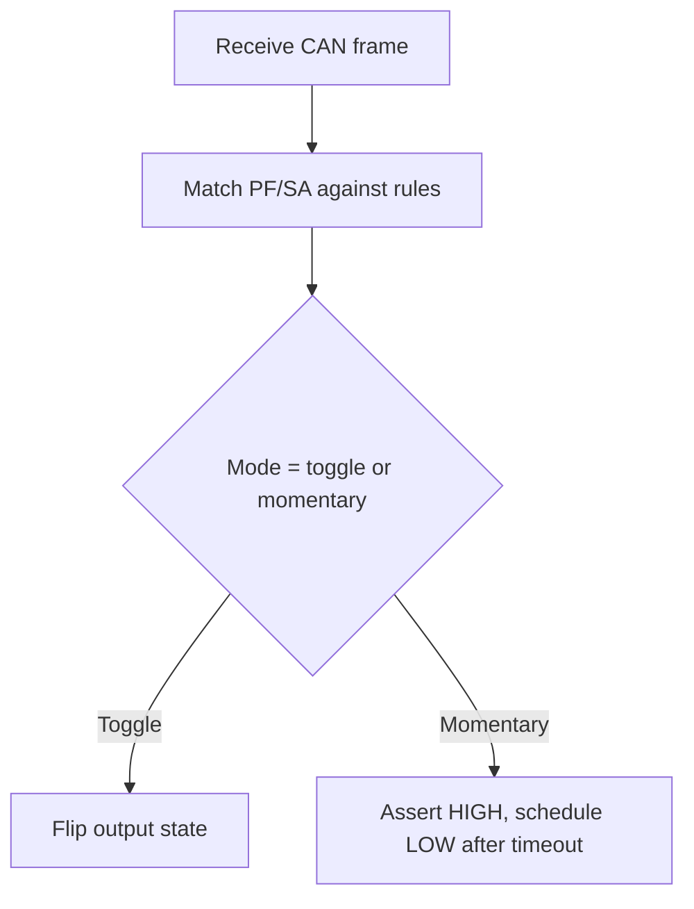
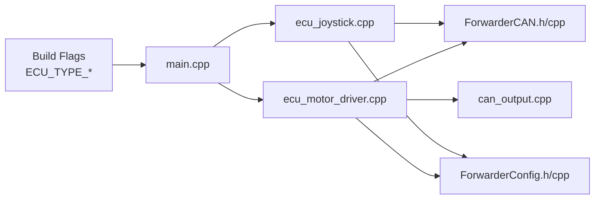

# Address Claiming and Configuration

<cite>
**Referenced Files in This Document**
- [main.cpp](file://src/main.cpp)
- [platformio.ini](file://platformio.ini)
- [README.md](file://README.md)
- [ForwarderCAN.h](file://lib/ForwarderCAN/ForwarderCAN.h)
- [ForwarderCAN.cpp](file://lib/ForwarderCAN/ForwarderCAN.cpp)
- [ForwarderConfig.h](file://lib/ForwarderConfig/ForwarderConfig.h)
- [ForwarderConfig.cpp](file://lib/ForwarderConfig/ForwarderConfig.cpp)
- [ecu_motor_driver.cpp](file://src/ecu_motor_driver.cpp)
- [ecu_joystick.cpp](file://src/ecu_joystick.cpp)
- [can_output.cpp](file://src/can_output.cpp)
</cite>

## Table of Contents
1. [Introduction](#introduction)
2. [Project Structure](#project-structure)
3. [Core Components](#core-components)
4. [Architecture Overview](#architecture-overview)
5. [Detailed Component Analysis](#detailed-component-analysis)
6. [Dependency Analysis](#dependency-analysis)
7. [Performance Considerations](#performance-considerations)
8. [Troubleshooting Guide](#troubleshooting-guide)
9. [Conclusion](#conclusion)
10. [Appendices](#appendices)

## Introduction
This document explains the address claiming process and configuration management for the Forwarder CAN Controller. It covers how devices automatically claim a J1939-style address, how persistent configuration is loaded and saved, and how CAN commands are processed to set addresses and modify configurations. It also documents the validation of addresses within the 0x20–0xEF range, the relationship between compile-time preferred addresses and runtime behavior, and the configuration persistence system backed by NVS.

## Project Structure
The system comprises:
- A shared CAN/J1939 library implementing address claiming and message framing
- A configuration manager for persistent storage of motor mapping and CAN output rules
- Two ECU implementations: a motor driver and a joystick controller
- A CAN output rule engine that reacts to matching CAN frames

**Diagram sources**
- [main.cpp:19-31](file://src/main.cpp#L19-L31)
- [ecu_motor_driver.cpp:290-325](file://src/ecu_motor_driver.cpp#L290-L325)
- [ecu_joystick.cpp:163-201](file://src/ecu_joystick.cpp#L163-L201)
- [ForwarderCAN.h:66-122](file://lib/ForwarderCAN/ForwarderCAN.h#L66-L122)
- [ForwarderConfig.h:64-91](file://lib/ForwarderConfig/ForwarderConfig.h#L64-L91)
- [can_output.cpp:7-65](file://src/can_output.cpp#L7-L65)

**Section sources**
- [main.cpp:11-17](file://src/main.cpp#L11-L17)
- [README.md:112-126](file://README.md#L112-L126)

## Core Components
- Address claiming and CAN transport: Implemented in ForwarderCAN with J1939-like 29-bit IDs and network management messages for claiming and arbitration.
- Persistent configuration: Managed by ForwarderConfig using NVS keys for motor mapping and CAN output rules.
- ECU integration: Both motor driver and joystick ECUs initialize configuration, load stored settings, and integrate address claiming into their setup sequences.
- CAN output rules: A small engine that toggles or momentarilly asserts GPIO pins in response to matched CAN frames.

**Section sources**
- [ForwarderCAN.h:22-51](file://lib/ForwarderCAN/ForwarderCAN.h#L22-L51)
- [ForwarderCAN.h:66-122](file://lib/ForwarderCAN/ForwarderCAN.h#L66-L122)
- [ForwarderConfig.h:64-91](file://lib/ForwarderConfig/ForwarderConfig.h#L64-L91)
- [ecu_motor_driver.cpp:290-325](file://src/ecu_motor_driver.cpp#L290-L325)
- [ecu_joystick.cpp:163-201](file://src/ecu_joystick.cpp#L163-L201)
- [can_output.cpp:7-65](file://src/can_output.cpp#L7-L65)

## Architecture Overview
The address claiming and configuration flow spans initialization, claiming, and runtime processing.

**Diagram sources**
- [ecu_motor_driver.cpp:290-325](file://src/ecu_motor_driver.cpp#L290-L325)
- [ecu_joystick.cpp:163-201](file://src/ecu_joystick.cpp#L163-L201)
- [ForwarderConfig.cpp:56-74](file://lib/ForwarderConfig/ForwarderConfig.cpp#L56-L74)
- [ForwarderCAN.cpp:13-56](file://lib/ForwarderCAN/ForwarderCAN.cpp#L13-L56)
- [ForwarderCAN.cpp:67-81](file://lib/ForwarderCAN/ForwarderCAN.cpp#L67-L81)
- [ForwarderCAN.cpp:146-154](file://lib/ForwarderCAN/ForwarderCAN.cpp#L146-L154)

## Detailed Component Analysis

### Address Claiming and Validation
- Preferred address constants are defined per ECU via build flags.
- During setup, the ECU loads a forced address from NVS (if present) or falls back to the compile-time preferred address.
- Address claiming uses a J1939-like frame PF 0xEE broadcast with the device’s 8-byte NAME field. Arbitration resolves conflicts; if a lower NAME wins, the device retries or switches to an alternate address derived from the NAME.
- Address validation for manual assignment enforces the 0x20–0xEF range.

**Diagram sources**
- [ecu_motor_driver.cpp:298-305](file://src/ecu_motor_driver.cpp#L298-L305)
- [ecu_joystick.cpp:175-178](file://src/ecu_joystick.cpp#L175-L178)
- [ForwarderCAN.cpp:58-65](file://lib/ForwarderCAN/ForwarderCAN.cpp#L58-L65)
- [ForwarderCAN.cpp:156-177](file://lib/ForwarderCAN/ForwarderCAN.cpp#L156-L177)

**Section sources**
- [platformio.ini:21](file://platformio.ini#L21)
- [platformio.ini:36](file://platformio.ini#L36)
- [ecu_motor_driver.cpp:298-305](file://src/ecu_motor_driver.cpp#L298-L305)
- [ecu_joystick.cpp:175-178](file://src/ecu_joystick.cpp#L175-L178)
- [ForwarderCAN.h:35-51](file://lib/ForwarderCAN/ForwarderCAN.h#L35-L51)
- [ForwarderCAN.cpp:67-81](file://lib/ForwarderCAN/ForwarderCAN.cpp#L67-L81)
- [ForwarderCAN.cpp:156-177](file://lib/ForwarderCAN/ForwarderCAN.cpp#L156-L177)

### Configuration Loading and Persistence
- ForwarderConfig manages NVS-backed storage for motor mapping and CAN output rules.
- On boot, the ECU calls begin(), then retrieves a forced address and loads motor and CAN output rule configurations.
- MotorConfig stores PCA count and per-axis mapping; each axis is serialized into 8 bytes for transport and persistence.
- CAN output rules are similarly serialized and persisted.

**Diagram sources**
- [ForwarderConfig.h:64-91](file://lib/ForwarderConfig/ForwarderConfig.h#L64-L91)
- [ForwarderConfig.h:59-62](file://lib/ForwarderConfig/ForwarderConfig.h#L59-L62)
- [ForwarderConfig.h:41-57](file://lib/ForwarderConfig/ForwarderConfig.h#L41-L57)
- [ForwarderConfig.cpp:76-104](file://lib/ForwarderConfig/ForwarderConfig.cpp#L76-L104)
- [ForwarderConfig.cpp:106-127](file://lib/ForwarderConfig/ForwarderConfig.cpp#L106-L127)
- [ForwarderConfig.cpp:129-159](file://lib/ForwarderConfig/ForwarderConfig.cpp#L129-L159)
- [ForwarderConfig.cpp:161-169](file://lib/ForwarderConfig/ForwarderConfig.cpp#L161-L169)
- [ForwarderConfig.cpp:171-183](file://lib/ForwarderConfig/ForwarderConfig.cpp#L171-L183)

**Section sources**
- [ForwarderConfig.cpp:56-74](file://lib/ForwarderConfig/ForwarderConfig.cpp#L56-L74)
- [ForwarderConfig.cpp:76-104](file://lib/ForwarderConfig/ForwarderConfig.cpp#L76-L104)
- [ForwarderConfig.cpp:106-127](file://lib/ForwarderConfig/ForwarderConfig.cpp#L106-L127)
- [ForwarderConfig.cpp:129-159](file://lib/ForwarderConfig/ForwarderConfig.cpp#L129-L159)
- [ForwarderConfig.cpp:161-169](file://lib/ForwarderConfig/ForwarderConfig.cpp#L161-L169)
- [ForwarderConfig.cpp:171-183](file://lib/ForwarderConfig/ForwarderConfig.cpp#L171-L183)

### Manual Address Assignment via CAN
- Both ECU types accept PF_SET_ADDRESS directed to their current address.
- The payload is a single byte representing the new address.
- Only addresses within the 0x20–0xEF range are accepted.
- On acceptance, the new address is stored persistently and the device reboots to apply the change immediately.

**Diagram sources**
- [ecu_motor_driver.cpp:234-244](file://src/ecu_motor_driver.cpp#L234-L244)
- [ecu_joystick.cpp:136-146](file://src/ecu_joystick.cpp#L136-L146)
- [ForwarderConfig.cpp:66-74](file://lib/ForwarderConfig/ForwarderConfig.cpp#L66-L74)

**Section sources**
- [ecu_motor_driver.cpp:234-244](file://src/ecu_motor_driver.cpp#L234-L244)
- [ecu_joystick.cpp:136-146](file://src/ecu_joystick.cpp#L136-L146)
- [ForwarderConfig.cpp:66-74](file://lib/ForwarderConfig/ForwarderConfig.cpp#L66-L74)

### Configuration Modification via CAN
- PF_CONFIG_AXIS allows updating a single axis mapping via CAN.
- PF_REQUEST_CONFIG requests a broadcast of all axis configurations for inspection or backup.
- The motor driver saves updates to NVS immediately upon receiving PF_CONFIG_AXIS.

**Diagram sources**
- [ecu_motor_driver.cpp:257-267](file://src/ecu_motor_driver.cpp#L257-L267)
- [ecu_motor_driver.cpp:246-256](file://src/ecu_motor_driver.cpp#L246-L256)
- [ForwarderConfig.cpp:119-127](file://lib/ForwarderConfig/ForwarderConfig.cpp#L119-L127)

**Section sources**
- [ecu_motor_driver.cpp:246-267](file://src/ecu_motor_driver.cpp#L246-L267)
- [ForwarderConfig.cpp:119-127](file://lib/ForwarderConfig/ForwarderConfig.cpp#L119-L127)

### CAN Output Rules Engine
- Rules are loaded from NVS and applied to incoming frames.
- Matching is performed on PF and optional SA.
- Modes: toggle (invert state) or momentary (assert HIGH for a configured timeout).

**Diagram sources**
- [can_output.cpp:29-49](file://src/can_output.cpp#L29-L49)
- [can_output.cpp:51-61](file://src/can_output.cpp#L51-L61)

**Section sources**
- [can_output.cpp:7-65](file://src/can_output.cpp#L7-L65)

## Dependency Analysis
- ECU selection is compile-time via build flags; main.cpp includes the appropriate ECU header.
- Both ECUs depend on ForwarderCAN for addressing and messaging, and on ForwarderConfig for persistent settings.
- The motor driver additionally integrates CAN output rules.

**Diagram sources**
- [main.cpp:11-17](file://src/main.cpp#L11-L17)
- [platformio.ini:17-30](file://platformio.ini#L17-L30)
- [platformio.ini:31-64](file://platformio.ini#L31-L64)
- [ecu_motor_driver.cpp:8-12](file://src/ecu_motor_driver.cpp#L8-L12)
- [ecu_joystick.cpp:6-9](file://src/ecu_joystick.cpp#L6-L9)

**Section sources**
- [main.cpp:11-17](file://src/main.cpp#L11-L17)
- [platformio.ini:17-64](file://platformio.ini#L17-L64)

## Performance Considerations
- Address claiming uses short timeouts and bounded retry attempts to minimize boot latency.
- CAN TX/RX queues are sized to handle typical traffic; bus-off recovery is automatic.
- Configuration load/save operates on fixed-size buffers and minimal string operations.
- CAN output rule evaluation is O(Nrules) per frame; keep Nrules small for responsiveness.

## Troubleshooting Guide
Common issues and resolutions:
- Address conflict during claiming
  - Symptom: Repeated retries or oscillating address.
  - Cause: Another device claims the same preferred address.
  - Resolution: Change ECU_NAME bytes to alter arbitration outcome, or set a different preferred address via build flags. Alternatively, use PF_SET_ADDRESS to force a new address and reboot.
  - Evidence: Address claiming state machine and NAME-based arbitration.
  - Section sources
    - [ForwarderCAN.cpp:127-144](file://lib/ForwarderCAN/ForwarderCAN.cpp#L127-L144)
    - [ForwarderCAN.cpp:156-177](file://lib/ForwarderCAN/ForwarderCAN.cpp#L156-L177)

- Invalid address assignment
  - Symptom: PF_SET_ADDRESS ignored.
  - Cause: Address outside 0x20–0xEF range.
  - Resolution: Use a valid address within the allowed range.
  - Section sources
    - [ecu_motor_driver.cpp:237](file://src/ecu_motor_driver.cpp#L237)
    - [ecu_joystick.cpp:139](file://src/ecu_joystick.cpp#L139)

- Configuration not applying after change
  - Symptom: Settings revert or not take effect.
  - Cause: NVS corruption or missing begin().
  - Resolution: Ensure ForwarderConfig.begin() is called early; verify NVS keys exist; use PF_REQUEST_CONFIG to confirm stored values; if needed, clear forced address to fall back to defaults.
  - Section sources
    - [ForwarderConfig.cpp:56](file://lib/ForwarderConfig/ForwarderConfig.cpp#L56)
    - [ForwarderConfig.cpp:71-74](file://lib/ForwarderConfig/ForwarderConfig.cpp#L71-L74)
    - [ecu_motor_driver.cpp:297-300](file://src/ecu_motor_driver.cpp#L297-L300)

- CAN bus errors or bus-off
  - Symptom: High error counts, frames not transmitted.
  - Cause: Bus fault or external stoppage of TWAI.
  - Resolution: Device auto-restarts TWAI or reinitializes; monitor TWAI state and logs.
  - Section sources
    - [ForwarderCAN.cpp:83-124](file://lib/ForwarderCAN/ForwarderCAN.cpp#L83-L124)
    - [ecu_joystick.cpp:247-259](file://src/ecu_joystick.cpp#L247-L259)

## Conclusion
The Forwarder CAN Controller implements robust address claiming using J1939-like semantics, with persistent configuration managed through NVS. Devices can be manually addressed via CAN with strict validation, and runtime settings can be modified and backed up using dedicated CAN commands. The system balances reliability with simplicity, ensuring predictable operation across motor driver and joystick ECUs.

## Appendices

### Practical Examples

- Assign a new address
  - Send a PF_SET_ADDRESS frame to the target device’s current address with payload 0xXX where 0x20 ≤ XX ≤ 0xEF. The device persists the address and reboots automatically.
  - Section sources
    - [ecu_motor_driver.cpp:234-244](file://src/ecu_motor_driver.cpp#L234-L244)
    - [ecu_joystick.cpp:136-146](file://src/ecu_joystick.cpp#L136-L146)

- Modify axis mapping via CAN
  - Send PF_CONFIG_AXIS with data containing axis index and packed axis fields. Confirm with PF_REQUEST_CONFIG to retrieve current settings.
  - Section sources
    - [ecu_motor_driver.cpp:246-267](file://src/ecu_motor_driver.cpp#L246-L267)
    - [ForwarderConfig.cpp:119-127](file://lib/ForwarderConfig/ForwarderConfig.cpp#L119-L127)

- Force a fallback address on boot
  - Clear the stored forced address to revert to the compile-time preferred address.
  - Section sources
    - [ForwarderConfig.cpp:71-74](file://lib/ForwarderConfig/ForwarderConfig.cpp#L71-L74)

- Relationship between build flags and runtime behavior
  - Preferred address and ECU_NAME are set per environment; the device loads these at boot and uses them for claiming and identification.
  - Section sources
    - [platformio.ini:21](file://platformio.ini#L21)
    - [platformio.ini:36](file://platformio.ini#L36)
    - [ecu_motor_driver.cpp:63-67](file://src/ecu_motor_driver.cpp#L63-L67)
    - [ecu_joystick.cpp:60-64](file://src/ecu_joystick.cpp#L60-L64)