# Auto-Configuration System

<cite>
**Referenced Files in This Document**
- [README.md](file://README.md)
- [platformio.ini](file://platformio.ini)
- [main.cpp](file://src/main.cpp)
- [ecu_motor_driver.cpp](file://src/ecu_motor_driver.cpp)
- [ecu_joystick.cpp](file://src/ecu_joystick.cpp)
- [ForwarderConfig.h](file://lib/ForwarderConfig/ForwarderConfig.h)
- [ForwarderConfig.cpp](file://lib/ForwarderConfig/ForwarderConfig.cpp)
- [ota_webserver.cpp](file://src/ota_webserver.cpp)
- [web_state.h](file://src/web_state.h)
- [web_state.cpp](file://src/web_state.cpp)
</cite>

## Table of Contents
1. [Introduction](#introduction)
2. [System Architecture](#system-architecture)
3. [Auto-Configuration Components](#auto-configuration-components)
4. [Configuration Data Model](#configuration-data-model)
5. [Build System Integration](#build-system-integration)
6. [Runtime Configuration Management](#runtime-configuration-management)
7. [Web-Based Configuration Interface](#web-based-configuration-interface)
8. [Safety and Defaults](#safety-and-defaults)
9. [Implementation Patterns](#implementation-patterns)
10. [Troubleshooting Guide](#troubleshooting-guide)
11. [Conclusion](#conclusion)

## Introduction

The Auto-Configuration System is a comprehensive framework designed for the Forwarder CAN Controller project, enabling automatic configuration and management of ECU (Electronic Control Unit) devices in an agricultural vehicle hydraulic system. This system provides intelligent auto-configuration capabilities, persistent storage management, and remote configuration through a web-based interface.

The system manages three distinct ECUs operating on a shared 250 kbps CAN bus: a motor driver ECU controlling 8 solenoids via PCA9685 PWM drivers, and two joystick ECUs that read analog potentiometers and buttons for operator input. The auto-configuration system ensures seamless operation by automatically detecting and configuring hardware components, managing persistent settings, and providing runtime reconfiguration capabilities.

## System Architecture

The auto-configuration system follows a modular architecture with clear separation of concerns between hardware abstraction, configuration management, and user interface components.

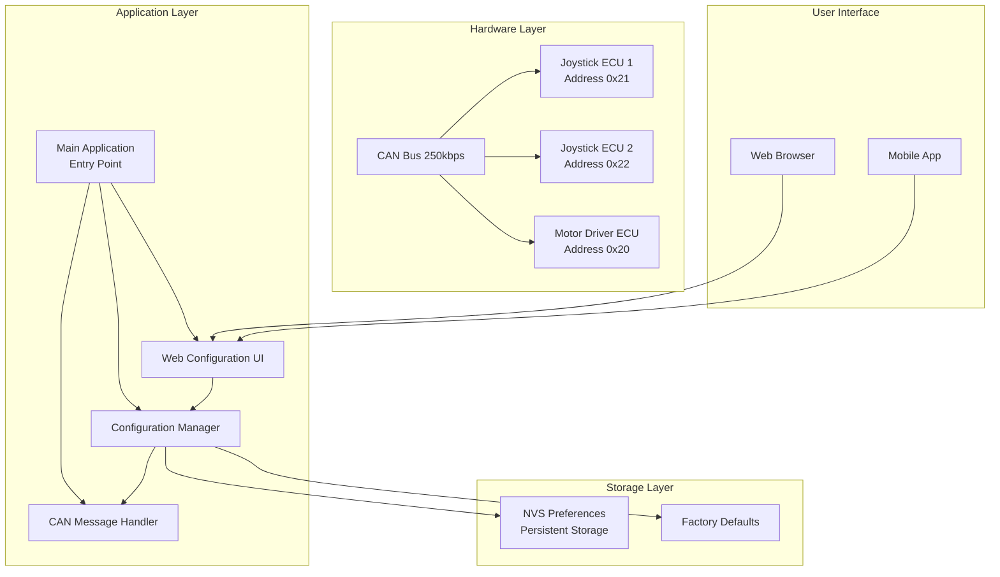

**Diagram sources**
- [platformio.ini:17-142](file://platformio.ini#L17-L142)
- [main.cpp:11-39](file://src/main.cpp#L11-L39)

## Auto-Configuration Components

The auto-configuration system consists of several interconnected components that work together to provide seamless device configuration and management.

### Core Configuration Classes

The system centers around several key configuration classes that manage different aspects of device behavior:

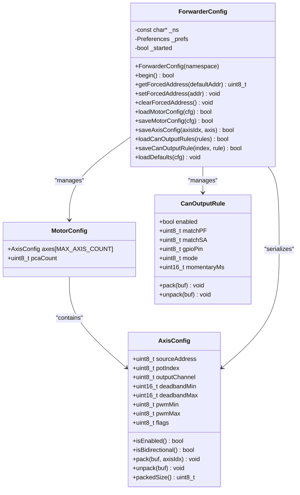

**Diagram sources**
- [ForwarderConfig.h:64-92](file://lib/ForwarderConfig/ForwarderConfig.h#L64-L92)
- [ForwarderConfig.cpp:41-57](file://lib/ForwarderConfig/ForwarderConfig.cpp#L41-L57)

### ECU-Specific Configuration Management

Each ECU type implements its own configuration management with auto-configuration capabilities:

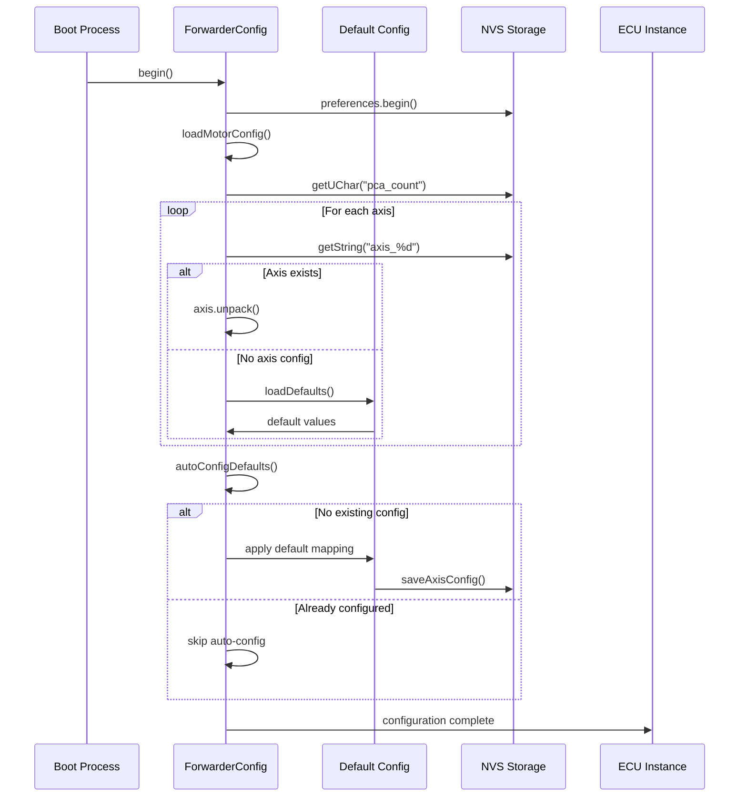

**Diagram sources**
- [ecu_motor_driver.cpp:361-418](file://src/ecu_motor_driver.cpp#L361-L418)
- [ForwarderConfig.cpp:76-127](file://lib/ForwarderConfig/ForwarderConfig.cpp#L76-L127)

**Section sources**
- [ForwarderConfig.h:1-92](file://lib/ForwarderConfig/ForwarderConfig.h#L1-L92)
- [ForwarderConfig.cpp:1-184](file://lib/ForwarderConfig/ForwarderConfig.cpp#L1-L184)
- [ecu_motor_driver.cpp:330-359](file://src/ecu_motor_driver.cpp#L330-L359)

## Configuration Data Model

The auto-configuration system uses a structured data model to represent and manage configuration settings across different ECU types.

### Axis Configuration Structure

The axis configuration represents the mapping between joystick inputs and solenoid outputs:

| Field | Type | Range | Description |
|-------|------|-------|-------------|
| sourceAddress | uint8_t | 0x21-0x22 | Joystick source address (0x21 or 0x22) |
| potIndex | uint8_t | 0-2 | Potentiometer index (0=POT1, 1=POT2, 2=POT3) |
| outputChannel | uint8_t | 0-15 | PWM output channel (0-7 or 8-15) |
| deadbandMin | uint16_t | 0-1023 | Deadband minimum threshold |
| deadbandMax | uint16_t | 0-1023 | Deadband maximum threshold |
| pwmMin | uint8_t | 0-255 | Minimum PWM value (scaled to 12-bit) |
| pwmMax | uint8_t | 0-255 | Maximum PWM value (scaled to 12-bit) |
| flags | uint8_t | Bit flags | Configuration flags (enabled, bidirectional) |

### CAN Output Rule Structure

CAN-triggered GPIO output rules define how incoming CAN messages control external GPIO pins:

| Field | Type | Range | Description |
|-------|------|-------|-------------|
| enabled | bool | true/false | Rule activation status |
| matchPF | uint8_t | 0-255 | PDU Format pattern to match |
| matchSA | uint8_t | 0-255 | Source Address pattern to match (0=any) |
| gpioPin | uint8_t | 0-39 | Target GPIO pin number |
| mode | uint8_t | 0-1 | Operation mode (0=toggle, 1=momentary) |
| momentaryMs | uint16_t | 50-10000 | Momentary duration in milliseconds |

### Configuration Serialization

The system uses compact 8-byte serialization for efficient CAN transmission:

```mermaid
flowchart TD
START([Configuration Data]) --> PACK[Pack to 8 Bytes]
PACK --> AXIS_PACK[AxisConfig.pack()]
AXIS_PACK --> BYTE0["Byte 0: axis_idx (0-15)"]
AXIS_PACK --> BYTE1["Byte 1: source_address (0x21,0x22)"]
AXIS_PACK --> BYTE2["Byte 2: (pot_idx<<6)|(output_ch<<2)|flags"]
AXIS_PACK --> BYTE3["Byte 3: deadband_min/4 (0-255)"]
AXIS_PACK --> BYTE4["Byte 4: deadband_max/4 (0-255)"]
AXIS_PACK --> BYTE5["Byte 5: pwm_min (0-255)"]
AXIS_PACK --> BYTE6["Byte 6: pwm_max (0-255)"]
AXIS_PACK --> BYTE7["Byte 7: reserved (0)"]
PACK --> RULE_PACK[CanOutputRule.pack()]
RULE_PACK --> R_BYTE0["Byte 0: enabled flag"]
RULE_PACK --> R_BYTE1["Byte 1: matchPF"]
RULE_PACK --> R_BYTE2["Byte 2: matchSA"]
RULE_PACK --> R_BYTE3["Byte 3: gpioPin"]
RULE_PACK --> R_BYTE4["Byte 4: mode"]
RULE_PACK --> R_BYTE5["Byte 5: momentaryMs LSB"]
RULE_PACK --> R_BYTE6["Byte 6: momentaryMs MSB"]
RULE_PACK --> R_BYTE7["Byte 7: reserved (0)"]
BYTE0 --> UNPACK[Unpack from 8 Bytes]
BYTE1 --> UNPACK
BYTE2 --> UNPACK
BYTE3 --> UNPACK
BYTE4 --> UNPACK
BYTE5 --> UNPACK
BYTE6 --> UNPACK
BYTE7 --> UNPACK
UNPACK --> AXIS_UNPACK[AxisConfig.unpack()]
UNPACK --> RULE_UNPACK[CanOutputRule.unpack()]
```

**Diagram sources**
- [ForwarderConfig.cpp:6-49](file://lib/ForwarderConfig/ForwarderConfig.cpp#L6-L49)

**Section sources**
- [ForwarderConfig.h:28-62](file://lib/ForwarderConfig/ForwarderConfig.h#L28-L62)
- [ForwarderConfig.cpp:6-49](file://lib/ForwarderConfig/ForwarderConfig.cpp#L6-L49)

## Build System Integration

The auto-configuration system integrates seamlessly with PlatformIO's build system through environment-specific configurations that define hardware parameters and capabilities.

### Environment Configuration Structure

Each build environment defines specific parameters for different hardware configurations:

| Parameter | Motor Driver | Joystick 1 | Joystick 2 |
|-----------|--------------|------------|------------|
| Board | esp32s3box | esp32dev | esp32dev |
| Preferred Address | 0x20 | 0x21 | 0x22 |
| PCA9685 Pins | SDA=8, SCL=18 | N/A | N/A |
| CAN Pins | TX=16, RX=17 | TX=27, RX=26 | TX=27, RX=26 |
| LED Pin | 39 | 4 | 4 |
| Pot Pins | N/A | 32,33,34 | 32,33,34 |
| Button Pins | N/A | 12,5 | 12,5 |

### Build Flags and Hardware Definitions

The system uses compile-time flags to configure hardware-specific parameters:

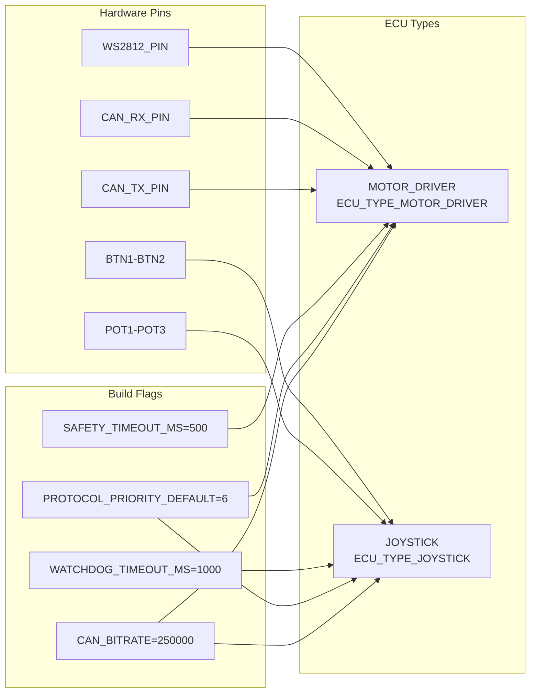

**Diagram sources**
- [platformio.ini:12-16](file://platformio.ini#L12-L16)
- [platformio.ini:18-142](file://platformio.ini#L18-L142)

**Section sources**
- [platformio.ini:1-142](file://platformio.ini#L1-L142)
- [main.cpp:11-17](file://src/main.cpp#L11-L17)

## Runtime Configuration Management

The auto-configuration system operates during both initialization and runtime to ensure optimal device operation and user flexibility.

### Initialization Sequence

The configuration management follows a structured initialization process:

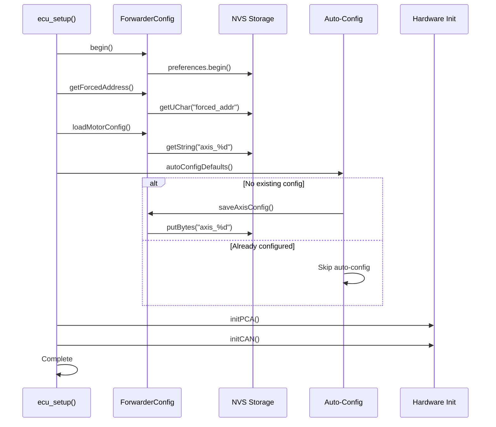

**Diagram sources**
- [ecu_motor_driver.cpp:361-418](file://src/ecu_motor_driver.cpp#L361-L418)
- [ForwarderConfig.cpp:76-127](file://lib/ForwarderConfig/ForwarderConfig.cpp#L76-L127)

### Runtime Configuration Updates

The system supports dynamic configuration updates through CAN messages and web interface:

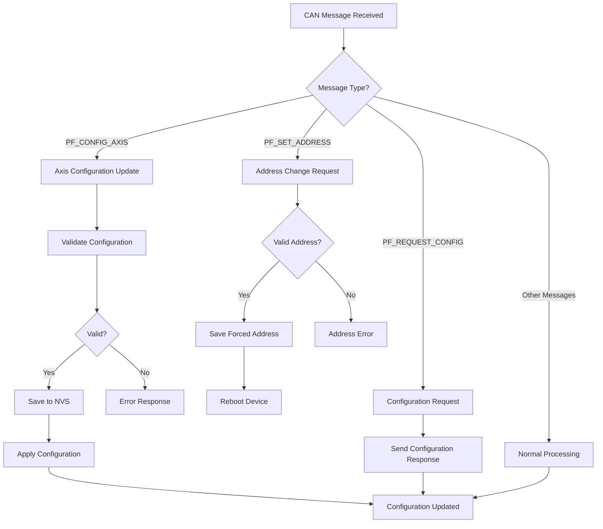

**Diagram sources**
- [ecu_motor_driver.cpp:217-315](file://src/ecu_motor_driver.cpp#L217-L315)
- [ecu_joystick.cpp:133-166](file://src/ecu_joystick.cpp#L133-L166)

**Section sources**
- [ecu_motor_driver.cpp:361-479](file://src/ecu_motor_driver.cpp#L361-L479)
- [ecu_joystick.cpp:181-281](file://src/ecu_joystick.cpp#L181-L281)

## Web-Based Configuration Interface

The auto-configuration system includes a comprehensive web interface that allows remote configuration and monitoring of ECU devices through a browser-based dashboard.

### Web Interface Architecture

The web interface consists of multiple interconnected components working together to provide a seamless configuration experience:

```mermaid
graph TB
subgraph "Web Interface Components"
DASHBOARD[Dashboard Tab]
MODULES[Modules Tab]
MAPPING[Motor Mapping Tab]
CANOUT[CAN Output Tab]
LED_TEST[LED Test Tab]
OTA_UPDATE[OTA Update Tab]
end
subgraph "Backend API"
STATE_API[/api/state]
CONFIG_API[/api/config]
LED_API[/api/led]
ADDR_API[/api/address]
IDENTIFY_API[/api/identify]
OTA_API[/update]
end
subgraph "Real-time Updates"
POLLING[1-second polling]
WEBSOCKET[WebSocket Connection]
AUTOREFRESH[Auto-refresh]
end
DASHBOARD --> STATE_API
MODULES --> STATE_API
MAPPING --> CONFIG_API
LED_TEST --> LED_API
OTA_UPDATE --> OTA_API
POLLING --> STATE_API
WEBSOCKET --> STATE_API
AUTOREFRESH --> CONFIG_API
```

**Diagram sources**
- [ota_webserver.cpp:183-190](file://src/ota_webserver.cpp#L183-L190)
- [ota_webserver.cpp:600-659](file://src/ota_webserver.cpp#L600-L659)

### Configuration Management Endpoints

The web interface provides RESTful APIs for comprehensive configuration management:

| Endpoint | Method | Purpose | Response |
|----------|--------|---------|----------|
| `/api/state` | GET | Real-time system state | JSON with joystick data, solenoid values, module info |
| `/api/config` | GET/POST | Motor configuration management | JSON array of axis configurations |
| `/api/led` | POST | LED color control | JSON success response |
| `/api/address` | POST | Address assignment | JSON success response |
| `/api/identify` | POST | Module identification | JSON success response |
| `/api/canoutput` | GET/POST | CAN output rules | JSON array of rule configurations |
| `/update` | POST | Firmware OTA update | Binary firmware update |

### Real-time Monitoring and Control

The web interface provides comprehensive real-time monitoring capabilities:

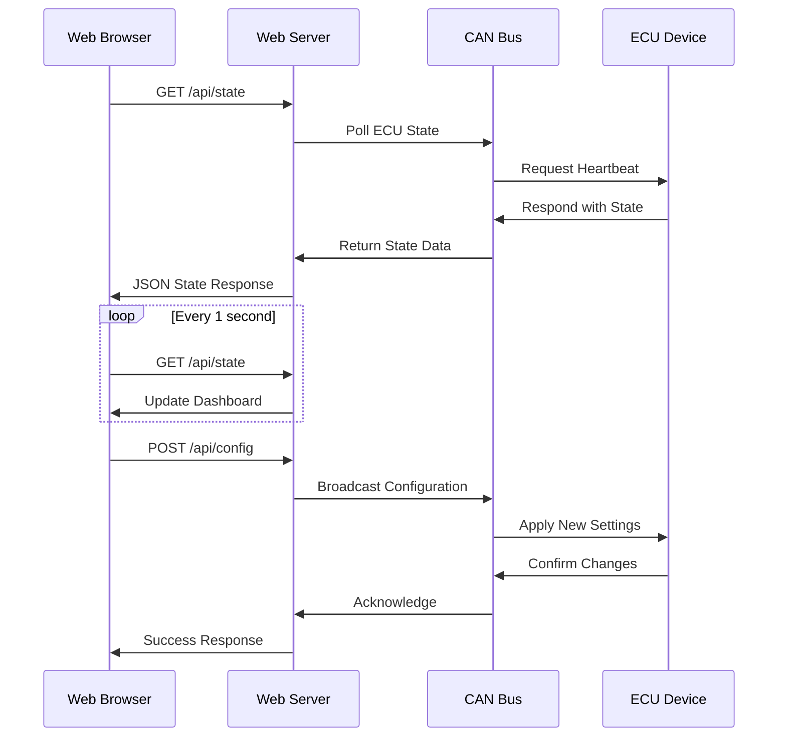

**Diagram sources**
- [ota_webserver.cpp:604-659](file://src/ota_webserver.cpp#L604-L659)
- [ota_webserver.cpp:683-722](file://src/ota_webserver.cpp#L683-L722)

**Section sources**
- [ota_webserver.cpp:1-933](file://src/ota_webserver.cpp#L1-L933)
- [web_state.h:1-23](file://src/web_state.h#L1-L23)
- [web_state.cpp:1-20](file://src/web_state.cpp#L1-L20)

## Safety and Defaults

The auto-configuration system implements comprehensive safety mechanisms and factory default configurations to ensure reliable operation and easy recovery from misconfigurations.

### Safety Mechanisms

The system incorporates multiple layers of safety protection:

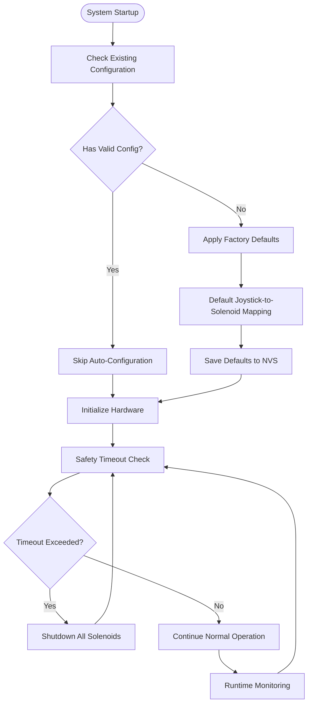

**Diagram sources**
- [ecu_motor_driver.cpp:456-461](file://src/ecu_motor_driver.cpp#L456-L461)
- [ecu_motor_driver.cpp:330-359](file://src/ecu_motor_driver.cpp#L330-L359)

### Factory Default Configuration

The system provides intelligent factory defaults that establish sensible initial behavior:

| Component | Default Setting | Purpose |
|-----------|----------------|---------|
| PCA Count | 2 | Support dual PCA9685 expansion |
| Deadband Range | 472-552 | Prevent accidental solenoid activation |
| PWM Range | 50-200 | Safe operational range (20%-78%) |
| Bidirectional Axes | Enabled for first 4 axes | Primary joystick controls |
| Channel Mapping | Joy1 Pot1→Ch0+1, Joy1 Pot2→Ch2+3 | Standard vehicle control layout |
| Safety Timeout | 500ms | Immediate solenoid shutdown on communication loss |

### Recovery Mechanisms

The system includes multiple recovery mechanisms for fault tolerance:

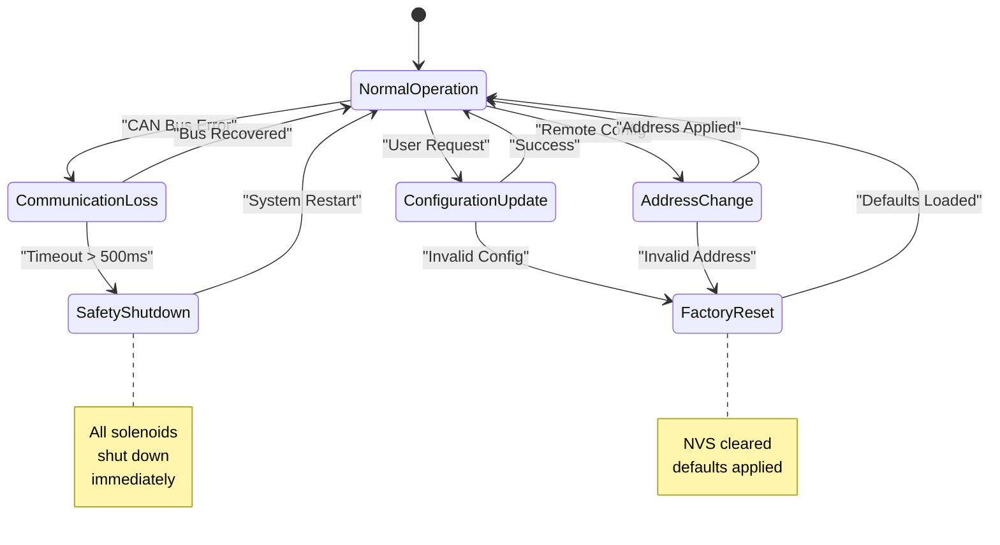

**Diagram sources**
- [ecu_motor_driver.cpp:456-479](file://src/ecu_motor_driver.cpp#L456-L479)
- [ForwarderConfig.cpp:171-183](file://lib/ForwarderConfig/ForwarderConfig.cpp#L171-L183)

**Section sources**
- [ecu_motor_driver.cpp:330-359](file://src/ecu_motor_driver.cpp#L330-L359)
- [ecu_motor_driver.cpp:456-479](file://src/ecu_motor_driver.cpp#L456-L479)
- [ForwarderConfig.cpp:171-183](file://lib/ForwarderConfig/ForwarderConfig.cpp#L171-L183)

## Implementation Patterns

The auto-configuration system demonstrates several advanced implementation patterns that contribute to its reliability and maintainability.

### Template Method Pattern

The system uses the template method pattern to provide a consistent interface across different ECU types while allowing specific implementations:

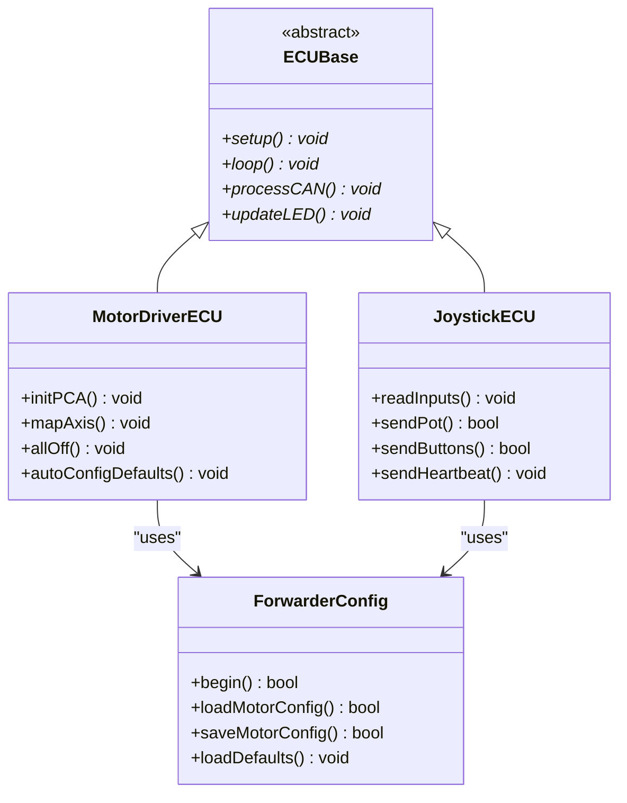

**Diagram sources**
- [ecu_motor_driver.h:1-5](file://src/ecu_motor_driver.h#L1-L5)
- [ecu_joystick.h:1-5](file://src/ecu_joystick.h#L1-L5)
- [ForwarderConfig.h:64-92](file://lib/ForwarderConfig/ForwarderConfig.h#L64-L92)

### Factory Pattern for Configuration

The system implements a factory pattern for creating and managing configuration instances:

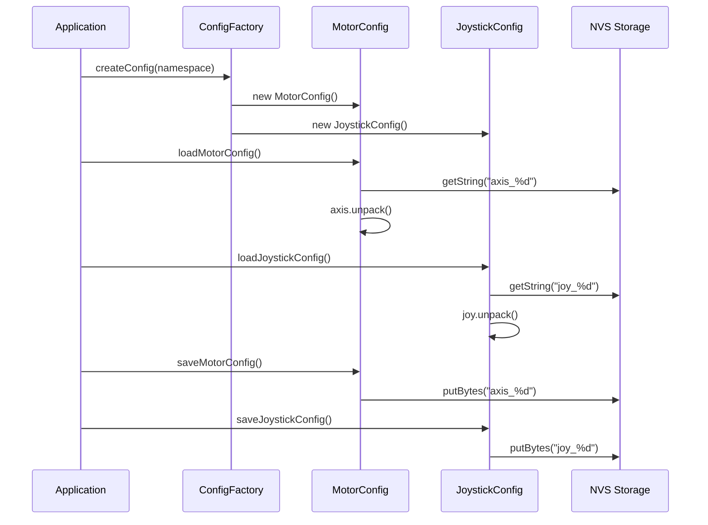

**Diagram sources**
- [ForwarderConfig.cpp:76-127](file://lib/ForwarderConfig/ForwarderConfig.cpp#L76-L127)
- [ForwarderConfig.cpp:129-169](file://lib/ForwarderConfig/ForwarderConfig.cpp#L129-L169)

### Observer Pattern for State Management

The web interface implements an observer pattern for real-time state updates:

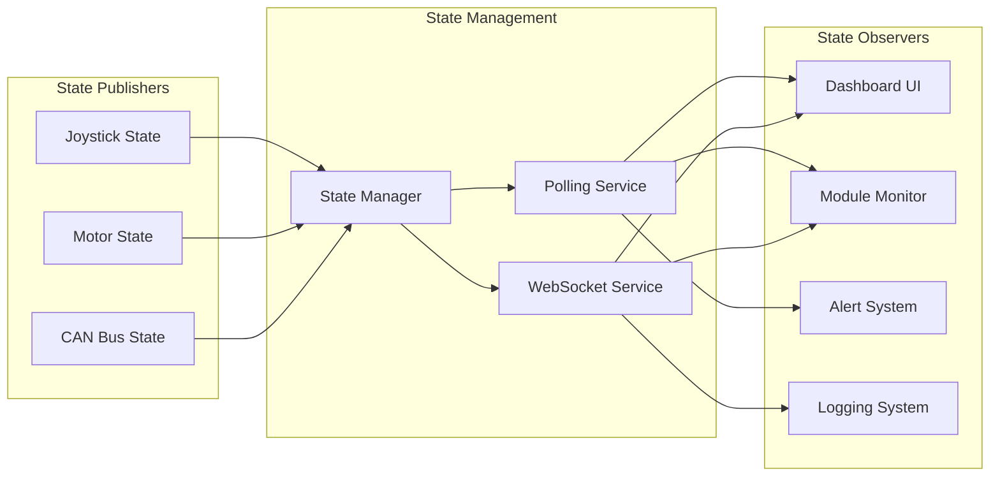

**Diagram sources**
- [web_state.h:10-23](file://src/web_state.h#L10-L23)
- [web_state.cpp:6-19](file://src/web_state.cpp#L6-L19)

**Section sources**
- [ecu_motor_driver.cpp:1-479](file://src/ecu_motor_driver.cpp#L1-L479)
- [ecu_joystick.cpp:1-281](file://src/ecu_joystick.cpp#L1-L281)
- [ForwarderConfig.cpp:1-184](file://lib/ForwarderConfig/ForwarderConfig.cpp#L1-L184)

## Troubleshooting Guide

The auto-configuration system includes comprehensive diagnostic capabilities and troubleshooting procedures to assist with common issues.

### Common Configuration Issues

| Issue | Symptoms | Diagnosis | Solution |
|-------|----------|-----------|----------|
| No Axis Configuration | Motors don't respond to joystick input | Check NVS storage for axis configurations | Run auto-configuration or restore defaults |
| Invalid Address Assignment | Device fails to respond on CAN bus | Verify address conflicts and NVS storage | Clear forced address and reassign |
| Communication Loss | Dashboard shows offline status | Check CAN bus connectivity and termination | Verify wiring and bus termination |
| Safety Shutdown | All solenoids deactivated | Check communication timeout and watchdog | Restore communication or reset device |

### Diagnostic Commands and Procedures

The system provides several diagnostic commands for troubleshooting:

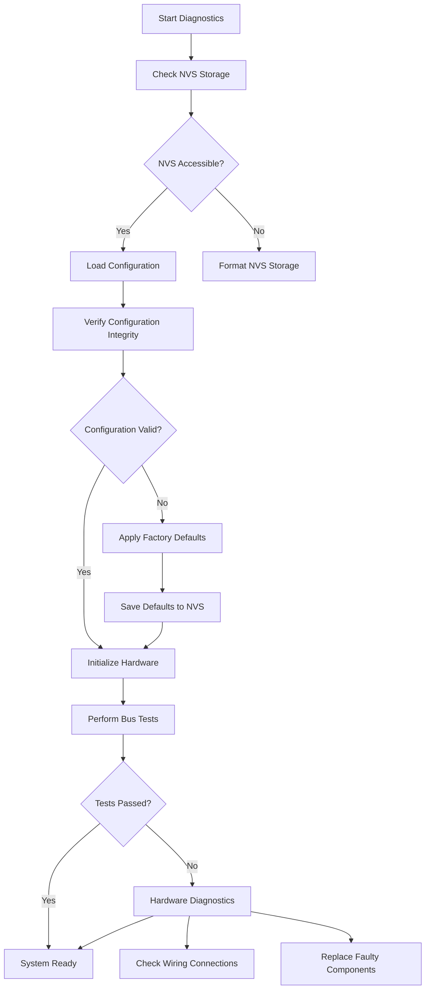

**Diagram sources**
- [ecu_motor_driver.cpp:378-394](file://src/ecu_motor_driver.cpp#L378-L394)
- [ecu_joystick.cpp:205-215](file://src/ecu_joystick.cpp#L205-L215)

### Remote Diagnostics via Web Interface

The web interface provides comprehensive remote diagnostic capabilities:

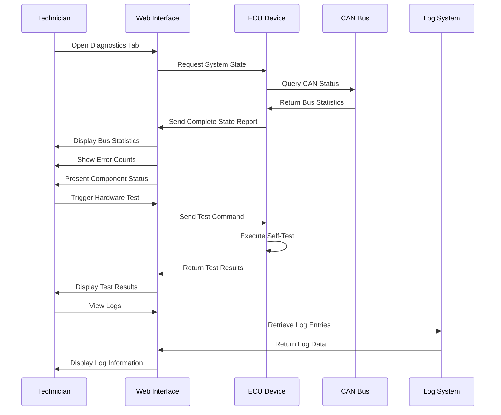

**Diagram sources**
- [ota_webserver.cpp:604-659](file://src/ota_webserver.cpp#L604-L659)
- [ecu_motor_driver.cpp:436-448](file://src/ecu_motor_driver.cpp#L436-L448)

**Section sources**
- [ecu_motor_driver.cpp:378-394](file://src/ecu_motor_driver.cpp#L378-L394)
- [ecu_joystick.cpp:205-215](file://src/ecu_joystick.cpp#L205-L215)
- [ota_webserver.cpp:604-659](file://src/ota_webserver.cpp#L604-L659)

## Conclusion

The Auto-Configuration System represents a sophisticated approach to embedded system configuration management, combining hardware abstraction, persistent storage, and user-friendly interfaces into a cohesive solution. The system's modular architecture, comprehensive safety mechanisms, and web-based management capabilities make it well-suited for complex industrial applications requiring reliable and flexible configuration management.

Key strengths of the system include its intelligent auto-configuration capabilities, robust persistence layer using NVS storage, comprehensive web interface for remote management, and extensive safety mechanisms ensuring reliable operation. The modular design allows for easy extension and modification while maintaining system stability and performance.

The implementation demonstrates best practices in embedded systems development, including proper resource management, error handling, and user experience design. The system's ability to recover from faults and provide comprehensive diagnostics makes it particularly valuable for field deployments where remote maintenance and troubleshooting are essential.

Future enhancements could include expanded configuration options, additional safety features, and integration with external monitoring systems. The solid foundation established by the current implementation provides an excellent platform for continued development and improvement.