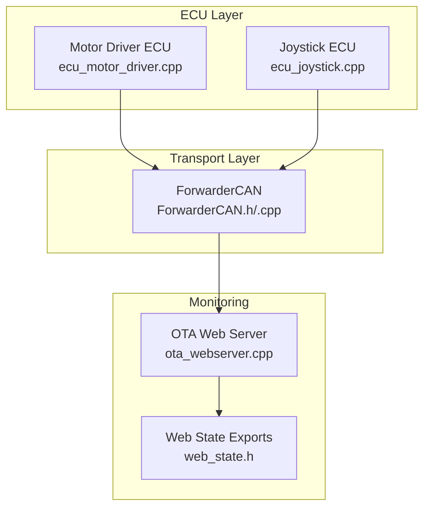
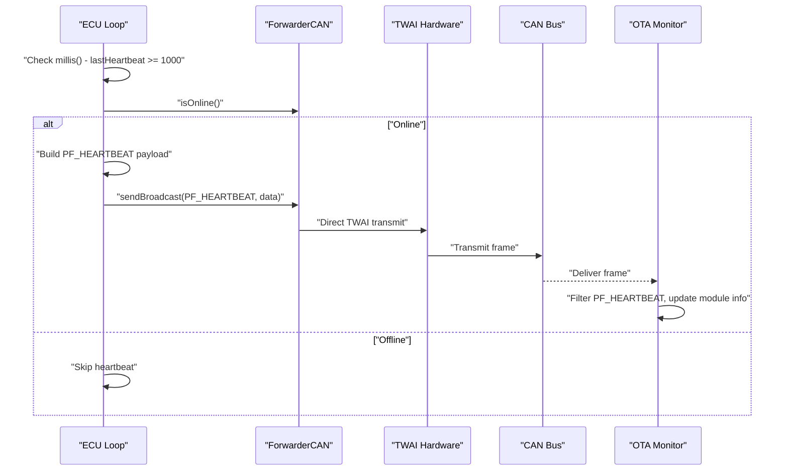
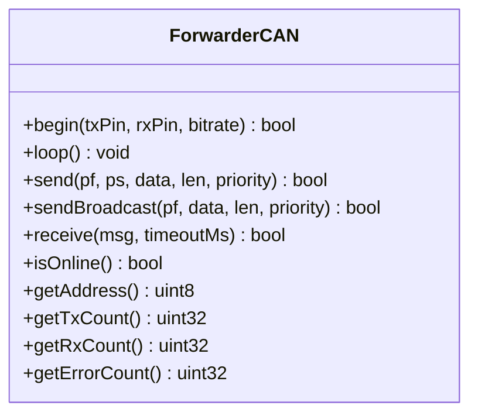
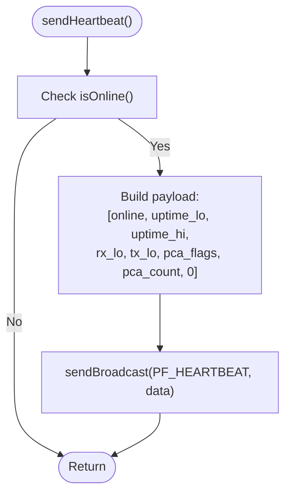
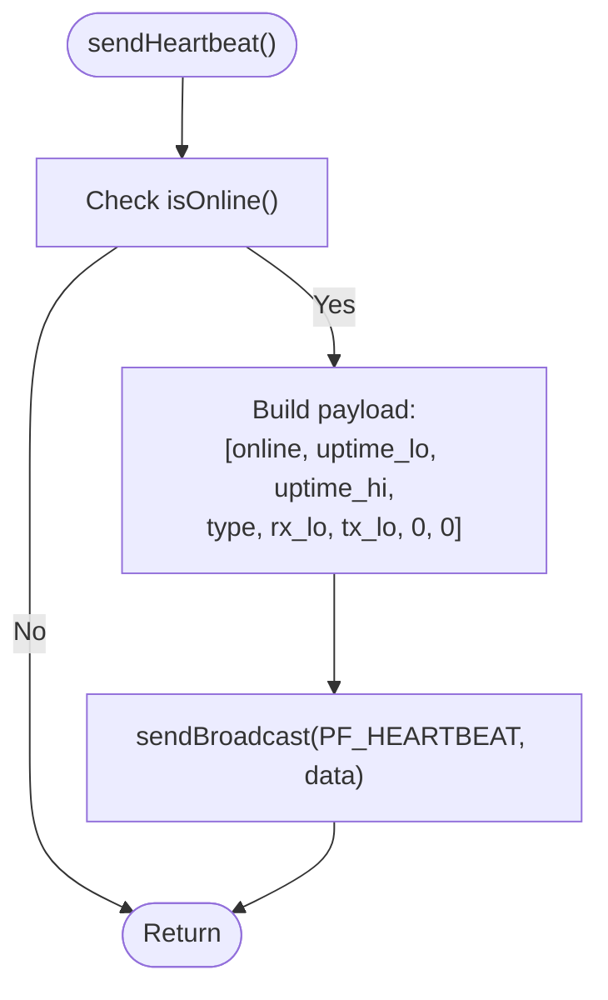
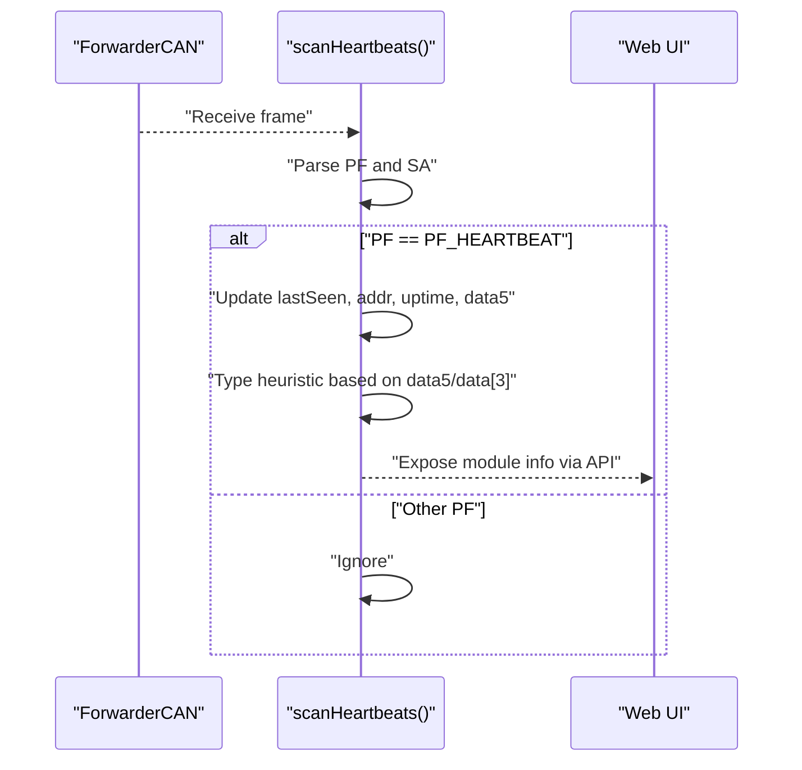
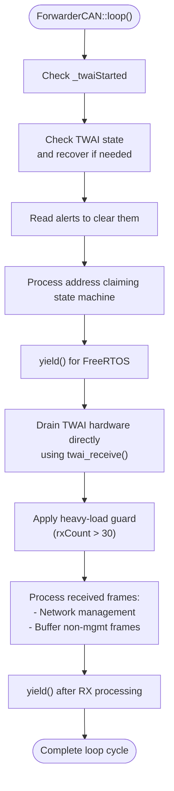

# Heartbeat Message Generation

<cite>
**Referenced Files in This Document**
- [main.cpp](file://src/main.cpp)
- [ForwarderCAN.h](file://lib/ForwarderCAN/ForwarderCAN.h)
- [ForwarderCAN.cpp](file://lib/ForwarderCAN/ForwarderCAN.cpp)
- [ecu_motor_driver.cpp](file://src/ecu_motor_driver.cpp)
- [ecu_joystick.cpp](file://src/ecu_joystick.cpp)
- [ota_webserver.cpp](file://src/ota_webserver.cpp)
- [web_state.h](file://src/web_state.h)
</cite>

## Update Summary
**Changes Made**
- Updated ForwarderCAN transport layer section to reflect enhanced loop() method with direct TWAI hardware interface
- Added performance considerations section highlighting heavy bus load prevention mechanisms
- Updated troubleshooting guide to include system lockup prevention techniques
- Enhanced architecture overview to show improved message processing flow

## Table of Contents
1. [Introduction](#introduction)
2. [Project Structure](#project-structure)
3. [Core Components](#core-components)
4. [Architecture Overview](#architecture-overview)
5. [Detailed Component Analysis](#detailed-component-analysis)
6. [Enhanced Message Processing](#enhanced-message-processing)
7. [Performance Considerations](#performance-considerations)
8. [Troubleshooting Guide](#troubleshooting-guide)
9. [Conclusion](#conclusion)

## Introduction
This document explains the heartbeat message generation system used by the ForwarderCAN-based ECUs. It covers the 1-second periodic transmission of system health metrics, the PF_HEARTBEAT message format, and how heartbeat data integrates with the ForwarderCAN messaging system. The system has been enhanced with improved message processing that prevents system lockups under heavy bus load through direct TWAI hardware interface usage.

## Project Structure
The heartbeat system spans three primary areas:
- ForwarderCAN transport layer: CAN bus initialization, address claiming, send/receive, and statistics with enhanced heavy-load protection.
- ECU implementations: motor driver and joystick ECUs that generate and periodically transmit heartbeat frames.
- OTA web server: monitors heartbeats, tracks module presence and types, and exposes diagnostic data.

**Diagram sources**
- [ecu_motor_driver.cpp:277-288](file://src/ecu_motor_driver.cpp#L277-L288)
- [ecu_joystick.cpp:150-161](file://src/ecu_joystick.cpp#L150-L161)
- [ForwarderCAN.h:85-91](file://lib/ForwarderCAN/ForwarderCAN.h#L85-L91)
- [ForwarderCAN.cpp:204-206](file://lib/ForwarderCAN/ForwarderCAN.cpp#L204-L206)
- [ota_webserver.cpp:740-761](file://src/ota_webserver.cpp#L740-L761)
- [web_state.h:10-23](file://src/web_state.h#L10-L23)

**Section sources**
- [main.cpp:11-31](file://src/main.cpp#L11-L31)
- [ForwarderCAN.h:66-123](file://lib/ForwarderCAN/ForwarderCAN.h#L66-L123)
- [ForwarderCAN.cpp:13-56](file://lib/ForwarderCAN/ForwarderCAN.cpp#L13-L56)

## Core Components
- ForwarderCAN transport: Provides CAN initialization, address claiming, send/receive, and counters (TX/RX/Error). It supports broadcast sending and exposes online state with enhanced heavy-load protection.
- ECU heartbeat generators: Motor driver and joystick ECUs each construct and transmit a PF_HEARTBEAT frame every ~1 second when the CAN bus is online.
- Heartbeat monitor: The OTA web server scans incoming frames, recognizes PF_HEARTBEAT, updates per-source module info, and infers device type heuristically.

Key responsibilities:
- Periodic transmission: Both ECUs check a 1-second timer and send heartbeat when online.
- Broadcast nature: Heartbeats are sent to the broadcast destination address.
- Health metrics: Heartbeat payload encodes online status, uptime, RX/TX counters, and device-specific metadata.
- Heavy-load protection: Enhanced loop() method prevents system lockups under high bus load conditions.

**Section sources**
- [ForwarderCAN.h:85-96](file://lib/ForwarderCAN/ForwarderCAN.h#L85-L96)
- [ForwarderCAN.cpp:204-206](file://lib/ForwarderCAN/ForwarderCAN.cpp#L204-L206)
- [ecu_motor_driver.cpp:341-346](file://src/ecu_motor_driver.cpp#L341-L346)
- [ecu_joystick.cpp:241-246](file://src/ecu_joystick.cpp#L241-L246)
- [ota_webserver.cpp:740-761](file://src/ota_webserver.cpp#L740-L761)

## Architecture Overview
The heartbeat generation follows a simple, robust pattern with enhanced reliability:
- Each ECU maintains a millisecond timestamp for the last heartbeat.
- On each loop, if 1000ms elapsed and the bus is online, the ECU constructs a PF_HEARTBEAT payload and broadcasts it.
- The OTA web server continuously receives frames, filters for PF_HEARTBEAT, and updates module state.
- **Enhanced**: ForwarderCAN loop() method now uses direct TWAI hardware interface to prevent system lockups under heavy bus load.

**Diagram sources**
- [ecu_motor_driver.cpp:341-346](file://src/ecu_motor_driver.cpp#L341-L346)
- [ecu_joystick.cpp:241-246](file://src/ecu_joystick.cpp#L241-L246)
- [ForwarderCAN.cpp:204-206](file://lib/ForwarderCAN/ForwarderCAN.cpp#L204-L206)
- [ota_webserver.cpp:740-761](file://src/ota_webserver.cpp#L740-L761)

## Detailed Component Analysis

### ForwarderCAN Transport Layer
ForwarderCAN encapsulates CAN operations with enhanced heavy-load protection:
- Initialization sets up TWAI driver, bitrate, and filter configuration.
- Address claiming uses a deterministic state machine; online state is available via isOnline().
- Send/receive APIs support both unicast and broadcast (destination 0xFF).
- Counters track TX, RX, and error events.
- **Enhanced**: loop() method now uses direct TWAI hardware interface to drain buffers safely, preventing system lockups under heavy bus load.

**Diagram sources**
- [ForwarderCAN.h:66-123](file://lib/ForwarderCAN/ForwarderCAN.h#L66-L123)

**Section sources**
- [ForwarderCAN.h:69-96](file://lib/ForwarderCAN/ForwarderCAN.h#L69-L96)
- [ForwarderCAN.cpp:13-56](file://lib/ForwarderCAN/ForwarderCAN.cpp#L13-L56)
- [ForwarderCAN.cpp:83-154](file://lib/ForwarderCAN/ForwarderCAN.cpp#L83-L154)

### Motor Driver Heartbeat Generator
The motor driver constructs a 8-byte heartbeat payload:
- Byte 0: Online status (1 if online, else 0).
- Bytes 1-2: Uptime in seconds stored as little-endian 16-bit.
- Bytes 3-4: RX/TX counters low bytes respectively.
- Byte 5: Device capability indicator (16 for dual PCA9685, 8 otherwise).
- Byte 6: PCA count setting.
- Bytes 7: Reserved (zero).

It sends the frame every ~1 second when online.

**Diagram sources**
- [ecu_motor_driver.cpp:277-288](file://src/ecu_motor_driver.cpp#L277-L288)

**Section sources**
- [ecu_motor_driver.cpp:277-288](file://src/ecu_motor_driver.cpp#L277-L288)
- [ecu_motor_driver.cpp:341-346](file://src/ecu_motor_driver.cpp#L341-L346)

### Joystick Heartbeat Generator
The joystick ECU constructs a 8-byte heartbeat payload:
- Byte 0: Online status (1 if online, else 0).
- Bytes 1-2: Uptime in seconds stored as little-endian 16-bit.
- Byte 3: Device type discriminator (ECU joystick ID).
- Bytes 4-5: RX/TX counters low bytes respectively.
- Bytes 6-7: Reserved (zero).

It sends the frame every ~1 second when online.

**Diagram sources**
- [ecu_joystick.cpp:150-161](file://src/ecu_joystick.cpp#L150-L161)

**Section sources**
- [ecu_joystick.cpp:150-161](file://src/ecu_joystick.cpp#L150-L161)
- [ecu_joystick.cpp:241-246](file://src/ecu_joystick.cpp#L241-L246)

### Heartbeat Monitoring and Type Detection
The OTA web server continuously scans incoming frames:
- Filters for PF_HEARTBEAT.
- Updates last seen time, source address, uptime (from payload), and a capability byte.
- Heuristically detects device type:
  - If capability byte equals 16 or 8, treat as motor driver.
  - If payload byte 3 equals 1 or 2, treat as joystick.

**Diagram sources**
- [ota_webserver.cpp:740-761](file://src/ota_webserver.cpp#L740-L761)

**Section sources**
- [ota_webserver.cpp:16-26](file://src/ota_webserver.cpp#L16-L26)
- [ota_webserver.cpp:740-761](file://src/ota_webserver.cpp#L740-L761)

## Enhanced Message Processing

### Direct TWAI Hardware Interface Implementation
The ForwarderCAN loop() method has been enhanced to prevent system lockups under heavy bus load through direct TWAI hardware interface usage:

**Updated** Enhanced loop() method now uses direct TWAI hardware interface to drain buffers safely, preventing the feedback loop that could occur if receive() was called within loop().

**Diagram sources**
- [ForwarderCAN.cpp:107-175](file://lib/ForwarderCAN/ForwarderCAN.cpp#L107-L175)

**Section sources**
- [ForwarderCAN.cpp:150-172](file://lib/ForwarderCAN/ForwarderCAN.cpp#L150-L172)

### Heavy Load Prevention Mechanisms
The enhanced implementation includes several mechanisms to prevent system lockups:

1. **Direct Hardware Access**: Uses `twai_receive()` directly instead of `receive()` to avoid feedback loops
2. **Load Guard**: Limits processed frames to 30 per loop cycle (`if (rxCount > 30) break;`)
3. **State Recovery**: Automatically restarts stopped TWAI interfaces and initiates recovery for bus-off states
4. **Buffer Management**: Maintains ring buffer for non-network-management messages while draining hardware directly

**Section sources**
- [ForwarderCAN.cpp:150-172](file://lib/ForwarderCAN/ForwarderCAN.cpp#L150-L172)
- [ForwarderCAN.cpp:110-124](file://lib/ForwarderCAN/ForwarderCAN.cpp#L110-L124)

## Performance Considerations
- Frequency: Heartbeat is transmitted approximately every 1000 ms when online, ensuring regular health signals without excessive bus load.
- Payload size: Fixed 8-byte payload minimizes bandwidth usage.
- Counter granularity: RX/TX counters are exposed as 8-bit values in the heartbeat payload; higher traffic loads require monitoring via transport-layer counters for precise diagnostics.
- Bus state handling: ForwarderCAN automatically handles bus-off recovery and restarts, reducing heartbeat interruptions during transient faults.
- **Enhanced**: Heavy-load protection prevents system lockups during high-traffic scenarios through direct hardware interface usage and frame processing limits.

## Troubleshooting Guide
Use heartbeat data to diagnose system health:

- Missing heartbeats:
  - Confirm ECU loop executes and online state is true.
  - Verify 1-second timer logic and that sendBroadcast is invoked when online.
  - Check CAN bitrate and wiring; offline state prevents heartbeat transmission.

- Unexpected offline status:
  - Inspect ForwarderCAN address claiming state machine and bus state recovery.
  - Look for repeated bus-off conditions or driver restarts.

- Counter anomalies:
  - Compare heartbeat RX/TX bytes with ForwarderCAN transport counters for consistency.
  - Investigate missed frames or filtering issues if counters diverge.

- **Enhanced**: System lockup prevention:
  - Monitor for heavy bus load conditions that might trigger the 30-frame processing limit.
  - Check TWAI hardware state using the diagnostic output in joystick ECU loop.
  - Verify that the enhanced loop() method is properly draining hardware buffers.

- Monitoring tools:
  - Use the OTA web server's module list to observe last seen timestamps and inferred device types.
  - Cross-check uptime values against local millis() to validate monotonicity.
  - Monitor TWAI status information for hardware-level diagnostics.

Interpretation tips:
- Online byte indicates whether ForwarderCAN considers the bus operational.
- Uptime helps detect unexpected resets or drift.
- Capability byte distinguishes device types for inventory and configuration management.
- RX/TX bytes reflect recent activity; sustained zeros suggest communication issues.
- **Enhanced**: Heavy-load conditions may temporarily reduce frame processing throughput due to the 30-frame guard mechanism.

**Section sources**
- [ecu_motor_driver.cpp:341-346](file://src/ecu_motor_driver.cpp#L341-L346)
- [ecu_joystick.cpp:241-246](file://src/ecu_joystick.cpp#L241-L246)
- [ForwarderCAN.cpp:83-154](file://lib/ForwarderCAN/ForwarderCAN.cpp#L83-L154)
- [ota_webserver.cpp:740-761](file://src/ota_webserver.cpp#L740-L761)

## Conclusion
The heartbeat system provides a lightweight, reliable mechanism for continuous system health monitoring over the CAN bus. By broadcasting a standardized 8-byte PF_HEARTBEAT frame every ~1 second, ECUs communicate online status, uptime, and device-specific metadata. The OTA web server leverages heartbeat frames to maintain an inventory of connected modules and infer device types, enabling effective diagnostics and troubleshooting.

**Enhanced**: The recent improvements to the ForwarderCAN transport layer significantly improve system reliability by preventing lockups under heavy bus load conditions. The direct TWAI hardware interface usage and frame processing limits ensure that the system remains responsive even during high-traffic scenarios, making the heartbeat monitoring system more robust and production-ready.