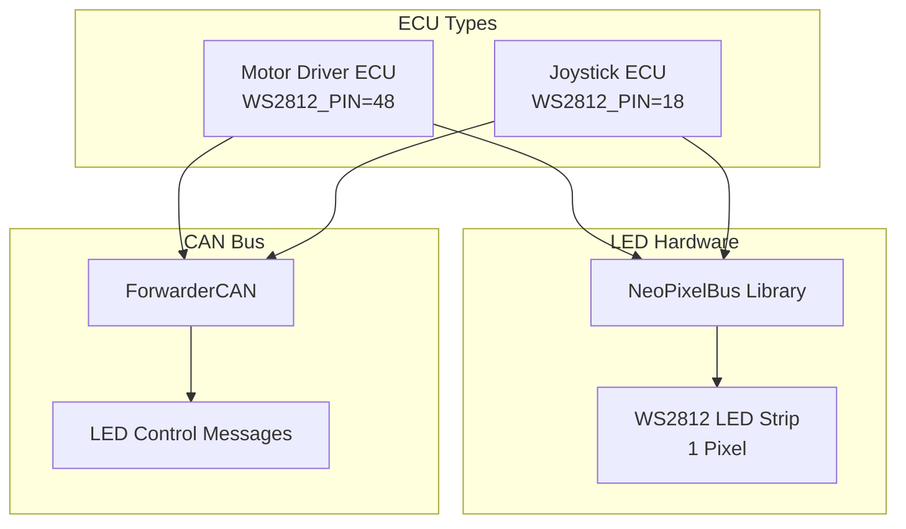
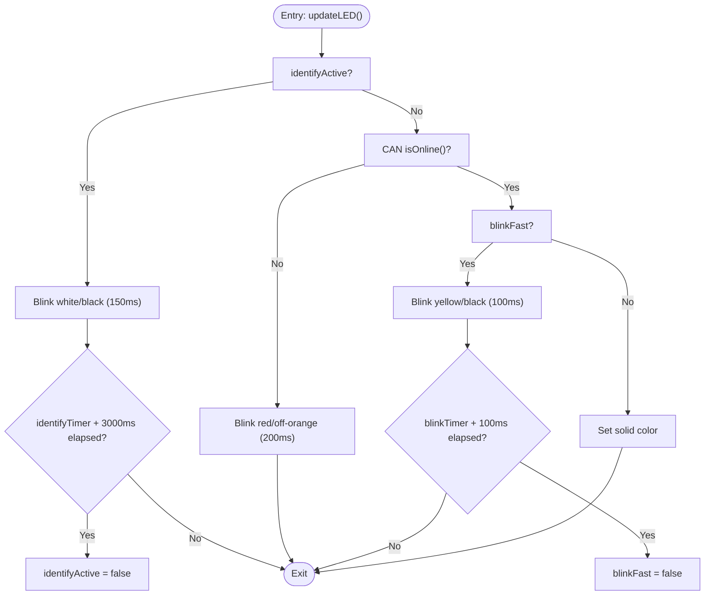
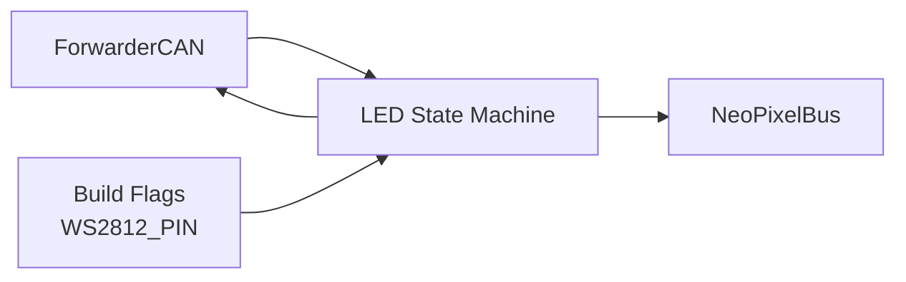

# LED Status Indicator System

<cite>
**Referenced Files in This Document**
- [README.md](file://README.md)
- [platformio.ini](file://platformio.ini)
- [src/main.cpp](file://src/main.cpp)
- [src/ecu_motor_driver.cpp](file://src/ecu_motor_driver.cpp)
- [src/ecu_motor_driver.h](file://src/ecu_motor_driver.h)
- [src/ecu_joystick.cpp](file://src/ecu_joystick.cpp)
- [src/ecu_joystick.h](file://src/ecu_joystick.h)
- [lib/ForwarderCAN/ForwarderCAN.h](file://lib/ForwarderCAN/ForwarderCAN.h)
- [lib/ForwarderConfig/ForwarderConfig.h](file://lib/ForwarderConfig/ForwarderConfig.h)
</cite>

## Table of Contents
1. [Introduction](#introduction)
2. [Project Structure](#project-structure)
3. [Core Components](#core-components)
4. [Architecture Overview](#architecture-overview)
5. [Detailed Component Analysis](#detailed-component-analysis)
6. [Dependency Analysis](#dependency-analysis)
7. [Performance Considerations](#performance-considerations)
8. [Troubleshooting Guide](#troubleshooting-guide)
9. [Conclusion](#conclusion)

## Introduction
This document describes the NeoPixel LED status indicator system used by the Forwarder CAN Controller ECUs. It covers RGB color management, blinking patterns for operational states, identification mode, LED state machine behavior, update timing logic, integration with the main control loop, hardware pin configuration, and troubleshooting procedures.

## Project Structure
The LED system is implemented in two ECU variants:
- Motor Driver ECU: Uses onboard WS2812 LED for status indication
- Joystick ECU: Uses onboard WS2812 LED for status indication

Both share the same NeoPixelBus library and follow similar LED state machine patterns, with minor differences in color defaults and blink timings.



**Diagram sources**
- [platformio.ini:25](file://platformio.ini#L25)
- [platformio.ini:41](file://platformio.ini#L41)
- [src/ecu_motor_driver.cpp:43](file://src/ecu_motor_driver.cpp#L43)
- [src/ecu_joystick.cpp:42](file://src/ecu_joystick.cpp#L42)
- [lib/ForwarderCAN/ForwarderCAN.h:43](file://lib/ForwarderCAN/ForwarderCAN.h#L43)

**Section sources**
- [README.md:48-62](file://README.md#L48-L62)
- [platformio.ini:17-64](file://platformio.ini#L17-L64)

## Core Components
- NeoPixelBus initialization and pixel control
- LED state machine with four operational modes:
  - Normal operation: solid color (blue for motor driver, green for joystick)
  - Offline: periodic blinking (red for motor driver, orange-brown for joystick)
  - Fast blink warning: yellow for active communication
  - Identification mode: blinking white for 3 seconds
- Update timing logic with 50 ms refresh interval
- Integration with ForwarderCAN for online/offline detection and CAN message processing
- Hardware pin configuration via build flags

Key implementation locations:
- Motor Driver LED logic: [updateLED:153-182](file://src/ecu_motor_driver.cpp#L153-L182)
- Joystick LED logic: [updateLED:74-101](file://src/ecu_joystick.cpp#L74-L101)
- CAN message processing and LED triggers: [processCAN:184-275](file://src/ecu_motor_driver.cpp#L184-L275), [processCAN:118-148](file://src/ecu_joystick.cpp#L118-L148)
- LED state machine and timers: [ecu_motor_driver.cpp:53-57](file://src/ecu_motor_driver.cpp#L53-L57), [ecu_joystick.cpp:55-58](file://src/ecu_joystick.cpp#L55-L58)

**Section sources**
- [src/ecu_motor_driver.cpp:153-182](file://src/ecu_motor_driver.cpp#L153-L182)
- [src/ecu_joystick.cpp:74-101](file://src/ecu_joystick.cpp#L74-L101)
- [src/ecu_motor_driver.cpp:184-275](file://src/ecu_motor_driver.cpp#L184-L275)
- [src/ecu_joystick.cpp:118-148](file://src/ecu_joystick.cpp#L118-L148)

## Architecture Overview
The LED system integrates tightly with the main control loop and CAN subsystem. The update cycle runs at approximately 50 ms, checking the current state and applying the appropriate color or blink pattern.

```mermaid
sequenceDiagram
participant Loop as "Main Loop"
participant LED as "updateLED()"
participant CAN as "ForwarderCAN"
participant Strip as "NeoPixelBus"
Loop->>LED : "Call updateLED()"
LED->>LED : "Check identifyActive"
alt "Identification Mode"
LED->>Strip : "Set white or black (500ms blink)"
else "Offline"
LED->>CAN : "isOnline()"
CAN-->>LED : "false"
LED->>Strip : "Set red or black (200ms blink)"
else "Fast Blink Warning"
LED->>LED : "blinkFast timer elapsed?"
LED->>Strip : "Set yellow or black (100ms blink)"
else "Normal Operation"
LED->>CAN : "isOnline()"
CAN-->>LED : "true"
LED->>Strip : "Set configured color"
end
LED->>Strip : "Show()"
```

**Diagram sources**
- [src/ecu_motor_driver.cpp:153-182](file://src/ecu_motor_driver.cpp#L153-L182)
- [src/ecu_joystick.cpp:74-101](file://src/ecu_joystick.cpp#L74-L101)
- [lib/ForwarderCAN/ForwarderCAN.h:81](file://lib/ForwarderCAN/ForwarderCAN.h#L81)

## Detailed Component Analysis

### LED State Machine
The LED state machine evaluates conditions in this order:
1. Identification mode: If active, alternate between white and black every 150 ms for 3 seconds
2. Offline condition: If CAN reports offline, blink red/orange-brown at 200 ms intervals
3. Fast blink warning: If recent CAN activity triggered a fast blink, blink yellow at 100 ms intervals for 100 ms
4. Normal operation: Solid color based on configured RGB values



**Diagram sources**
- [src/ecu_motor_driver.cpp:153-182](file://src/ecu_motor_driver.cpp#L153-L182)
- [src/ecu_joystick.cpp:74-101](file://src/ecu_joystick.cpp#L74-L101)

**Section sources**
- [src/ecu_motor_driver.cpp:153-182](file://src/ecu_motor_driver.cpp#L153-L182)
- [src/ecu_joystick.cpp:74-101](file://src/ecu_joystick.cpp#L74-L101)

### RGB Color Management
- Motor Driver: Default blue (R:0, G:0, B:20) with brightness scaling applied during updates
- Joystick: Default green (R:0, G:20, B:0) with brightness scaling applied during updates
- Remote control: CAN message PF_LED_COLOR (0x20) allows setting R, G, B values for both ECUs
- Brightness scaling: Joystick applies a brightness factor to reduce LED intensity

Implementation references:
- Motor Driver defaults and update: [ecu_motor_driver.cpp:53-57](file://src/ecu_motor_driver.cpp#L53-L57), [updateLED:153-182](file://src/ecu_motor_driver.cpp#L153-L182)
- Joystick defaults and update: [ecu_joystick.cpp:55-58](file://src/ecu_joystick.cpp#L55-L58), [updateLED:74-101](file://src/ecu_joystick.cpp#L74-L101)
- Remote control message: [ForwarderCAN.h](file://lib/ForwarderCAN/ForwarderCAN.h#L43)

**Section sources**
- [src/ecu_motor_driver.cpp:53-57](file://src/ecu_motor_driver.cpp#L53-L57)
- [src/ecu_motor_driver.cpp:153-182](file://src/ecu_motor_driver.cpp#L153-L182)
- [src/ecu_joystick.cpp:55-58](file://src/ecu_joystick.cpp#L55-L58)
- [src/ecu_joystick.cpp:74-101](file://src/ecu_joystick.cpp#L74-L101)
- [lib/ForwarderCAN/ForwarderCAN.h:43](file://lib/ForwarderCAN/ForwarderCAN.h#L43)

### Blinking Patterns and Timings
- Identification mode: Alternates between white and black every 150 ms for 3 seconds
- Offline mode: Red or orange-brown blink every 200 ms
- Fast blink warning: Yellow blink every 100 ms for 100 ms after receiving joystick or solenoid commands
- Update interval: 50 ms polling in the LED update function

Timing references:
- Identification: [ecu_motor_driver.cpp:158-166](file://src/ecu_motor_driver.cpp#L158-L166), [ecu_joystick.cpp:83-91](file://src/ecu_joystick.cpp#L83-L91)
- Offline: [ecu_motor_driver.cpp:167-172](file://src/ecu_motor_driver.cpp#L167-L172), [ecu_joystick.cpp:92-97](file://src/ecu_joystick.cpp#L92-L97)
- Fast blink: [ecu_motor_driver.cpp:173-178](file://src/ecu_motor_driver.cpp#L173-L178), [ecu_motor_driver.cpp:338-340](file://src/ecu_motor_driver.cpp#L338-L340)
- Update interval: [ecu_motor_driver.cpp](file://src/ecu_motor_driver.cpp#L155), [ecu_joystick.cpp](file://src/ecu_joystick.cpp#L76)

**Section sources**
- [src/ecu_motor_driver.cpp:158-178](file://src/ecu_motor_driver.cpp#L158-L178)
- [src/ecu_motor_driver.cpp:338-340](file://src/ecu_motor_driver.cpp#L338-L340)
- [src/ecu_joystick.cpp:83-97](file://src/ecu_joystick.cpp#L83-L97)
- [src/ecu_motor_driver.cpp:155](file://src/ecu_motor_driver.cpp#L155)
- [src/ecu_joystick.cpp:76](file://src/ecu_joystick.cpp#L76)

### Identification Mode
- Triggered by CAN message PF_IDENTIFY (0x22) addressed to broadcast or specific ECU
- Starts a 3-second timer; during this period, the LED alternates between white and black
- After 3 seconds, identification mode deactivates automatically

References:
- Trigger: [ecu_motor_driver.cpp:227-233](file://src/ecu_motor_driver.cpp#L227-L233), [ecu_joystick.cpp:131-135](file://src/ecu_joystick.cpp#L131-L135)
- Execution: [ecu_motor_driver.cpp:158-166](file://src/ecu_motor_driver.cpp#L158-L166), [ecu_joystick.cpp:83-91](file://src/ecu_joystick.cpp#L83-L91)

**Section sources**
- [src/ecu_motor_driver.cpp:227-233](file://src/ecu_motor_driver.cpp#L227-L233)
- [src/ecu_joystick.cpp:131-135](file://src/ecu_joystick.cpp#L131-L135)
- [src/ecu_motor_driver.cpp:158-166](file://src/ecu_motor_driver.cpp#L158-L166)
- [src/ecu_joystick.cpp:83-91](file://src/ecu_joystick.cpp#L83-L91)

### Update Timing Logic
- LED update function checks a 50 ms interval before processing state changes
- Fast blink warning resets after 100 ms
- Identification mode resets after 3 seconds
- Integration with main loop: LED update is called in both ECU variants' main loops

References:
- Interval check: [ecu_motor_driver.cpp](file://src/ecu_motor_driver.cpp#L155), [ecu_joystick.cpp](file://src/ecu_joystick.cpp#L76)
- Reset logic: [ecu_motor_driver.cpp:338-340](file://src/ecu_motor_driver.cpp#L338-L340)
- Main loop integration: [ecu_motor_driver.cpp](file://src/ecu_motor_driver.cpp#L347), [ecu_joystick.cpp](file://src/ecu_joystick.cpp#L261)

**Section sources**
- [src/ecu_motor_driver.cpp:155](file://src/ecu_motor_driver.cpp#L155)
- [src/ecu_joystick.cpp:76](file://src/ecu_joystick.cpp#L76)
- [src/ecu_motor_driver.cpp:338-340](file://src/ecu_motor_driver.cpp#L338-L340)
- [src/ecu_motor_driver.cpp:347](file://src/ecu_motor_driver.cpp#L347)
- [src/ecu_joystick.cpp:261](file://src/ecu_joystick.cpp#L261)

### Integration with Main Control Loop
- Both ECUs call their respective LED update functions in the main loop
- Motor Driver: LED update interleaved with CAN processing, axis updates, heartbeat broadcasting, and OTA loop
- Joystick: LED update interleaved with input reading, CAN processing, periodic heartbeat, and OTA loop

References:
- Motor Driver loop: [ecu_motor_driver.cpp:327-352](file://src/ecu_motor_driver.cpp#L327-L352)
- Joystick loop: [ecu_joystick.cpp:203-265](file://src/ecu_joystick.cpp#L203-L265)

**Section sources**
- [src/ecu_motor_driver.cpp:327-352](file://src/ecu_motor_driver.cpp#L327-L352)
- [src/ecu_joystick.cpp:203-265](file://src/ecu_joystick.cpp#L203-L265)

### LED Pin Configuration and NeoPixelBus Setup
- Motor Driver: WS2812_PIN=48 (build flag), NeoPixelBus initialized with GRB feature and 800 Kbps method
- Joystick: WS2812_PIN=18 (build flag), NeoPixelBus initialized with GRB feature and 800 Kbps method
- Library dependency: NeoPixelBus v2.8.3 included via platformio.ini

References:
- Build flags: [platformio.ini](file://platformio.ini#L25), [platformio.ini](file://platformio.ini#L41)
- Initialization: [ecu_motor_driver.cpp](file://src/ecu_motor_driver.cpp#L43), [ecu_joystick.cpp](file://src/ecu_joystick.cpp#L42)
- Library dependency: [platformio.ini](file://platformio.ini#L11)

**Section sources**
- [platformio.ini:25](file://platformio.ini#L25)
- [platformio.ini:41](file://platformio.ini#L41)
- [platformio.ini:11](file://platformio.ini#L11)
- [src/ecu_motor_driver.cpp:43](file://src/ecu_motor_driver.cpp#L43)
- [src/ecu_joystick.cpp:42](file://src/ecu_joystick.cpp#L42)

## Dependency Analysis
The LED system depends on:
- ForwarderCAN for online/offline state and CAN message processing
- NeoPixelBus for pixel color setting and display
- Build flags for pin configuration
- CAN protocol definitions for LED control messages



**Diagram sources**
- [lib/ForwarderCAN/ForwarderCAN.h:81](file://lib/ForwarderCAN/ForwarderCAN.h#L81)
- [platformio.ini:25](file://platformio.ini#L25)
- [platformio.ini:41](file://platformio.ini#L41)
- [src/ecu_motor_driver.cpp:43](file://src/ecu_motor_driver.cpp#L43)
- [src/ecu_joystick.cpp:42](file://src/ecu_joystick.cpp#L42)

**Section sources**
- [lib/ForwarderCAN/ForwarderCAN.h:81](file://lib/ForwarderCAN/ForwarderCAN.h#L81)
- [platformio.ini:25](file://platformio.ini#L25)
- [platformio.ini:41](file://platformio.ini#L41)
- [src/ecu_motor_driver.cpp:43](file://src/ecu_motor_driver.cpp#L43)
- [src/ecu_joystick.cpp:42](file://src/ecu_joystick.cpp#L42)

## Performance Considerations
- LED update runs at ~50 ms, minimizing CPU overhead while maintaining responsive visual feedback
- Brightness scaling reduces power consumption and prevents over-bright LEDs
- Fast blink warning duration (100 ms) balances visibility with minimal CPU usage
- Identification mode duration (3 seconds) provides sufficient time for operator recognition

## Troubleshooting Guide
Common LED behavior scenarios and diagnostics:

- Solid blue LED (Motor Driver):
  - Indicates normal operation with CAN online
  - Verify CAN bus connectivity and address claiming success

- Solid green LED (Joystick):
  - Indicates normal operation with CAN online
  - Verify CAN bus connectivity and address claiming success

- Periodic red blink (Motor Driver) or orange-brown blink (Joystick):
  - Indicates CAN offline state
  - Check CAN wiring, termination, and bus-off recovery
  - Monitor TWAI status via serial output for bus errors

- Brief yellow blink:
  - Indicates recent joystick or solenoid activity
  - Confirm CAN message reception and processing

- White blinking for 3 seconds:
  - Indicates identification mode activation
  - Triggered by PF_IDENTIFY message; verify remote control command delivery

Diagnostic procedures:
- Use serial monitor to observe CAN/TWAI status and LED behavior correlation
- Temporarily disable LED updates to isolate CAN bus issues
- Verify build flags for correct WS2812_PIN assignment
- Test with known-good LED strip to eliminate hardware faults

**Section sources**
- [src/ecu_motor_driver.cpp:167-172](file://src/ecu_motor_driver.cpp#L167-L172)
- [src/ecu_joystick.cpp:92-97](file://src/ecu_joystick.cpp#L92-L97)
- [src/ecu_motor_driver.cpp:227-233](file://src/ecu_motor_driver.cpp#L227-L233)
- [src/ecu_joystick.cpp:131-135](file://src/ecu_joystick.cpp#L131-L135)
- [src/ecu_motor_driver.cpp:338-340](file://src/ecu_motor_driver.cpp#L338-L340)
- [src/ecu_motor_driver.cpp:290-325](file://src/ecu_motor_driver.cpp#L290-L325)
- [src/ecu_joystick.cpp:163-201](file://src/ecu_joystick.cpp#L163-L201)

## Conclusion
The NeoPixel LED status indicator system provides clear, standardized visual feedback across both ECU variants. Its state machine cleanly maps operational conditions to distinct visual patterns, with precise timing controls and efficient update scheduling. The system integrates seamlessly with the CAN bus and can be remotely controlled via PF_LED_COLOR messages, enabling flexible customization and diagnostics.