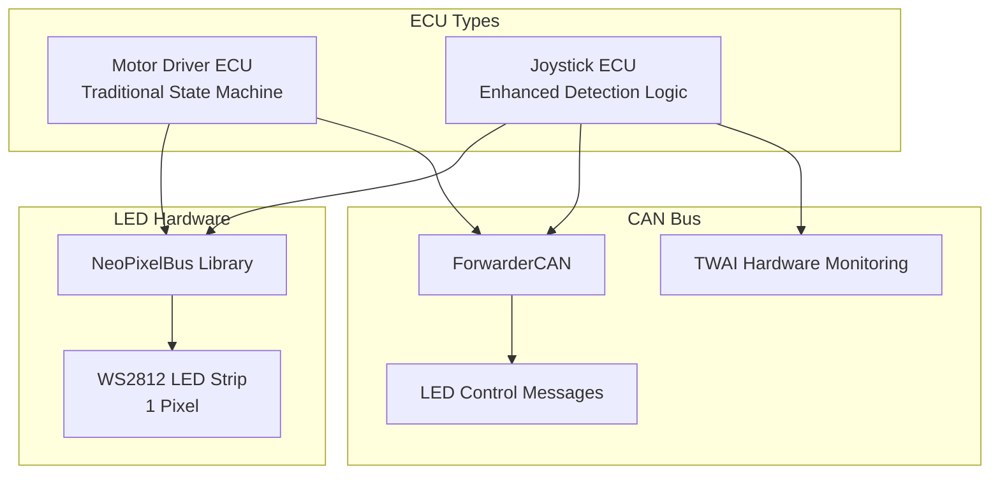
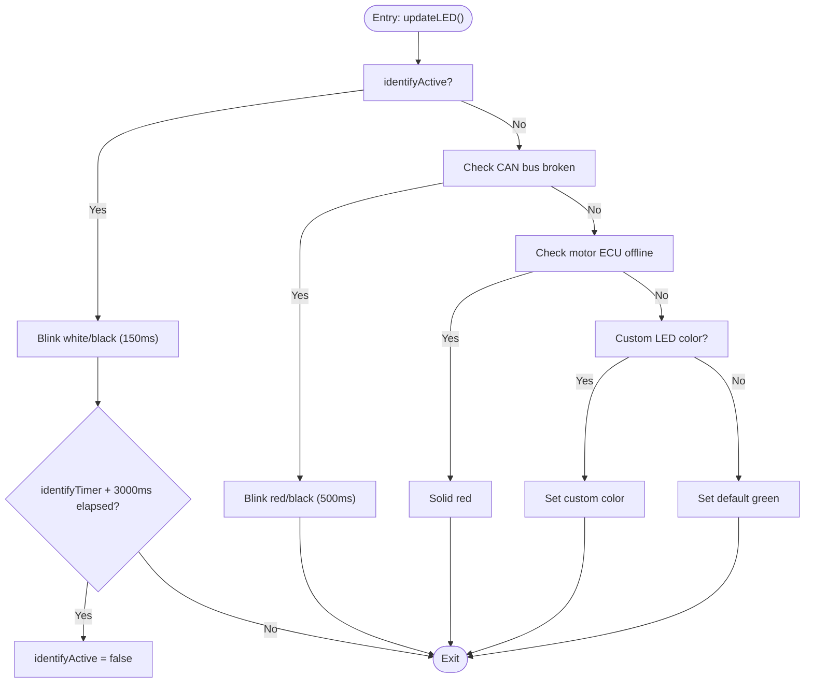
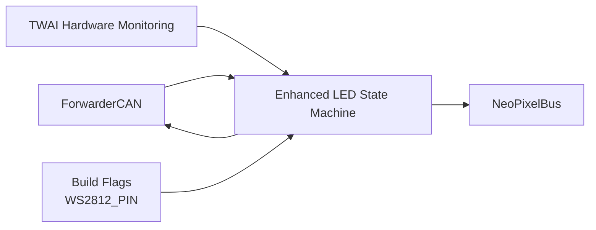

# LED Status Indicator System

<cite>
**Referenced Files in This Document**
- [README.md](file://README.md)
- [platformio.ini](file://platformio.ini)
- [src/main.cpp](file://src/main.cpp)
- [src/ecu_motor_driver.cpp](file://src/ecu_motor_driver.cpp)
- [src/ecu_motor_driver.h](file://src/ecu_motor_driver.h)
- [src/ecu_joystick.cpp](file://src/ecu_joystick.cpp)
- [src/ecu_joystick.h](file://src/ecu_joystick.h)
- [lib/ForwarderCAN/ForwarderCAN.h](file://lib/ForwarderCAN/ForwarderCAN.h)
- [lib/ForwarderConfig/ForwarderConfig.h](file://lib/ForwarderConfig/ForwarderConfig.h)
</cite>

## Update Summary
**Changes Made**
- Enhanced LED status indicator system with sophisticated detection logic for joystick ECU
- Added priority-based status patterns (identify mode, CAN bus broken, motor ECU offline)
- Implemented comprehensive TWAI hardware state monitoring with bus-off detection
- Added detailed troubleshooting guidance with priority-based status interpretation
- Updated detection algorithms for improved reliability and diagnostic capabilities

## Table of Contents
1. [Introduction](#introduction)
2. [Project Structure](#project-structure)
3. [Core Components](#core-components)
4. [Architecture Overview](#architecture-overview)
5. [Detailed Component Analysis](#detailed-component-analysis)
6. [Dependency Analysis](#dependency-analysis)
7. [Performance Considerations](#performance-considerations)
8. [Troubleshooting Guide](#troubleshooting-guide)
9. [Conclusion](#conclusion)

## Introduction
This document describes the enhanced NeoPixel LED status indicator system used by the Forwarder CAN Controller ECUs. The system now features sophisticated detection logic with priority-based status patterns, comprehensive TWAI hardware state monitoring, and detailed troubleshooting guidance. It covers RGB color management, advanced blinking patterns for operational states, identification mode functionality, and comprehensive status interpretation guidelines.

## Project Structure
The LED system is implemented in two ECU variants with enhanced detection logic:
- **Motor Driver ECU**: Uses onboard WS2812 LED for status indication with traditional state machine
- **Joystick ECU**: Enhanced with sophisticated detection logic including priority-based status patterns

Both share the same NeoPixelBus library but implement different LED state machine patterns with the joystick ECU featuring advanced bus monitoring capabilities.



**Diagram sources**
- [platformio.ini:25](file://platformio.ini#L25)
- [platformio.ini:41](file://platformio.ini#L41)
- [src/ecu_motor_driver.cpp:43](file://src/ecu_motor_driver.cpp#L43)
- [src/ecu_joystick.cpp:42](file://src/ecu_joystick.cpp#L42)
- [lib/ForwarderCAN/ForwarderCAN.h:43](file://lib/ForwarderCAN/ForwarderCAN.h#L43)

**Section sources**
- [README.md:48-62](file://README.md#L48-L62)
- [platformio.ini:17-64](file://platformio.ini#L17-L64)

## Core Components
- **NeoPixelBus initialization and pixel control** with enhanced state detection
- **Advanced LED state machine** with priority-based status patterns:
  - **Identification mode**: Flashing white for 3 seconds
  - **CAN bus broken**: Blinking red (500ms) with comprehensive hardware monitoring
  - **Motor ECU offline**: Solid red with separate timeout detection
  - **Custom LED color**: Remote control via PF_LED_COLOR messages
- **Comprehensive TWAI hardware state monitoring** including bus-off detection and error counters
- **Priority-based status interpretation** with detailed troubleshooting guidance
- **Enhanced update timing logic** with 50 ms refresh interval and sophisticated detection algorithms
- **Integration with ForwarderCAN** for online/offline detection and CAN message processing

Key implementation locations:
- **Enhanced Joystick LED logic**: [updateLED:95-144](file://src/ecu_joystick.cpp#L95-L144)
- **Motor Driver LED logic**: [updateLED:281-310](file://src/ecu_motor_driver.cpp#L281-L310)
- **CAN message processing and LED triggers**: [processCAN:161-203](file://src/ecu_joystick.cpp#L161-L203), [processCAN:312-419](file://src/ecu_motor_driver.cpp#L312-L419)
- **Enhanced detection algorithms**: [ecu_joystick.cpp:104-119](file://src/ecu_joystick.cpp#L104-L119)

**Section sources**
- [src/ecu_joystick.cpp:95-144](file://src/ecu_joystick.cpp#L95-L144)
- [src/ecu_motor_driver.cpp:281-310](file://src/ecu_motor_driver.cpp#L281-L310)
- [src/ecu_joystick.cpp:161-203](file://src/ecu_joystick.cpp#L161-L203)
- [src/ecu_motor_driver.cpp:312-419](file://src/ecu_motor_driver.cpp#L312-L419)

## Architecture Overview
The enhanced LED system integrates with sophisticated detection logic and comprehensive hardware monitoring. The update cycle runs at approximately 50 ms, with priority-based evaluation of status conditions and detailed TWAI state monitoring.

```mermaid
sequenceDiagram
participant Loop as "Main Loop"
participant LED as "updateLED()"
participant CAN as "ForwarderCAN"
participant TWAI as "TWAI Hardware"
participant Strip as "NeoPixelBus"
Loop->>LED : "Call updateLED()"
LED->>LED : "Check identifyActive"
alt "Identification Mode"
LED->>Strip : "Set white or black (150ms blink)"
else "CAN Bus Broken Detection"
LED->>CAN : "isOnline()"
LED->>TWAI : "Get TWAI status info"
TWAI-->>LED : "State, TX errors, RX errors"
LED->>LED : "Check lastAnyMsgReceived"
LED->>Strip : "Set red or black (500ms blink)"
else "Motor ECU Offline"
LED->>LED : "Check lastMotorEcuMsg timeout"
LED->>Strip : "Set red (solid)"
else "Normal Operation"
LED->>Strip : "Set custom or default color"
end
LED->>Strip : "Show()"
```

**Diagram sources**
- [src/ecu_joystick.cpp:95-144](file://src/ecu_joystick.cpp#L95-L144)
- [lib/ForwarderCAN/ForwarderCAN.h:83](file://lib/ForwarderCAN/ForwarderCAN.h#L83)

## Detailed Component Analysis

### Enhanced LED State Machine
The joystick ECU now implements a sophisticated priority-based state machine with comprehensive detection logic:

**Priority Order (Highest to Lowest):**
1. **Identification mode**: Flashing white for 3 seconds when PF_IDENTIFY received
2. **CAN bus broken**: Blinking red (500ms) with TWAI hardware monitoring
3. **Motor ECU offline**: Solid red when no messages from motor ECU (0x20) for 1+ second
4. **Custom LED color**: Remote control via PF_LED_COLOR messages
5. **Default green**: Full brightness when all systems normal



**Diagram sources**
- [src/ecu_joystick.cpp:95-144](file://src/ecu_joystick.cpp#L95-L144)

**Section sources**
- [src/ecu_joystick.cpp:95-144](file://src/ecu_joystick.cpp#L95-L144)
- [README.md:138-157](file://README.md#L138-L157)

### Enhanced TWAI Hardware State Monitoring
The joystick ECU implements comprehensive TWAI hardware state monitoring with multiple detection criteria:

**CAN Bus Broken Detection Criteria:**
1. **Message Timeout**: No CAN messages from other devices for 2+ seconds
2. **TWAI State Monitoring**: 
   - `TWAI_STATE_STOPPED` - TWAI driver stopped
   - `TWAI_STATE_BUS_OFF` - Bus-off due to errors  
   - `tx_error_counter >= 127` - High transmit error count
3. **Hardware Loopback Filtering**: Filters own messages to avoid false positives in NO_ACK mode

**Motor ECU Offline Detection:**
- No CAN messages received from source address `0x20` for more than 1 second
- Only triggers if CAN bus is NOT broken (bus check has priority)

**Section sources**
- [src/ecu_joystick.cpp:104-119](file://src/ecu_joystick.cpp#L104-L119)
- [src/ecu_joystick.cpp:138-141](file://src/ecu_joystick.cpp#L138-L141)
- [README.md:147-157](file://README.md#L147-L157)

### RGB Color Management
- **Motor Driver**: Default blue (R:0, G:0, B:20) with brightness scaling applied during updates
- **Joystick**: Default green (R:0, G:255, B:0) with brightness scaling applied during updates
- **Remote control**: CAN message PF_LED_COLOR (0x20) allows setting R, G, B values for both ECUs
- **Enhanced brightness scaling**: Joystick applies brightness factor to reduce LED intensity

Implementation references:
- **Motor Driver defaults and update**: [ecu_motor_driver.cpp:60](file://src/ecu_motor_driver.cpp#L60), [updateLED:281-310](file://src/ecu_motor_driver.cpp#L281-L310)
- **Enhanced Joystick defaults and update**: [ecu_joystick.cpp:58](file://src/ecu_joystick.cpp#L58), [updateLED:95-144](file://src/ecu_joystick.cpp#L95-L144)
- **Remote control message**: [ForwarderCAN.h](file://lib/ForwarderCAN/ForwarderCAN.h#L43)

**Section sources**
- [src/ecu_motor_driver.cpp:60](file://src/ecu_motor_driver.cpp#L60)
- [src/ecu_motor_driver.cpp:281-310](file://src/ecu_motor_driver.cpp#L281-L310)
- [src/ecu_joystick.cpp:58](file://src/ecu_joystick.cpp#L58)
- [src/ecu_joystick.cpp:95-144](file://src/ecu_joystick.cpp#L95-L144)
- [lib/ForwarderCAN/ForwarderCAN.h:43](file://lib/ForwarderCAN/ForwarderCAN.h#L43)

### Enhanced Blinking Patterns and Timings
- **Identification mode**: Alternates between white and black every 150 ms for 3 seconds
- **CAN bus broken**: Red blink every 500 ms with comprehensive hardware monitoring
- **Motor ECU offline**: Solid red (80 intensity) when no messages from motor ECU (0x20) for 1+ second
- **Update interval**: 50 ms polling in the LED update function

**Enhanced Timing References:**
- **Identification**: [ecu_joystick.cpp:121-130](file://src/ecu_joystick.cpp#L121-L130)
- **CAN bus broken**: [ecu_joystick.cpp:131-137](file://src/ecu_joystick.cpp#L131-L137)
- **Motor ECU offline**: [ecu_joystick.cpp:138-141](file://src/ecu_joystick.cpp#L138-L141)
- **Enhanced update interval**: [ecu_joystick.cpp:97](file://src/ecu_joystick.cpp#L97)

**Section sources**
- [src/ecu_joystick.cpp:121-141](file://src/ecu_joystick.cpp#L121-L141)
- [src/ecu_motor_driver.cpp:295-307](file://src/ecu_motor_driver.cpp#L295-L307)
- [src/ecu_joystick.cpp:97](file://src/ecu_joystick.cpp#L97)

### Enhanced Identification Mode
- **Triggered by CAN message PF_IDENTIFY (0x22)** addressed to broadcast or specific ECU
- **Enhanced timing**: Starts a 3-second timer with 150 ms blink interval
- **Automatic deactivation**: Identification mode deactivates automatically after 3 seconds
- **Priority override**: Takes highest priority in the state machine

**Section sources**
- [src/ecu_joystick.cpp:186-190](file://src/ecu_joystick.cpp#L186-L190)
- [src/ecu_joystick.cpp:121-130](file://src/ecu_joystick.cpp#L121-L130)

### Enhanced Update Timing Logic
- **LED update function** checks 50 ms interval before processing state changes
- **Enhanced reset logic** with automatic identification mode deactivation
- **Priority-based state evaluation** with comprehensive detection algorithms
- **Integration with main loop**: LED update called in joystick ECU main loop

**Section sources**
- [src/ecu_joystick.cpp:97](file://src/ecu_joystick.cpp#L97)
- [src/ecu_joystick.cpp:128-130](file://src/ecu_joystick.cpp#L128-L130)
- [src/ecu_joystick.cpp:307](file://src/ecu_joystick.cpp#L307)

### Enhanced Integration with Main Control Loop
- **Joystick ECU**: LED update integrated with input reading, CAN processing, and TWAI diagnostics
- **Motor Driver ECU**: LED update maintains traditional state machine approach
- **Enhanced diagnostics**: TWAI status monitoring and comprehensive bus health tracking

**Section sources**
- [src/ecu_joystick.cpp:266-307](file://src/ecu_joystick.cpp#L266-L307)
- [src/ecu_motor_driver.cpp:540-613](file://src/ecu_motor_driver.cpp#L540-L613)

### Enhanced LED Pin Configuration and NeoPixelBus Setup
- **Motor Driver**: WS2812_PIN=39 (build flag), NeoPixelBus initialized with GRB feature and 800 Kbps method
- **Enhanced Joystick**: WS2812_PIN=4 (build flag), NeoPixelBus initialized with GRB feature and 800 Kbps method
- **Library dependency**: NeoPixelBus v2.8.3 included via platformio.ini

**Section sources**
- [platformio.ini:32](file://platformio.ini#L32)
- [platformio.ini:106](file://platformio.ini#L106)
- [platformio.ini:11](file://platformio.ini#L11)
- [src/ecu_motor_driver.cpp:43](file://src/ecu_motor_driver.cpp#L43)
- [src/ecu_joystick.cpp:45](file://src/ecu_joystick.cpp#L45)

## Dependency Analysis
The enhanced LED system depends on:
- **ForwarderCAN** for online/offline state and comprehensive CAN message processing
- **NeoPixelBus** for pixel color setting and display with enhanced state detection
- **TWAI hardware monitoring** for comprehensive bus state assessment
- **Build flags** for pin configuration and ECU type selection
- **Enhanced CAN protocol definitions** for LED control messages and status interpretation



**Diagram sources**
- [lib/ForwarderCAN/ForwarderCAN.h:83](file://lib/ForwarderCAN/ForwarderCAN.h#L83)
- [platformio.ini:32](file://platformio.ini#L32)
- [platformio.ini:106](file://platformio.ini#L106)
- [src/ecu_motor_driver.cpp:43](file://src/ecu_motor_driver.cpp#L43)
- [src/ecu_joystick.cpp:45](file://src/ecu_joystick.cpp#L45)

**Section sources**
- [lib/ForwarderCAN/ForwarderCAN.h:83](file://lib/ForwarderCAN/ForwarderCAN.h#L83)
- [platformio.ini:32](file://platformio.ini#L32)
- [platformio.ini:106](file://platformio.ini#L106)
- [src/ecu_motor_driver.cpp:43](file://src/ecu_motor_driver.cpp#L43)
- [src/ecu_joystick.cpp:45](file://src/ecu_joystick.cpp#L45)

## Performance Considerations
- **Enhanced LED update** runs at ~50 ms with priority-based evaluation, minimizing CPU overhead while maintaining responsive visual feedback
- **Comprehensive TWAI monitoring** adds minimal overhead with efficient hardware state checks
- **Enhanced detection algorithms** balance accuracy with minimal CPU usage through selective monitoring
- **Priority-based status interpretation** ensures critical issues are highlighted immediately
- **Improved brightness scaling** reduces power consumption and prevents over-bright LEDs

## Troubleshooting Guide
**Enhanced LED behavior scenarios with priority-based interpretation:**

**Priority 1 - Critical Issues:**
- **Blinking red (500ms)**: CAN bus broken - check TWAI hardware state and bus connections
- **Solid red**: Motor ECU offline - verify motor ECU power and CAN wiring

**Priority 2 - System Status:**
- **Solid green**: Normal operation with CAN online and motor ECU responding
- **Flashing white**: Identification mode activation - verify remote control command delivery

**Priority 3 - Configuration:**
- **Custom RGB**: LED color overridden by PF_LED_COLOR command
- **No LED response**: Check LED wiring and power supply

**Enhanced Diagnostic Procedures:**
- **Use serial monitor** to observe TWAI status and LED behavior correlation
- **Monitor TWAI state** via serial output for bus errors and hardware issues
- **Filter own messages** to avoid false positives in NO_ACK mode
- **Verify build flags** for correct WS2812_PIN assignment
- **Test with known-good LED strip** to eliminate hardware faults

**Section sources**
- [src/ecu_joystick.cpp:131-141](file://src/ecu_joystick.cpp#L131-L141)
- [src/ecu_motor_driver.cpp:295-307](file://src/ecu_motor_driver.cpp#L295-L307)
- [src/ecu_joystick.cpp:186-190](file://src/ecu_joystick.cpp#L186-L190)
- [README.md:126-157](file://README.md#L126-L157)

## Conclusion
The enhanced NeoPixel LED status indicator system provides sophisticated, priority-based visual feedback across both ECU variants. The joystick ECU now features comprehensive TWAI hardware state monitoring, priority-based status interpretation, and detailed troubleshooting guidance. The enhanced detection algorithms ensure critical issues are highlighted immediately while maintaining clear status representation for normal operation. The system integrates seamlessly with the CAN bus and provides comprehensive diagnostic capabilities through serial monitoring and LED pattern interpretation.