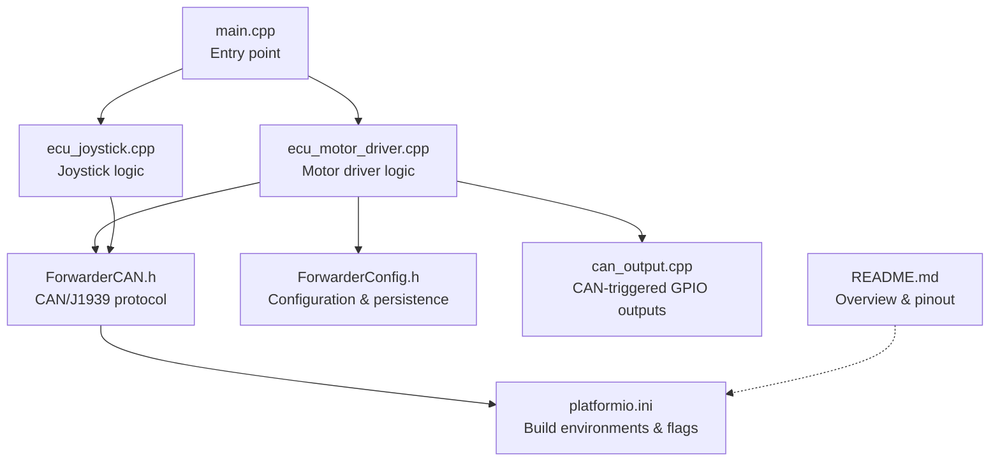
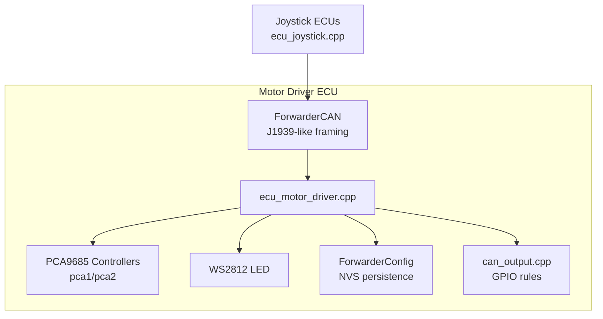
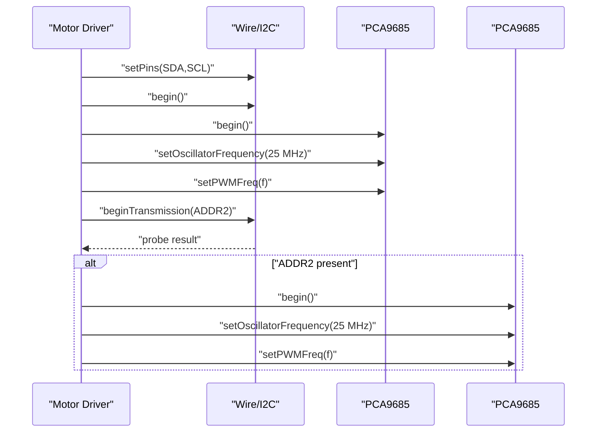
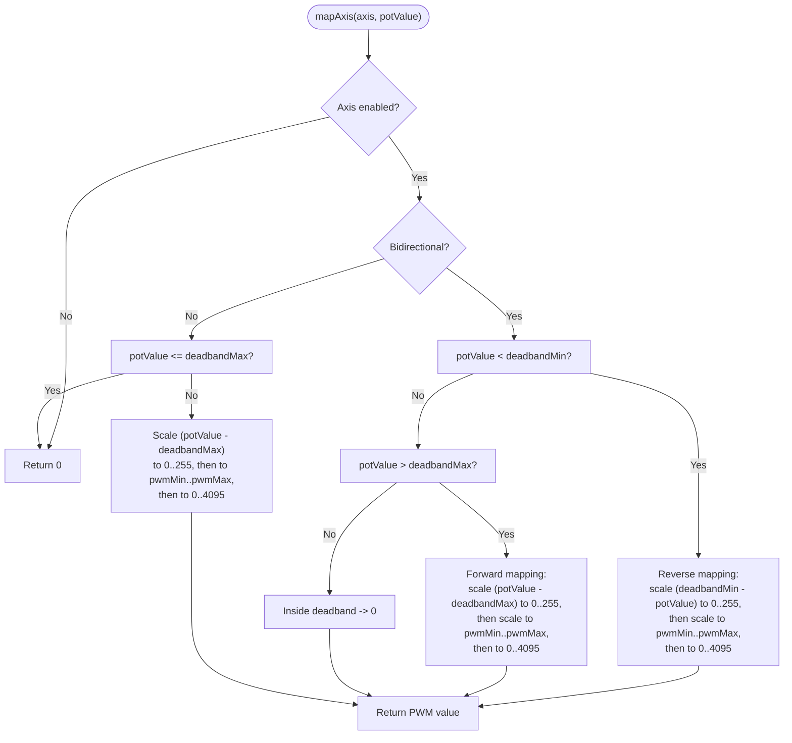
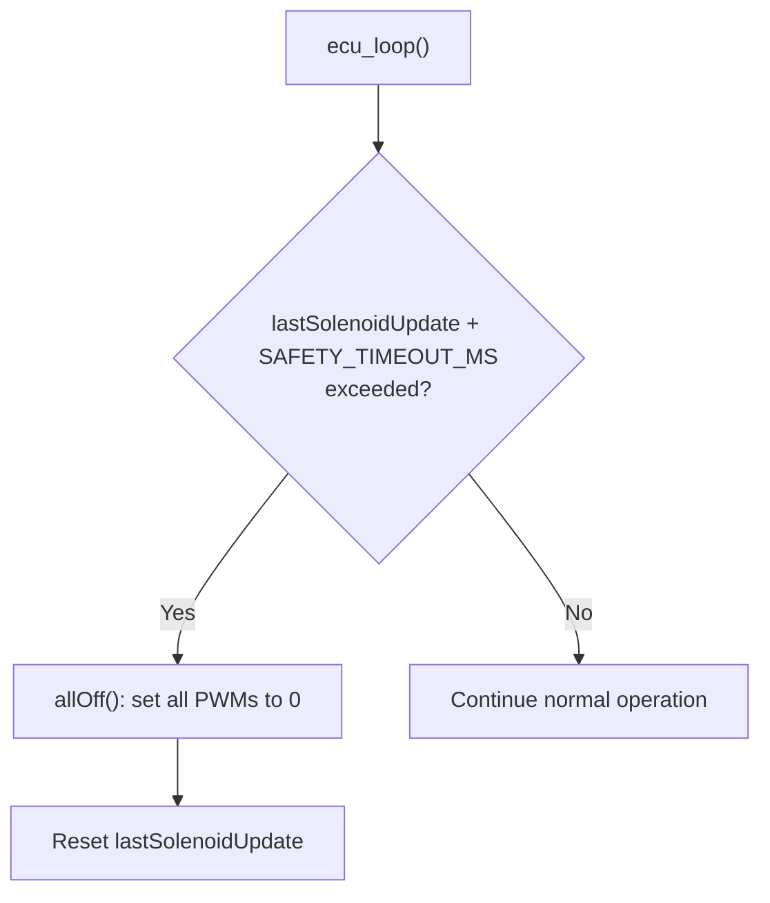
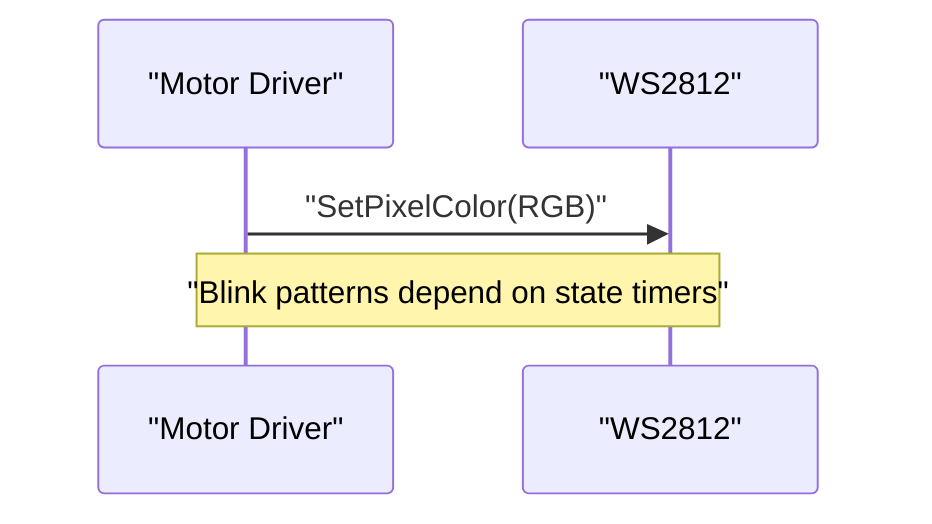
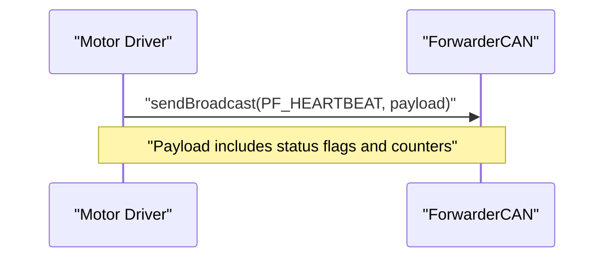
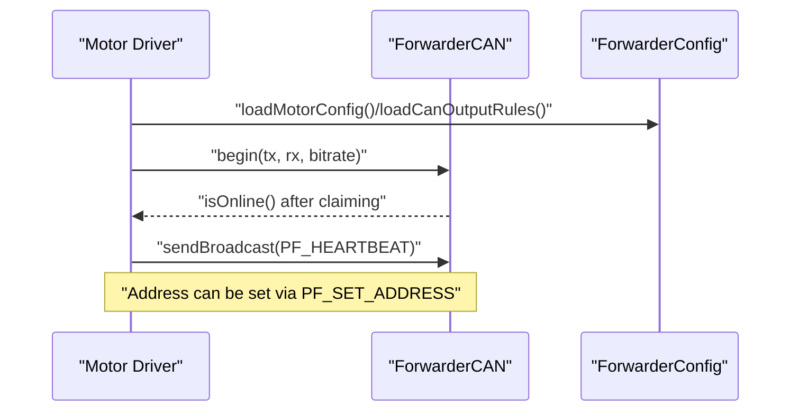
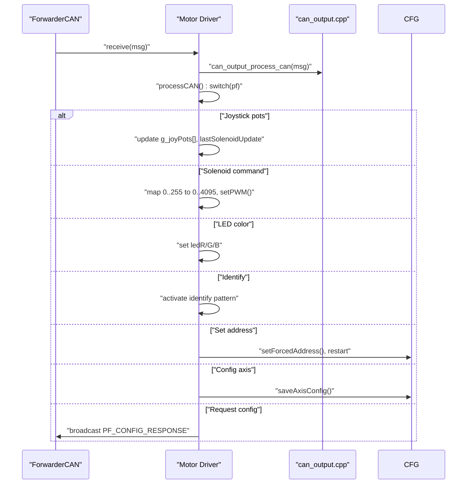
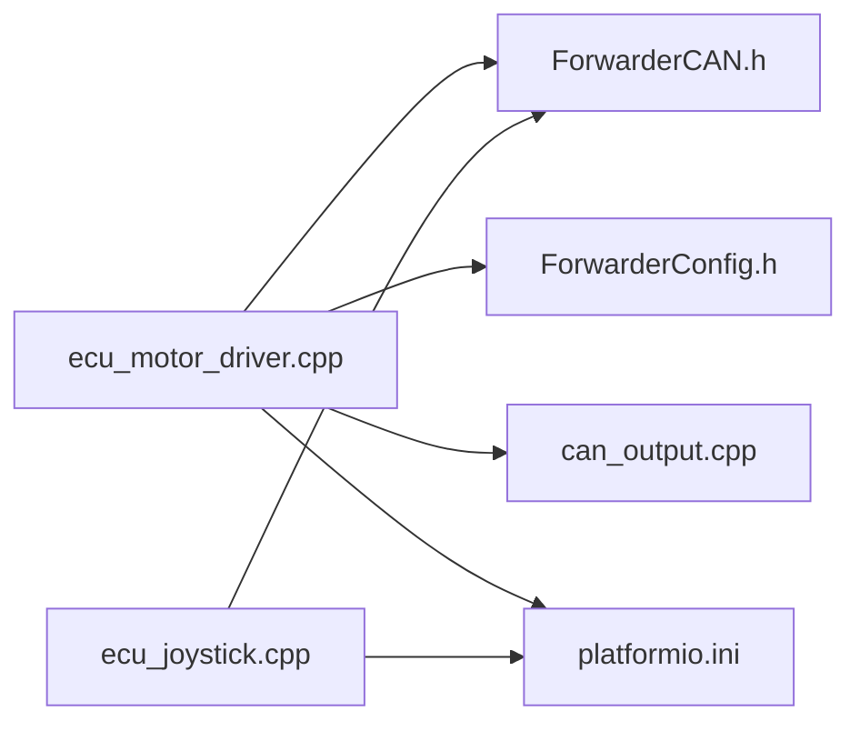

# Motor Driver ECU

<cite>
**Referenced Files in This Document**
- [main.cpp](file://src/main.cpp)
- [ecu_motor_driver.cpp](file://src/ecu_motor_driver.cpp)
- [ecu_motor_driver.h](file://src/ecu_motor_driver.h)
- [ecu_joystick.cpp](file://src/ecu_joystick.cpp)
- [ecu_joystick.h](file://src/ecu_joystick.h)
- [can_output.cpp](file://src/can_output.cpp)
- [can_output.h](file://src/can_output.h)
- [ForwarderCAN.h](file://lib/ForwarderCAN/ForwarderCAN.h)
- [ForwarderConfig.h](file://lib/ForwarderConfig/ForwarderConfig.h)
- [platformio.ini](file://platformio.ini)
- [README.md](file://README.md)
</cite>

## Table of Contents
1. [Introduction](#introduction)
2. [Project Structure](#project-structure)
3. [Core Components](#core-components)
4. [Architecture Overview](#architecture-overview)
5. [Detailed Component Analysis](#detailed-component-analysis)
6. [Dependency Analysis](#dependency-analysis)
7. [Performance Considerations](#performance-considerations)
8. [Troubleshooting Guide](#troubleshooting-guide)
9. [Conclusion](#conclusion)
10. [Appendices](#appendices)

## Introduction
This document describes the Motor Driver ECU implementation responsible for controlling solenoids via PCA9685 PWM drivers and managing CAN bus communications. It covers PCA9685 initialization and dual-controller support, the PWM mapping algorithm for converting joystick inputs to solenoid actuation signals (including bidirectional axes and deadband handling), the safety timeout mechanism, LED status indicators, heartbeat messages, address claiming, configuration persistence, and CAN message processing for joystick data, solenoid commands, and LED control. Practical examples and troubleshooting guidance are included for common issues such as solenoid sticking and communication failures.

## Project Structure
The project is organized around an ESP32-S3-based firmware with separate ECUs for motor control and joystick input. The build system uses PlatformIO environments to configure hardware pins, addresses, and features per ECU type.

**Diagram sources**
- [main.cpp:19-31](file://src/main.cpp#L19-L31)
- [ecu_motor_driver.cpp:290-325](file://src/ecu_motor_driver.cpp#L290-L325)
- [ecu_joystick.cpp:159-192](file://src/ecu_joystick.cpp#L159-L192)
- [ForwarderCAN.h:66-120](file://lib/ForwarderCAN/ForwarderCAN.h#L66-L120)
- [ForwarderConfig.h:64-92](file://lib/ForwarderConfig/ForwarderConfig.h#L64-L92)
- [can_output.cpp:7-19](file://src/can_output.cpp#L7-L19)
- [platformio.ini:17-30](file://platformio.ini#L17-L30)
- [README.md:105-111](file://README.md#L105-L111)

**Section sources**
- [main.cpp:19-31](file://src/main.cpp#L19-L31)
- [platformio.ini:17-30](file://platformio.ini#L17-L30)
- [README.md:105-111](file://README.md#L105-L111)

## Core Components
- PCA9685 PWM controllers: Two PCA9685 chips (primary and optional secondary) drive up to 16 channels (8 per PCA9685). Initialization sets oscillator frequency and PWM frequency, with automatic detection of the second controller.
- Joystick-to-solenoid mapping: Axis configuration defines source joystick address, pot index, output channel, deadbands, and PWM range. The mapping algorithm converts 10-bit joystick values to 12-bit PWM values with bidirectional support and deadband logic.
- Safety timeout: If no joystick or solenoid command is received within the configured timeout, all solenoids are turned off.
- LED status indicator: Single WS2812 LED indicates connection status, activity, identification mode, and custom colors.
- Heartbeat messages: Periodic broadcast of system health metrics and CAN statistics.
- Address claiming and configuration persistence: J1939-style address claiming, persistent storage of forced address and axis configurations, and CAN output rules.

**Section sources**
- [ecu_motor_driver.cpp:85-99](file://src/ecu_motor_driver.cpp#L85-L99)
- [ecu_motor_driver.cpp:101-135](file://src/ecu_motor_driver.cpp#L101-L135)
- [ecu_motor_driver.cpp:332-337](file://src/ecu_motor_driver.cpp#L332-L337)
- [ecu_motor_driver.cpp:153-182](file://src/ecu_motor_driver.cpp#L153-L182)
- [ecu_motor_driver.cpp:277-288](file://src/ecu_motor_driver.cpp#L277-L288)
- [ForwarderCAN.h:66-120](file://lib/ForwarderCAN/ForwarderCAN.h#L66-L120)
- [ForwarderConfig.h:64-92](file://lib/ForwarderConfig/ForwarderConfig.h#L64-L92)

## Architecture Overview
The Motor Driver ECU integrates CAN communication, configuration management, PCA9685 PWM control, and status reporting. It receives joystick data and solenoid commands over CAN, applies mapping rules, drives solenoids, and periodically reports health metrics.

**Diagram sources**
- [ecu_motor_driver.cpp:290-325](file://src/ecu_motor_driver.cpp#L290-L325)
- [ecu_motor_driver.cpp:85-99](file://src/ecu_motor_driver.cpp#L85-L99)
- [ecu_motor_driver.cpp:153-182](file://src/ecu_motor_driver.cpp#L153-L182)
- [ecu_motor_driver.cpp:277-288](file://src/ecu_motor_driver.cpp#L277-L288)
- [ForwarderConfig.h:64-92](file://lib/ForwarderConfig/ForwarderConfig.h#L64-L92)
- [ForwarderCAN.h:66-120](file://lib/ForwarderCAN/ForwarderCAN.h#L66-L120)
- [can_output.cpp:7-19](file://src/can_output.cpp#L7-L19)
- [ecu_joystick.cpp:159-192](file://src/ecu_joystick.cpp#L159-L192)

## Detailed Component Analysis

### PCA9685 Initialization and Dual-Controller Support
- I2C pins are configured and Wire is initialized.
- Primary PCA9685 is started, oscillator frequency is set, and PWM frequency is configured.
- A secondary PCA9685 is probed at the alternate I2C address. If present, it is initialized similarly.
- PWM values are written to the appropriate controller based on channel number.

**Diagram sources**
- [ecu_motor_driver.cpp:85-99](file://src/ecu_motor_driver.cpp#L85-L99)

**Section sources**
- [ecu_motor_driver.cpp:85-99](file://src/ecu_motor_driver.cpp#L85-L99)
- [platformio.ini:26-29](file://platformio.ini#L26-L29)

### PWM Mapping Algorithm: Joystick to Solenoid Signals
The mapping converts 10-bit joystick values to 12-bit PWM values with support for:
- Bidirectional axes: separate forward and reverse mappings with deadband logic.
- Deadband calculation: linear scaling from raw ADC to PWM with clamping.
- Non-bidirectional axes: single-direction mapping above deadband max.

**Diagram sources**
- [ecu_motor_driver.cpp:101-135](file://src/ecu_motor_driver.cpp#L101-L135)

**Section sources**
- [ecu_motor_driver.cpp:101-135](file://src/ecu_motor_driver.cpp#L101-L135)
- [ForwarderConfig.h:41-57](file://lib/ForwarderConfig/ForwarderConfig.h#L41-L57)

### Safety Timeout Mechanism
If no joystick or solenoid command is received within the safety timeout, the system turns off all solenoids and resets the update timer.

**Diagram sources**
- [ecu_motor_driver.cpp:332-337](file://src/ecu_motor_driver.cpp#L332-L337)

**Section sources**
- [ecu_motor_driver.cpp:332-337](file://src/ecu_motor_driver.cpp#L332-L337)
- [platformio.ini:29](file://platformio.ini#L29)

### LED Status Indicator System
The onboard LED reflects:
- Identification mode: blinking white pattern for 3 seconds upon request.
- Offline state: blinking red pattern when CAN is not online.
- Activity blink: brief fast blink on joystick or solenoid updates.
- Custom color: set via CAN LED_COLOR message.

**Diagram sources**
- [ecu_motor_driver.cpp:153-182](file://src/ecu_motor_driver.cpp#L153-L182)

**Section sources**
- [ecu_motor_driver.cpp:153-182](file://src/ecu_motor_driver.cpp#L153-L182)

### Heartbeat Message Generation
Every second, the ECU broadcasts a heartbeat containing:
- Online status flag
- Uptime seconds
- RX/TX counters
- Channel count (8 or 16)
- PCA count

**Diagram sources**
- [ecu_motor_driver.cpp:277-288](file://src/ecu_motor_driver.cpp#L277-L288)

**Section sources**
- [ecu_motor_driver.cpp:277-288](file://src/ecu_motor_driver.cpp#L277-L288)

### Address Claiming Process and Configuration Persistence
- Address claiming follows J1939-like semantics with broadcast requests and claimed notifications.
- Persistent storage holds the forced address and axis configurations.
- CAN messages support setting address, requesting/receiving axis configuration, and LED control.

**Diagram sources**
- [ecu_motor_driver.cpp:290-325](file://src/ecu_motor_driver.cpp#L290-L325)
- [ForwarderCAN.h:66-120](file://lib/ForwarderCAN/ForwarderCAN.h#L66-L120)
- [ForwarderConfig.h:64-92](file://lib/ForwarderConfig/ForwarderConfig.h#L64-L92)

**Section sources**
- [ForwarderCAN.h:66-120](file://lib/ForwarderCAN/ForwarderCAN.h#L66-L120)
- [ForwarderConfig.h:64-92](file://lib/ForwarderConfig/ForwarderConfig.h#L64-L92)
- [ecu_motor_driver.cpp:234-267](file://src/ecu_motor_driver.cpp#L234-L267)

### CAN Message Processing
Processing pipeline:
- Receive messages and dispatch to CAN output rules.
- Handle joystick pots, solenoid commands, LED color, identify, set address, axis configuration, and heartbeat requests.

**Diagram sources**
- [ecu_motor_driver.cpp:184-275](file://src/ecu_motor_driver.cpp#L184-L275)
- [can_output.cpp:29-49](file://src/can_output.cpp#L29-L49)

**Section sources**
- [ecu_motor_driver.cpp:184-275](file://src/ecu_motor_driver.cpp#L184-L275)
- [can_output.cpp:29-49](file://src/can_output.cpp#L29-L49)

### Practical Examples

#### Axis Configuration Example
- Source address: joystick SA (e.g., 0x21)
- Pot index: 0 for X-axis, 1 for Y-axis, 2 for Z-axis
- Output channel: 0–15 (first PCA9685 channels 0–7; second PCA9685 channels 0–7 if present)
- Deadband min/max: ADC thresholds (0–1023) mapped from 0–255 in configuration
- PWM min/max: 0–255 mapped to 0–4095 for 12-bit output

These are stored persistently and applied during mapping.

**Section sources**
- [ForwarderConfig.h:41-57](file://lib/ForwarderConfig/ForwarderConfig.h#L41-L57)
- [ecu_motor_driver.cpp:137-151](file://src/ecu_motor_driver.cpp#L137-L151)

#### PWM Frequency Settings
- PCA9685 frequency is set during initialization. The default is configured in the build flags and applied at runtime.

**Section sources**
- [ecu_motor_driver.cpp:89-96](file://src/ecu_motor_driver.cpp#L89-L96)
- [platformio.ini:13](file://platformio.ini#L13)

#### Troubleshooting Procedures
- Solenoid sticking:
  - Verify safety timeout is not triggering by ensuring joystick or solenoid commands are received regularly.
  - Confirm mapping deadband settings are appropriate for the joystick range.
- Communication failures:
  - Check CAN bus wiring and termination.
  - Confirm address claiming succeeded and the device is online.
  - Inspect heartbeat messages and RX/TX counters for anomalies.
- LED diagnostics:
  - Blinking red indicates offline state.
  - Fast blinking indicates recent activity.
  - Identification mode toggles white periodically.

**Section sources**
- [ecu_motor_driver.cpp:332-337](file://src/ecu_motor_driver.cpp#L332-L337)
- [ecu_motor_driver.cpp:153-182](file://src/ecu_motor_driver.cpp#L153-L182)
- [ecu_motor_driver.cpp:277-288](file://src/ecu_motor_driver.cpp#L277-L288)
- [README.md:105-111](file://README.md#L105-L111)

## Dependency Analysis
The Motor Driver ECU depends on shared libraries for CAN/J1939 framing and configuration persistence. Build flags configure hardware pins, addresses, and features per environment.

**Diagram sources**
- [ecu_motor_driver.cpp:1-12](file://src/ecu_motor_driver.cpp#L1-L12)
- [ecu_joystick.cpp:1-9](file://src/ecu_joystick.cpp#L1-L9)
- [ForwarderCAN.h:66-120](file://lib/ForwarderCAN/ForwarderCAN.h#L66-L120)
- [ForwarderConfig.h:64-92](file://lib/ForwarderConfig/ForwarderConfig.h#L64-L92)
- [can_output.cpp:1-5](file://src/can_output.cpp#L1-L5)
- [platformio.ini:17-30](file://platformio.ini#L17-L30)

**Section sources**
- [ecu_motor_driver.cpp:1-12](file://src/ecu_motor_driver.cpp#L1-L12)
- [ecu_joystick.cpp:1-9](file://src/ecu_joystick.cpp#L1-L9)
- [platformio.ini:17-30](file://platformio.ini#L17-L30)

## Performance Considerations
- PWM frequency and oscillator settings are fixed at initialization; adjust via build flags if needed.
- CAN message processing is event-driven; keep payload sizes minimal to reduce overhead.
- LED updates are throttled to ~20 Hz to avoid excessive CPU usage.
- Safety timeout prevents indefinite actuation; tune timeout based on application needs.

[No sources needed since this section provides general guidance]

## Troubleshooting Guide
- CAN initialization failure:
  - The device blinks a red pattern and loops until fixed. Verify wiring and transceiver enable pin if applicable.
- Address conflicts:
  - Address claiming state machine handles arbitration; check logs for claiming attempts and state transitions.
- Stuck solenoids:
  - Ensure joystick commands are being received; otherwise, the safety timeout will turn them off.
- LED not responding:
  - Confirm WS2812 pin configuration matches hardware and that the device is powered.

**Section sources**
- [ecu_motor_driver.cpp:306-316](file://src/ecu_motor_driver.cpp#L306-L316)
- [ForwarderCAN.h:74-83](file://lib/ForwarderCAN/ForwarderCAN.h#L74-L83)
- [ecu_motor_driver.cpp:332-337](file://src/ecu_motor_driver.cpp#L332-L337)
- [platformio.ini:25](file://platformio.ini#L25)

## Conclusion
The Motor Driver ECU provides a robust, configurable solution for solenoid control via PCA9685 PWM drivers, integrated with a J1939-like CAN protocol. Its features include bidirectional axis mapping with deadband handling, automatic safety shutoff, status LEDs, periodic heartbeats, address claiming, and persistent configuration. The documented APIs and examples enable straightforward setup, tuning, and maintenance.

[No sources needed since this section summarizes without analyzing specific files]

## Appendices

### CAN Protocol Summary
- Joystick pots: PF 0x10–0x12, broadcast from joystick to all.
- Solenoid command: PF 0x21, addressed to motor driver.
- LED color: PF 0x20, addressed to target ECU.
- Identify: PF 0x22, broadcast or addressed.
- Set address: PF 0x23, addressed to target ECU.
- Config axis: PF 0x24, addressed to target ECU.
- Request config: PF 0x25, addressed to target ECU.
- Config response: PF 0x26, broadcast from target ECU.
- Heartbeat: PF 0x30, broadcast.

**Section sources**
- [README.md:29-42](file://README.md#L29-L42)
- [ForwarderCAN.h:38-50](file://lib/ForwarderCAN/ForwarderCAN.h#L38-L50)