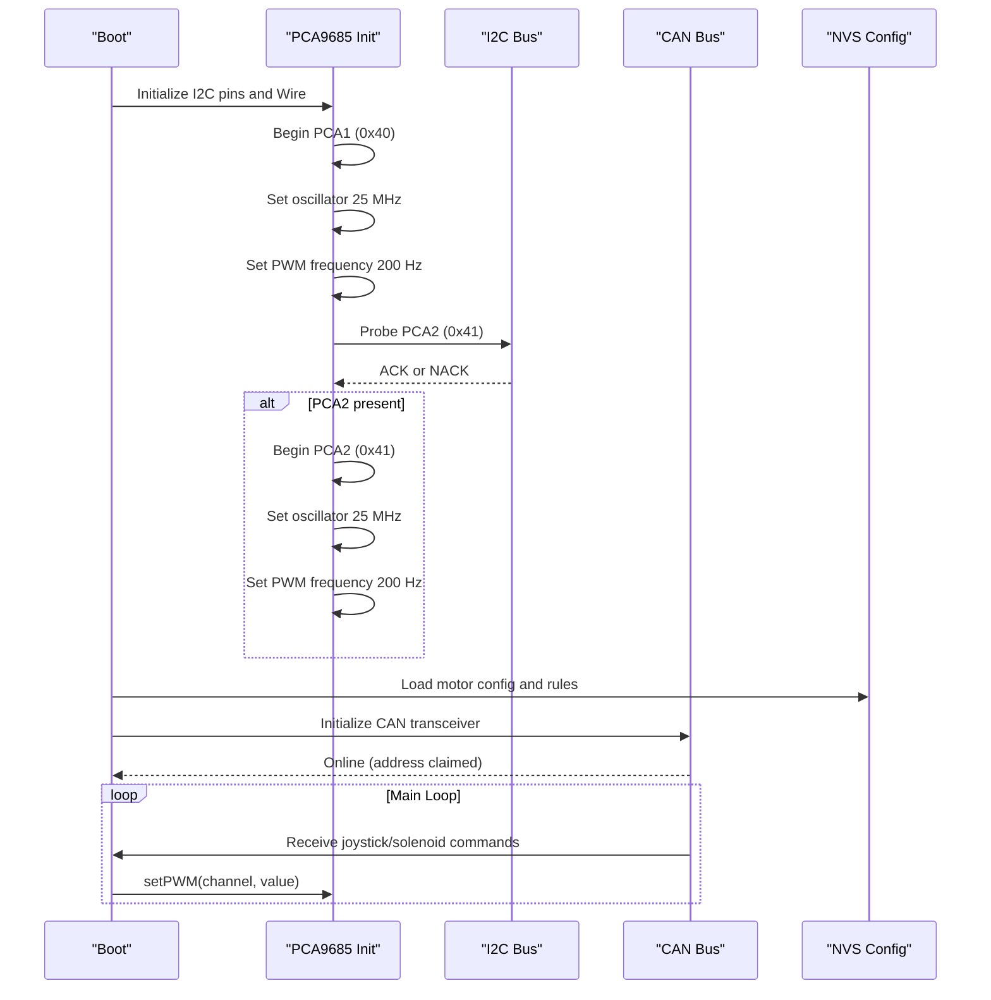
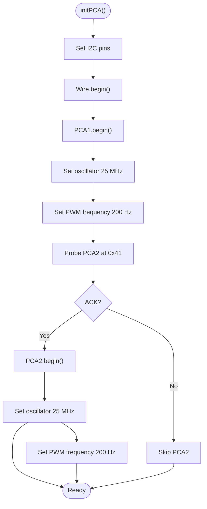
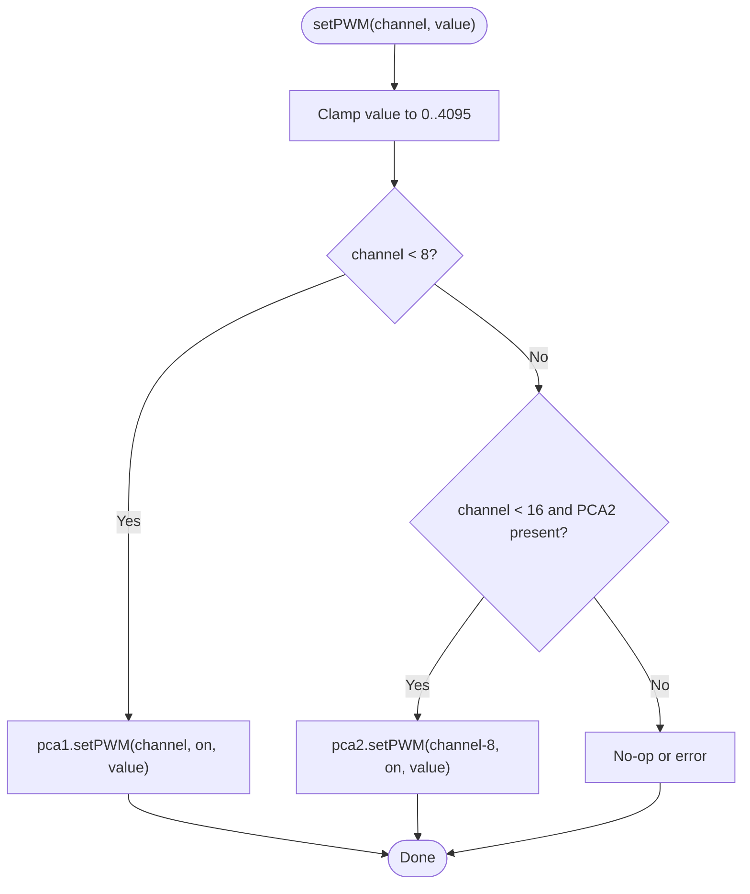
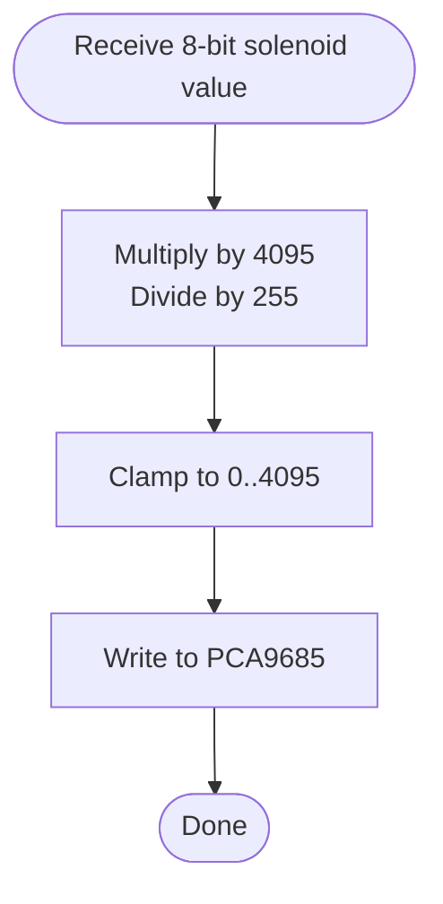
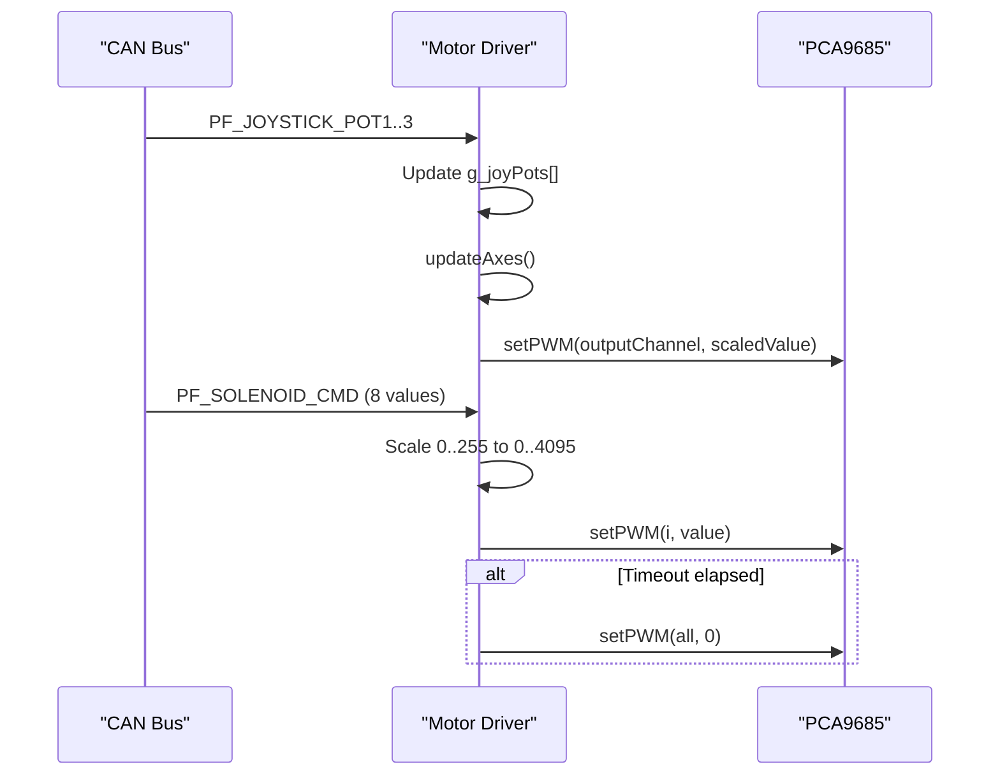
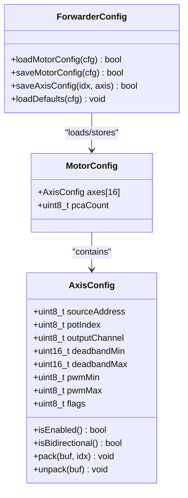
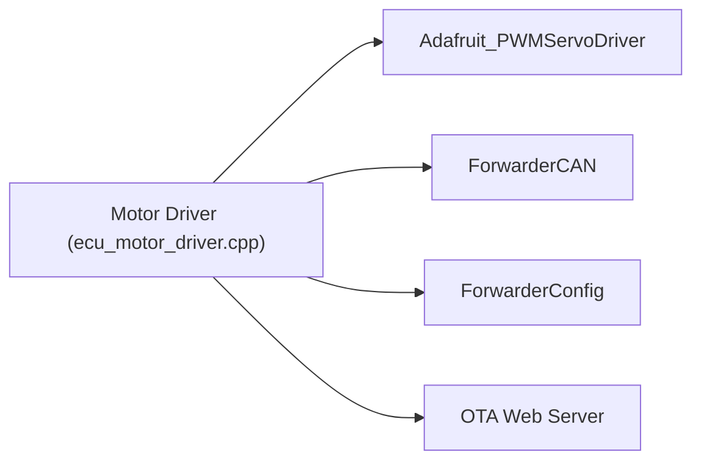

# PCA9685 PWM Control

<cite>
**Referenced Files in This Document**
- [README.md](file://README.md)
- [platformio.ini](file://platformio.ini)
- [main.cpp](file://src/main.cpp)
- [ecu_motor_driver.cpp](file://src/ecu_motor_driver.cpp)
- [ecu_motor_driver.h](file://src/ecu_motor_driver.h)
- [ForwarderConfig.h](file://lib/ForwarderConfig/ForwarderConfig.h)
- [ForwarderConfig.cpp](file://lib/ForwarderConfig/ForwarderConfig.cpp)
- [ForwarderCAN.h](file://lib/ForwarderCAN/ForwarderCAN.h)
- [ForwarderCAN.cpp](file://lib/ForwarderCAN/ForwarderCAN.cpp)
- [can_output.cpp](file://src/can_output.cpp)
- [can_output.h](file://src/can_output.h)
</cite>

## Table of Contents
1. [Introduction](#introduction)
2. [Project Structure](#project-structure)
3. [Core Components](#core-components)
4. [Architecture Overview](#architecture-overview)
5. [Detailed Component Analysis](#detailed-component-analysis)
6. [Dependency Analysis](#dependency-analysis)
7. [Performance Considerations](#performance-considerations)
8. [Troubleshooting Guide](#troubleshooting-guide)
9. [Conclusion](#conclusion)

## Introduction
This document describes the PCA9685 PWM control subsystem used by the motor driver ECU to control up to 16 solenoids via two PCA9685 controllers. It explains the dual-controller architecture, I2C initialization sequence, oscillator and PWM frequency configuration, channel mapping logic, and safety mechanisms. Practical examples illustrate channel allocation, PWM value scaling, and troubleshooting steps for I2C and channel conflicts.

## Project Structure
The motor driver ECU integrates:
- I2C PCA9685 drivers for solenoid control
- CAN bus for joystick-to-solenoid mapping and configuration
- Non-volatile storage for runtime configuration
- Optional OTA web server for firmware updates

```mermaid
graph TB
MCU["ESP32-S3 MCU"]
I2C["I2C Bus"]
PCA1["PCA9685 Controller 1<br/>I2C 0x40"]
PCA2["PCA9685 Controller 2<br/>I2C 0x41 (optional)"]
SOL1["Solenoids 0-7"]
SOL2["Solenoids 8-15"]
CAN["CAN Transceiver"]
JOY["Joystick ECUs"]
CFG["NVS Config Store"]
OTA["OTA Web Server"]
MCU --> I2C
I2C --> PCA1
I2C --> PCA2
PCA1 --> SOL1
PCA2 --> SOL2
MCU --> CAN
JOY --> CAN
CFG <- --> MCU
OTA --> MCU
```

**Diagram sources**
- [ecu_motor_driver.cpp:38-41](file://src/ecu_motor_driver.cpp#L38-L41)
- [ecu_motor_driver.cpp:85-99](file://src/ecu_motor_driver.cpp#L85-L99)
- [platformio.ini:25-29](file://platformio.ini#L25-L29)
- [README.md:18-21](file://README.md#L18-L21)

**Section sources**
- [README.md:106-131](file://README.md#L106-L131)
- [platformio.ini:17-30](file://platformio.ini#L17-L30)

## Core Components
- Dual PCA9685 controllers:
  - Primary controller at I2C address 0x40
  - Secondary controller at I2C address 0x41, auto-detected
- I2C pins configured via build flags or defaults
- Oscillator frequency set to 25 MHz
- PWM frequency set to 200 Hz
- Channel mapping supports 16 channels (0–15) across two PCA9685 units
- Safety timeout disables solenoids after 500 ms without CAN commands

**Section sources**
- [ecu_motor_driver.cpp:25-31](file://src/ecu_motor_driver.cpp#L25-L31)
- [ecu_motor_driver.cpp:38-41](file://src/ecu_motor_driver.cpp#L38-L41)
- [ecu_motor_driver.cpp:85-99](file://src/ecu_motor_driver.cpp#L85-L99)
- [ecu_motor_driver.cpp:32-34](file://src/ecu_motor_driver.cpp#L32-L34)

## Architecture Overview
The motor driver initializes I2C, probes for a second PCA9685, configures both controllers, and listens for CAN messages to update solenoid outputs. Configuration is stored in NVS and can be updated via CAN.



**Diagram sources**
- [ecu_motor_driver.cpp:85-99](file://src/ecu_motor_driver.cpp#L85-L99)
- [ecu_motor_driver.cpp:290-325](file://src/ecu_motor_driver.cpp#L290-L325)
- [ForwarderCAN.cpp:13-52](file://lib/ForwarderCAN/ForwarderCAN.cpp#L13-L52)
- [ForwarderConfig.cpp:76-104](file://lib/ForwarderConfig/ForwarderConfig.cpp#L76-L104)

## Detailed Component Analysis

### Dual PCA9685 Controller Initialization
- I2C pins are configured via build flags or defaults.
- PCA1 is initialized first with oscillator frequency 25 MHz and PWM frequency 200 Hz.
- PCA2 is probed at address 0x41; if acknowledged, it is initialized similarly.
- A global flag tracks whether PCA2 is present.



**Diagram sources**
- [ecu_motor_driver.cpp:85-99](file://src/ecu_motor_driver.cpp#L85-L99)

**Section sources**
- [ecu_motor_driver.cpp:85-99](file://src/ecu_motor_driver.cpp#L85-L99)
- [platformio.ini:25-29](file://platformio.ini#L25-L29)

### Channel Mapping and setPWM Implementation
- Each solenoid is mapped to an output channel 0–15.
- Channels 0–7 are routed to PCA1; channels 8–15 are routed to PCA2 if present.
- The setPWM function enforces a 16-bit duty value clamped to 0–4095 and calls the appropriate PCA controller.



**Diagram sources**
- [ecu_motor_driver.cpp:69-76](file://src/ecu_motor_driver.cpp#L69-L76)

**Section sources**
- [ecu_motor_driver.cpp:69-76](file://src/ecu_motor_driver.cpp#L69-L76)
- [ForwarderConfig.h:43](file://lib/ForwarderConfig/ForwarderConfig.h#L43)

### PWM Value Scaling: 8-bit to 16-bit Resolution
- CAN solenoid commands carry 8-bit values (0–255).
- These are scaled to 16-bit (0–4095) before writing to PCA9685:
  - value_16bit = (value_8bit × 4095) / 255
- Axis mapping also scales 8-bit PWM limits to 16-bit internally.



**Diagram sources**
- [ecu_motor_driver.cpp:209-211](file://src/ecu_motor_driver.cpp#L209-L211)

**Section sources**
- [ecu_motor_driver.cpp:209-211](file://src/ecu_motor_driver.cpp#L209-L211)

### CAN Integration and Safety Timeout
- On receipt of joystick potentiometer values, the motor driver updates solenoid targets and writes PWM values.
- A safety timeout disables all solenoids if no solenoid command is received within the configured interval (default 500 ms).



**Diagram sources**
- [ecu_motor_driver.cpp:184-275](file://src/ecu_motor_driver.cpp#L184-L275)
- [ecu_motor_driver.cpp:332-337](file://src/ecu_motor_driver.cpp#L332-L337)

**Section sources**
- [ecu_motor_driver.cpp:184-275](file://src/ecu_motor_driver.cpp#L184-L275)
- [ecu_motor_driver.cpp:332-337](file://src/ecu_motor_driver.cpp#L332-L337)

### Configuration and Axis Mapping
- Axis configuration defines:
  - Source joystick address and pot index (0–2 for three pots)
  - Output channel (0–15)
  - Deadband thresholds and PWM min/max (scaled to 16-bit internally)
- Stored in NVS and can be updated via CAN.



**Diagram sources**
- [ForwarderConfig.h:41-62](file://lib/ForwarderConfig/ForwarderConfig.h#L41-L62)
- [ForwarderConfig.cpp:76-104](file://lib/ForwarderConfig/ForwarderConfig.cpp#L76-L104)

**Section sources**
- [ForwarderConfig.h:41-62](file://lib/ForwarderConfig/ForwarderConfig.h#L41-L62)
- [ForwarderConfig.cpp:76-104](file://lib/ForwarderConfig/ForwarderConfig.cpp#L76-L104)

### Practical Examples

- Channel allocation example:
  - Axis 0: source joystick 0x21, pot 0 → output channel 0 (PCA1 ch0)
  - Axis 1: source joystick 0x21, pot 1 → output channel 8 (PCA2 ch0)
  - Axis 2: source joystick 0x22, pot 2 → output channel 15 (PCA2 ch7)

- PWM scaling example:
  - Input: 127 (8-bit)
  - Calculation: (127 × 4095) / 255 = 2047 (16-bit)
  - setPWM(channel, 2047)

- Address detection:
  - PCA1 at 0x40 is always assumed.
  - PCA2 at 0x41 is detected via I2C probe; if absent, only 8 channels are used.

**Section sources**
- [ecu_motor_driver.cpp:69-76](file://src/ecu_motor_driver.cpp#L69-L76)
- [ecu_motor_driver.cpp:209-211](file://src/ecu_motor_driver.cpp#L209-L211)
- [ecu_motor_driver.cpp:85-99](file://src/ecu_motor_driver.cpp#L85-L99)

## Dependency Analysis
- The motor driver depends on:
  - Adafruit PWM Servo Driver library for PCA9685 control
  - ForwarderCAN for J1939-like CAN messaging
  - ForwarderConfig for persistent configuration
  - Optional OTA web server for firmware updates



**Diagram sources**
- [ecu_motor_driver.cpp:5-12](file://src/ecu_motor_driver.cpp#L5-L12)
- [platformio.ini:9-11](file://platformio.ini#L9-L11)

**Section sources**
- [ecu_motor_driver.cpp:5-12](file://src/ecu_motor_driver.cpp#L5-L12)
- [platformio.ini:9-11](file://platformio.ini#L9-L11)

## Performance Considerations
- PWM frequency 200 Hz is suitable for solenoid control; higher frequencies reduce audible noise but increase switching losses.
- I2C bus speed is not explicitly configured; ensure pull-ups and cable lengths are appropriate for reliable operation.
- CAN message processing updates solenoids promptly; avoid excessive CAN traffic to prevent latency.
- Safety timeout prevents unintended actuation; tune SAFETY_TIMEOUT_MS per application needs.

[No sources needed since this section provides general guidance]

## Troubleshooting Guide

- I2C communication failure:
  - Verify I2C pins (SDA/SCL) match hardware and build flags.
  - Confirm PCA9685 addresses (0x40 and 0x41) are not conflicting with other devices.
  - Check pull-up resistors and wiring integrity.

- PCA2 not detected:
  - Ensure the second PCA9685 is physically connected and powered.
  - Confirm address jumpers or solder bridges are set for 0x41.
  - Review initialization logs indicating PCA2 presence.

- Channel conflicts:
  - Validate axis mapping to prevent multiple axes targeting the same output channel.
  - Use CAN configuration messages to update mappings safely.

- Unexpected solenoid behavior:
  - Check deadband thresholds and PWM min/max settings.
  - Inspect safety timeout logic; ensure CAN commands are being received.

**Section sources**
- [ecu_motor_driver.cpp:85-99](file://src/ecu_motor_driver.cpp#L85-L99)
- [ecu_motor_driver.cpp:290-325](file://src/ecu_motor_driver.cpp#L290-L325)
- [ForwarderConfig.cpp:76-104](file://lib/ForwarderConfig/ForwarderConfig.cpp#L76-L104)

## Conclusion
The PCA9685 PWM control subsystem provides robust, scalable solenoid control with automatic dual-controller detection, precise I2C initialization, and safe operation via CAN-driven configuration and timeouts. By following the documented initialization sequence, mapping guidelines, and troubleshooting steps, integrators can reliably deploy up to 16 channels across two PCA9685 units.