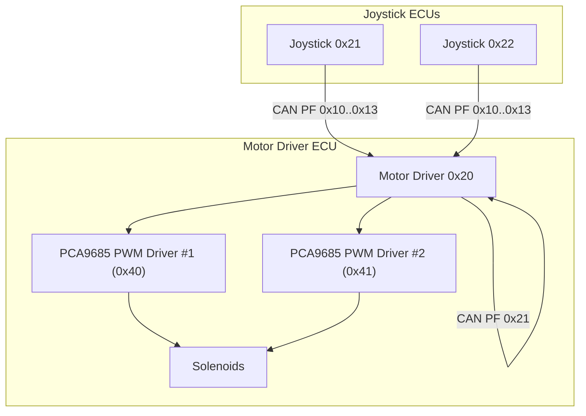
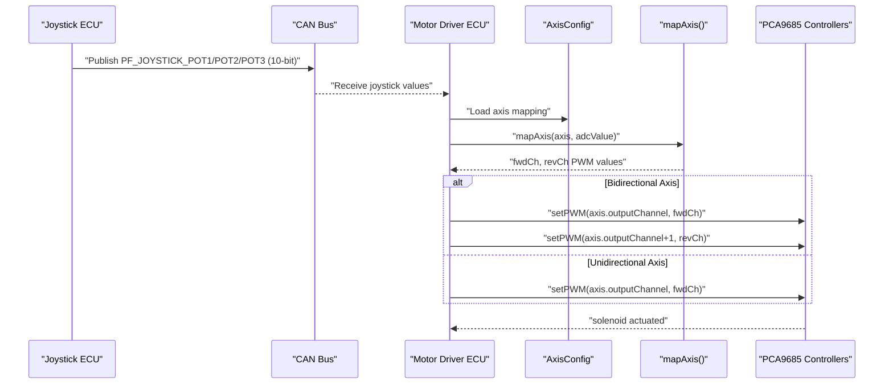
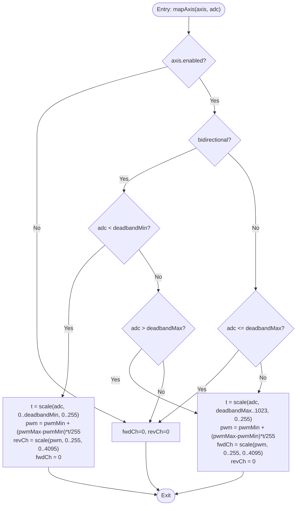
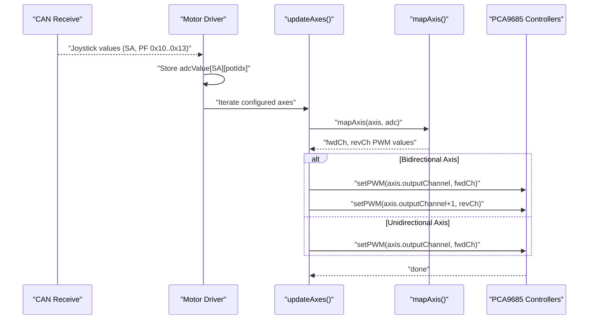
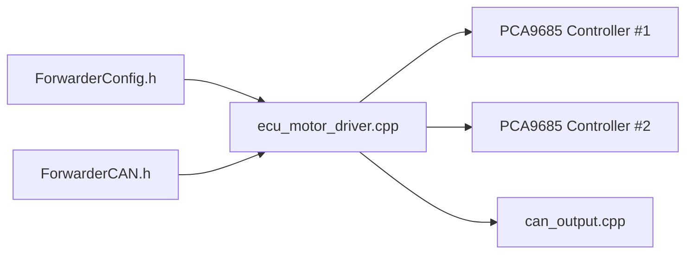

# PWM Mapping Algorithm

<cite>
**Referenced Files in This Document**
- [main.cpp](file://src/main.cpp)
- [ecu_motor_driver.cpp](file://src/ecu_motor_driver.cpp)
- [ecu_motor_driver.h](file://src/ecu_motor_driver.h)
- [ecu_joystick.cpp](file://src/ecu_joystick.cpp)
- [ecu_joystick.h](file://src/ecu_joystick.h)
- [ForwarderConfig.h](file://lib/ForwarderConfig/ForwarderConfig.h)
- [ForwarderConfig.cpp](file://lib/ForwarderConfig/ForwarderConfig.cpp)
- [ForwarderCAN.h](file://lib/ForwarderCAN/ForwarderCAN.h)
- [can_output.cpp](file://src/can_output.cpp)
- [can_output.h](file://src/can_output.h)
- [README.md](file://README.md)
</cite>

## Update Summary
**Changes Made**
- Enhanced bidirectional motor driver support with paired PWM channel architecture
- Introduced separate forward and reverse channel mapping for bidirectional axes
- Added automatic configuration system for first-time setup
- Updated PCA9685 dual-controller support with 16-channel capability
- Modified mapping algorithm to handle paired channel outputs

## Table of Contents
1. [Introduction](#introduction)
2. [Project Structure](#project-structure)
3. [Core Components](#core-components)
4. [Architecture Overview](#architecture-overview)
5. [Detailed Component Analysis](#detailed-component-analysis)
6. [Dependency Analysis](#dependency-analysis)
7. [Performance Considerations](#performance-considerations)
8. [Troubleshooting Guide](#troubleshooting-guide)
9. [Conclusion](#conclusion)

## Introduction
This document explains the PWM mapping algorithm that converts joystick analog inputs into solenoid actuation signals with enhanced bidirectional motor driver support. The system now features a paired PWM channel architecture where bidirectional axes utilize adjacent channels for forward and reverse actuation, plus an automatic configuration system for first-time setup. It covers bidirectional axis handling with deadband calculation, forward and reverse mapping functions, and the mathematical transformation from 10-bit ADC values to 12-bit PWM values. It also documents the non-blocking axis processing loop, real-time value updates, and the relationship between joystick input channels and solenoid output channels. Practical examples of axis configuration parameters, calibration procedures, and troubleshooting steps are included.

## Project Structure
The system consists of two ECUs on a shared CAN bus with enhanced motor driver capabilities:
- Joystick ECUs (0x21, 0x22) that read 3 potentiometers and 2 buttons and publish values on the bus
- Motor Driver ECU (0x20) that receives joystick values, applies mapping rules with paired channel architecture, and drives solenoids via dual PCA9685 PWM controllers

**Diagram sources**
- [README.md:8-15](file://README.md#L8-L15)
- [ForwarderCAN.h:38-50](file://lib/ForwarderCAN/ForwarderCAN.h#L38-L50)
- [ecu_motor_driver.cpp:26-31](file://src/ecu_motor_driver.cpp#L26-L31)

**Section sources**
- [README.md:6-15](file://README.md#L6-L15)
- [main.cpp:6-17](file://src/main.cpp#L6-L17)

## Core Components
- Axis configuration defines how a joystick channel maps to a solenoid output with paired channel support, including deadband thresholds, directionality, and PWM scaling.
- The enhanced mapping function transforms 10-bit ADC readings to 12-bit PWM duty cycles with bidirectional support and deadband handling using paired channels.
- The motor driver continuously processes incoming joystick values and updates solenoid outputs without blocking, with automatic configuration for first-time setup.
- Dual PCA9685 support enables 16-channel PWM output with automatic detection of second controller.

Key responsibilities:
- AxisConfig: stores source address, pot index, output channel, deadband bounds, PWM range, and flags for paired channel mapping
- mapAxis(): performs the core PWM mapping with deadband and direction handling using paired forward/reverse channels
- updateAxes(): non-blocking loop that reads mapped values and sets PWM outputs on appropriate channels
- autoConfigDefaults(): automatic first-time configuration system for bidirectional axes

**Section sources**
- [ForwarderConfig.h:41-57](file://lib/ForwarderConfig/ForwarderConfig.h#L41-L57)
- [ecu_motor_driver.cpp:101-139](file://src/ecu_motor_driver.cpp#L101-L139)
- [ecu_motor_driver.cpp:137-184](file://src/ecu_motor_driver.cpp#L137-L184)
- [ecu_motor_driver.cpp:330-359](file://src/ecu_motor_driver.cpp#L330-359)

## Architecture Overview
The enhanced PWM mapping pipeline operates with paired channel architecture:
1. Joystick ECUs sample 10-bit ADC values from up to 3 pots and publish them on the CAN bus
2. Motor Driver ECU receives joystick messages and stores the latest values per source address
3. For each configured axis, the motor driver retrieves the corresponding joystick value and applies the enhanced mapping function
4. Bidirectional axes use paired channels (forward on even channel, reverse on odd channel)
5. Mapped 12-bit PWM values are sent to the appropriate PCA9685 controller, which controls solenoid outputs

**Diagram sources**
- [ecu_motor_driver.cpp:184-205](file://src/ecu_motor_driver.cpp#L184-L205)
- [ecu_motor_driver.cpp:101-139](file://src/ecu_motor_driver.cpp#L101-L139)
- [ecu_motor_driver.cpp:69-76](file://src/ecu_motor_driver.cpp#L69-L76)

## Detailed Component Analysis

### Enhanced PWM Mapping Algorithm with Paired Channels
The core mapping function now handles paired channel architecture:
- Bidirectional axes: negative joystick deflection maps to reverse PWM on channel+1, positive deflection to forward PWM on channel
- Deadband region: joystick values within deadbandMin..deadbandMax produce zero output on both channels
- Linear interpolation: outside deadband, values are scaled from ADC range to PWM range
- 10-bit to 12-bit conversion: final PWM values are 12-bit (0..4095) while ADC is 10-bit (0..1023)
- Paired channel assignment: outputChannel = forward, outputChannel+1 = reverse for bidirectional axes

Mathematical details:
- Deadband thresholds are stored as 0-255 and scaled to ADC range (0-1023) during configuration
- Within deadband: both channels = 0
- Reverse region (below deadbandMin): revCh = scale(pwm, 0..255, 0..4095), fwdCh = 0
- Forward region (above deadbandMax): fwdCh = scale(pwm, 0..255, 0..4095), revCh = 0
- Final conversion: PWM 0-255 scaled to 0-4095 for PCA9685

**Diagram sources**
- [ecu_motor_driver.cpp:101-139](file://src/ecu_motor_driver.cpp#L101-L139)

**Section sources**
- [ecu_motor_driver.cpp:101-139](file://src/ecu_motor_driver.cpp#L101-L139)
- [ForwarderConfig.h:45-48](file://lib/ForwarderConfig/ForwarderConfig.h#L45-L48)

### Automatic Configuration System for First-Time Setup
The motor driver includes an intelligent auto-configuration system:
- Detects if any axis configuration exists during startup
- If no configuration found, automatically creates default mappings for bidirectional axes
- Sets up paired channel architecture with Joy1 Pot1 -> ch0+1, Joy1 Pot2 -> ch2+3, Joy2 Pot1 -> ch4+5, Joy2 Pot2 -> ch6+7
- Configures appropriate deadband and PWM ranges for typical joystick operation
- Saves configuration to non-volatile storage for persistence

Default configuration pattern:
- Joy1 Pot1 -> ch0(fwd)+ch1(rev) with deadband 472-552 (~46%-54%) and PWM 50-200 (~20%-78%)
- Joy1 Pot2 -> ch2(fwd)+ch3(rev) with same settings
- Joy2 Pot1 -> ch4(fwd)+ch5(rev) with same settings
- Joy2 Pot2 -> ch6(fwd)+ch7(rev) with same settings

**Section sources**
- [ecu_motor_driver.cpp:330-359](file://src/ecu_motor_driver.cpp#L330-359)
- [ecu_motor_driver.cpp:361-418](file://src/ecu_motor_driver.cpp#L361-418)

### Dual PCA9685 Controller Support
Enhanced hardware support for dual PCA9685 controllers:
- Automatic detection of second PCA9685 controller at address 0x41
- Channel distribution: channels 0-7 on PCA9685 #1, channels 8-15 on PCA9685 #2
- Dynamic channel routing based on controller availability
- Heartbeat message includes PCA count information for monitoring
- Configurable PCA count in motor configuration

Controller initialization:
- PCA9685 #1 at address 0x40 with oscillator frequency 25MHz and PWM frequency 200Hz
- PCA9685 #2 at address 0x41 with identical settings if present
- Automatic fallback to single controller if second is not detected

**Section sources**
- [ecu_motor_driver.cpp:39-41](file://src/ecu_motor_driver.cpp#L39-L41)
- [ecu_motor_driver.cpp:85-99](file://src/ecu_motor_driver.cpp#L85-L99)
- [ecu_motor_driver.cpp:324-325](file://src/ecu_motor_driver.cpp#L324-L325)

### Axis Configuration Parameters with Paired Channel Support
Each axis is configured with enhanced parameters:
- sourceAddress: joystick source address (e.g., 0x21)
- potIndex: 0=Pot1, 1=Pot2, 2=Pot3
- outputChannel: PCA9685 channel (0-15) for paired channel architecture
- deadbandMin/deadbandMax: 0-255 stored; scaled to 0-1023 for ADC comparison
- pwmMin/pwmMax: 0-255 mapped to 0-4095 for PCA9685
- flags: enable/disable and bidirectional toggle for paired channel support

Paired channel mapping:
- Bidirectional axes: outputChannel = forward, outputChannel+1 = reverse
- Unidirectional axes: only outputChannel is used
- Channel pairs must be sequential (even channel for forward, odd for reverse)

Configuration packing/unpacking:
- Stored as 8-byte CAN frames for transport
- Fields include axis index, source address, combined flags/pot/output, scaled deadbands, and PWM range

**Section sources**
- [ForwarderConfig.h:41-57](file://lib/ForwarderConfig/ForwarderConfig.h#L41-L57)
- [ForwarderConfig.h:9-18](file://lib/ForwarderConfig/ForwarderConfig.h#L9-L18)

### Non-blocking Axis Processing Loop with Paired Channels
The motor driver runs a continuous loop that:
- Receives CAN messages and updates joystick value buffers per source address
- Iterates configured axes, checks freshness, maps ADC to paired PWM channels, and updates PCA9685 if changed
- Applies safety timeout to shut off solenoids if no updates received within a period
- Handles bidirectional axes with separate forward and reverse channel updates

Processing highlights:
- updateAxes() iterates all axes, retrieves latest ADC value, applies mapAxis(), and writes to paired PCA9685 channels
- Freshness check uses per-source timestamps to detect stale inputs
- Safety timeout reverts all solenoids to zero if communication stops
- Bidirectional axes update both forward and reverse channels appropriately

**Diagram sources**
- [ecu_motor_driver.cpp:137-184](file://src/ecu_motor_driver.cpp#L137-L184)
- [ecu_motor_driver.cpp:184-205](file://src/ecu_motor_driver.cpp#L184-L205)

**Section sources**
- [ecu_motor_driver.cpp:137-184](file://src/ecu_motor_driver.cpp#L137-L184)
- [ecu_motor_driver.cpp:327-352](file://src/ecu_motor_driver.cpp#L327-L352)

### Real-time Value Updates and Deadband Calculation
Real-time behavior with enhanced channel management:
- Joystick ADC sampling occurs in the joystick ECU and is published periodically
- Motor driver maintains per-source ADC buffers and update timestamps
- Deadband thresholds are compared against raw ADC values (0-1023) after scaling from 0-255 storage
- Paired channel updates occur only when PWM values change, reducing unnecessary writes

Deadband calculation:
- Stored deadbandMin/deadbandMax are 0-255; scaled to ADC range (0-1023) for comparisons
- Linear interpolation uses fixed-point arithmetic with 8-bit intermediate scaling factors
- Final PWM output is clamped to 12-bit range (0-4095)
- Bidirectional axes independently calculate forward and reverse channel values

**Section sources**
- [ecu_motor_driver.cpp:194-203](file://src/ecu_motor_driver.cpp#L194-L203)
- [ecu_motor_driver.cpp:101-139](file://src/ecu_motor_driver.cpp#L101-L139)

### Relationship Between Joystick Inputs and Solenoid Outputs with Paired Channels
Enhanced mapping rules with channel architecture:
- Each axis maps one joystick potentiometer to paired solenoid channels for bidirectional operation
- Multiple joysticks can drive the same solenoid by configuring the same outputChannel
- Bidirectional axes use adjacent channels (forward on even, reverse on odd) for proper operation
- Unidirectional axes use single channels for simplified operation

Channel assignment patterns:
- sourceAddress determines which joystick's ADC value to use
- potIndex selects which of the three pots (X/Y/Z) supplies the signal
- outputChannel selects the base channel for paired channel architecture
- Bidirectional axes automatically use outputChannel and outputChannel+1

**Section sources**
- [ForwarderConfig.h:41-49](file://lib/ForwarderConfig/ForwarderConfig.h#L41-L49)
- [README.md:10-14](file://README.md#L10-L14)

### Calibration Procedures with Automatic Configuration
Enhanced calibration with first-time setup:
1. First-time boot: automatic configuration system detects empty settings and applies defaults
2. Configure axis mapping via CAN messages (PF 0x24) with desired sourceAddress, potIndex, outputChannel, and flags
3. Set deadbandMin and deadbandMax around the neutral position to eliminate small jitter
4. Adjust pwmMin and pwmMax to achieve desired solenoid response range
5. For bidirectional axes, verify both forward and reverse travel produces smooth response on paired channels
6. Use heartbeat and LED indicators to confirm connectivity and activity
7. Manual configuration overrides automatic setup if needed

Automatic configuration benefits:
- Eliminates manual setup for new installations
- Provides sensible defaults for typical joystick-to-solenoid mapping
- Ensures proper paired channel assignment for bidirectional axes
- Maintains backward compatibility with existing configurations

Verification tips:
- Observe LED blinking on motor driver when joystick values arrive
- Confirm solenoid movement matches joystick deflection direction on appropriate channels
- Check that deadband prevents unintended actuation at rest
- Verify dual PCA9685 detection and proper channel distribution

**Section sources**
- [ecu_motor_driver.cpp:246-267](file://src/ecu_motor_driver.cpp#L246-L267)
- [ecu_motor_driver.cpp:153-182](file://src/ecu_motor_driver.cpp#L153-L182)
- [ecu_motor_driver.cpp:330-359](file://src/ecu_motor_driver.cpp#L330-359)

## Dependency Analysis
The enhanced mapping algorithm depends on:
- ForwarderConfig for axis definitions, paired channel support, and storage
- ForwarderCAN for CAN message reception and addressing
- Dual PCA9685 drivers for PWM output control on 16 channels
- CAN output rules for additional GPIO control functionality

**Diagram sources**
- [ForwarderConfig.h:41-57](file://lib/ForwarderConfig/ForwarderConfig.h#L41-L57)
- [ForwarderCAN.h:38-50](file://lib/ForwarderCAN/ForwarderCAN.h#L38-L50)
- [ecu_motor_driver.cpp:69-76](file://src/ecu_motor_driver.cpp#L69-L76)

**Section sources**
- [ecu_motor_driver.cpp:12-12](file://src/ecu_motor_driver.cpp#L12-L12)
- [ForwarderConfig.h:64-91](file://lib/ForwarderConfig/ForwarderConfig.h#L64-L91)

## Performance Considerations
- Non-blocking design: mapping runs in the main loop without delays, enabling responsive solenoid control with paired channel updates
- Change detection: PWM updates occur only when mapped values change, reducing unnecessary writes to both channels
- Safety timeout: automatic solenoid shutdown prevents unintended actuation if CAN communication fails
- Fixed-point arithmetic: avoids floating-point overhead while maintaining precision
- Dual controller optimization: automatic detection and utilization of second PCA9685 for expanded channel capacity
- Automatic configuration: reduces setup overhead and ensures consistent initial operation

## Troubleshooting Guide
Common issues and resolutions with enhanced features:
- Incomplete travel: adjust deadbandMin/deadbandMax to encompass the full joystick range; verify pwmMin/pwmMax spans the desired output range; check paired channel assignment for bidirectional axes
- Inconsistent response curve: check for bidirectional flag mismatches; ensure deadband boundaries align with mechanical neutral; verify proper channel pairing (even for forward, odd for reverse)
- Stuck solenoids: verify CAN connectivity and heartbeat; confirm no stale inputs; review safety timeout behavior; check dual PCA9685 detection
- No response: confirm axis is enabled and configured; verify sourceAddress and potIndex; check PCA9685 presence and PWM frequency; ensure automatic configuration ran successfully
- Channel conflicts: verify paired channels aren't being used by multiple axes; ensure bidirectional axes use sequential channel pairs
- Dual controller issues: check PCA9685 address detection (0x40 and 0x41); verify I2C wiring and pull-up resistors

Diagnostic aids:
- LED patterns indicate online/offline status and activity
- Heartbeat messages provide runtime statistics including PCA count
- CAN output rules can be used to trigger external indicators
- Automatic configuration logs during first-time setup
- GPIO loopback test verifies CAN transceiver functionality

**Section sources**
- [ecu_motor_driver.cpp:327-352](file://src/ecu_motor_driver.cpp#L327-L352)
- [ecu_motor_driver.cpp:153-182](file://src/ecu_motor_driver.cpp#L153-L182)
- [ecu_motor_driver.cpp:277-288](file://src/ecu_motor_driver.cpp#L277-L288)
- [ecu_motor_driver.cpp:378-394](file://src/ecu_motor_driver.cpp#L378-L394)

## Conclusion
The enhanced PWM mapping algorithm provides precise, real-time control of solenoids from joystick inputs with advanced bidirectional support and paired channel architecture. The automatic configuration system eliminates setup complexity while maintaining flexibility for custom configurations. Its bidirectional support with paired channels, deadband handling, and 10-bit to 12-bit scaling deliver reliable operation across diverse hydraulic applications. Proper configuration, periodic calibration, and understanding of the paired channel architecture ensure optimal performance and safety.