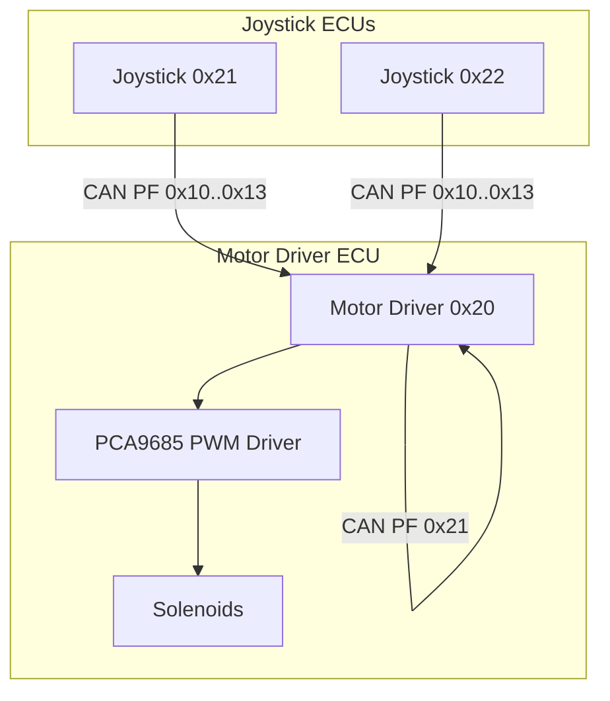
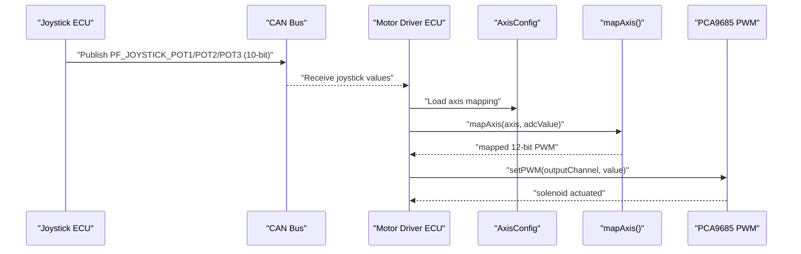
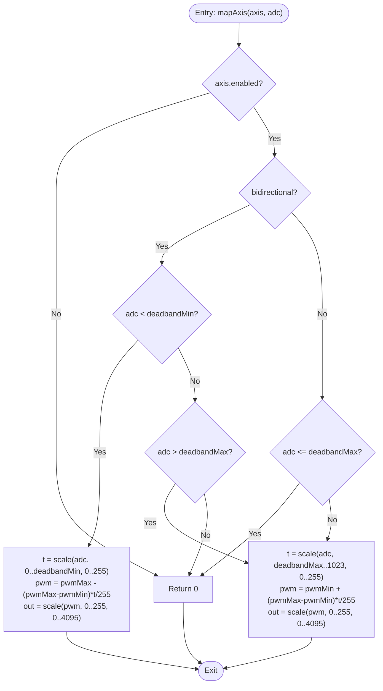
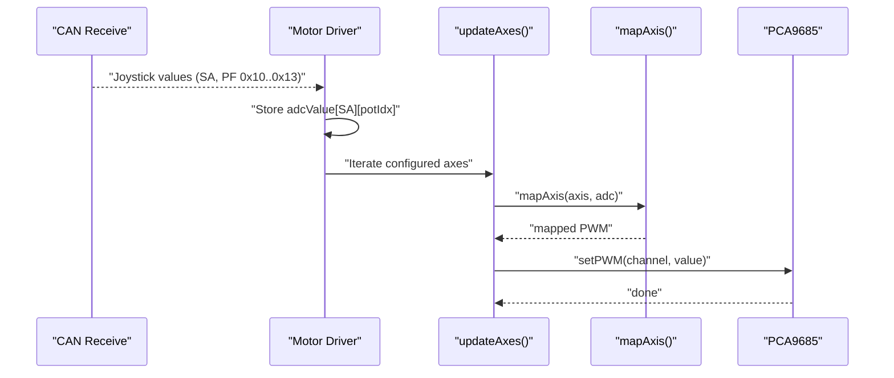
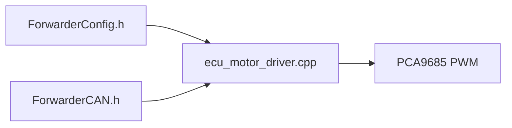

# PWM Mapping Algorithm

<cite>
**Referenced Files in This Document**
- [main.cpp](file://src/main.cpp)
- [ecu_motor_driver.cpp](file://src/ecu_motor_driver.cpp)
- [ecu_motor_driver.h](file://src/ecu_motor_driver.h)
- [ecu_joystick.cpp](file://src/ecu_joystick.cpp)
- [ecu_joystick.h](file://src/ecu_joystick.h)
- [ForwarderConfig.h](file://lib/ForwarderConfig/ForwarderConfig.h)
- [ForwarderCAN.h](file://lib/ForwarderCAN/ForwarderCAN.h)
- [can_output.cpp](file://src/can_output.cpp)
- [can_output.h](file://src/can_output.h)
- [README.md](file://README.md)
</cite>

## Table of Contents
1. [Introduction](#introduction)
2. [Project Structure](#project-structure)
3. [Core Components](#core-components)
4. [Architecture Overview](#architecture-overview)
5. [Detailed Component Analysis](#detailed-component-analysis)
6. [Dependency Analysis](#dependency-analysis)
7. [Performance Considerations](#performance-considerations)
8. [Troubleshooting Guide](#troubleshooting-guide)
9. [Conclusion](#conclusion)

## Introduction
This document explains the PWM mapping algorithm that converts joystick analog inputs into solenoid actuation signals. It covers bidirectional axis handling with deadband calculation, forward and reverse mapping functions, and the mathematical transformation from 10-bit ADC values to 12-bit PWM values. It also documents the non-blocking axis processing loop, real-time value updates, and the relationship between joystick input channels and solenoid output channels. Practical examples of axis configuration parameters, calibration procedures, and troubleshooting steps are included.

## Project Structure
The system consists of two ECUs on a shared CAN bus:
- Joystick ECUs (0x21, 0x22) that read 3 potentiometers and 2 buttons and publish values on the bus
- Motor Driver ECU (0x20) that receives joystick values, applies mapping rules, and drives solenoids via PCA9685 PWM outputs

**Diagram sources**
- [README.md:8-15](file://README.md#L8-L15)
- [ForwarderCAN.h:38-50](file://lib/ForwarderCAN/ForwarderCAN.h#L38-L50)

**Section sources**
- [README.md:6-15](file://README.md#L6-L15)
- [main.cpp:6-17](file://src/main.cpp#L6-L17)

## Core Components
- Axis configuration defines how a joystick channel maps to a solenoid output, including deadband thresholds, directionality, and PWM scaling.
- The mapping function transforms 10-bit ADC readings to 12-bit PWM duty cycles with bidirectional support and deadband handling.
- The motor driver continuously processes incoming joystick values and updates solenoid outputs without blocking.

Key responsibilities:
- AxisConfig: stores source address, pot index, output channel, deadband bounds, PWM range, and flags
- mapAxis(): performs the core PWM mapping with deadband and direction handling
- updateAxes(): non-blocking loop that reads mapped values and sets PWM outputs

**Section sources**
- [ForwarderConfig.h:41-57](file://lib/ForwarderConfig/ForwarderConfig.h#L41-L57)
- [ecu_motor_driver.cpp:101-135](file://src/ecu_motor_driver.cpp#L101-L135)
- [ecu_motor_driver.cpp:137-151](file://src/ecu_motor_driver.cpp#L137-L151)

## Architecture Overview
The PWM mapping pipeline operates as follows:
1. Joystick ECUs sample 10-bit ADC values from up to 3 pots and publish them on the CAN bus
2. Motor Driver ECU receives joystick messages and stores the latest values per source address
3. For each configured axis, the motor driver retrieves the corresponding joystick value and applies the mapping function
4. Mapped 12-bit PWM values are sent to the PCA9685, which controls solenoid outputs

**Diagram sources**
- [ecu_motor_driver.cpp:184-205](file://src/ecu_motor_driver.cpp#L184-L205)
- [ecu_motor_driver.cpp:101-135](file://src/ecu_motor_driver.cpp#L101-L135)
- [ecu_motor_driver.cpp:69-76](file://src/ecu_motor_driver.cpp#L69-L76)

## Detailed Component Analysis

### PWM Mapping Algorithm
The core mapping function handles:
- Bidirectional axes: negative joystick deflection maps to reverse PWM, positive deflection to forward PWM
- Deadband region: joystick values within deadbandMin..deadbandMax produce zero output
- Linear interpolation: outside deadband, values are scaled from ADC range to PWM range
- 10-bit to 12-bit conversion: final PWM values are 12-bit (0..4095) while ADC is 10-bit (0..1023)

Mathematical details:
- Deadband thresholds are stored as 0-255 and scaled to ADC range (0-1023) during configuration
- Within deadband: output = 0
- Reverse region (below deadbandMin): output = scale(adc, 0..deadbandMin, pwmMin..pwmMax)
- Forward region (above deadbandMax): output = scale(adc, deadbandMax..1023, pwmMin..pwmMax)
- Final conversion: PWM 0-255 scaled to 0-4095 for PCA9685

**Diagram sources**
- [ecu_motor_driver.cpp:101-135](file://src/ecu_motor_driver.cpp#L101-L135)

**Section sources**
- [ecu_motor_driver.cpp:101-135](file://src/ecu_motor_driver.cpp#L101-L135)
- [ForwarderConfig.h:45-48](file://lib/ForwarderConfig/ForwarderConfig.h#L45-L48)

### Axis Configuration Parameters
Each axis is configured with:
- sourceAddress: joystick source address (e.g., 0x21)
- potIndex: 0=Pot1, 1=Pot2, 2=Pot3
- outputChannel: PCA9685 channel (0-15)
- deadbandMin/deadbandMax: 0-255 stored; scaled to 0-1023 for ADC comparison
- pwmMin/pwmMax: 0-255 mapped to 0-4095 for PCA9685
- flags: enable/disable and bidirectional toggle

Configuration packing/unpacking:
- Stored as 8-byte CAN frames for transport
- Fields include axis index, source address, combined flags/pot/output, scaled deadbands, and PWM range

**Section sources**
- [ForwarderConfig.h:41-57](file://lib/ForwarderConfig/ForwarderConfig.h#L41-L57)
- [ForwarderConfig.h:9-18](file://lib/ForwarderConfig/ForwarderConfig.h#L9-L18)

### Non-blocking Axis Processing Loop
The motor driver runs a continuous loop that:
- Receives CAN messages and updates joystick value buffers per source address
- Iterates configured axes, checks freshness, maps ADC to PWM, and updates PCA9685 if changed
- Applies safety timeout to shut off solenoids if no updates received within a period

Processing highlights:
- updateAxes() iterates all axes, retrieves latest ADC value, applies mapAxis(), and writes to PCA9685 if value changed
- Freshness check uses per-source timestamps to detect stale inputs
- Safety timeout reverts all solenoids to zero if communication stops

**Diagram sources**
- [ecu_motor_driver.cpp:137-151](file://src/ecu_motor_driver.cpp#L137-L151)
- [ecu_motor_driver.cpp:184-205](file://src/ecu_motor_driver.cpp#L184-L205)

**Section sources**
- [ecu_motor_driver.cpp:137-151](file://src/ecu_motor_driver.cpp#L137-L151)
- [ecu_motor_driver.cpp:327-352](file://src/ecu_motor_driver.cpp#L327-L352)

### Real-time Value Updates and Deadband Calculation
Real-time behavior:
- Joystick ADC sampling occurs in the joystick ECU and is published periodically
- Motor driver maintains per-source ADC buffers and update timestamps
- Deadband thresholds are compared against raw ADC values (0-1023) after scaling from 0-255 storage

Deadband calculation:
- Stored deadbandMin/deadbandMax are 0-255; scaled to ADC range (0-1023) for comparisons
- Linear interpolation uses fixed-point arithmetic with 8-bit intermediate scaling factors
- Final PWM output is clamped to 12-bit range (0-4095)

**Section sources**
- [ecu_motor_driver.cpp:194-203](file://src/ecu_motor_driver.cpp#L194-L203)
- [ecu_motor_driver.cpp:101-135](file://src/ecu_motor_driver.cpp#L101-L135)

### Relationship Between Joystick Inputs and Solenoid Outputs
- Each axis maps one joystick potentiometer to one solenoid channel
- Multiple joysticks can drive the same solenoid by configuring the same outputChannel
- Bidirectional axes allow reverse actuation when joystick deflection reverses direction

Mapping rules:
- sourceAddress determines which joystick’s ADC value to use
- potIndex selects which of the three pots (X/Y/Z) supplies the signal
- outputChannel selects the PCA9685 channel for the solenoid

**Section sources**
- [ForwarderConfig.h:41-49](file://lib/ForwarderConfig/ForwarderConfig.h#L41-L49)
- [README.md:10-14](file://README.md#L10-L14)

### Calibration Procedures
Recommended steps:
1. Configure axis mapping via CAN messages (PF 0x24) with desired sourceAddress, potIndex, outputChannel, and flags
2. Set deadbandMin and deadbandMax around the neutral position to eliminate small jitter
3. Adjust pwmMin and pwmMax to achieve desired solenoid response range
4. For bidirectional axes, verify both forward and reverse travel produces smooth response
5. Use heartbeat and LED indicators to confirm connectivity and activity

Verification tips:
- Observe LED blinking on motor driver when joystick values arrive
- Confirm solenoid movement matches joystick deflection direction
- Check that deadband prevents unintended actuation at rest

**Section sources**
- [ecu_motor_driver.cpp:246-267](file://src/ecu_motor_driver.cpp#L246-L267)
- [ecu_motor_driver.cpp:153-182](file://src/ecu_motor_driver.cpp#L153-L182)

## Dependency Analysis
The mapping algorithm depends on:
- ForwarderConfig for axis definitions and storage
- ForwarderCAN for CAN message reception and addressing
- PCA9685 driver for PWM output control

**Diagram sources**
- [ForwarderConfig.h:41-57](file://lib/ForwarderConfig/ForwarderConfig.h#L41-L57)
- [ForwarderCAN.h:38-50](file://lib/ForwarderCAN/ForwarderCAN.h#L38-L50)
- [ecu_motor_driver.cpp:69-76](file://src/ecu_motor_driver.cpp#L69-L76)

**Section sources**
- [ecu_motor_driver.cpp:12-12](file://src/ecu_motor_driver.cpp#L12-L12)
- [ForwarderConfig.h:64-91](file://lib/ForwarderConfig/ForwarderConfig.h#L64-L91)

## Performance Considerations
- Non-blocking design: mapping runs in the main loop without delays, enabling responsive solenoid control
- Change detection: PWM updates occur only when mapped values change, reducing unnecessary writes
- Safety timeout: automatic solenoid shutdown prevents unintended actuation if CAN communication fails
- Fixed-point arithmetic: avoids floating-point overhead while maintaining precision

[No sources needed since this section provides general guidance]

## Troubleshooting Guide
Common issues and resolutions:
- Incomplete travel: adjust deadbandMin/deadbandMax to encompass the full joystick range; verify pwmMin/pwmMax spans the desired output range
- Inconsistent response curve: check for bidirectional flag mismatches; ensure deadband boundaries align with mechanical neutral
- Stuck solenoids: verify CAN connectivity and heartbeat; confirm no stale inputs; review safety timeout behavior
- No response: confirm axis is enabled and configured; verify sourceAddress and potIndex; check PCA9685 presence and PWM frequency

Diagnostic aids:
- LED patterns indicate online/offline status and activity
- Heartbeat messages provide runtime statistics
- CAN output rules can be used to trigger external indicators

**Section sources**
- [ecu_motor_driver.cpp:327-352](file://src/ecu_motor_driver.cpp#L327-L352)
- [ecu_motor_driver.cpp:153-182](file://src/ecu_motor_driver.cpp#L153-L182)
- [ecu_motor_driver.cpp:277-288](file://src/ecu_motor_driver.cpp#L277-L288)

## Conclusion
The PWM mapping algorithm provides precise, real-time control of solenoids from joystick inputs. Its bidirectional support, deadband handling, and 10-bit to 12-bit scaling deliver reliable operation across diverse hydraulic applications. Proper configuration and periodic calibration ensure optimal performance and safety.