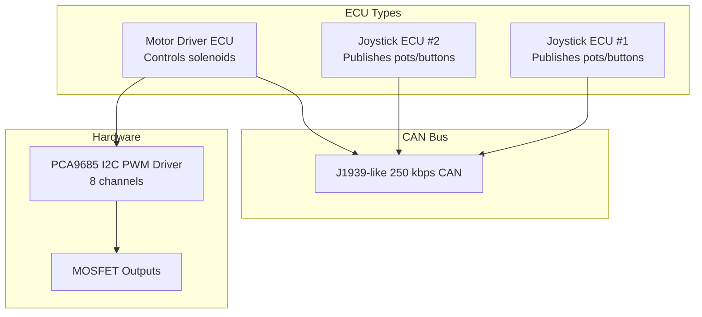
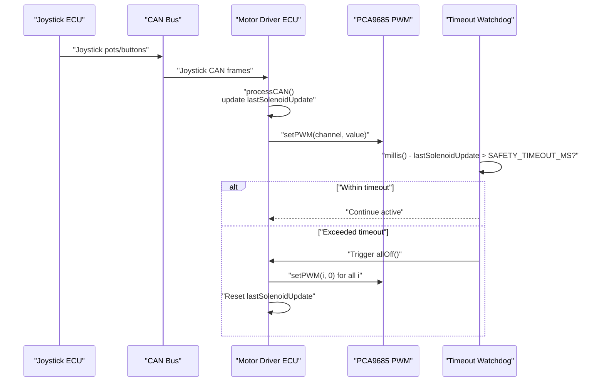
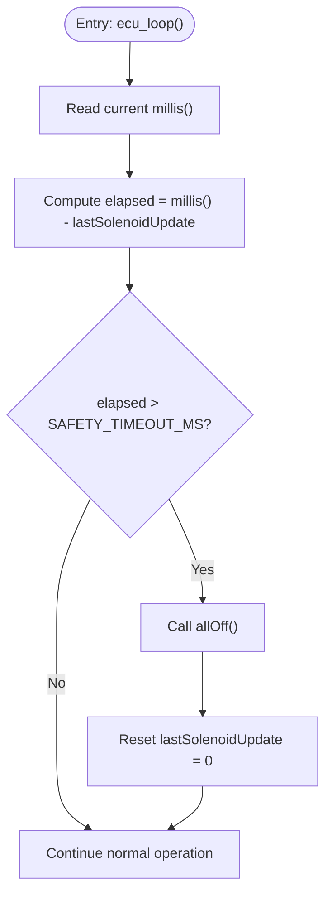
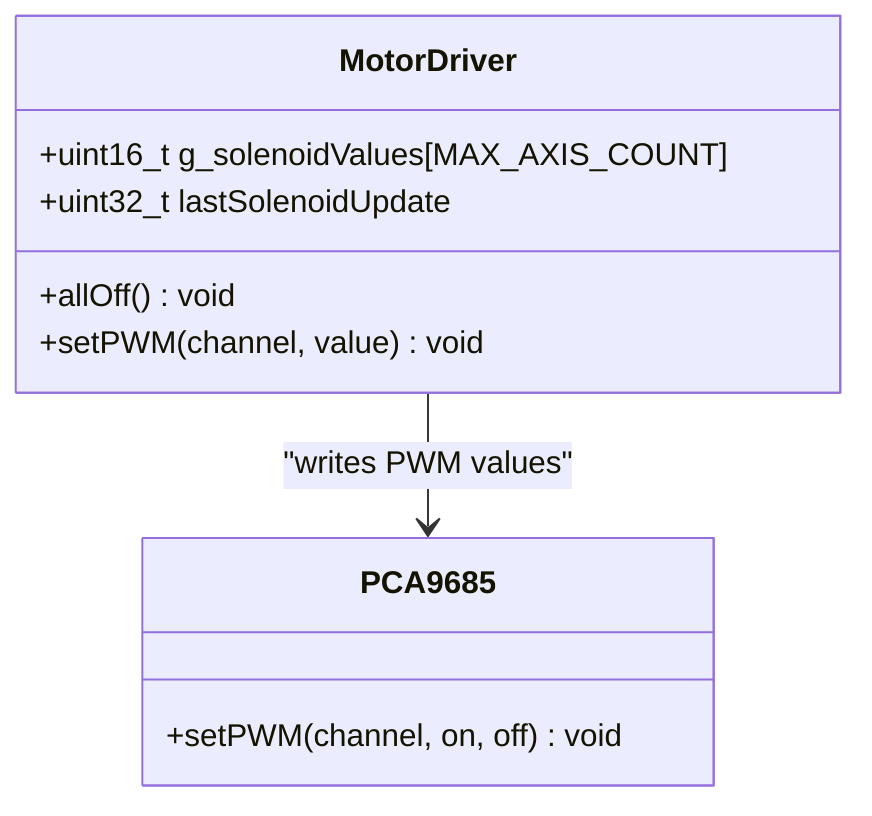
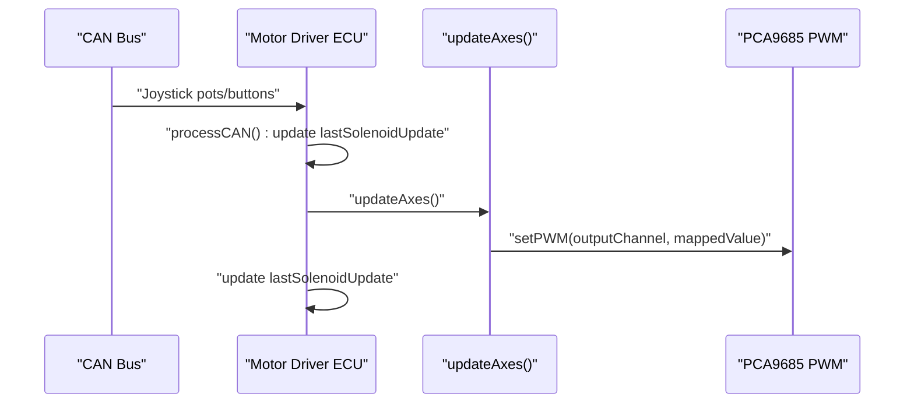
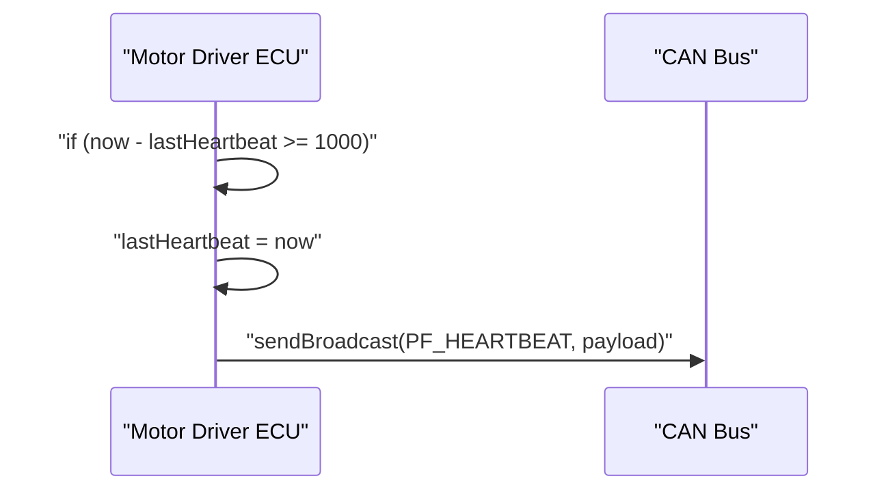
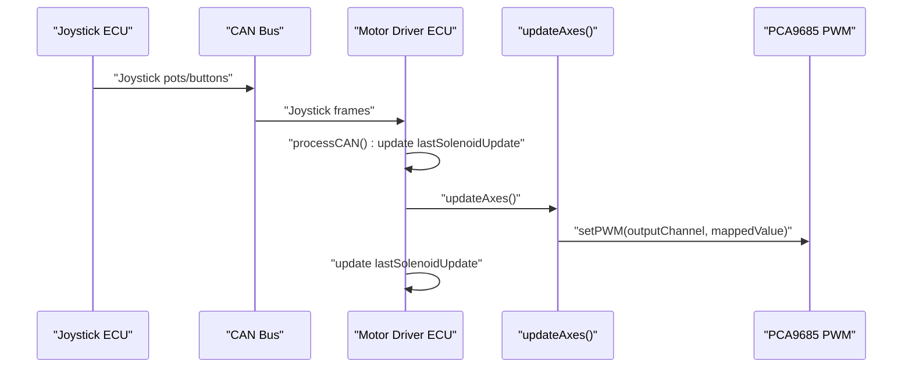
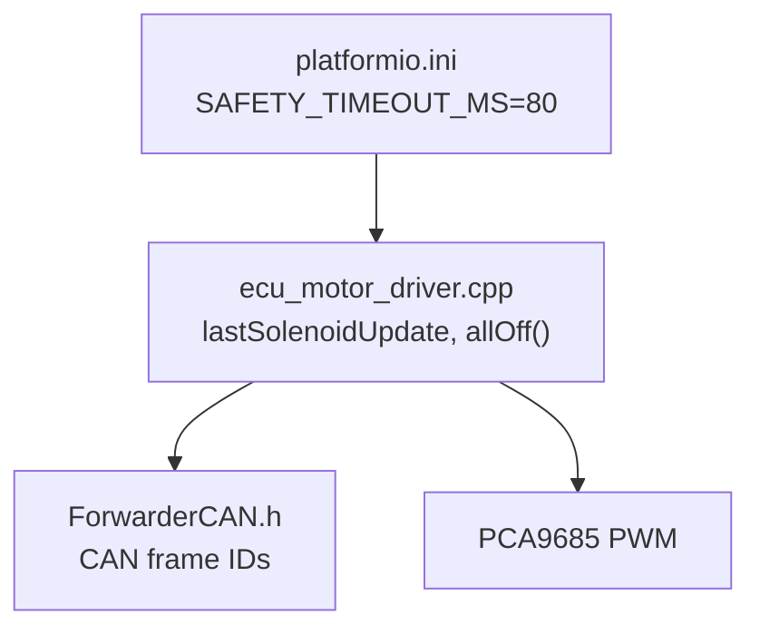

# Safety Timeout Mechanism

<cite>
**Referenced Files in This Document**
- [main.cpp](file://src/main.cpp)
- [ecu_motor_driver.cpp](file://src/ecu_motor_driver.cpp)
- [ecu_motor_driver.h](file://src/ecu_motor_driver.h)
- [can_output.cpp](file://src/can_output.cpp)
- [can_output.h](file://src/can_output.h)
- [ForwarderCAN.h](file://lib/ForwarderCAN/ForwarderCAN.h)
- [ForwarderConfig.h](file://lib/ForwarderConfig/ForwarderConfig.h)
- [platformio.ini](file://platformio.ini)
- [README.md](file://README.md)
</cite>

## Update Summary
**Changes Made**
- Updated safety timeout value from 500ms to 80ms throughout the documentation
- Revised all timeout-related examples and calculations to reflect the new 80ms threshold
- Updated troubleshooting procedures to account for the faster response time
- Adjusted performance considerations for the reduced timeout period

## Table of Contents
1. [Introduction](#introduction)
2. [Project Structure](#project-structure)
3. [Core Components](#core-components)
4. [Architecture Overview](#architecture-overview)
5. [Detailed Component Analysis](#detailed-component-analysis)
6. [Dependency Analysis](#dependency-analysis)
7. [Performance Considerations](#performance-considerations)
8. [Troubleshooting Guide](#troubleshooting-guide)
9. [Conclusion](#conclusion)

## Introduction
This document explains the safety timeout mechanism that automatically shuts off solenoids after 80 ms of inactivity. The system has been enhanced to provide faster response to safety violations by reducing the timeout threshold from 500ms to 80ms. It covers the timeout detection logic using lastSolenoidUpdate timestamps, the allOff() function implementation that resets all solenoid values to zero, and the automatic deactivation process. It also details the timeout configuration constants, timing precision considerations, and the relationship between joystick activity detection and solenoid power management. Finally, it addresses safety implications, heartbeat monitoring, overheating prevention, practical timeout behavior examples, troubleshooting procedures, and field operation guidelines.

## Project Structure
The safety timeout resides in the motor driver ECU, which controls solenoids via PCA9685 PWM channels. The system receives joystick inputs over CAN and translates them into solenoid commands. A watchdog timer monitors inactivity and triggers automatic deactivation within 80ms of inactivity.

**Diagram sources**
- [README.md:10-14](file://README.md#L10-L14)
- [platformio.ini:17-29](file://platformio.ini#L17-L29)

**Section sources**
- [README.md:105-111](file://README.md#L105-L111)
- [platformio.ini:17-29](file://platformio.ini#L17-L29)

## Core Components
- Safety timeout constant: SAFETY_TIMEOUT_MS configured to 80 ms in the motor driver environment.
- Timestamp tracking: lastSolenoidUpdate stores the last time a solenoid command was received or processed.
- Automatic deactivation: allOff() resets solenoid values to zero and sets PWM output to zero for all channels.
- Activity detection: CAN messages (joystick pots/buttons and solenoid commands) update lastSolenoidUpdate to keep the system active.
- Heartbeat monitoring: periodic heartbeats broadcast status every 1000 ms to indicate system health.

Key configuration and constants:
- SAFETY_TIMEOUT_MS = 80 ms (motor driver environment)
- CAN bit rate = 250000 bps
- Heartbeat interval = 1000 ms

**Section sources**
- [platformio.ini:37](file://platformio.ini#L37)
- [platformio.ini:65](file://platformio.ini#L65)
- [platformio.ini:87](file://platformio.ini#L87)
- [ecu_motor_driver.cpp:32-34](file://src/ecu_motor_driver.cpp#L32-L34)
- [ecu_motor_driver.cpp:48-49](file://src/ecu_motor_driver.cpp#L48-L49)
- [ecu_motor_driver.cpp:78-83](file://src/ecu_motor_driver.cpp#L78-L83)
- [ecu_motor_driver.cpp:457-463](file://src/ecu_motor_driver.cpp#L457-L463)
- [ecu_motor_driver.cpp:467-472](file://src/ecu_motor_driver.cpp#L467-L472)
- [ForwarderCAN.h:38-50](file://lib/ForwarderCAN/ForwarderCAN.h#L38-L50)

## Architecture Overview
The motor driver ECU continuously monitors CAN messages and updates solenoid outputs. A watchdog timer checks whether the last solenoid update occurred within the safety window. If not, it triggers automatic deactivation within 80ms of inactivity.

**Diagram sources**
- [ecu_motor_driver.cpp:427-479](file://src/ecu_motor_driver.cpp#L427-L479)
- [ecu_motor_driver.cpp:457-463](file://src/ecu_motor_driver.cpp#L457-L463)
- [ecu_motor_driver.cpp:78-83](file://src/ecu_motor_driver.cpp#L78-L83)

## Detailed Component Analysis

### Safety Timeout Detection Logic
The watchdog compares the current time against lastSolenoidUpdate. If the elapsed time exceeds SAFETY_TIMEOUT_MS (80ms), the system deactivates all solenoids. This faster response time provides improved safety by quickly shutting down solenoids when no activity is detected.

**Diagram sources**
- [ecu_motor_driver.cpp:457-463](file://src/ecu_motor_driver.cpp#L457-L463)
- [ecu_motor_driver.cpp:459](file://src/ecu_motor_driver.cpp#L459)

**Section sources**
- [ecu_motor_driver.cpp:457-463](file://src/ecu_motor_driver.cpp#L457-L463)

### allOff() Implementation
allOff() iterates over all solenoid channels, sets their values to zero, and writes zero PWM to each channel. It also resets the lastSolenoidUpdate timestamp to zero to prevent immediate reactivation.

**Diagram sources**
- [ecu_motor_driver.cpp:78-83](file://src/ecu_motor_driver.cpp#L78-L83)
- [ecu_motor_driver.cpp:69-76](file://src/ecu_motor_driver.cpp#L69-L76)

**Section sources**
- [ecu_motor_driver.cpp:78-83](file://src/ecu_motor_driver.cpp#L78-L83)

### Activity Detection and lastSolenoidUpdate Updates
Activity detection occurs when:
- Joystick pots/buttons are received and processed (updates lastSolenoidUpdate)
- Solenoid commands are received (updates lastSolenoidUpdate)
- Axes are mapped and PWM values are written (updates lastSolenoidUpdate)

**Diagram sources**
- [ecu_motor_driver.cpp:217-317](file://src/ecu_motor_driver.cpp#L217-L317)
- [ecu_motor_driver.cpp:143-184](file://src/ecu_motor_driver.cpp#L143-L184)

**Section sources**
- [ecu_motor_driver.cpp:236](file://src/ecu_motor_driver.cpp#L236)
- [ecu_motor_driver.cpp:249](file://src/ecu_motor_driver.cpp#L249)
- [ecu_motor_driver.cpp:162-169](file://src/ecu_motor_driver.cpp#L162-L169)
- [ecu_motor_driver.cpp:174-181](file://src/ecu_motor_driver.cpp#L174-L181)
- [ecu_motor_driver.cpp:157-170](file://src/ecu_motor_driver.cpp#L157-L170)

### Heartbeat Monitoring
Each ECU broadcasts a heartbeat every 1000 ms when online. The motor driver's heartbeat includes status counters and device presence indicators.

**Diagram sources**
- [ecu_motor_driver.cpp:467-472](file://src/ecu_motor_driver.cpp#L467-L472)
- [ForwarderCAN.h:50](file://lib/ForwarderCAN/ForwarderCAN.h#L50)

**Section sources**
- [ecu_motor_driver.cpp:319-330](file://src/ecu_motor_driver.cpp#L319-L330)
- [ecu_motor_driver.cpp:467-472](file://src/ecu_motor_driver.cpp#L467-L472)

### Relationship Between Joystick Activity and Solenoid Power Management
Joystick controllers publish pots/buttons on the CAN bus. The motor driver receives these frames, updates lastSolenoidUpdate, maps joystick values to solenoid outputs, and applies PWM. Continuous joystick activity keeps lastSolenoidUpdate fresh, preventing timeout within the 80ms window.

**Diagram sources**
- [ecu_motor_driver.cpp:217-317](file://src/ecu_motor_driver.cpp#L217-L317)
- [ecu_motor_driver.cpp:143-184](file://src/ecu_motor_driver.cpp#L143-L184)
- [ecu_motor_driver.cpp:236](file://src/ecu_motor_driver.cpp#L236)

**Section sources**
- [ecu_motor_driver.cpp:236](file://src/ecu_motor_driver.cpp#L236)
- [ecu_motor_driver.cpp:157-170](file://src/ecu_motor_driver.cpp#L157-L170)

## Dependency Analysis
The safety timeout depends on:
- Environment configuration for SAFETY_TIMEOUT_MS (now 80ms)
- CAN message processing to refresh lastSolenoidUpdate
- PCA9685 PWM output to apply solenoid values
- Heartbeat broadcasting for system monitoring

**Diagram sources**
- [platformio.ini:37](file://platformio.ini#L37)
- [platformio.ini:65](file://platformio.ini#L65)
- [platformio.ini:87](file://platformio.ini#L87)
- [ecu_motor_driver.cpp:32-34](file://src/ecu_motor_driver.cpp#L32-L34)
- [ecu_motor_driver.cpp:48-49](file://src/ecu_motor_driver.cpp#L48-L49)
- [ecu_motor_driver.cpp:78-83](file://src/ecu_motor_driver.cpp#L78-L83)
- [ForwarderCAN.h:38-50](file://lib/ForwarderCAN/ForwarderCAN.h#L38-L50)

**Section sources**
- [platformio.ini:37](file://platformio.ini#L37)
- [platformio.ini:65](file://platformio.ini#L65)
- [platformio.ini:87](file://platformio.ini#L87)
- [ecu_motor_driver.cpp:32-34](file://src/ecu_motor_driver.cpp#L32-L34)
- [ecu_motor_driver.cpp:48-49](file://src/ecu_motor_driver.cpp#L48-L49)
- [ecu_motor_driver.cpp:78-83](file://src/ecu_motor_driver.cpp#L78-L83)
- [ForwarderCAN.h:38-50](file://lib/ForwarderCAN/ForwarderCAN.h#L38-L50)

## Performance Considerations
- Timing precision: millis() provides millisecond resolution suitable for 80ms timeout. The watchdog runs in the main loop, ensuring timely checks within the reduced timeframe.
- CAN throughput: With 250 kbps and frequent joystick updates, the system remains responsive. Heartbeat is sent every 1000 ms to avoid bus congestion while maintaining system monitoring.
- PWM frequency: PCA9685 is configured to 200 Hz, which is adequate for solenoid control and reduces switching losses compared to higher frequencies.
- Memory footprint: Arrays for joystick pots and update times are bounded by the maximum number of joysticks and axis count, minimizing overhead.
- **Updated**: Reduced timeout from 500ms to 80ms provides faster safety response while maintaining system stability and responsiveness.

## Troubleshooting Guide
Common timeout-related issues and resolutions:
- Symptoms: Solenoids turn off unexpectedly after short periods of inactivity (within 80ms).
  - Verify that joystick pots/buttons are being transmitted and received. Check CAN connectivity and address claiming.
  - Confirm that lastSolenoidUpdate is being refreshed by monitoring logs or LED behavior.
- Symptoms: Solenoids remain on after operator leaves the machine.
  - Ensure SAFETY_TIMEOUT_MS is set to 80 ms in the motor driver environment.
  - Validate that processCAN() handles PF_JOYSTICK_POT1/2/3 and PF_SOLENOID_CMD frames.
- Symptoms: Frequent timeout activation during normal operation.
  - Check for excessive CAN traffic or dropped frames that might delay processing.
  - Review updateAxes() logic to ensure mapped values are applied promptly.
  - **Updated**: With 80ms timeout, ensure that joystick activity is consistently detected and that there are no communication delays exceeding this threshold.
- Diagnostics:
  - Monitor heartbeat broadcasts to confirm system health.
  - Observe LED patterns indicating online/offline status and fast blink behavior.
  - Use serial logs to track CAN TX/RX counts and joystick values.

Practical examples:
- Normal operation: While joystick is active, lastSolenoidUpdate is updated frequently, preventing timeout. Solenoids remain powered according to mapped joystick values.
- Idle operation: After 80ms without CAN activity, allOff() executes, resetting solenoid values to zero and clearing the timestamp.
- **Updated**: The faster 80ms timeout provides quicker safety response but requires ensuring that legitimate joystick activity is properly detected and processed within this shorter window.

**Section sources**
- [ecu_motor_driver.cpp:457-463](file://src/ecu_motor_driver.cpp#L457-L463)
- [ecu_motor_driver.cpp:217-317](file://src/ecu_motor_driver.cpp#L217-L317)
- [ecu_motor_driver.cpp:467-472](file://src/ecu_motor_driver.cpp#L467-L472)
- [README.md:168-174](file://README.md#L168-L174)

## Conclusion
The safety timeout mechanism provides a robust safeguard against unintended continuous operation of solenoids. By tracking the last solenoid update and enforcing an 80ms inactivity threshold, the system automatically deactivates outputs when no joystick or solenoid commands are received. This faster response time (reduced from 500ms) improves safety by quickly shutting down solenoids in case of safety violations while maintaining system stability. Combined with heartbeat monitoring and address claiming, this design ensures safe, reliable operation in field conditions while maintaining responsiveness during normal use.