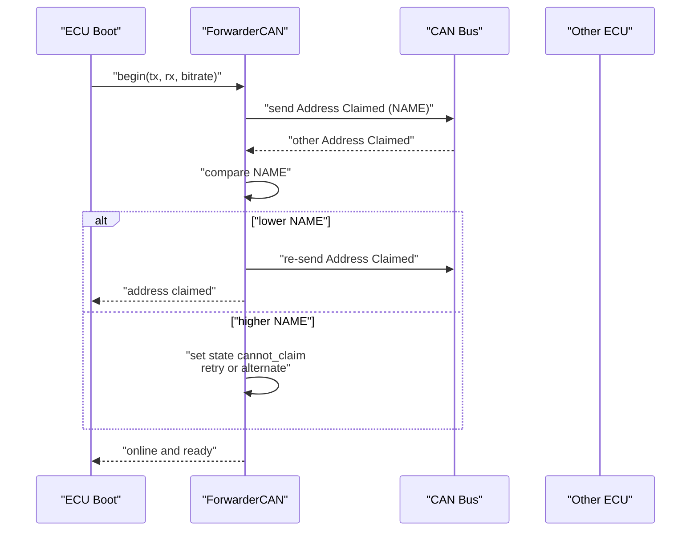
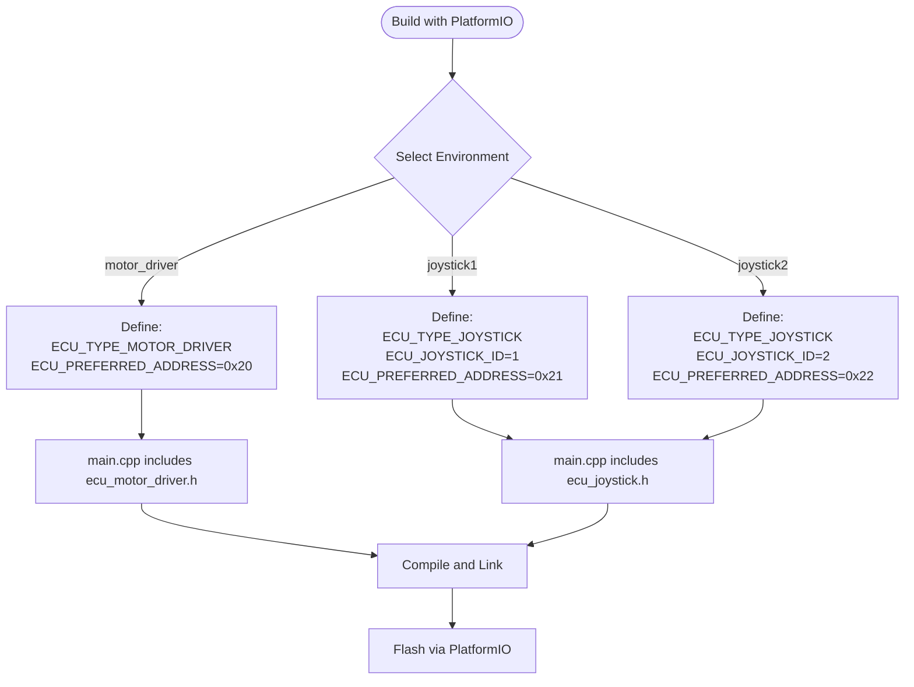

# Getting Started

<cite>
**Referenced Files in This Document**
- [README.md](file://README.md)
- [platformio.ini](file://platformio.ini)
- [src/main.cpp](file://src/main.cpp)
- [src/ecu_motor_driver.cpp](file://src/ecu_motor_driver.cpp)
- [src/ecu_motor_driver.h](file://src/ecu_motor_driver.h)
- [src/ecu_joystick.cpp](file://src/ecu_joystick.cpp)
- [src/ecu_joystick.h](file://src/ecu_joystick.h)
- [src/can_output.h](file://src/can_output.h)
- [src/ota_webserver.h](file://src/ota_webserver.h)
- [lib/ForwarderCAN/ForwarderCAN.h](file://lib/ForwarderCAN/ForwarderCAN.h)
- [lib/ForwarderCAN/ForwarderCAN.cpp](file://lib/ForwarderCAN/ForwarderCAN.cpp)
- [lib/ForwarderConfig/ForwarderConfig.cpp](file://lib/ForwarderConfig/ForwarderConfig.cpp)
</cite>

## Table of Contents
1. [Introduction](#introduction)
2. [Prerequisites](#prerequisites)
3. [Hardware Assembly](#hardware-assembly)
4. [Build and Flash Procedures](#build-and-flash-procedures)
5. [Address Claiming Process](#address-claiming-process)
6. [Compile-time ECU Type Selection](#compile-time-ecu-type-selection)
7. [Wi-Fi Access Point and OTA Web Interface](#wi-fi-access-point-and-ota-web-interface)
8. [Safety Guidelines](#safety-guidelines)
9. [Verification and Initial Testing](#verification-and-initial-testing)
10. [Troubleshooting Guide](#troubleshooting-guide)
11. [Conclusion](#conclusion)

## Introduction
ForwarderKE is an ESP32-S3-based CAN bus controller designed to replace a factory controller in a forwarder (logging machine) hydraulic valve block. It implements a J1939-like addressing scheme over 250 kbps CAN and supports three ECUs on a single bus:
- Motor Driver ECU (controls 8 solenoids via PCA9685)
- Joystick 1 ECU (reads 3 pots + 2 buttons)
- Joystick 2 ECU (reads 3 pots + 2 buttons)

The system includes address claiming, heartbeat broadcasting, and optional Wi-Fi OTA updates with a web interface.

**Section sources**
- [README.md:1-131](file://README.md#L1-L131)

## Prerequisites
- Install PlatformIO (VS Code extension or CLI)
- ESP32-S3 development environment (Arduino framework)
- Basic familiarity with CAN bus and embedded development
- Optional: Wi-Fi access point for OTA updates

**Section sources**
- [README.md:63-91](file://README.md#L63-L91)
- [platformio.ini:1-80](file://platformio.ini#L1-L80)

## Hardware Assembly
Follow these steps to assemble the hardware for each ECU type:

- MCU: LilyGO T-CAN board (ESP32-S3 with built-in CAN transceiver)
- Motor driver PCB: PCA9685 I2C PWM controller with 8 MOSFET outputs
- Joysticks: 3 potentiometers + 2 buttons each

Pin assignments (defaults):
- CAN TX: GPIO 5
- CAN RX: GPIO 4
- Status LED (WS2812): GPIO 48
- I2C SDA: GPIO 21 (motor driver only)
- I2C SCL: GPIO 22 (motor driver only)
- Pot 1: GPIO 6 (joystick only)
- Pot 2: GPIO 7 (joystick only)
- Pot 3: GPIO 15 (joystick only)
- Button 1: GPIO 16 (joystick only)
- Button 2: GPIO 17 (joystick only)

Notes:
- Motor driver ECU requires PCA9685 I2C wiring to GPIO 21/22.
- Joystick ECUs require potentiometer and button wiring per the pin table above.
- Ensure power and ground connections are secure and isolated from high-current solenoid loads.

**Section sources**
- [README.md:48-62](file://README.md#L48-L62)
- [platformio.ini:17-62](file://platformio.ini#L17-L62)

## Build and Flash Procedures
Use PlatformIO environments to build and flash firmware for each ECU:

- Motor driver ECU:
  - Build: pio run -e motor_driver
  - Flash: pio run -e motor_driver --target upload
- Joystick 1 ECU:
  - Build: pio run -e joystick1
  - Flash: pio run -e joystick1 --target upload
- Joystick 2 ECU:
  - Build: pio run -e joystick2
  - Flash: pio run -e joystick2 --target upload

OTA builds include a Wi-Fi access point and web upload interface:
- Build and flash OTA: pio run -e motor_driver_ota --target upload
- After boot, connect to the AP named forwarder-motor (or forwarder-joy1 / forwarder-joy2), password: forwarder123
- Open http://192.168.4.1 or http://forwarder-motor.local
- Upload a .bin firmware file produced by pio run -e motor_driver

**Section sources**
- [README.md:63-103](file://README.md#L63-L103)
- [platformio.ini:17-80](file://platformio.ini#L17-L80)

## Address Claiming Process
On startup, each ECU attempts to claim its preferred address using J1939-style arbitration:
- The ECU sends an Address Claimed message containing its NAME.
- If another ECU claims the same address, arbitration proceeds by comparing NAME bytes.
- The lower NAME wins; the loser retries or tries an alternate address derived from the NAME hash.
- Once claimed, the ECU broadcasts a heartbeat every second and listens for commands.

**Diagram sources**
- [lib/ForwarderCAN/ForwarderCAN.cpp:13-52](file://lib/ForwarderCAN/ForwarderCAN.cpp#L13-L52)
- [lib/ForwarderCAN/ForwarderCAN.cpp:54-119](file://lib/ForwarderCAN/ForwarderCAN.cpp#L54-L119)
- [lib/ForwarderCAN/ForwarderCAN.cpp:121-142](file://lib/ForwarderCAN/ForwarderCAN.cpp#L121-L142)

**Section sources**
- [lib/ForwarderCAN/ForwarderCAN.cpp:13-119](file://lib/ForwarderCAN/ForwarderCAN.cpp#L13-L119)
- [lib/ForwarderCAN/ForwarderCAN.h:35-72](file://lib/ForwarderCAN/ForwarderCAN.h#L35-L72)
- [README.md:105-111](file://README.md#L105-L111)

## Compile-time ECU Type Selection
The ECU type is selected at compile time via build flags:
- ECU_TYPE_MOTOR_DRIVER: Builds the motor driver firmware with PCA9685 support and solenoid control.
- ECU_TYPE_JOYSTICK: Builds the joystick firmware with potentiometer and button inputs.
- ECU_JOYSTICK_ID: Distinguishes joystick units at compile time (joystick1 vs joystick2).
- ECU_PREFERRED_ADDRESS: Sets the preferred CAN address for each ECU type.

PlatformIO environments define these flags:
- motor_driver: defines ECU_TYPE_MOTOR_DRIVER and sets preferred address 0x20
- joystick1: defines ECU_TYPE_JOYSTICK, ECU_JOYSTICK_ID=1, preferred address 0x21
- joystick2: defines ECU_TYPE_JOYSTICK, ECU_JOYSTICK_ID=2, preferred address 0x22

**Diagram sources**
- [platformio.ini:17-62](file://platformio.ini#L17-L62)
- [src/main.cpp:11-17](file://src/main.cpp#L11-L17)

**Section sources**
- [README.md:43-46](file://README.md#L43-L46)
- [platformio.ini:17-62](file://platformio.ini#L17-L62)
- [src/main.cpp:11-17](file://src/main.cpp#L11-L17)

## Wi-Fi Access Point and OTA Web Interface
OTA-enabled builds include a Wi-Fi access point and a web server for uploading firmware binaries:
- Build OTA: pio run -e motor_driver_ota --target upload
- After boot:
  - Connect to the AP named forwarder-motor (or forwarder-joy1 / forwarder-joy2)
  - Password: forwarder123
  - Open http://192.168.4.1 or http://forwarder-motor.local
  - Upload a .bin firmware file generated by pio run -e motor_driver

OTA is enabled by adding -DENABLE_OTA_WEBSERVER to the build flags for the respective environment.

**Section sources**
- [README.md:84-103](file://README.md#L84-L103)
- [platformio.ini:63-80](file://platformio.ini#L63-L80)
- [src/ota_webserver.h:1-6](file://src/ota_webserver.h#L1-L6)

## Safety Guidelines
- Address claiming prevents address collisions on the bus.
- Solenoid timeout automatically turns off outputs after 500 ms without CAN commands.
- Bus-off recovery is handled automatically by the CAN driver.
- All ECUs broadcast a heartbeat every second to indicate health.

Additional best practices:
- Isolate high-current solenoid wiring from low-voltage control signals.
- Verify CAN termination and wiring integrity before powering high-current loads.
- Use appropriate fusing and circuit protection for solenoid circuits.

**Section sources**
- [README.md:105-111](file://README.md#L105-L111)
- [src/ecu_motor_driver.cpp:330-335](file://src/ecu_motor_driver.cpp#L330-L335)
- [lib/ForwarderCAN/ForwarderCAN.cpp:42-48](file://lib/ForwarderCAN/ForwarderCAN.cpp#L42-L48)

## Verification and Initial Testing
Successful setup verification steps:
- Observe onboard LED status:
  - Solid blue indicates normal operation.
  - Blinking red indicates CAN initialization failure.
  - Fast blinking yellow indicates recent joystick activity.
- Confirm address claiming:
  - Watch serial logs for “Address 0xXX claimed successfully”.
  - Verify heartbeat messages are being sent every second.
- Motor driver verification:
  - Send a solenoid command message to address 0x21 (from joystick 1) or 0x22 (from joystick 2).
  - Confirm solenoid outputs respond and PCA9685 channels update accordingly.
- Joystick verification:
  - Move joysticks and observe potentiometer and button messages appear on the bus.
  - Confirm LED color changes when sending an LED color message.
- OTA verification (optional):
  - Connect to the AP and upload a test binary.
  - Reboot and confirm the device boots into the new firmware.

Initial testing procedures:
- Power on all ECUs and observe LED patterns.
- Use a CAN analyzer or companion app to monitor heartbeat and joystick messages.
- For motor driver, apply known joystick inputs and verify solenoid response.
- If address conflicts occur, force a new address via a Set Address CAN message and save it to persistent storage.

**Section sources**
- [README.md:105-111](file://README.md#L105-L111)
- [src/ecu_motor_driver.cpp:290-323](file://src/ecu_motor_driver.cpp#L290-L323)
- [src/ecu_joystick.cpp:159-192](file://src/ecu_joystick.cpp#L159-L192)
- [lib/ForwarderCAN/ForwarderCAN.cpp:79-119](file://lib/ForwarderCAN/ForwarderCAN.cpp#L79-L119)

## Troubleshooting Guide
Common issues and resolutions:
- CAN initialization fails:
  - Symptoms: LED blinks red rapidly.
  - Actions: Check CAN wiring (TX/RX), verify correct pins, ensure 3.3V logic levels, and confirm bus termination.
- Address claiming fails or collides:
  - Symptoms: Repeated retries or alternate address assignment.
  - Actions: Verify unique ECU_NAME values across units; check preferred address flags; ensure only one unit attempts to claim an address at a time.
- No joystick or motor driver response:
  - Symptoms: No heartbeat or solenoid movement.
  - Actions: Confirm correct environment selection (joystick1 vs joystick2), verify potentiometer and button wiring, and check PCA9685 I2C connections for motor driver.
- OTA upload fails:
  - Symptoms: Cannot connect to AP or upload page not reachable.
  - Actions: Ensure OTA environment was built and flashed, verify AP SSID/password, and confirm the device is powered and booted.

**Section sources**
- [src/ecu_motor_driver.cpp:306-316](file://src/ecu_motor_driver.cpp#L306-L316)
- [src/ecu_joystick.cpp:175-185](file://src/ecu_joystick.cpp#L175-L185)
- [README.md:84-103](file://README.md#L84-L103)

## Conclusion
You are now equipped to set up ForwarderKE ECUs, configure hardware, build and flash firmware using PlatformIO, understand the address claiming process, and perform initial verification. For OTA updates, enable the OTA environments and use the built-in web interface. Adhere to safety guidelines when working with CAN bus and solenoid circuits, and consult the troubleshooting guide for common issues.

[No sources needed since this section summarizes without analyzing specific files]