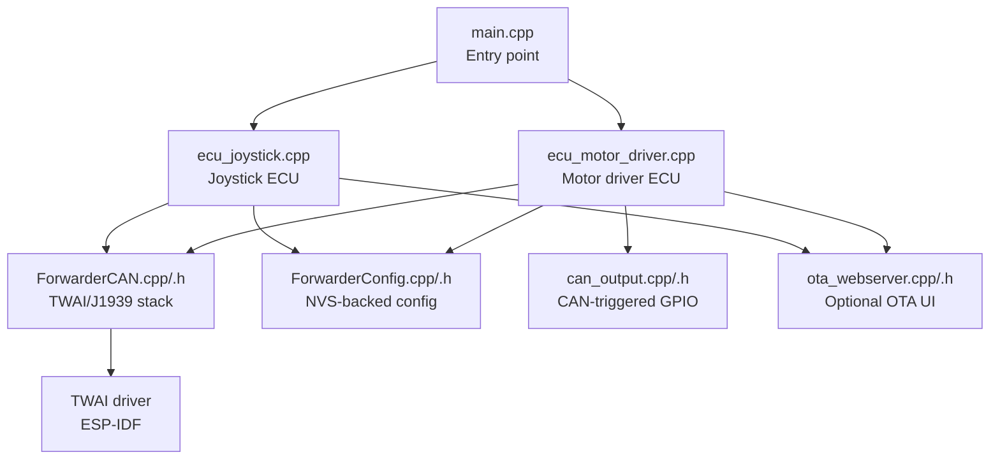
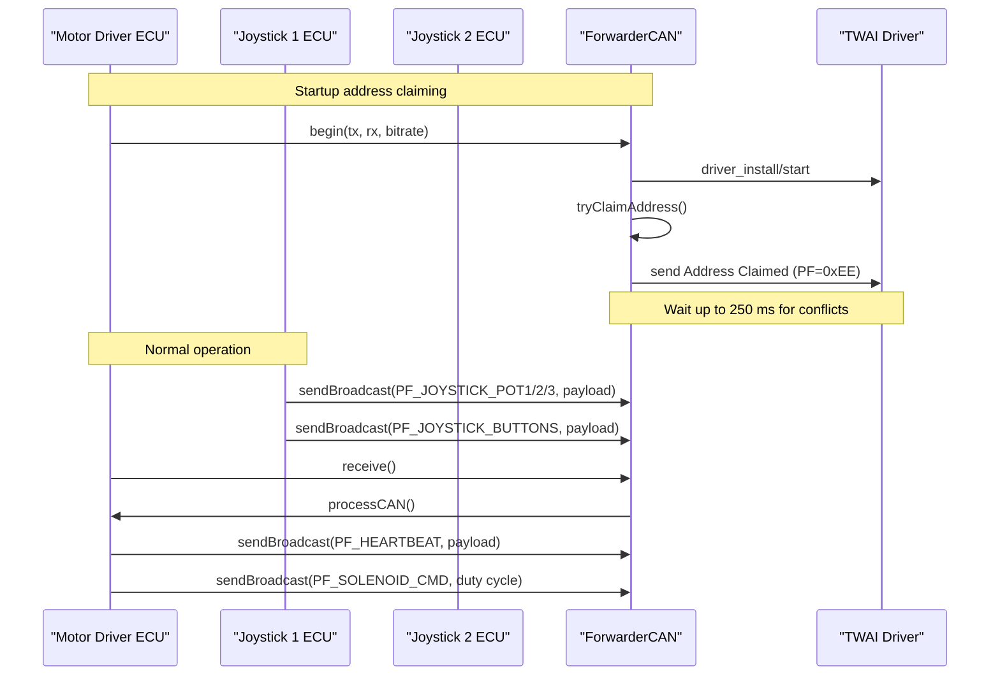
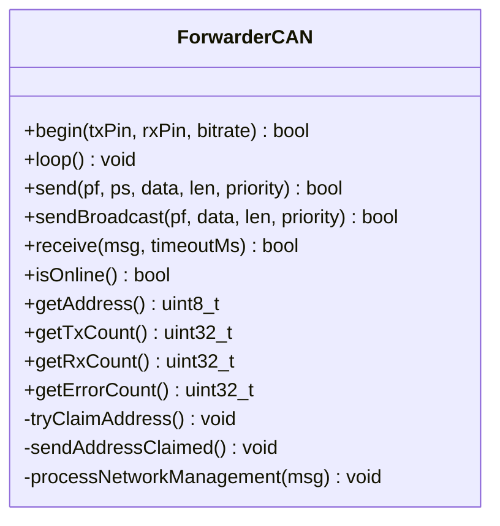
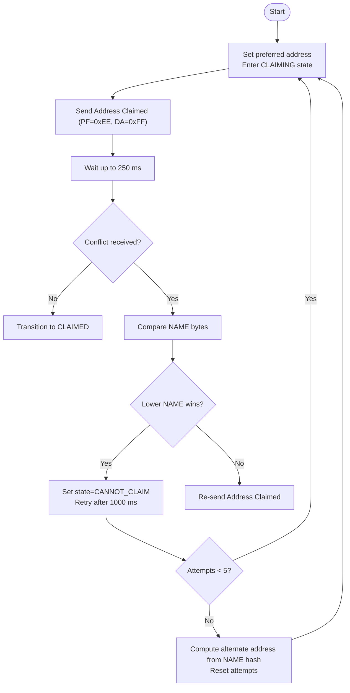
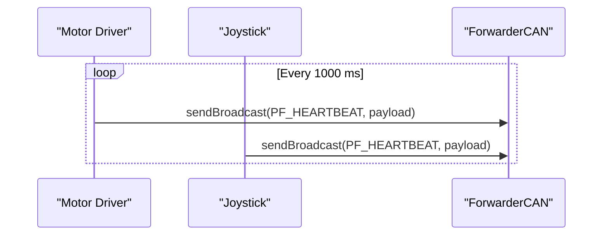
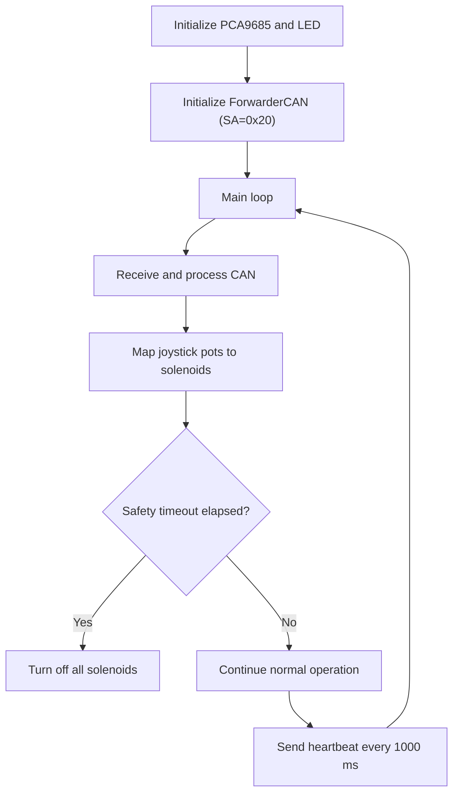
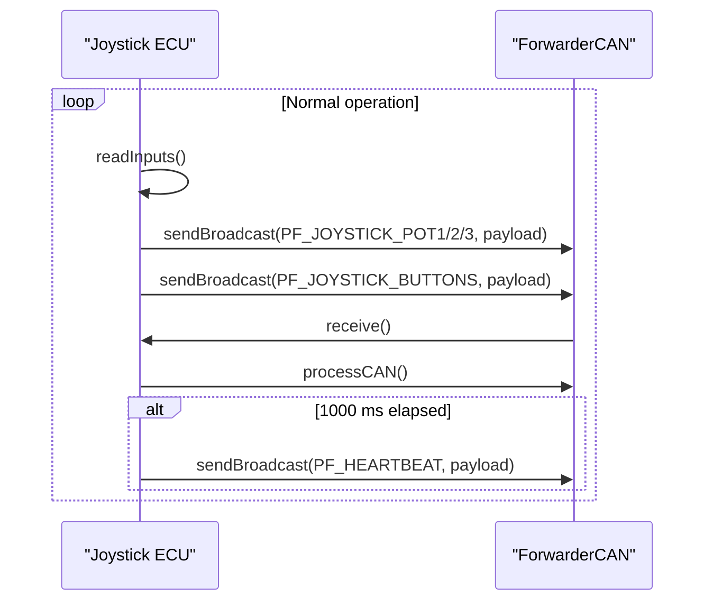
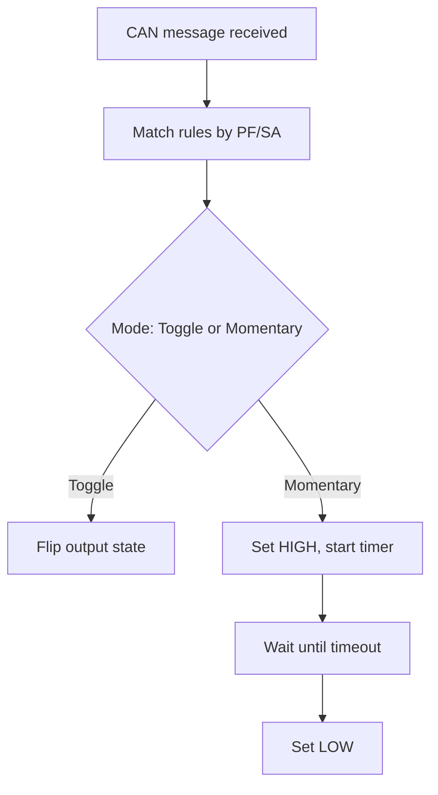
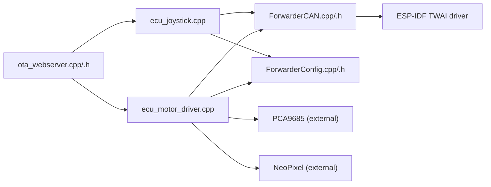

# CAN Transceiver Implementation

<cite>
**Referenced Files in This Document**
- [README.md](file://README.md)
- [platformio.ini](file://platformio.ini)
- [main.cpp](file://src/main.cpp)
- [ecu_motor_driver.cpp](file://src/ecu_motor_driver.cpp)
- [ecu_motor_driver.h](file://src/ecu_motor_driver.h)
- [ecu_joystick.cpp](file://src/ecu_joystick.cpp)
- [ecu_joystick.h](file://src/ecu_joystick.h)
- [ForwarderCAN.h](file://lib/ForwarderCAN/ForwarderCAN.h)
- [ForwarderCAN.cpp](file://lib/ForwarderCAN/ForwarderCAN.cpp)
- [ForwarderConfig.h](file://lib/ForwarderConfig/ForwarderConfig.h)
- [ForwarderConfig.cpp](file://lib/ForwarderConfig/ForwarderConfig.cpp)
- [can_output.cpp](file://src/can_output.cpp)
- [can_output.h](file://src/can_output.h)
- [ota_webserver.cpp](file://src/ota_webserver.cpp)
- [ota_webserver.h](file://src/ota_webserver.h)
- [web_state.cpp](file://src/web_state.cpp)
- [web_state.h](file://src/web_state.h)
</cite>

## Table of Contents
1. [Introduction](#introduction)
2. [Project Structure](#project-structure)
3. [Core Components](#core-components)
4. [Architecture Overview](#architecture-overview)
5. [Detailed Component Analysis](#detailed-component-analysis)
6. [Dependency Analysis](#dependency-analysis)
7. [Performance Considerations](#performance-considerations)
8. [Troubleshooting Guide](#troubleshooting-guide)
9. [Conclusion](#conclusion)

## Introduction
This document describes the CAN bus implementation for the Forwarder CAN Controller using the built-in transceiver on the LilyGO T-CAN board. It explains the J1939-like protocol with 29-bit extended IDs, addressing scheme (0x20 for motor driver, 0x21 and 0x22 for joysticks), and the message structure including priority, data page, parameter group number (PGN), and source addresses. It documents the address claiming mechanism for collision avoidance, the heartbeat broadcast system, and the TWAI controller configuration and error handling. It also covers bus topology requirements, termination considerations, and signal integrity guidelines.

## Project Structure
The project is organized into:
- A shared library for CAN/J1939 abstraction and configuration
- Two ECU implementations (motor driver and joystick)
- An optional OTA web server for diagnostics and configuration
- Build environments configured per ECU type and address

**Diagram sources**
- [main.cpp:19-31](file://src/main.cpp#L19-L31)
- [ecu_motor_driver.cpp:290-325](file://src/ecu_motor_driver.cpp#L290-L325)
- [ecu_joystick.cpp:159-192](file://src/ecu_joystick.cpp#L159-L192)
- [ForwarderCAN.cpp:13-52](file://lib/ForwarderCAN/ForwarderCAN.cpp#L13-L52)
- [ForwarderConfig.cpp:56-104](file://lib/ForwarderConfig/ForwarderConfig.cpp#L56-L104)
- [can_output.cpp:7-19](file://src/can_output.cpp#L7-L19)
- [ota_webserver.cpp:766-791](file://src/ota_webserver.cpp#L766-L791)

**Section sources**
- [README.md:112-126](file://README.md#L112-L126)
- [platformio.ini:1-80](file://platformio.ini#L1-L80)
- [main.cpp:11-17](file://src/main.cpp#L11-L17)

## Core Components
- TWAI/J1939 stack encapsulated in ForwarderCAN:
  - Implements 29-bit J1939-like ID layout with priority, data page, PF/PDU format, PS/DA, and SA
  - Provides address claiming, arbitration, and bus-off recovery
  - Exposes send/receive APIs and statistics
- ECU implementations:
  - Motor driver ECU: controls solenoids via PCA9685, processes joystick inputs, and broadcasts heartbeat
  - Joystick ECU: reads pots/buttons and publishes telemetry
- Configuration and persistence:
  - ForwarderConfig stores address overrides, axis mapping, and CAN output rules in NVS
- CAN-triggered GPIO outputs:
  - Rules to toggle or momentary pulse external GPIOs based on matching PF/SA
- Optional OTA web server:
  - Diagnostics dashboard, module discovery, remote configuration, and firmware updates

**Section sources**
- [ForwarderCAN.h:66-120](file://lib/ForwarderCAN/ForwarderCAN.h#L66-L120)
- [ForwarderCAN.cpp:13-52](file://lib/ForwarderCAN/ForwarderCAN.cpp#L13-L52)
- [ecu_motor_driver.cpp:290-325](file://src/ecu_motor_driver.cpp#L290-L325)
- [ecu_joystick.cpp:159-192](file://src/ecu_joystick.cpp#L159-L192)
- [ForwarderConfig.h:64-92](file://lib/ForwarderConfig/ForwarderConfig.h#L64-L92)
- [ForwarderConfig.cpp:56-104](file://lib/ForwarderConfig/ForwarderConfig.cpp#L56-L104)
- [can_output.cpp:7-19](file://src/can_output.cpp#L7-L19)
- [ota_webserver.cpp:766-791](file://src/ota_webserver.cpp#L766-L791)

## Architecture Overview
The system uses a J1939-like 29-bit ID layout with:
- Priority: 3 bits
- Data Page: 1 bit
- PDU Format (PF): 8 bits
- PDU Specific (PS) or Destination Address (DA): 8 bits
- Source Address (SA): 8 bits

Address claiming uses PF 0xEE (Address Claimed) and PF 0xEA (Request Address Claimed). Heartbeat broadcasts occur every second. The TWAI driver is configured via platform-specific timing configurations and supports bus-off recovery.

**Diagram sources**
- [ForwarderCAN.cpp:13-52](file://lib/ForwarderCAN/ForwarderCAN.cpp#L13-L52)
- [ForwarderCAN.cpp:54-61](file://lib/ForwarderCAN/ForwarderCAN.cpp#L54-L61)
- [ForwarderCAN.cpp:63-77](file://lib/ForwarderCAN/ForwarderCAN.cpp#L63-L77)
- [ecu_motor_driver.cpp:184-275](file://src/ecu_motor_driver.cpp#L184-L275)
- [ecu_joystick.cpp:114-144](file://src/ecu_joystick.cpp#L114-L144)

**Section sources**
- [ForwarderCAN.h:7-34](file://lib/ForwarderCAN/ForwarderCAN.h#L7-L34)
- [ForwarderCAN.cpp:79-119](file://lib/ForwarderCAN/ForwarderCAN.cpp#L79-L119)
- [ecu_motor_driver.cpp:277-288](file://src/ecu_motor_driver.cpp#L277-L288)
- [ecu_joystick.cpp:146-157](file://src/ecu_joystick.cpp#L146-L157)

## Detailed Component Analysis

### TWAI Controller and J1939-like Protocol
- ID layout and macros define priority, data page, PF, PS/DA, and SA fields
- Custom PF constants encode joystick telemetry, LED control, solenoid commands, identification, address setting, configuration, and heartbeat
- Send/receive APIs construct 29-bit extended IDs and manage data length
- Address claiming:
  - Sends Address Claimed (PF 0xEE) to DA 0xFF with 8-byte NAME
  - Waits up to 250 ms; if no conflict, transitions to claimed
  - On conflict, arbitration compares NAME bytes; lower value wins
- Bus-off recovery:
  - Periodic status polling detects bus-off state
  - Initiates recovery automatically

**Diagram sources**
- [ForwarderCAN.h:66-120](file://lib/ForwarderCAN/ForwarderCAN.h#L66-L120)
- [ForwarderCAN.cpp:13-52](file://lib/ForwarderCAN/ForwarderCAN.cpp#L13-L52)
- [ForwarderCAN.cpp:54-119](file://lib/ForwarderCAN/ForwarderCAN.cpp#L54-L119)

**Section sources**
- [ForwarderCAN.h:7-34](file://lib/ForwarderCAN/ForwarderCAN.h#L7-L34)
- [ForwarderCAN.h:38-51](file://lib/ForwarderCAN/ForwarderCAN.h#L38-L51)
- [ForwarderCAN.cpp:13-52](file://lib/ForwarderCAN/ForwarderCAN.cpp#L13-L52)
- [ForwarderCAN.cpp:54-119](file://lib/ForwarderCAN/ForwarderCAN.cpp#L54-L119)

### Address Claiming Mechanism
- Initial state starts claiming with preferred address
- Sends Address Claimed (PF 0xEE, DA 0xFF) and waits
- If no conflicting claim arrives within 250 ms, address is claimed
- If conflict occurs, compares NAME bytes; lower value wins
- Retries up to 5 attempts; after that, tries an alternate address derived from NAME hash

**Diagram sources**
- [ForwarderCAN.cpp:54-119](file://lib/ForwarderCAN/ForwarderCAN.cpp#L54-L119)
- [ForwarderCAN.cpp:121-142](file://lib/ForwarderCAN/ForwarderCAN.cpp#L121-L142)

**Section sources**
- [ForwarderCAN.cpp:54-119](file://lib/ForwarderCAN/ForwarderCAN.cpp#L54-L119)
- [ForwarderCAN.cpp:121-142](file://lib/ForwarderCAN/ForwarderCAN.cpp#L121-L142)

### Heartbeat Broadcast System
- All ECUs broadcast a heartbeat every 1000 ms when online
- Heartbeat payload includes online status, uptime, RX/TX counts, and device-specific flags
- Motor driver heartbeat encodes PCA count and channel availability
- Joystick heartbeat encodes joystick identity and counters

**Diagram sources**
- [ecu_motor_driver.cpp:277-288](file://src/ecu_motor_driver.cpp#L277-L288)
- [ecu_joystick.cpp:146-157](file://src/ecu_joystick.cpp#L146-L157)

**Section sources**
- [ecu_motor_driver.cpp:277-288](file://src/ecu_motor_driver.cpp#L277-L288)
- [ecu_joystick.cpp:146-157](file://src/ecu_joystick.cpp#L146-L157)

### CAN Message Structure and Addressing Scheme
- 29-bit extended ID layout:
  - Priority: bits 28-26
  - Data Page: bit 25
  - PDU Format (PF): bits 23-16
  - PDU Specific (PS) or Destination Address (DA): bits 15-8
  - Source Address (SA): bits 7-0
- Addressing scheme:
  - Motor driver: SA 0x20
  - Joystick 1: SA 0x21
  - Joystick 2: SA 0x22
- PF definitions:
  - Joystick telemetry: PF 0x10–0x13
  - LED control: PF 0x20
  - Solenoid command: PF 0x21
  - Identify: PF 0x22
  - Set address: PF 0x23
  - Config: PF 0x24–0x26
  - Heartbeat: PF 0x30

**Section sources**
- [ForwarderCAN.h:7-34](file://lib/ForwarderCAN/ForwarderCAN.h#L7-L34)
- [ForwarderCAN.h:38-51](file://lib/ForwarderCAN/ForwarderCAN.h#L38-L51)
- [README.md:10-14](file://README.md#L10-L14)
- [platformio.ini:17-30](file://platformio.ini#L17-L30)
- [platformio.ini:31-62](file://platformio.ini#L31-L62)

### Motor Driver ECU
- Initializes PCA9685 PWM drivers and onboard LED
- Sets up ForwarderCAN with preferred address 0x20 and ECU name
- Receives joystick pots/buttons and updates solenoid outputs
- Supports LED color control, identify, and address setting via CAN
- Broadcasts heartbeat and handles safety timeout to turn off outputs if no command received within 500 ms

**Diagram sources**
- [ecu_motor_driver.cpp:290-325](file://src/ecu_motor_driver.cpp#L290-L325)
- [ecu_motor_driver.cpp:184-275](file://src/ecu_motor_driver.cpp#L184-L275)
- [ecu_motor_driver.cpp:327-352](file://src/ecu_motor_driver.cpp#L327-L352)

**Section sources**
- [ecu_motor_driver.cpp:290-325](file://src/ecu_motor_driver.cpp#L290-L325)
- [ecu_motor_driver.cpp:184-275](file://src/ecu_motor_driver.cpp#L184-L275)
- [ecu_motor_driver.cpp:327-352](file://src/ecu_motor_driver.cpp#L327-L352)

### Joystick ECU
- Initializes inputs, onboard LED, and ForwarderCAN with preferred address 0x21 or 0x22
- Publishes joystick pots/buttons periodically and on change
- Responds to LED color, identify, and address setting commands
- Broadcasts heartbeat every 1000 ms

**Diagram sources**
- [ecu_joystick.cpp:159-192](file://src/ecu_joystick.cpp#L159-L192)
- [ecu_joystick.cpp:114-144](file://src/ecu_joystick.cpp#L114-L144)
- [ecu_joystick.cpp:194-236](file://src/ecu_joystick.cpp#L194-L236)

**Section sources**
- [ecu_joystick.cpp:159-192](file://src/ecu_joystick.cpp#L159-L192)
- [ecu_joystick.cpp:114-144](file://src/ecu_joystick.cpp#L114-L144)
- [ecu_joystick.cpp:194-236](file://src/ecu_joystick.cpp#L194-L236)

### CAN-Triggered GPIO Outputs
- Rules allow reacting to incoming CAN messages by toggling or momentary pulsing a GPIO pin
- Matching criteria include PF and optional SA
- Momentary mode pulses output for a configurable duration

**Diagram sources**
- [can_output.cpp:29-49](file://src/can_output.cpp#L29-L49)
- [can_output.cpp:51-61](file://src/can_output.cpp#L51-L61)

**Section sources**
- [can_output.cpp:7-19](file://src/can_output.cpp#L7-L19)
- [can_output.cpp:29-49](file://src/can_output.cpp#L29-L49)
- [can_output.cpp:51-61](file://src/can_output.cpp#L51-L61)
- [ForwarderConfig.h:28-39](file://lib/ForwarderConfig/ForwarderConfig.h#L28-L39)

### Configuration and Persistence
- Address override persisted in NVS under "forced_addr"
- Motor mapping stored as packed 8-byte entries per axis
- CAN output rules stored as packed 8-byte entries
- Defaults loaded when NVS keys are missing

**Section sources**
- [ForwarderConfig.h:64-92](file://lib/ForwarderConfig/ForwarderConfig.h#L64-L92)
- [ForwarderConfig.cpp:61-74](file://lib/ForwarderConfig/ForwarderConfig.cpp#L61-L74)
- [ForwarderConfig.cpp:76-104](file://lib/ForwarderConfig/ForwarderConfig.cpp#L76-L104)
- [ForwarderConfig.cpp:119-127](file://lib/ForwarderConfig/ForwarderConfig.cpp#L119-L127)
- [ForwarderConfig.cpp:129-159](file://lib/ForwarderConfig/ForwarderConfig.cpp#L129-L159)
- [ForwarderConfig.cpp:171-183](file://lib/ForwarderConfig/ForwarderConfig.cpp#L171-L183)

### OTA Web Server (Optional)
- Starts Wi-Fi AP and mDNS service
- Serves a dashboard showing joystick inputs, solenoid outputs, CAN stats, and discovered modules
- Allows remote identification, address changes, and firmware updates
- Scans heartbeats to discover modules and infer ECU types

**Section sources**
- [ota_webserver.cpp:766-791](file://src/ota_webserver.cpp#L766-L791)
- [ota_webserver.cpp:506-563](file://src/ota_webserver.cpp#L506-L563)
- [ota_webserver.cpp:740-761](file://src/ota_webserver.cpp#L740-L761)

## Dependency Analysis
The ECU implementations depend on the shared ForwarderCAN library and configuration manager. The motor driver additionally depends on PCA9685 PWM drivers and NeoPixel LEDs. The OTA web server depends on Wi-Fi, mDNS, and embedded HTML/CSS/JS.

**Diagram sources**
- [ecu_motor_driver.cpp:8-12](file://src/ecu_motor_driver.cpp#L8-L12)
- [ecu_joystick.cpp:5-9](file://src/ecu_joystick.cpp#L5-L9)
- [ForwarderCAN.cpp:13-52](file://lib/ForwarderCAN/ForwarderCAN.cpp#L13-L52)
- [ota_webserver.cpp:5-12](file://src/ota_webserver.cpp#L5-L12)

**Section sources**
- [ecu_motor_driver.cpp:8-12](file://src/ecu_motor_driver.cpp#L8-L12)
- [ecu_joystick.cpp:5-9](file://src/ecu_joystick.cpp#L5-L9)
- [ForwarderCAN.cpp:13-52](file://lib/ForwarderCAN/ForwarderCAN.cpp#L13-L52)
- [ota_webserver.cpp:5-12](file://src/ota_webserver.cpp#L5-L12)

## Performance Considerations
- TWAI queue sizes are tuned (tx queue depth 16, rx queue depth 32) to handle bursts of joystick telemetry and heartbeat traffic
- Heartbeat interval balances visibility with bandwidth usage
- Safety timeout prevents unintended actuator activation if CAN communication fails
- Bus-off recovery avoids manual intervention by automatically re-entering the bus when detected

[No sources needed since this section provides general guidance]

## Troubleshooting Guide
- CAN initialization failure:
  - The motor driver flashes LED and loops if ForwarderCAN begin() fails
  - Verify wiring and platformio.ini pin assignments for LilyGO T-CAN defaults (TX=5, RX=4)
- Address conflicts:
  - If claiming fails, the device retries up to 5 times; after that it tries an alternate address derived from NAME hash
  - Use the OTA dashboard to identify modules and adjust addresses if needed
- Bus-off state:
  - The stack detects bus-off and initiates recovery automatically; persistent error counters track occurrences
- Heartbeat monitoring:
  - Use the OTA dashboard to confirm presence and uptime of other ECUs
- Safety timeout:
  - If no joystick commands are received for 500 ms, motor driver turns off solenoids

**Section sources**
- [ecu_motor_driver.cpp:305-316](file://src/ecu_motor_driver.cpp#L305-L316)
- [ForwarderCAN.cpp:82-89](file://lib/ForwarderCAN/ForwarderCAN.cpp#L82-L89)
- [ForwarderCAN.cpp:98-109](file://lib/ForwarderCAN/ForwarderCAN.cpp#L98-L109)
- [ota_webserver.cpp:740-761](file://src/ota_webserver.cpp#L740-L761)
- [ecu_motor_driver.cpp:332-337](file://src/ecu_motor_driver.cpp#L332-L337)

## Conclusion
The Forwarder CAN Controller implements a robust J1939-like CAN bus system on the LilyGO T-CAN board using the ESP32-S3 TWAI controller. It features deterministic addressing (0x20, 0x21, 0x22), reliable address claiming with arbitration, periodic heartbeat broadcasting, and practical safety mechanisms. The modular design separates protocol logic (ForwarderCAN), configuration (NVS), and ECU-specific behavior, enabling maintainable and extensible operation across multiple ECUs.