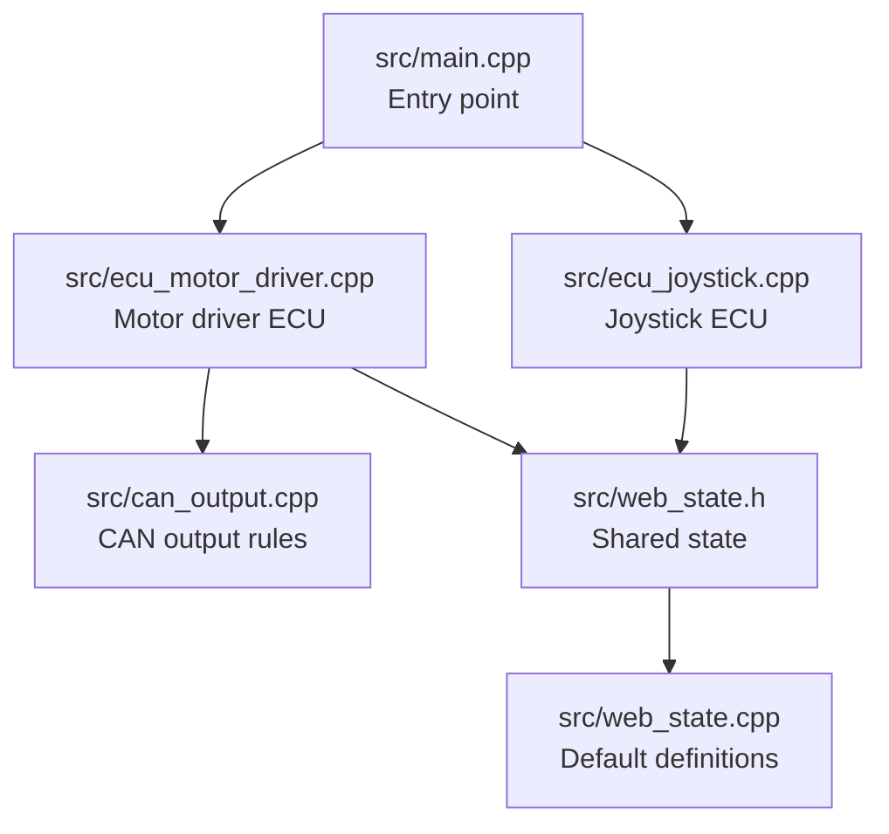
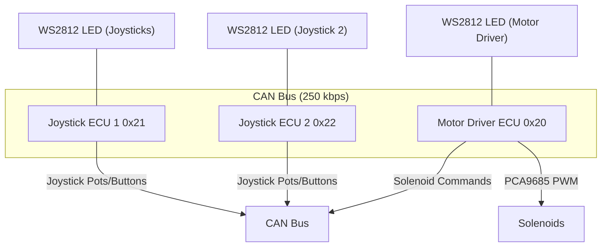
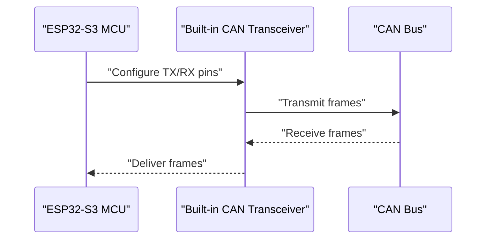
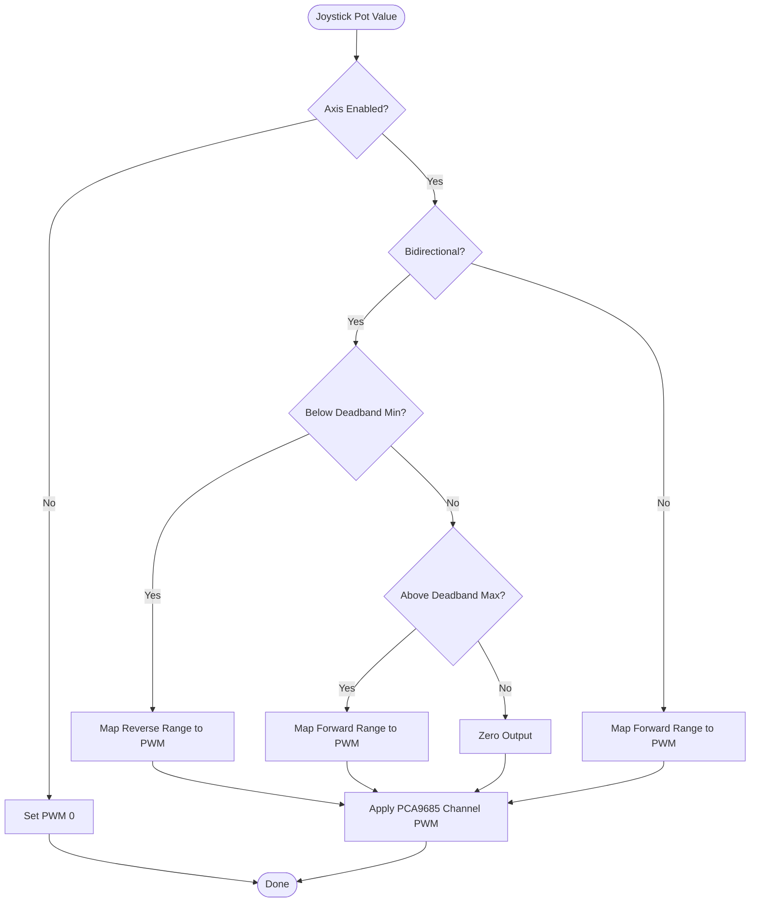
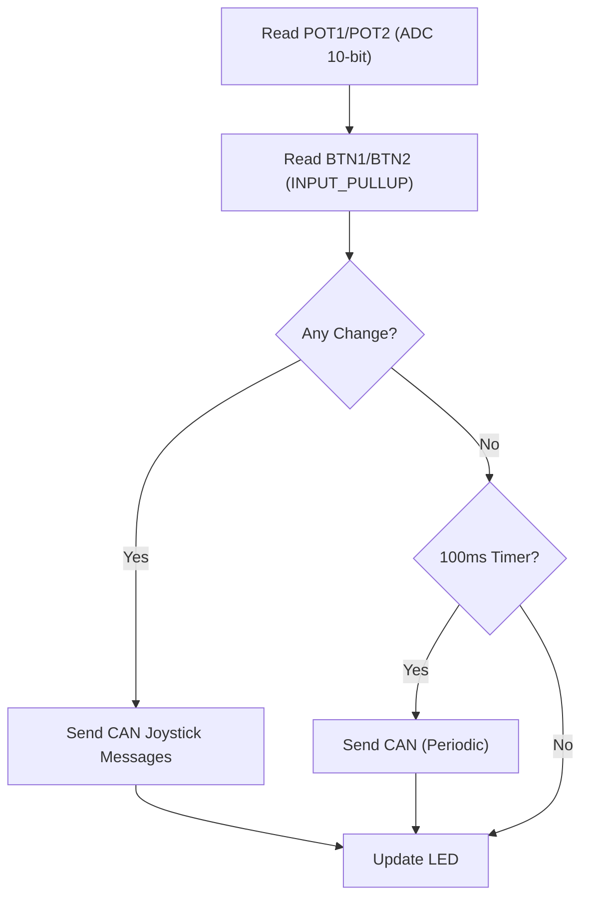
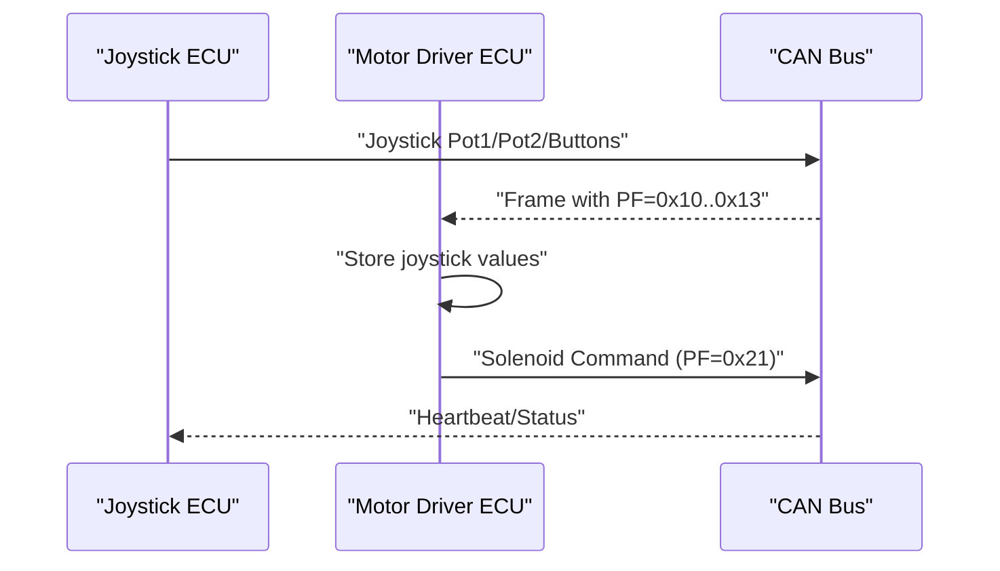
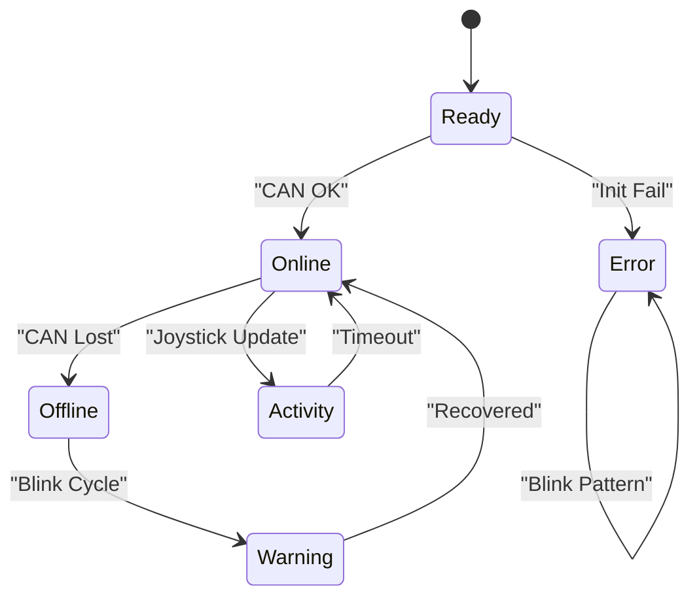
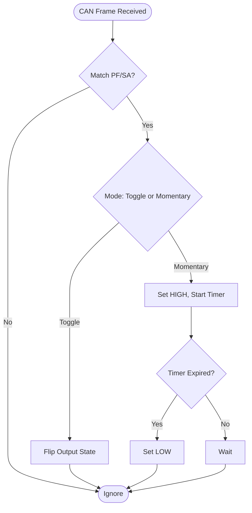
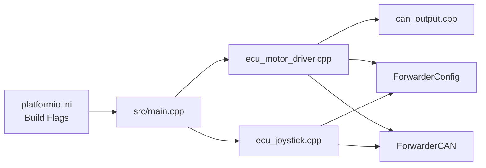

# Hardware Architecture

<cite>
**Referenced Files in This Document**
- [README.md](file://README.md)
- [platformio.ini](file://platformio.ini)
- [src/main.cpp](file://src/main.cpp)
- [src/ecu_motor_driver.cpp](file://src/ecu_motor_driver.cpp)
- [src/ecu_joystick.cpp](file://src/ecu_joystick.cpp)
- [src/can_output.cpp](file://src/can_output.cpp)
- [src/web_state.h](file://src/web_state.h)
- [src/web_state.cpp](file://src/web_state.cpp)
</cite>

## Table of Contents
1. [Introduction](#introduction)
2. [Project Structure](#project-structure)
3. [Core Components](#core-components)
4. [Architecture Overview](#architecture-overview)
5. [Detailed Component Analysis](#detailed-component-analysis)
6. [Dependency Analysis](#dependency-analysis)
7. [Performance Considerations](#performance-considerations)
8. [Troubleshooting Guide](#troubleshooting-guide)
9. [Conclusion](#conclusion)
10. [Appendices](#appendices)

## Introduction
This document describes the hardware architecture of ForwarderKE, focusing on the physical system design and component interconnections. It covers the MCU board, CAN transceiver, peripheral pin assignments, PCA9685 PWM controller for solenoid control, joystick input circuitry, CAN bus topology, and safety considerations for high-current solenoid loads.

## Project Structure
The hardware design is implemented across a small set of source files and build environments. The entry point selects the ECU type at compile time, and each ECU type initializes its own peripherals and CAN stack.

**Diagram sources**
- [src/main.cpp:19-31](file://src/main.cpp#L19-L31)
- [src/ecu_motor_driver.cpp:290-323](file://src/ecu_motor_driver.cpp#L290-L323)
- [src/ecu_joystick.cpp:159-192](file://src/ecu_joystick.cpp#L159-L192)
- [src/can_output.cpp:7-19](file://src/can_output.cpp#L7-L19)
- [src/web_state.h:10-23](file://src/web_state.h#L10-L23)
- [src/web_state.cpp:3-19](file://src/web_state.cpp#L3-L19)

**Section sources**
- [src/main.cpp:19-31](file://src/main.cpp#L19-L31)
- [README.md:112-126](file://README.md#L112-L126)

## Core Components
- MCU and Board: ESP32-S3-based LilyGO T-CAN board with integrated CAN transceiver.
- CAN Bus: 250 kbps, 29-bit extended IDs using J1939-like addressing.
- Motor Driver ECU: Controls up to 16 solenoids via PCA9685 I2C PWM drivers.
- Joystick ECUs: Read 3 potentiometers and 2 buttons, publish joystick data on CAN.
- Status LED: Single WS2812 RGB LED for system status indication.
- Optional OTA: Wi-Fi AP and web server for firmware updates.

**Section sources**
- [README.md:16-21](file://README.md#L16-L21)
- [README.md:22-46](file://README.md#L22-L46)
- [platformio.ini:17-30](file://platformio.ini#L17-L30)
- [platformio.ini:31-62](file://platformio.ini#L31-L62)

## Architecture Overview
The system consists of three ECUs on a single 250 kbps CAN bus:
- Motor Driver ECU (address 0x20): Receives solenoid commands and controls PCA9685 channels.
- Joystick ECU 1 (address 0x21): Publishes joystick potentiometer values and button states.
- Joystick ECU 2 (address 0x22): Identical to ECU 1, compiled for a different unit.

**Diagram sources**
- [README.md:8-14](file://README.md#L8-L14)
- [README.md:31-41](file://README.md#L31-L41)
- [platformio.ini:17-30](file://platformio.ini#L17-L30)
- [platformio.ini:31-62](file://platformio.ini#L31-L62)

## Detailed Component Analysis

### ESP32-S3 LilyGO T-CAN Board and CAN Transceiver
- Built-in CAN transceiver pins are mapped to MCU GPIOs.
- Motor Driver ECU uses GPIO 5 (TX) and GPIO 4 (RX) for CAN.
- Joystick ECUs define separate CAN pins and optional SE pin for transceiver enable.

**Diagram sources**
- [README.md:48-62](file://README.md#L48-L62)
- [platformio.ini:23-24](file://platformio.ini#L23-L24)
- [platformio.ini:38-40](file://platformio.ini#L38-L40)
- [platformio.ini:54-56](file://platformio.ini#L54-L56)

**Section sources**
- [README.md:18](file://README.md#L18)
- [README.md:48-62](file://README.md#L48-L62)
- [platformio.ini:17-30](file://platformio.ini#L17-L30)
- [platformio.ini:31-62](file://platformio.ini#L31-L62)

### PCA9685 PWM Controller for Solenoid Control
- I2C addresses: PCA9685_I2C_ADDR1 (default 0x40), PCA9685_I2C_ADDR2 (default 0x41).
- Two PCA9685 chips can be present for up to 16 channels (8 per chip).
- PWM frequency configured to 200 Hz; 12-bit precision internally mapped from 8-bit duty cycle.
- Motor driver reads joystick pot values and maps them to solenoid PWM outputs with deadband and direction logic.

**Diagram sources**
- [src/ecu_motor_driver.cpp:101-135](file://src/ecu_motor_driver.cpp#L101-L135)
- [src/ecu_motor_driver.cpp:69-76](file://src/ecu_motor_driver.cpp#L69-L76)
- [platformio.ini:26-28](file://platformio.ini#L26-L28)

**Section sources**
- [README.md:19](file://README.md#L19)
- [platformio.ini:26-28](file://platformio.ini#L26-L28)
- [src/ecu_motor_driver.cpp:85-99](file://src/ecu_motor_driver.cpp#L85-L99)
- [src/ecu_motor_driver.cpp:101-135](file://src/ecu_motor_driver.cpp#L101-L135)
- [src/ecu_motor_driver.cpp:69-76](file://src/ecu_motor_driver.cpp#L69-L76)

### Joystick Input Circuitry (3 Potentiometers + 2 Buttons)
- Potentiometer inputs: ADC resolution 10-bit with 11 dB attenuation.
- Buttons: Active-low with internal pull-up resistors.
- LED status: WS2812 RGB LED indicates connection and identification states.

**Diagram sources**
- [src/ecu_joystick.cpp:63-68](file://src/ecu_joystick.cpp#L63-L68)
- [src/ecu_joystick.cpp:194-236](file://src/ecu_joystick.cpp#L194-L236)
- [src/ecu_joystick.cpp:163-166](file://src/ecu_joystick.cpp#L163-L166)

**Section sources**
- [README.md:57-61](file://README.md#L57-L61)
- [src/ecu_joystick.cpp:63-68](file://src/ecu_joystick.cpp#L63-L68)
- [src/ecu_joystick.cpp:163-166](file://src/ecu_joystick.cpp#L163-L166)

### CAN Bus Topology, Termination, and Signal Integrity
- Bitrate: 250 kbps.
- Extended ID format: Priority(3) | DP(1) | PF(8) | PS/DA(8) | SA(8).
- Addressing: ECU addresses 0x20 (Motor Driver), 0x21 (Joystick 1), 0x22 (Joystick 2).
- Termination: Recommended 120 Ω termination resistors at both ends of the bus.
- Signal integrity: Keep CAN pair traces short and equal length; avoid high-frequency noise near analog inputs.

**Diagram sources**
- [README.md:24-41](file://README.md#L24-L41)
- [README.md:8-14](file://README.md#L8-L14)

**Section sources**
- [README.md:22-27](file://README.md#L22-L27)
- [README.md:29-41](file://README.md#L29-L41)
- [README.md:8-14](file://README.md#L8-L14)

### Status LED Indication
- WS2812 LED is used for system status:
  - Solid green: Ready.
  - Blinking amber: Offline or warning.
  - Fast blinking: Activity from joystick input.
  - White flash: Identify command response.
  - Error pattern: Rapid off/on during initialization failure.

**Diagram sources**
- [src/ecu_motor_driver.cpp:153-182](file://src/ecu_motor_driver.cpp#L153-L182)
- [src/ecu_joystick.cpp:70-97](file://src/ecu_joystick.cpp#L70-L97)

**Section sources**
- [README.md:54](file://README.md#L54)
- [src/ecu_motor_driver.cpp:153-182](file://src/ecu_motor_driver.cpp#L153-L182)
- [src/ecu_joystick.cpp:70-97](file://src/ecu_joystick.cpp#L70-L97)

### CAN Output Rules (External GPIO Outputs)
- Optional feature allowing mapping of incoming CAN messages to external GPIO pins.
- Supports toggle and momentary modes with configurable pulse duration.
- Useful for auxiliary outputs beyond solenoids.

**Diagram sources**
- [src/can_output.cpp:29-49](file://src/can_output.cpp#L29-L49)
- [src/can_output.cpp:51-61](file://src/can_output.cpp#L51-L61)

**Section sources**
- [src/can_output.cpp:7-19](file://src/can_output.cpp#L7-L19)
- [src/can_output.cpp:29-49](file://src/can_output.cpp#L29-L49)
- [src/can_output.cpp:51-61](file://src/can_output.cpp#L51-L61)

## Dependency Analysis
- Build-time selection determines which ECU logic is linked:
  - ECU_TYPE_MOTOR_DRIVER: Includes PCA9685, motor mapping, heartbeat, and CAN output rules.
  - ECU_TYPE_JOYSTICK: Includes ADC/button reading, LED control, and periodic CAN publishing.
- Shared CAN/J1939 protocol and configuration are provided by the ForwarderCAN and ForwarderConfig libraries referenced in the build.

**Diagram sources**
- [platformio.ini:17-30](file://platformio.ini#L17-L30)
- [platformio.ini:31-62](file://platformio.ini#L31-L62)
- [src/main.cpp:11-17](file://src/main.cpp#L11-L17)
- [src/ecu_motor_driver.cpp:8-12](file://src/ecu_motor_driver.cpp#L8-L12)
- [src/ecu_joystick.cpp:5-9](file://src/ecu_joystick.cpp#L5-L9)

**Section sources**
- [src/main.cpp:11-17](file://src/main.cpp#L11-L17)
- [platformio.ini:17-30](file://platformio.ini#L17-L30)
- [platformio.ini:31-62](file://platformio.ini#L31-L62)

## Performance Considerations
- CAN bitrate: 250 kbps balances responsiveness and reliability for this application.
- Joystick update cadence: Values sent when changed beyond a threshold or periodically every 100 ms.
- Motor driver safety: All solenoids are turned off after 500 ms without a valid command.
- LED refresh: Throttled to ~20 FPS to reduce CPU load.
- I2C bus speed: PCA9685 initialized at 200 Hz PWM; keep I2C polling minimal.

[No sources needed since this section provides general guidance]

## Troubleshooting Guide
- CAN initialization failure: Motor driver and joystick ECUs enter a blinking red error pattern until resolved.
- No joystick data reaching solenoids: Verify joystick address and that Motor Driver ECU is online; check heartbeat messages.
- PCA9685 not responding: Confirm I2C pins and addresses; the driver auto-detects a second PCA9685 at 0x41.
- Buttons not registering: Ensure pull-up configuration and active-low wiring; debounce is handled in firmware logic.
- OTA upload issues: Confirm Wi-Fi AP SSID/password and web UI availability.

**Section sources**
- [src/ecu_motor_driver.cpp:305-316](file://src/ecu_motor_driver.cpp#L305-L316)
- [src/ecu_joystick.cpp:175-185](file://src/ecu_joystick.cpp#L175-L185)
- [README.md:105-111](file://README.md#L105-L111)

## Conclusion
ForwarderKE’s hardware architecture centers on an ESP32-S3-based board with integrated CAN transceiver, a robust J1939-like CAN protocol, and flexible ECU roles. The Motor Driver ECU controls up to 16 solenoids via PCA9685, while Joystick ECUs capture analog inputs and buttons and publish them over CAN. Proper CAN topology, termination, and grounding are essential for reliable operation, especially with high-current solenoid loads.

[No sources needed since this section summarizes without analyzing specific files]

## Appendices

### Pin Assignments and Peripherals
- CAN TX/RX: GPIO 5/4 (Motor Driver), GPIO 27/26 (Joystick), optional GPIO 23 SE (Joystick).
- WS2812 LED: GPIO 48 (Motor Driver), GPIO 18 (Joystick).
- I2C SDA/SCL: GPIO 21/22 for PCA9685.
- Joystick ADC: GPIO 6/7/15 for pots; buttons on GPIO 16/17 with internal pull-up.
- PCA9685 I2C addresses: 0x40 (primary), 0x41 (detected automatically).

**Section sources**
- [README.md:48-62](file://README.md#L48-L62)
- [platformio.ini:23-28](file://platformio.ini#L23-L28)
- [platformio.ini:38-45](file://platformio.ini#L38-L45)
- [platformio.ini:54-61](file://platformio.ini#L54-L61)

### Power Supply and Load Characteristics
- PCA9685 operates on 5 V; ensure adequate current capacity for 16 MOSFET outputs.
- Solenoid coil inductance and peak current must be considered; use flyback diodes and appropriate wiring gauge.
- Ground planes under the motor driver PCB help minimize noise and voltage drops.

[No sources needed since this section provides general guidance]

### Safety Considerations for High-Current Loads
- Implement a watchdog that disables solenoids after a timeout if no CAN command is received.
- Use separate power supplies or heavy-gauge wiring for solenoids to avoid brown-out conditions.
- Maintain a solid ground connection and avoid long ground loops near sensitive analog signals.

**Section sources**
- [README.md:105-111](file://README.md#L105-L111)
- [src/ecu_motor_driver.cpp:330-335](file://src/ecu_motor_driver.cpp#L330-L335)